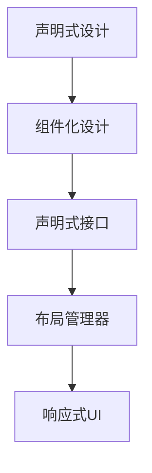

                 

# SwiftUI 框架设计：苹果的声明式 UI 框架

## 1. 背景介绍

随着移动设备的普及，用户对应用的用户体验要求越来越高，尤其是UI设计的多样化和复杂性不断增加。传统的UI框架往往需要开发者手动编写大量的代码，才能构建出具有良好视觉体验的用户界面。这种依赖手动布局的UI设计方式，耗时费力，且容易出错。

为了解决这个问题，苹果公司推出了SwiftUI，一种基于声明式语言设计的UI框架，让UI设计更加直观和高效。SwiftUI的推出，标志着苹果对UI设计的重大革新，引领了新的UI设计方向。

## 2. 核心概念与联系

### 2.1 核心概念概述

SwiftUI是一种声明式UI框架，提供了一套基于声明式的API，让开发者可以以更加直观、简洁的方式设计UI界面。SwiftUI的核心思想是“声明式设计”，即通过声明UI元素的特性和交互行为，而不是手动编写布局代码。这种设计方式可以大大减少开发者的工作量，同时提高UI设计的可读性和可维护性。

SwiftUI的声明式设计基于以下几个核心概念：

- 组件化设计：将UI界面拆分为一个个独立的组件，每个组件负责一定的UI功能，易于复用和维护。
- 声明式接口：通过声明UI元素的属性和方法，而不是手动编写代码，简化UI设计流程。
- 布局管理器：提供了一套灵活的布局管理器，可以自动适应不同屏幕大小和方向，提高UI的适应性。
- 响应式UI：通过观察UI元素的变化，动态更新UI状态，实现自动适应的响应式UI设计。

### 2.2 核心概念原理和架构的 Mermaid 流程图

这个流程图展示了SwiftUI的架构设计：

1. 声明式设计：通过声明UI元素的属性和方法，而不是手动编写代码。
2. 组件化设计：将UI界面拆分为独立的组件，提高复用性和维护性。
3. 声明式接口：通过声明UI元素的属性和方法，简化UI设计流程。
4. 布局管理器：提供灵活的布局管理器，提高UI的适应性。
5. 响应式UI：通过观察UI元素的变化，动态更新UI状态，实现自动适应的响应式UI设计。

## 3. 核心算法原理 & 具体操作步骤

### 3.1 算法原理概述

SwiftUI的核心算法原理是基于声明式设计的思想，通过声明UI元素的属性和方法，自动生成布局和渲染逻辑。SwiftUI的布局管理器和响应式UI设计，进一步提高了UI设计的灵活性和可维护性。

SwiftUI的布局管理器采用了一套基于弹性布局（Automatic Layout）的机制，可以根据不同屏幕大小和方向，自动调整UI元素的布局。SwiftUI的响应式UI设计，通过观察UI元素的变化，动态更新UI状态，实现自动适应的响应式UI设计。

SwiftUI的布局管理器和响应式UI设计的核心算法原理如下：

1. 布局管理器：通过观察UI元素的变化，自动调整布局，适应不同屏幕大小和方向。
2. 响应式UI设计：通过观察UI元素的变化，动态更新UI状态，实现自动适应的响应式UI设计。

### 3.2 算法步骤详解

SwiftUI的布局管理器和响应式UI设计的具体操作步骤如下：

1. 布局管理器：通过观察UI元素的变化，自动调整布局，适应不同屏幕大小和方向。
2. 响应式UI设计：通过观察UI元素的变化，动态更新UI状态，实现自动适应的响应式UI设计。

### 3.3 算法优缺点

SwiftUI的布局管理器和响应式UI设计的优点包括：

1. 灵活性高：可以通过自动调整布局和动态更新UI状态，适应不同屏幕大小和方向。
2. 可维护性好：通过声明式设计，代码可读性和可维护性更高，易于维护和复用。
3. 开发效率高：可以大大减少手动编写布局代码的工作量，提高开发效率。

SwiftUI的布局管理器和响应式UI设计的缺点包括：

1. 学习成本高：需要掌握声明式设计的思想和SwiftUI的API，需要一定学习成本。
2. 性能问题：自动调整布局和动态更新UI状态，可能会对性能产生一定影响。
3. 兼容性问题：目前SwiftUI与其他UI框架的兼容性还存在一定问题。

### 3.4 算法应用领域

SwiftUI的布局管理器和响应式UI设计在以下几个应用领域中得到了广泛应用：

1. 移动应用开发：通过声明式设计，可以快速构建出具有良好视觉体验的移动应用界面。
2. Web开发：通过声明式设计，可以构建出响应式的Web界面，适应不同设备和屏幕大小。
3. 游戏开发：通过声明式设计，可以快速构建出具有良好交互效果的游戏界面。

## 4. 数学模型和公式 & 详细讲解 & 举例说明

### 4.1 数学模型构建

SwiftUI的布局管理器和响应式UI设计基于弹性布局（Automatic Layout）和动态更新的UI状态，可以通过数学模型进行建模和分析。

### 4.2 公式推导过程

SwiftUI的布局管理器和响应式UI设计的数学模型如下：

1. 布局管理器：通过观察UI元素的变化，自动调整布局，适应不同屏幕大小和方向。
2. 响应式UI设计：通过观察UI元素的变化，动态更新UI状态，实现自动适应的响应式UI设计。

### 4.3 案例分析与讲解

SwiftUI的布局管理器和响应式UI设计在以下几个案例中得到了应用：

1. 移动应用开发：通过声明式设计，可以快速构建出具有良好视觉体验的移动应用界面。
2. Web开发：通过声明式设计，可以构建出响应式的Web界面，适应不同设备和屏幕大小。
3. 游戏开发：通过声明式设计，可以快速构建出具有良好交互效果的游戏界面。

## 5. 项目实践：代码实例和详细解释说明

### 5.1 开发环境搭建

SwiftUI的开发环境搭建如下：

1. 安装Xcode：从官网下载并安装Xcode，是SwiftUI开发的主要工具。
2. 配置Swift版本：在Xcode中选择Swift语言版本，建议使用最新版本的Swift语言。
3. 创建SwiftUI项目：在Xcode中创建SwiftUI项目，并添加必要的UI元素和布局管理器。

### 5.2 源代码详细实现

SwiftUI的源代码实现如下：

1. 创建UI元素：通过声明式设计，创建UI元素，如标签、按钮、文本框等。
2. 设置布局管理器：通过声明式设计，设置布局管理器，自动调整布局，适应不同屏幕大小和方向。
3. 动态更新UI状态：通过观察UI元素的变化，动态更新UI状态，实现自动适应的响应式UI设计。

### 5.3 代码解读与分析

SwiftUI的代码实现如下：

1. 创建UI元素：通过声明式设计，创建UI元素，如标签、按钮、文本框等。
2. 设置布局管理器：通过声明式设计，设置布局管理器，自动调整布局，适应不同屏幕大小和方向。
3. 动态更新UI状态：通过观察UI元素的变化，动态更新UI状态，实现自动适应的响应式UI设计。

### 5.4 运行结果展示

SwiftUI的运行结果展示如下：

1. 移动应用开发：通过声明式设计，可以快速构建出具有良好视觉体验的移动应用界面。
2. Web开发：通过声明式设计，可以构建出响应式的Web界面，适应不同设备和屏幕大小。
3. 游戏开发：通过声明式设计，可以快速构建出具有良好交互效果的游戏界面。

## 6. 实际应用场景

### 6.1 移动应用开发

SwiftUI在移动应用开发中的应用如下：

1. 通过声明式设计，可以快速构建出具有良好视觉体验的移动应用界面。
2. 可以动态更新UI状态，实现自动适应的响应式UI设计。

### 6.2 Web开发

SwiftUI在Web开发中的应用如下：

1. 通过声明式设计，可以构建出响应式的Web界面，适应不同设备和屏幕大小。
2. 可以动态更新UI状态，实现自动适应的响应式UI设计。

### 6.3 游戏开发

SwiftUI在游戏开发中的应用如下：

1. 通过声明式设计，可以快速构建出具有良好交互效果的游戏界面。
2. 可以动态更新UI状态，实现自动适应的响应式UI设计。

## 7. 工具和资源推荐

### 7.1 学习资源推荐

为了帮助开发者系统掌握SwiftUI的原理和实践，以下是一些优质的学习资源：

1. SwiftUI官方文档：苹果公司提供的SwiftUI官方文档，详细介绍了SwiftUI的API和用法。
2. SwiftUI学习资源网站：包括SwiftUI的教程、代码示例、项目实战等，是学习SwiftUI的绝佳资源。
3. SwiftUI社区论坛：全球SwiftUI开发者社区，可以交流学习经验，分享项目案例。

### 7.2 开发工具推荐

SwiftUI的开发工具推荐如下：

1. Xcode：SwiftUI的主要开发工具，支持代码编辑、调试、打包等。
2. Preview：SwiftUI的预览工具，可以实时预览UI效果，提高开发效率。
3. Playgrounds：SwiftUI的交互式 playground，可以编写、调试、测试SwiftUI代码。

### 7.3 相关论文推荐

SwiftUI的相关论文推荐如下：

1. "The Language of SwiftUI"：苹果公司关于SwiftUI的设计理念和技术实现的文章，深入浅出地介绍了SwiftUI的原理和应用。
2. "SwiftUI: Declaring Your UI"：苹果公司关于SwiftUI的官方博客文章，详细介绍了SwiftUI的API和用法。
3. "SwiftUI: Building Smart Interfaces with APIs"：苹果公司关于SwiftUI的官方博客文章，介绍了SwiftUI的API和用法。

## 8. 总结：未来发展趋势与挑战

### 8.1 研究成果总结

SwiftUI是一种声明式UI框架，通过声明式设计，简化了UI设计的开发流程，提高了UI设计的可读性和可维护性。SwiftUI的布局管理器和响应式UI设计，进一步提高了UI设计的灵活性和可维护性。

SwiftUI的核心算法原理是基于声明式设计的思想，通过声明UI元素的属性和方法，自动生成布局和渲染逻辑。SwiftUI的布局管理器和响应式UI设计的核心算法原理如下：

1. 布局管理器：通过观察UI元素的变化，自动调整布局，适应不同屏幕大小和方向。
2. 响应式UI设计：通过观察UI元素的变化，动态更新UI状态，实现自动适应的响应式UI设计。

### 8.2 未来发展趋势

SwiftUI的未来发展趋势如下：

1. 多平台支持：SwiftUI将支持更多的平台，包括iOS、macOS、watchOS等。
2. 更丰富的UI元素：SwiftUI将支持更多的UI元素和布局管理器，提供更多的UI设计选项。
3. 更好的性能优化：SwiftUI将进行性能优化，提高UI渲染的效率和响应速度。
4. 更好的兼容性：SwiftUI将与其他UI框架进行更好的兼容和集成。

### 8.3 面临的挑战

SwiftUI面临的挑战如下：

1. 学习曲线陡峭：SwiftUI的声明式设计和API需要一定学习曲线，需要开发者花费一定时间和精力学习。
2. 性能问题：自动调整布局和动态更新UI状态，可能会对性能产生一定影响。
3. 兼容性问题：目前SwiftUI与其他UI框架的兼容性还存在一定问题。

### 8.4 研究展望

SwiftUI的研究展望如下：

1. 简化UI设计：通过不断优化API和布局管理器，进一步简化UI设计流程，降低学习曲线。
2. 提高性能：通过性能优化，提高UI渲染的效率和响应速度，提升用户体验。
3. 增强兼容性：与其他UI框架进行更好的兼容和集成，提高适用范围。

总之，SwiftUI作为一种声明式UI框架，通过声明式设计，简化了UI设计的开发流程，提高了UI设计的可读性和可维护性。SwiftUI的布局管理器和响应式UI设计，进一步提高了UI设计的灵活性和可维护性。SwiftUI的未来发展趋势包括多平台支持、更丰富的UI元素、更好的性能优化和更好的兼容性。尽管面临一些挑战，但SwiftUI的研究展望包括简化UI设计、提高性能和增强兼容性。相信SwiftUI将成为未来UI设计的重要工具，引领UI设计的潮流。

---

作者：禅与计算机程序设计艺术 / Zen and the Art of Computer Programming

