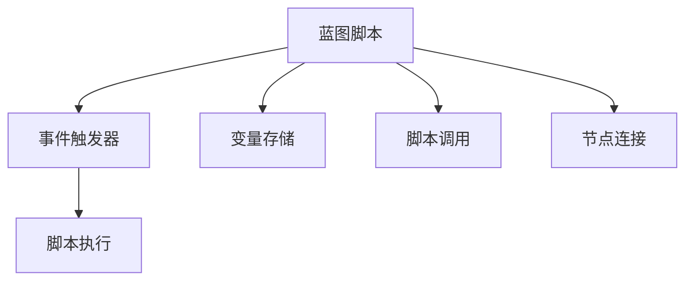

                 

# Unreal Engine 4：蓝图视觉化编程

> 关键词：蓝图编程,Unreal Engine 4,虚拟现实(VR),实时渲染,物理引擎,游戏开发

## 1. 背景介绍

### 1.1 问题由来

随着游戏和虚拟现实技术的迅猛发展，计算机图形学成为了当今最前沿的技术领域之一。然而，传统编程语言(C#、C++等)对于非计算机专业开发者而言，门槛过高，学习成本大，限制了开发者群体范围。

Unreal Engine 4(UE4)作为一款领先的游戏引擎，其蓝图可视化编程语言，打破了这一瓶颈，让更多开发者能够轻松上手并创建出高质量的3D内容。蓝图编程以图形化拖拽的方式进行，直观易用，大大降低了开发者学习和开发成本。

### 1.2 问题核心关键点

本文将深入探讨UE4蓝图编程的核心概念与原理，分析其与C++代码的联系与区别，以及实际应用中的优缺点与适用场景。同时，通过实例演示和案例分析，展示蓝图编程在虚拟现实(VR)和游戏开发中的应用。

## 2. 核心概念与联系

### 2.1 核心概念概述

蓝图编程是UE4特有的可视化编程语言，其核心概念主要包括：

- **节点(Node)**：蓝图中最基本的元素，可以理解为代码块。
- **连接线(Line)**：节点之间的连接方式，实现不同节点间的数据传递。
- **脚本(Script)**：蓝图中的代码逻辑主体，包含若干节点。
- **事件(Event)**：用于触发脚本执行的条件和过程。
- **变量(Variable)**：用于存储脚本执行所需的数据，类似于编程语言中的变量。
- **蓝图脚本(Blueprint)**：整个蓝图编程脚本的入口，通常包含初始化、循环和响应事件等模块。

蓝图编程与传统编程语言的联系与区别如下：

- **联系**：
  - 蓝图编程的本质是通过拖拽节点和连接线，实现与C++代码等价的逻辑功能。
  - 节点的行为和参数定义与C++代码类似，但无需编写源码，降低了开发门槛。
  - 蓝图脚本可调用C++代码实现高级逻辑，扩展其功能。

- **区别**：
  - 蓝图编程无需编写复杂的语法结构，而是通过拖拽组件实现代码逻辑。
  - 蓝图编程更注重可视化而非传统的文本化编程方式。
  - 蓝图编程的运行效率较低，适合于复杂逻辑较少，实时响应需求较高的场景。

### 2.2 核心概念原理和架构的 Mermaid 流程图

该图表展示了蓝图编程的基本结构，从蓝图脚本开始，事件触发器触发脚本执行，脚本通过变量存储和节点连接实现具体逻辑功能。

## 3. 核心算法原理 & 具体操作步骤

### 3.1 算法原理概述

蓝图编程的核心算法原理包括以下几个关键点：

1. **数据流控制**：通过连接线实现数据在不同节点间的传递，类似于电路中的信号流动。
2. **条件分支**：利用判断节点实现条件分支，处理不同的事件和情况。
3. **循环结构**：通过循环节点实现脚本的循环执行，处理重复操作。
4. **脚本调用**：将复杂的逻辑操作封装成蓝图脚本，通过调用实现扩展功能。

蓝图编程的算法步骤详解：

1. **创建脚本**：在蓝图中创建新的脚本，并命名为项目相关的名称。
2. **添加节点**：根据实际需求，向脚本中添加所需节点，并拖拽到脚本区域。
3. **连接节点**：将不同节点通过连接线连接起来，实现数据传递和逻辑控制。
4. **定义事件**：为脚本添加事件节点，设置触发条件。
5. **测试和优化**：在编辑器中测试脚本，调整节点连接和参数设置，优化脚本性能。

### 3.2 算法步骤详解

**Step 1: 创建脚本**
- 打开蓝图编辑器，选择蓝图脚本图标，创建一个新的脚本。
- 输入脚本名称，并选择继承的蓝图脚本（如演员、组件等）。
- 点击“创建”按钮，生成新的蓝图脚本。

**Step 2: 添加节点**
- 在脚本编辑器中，点击“添加新节点”按钮，选择需要的节点类型（如变量、判断、循环等）。
- 将节点拖拽到脚本区域，释放鼠标，节点会自动生成。

**Step 3: 连接节点**
- 选择源节点，点击并拖拽到目标节点，释放鼠标形成连接线。
- 拖动连接线两端，调整其长度和位置，确保数据传递准确无误。

**Step 4: 定义事件**
- 选择“事件”节点，拖动到脚本区域。
- 在节点属性栏选择事件类型，如“玩家进入场景”、“开始游戏”等。
- 创建条件分支，实现不同情况下的逻辑处理。

**Step 5: 测试和优化**
- 在蓝图编辑器中运行脚本，测试逻辑功能。
- 检查错误提示，调整节点连接和参数设置。
- 优化脚本性能，删除不必要的节点和连接线，减少逻辑冗余。

### 3.3 算法优缺点

蓝图编程的优点包括：

1. **易学易用**：无需掌握复杂的编程语言语法，通过拖拽组件即可完成逻辑搭建。
2. **可视化编程**：更直观、易理解，有助于快速上手，降低学习成本。
3. **跨平台开发**：蓝图脚本可在PC、控制台、移动设备等多平台上运行，跨平台开发更加灵活。

缺点包括：

1. **效率较低**：由于采用可视化编程方式，运行效率相对较低，不适合复杂的计算和处理。
2. **局限性较大**：受限于UE4引擎的API限制，无法调用外部库函数和高级语言特性。
3. **依赖性强**：蓝图编程依赖于UE4引擎，跨引擎移植难度较大。

### 3.4 算法应用领域

蓝图编程在虚拟现实(VR)和游戏开发中的应用非常广泛，包括但不限于：

1. **角色动画**：通过蓝图编程实现角色的动画播放、骨骼控制、碰撞检测等功能。
2. **环境渲染**：实现环境光照、雾效、物理模拟等功能，提升场景的真实感。
3. **AI行为**：通过蓝图编程实现AI角色的行为逻辑，如导航、对话、攻击等。
4. **交互设计**：实现用户交互界面，如按钮点击、触摸屏交互等。
5. **游戏逻辑**：实现游戏内的逻辑功能，如敌人行为、道具使用、任务系统等。

## 4. 数学模型和公式 & 详细讲解

### 4.1 数学模型构建

蓝图编程不涉及具体的数学模型，其核心算法主要依赖于数据流和逻辑判断。然而，在实际应用中，很多复杂的逻辑处理需要依赖于数学模型和算法，如碰撞检测、物理模拟等。

### 4.2 公式推导过程

以物理模拟为例，通过蓝图编程实现粒子的物理运动。假设粒子质量为 $m$，初始速度为 $v_0$，受到重力加速度为 $g$，初始位置为 $x_0$，空气阻力系数为 $k$。

根据牛顿第二定律，粒子的运动方程为：

$$
F = ma = mg - k \cdot v \quad \Rightarrow \quad a = g - \frac{k}{m} \cdot v
$$

其中 $a$ 为加速度，$v$ 为速度。

使用欧拉法求解运动方程，得到粒子的位置和时间关系：

$$
x(t) = x_0 + v_0t + \frac{1}{2}at^2
$$

将加速度 $a$ 的表达式代入上式，得到：

$$
x(t) = x_0 + v_0t + \frac{1}{2}\left(g - \frac{k}{m} \cdot v_0\right)t^2
$$

此公式用于计算粒子在不同时间点的位移。

### 4.3 案例分析与讲解

**案例：弹跳球的物理模拟**

在蓝图中，创建一个蓝图脚本，命名为“物理球”，并在脚本中添加以下节点：

1. 变量节点，用于存储粒子的位置、速度、质量等属性。
2. 计时器节点，用于控制时间间隔。
3. 碰撞检测节点，用于检测粒子与地面的碰撞。
4. 逻辑节点，实现物理计算和状态判断。

通过设置粒子的初始参数和物理模拟参数，循环执行物理计算和碰撞检测，实现弹跳球的物理模拟。

## 5. 项目实践：代码实例和详细解释说明

### 5.1 开发环境搭建

要使用蓝图编程，首先需要安装Unreal Engine 4软件。安装步骤如下：

1. 访问Unreal Engine 4官网，下载并运行安装程序。
2. 选择目标平台，如Windows、macOS、Linux等，根据指引完成安装。
3. 配置编辑器环境，安装必要的插件和脚本库。

### 5.2 源代码详细实现

**项目：VR场景中的交互界面**

1. **创建蓝图脚本**：
   - 打开Unreal Engine 4编辑器，选择“文件” -> “新建蓝图脚本”。
   - 输入脚本名称，如“交互界面”。

2. **添加节点**：
   - 在脚本编辑器中，添加“变量”节点，设置变量的类型为“交互”。
   - 添加“逻辑”节点，设置逻辑类型为“BP事件开始”。
   - 添加“逻辑”节点，设置逻辑类型为“BP事件结束”。
   - 添加“变量”节点，设置变量的类型为“bool”。

3. **连接节点**：
   - 将“交互”节点与“bool”节点连接，表示交互状态。
   - 将“BP事件开始”节点与“交互”节点连接，表示交互开始。
   - 将“BP事件结束”节点与“交互”节点连接，表示交互结束。

4. **定义事件**：
   - 选择“事件”节点，拖动到脚本区域。
   - 设置事件类型为“玩家进入场景”，添加相应的事件逻辑。
   - 创建条件分支，处理玩家交互状态。

5. **测试和优化**：
   - 在蓝图编辑器中运行脚本，测试交互功能。
   - 检查错误提示，调整节点连接和参数设置。
   - 优化脚本性能，删除不必要的节点和连接线。

### 5.3 代码解读与分析

**代码解读**：

1. **变量节点**：
   - 变量节点用于存储脚本运行所需的参数，如交互状态、玩家位置等。

2. **逻辑节点**：
   - 逻辑节点用于实现脚本的逻辑功能，如条件判断、循环控制等。

3. **事件节点**：
   - 事件节点用于触发脚本执行，如玩家进入场景、交互开始等。

4. **脚本调用**：
   - 蓝图脚本可以调用外部C++代码，实现复杂的逻辑功能。

**分析**：

蓝图编程的核心在于通过拖拽组件实现逻辑功能，避免了繁琐的语法结构。然而，蓝图编程的运行效率相对较低，不适合处理复杂的计算和逻辑。因此在实际应用中，需要根据需求合理选择编程方式，确保开发效率和性能的最佳平衡。

### 5.4 运行结果展示

**结果展示**：

1. **交互界面展示**：
   - 在VR场景中，通过交互界面节点实现玩家与场景的交互。
   - 玩家点击交互界面，触发脚本执行，控制场景内的灯光、音效等效果。

2. **物理模拟展示**：
   - 在蓝图中，通过物理模拟节点实现粒子的运动。
   - 粒子受到重力、空气阻力等作用，实现自然落体、弹跳等效果。

## 6. 实际应用场景

### 6.1 VR场景中的交互设计

在虚拟现实场景中，蓝图编程可实现各种交互功能，如按钮点击、触摸屏操作等。通过蓝图编程，开发者可以轻松创建复杂的交互界面，提升用户体验和互动性。

### 6.2 游戏中的逻辑控制

蓝图编程在角色动画、AI行为、物品交互等游戏中常用的逻辑控制方面也表现出色。通过拖拽组件，开发者可以快速实现游戏内的各种功能，提高开发效率。

### 6.3 工业仿真和物理模拟

蓝图编程在工业仿真和物理模拟中也具有广泛应用。通过蓝图编程，实现复杂的物理计算和仿真效果，提高仿真的真实性和可操作性。

## 7. 工具和资源推荐

### 7.1 学习资源推荐

1. **Unreal Engine 4官方文档**：
   - 详细介绍了蓝图编程的基本概念和使用方法。
   - 提供了大量的实例和示例代码，帮助开发者快速上手。

2. **Unreal Engine 4蓝图教程**：
   - 一系列基础到进阶的蓝图编程教程，涵盖从入门到高级的各种功能。
   - 通过案例演示，帮助开发者掌握蓝图编程技巧。

3. **Blueprints Visual Scripting**：
   - 一本深入浅出讲解蓝图编程的书籍，帮助开发者系统掌握蓝图编程知识。

### 7.2 开发工具推荐

1. **Unreal Engine 4编辑器**：
   - 官方提供的编辑器，支持蓝图编程和C++编程。
   - 提供了丰富的开发工具和插件，方便开发者快速开发。

2. **Visual Studio**：
   - 用于C++代码的开发和调试。
   - 与Unreal Engine 4编辑器无缝集成，实现跨平台的开发和测试。

3. **Git**：
   - 版本控制工具，方便团队协作开发。
   - 支持分支管理、代码合并等功能，提高开发效率。

### 7.3 相关论文推荐

1. **Visual Scripting in Game Development**：
   - 探讨了视觉脚本在游戏开发中的应用，介绍了蓝图编程的优势和挑战。
   - 分析了视觉脚本与传统编程的结合方式，提供了优化建议。

2. **Blueprint Programming in Unreal Engine 4**：
   - 详细介绍了蓝图编程的基本原理和使用方法。
   - 通过实际案例，展示了蓝图编程在游戏中的应用。

## 8. 总结：未来发展趋势与挑战

### 8.1 总结

蓝图编程作为Unreal Engine 4的核心编程语言，以其易学易用的特点，大大降低了游戏和虚拟现实开发门槛。通过拖拽组件的方式，实现代码逻辑功能，极大提升了开发效率和用户体验。然而，蓝图编程的运行效率相对较低，不适合复杂的计算和逻辑处理。未来，蓝图编程需结合C++代码的优势，充分发挥两种编程方式的互补性，进一步提升开发效率和系统性能。

### 8.2 未来发展趋势

1. **跨平台集成**：蓝图编程将更加注重跨平台集成，实现不同平台之间的无缝切换和优化。
2. **功能扩展**：蓝图编程将不断扩展新的功能模块，支持更多复杂逻辑和高级操作。
3. **性能优化**：通过优化数据流和逻辑控制，提升蓝图编程的运行效率和性能。
4. **生态系统**：蓝图编程将与更多第三方插件和工具集成，构建更加丰富的开发生态系统。

### 8.3 面临的挑战

1. **效率问题**：蓝图编程的运行效率较低，需要进一步优化数据流和逻辑控制，提升性能。
2. **跨引擎兼容性**：蓝图编程依赖于Unreal Engine 4引擎，跨引擎移植难度较大。
3. **功能限制**：蓝图编程的功能扩展受限于UE4引擎的API限制，无法调用外部库函数和高级语言特性。

### 8.4 研究展望

未来，蓝图编程需要在以下几个方面进行探索和优化：

1. **混合编程模式**：结合蓝图编程和C++编程，充分发挥两种编程方式的互补性。
2. **跨引擎兼容**：开发跨平台兼容的蓝图编程工具，支持多种游戏引擎和虚拟现实平台。
3. **功能扩展**：在UE4引擎的基础上，不断扩展新的功能模块，支持更多复杂逻辑和高级操作。
4. **性能优化**：优化数据流和逻辑控制，提升蓝图编程的运行效率和性能。

## 9. 附录：常见问题与解答

**Q1: 蓝图编程的运行效率低，如何优化？**

A: 蓝图编程的运行效率较低，可以通过以下方法优化：
1. **减少数据流复杂度**：优化数据流的连接，减少不必要的节点和连接线，提升数据传递效率。
2. **合理分配逻辑任务**：将复杂的逻辑操作分解为多个小任务，分别处理。
3. **使用C++代码优化**：在蓝图脚本中调用C++代码，实现复杂的计算和处理。

**Q2: 蓝图编程是否支持外部库函数调用？**

A: 蓝图编程目前不支持直接调用外部库函数，但可以通过C++代码实现。
在蓝图脚本中调用C++代码，可以实现更复杂的逻辑操作和外部库函数的调用。

**Q3: 蓝图编程和C++编程如何结合？**

A: 蓝图编程和C++编程可以结合使用，充分发挥两种编程方式的互补性。
蓝图编程用于实现界面和基本逻辑功能，C++代码用于实现复杂的计算和处理。

**Q4: 蓝图编程的适用范围是什么？**

A: 蓝图编程适用于需要快速开发、易学易用、交互性强的应用场景，如游戏开发、虚拟现实等。
但对于需要复杂计算和处理的场景，仍需结合C++代码实现。

**Q5: 蓝图编程的优势是什么？**

A: 蓝图编程的优势在于易学易用，通过拖拽组件实现代码逻辑功能，大大降低了开发门槛。
同时，蓝图编程跨平台支持，方便开发者在不同平台之间开发和测试。

作者：禅与计算机程序设计艺术 / Zen and the Art of Computer Programming

