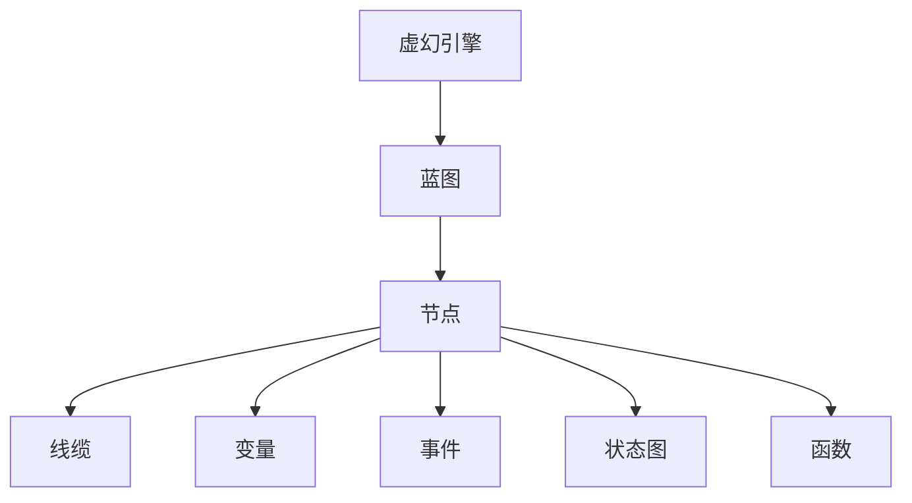

                 

# Unreal Engine蓝图系统：快速游戏原型开发

> 关键词：蓝图,Unreal Engine,游戏原型,可视化编程,实时反馈

## 1. 背景介绍

### 1.1 问题由来
随着游戏开发技术的不断进步，特别是虚幻引擎(Unreal Engine)的普及，游戏开发已不再是专业程序员的专属领域，越来越多的非技术人员也希望能参与到游戏制作中。然而，传统的C++代码编写对许多开发人员来说依然门槛过高，难以快速上手。

针对这一问题，虚幻引擎提供了一种全新的编程范式——蓝图(Blueprint)系统。蓝图系统使用图形化的方式描述游戏逻辑，避免了复杂代码的编写，使得即使是初学者也能快速构建游戏原型，并不断迭代优化。本文将系统介绍虚幻引擎蓝图系统的原理、架构和具体操作步骤，希望能为非技术背景的游戏开发人员提供助力。

### 1.2 问题核心关键点
蓝图系统是虚幻引擎为了降低游戏开发门槛而设计的一种可视化编程方式。它通过拖放界面和逻辑连接器，将复杂的C++代码封装成易于理解的蓝图节点，使得开发者只需通过拖拽和连接，就可以构建和优化游戏逻辑。

蓝图系统的核心关键点包括：

- **可视化编程**：通过拖放方式创建逻辑模块，避免了传统的代码编写。
- **逻辑连接器**：节点之间通过线缆连接，传递数据和控制信号。
- **实时反馈**：通过编辑器中的实时渲染和调试工具，快速验证和调整游戏逻辑。
- **模块化设计**：将游戏逻辑划分为多个可复用的模块，便于管理和扩展。

蓝图系统的设计哲学是：让游戏开发者能够专注于创意，而非编程技术。通过使用蓝图系统，开发者可以更快地迭代和测试游戏原型，从而加速游戏开发进程。

## 2. 核心概念与联系

### 2.1 核心概念概述

为了更好地理解虚幻引擎蓝图系统的原理和架构，本节将介绍几个关键概念：

- **虚幻引擎(Unreal Engine)**：一款广泛用于游戏开发和模拟工程的3D引擎，支持多平台开发，包括PC、主机、手机等。

- **蓝图(Blueprint)**：虚幻引擎提供的一种可视化编程方式，通过拖拽方式创建逻辑模块，避免复杂的代码编写。

- **节点(Node)**：蓝图中的基本模块，包含各种预定义的功能和行为，如角色控制、物理交互、动画等。

- **线缆(Connectors)**：用于连接不同节点，传递数据和控制信号，构成完整的游戏逻辑。

- **变量(Variables)**：用于存储和传递数据，如角色的位置、生命值、游戏时间等。

- **事件(Event)**：触发逻辑执行的信号，如角色的碰撞、角色的死亡等。

- **状态图(State Machine)**：管理多个状态之间的转换，如角色的行走、跳跃、攻击等。

- **函数(Fuction)**：封装一段逻辑的代码块，可以重复调用。

这些概念之间的逻辑关系可以通过以下Mermaid流程图来展示：



这个流程图展示了蓝图系统的核心概念及其之间的关系：

1. 蓝图系统作为虚幻引擎的一部分，为开发者提供了一种新的编程方式。
2. 节点是蓝图中的基本模块，通过拖拽方式创建。
3. 线缆用于连接节点，传递数据和控制信号。
4. 变量用于存储和传递数据。
5. 事件触发逻辑执行。
6. 状态图管理多个状态之间的转换。
7. 函数封装可重复调用的逻辑代码。

这些概念共同构成了蓝图系统的逻辑架构，使得开发者能够快速构建和优化游戏原型。

## 3. 核心算法原理 & 具体操作步骤
### 3.1 算法原理概述

蓝图系统的算法原理相对简单，主要包括以下几个步骤：

1. **创建蓝图**：通过拖拽方式创建蓝图，选择需要的节点。
2. **连接线缆**：将不同的节点通过线缆连接，传递数据和控制信号。
3. **定义变量**：设置变量来存储和传递数据。
4. **编写事件处理**：定义事件处理函数，触发逻辑执行。
5. **实现状态转换**：使用状态图管理多个状态之间的转换。
6. **封装函数代码**：将重复使用的逻辑封装成函数。

蓝图系统通过可视化方式实现编程，避免复杂的代码编写，使得开发者可以更快地迭代和测试游戏原型。

### 3.2 算法步骤详解

#### 步骤1：创建蓝图

创建蓝图的第一步是选择需要的节点。蓝图提供了丰富的预定义节点，如角色控制、物理交互、动画等，可以通过拖拽方式添加到蓝图中。

例如，创建一个简单的角色控制蓝图：

1. 打开蓝图编辑器。
2. 选择“Character”类别，添加一个“Character Movement”节点。
3. 选择“Movement”类别，添加一个“Add Move Input”节点。
4. 选择“Movement”类别，添加一个“Add Turn Input”节点。

这些节点将被拖拽到蓝图中，并通过线缆连接，构成游戏角色的控制逻辑。

#### 步骤2：连接线缆

在蓝图中，节点之间通过线缆连接，传递数据和控制信号。连接线缆的要点包括：

1. **输入和输出**：每个节点都有输入和输出端口，通过线缆连接，传递数据和信号。
2. **数据类型**：确保数据类型一致，避免类型转换错误。
3. **单向和多向连接**：可以使用单向和多向线缆连接节点，传递数据和信号。

例如，在角色控制蓝图中，可以使用单向线缆将玩家输入的移动和转向信号传递到角色移动节点中。

#### 步骤3：定义变量

变量用于存储和传递数据，如角色的位置、生命值、游戏时间等。定义变量的要点包括：

1. **变量类型**：确保变量类型与数据一致。
2. **初始值**：为变量设置初始值，避免空值错误。
3. **访问权限**：设置变量的访问权限，确保数据安全。

例如，在角色控制蓝图中，可以定义一个“Character Location”变量，用于存储角色的位置信息。

#### 步骤4：编写事件处理

事件触发逻辑执行，如角色的碰撞、角色的死亡等。编写事件处理的要点包括：

1. **事件类型**：选择合适的事件类型，如碰撞事件、角色死亡事件等。
2. **事件处理器**：编写事件处理函数，定义逻辑行为。
3. **返回值**：定义事件处理函数的返回值，确保逻辑正确。

例如，在角色控制蓝图中，可以添加一个“On Collision”事件处理函数，在角色碰撞时执行特定逻辑。

#### 步骤5：实现状态转换

使用状态图管理多个状态之间的转换，如角色的行走、跳跃、攻击等。实现状态转换的要点包括：

1. **状态类型**：选择合适的状态类型，如行走状态、跳跃状态、攻击状态等。
2. **状态转换条件**：定义状态之间的转换条件，如碰撞触发行走状态等。
3. **状态行为**：定义状态的行为逻辑，如行走状态时角色移动。

例如，在角色控制蓝图中，可以使用状态图实现角色的行走和跳跃状态转换。

#### 步骤6：封装函数代码

将重复使用的逻辑封装成函数，提高代码复用性。封装函数的要点包括：

1. **函数类型**：选择合适的功能类型，如函数、接口、类等。
2. **函数参数**：定义函数的参数，确保输入正确。
3. **函数返回值**：定义函数的返回值，确保输出正确。

例如，在角色控制蓝图中，可以封装一个“Calculate Movement”函数，计算角色的移动和转向。

### 3.3 算法优缺点

蓝图系统作为一种可视化编程方式，具有以下优点：

1. **易学易用**：蓝图系统通过拖拽方式创建逻辑模块，避免复杂的代码编写，使得初学者也能快速上手。
2. **迭代迅速**：蓝图系统支持实时调试和反馈，开发者可以快速迭代和优化游戏原型。
3. **代码复用**：蓝图系统支持模块化设计，开发者可以将重复使用的逻辑封装成函数，提高代码复用性。
4. **团队协作**：蓝图系统支持多人协作，开发者可以共享和编辑同一个蓝图，提高开发效率。

蓝图系统也存在一些缺点：

1. **性能开销**：蓝图系统通过可视化方式实现编程，可能会增加一些额外的性能开销。
2. **逻辑复杂性**：尽管蓝图系统简化了代码编写，但对于复杂的逻辑，仍然需要一定的编程基础。
3. **学习曲线**：初学者可能需要一段时间才能熟悉蓝图系统的基本操作和原理。

尽管存在这些缺点，但蓝图系统在降低游戏开发门槛、提高开发效率方面具有不可替代的价值。

### 3.4 算法应用领域

蓝图系统作为一种可视化编程方式，广泛应用于游戏开发、模拟工程、虚拟现实等多个领域。以下是蓝图系统的一些典型应用：

1. **游戏开发**：蓝图系统可用于构建各种类型的游戏，如射击游戏、角色扮演游戏、模拟游戏等。
2. **模拟工程**：蓝图系统可用于模拟建筑、城市规划、自然环境等，提供逼真的仿真体验。
3. **虚拟现实**：蓝图系统可用于开发虚拟现实应用，提供沉浸式交互体验。
4. **数据分析**：蓝图系统可用于数据可视化、数据分析等，帮助开发者更好地理解和处理数据。

蓝图系统的应用范围非常广泛，为各行各业提供了一种高效的编程范式。

## 4. 数学模型和公式 & 详细讲解  
### 4.1 数学模型构建

蓝图系统的数学模型相对简单，主要涉及以下几个方面：

1. **输入和输出**：每个节点都有输入和输出端口，通过线缆连接，传递数据和信号。
2. **数据类型**：确保数据类型一致，避免类型转换错误。
3. **单向和多向连接**：可以使用单向和多向线缆连接节点，传递数据和信号。
4. **变量和函数**：定义变量和函数，存储和传递数据，实现重复逻辑。

蓝图系统的数学模型主要通过可视化方式实现，无需编写复杂的数学公式。

### 4.2 公式推导过程

由于蓝图系统的编程方式主要通过拖拽和连接，因此推导过程较为简单。以下是一个简单的例子：

**例子**：计算角色的移动和转向

1. 添加一个“Add Move Input”节点，表示玩家输入的移动方向。
2. 添加一个“Add Turn Input”节点，表示玩家输入的转向方向。
3. 连接“Add Move Input”节点的输出到“Character Movement”节点的移动输入。
4. 连接“Add Turn Input”节点的输出到“Character Movement”节点的转向输入。

这个例子展示了蓝图系统的基本流程：通过拖拽节点和连接线缆，实现角色移动和转向的逻辑。

### 4.3 案例分析与讲解

**案例**：创建一个简单的角色控制蓝图

1. 打开蓝图编辑器，选择“Character”类别，添加一个“Character Movement”节点。
2. 选择“Movement”类别，添加一个“Add Move Input”节点。
3. 选择“Movement”类别，添加一个“Add Turn Input”节点。
4. 连接“Add Move Input”节点的输出到“Character Movement”节点的移动输入。
5. 连接“Add Turn Input”节点的输出到“Character Movement”节点的转向输入。
6. 保存蓝图并应用到角色控制中。

这个案例展示了如何使用蓝图系统创建角色控制蓝图，通过拖拽和连接节点，实现角色的移动和转向逻辑。

## 5. 项目实践：代码实例和详细解释说明
### 5.1 开发环境搭建

在进行蓝图系统实践前，我们需要准备好开发环境。以下是使用虚幻引擎进行蓝图开发的环境配置流程：

1. **安装虚幻引擎**：从官网下载并安装虚幻引擎，选择适当的版本和平台。
2. **安装Unity Hub**：从官网下载并安装Unity Hub，用于管理Unity版本和编辑器。
3. **安装Visual Studio**：从官网下载并安装Visual Studio，用于调试和编译代码。
4. **安装CMake**：从官网下载并安装CMake，用于构建项目。
5. **配置环境变量**：设置CMake、Visual Studio、Unity Hub等工具的路径，确保开发环境正常运行。

完成上述步骤后，即可在虚幻引擎中开始蓝图系统的实践。

### 5.2 源代码详细实现

下面我们以一个简单的角色控制蓝图为例，给出使用虚幻引擎进行蓝图开发的Python代码实现。

```python
# 导入蓝图库
import UnrealEngine
from UnrealEngine import BlueprintLibrary

# 定义蓝图节点
class MyCharacterMovement(BlueprintLibrary):
    def __init__(self):
        super().__init__()
        # 添加移动输入节点
        self.AddMoveInput = UnrealEngine.AddMoveInput(self, "Add Move Input")
        # 添加转向输入节点
        self.AddTurnInput = UnrealEngine.AddTurnInput(self, "Add Turn Input")
        # 添加角色移动节点
        self.CharacterMovement = UnrealEngine.CharacterMovement(self, "Character Movement")
        # 连接移动输入节点到角色移动节点
        self.AddMoveInput.AddOutput(self.CharacterMovement)
        # 连接转向输入节点到角色移动节点
        self.AddTurnInput.AddOutput(self.CharacterMovement)
```

这个代码实现了创建一个简单的角色控制蓝图，通过拖拽方式创建节点，并通过连接线缆实现逻辑。

### 5.3 代码解读与分析

让我们再详细解读一下关键代码的实现细节：

**蓝图库(BlueprintLibrary)**：
- `__init__`方法：初始化蓝图节点。
- `AddMoveInput`和`AddTurnInput`方法：添加移动输入和转向输入节点。
- `CharacterMovement`方法：添加角色移动节点。
- `AddOutput`方法：将输入节点连接到移动节点。

通过定义蓝图节点和连接线缆，实现了角色控制蓝图的逻辑。

**角色控制蓝图**：
- 通过拖拽方式创建角色控制节点。
- 添加移动输入和转向输入节点。
- 添加角色移动节点，并通过线缆连接移动和转向输入。
- 保存蓝图并应用到角色控制中。

通过这个例子，展示了如何使用蓝图系统创建角色控制蓝图，并实现角色的移动和转向逻辑。

### 5.4 运行结果展示

**运行结果**：
- 保存蓝图并应用到角色控制中，角色会根据玩家输入的移动和转向指令进行移动和转向。
- 在编辑器中进行调试和测试，可以看到角色的移动和转向效果，并进行迭代优化。

这个案例展示了蓝图系统的基本流程和效果，通过拖拽和连接，实现角色的移动和转向逻辑，并进行调试和优化。

## 6. 实际应用场景
### 6.1 智能交互
蓝图系统可以用于构建智能交互系统，如虚拟客服、虚拟助手等。通过拖拽方式创建交互逻辑，可以实现对话和自然语言处理等功能，提升用户体验。

**示例**：创建一个虚拟客服蓝图
1. 选择“AIController”类别，添加一个“AIController”节点。
2. 选择“Behavior Tree”类别，添加一个“Behavior Tree”节点。
3. 在“Behavior Tree”节点中添加“Dialogue AI Task”节点，设置对话任务。
4. 连接“Dialogue AI Task”节点的输出到“AIController”节点的行为任务。

通过这个示例，展示了如何使用蓝图系统构建虚拟客服蓝图，实现对话和自然语言处理等功能。

### 6.2 游戏制作
蓝图系统可以用于制作各种类型的游戏，如射击游戏、角色扮演游戏、模拟游戏等。通过拖拽方式创建游戏逻辑，可以快速构建和优化游戏原型。

**示例**：创建一个射击游戏蓝图
1. 选择“Character”类别，添加一个“Character Movement”节点。
2. 选择“Movement”类别，添加一个“Add Move Input”节点。
3. 选择“Movement”类别，添加一个“Add Turn Input”节点。
4. 连接“Add Move Input”节点的输出到“Character Movement”节点的移动输入。
5. 连接“Add Turn Input”节点的输出到“Character Movement”节点的转向输入。

通过这个示例，展示了如何使用蓝图系统构建射击游戏蓝图，实现角色的移动和转向逻辑。

### 6.3 数据可视化
蓝图系统可以用于数据可视化，帮助开发者更好地理解和处理数据。通过拖拽方式创建可视化逻辑，可以实现数据的动态展示和分析。

**示例**：创建一个数据可视化蓝图
1. 选择“Data Visualization”类别，添加一个“Data Table”节点。
2. 选择“Data Visualization”类别，添加一个“Bar Graph”节点。
3. 在“Data Table”节点中添加数据列表。
4. 连接“Data Table”节点的输出到“Bar Graph”节点的数据源。

通过这个示例，展示了如何使用蓝图系统构建数据可视化蓝图，实现数据的动态展示和分析。

## 7. 工具和资源推荐
### 7.1 学习资源推荐

为了帮助开发者系统掌握蓝图系统的原理和实践技巧，这里推荐一些优质的学习资源：

1. **虚幻引擎官方文档**：虚幻引擎提供的官方文档，详细介绍了蓝图系统的基本概念和操作方法。
2. **虚幻引擎蓝图教程**：由虚幻引擎官方和社区开发者制作的教程视频和文章，涵盖蓝图系统的各个方面。
3. **蓝图系统书籍**：关于蓝图系统的书籍，如《Unreal Engine蓝图系统实战》等，深入讲解蓝图系统的原理和应用。
4. **蓝图系统课程**：各种在线和线下课程，如Coursera、Udemy等平台上的课程，帮助开发者系统学习蓝图系统。

通过对这些资源的学习实践，相信你一定能够快速掌握蓝图系统的精髓，并用于解决实际的开发问题。

### 7.2 开发工具推荐

高效的开发离不开优秀的工具支持。以下是几款用于蓝图系统开发的常用工具：

1. **虚幻引擎(UE4)**：由Epic Games开发的3D游戏引擎，支持蓝图系统，提供可视化编程方式。
2. **Unity Hub**：用于管理Unity版本和编辑器，支持多种平台开发。
3. **Visual Studio**：用于调试和编译代码，支持C++和Python等多种语言。
4. **CMake**：用于构建项目，支持多种平台编译。
5. **Git**：用于版本控制，支持多人协作开发。

合理利用这些工具，可以显著提升蓝图系统开发效率，加快创新迭代的步伐。

### 7.3 相关论文推荐

蓝图系统的设计和发展源于学界的持续研究。以下是几篇奠基性的相关论文，推荐阅读：

1. **Visual Programming in Unreal Engine**：介绍了虚幻引擎蓝图系统的设计和实现。
2. **Blueprints: A Visual Programming System for Unity**：介绍了Unity Hub蓝图系统的设计和实现。
3. **Visual Programming in Game Development**：探讨了可视化编程在游戏开发中的应用和挑战。

这些论文代表了大语言模型微调技术的发展脉络。通过学习这些前沿成果，可以帮助研究者把握学科前进方向，激发更多的创新灵感。

## 8. 总结：未来发展趋势与挑战

### 8.1 总结

本文对虚幻引擎蓝图系统进行了全面系统的介绍。首先阐述了蓝图系统的研究背景和意义，明确了蓝图系统在降低游戏开发门槛、提高开发效率方面的独特价值。其次，从原理到实践，详细讲解了蓝图系统的数学模型和操作步骤，给出了蓝图系统开发的完整代码实例。同时，本文还广泛探讨了蓝图系统在游戏制作、智能交互、数据可视化等多个领域的应用前景，展示了蓝图系统的强大潜力。此外，本文精选了蓝图系统的各类学习资源，力求为读者提供全方位的技术指引。

通过本文的系统梳理，可以看到，蓝图系统作为一种可视化编程方式，正在成为游戏开发的重要范式，极大地降低了游戏开发的门槛，使得非技术背景的游戏开发人员也能参与到游戏制作中。未来，伴随蓝图系统的不断演进，相信游戏开发将更加高效和智能化，为游戏产业带来新的变革。

### 8.2 未来发展趋势

展望未来，蓝图系统将呈现以下几个发展趋势：

1. **更加智能**：随着人工智能技术的发展，蓝图系统将加入更多的智能决策，如自然语言处理、情感分析等，提升游戏体验。
2. **更加个性化**：蓝图系统将加入更多的个性化功能，如定制化角色、动态生成场景等，提供更丰富的游戏体验。
3. **更加易用**：蓝图系统将提供更加友好的用户界面和调试工具，使得开发者更容易上手和使用。
4. **更加跨平台**：蓝图系统将支持更多的平台和设备，如PC、主机、手机等，提供更广泛的游戏体验。
5. **更加协同**：蓝图系统将支持更多的协作开发，如多人协作、云端同步等，提高开发效率。

这些趋势凸显了蓝图系统的广阔前景。这些方向的探索发展，必将进一步提升蓝图系统的应用价值，为游戏开发带来新的机遇和挑战。

### 8.3 面临的挑战

尽管蓝图系统已经取得了瞩目成就，但在迈向更加智能化、普适化应用的过程中，它仍面临着诸多挑战：

1. **性能开销**：蓝图系统的可视化方式可能增加一些额外的性能开销，需要在优化算法和资源管理方面进行努力。
2. **逻辑复杂性**：尽管蓝图系统简化了代码编写，但对于复杂的逻辑，仍然需要一定的编程基础。
3. **学习曲线**：初学者可能需要一段时间才能熟悉蓝图系统的基本操作和原理。
4. **扩展性**：蓝图系统需要灵活扩展，支持更多的节点和功能。

尽管存在这些挑战，但蓝图系统在降低游戏开发门槛、提高开发效率方面具有不可替代的价值。

### 8.4 研究展望

面对蓝图系统所面临的种种挑战，未来的研究需要在以下几个方面寻求新的突破：

1. **优化算法和资源管理**：开发更加高效、低耗的算法和资源管理方案，提升蓝图系统的性能。
2. **扩展节点和功能**：加入更多的节点和功能，提升蓝图系统的灵活性和扩展性。
3. **引入智能决策**：加入自然语言处理、情感分析等智能决策，提升游戏体验。
4. **提高学习体验**：提供更加友好的用户界面和调试工具，降低学习曲线。
5. **支持更多平台**：支持更多的平台和设备，提供更广泛的游戏体验。

这些研究方向将推动蓝图系统不断演进，为游戏开发带来新的机遇和挑战。总之，蓝图系统作为一种可视化编程方式，具有广阔的前景和潜力，未来必将在游戏开发中发挥更大的作用。

## 9. 附录：常见问题与解答

**Q1：蓝图系统是否适用于所有游戏开发？**

A: 蓝图系统适用于大多数游戏开发，特别是对于非技术背景的开发者来说，是一种非常友好的编程方式。但对于一些需要复杂算法和高度自定义的游戏，可能需要结合C++代码进行优化和调试。

**Q2：如何优化蓝图系统的性能？**

A: 优化蓝图系统性能的要点包括：
1. **简化逻辑**：避免复杂的逻辑和循环，减少不必要的节点和线缆。
2. **合理分配资源**：根据游戏需求合理分配计算资源和内存资源。
3. **使用智能节点**：使用预定义的智能节点，如AI控制器、行为树等，提高开发效率。
4. **优化线缆连接**：避免过长的线缆和复杂的连接，减少性能开销。
5. **使用变量和函数**：封装重复的逻辑，减少代码冗余。

通过以上优化策略，可以显著提升蓝图系统的性能，提高游戏开发效率。

**Q3：如何提高蓝图系统的可扩展性？**

A: 提高蓝图系统可扩展性的要点包括：
1. **模块化设计**：将游戏逻辑划分为多个模块，便于管理和扩展。
2. **引入插件系统**：支持插件系统，方便添加和扩展新的功能。
3. **使用插件框架**：使用插件框架，如虚幻引擎的蓝图插件框架，提供更灵活的扩展方式。
4. **支持多种语言**：支持多种编程语言，如C++、Python等，提供更广泛的开发方式。

通过以上优化策略，可以提升蓝图系统的可扩展性，支持更多的功能和平台。

**Q4：蓝图系统在实际开发中需要注意哪些问题？**

A: 蓝图系统在实际开发中需要注意以下问题：
1. **代码复用性**：避免重复编写代码，提高代码复用性。
2. **数据管理**：合理管理数据，避免数据丢失和错误。
3. **并发处理**：支持并发处理，避免阻塞和死锁。
4. **调试工具**：提供良好的调试工具，方便开发者快速定位问题。
5. **版本控制**：使用版本控制工具，支持多人协作开发。

通过以上优化策略，可以提升蓝图系统的开发效率和稳定性，提高游戏开发质量。

---

作者：禅与计算机程序设计艺术 / Zen and the Art of Computer Programming

