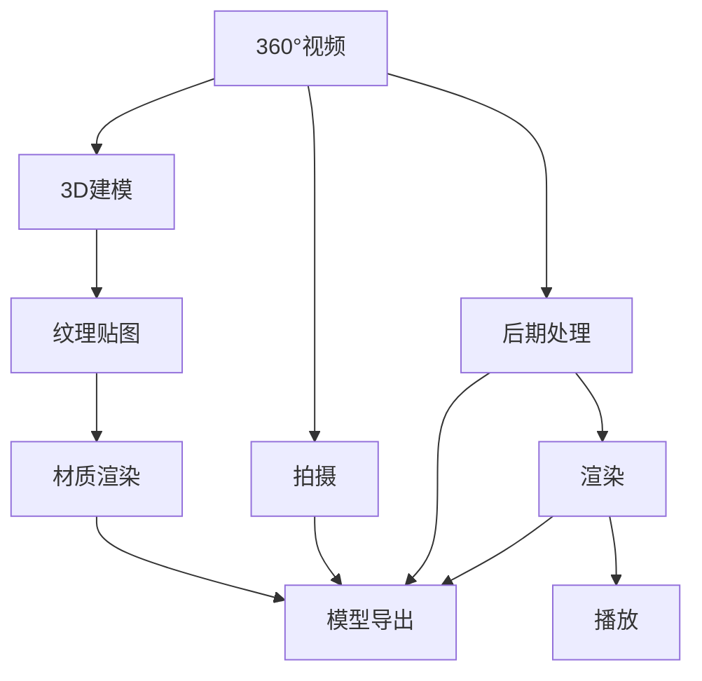

                 

# VR内容制作：360°视频与3D建模

## 1. 背景介绍

### 1.1 问题由来
随着虚拟现实(VR)技术的发展，360°视频和3D建模成为沉浸式体验的核心需求。与传统的2D视频不同，360°视频和3D模型提供了一个全方位的视觉视角，让用户能够深入体验虚拟世界。然而，360°视频和3D建模的技术实现相对复杂，涉及数据量大、计算资源需求高、渲染效率等问题。本文章将全面介绍360°视频和3D建模的核心概念与技术细节，并通过实际项目案例进行详细讲解。

### 1.2 问题核心关键点
360°视频和3D建模是虚拟现实内容制作的两大核心技术，主要包括：

- 360°视频的拍摄与处理：如何拍摄高质量的360°视频，并对其进行后期处理，生成可互动的视频体验。
- 3D建模：利用计算机图形学技术，创建逼真的三维模型，为虚拟现实场景提供视觉基础。

### 1.3 问题研究意义
360°视频和3D建模技术的应用，使得虚拟现实内容的制作变得更为便捷和高效，用户体验大幅提升。应用场景涵盖游戏、旅游、教育等多个领域。因此，深入理解其原理和实现方法，对于VR技术的发展具有重要意义。

## 2. 核心概念与联系

### 2.1 核心概念概述

为更好地理解360°视频和3D建模，本节将介绍几个密切相关的核心概念：

- 360°视频（Spherical Video）：指以球面为投影面，覆盖水平360°视角范围的视频格式。用户可以通过头戴设备自由视角浏览，沉浸感强。
- 3D建模（3D Modeling）：利用计算机图形学技术，基于3D数据构建虚拟世界的物体模型，包括几何建模、纹理贴图、材质渲染等步骤。
- 图像处理（Image Processing）：对视频图像进行去噪、增强、拼接等处理，以提高视频质量。
- 渲染引擎（Rendering Engine）：用于将3D模型渲染成二维图像序列的软件工具。

这些核心概念之间的逻辑关系可以通过以下Mermaid流程图来展示：



这个流程图展示了这个系统的主要流程：

1. 360°视频的拍摄和后期处理。
2. 3D建模，包括几何建模、纹理贴图和材质渲染。
3. 模型的导出，为渲染服务。
4. 将渲染后的图像序列转换成360°视频，供用户观看。

## 3. 核心算法原理 & 具体操作步骤
### 3.1 算法原理概述

360°视频和3D建模的原理相对复杂，主要涉及图像处理和图形渲染技术。其核心算法包括：

- 360°视频生成：将多个普通视频图像拼接成360°视频。
- 3D模型渲染：使用着色器等图形处理技术，将3D模型渲染成图像。
- 光照模型：模拟光源对物体表面的光照效果，提升模型的逼真度。

### 3.2 算法步骤详解

以下是360°视频和3D建模的主要步骤：

**Step 1: 拍摄与获取数据**
- 360°视频拍摄：使用专用设备拍摄全环绕视角的视频。
- 3D模型建模：利用3D建模软件（如Blender、Maya等）创建模型，并进行几何建模、纹理贴图、材质渲染。

**Step 2: 视频处理与拼接**
- 360°视频去噪与增强：对拍摄的视频图像进行去噪、色彩校正、增强等处理，提高视频质量。
- 视频拼接：将拍摄的多个视频图像拼接成360°视频，需要使用视频拼接软件。

**Step 3: 模型渲染**
- 纹理贴图：将模型表面的材质、纹理贴到3D模型上，提升模型的真实感。
- 材质渲染：使用着色器语言（如GLSL、HLSL等）实现光照模型，提升渲染效果。
- 模型渲染：将渲染后的图像序列保存为渲染图或渲染视频。

**Step 4: 视频渲染与合成**
- 渲染图拼接：将渲染的图像序列按照顺序拼接成360°视频。
- 视频渲染：对拼接好的360°视频进行最终渲染，调整图像质量、音效等参数。
- 合成输出：将渲染后的360°视频导出为适合播放的格式。

### 3.3 算法优缺点

360°视频和3D建模具有以下优点：

1. 沉浸体验：提供360°视角和逼真渲染效果，用户可以全方位体验虚拟世界，提高沉浸感。
2. 应用广泛：应用领域涵盖游戏、旅游、教育、医疗等多个行业。
3. 技术成熟：相关技术已经比较成熟，有大量的工具和库可用。

同时，这些技术也存在以下局限性：

1. 设备要求高：360°视频和3D建模对设备性能要求较高，需要高性能显卡和处理器。
2. 渲染计算量大：渲染复杂场景的计算量巨大，需要高效的渲染引擎。
3. 数据量大：生成高质量的360°视频和3D模型，需要大量原始数据。
4. 渲染效率低：渲染过程中需要大量的内存和显存，渲染效率较低。

### 3.4 算法应用领域

360°视频和3D建模在多个领域有广泛的应用，包括：

- 虚拟现实游戏：提供沉浸式游戏体验，提高玩家互动性。
- 虚拟旅游：用户可以通过虚拟旅游体验不同的地理位置，打破时间空间的限制。
- 教育培训：利用3D模型创建虚拟实验室，提供更加直观的实验教学。
- 医疗模拟：用于手术模拟、疾病诊断等医疗场景，提升医生的技术水平。

## 4. 数学模型和公式 & 详细讲解  
### 4.1 数学模型构建

360°视频和3D建模涉及到许多数学模型，主要包括：

- 几何建模：通过数学模型定义物体的几何形状，如平面、球体、立方体等。
- 光照模型：模拟光源对物体表面的光照效果，如反射、折射、散射等。
- 纹理映射：将纹理贴图应用到3D模型上，提升真实感。

### 4.2 公式推导过程

以一个简单的球体为例，其几何建模和光照模型公式如下：

1. 球体建模公式：
$$
r = \sqrt{x^2 + y^2 + z^2}
$$

2. 球体表面光照计算公式：
$$
I = \frac{E}{\pi r^2} (1 - \frac{E}{\pi r^2} \sum_{i=1}^N cos(\theta_i) e^{-\lambda r} R_i)
$$
其中 $E$ 为光源强度，$r$ 为距离，$N$ 为光源数目，$\theta_i$ 为角度，$R_i$ 为反射系数。

3. 纹理映射公式：
$$
t = \frac{s - S}{L} + T
$$
其中 $s$ 为屏幕坐标，$S$ 为源坐标，$L$ 为平铺因子，$T$ 为贴图坐标。

### 4.3 案例分析与讲解

以一个简单的户外场景为例，该场景包括树木、草地、建筑物等。

- 几何建模：使用建模软件创建树木、草地和建筑物的3D模型。
- 纹理贴图：为每个模型贴上相应的纹理贴图，包括树叶纹理、草地纹理、砖石纹理等。
- 材质渲染：使用着色器语言实现光照模型，对每个模型进行渲染。

最终生成的场景图像序列可以导出为360°视频，供用户观看。

## 5. 项目实践：代码实例和详细解释说明
### 5.1 开发环境搭建

在进行360°视频和3D建模的开发前，需要准备好开发环境。以下是使用C++语言进行OpenGL开发的流程：

1. 安装Visual Studio：从官网下载并安装Visual Studio IDE。
2. 安装OpenGL库：从官网下载安装OpenGL库及其开发包。
3. 创建项目：在Visual Studio中创建一个新项目，选择C++作为开发语言。
4. 添加OpenGL库：在项目中设置编译器选项，将OpenGL库添加到项目中。

完成上述步骤后，即可开始OpenGL编程。

### 5.2 源代码详细实现

下面以一个简单的球体渲染为例，展示OpenGL代码的实现：

```cpp
#include <GL/glut.h>

void display() {
    glClear(GL_COLOR_BUFFER_BIT);
    glMatrixMode(GL_MODELVIEW);
    glLoadIdentity();
    gluLookAt(0.0, 0.0, 5.0, 0.0, 0.0, 0.0, 0.0, 1.0, 0.0);
    glutWireSphere(1.0, 20, 20);
    glutSwapBuffers();
}

void reshape(int width, int height) {
    glViewport(0, 0, width, height);
    glMatrixMode(GL_PROJECTION);
    glLoadIdentity();
    gluPerspective(45.0, (GLfloat)width / (GLfloat)height, 0.1, 100.0);
}

int main(int argc, char** argv) {
    glutInit(&argc, argv);
    glutInitDisplayMode(GLUT_DOUBLE | GLUT_RGB | GLUT_DEPTH);
    glutInitWindowSize(640, 480);
    glutCreateWindow("OpenGL Ball");
    glutDisplayFunc(display);
    glutReshapeFunc(reshape);
    glutMainLoop();
    return 0;
}
```

### 5.3 代码解读与分析

让我们再详细解读一下关键代码的实现细节：

**display函数**：
- 清除屏幕并设置模型视角，渲染一个单位球体。
- 通过glutSwapBuffers()进行缓冲区交换，实现双缓冲渲染。

**reshape函数**：
- 设置投影矩阵，定义视角和深度。
- 根据窗口大小调整视口位置。

**main函数**：
- 初始化GLUT并设置窗口大小。
- 设置窗口标题和渲染回调函数。
- 进入主循环，等待事件发生。

可以看到，OpenGL编程需要对图形设备进行初始化、渲染和交互等操作，代码相对复杂，需要具备一定的图形学和计算机视觉基础。

### 5.4 运行结果展示

运行上述代码，将显示一个单位球体，可以自由移动相机视角，观察球体的位置和光照效果。

## 6. 实际应用场景
### 6.1 360°视频拍摄与后期处理

360°视频拍摄是360°视频制作的首要步骤，可以通过多摄像机或全景摄像机进行拍摄。拍摄后需要进行以下后期处理：

1. 视频拼接：将多个摄像机拍摄的视频图像拼接成360°视频。
2. 去噪与增强：对拼接后的视频进行去噪、色彩校正、增强等处理，提高视频质量。
3. 视频合成：将处理后的视频导出为360°视频，供用户观看。

### 6.2 3D模型渲染与合成

3D模型渲染是3D建模的核心步骤，主要包括：

1. 几何建模：定义物体的几何形状，如平面、球体、立方体等。
2. 纹理贴图：将纹理贴图应用到3D模型上，提升真实感。
3. 材质渲染：使用着色器语言实现光照模型，提升渲染效果。

渲染完成后，将生成的图像序列拼接成360°视频，供用户观看。

### 6.3 未来应用展望

未来，360°视频和3D建模技术将继续发展，带来更丰富的应用场景：

1. 实时渲染：结合实时渲染技术，提供更加流畅的交互体验，应用于虚拟现实游戏和模拟训练。
2. 高分辨率：随着硬件设备的提升，可以实现更高分辨率的渲染，提供更加细腻的视觉效果。
3. 互动体验：结合自然语言处理技术，实现交互式语音控制和手势识别，提升用户体验。
4. 增强现实：结合AR技术，提供虚拟物体与现实世界融合的体验，应用于教育、培训等场景。

## 7. 工具和资源推荐
### 7.1 学习资源推荐

为帮助开发者掌握360°视频和3D建模技术，这里推荐一些优质的学习资源：

1. OpenGL官方文档：详细介绍了OpenGL编程的基础知识和高级技巧，是学习的必备资料。
2. Unity3D官方教程：Unity是常用的VR开发平台，提供了丰富的教程和示例，帮助开发者快速上手。
3. CGAL（Computational Geometry Algorithms Library）：提供了高效的几何建模算法，是进行3D建模的重要工具。
4. Blender官方文档：Blender是开源的3D建模软件，提供了全面的教程和示例，适合新手入门。
5. NVIDIA官方教程：NVIDIA是图形渲染领域的领军厂商，提供了丰富的渲染和图形学教程，适合深入学习。

### 7.2 开发工具推荐

为进行360°视频和3D建模的开发，需要选择合适的开发工具：

1. OpenGL：用于实现高性能图形渲染，适合大型渲染场景和实时渲染。
2. DirectX：由微软开发的图形渲染引擎，适合Windows平台的应用。
3. Unity3D：流行的VR开发平台，提供了丰富的工具和资源，适合初学者。
4. Blender：开源的3D建模软件，功能强大，适合进行复杂的建模和渲染。
5. CGAL：提供了高效的几何建模算法，适合进行高性能的几何计算。

### 7.3 相关论文推荐

360°视频和3D建模的研究文献众多，以下是几篇具有代表性的论文：

1. Real-Time Rendering: A Tutorial and Survey：由Tomas Akenine-Möller等人撰写，详细介绍了实时渲染技术，适合深入学习。
2. Interactive Modeling and Rendering：由James F. Blinn等人撰写，介绍了交互式建模和渲染技术，适合进行3D建模和渲染。
3. High-Performance Real-Time Rendering：由Siggraph会议论文集，介绍了高性能渲染技术的最新进展，适合进行深入研究。
4. Computer Graphics: Principles and Practice：由Fredo Durand和Ian Parberry等人撰写，介绍了计算机图形学的基本原理和应用，适合入门学习。
5. Real-Time 3D Graphics Rendering：由Peter Shirley等人撰写，介绍了实时3D渲染技术的理论基础和实现方法，适合进行深入研究。

## 8. 总结：未来发展趋势与挑战
### 8.1 总结

本文对360°视频和3D建模的核心概念与技术细节进行了全面系统的介绍。首先阐述了360°视频和3D建模的背景和意义，明确了其技术实现的核心步骤和关键算法。其次，通过具体的项目案例，展示了360°视频和3D建模的实际应用，并进行代码实现和详细分析。最后，结合现有学习资源和工具推荐，提供了全面的学习指导。

通过本文的系统梳理，可以看到，360°视频和3D建模技术已经成为虚拟现实内容制作的重要手段，在多个行业领域得到了广泛应用。这些技术的不断发展，将为VR技术的产业化进程注入新的动力，带来更丰富的应用场景和更高的用户体验。

### 8.2 未来发展趋势

展望未来，360°视频和3D建模技术将呈现以下几个发展趋势：

1. 实时渲染：结合实时渲染技术，提供更加流畅的交互体验，应用于虚拟现实游戏和模拟训练。
2. 高分辨率：随着硬件设备的提升，可以实现更高分辨率的渲染，提供更加细腻的视觉效果。
3. 互动体验：结合自然语言处理技术，实现交互式语音控制和手势识别，提升用户体验。
4. 增强现实：结合AR技术，提供虚拟物体与现实世界融合的体验，应用于教育、培训等场景。

### 8.3 面临的挑战

尽管360°视频和3D建模技术已经取得了不小的进展，但在迈向更加智能化、普适化应用的过程中，仍面临诸多挑战：

1. 设备性能瓶颈：高质量的360°视频和3D建模对设备性能要求较高，需要高性能显卡和处理器。
2. 渲染计算量大：复杂场景的渲染计算量巨大，需要高效的渲染引擎。
3. 渲染效率低：渲染过程中需要大量的内存和显存，渲染效率较低。
4. 数据量需求高：生成高质量的360°视频和3D模型，需要大量原始数据。

### 8.4 研究展望

面对这些挑战，未来的研究需要在以下几个方面寻求新的突破：

1. 优化渲染算法：开发更高效的渲染算法，减少渲染计算量，提升渲染速度。
2. 硬件加速：结合GPU、TPU等硬件加速技术，提升渲染效率。
3. 实时渲染：结合实时渲染技术，提供更加流畅的交互体验。
4. 数据压缩：采用更高效的数据压缩算法，减少原始数据的需求，降低存储和传输成本。
5. 多模态融合：结合音频、语音、图像等多种模态信息，提升虚拟现实体验。

这些研究方向将引领360°视频和3D建模技术迈向更高的台阶，为VR技术的产业化进程提供新的动力。

## 9. 附录：常见问题与解答

**Q1：360°视频拍摄与后期处理需要注意哪些问题？**

A: 360°视频拍摄与后期处理需要注意以下问题：

1. 拍摄设备：选择性能稳定的360°摄像机，避免出现抖动和畸变。
2. 拼接算法：选择可靠的拼接算法，保证拼接效果。
3. 去噪与增强：对拍摄的视频图像进行去噪和增强，提高视频质量。
4. 视频合成：保证拼接后的视频格式兼容，适合播放。

**Q2：3D模型渲染过程中需要注意哪些问题？**

A: 3D模型渲染过程中需要注意以下问题：

1. 纹理贴图：选择高质量的纹理贴图，避免纹理失真。
2. 光照模型：选择合适的光照模型，提升渲染效果。
3. 渲染性能：选择高效的渲染引擎，保证渲染速度。
4. 渲染优化：进行渲染优化，减少渲染计算量。

**Q3：360°视频和3D建模的开发环境搭建有哪些步骤？**

A: 360°视频和3D建模的开发环境搭建主要包括以下步骤：

1. 安装Visual Studio：下载并安装Visual Studio IDE。
2. 安装OpenGL库：下载并安装OpenGL库及其开发包。
3. 创建项目：在Visual Studio中创建一个新项目，选择C++作为开发语言。
4. 添加OpenGL库：在项目中设置编译器选项，将OpenGL库添加到项目中。

**Q4：360°视频和3D建模的实际应用场景有哪些？**

A: 360°视频和3D建模的实际应用场景包括：

1. 虚拟现实游戏：提供沉浸式游戏体验，提高玩家互动性。
2. 虚拟旅游：用户可以通过虚拟旅游体验不同的地理位置，打破时间空间的限制。
3. 教育培训：利用3D模型创建虚拟实验室，提供更加直观的实验教学。
4. 医疗模拟：用于手术模拟、疾病诊断等医疗场景，提升医生的技术水平。

**Q5：360°视频和3D建模的开发工具有哪些？**

A: 360°视频和3D建模的开发工具包括：

1. OpenGL：用于实现高性能图形渲染，适合大型渲染场景和实时渲染。
2. DirectX：由微软开发的图形渲染引擎，适合Windows平台的应用。
3. Unity3D：流行的VR开发平台，提供了丰富的工具和资源，适合初学者。
4. Blender：开源的3D建模软件，功能强大，适合进行复杂的建模和渲染。
5. CGAL：提供了高效的几何建模算法，适合进行高性能的几何计算。

**Q6：360°视频和3D建模的数学模型有哪些？**

A: 360°视频和3D建模涉及的数学模型包括：

1. 几何建模：通过数学模型定义物体的几何形状，如平面、球体、立方体等。
2. 光照模型：模拟光源对物体表面的光照效果，如反射、折射、散射等。
3. 纹理映射：将纹理贴图应用到3D模型上，提升真实感。

---

作者：禅与计算机程序设计艺术 / Zen and the Art of Computer Programming

