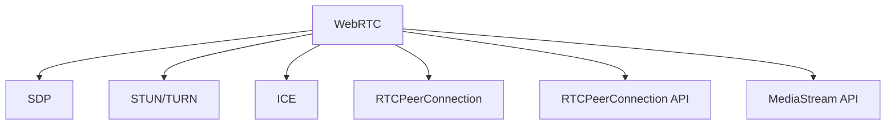

                 

# WebRTC技术：构建实时通信应用

> 关键词：WebRTC, 实时通信, 音视频传输, SDP, STUN/TURN, 数据通道, 音视频编解码

## 1. 背景介绍

### 1.1 问题由来

在互联网快速发展的今天，实时通信应用如在线会议、视频直播、远程教育等已广泛应用于各个行业和领域。而传统的实时通信方案通常依赖于专用的软件和硬件设备，难以大规模普及。WebRTC技术作为基于Web的标准化实时通信协议，能够充分利用浏览器的音视频编解码和网络传输能力，实现端到端、低延迟、高可靠性的实时音视频通信，是构建实时通信应用的重要基石。

### 1.2 问题核心关键点

WebRTC技术自推出以来，以其低延迟、高可靠性和广泛兼容性，在实时通信领域占据了重要地位。其核心原理包括：

- 音视频编解码：WebRTC内置支持多种音视频编解码器，如VP8、VP9、H264等，适配不同的设备和网络环境。
- 网络传输：通过SDP、STUN/TURN、ICE等技术，实现音视频数据的高效传输和路由优化。
- 数据通道：WebRTC不仅支持音视频数据传输，还提供了数据通道API，支持文本、文件等非结构化数据的实时传输。
- 媒体流控制：通过信令和RTX等技术，实现媒体流自适应调节，提高实时通信的稳定性。

这些核心技术构成了WebRTC的基础，使其能够在各种终端和网络环境下，实现高质量的实时通信体验。

### 1.3 问题研究意义

WebRTC技术的发展和应用，对于推动实时通信应用的普及和创新具有重要意义：

1. **降低成本**：利用WebRTC技术，开发者无需购置专用硬件和软件，通过浏览器即可实现高质量的音视频通信，大大降低了实时通信应用的开发和部署成本。
2. **提升体验**：WebRTC技术在音视频编解码、网络传输、媒体流控制等方面进行了优化，能够提供低延迟、高稳定性的实时通信体验，满足用户对实时通信的刚性需求。
3. **增强兼容性**：WebRTC基于Web标准，可以在各种浏览器和设备上无缝运行，增强了实时通信应用的跨平台和跨设备兼容性。
4. **促进创新**：WebRTC的开放性和标准化特性，为实时通信应用的创新和定制化提供了广阔空间，推动了新兴领域的快速发展。

## 2. 核心概念与联系

### 2.1 核心概念概述

为了更好地理解WebRTC技术的原理和应用，本节将介绍几个关键概念：

- WebRTC：由IETF制定的实时通信协议标准，提供音视频、数据等多种通信方式，支持多种编解码和传输技术。
- SDP：Session Description Protocol，用于描述会话的媒体信息和通信参数，是WebRTC进行音视频传输的基础。
- STUN/TURN：Session Traversal Utilities for NAT/Traversal，用于解决NAT穿透问题，实现音视频数据的跨网络传输。
- ICE：Interactive Connectivity Establishment，用于动态获取数据通道和媒体通道的网络地址，实现音视频数据的路由优化。
- RTCPeerConnection：WebRTC的核心API，负责音视频数据的编解码、传输和路由管理，是实时通信应用的核心组件。
- RTCPeerConnection API：WebRTC提供的一组API，用于实现音视频、数据等多种通信方式，支持多种编解码和传输技术。
- MediaStream API：WebRTC提供的音视频流API，用于获取和处理本地设备的音视频流。

这些概念之间的逻辑关系可以通过以下Mermaid流程图来展示：



这个流程图展示了大语言模型的核心概念及其之间的关系：

1. WebRTC是实时通信协议标准的总称，涵盖多种通信方式和API。
2. SDP用于描述会话的媒体信息和通信参数，是音视频传输的基础。
3. STUN/TURN用于解决NAT穿透问题，实现音视频数据的跨网络传输。
4. ICE用于动态获取数据通道和媒体通道的网络地址，实现音视频数据的路由优化。
5. RTCPeerConnection是WebRTC的核心API，负责音视频数据的编解码、传输和路由管理。
6. RTCPeerConnection API是WebRTC提供的一组API，用于实现音视频、数据等多种通信方式。
7. MediaStream API是WebRTC提供的音视频流API，用于获取和处理本地设备的音视频流。

这些概念共同构成了WebRTC的基础框架，使其能够在各种终端和网络环境下，实现高质量的实时通信体验。

## 3. 核心算法原理 & 具体操作步骤
### 3.1 算法原理概述

WebRTC技术的核心在于通过SDP、STUN/TURN、ICE等技术，实现音视频数据的跨网络传输和路由优化。其核心原理包括：

1. **SDP描述**：在WebRTC中，每个媒体流都需要使用SDP进行描述。SDP包含媒体类型、编解码器、传输协议等信息，用于指示音视频数据传输的参数。

2. **NAT穿透**：在网络环境中，不同的设备可能处于不同的NAT之后，直接进行音视频通信存在困难。WebRTC通过STUN/TURN技术，解决NAT穿透问题，实现音视频数据的跨网络传输。

3. **ICE动态获取**：WebRTC使用ICE协议动态获取数据通道和媒体通道的网络地址，进行路由优化，实现音视频数据的稳定传输。

4. **RTCPeerConnection管理**：WebRTC通过RTCPeerConnection API，实现音视频数据的编解码、传输和路由管理，是实时通信应用的核心组件。

### 3.2 算法步骤详解

WebRTC的实现过程大致分为以下几步：

1. **创建RTCPeerConnection**：在客户端使用RTCPeerConnection API创建RTCPeerConnection实例，并配置SDP参数。
2. **设置本地媒体流**：使用MediaStream API获取本地设备的音视频流，并通过RTCPeerConnection API设置到RTCPeerConnection实例中。
3. **发起ICE连接**：使用RTCPeerConnection API发起ICE连接，动态获取数据通道和媒体通道的网络地址。
4. **发起STUN/TURN连接**：使用RTCPeerConnection API发起STUN/TURN连接，解决NAT穿透问题，实现音视频数据的跨网络传输。
5. **完成数据传输**：在WebRTC客户端和服务器端建立连接后，使用RTCPeerConnection API进行音视频数据的编解码、传输和路由管理，完成数据传输。

### 3.3 算法优缺点

WebRTC技术在实时通信领域具有以下优点：

1. **低延迟**：WebRTC内置支持多种音视频编解码器，能够根据网络环境进行自适应调节，实现低延迟的音视频传输。
2. **高稳定性**：WebRTC通过SDP、STUN/TURN、ICE等技术，实现音视频数据的跨网络传输和路由优化，提高了实时通信的稳定性。
3. **广泛兼容性**：WebRTC基于Web标准，能够在各种浏览器和设备上无缝运行，增强了实时通信应用的跨平台和跨设备兼容性。
4. **易于开发**：WebRTC提供了RTCPeerConnection、MediaStream等API，使得开发者能够快速实现音视频通信功能，降低了开发难度。

然而，WebRTC技术也存在一些局限性：

1. **带宽占用高**：WebRTC在音视频编解码、网络传输等方面进行了优化，但带宽占用仍然较高，可能对低带宽网络环境造成影响。
2. **安全性不足**：WebRTC基于Web协议，存在一定的安全风险，需要通过SSL/TLS等技术进行加密和认证。
3. **设备兼容性问题**：部分老旧设备和浏览器可能不支持WebRTC，需要进行兼容性处理。
4. **服务器负载高**：WebRTC需要动态获取数据通道和媒体通道的网络地址，可能对服务器负载造成较大压力。

### 3.4 算法应用领域

WebRTC技术已经广泛应用于各种实时通信场景，包括：

1. **在线会议**：通过WebRTC技术，实现多人视频会议，支持语音和视频的实时传输，增强了远程协作和沟通的效率。
2. **视频直播**：利用WebRTC技术，实现高质量的视频直播和点播，满足用户对高质量音视频体验的需求。
3. **远程教育**：通过WebRTC技术，实现实时视频授课和互动，提升远程教育的教学质量和互动性。
4. **远程医疗**：利用WebRTC技术，实现远程视频咨询和诊断，提高医疗资源的利用效率和覆盖范围。
5. **视频聊天**：通过WebRTC技术，实现个人和多人视频聊天，支持语音和视频的实时传输，增强了人与人之间的互动。
6. **远程协作**：利用WebRTC技术，实现远程协作和文档共享，提升团队工作效率和协作体验。

除了上述这些经典场景外，WebRTC技术还被创新性地应用于虚拟现实、增强现实、协作机器人等新兴领域，为实时通信应用带来了新的发展方向。

## 4. 数学模型和公式 & 详细讲解  
### 4.1 数学模型构建

WebRTC的实现主要依赖于音视频编解码、网络传输、数据通道等技术，这些技术可以通过数学模型进行建模和优化。以下是WebRTC的关键数学模型：

- **音视频编解码**：音视频编解码是WebRTC的基础。常用的编解码器如VP8、VP9、H264等，其压缩比率、编码速度和解码复杂度可以通过数学模型进行建模和优化。
- **网络传输**：WebRTC通过SDP、STUN/TURN、ICE等技术实现音视频数据的跨网络传输。这些技术可以通过数学模型进行建模和优化，如计算NAT穿透的路径、动态获取网络地址等。
- **数据通道**：WebRTC支持多种数据通道，如TCP、UDP等。数据通道的传输速率、丢包率、时延等参数可以通过数学模型进行建模和优化。
- **媒体流控制**：WebRTC通过RTX等技术实现媒体流的自适应调节。这些技术可以通过数学模型进行建模和优化，如计算RTX的码率、时延等参数。

### 4.2 公式推导过程

以下是WebRTC核心技术的主要数学模型及其推导过程：

1. **音视频编解码模型**：音视频编解码是WebRTC的基础。常用的编解码器如VP8、VP9、H264等，其压缩比率、编码速度和解码复杂度可以通过数学模型进行建模和优化。

2. **网络传输模型**：WebRTC通过SDP、STUN/TURN、ICE等技术实现音视频数据的跨网络传输。这些技术可以通过数学模型进行建模和优化，如计算NAT穿透的路径、动态获取网络地址等。

3. **数据通道模型**：WebRTC支持多种数据通道，如TCP、UDP等。数据通道的传输速率、丢包率、时延等参数可以通过数学模型进行建模和优化。

4. **媒体流控制模型**：WebRTC通过RTX等技术实现媒体流的自适应调节。这些技术可以通过数学模型进行建模和优化，如计算RTX的码率、时延等参数。

### 4.3 案例分析与讲解

以下是WebRTC技术在不同场景中的应用案例：

1. **在线会议**：通过WebRTC技术，实现多人视频会议，支持语音和视频的实时传输，增强了远程协作和沟通的效率。
2. **视频直播**：利用WebRTC技术，实现高质量的视频直播和点播，满足用户对高质量音视频体验的需求。
3. **远程教育**：通过WebRTC技术，实现实时视频授课和互动，提升远程教育的教学质量和互动性。
4. **远程医疗**：利用WebRTC技术，实现远程视频咨询和诊断，提高医疗资源的利用效率和覆盖范围。
5. **视频聊天**：通过WebRTC技术，实现个人和多人视频聊天，支持语音和视频的实时传输，增强了人与人之间的互动。
6. **远程协作**：利用WebRTC技术，实现远程协作和文档共享，提升团队工作效率和协作体验。

## 5. 项目实践：代码实例和详细解释说明
### 5.1 开发环境搭建

在进行WebRTC项目实践前，我们需要准备好开发环境。以下是使用JavaScript和Node.js进行WebRTC开发的常见环境配置流程：

1. **安装Node.js**：从官网下载并安装Node.js，用于安装相关依赖和运行代码。
2. **安装WebRTC库**：使用npm或yarn安装WebRTC库，如simple-peer、webrtc-peer-to-peer等。
3. **配置WebSocket**：配置WebSocket服务器，用于进行点对点通信。
4. **配置RTCPeerConnection**：配置RTCPeerConnection实例，设置SDP参数，获取本地音视频流。

完成上述步骤后，即可在本地搭建WebRTC开发环境，进行项目实践。

### 5.2 源代码详细实现

这里我们以简单的WebRTC视频通话为例，给出WebRTC项目的JavaScript代码实现。

首先，创建RTCPeerConnection实例，并设置SDP参数：

```javascript
const peerConnection = new RTCPeerConnection();

// 配置SDP参数
const offerOptions = {
    iceServers: [{ urls: 'stun:stun.l.google.com:19302' }],
    bundlePolicy: 'max-compatible',
    rtcpMuxPolicy: 'require'
};

peerConnection.setLocalDescription(
    await peerConnection.createOffer(offerOptions)
);
```

然后，获取本地音视频流，并设置到RTCPeerConnection实例中：

```javascript
const localStream = await navigator.mediaDevices.getUserMedia({ video: true, audio: true });

// 设置本地音视频流
localStream.getTracks().forEach(track => {
    peerConnection.addTrack(track, localStream);
});
```

接着，使用WebSocket服务器进行点对点通信：

```javascript
const socket = new WebSocket('wss://your-server-url');

socket.onmessage = event => {
    const offer = new RTCSessionDescription(event.data);
    peerConnection.setRemoteDescription(offer);
};
```

最后，完成数据传输：

```javascript
socket.onmessage = event => {
    const offer = new RTCSessionDescription(event.data);
    peerConnection.setRemoteDescription(offer);

    peerConnection.ontrack = event => {
        const remoteTrack = event.streams[0].getVideoTracks()[0];
        localStream.getVideoTracks()[0].srcObject = remoteTrack;
    };
};
```

以上就是WebRTC视频通话的JavaScript代码实现。可以看到，通过RTCPeerConnection、MediaStream等API，即可实现音视频数据的编解码、传输和路由管理，完成数据传输。

### 5.3 代码解读与分析

让我们再详细解读一下关键代码的实现细节：

**RTCPeerConnection实例**：
- 创建RTCPeerConnection实例，设置SDP参数，创建本地 Offer。

**本地音视频流**：
- 使用MediaDevices API获取本地音视频流，将其设置到RTCPeerConnection实例中。

**WebSocket服务器**：
- 配置WebSocket服务器，接收远程 Offer，设置到RTCPeerConnection实例中。

**数据传输**：
- 通过 RTCPeerConnection.ontrack 监听远程音视频流，并将其设置到本地音视频流中。

可以看到，WebRTC技术通过RTCPeerConnection、MediaStream等API，实现了音视频数据的编解码、传输和路由管理，使得实时通信应用变得简单易用。

## 6. 实际应用场景
### 6.1 智能客服系统

WebRTC技术在智能客服系统中具有重要应用价值。通过WebRTC技术，客服系统可以实现实时音视频通话、文字消息互动等功能，大大提高了客服效率和客户满意度。

在技术实现上，可以通过WebRTC技术，实现客服中心与用户的点对点通信，支持语音和文字的实时交互。通过调用RTCPeerConnection API，客服系统可以实时获取和处理用户的音视频流，提供高质量的客服服务。

### 6.2 金融舆情监测

WebRTC技术在金融舆情监测中也有广泛应用。通过WebRTC技术，金融机构可以实现实时监控市场舆情，及时应对负面信息传播，规避金融风险。

具体而言，可以通过WebRTC技术，实现对市场舆情的实时监控和分析。通过调用MediaStream API，获取各类新闻、报道、评论等文本数据，并进行情感分析和主题分类。利用WebRTC技术，将监控结果实时推送给决策层，帮助其快速应对市场波动，规避金融风险。

### 6.3 远程教育

WebRTC技术在远程教育中具有重要应用价值。通过WebRTC技术，可以实现实时视频授课和互动，提升远程教育的教学质量和互动性。

具体而言，可以通过WebRTC技术，实现师生之间的实时视频通话和互动。通过调用RTCPeerConnection API，教师可以实时获取和处理学生的音视频流，进行课堂互动和答疑解惑。通过调用MediaStream API，教师可以获取和处理学生的文本消息，进行互动和反馈。

### 6.4 远程医疗

WebRTC技术在远程医疗中具有重要应用价值。通过WebRTC技术，可以实现远程视频咨询和诊断，提高医疗资源的利用效率和覆盖范围。

具体而言，可以通过WebRTC技术，实现医生和患者之间的实时视频通话和互动。通过调用RTCPeerConnection API，医生可以实时获取和处理患者的音视频流，进行远程诊断和咨询。通过调用MediaStream API，医生可以获取和处理患者的文本消息，进行互动和反馈。

## 7. 工具和资源推荐
### 7.1 学习资源推荐

为了帮助开发者系统掌握WebRTC技术的原理和实践，这里推荐一些优质的学习资源：

1. **WebRTC官方文档**：WebRTC官方文档提供了详细的API文档和开发指南，是学习WebRTC技术的最佳资源。
2. **《WebRTC: Real-Time Communication for the Web》书籍**：这本书系统介绍了WebRTC技术的基本原理和应用场景，适合深入学习WebRTC技术。
3. **MDN WebRTC教程**：MDN WebRTC教程提供了丰富的示例代码和详细文档，是WebRTC技术学习的入门资源。
4. **Webrtc-examples GitHub项目**：Webrtc-examples项目提供了大量的WebRTC示例代码，适合实践和调试。

通过学习这些资源，相信你一定能够快速掌握WebRTC技术的精髓，并用于解决实际的NLP问题。

### 7.2 开发工具推荐

高效的开发离不开优秀的工具支持。以下是几款用于WebRTC开发的常用工具：

1. **Visual Studio Code**：Visual Studio Code是一款功能强大的编辑器，支持JavaScript和Node.js开发，具有丰富的插件和扩展，适合WebRTC开发。
2. **npm/yarn**：npm和yarn是JavaScript和Node.js的包管理工具，支持WebRTC库的安装和依赖管理，方便快速搭建开发环境。
3. **WebSocket**：WebSocket是一种支持点对点通信的协议，可以用于WebRTC开发，具有实时、双向通信的特点。
4. **RTCPeerConnection**：RTCPeerConnection是WebRTC的核心API，负责音视频数据的编解码、传输和路由管理，是实时通信应用的核心组件。
5. **MediaStream API**：MediaStream API是WebRTC提供的音视频流API，用于获取和处理本地设备的音视频流。

合理利用这些工具，可以显著提升WebRTC开发的效率，加快创新迭代的步伐。

### 7.3 相关论文推荐

WebRTC技术的发展和应用得益于学界的持续研究。以下是几篇奠基性的相关论文，推荐阅读：

1. **WebRTC: An Experimental Real-Time Communication Protocol for Web Applications**：WebRTC技术的原版论文，详细介绍了WebRTC的实现原理和应用场景。
2. **WebRTC: A Web-Based Communication Protocol for Real-Time Applications**：WebRTC技术的后续发展论文，介绍了WebRTC技术的改进和优化。
3. **WebRTC: A Real-Time Communication Protocol for Web Applications**：WebRTC技术的官方文档，提供了详细的API文档和开发指南。
4. **WebRTC: Real-Time Communication for the Web**：WebRTC技术的经典论文，详细介绍了WebRTC技术的基本原理和应用场景。
5. **WebRTC: Real-Time Web Communication**：WebRTC技术的经典论文，详细介绍了WebRTC技术的实现原理和应用场景。

这些论文代表了大语言模型微调技术的发展脉络。通过学习这些前沿成果，可以帮助研究者把握学科前进方向，激发更多的创新灵感。

## 8. 总结：未来发展趋势与挑战
### 8.1 总结

本文对WebRTC技术进行了全面系统的介绍。首先阐述了WebRTC技术的发展背景和应用意义，明确了WebRTC在实时通信领域的独特价值。其次，从原理到实践，详细讲解了WebRTC技术的核心原理和关键步骤，给出了WebRTC项目开发的完整代码实例。同时，本文还广泛探讨了WebRTC技术在智能客服、金融舆情、远程教育等多个行业领域的应用前景，展示了WebRTC技术的巨大潜力。此外，本文精选了WebRTC技术的各类学习资源，力求为读者提供全方位的技术指引。

通过本文的系统梳理，可以看到，WebRTC技术在实时通信领域占据了重要地位，以其低延迟、高稳定性和广泛兼容性，为实时通信应用提供了坚实的基础。WebRTC技术的不断演进，必将推动实时通信应用的普及和创新，为数字化转型带来新的机遇。

### 8.2 未来发展趋势

展望未来，WebRTC技术将呈现以下几个发展趋势：

1. **低延迟优化**：随着5G网络的普及，WebRTC技术将进一步优化音视频编解码、网络传输等方面的性能，实现更低延迟的实时通信体验。
2. **高稳定优化**：WebRTC技术将进一步优化音视频编解码、网络传输等方面的性能，实现更高稳定性的实时通信体验。
3. **多模态融合**：WebRTC技术将进一步拓展到语音、视频、文本等多模态数据的融合，增强实时通信应用的丰富性和用户体验。
4. **边缘计算优化**：WebRTC技术将进一步与边缘计算技术结合，实现更高效的数据处理和传输，提高实时通信应用的响应速度和稳定性。
5. **智能推理优化**：WebRTC技术将进一步与人工智能技术结合，实现智能推理和决策，提升实时通信应用的功能性和智能化水平。
6. **安全隐私优化**：WebRTC技术将进一步加强数据加密和隐私保护，确保实时通信应用的安全性和用户隐私。

以上趋势凸显了WebRTC技术的广阔前景。这些方向的探索发展，必将进一步提升实时通信应用的性能和应用范围，为数字化转型带来新的机遇。

### 8.3 面临的挑战

尽管WebRTC技术已经取得了显著成果，但在迈向更加智能化、普适化应用的过程中，它仍面临诸多挑战：

1. **带宽占用问题**：WebRTC技术在音视频编解码、网络传输等方面进行了优化，但带宽占用仍然较高，可能对低带宽网络环境造成影响。如何进一步降低带宽占用，将是一大难题。
2. **设备兼容性问题**：部分老旧设备和浏览器可能不支持WebRTC，需要进行兼容性处理。如何提升设备兼容性，增强实时通信应用的普及性，还需要更多技术突破。
3. **服务器负载问题**：WebRTC技术需要动态获取数据通道和媒体通道的网络地址，可能对服务器负载造成较大压力。如何优化服务器负载，提升实时通信应用的稳定性，还需进一步研究。
4. **安全隐私问题**：WebRTC技术基于Web协议，存在一定的安全风险，需要通过SSL/TLS等技术进行加密和认证。如何加强安全隐私保护，确保实时通信应用的安全性和用户隐私，将是一个重要课题。

### 8.4 未来突破

面对WebRTC技术所面临的挑战，未来的研究需要在以下几个方面寻求新的突破：

1. **优化音视频编解码**：进一步优化音视频编解码技术，实现更低延迟、更高质量的音视频传输。
2. **提升设备兼容性**：提升WebRTC技术的设备兼容性，支持更多老旧设备和浏览器，增强实时通信应用的普及性。
3. **优化服务器负载**：优化WebRTC技术的服务器负载，实现更高效的动态获取网络地址和路由优化。
4. **加强安全隐私保护**：加强WebRTC技术的安全隐私保护，确保实时通信应用的安全性和用户隐私。
5. **融合多模态数据**：融合语音、视频、文本等多模态数据，增强实时通信应用的功能性和用户体验。
6. **结合边缘计算**：结合边缘计算技术，实现更高效的数据处理和传输，提高实时通信应用的响应速度和稳定性。

这些研究方向的探索，必将引领WebRTC技术迈向更高的台阶，为数字化转型带来新的机遇。面向未来，WebRTC技术还需要与其他技术进行更深入的融合，如人工智能、物联网、边缘计算等，共同推动实时通信应用的发展。只有勇于创新、敢于突破，才能不断拓展WebRTC技术的边界，让实时通信应用更好地服务于数字化转型。

## 9. 附录：常见问题与解答

**Q1：WebRTC是否适用于所有设备？**

A: WebRTC技术基于Web协议，可以在大多数现代浏览器和设备上运行。然而，部分老旧设备和浏览器可能不支持WebRTC，需要进行兼容性处理。为确保WebRTC应用的广泛兼容性，开发者需要对不同设备进行测试和适配。

**Q2：WebRTC的带宽占用问题如何解决？**

A: WebRTC技术的带宽占用较高，可能对低带宽网络环境造成影响。解决这一问题的方法包括：
1. 优化音视频编解码器，降低带宽占用。
2. 压缩音视频数据，减少带宽占用。
3. 动态调整编解码器参数，根据网络环境进行自适应调节。

**Q3：WebRTC的设备兼容性问题如何解决？**

A: WebRTC技术需要动态获取数据通道和媒体通道的网络地址，可能对老旧设备和浏览器造成兼容性问题。解决这一问题的方法包括：
1. 使用Polyfill技术，支持老旧设备和浏览器。
2. 使用降级策略，在老旧设备和浏览器上使用传统的通信方式。
3. 测试和适配不同设备和浏览器，确保WebRTC应用的兼容性。

**Q4：WebRTC的服务器负载问题如何解决？**

A: WebRTC技术需要动态获取数据通道和媒体通道的网络地址，可能对服务器负载造成较大压力。解决这一问题的方法包括：
1. 优化动态获取网络地址的算法，减少服务器负载。
2. 使用负载均衡技术，分散服务器负载。
3. 优化音视频编解码和传输过程，减少服务器负载。

**Q5：WebRTC的安全隐私问题如何解决？**

A: WebRTC技术基于Web协议，存在一定的安全风险。解决这一问题的方法包括：
1. 使用SSL/TLS等技术，对音视频数据进行加密和认证。
2. 使用端到端加密技术，确保音视频数据的隐私和安全。
3. 加强访问控制和安全策略，确保WebRTC应用的安全性和用户隐私。

**Q6：WebRTC的智能推理问题如何解决？**

A: WebRTC技术可以结合人工智能技术，实现智能推理和决策。解决这一问题的方法包括：
1. 引入深度学习算法，增强WebRTC应用的智能化水平。
2. 结合自然语言处理技术，实现智能语音识别和自然语言生成。
3. 结合计算机视觉技术，实现智能视频分析和内容推荐。

通过这些方法，WebRTC技术将能够更好地适应各种应用场景，为数字化转型带来新的机遇。总之，WebRTC技术需要在带宽占用、设备兼容性、服务器负载、安全隐私、智能推理等方面不断优化和突破，才能实现更加广泛和深入的应用。

---

作者：禅与计算机程序设计艺术 / Zen and the Art of Computer Programming

