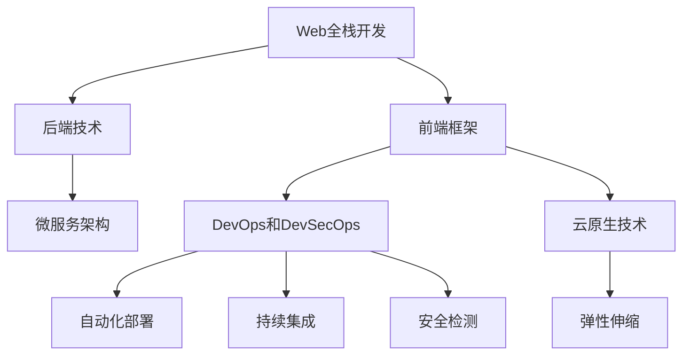

                 

# Web全栈开发：前端框架与后端技术融合

> 关键词：Web全栈开发，前端框架，后端技术，前端与后端融合，全栈开发实践，Web应用架构，前端开发工具，后端开发工具，微服务架构，DevOps，DevSecOps，云原生技术

## 1. 背景介绍

随着Web技术的不断演进，Web全栈开发成为一种不可或缺的技能。现代Web应用通常需要前端和后端技术的协同合作，才能构建出高效、稳定、灵活的解决方案。前端框架如React、Vue等提供了丰富的UI组件和状态管理工具，而后端技术如Node.js、Django等则提供了强大的数据处理和业务逻辑实现能力。本文将详细介绍Web全栈开发的核心概念、原理和具体实践，探讨前端框架与后端技术的深度融合，以期为开发者提供全面的技术指导。

## 2. 核心概念与联系

### 2.1 核心概念概述

为更好地理解Web全栈开发，本节将介绍几个密切相关的核心概念：

- **Web全栈开发**：指具备前端和后端开发能力，能够独立构建完整Web应用的能力。全栈开发不仅需要掌握前端和后端的开发技能，还需要对整个Web应用架构有深入理解。
- **前端框架**：如React、Vue、Angular等，提供了组件化开发、状态管理、路由管理等功能，极大提升了Web应用开发效率。
- **后端技术**：如Node.js、Django、Ruby on Rails等，提供了RESTful API、数据库操作、认证授权等功能，为Web应用提供稳定的数据处理和业务逻辑实现能力。
- **微服务架构**：将Web应用拆分为多个独立服务的架构设计，每个服务负责一个具体的功能模块，便于独立部署和扩展。
- **DevOps和DevSecOps**：通过自动化工具和持续集成流程，加速Web应用的开发和部署，同时引入安全机制，确保Web应用的安全性。
- **云原生技术**：包括容器化、服务网格、服务器less等技术，通过弹性伸缩、自动扩缩容等特性，提升Web应用的稳定性和可扩展性。

这些核心概念之间的逻辑关系可以通过以下Mermaid流程图来展示：



这个流程图展示了这个体系中各个组件之间的相互联系：

1. Web全栈开发通过前端框架和后端技术的结合，构建出完整的Web应用。
2. 前端框架和后端技术各自负责不同功能的实现，通过微服务架构进行拆分和组合。
3. DevOps和DevSecOps引入自动化工具和持续集成流程，加速Web应用的开发和部署，并确保其安全性。
4. 云原生技术通过容器化、服务网格等手段，提供更高的可靠性和扩展性。

## 3. 核心算法原理 & 具体操作步骤

### 3.1 算法原理概述

Web全栈开发的核心在于前端框架和后端技术的融合，构建一个完整的Web应用。前端框架和后端技术需要协同工作，共同实现Web应用的所有功能。以下是对其核心原理的详细描述：

- **前端开发**：主要负责Web应用的UI和用户体验。前端框架提供了丰富的UI组件和状态管理工具，通过React、Vue等框架，开发者可以快速构建出精美的用户界面和交互逻辑。
- **后端开发**：主要负责Web应用的数据处理和业务逻辑实现。后端技术如Node.js、Django等提供了RESTful API、数据库操作、认证授权等功能，确保数据处理的安全性和可靠性。

前端和后端的协同工作，需要满足以下基本要求：

1. 前端和后端的数据交互需要统一的API接口。
2. 前端和后端需要共享数据状态，实现一致性。
3. 前端和后端需要协同处理异常情况，提升用户体验。

### 3.2 算法步骤详解

Web全栈开发的核心算法步骤包括：

**Step 1: 设计前端和后端架构**
- 确定Web应用的功能需求，设计前端和后端的架构设计。
- 选择合适的前端框架和后端技术栈，确保兼容性。

**Step 2: 实现前端界面**
- 根据设计文档，使用前端框架实现Web应用的UI界面。
- 引入状态管理工具，管理组件间的数据状态。
- 实现路由管理，确保页面之间的无缝切换。

**Step 3: 实现后端API**
- 根据前端需求，设计后端API接口。
- 实现API接口，提供RESTful API服务。
- 实现业务逻辑，处理数据交互和业务逻辑。

**Step 4: 前后端协同工作**
- 实现前后端数据交互，确保数据一致性。
- 实现前端和后端的异常处理机制，提升用户体验。
- 进行自动化测试，确保应用稳定性。

**Step 5: 部署和维护**
- 将Web应用部署到生产环境。
- 定期维护和更新，提升应用性能和安全性。

### 3.3 算法优缺点

Web全栈开发具有以下优点：

1. 提高开发效率：前端框架提供了丰富的UI组件和状态管理工具，极大提升了开发效率。
2. 提升应用性能：通过前后端协同工作，可以更好地优化性能。
3. 增强应用稳定性：DevOps和DevSecOps可以加速开发和部署，并确保应用的安全性。

同时，Web全栈开发也存在一定的局限性：

1. 需要掌握多种技能：前端和后端技术都需要熟练掌握，增加了学习成本。
2. 需要协同合作：前端和后端需要协同工作，难以独立完成任务。
3. 开发复杂度较高：前端和后端协同工作，需要考虑多方面的因素，开发复杂度较高。

尽管存在这些局限性，但Web全栈开发仍然是当前Web应用开发的主流范式。未来相关研究将集中在如何进一步提升开发效率、降低开发复杂度等方面。

### 3.4 算法应用领域

Web全栈开发在多个领域都有广泛的应用，例如：

- **电商网站**：通过全栈开发技术，可以实现商品展示、购物车、支付等功能。
- **在线教育平台**：通过前端和后端技术，可以实现课程视频、互动问答、作业批改等功能。
- **医疗平台**：通过全栈开发技术，可以实现患者预约、医疗记录、在线咨询等功能。
- **社交平台**：通过前端和后端技术，可以实现用户注册、动态更新、消息推送等功能。

除了上述这些领域外，Web全栈开发还在金融、政府、媒体等多个领域得到广泛应用，为各行各业提供了强大的技术支持。

## 4. 数学模型和公式 & 详细讲解 & 举例说明

### 4.1 数学模型构建

Web全栈开发的数学模型构建主要涉及前端和后端的协同工作。以下是一个简单的示例：

假设Web应用需要展示一个商品列表，涉及前端和后端的数据交互和协同工作。

**前端模型**：使用Vue框架，设计商品列表组件。

**后端模型**：使用Node.js和MongoDB，实现商品列表的API接口和数据库操作。

### 4.2 公式推导过程

以下推导Web应用数据交互的数学模型：

1. **前端请求商品列表数据**
   - 前端发送请求到后端API接口。
   - 后端API接口返回商品列表数据。

2. **后端查询数据库**
   - 后端根据API请求，查询MongoDB数据库，获取商品列表数据。
   - 将查询结果返回给前端。

3. **前端渲染商品列表**
   - 前端接收后端返回的数据，渲染商品列表界面。
   - 更新页面上的商品列表数据。

### 4.3 案例分析与讲解

以一个电商网站的商品搜索功能为例，详细讲解前后端协同工作的流程：

- **前端实现**：
  - 用户输入搜索关键词，前端发送API请求到后端。
  - 后端接收API请求，查询商品数据库，返回匹配的商品列表。
  - 前端接收后端返回的商品列表数据，渲染搜索结果页面。
- **后端实现**：
  - 接收前端API请求，查询商品数据库，获取匹配的商品列表。
  - 将商品列表数据封装成JSON格式，返回给前端。
  - 提供异常处理机制，确保数据交互的稳定性。

通过以上步骤，前端和后端协同工作，完成了商品搜索功能，提升了用户体验和应用性能。

## 5. 项目实践：代码实例和详细解释说明

### 5.1 开发环境搭建

在进行全栈开发实践前，我们需要准备好开发环境。以下是使用Node.js和Vue进行Web应用开发的环境配置流程：

1. 安装Node.js：从官网下载并安装Node.js，以便运行Node.js应用程序。
2. 安装Vue CLI：在终端运行以下命令，安装Vue CLI：
   ```
   npm install -g @vue/cli
   ```
3. 创建项目：在终端运行以下命令，创建一个新的Vue项目：
   ```
   vue create my-project
   ```

### 5.2 源代码详细实现

下面以一个简单的电商商品展示Web应用为例，给出完整的代码实现：

**前端代码**：
```javascript
// 商品列表组件
<template>
  <div>
    <h2>商品列表</h2>
    <ul>
      <li v-for="item in items" :key="item.id">
        {{ item.name }} - {{ item.price }}
      </li>
    </ul>
  </div>
</template>

<script>
import axios from 'axios';
export default {
  data() {
    return {
      items: []
    }
  },
  created() {
    axios.get('/api/products').then(response => {
      this.items = response.data
    });
  }
}
</script>
```

**后端代码**：
```javascript
// 商品列表API接口
const express = require('express');
const mongoose = require('mongoose');
const app = express();
const port = 3000;

mongoose.connect('mongodb://localhost:27017/my-project', { useNewUrlParser: true, useUnifiedTopology: true });

// 商品模型
const Product = mongoose.model('Product', new mongoose.Schema({
  name: String,
  price: Number
}));

app.use(express.json());

app.get('/api/products', (req, res) => {
  Product.find({}, (err, products) => {
    if (err) {
      res.status(500).send(err);
    } else {
      res.send(products);
    }
  });
});

app.listen(port, () => {
  console.log(`Server running on port ${port}`);
});
```

### 5.3 代码解读与分析

让我们再详细解读一下关键代码的实现细节：

**前端代码**：
- 使用Vue框架，设计商品列表组件。
- 通过axios库，发送API请求到后端，获取商品列表数据。
- 使用v-for指令，渲染商品列表数据。

**后端代码**：
- 使用Express框架，创建商品列表API接口。
- 使用MongoDB数据库，存储商品数据。
- 实现商品列表查询接口，返回商品数据。

通过前端和后端的协同工作，实现了一个简单的商品展示Web应用。

### 5.4 运行结果展示

在终端运行以下命令，启动Web应用：
```
npm run serve
```

在浏览器访问http://localhost:8080，即可看到商品列表页面。

## 6. 实际应用场景

### 6.1 电商平台

全栈开发技术在电商平台中得到了广泛应用，例如淘宝、京东等大型电商网站。通过全栈开发技术，可以构建一个功能丰富、用户体验良好的电商平台。电商平台需要前后端协同工作，共同实现商品展示、购物车、支付等功能。

### 6.2 在线教育平台

在线教育平台如Coursera、Udemy等，通过全栈开发技术，实现课程视频、互动问答、作业批改等功能。前端框架和后端技术协同工作，可以提供稳定的教学和学习环境。

### 6.3 医疗平台

医疗平台如HealthCare.gov等，通过全栈开发技术，实现患者预约、医疗记录、在线咨询等功能。前端框架和后端技术协同工作，可以提供高效、安全的医疗服务。

### 6.4 社交平台

社交平台如Facebook、Twitter等，通过全栈开发技术，实现用户注册、动态更新、消息推送等功能。前端和后端协同工作，可以提供稳定的社交体验。

## 7. 工具和资源推荐

### 7.1 学习资源推荐

为了帮助开发者系统掌握Web全栈开发的技术基础和实践技巧，这里推荐一些优质的学习资源：

1. Vue官方文档：详细介绍了Vue框架的使用方法和最佳实践，是学习Vue的重要参考资料。
2. Node.js官方文档：介绍了Node.js的核心概念和开发方法，是学习Node.js的入门指南。
3. FullStack Deep Dive：是一本全面的Web全栈开发书籍，涵盖了前端和后端技术的深度讲解。
4. Udemy课程：提供了丰富的全栈开发课程，包括前端、后端、DevOps等多个方向。
5. freeCodeCamp：提供免费的全栈开发课程，涵盖前端、后端、数据库等多个技术栈。

通过对这些资源的学习实践，相信你一定能够快速掌握Web全栈开发的技能，并用于解决实际的Web开发问题。

### 7.2 开发工具推荐

高效的开发离不开优秀的工具支持。以下是几款用于Web全栈开发开发的常用工具：

1. Vue CLI：快速创建Vue项目，提供开箱即用的开发环境。
2. Express框架：轻量级的Node.js框架，提供RESTful API接口的开发能力。
3. MongoDB：开源的NoSQL数据库，适合存储JSON格式的数据。
4. Mongoose：MongoDB的官方Node.js驱动程序，提供便捷的数据操作接口。
5. Git：版本控制系统，方便代码的协同管理和版本控制。
6. Docker：容器化技术，方便应用的部署和迁移。

合理利用这些工具，可以显著提升Web全栈开发任务的开发效率，加快创新迭代的步伐。

### 7.3 相关论文推荐

Web全栈开发技术的发展源于学界的持续研究。以下是几篇奠基性的相关论文，推荐阅读：

1. Web Application Architecture: Patterns for Mastering Complexity：介绍Web应用架构的设计模式，涵盖前端和后端的协同工作。
2. MVC: The Model-View-Controller Design Pattern：详细讲解MVC模式，适用于前端和后端协同工作的经典架构。
3. Designing Web Applications: A Developer's Guide to Web Applications：一本全面的Web应用设计书籍，涵盖前端和后端的开发方法和最佳实践。

这些论文代表了大规模语言模型微调技术的发展脉络。通过学习这些前沿成果，可以帮助研究者把握学科前进方向，激发更多的创新灵感。

## 8. 总结：未来发展趋势与挑战

### 8.1 总结

本文对Web全栈开发的核心概念、原理和具体实践进行了全面系统的介绍。首先阐述了Web全栈开发的背景和意义，明确了前端框架和后端技术的融合在Web应用开发中的重要性。其次，从原理到实践，详细讲解了Web全栈开发的前后端协同工作，给出了前后端协同的完整代码实例。同时，本文还广泛探讨了Web全栈开发在电商、教育、医疗等多个行业领域的应用前景，展示了全栈范式的巨大潜力。此外，本文精选了全栈开发技术的各类学习资源，力求为读者提供全方位的技术指引。

通过本文的系统梳理，可以看到，Web全栈开发技术已经成为现代Web应用开发的主流范式，极大地提升了开发效率和应用性能。未来，伴随Web技术的持续演进，全栈开发技术还将继续发展，为构建高效、稳定、灵活的Web应用提供坚实的技术基础。

### 8.2 未来发展趋势

展望未来，Web全栈开发技术将呈现以下几个发展趋势：

1. 微服务架构的普及。微服务架构将使Web应用更加灵活、可扩展，通过服务拆分和组合，提升应用的性能和稳定性。
2. DevOps和DevSecOps的普及。DevOps和DevSecOps将加速Web应用的开发和部署，同时确保应用的安全性，提升开发效率。
3. 云原生技术的普及。云原生技术将通过弹性伸缩、自动扩缩容等特性，提升Web应用的可靠性和可扩展性。
4. 前端和后端的深度融合。前端和后端的深度融合，将使Web应用具备更高的灵活性和用户体验。

这些趋势将进一步推动Web全栈开发技术的演进，为构建高效、稳定、灵活的Web应用提供更多的技术支持。

### 8.3 面临的挑战

尽管Web全栈开发技术已经取得了显著成果，但在迈向更加智能化、普适化应用的过程中，它仍面临着诸多挑战：

1. 技术栈选择复杂。选择前端和后端的技术栈，需要考虑兼容性、性能、可扩展性等多个因素。
2. 协同工作难度大。前端和后端协同工作，需要考虑多方面的因素，开发复杂度较高。
3. 学习成本高。前端和后端技术都需要熟练掌握，增加了学习成本。
4. 部署和维护难度大。Web应用的部署和维护，需要考虑多方面的因素，开发复杂度较高。

尽管存在这些挑战，但Web全栈开发技术的普及和演进，已经在很大程度上提升了Web应用的开发效率和用户体验。未来相关研究将继续探索如何进一步降低开发复杂度，提升开发效率，同时也将注重技术栈的选择和优化。

### 8.4 研究展望

面对Web全栈开发所面临的种种挑战，未来的研究需要在以下几个方面寻求新的突破：

1. 技术栈的优化。通过选择合适的技术栈，降低开发复杂度，提升开发效率。
2. 协同工作的优化。通过改进协同工作的流程和机制，提升前后端的协作效率。
3. 自动化工具的引入。通过引入自动化工具和持续集成流程，加速Web应用的开发和部署，同时确保其安全性。
4. 云原生技术的引入。通过云原生技术，提升Web应用的可靠性和可扩展性。

这些研究方向的探索，将引领Web全栈开发技术迈向更高的台阶，为构建高效、稳定、灵活的Web应用提供更多的技术支持。总之，Web全栈开发需要开发者根据具体任务，不断迭代和优化模型、数据和算法，方能得到理想的效果。

## 9. 附录：常见问题与解答

**Q1：Web全栈开发是否适用于所有Web应用？**

A: Web全栈开发在大多数Web应用上都能取得不错的效果，特别是对于数据量较小的任务。但对于一些特定领域的任务，如医学、法律等，仅仅依靠通用语料预训练的模型可能难以很好地适应。此时需要在特定领域语料上进一步预训练，再进行微调，才能获得理想效果。此外，对于一些需要时效性、个性化很强的任务，如对话、推荐等，全栈开发方法也需要针对性的改进优化。

**Q2：前端和后端如何协同工作？**

A: 前端和后端的协同工作需要满足以下基本要求：

1. 前端和后端的数据交互需要统一的API接口。
2. 前端和后端需要共享数据状态，实现一致性。
3. 前端和后端需要协同处理异常情况，提升用户体验。

前端和后端协同工作，需要遵循以下步骤：

1. 确定API接口和数据格式。
2. 实现前端和后端的接口对接。
3. 实现数据交互和异常处理机制。

通过以上步骤，前端和后端协同工作，可以完成Web应用的开发和部署。

**Q3：如何选择合适的技术栈？**

A: 选择前端和后端的技术栈，需要考虑兼容性、性能、可扩展性等多个因素。以下是一些选择技术栈的指导原则：

1. 前端技术栈：选择主流的前端框架，如React、Vue、Angular等，考虑其生态和社区支持。
2. 后端技术栈：选择主流的后端框架，如Node.js、Django、Ruby on Rails等，考虑其性能和稳定性。
3. 考虑数据处理需求：选择适合的数据库和数据处理工具，如MongoDB、MySQL、Hadoop等。
4. 考虑扩展性和维护性：选择适合微服务架构和DevOps的开发工具，如Docker、Kubernetes等。

通过合理选择技术栈，可以降低开发复杂度，提升开发效率。

**Q4：如何确保Web应用的安全性？**

A: 确保Web应用的安全性，需要考虑以下几个方面：

1. 使用HTTPS协议，确保数据传输的安全性。
2. 实现身份认证和授权机制，防止未经授权的访问。
3. 使用Web应用防火墙，防止SQL注入、XSS等攻击。
4. 定期更新和维护应用，修补安全漏洞。

通过以上措施，可以提升Web应用的安全性，保障用户的隐私和数据安全。

**Q5：如何优化Web应用的性能？**

A: 优化Web应用的性能，需要考虑以下几个方面：

1. 使用CDN加速静态资源加载。
2. 使用缓存技术，减少服务器响应时间。
3. 使用异步加载技术，提高页面加载速度。
4. 优化数据库查询，减少数据处理时间。

通过以上措施，可以提升Web应用的性能，提升用户体验。

---

作者：禅与计算机程序设计艺术 / Zen and the Art of Computer Programming

