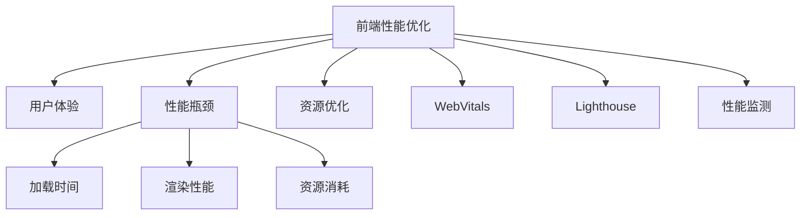

                 

# Web前端性能优化最佳实践

> 关键词：前端性能优化, 用户体验, 性能瓶颈, 资源优化, WebVitals, Lighthouse, 性能监测

## 1. 背景介绍

随着互联网的蓬勃发展，Web应用已经成为了现代生活中不可或缺的一部分。然而，Web前端性能问题也随之而来，用户在使用过程中经常遇到页面加载缓慢、卡顿、响应迟钝等问题，严重影响用户体验。优化Web前端性能不仅能够提升用户体验，还能够降低服务器负载，提高资源利用率。

### 1.1 问题由来
Web前端性能问题通常包括以下几个方面：

- **加载时间慢**：页面的初始加载时间过长，导致用户等待时间增加。
- **渲染性能差**：页面的渲染过程不流畅，出现闪烁、卡顿现象。
- **资源冗余**：页面加载了大量的不必要的资源，导致性能低下。
- **交互响应慢**：用户的交互操作响应时间过长，影响用户的使用体验。

这些问题都会直接影响用户体验，导致用户流失。因此，优化Web前端性能成为了提高用户体验和增加用户留存的关键。

## 2. 核心概念与联系

### 2.1 核心概念概述

为更好地理解Web前端性能优化方法，本节将介绍几个密切相关的核心概念：

- **前端性能优化(Frontend Performance Optimization)**：通过减少加载时间、提高渲染性能、减少资源消耗等手段，提升Web页面的用户体验。
- **用户体验(User Experience, UX)**：指用户在使用Web应用过程中感受到的直观体验，包括页面加载速度、响应时间、渲染效果等。
- **性能瓶颈(Performance Bottleneck)**：指影响Web页面性能的关键因素，如加载时间、渲染性能、资源消耗等。
- **资源优化(Resource Optimization)**：通过减少不必要的资源加载，提升Web页面的性能。
- **WebVitals**：Google推出的性能指标标准，包括CLS、FID、FCP等，用于评估Web页面的性能。
- **Lighthouse**：Chrome DevTools中的性能分析工具，用于评估Web页面的性能和优化建议。
- **性能监测(Performance Monitoring)**：通过工具或代码监控Web页面的性能指标，及时发现问题并优化。

这些核心概念之间的逻辑关系可以通过以下Mermaid流程图来展示：



这个流程图展示了这个优化过程的基本流程：

1. 前端性能优化直接关系到用户体验。
2. 性能瓶颈包括加载时间、渲染性能、资源消耗等。
3. 通过优化加载时间和渲染性能，减少资源消耗，可以提升Web页面性能。
4. WebVitals和Lighthouse是性能评估和优化工具。
5. 性能监测可以持续监控Web页面的性能指标，及时发现问题。

## 3. 核心算法原理 & 具体操作步骤
### 3.1 算法原理概述

Web前端性能优化的核心思想是减少加载时间、提高渲染性能、减少资源消耗等。其核心算法原理可以总结如下：

- **延迟加载(Lazy Loading)**：对于页面中的非关键资源，如图片、脚本等，采用延迟加载的方式，只有在用户滚动到该部分时才加载，减少页面初始加载时间。
- **异步加载(Asynchronous Loading)**：将脚本等资源异步加载，避免阻塞页面渲染，提高页面响应速度。
- **缓存(Caching)**：对于常访问的资源，如图片、脚本等，采用缓存技术，减少资源加载时间。
- **资源合并与压缩(Minification and Compression)**：合并CSS和JavaScript文件，并对其进行压缩，减少文件大小，提高加载速度。
- **CSS Sprites**：将多个小图片合并成一个大图片，减少HTTP请求次数，提高页面加载速度。
- **浏览器缓存(Browser Caching)**：通过设置合适的缓存策略，提高资源的加载速度。

这些原理都是通过减少资源加载和优化渲染性能来提升Web页面性能的。

### 3.2 算法步骤详解

Web前端性能优化的具体步骤如下：

**Step 1: 性能分析**

- 使用Lighthouse或WebVitals等工具，分析Web页面的性能瓶颈，确定加载时间、渲染性能、资源消耗等问题。
- 根据性能分析结果，制定优化策略。

**Step 2: 优化加载时间**

- 采用延迟加载和异步加载技术，减少页面初始加载时间。
- 利用浏览器缓存，提高常访问资源的加载速度。
- 使用CSS Sprites技术，减少HTTP请求次数。

**Step 3: 优化渲染性能**

- 采用CSS动画和硬件加速技术，提高渲染性能。
- 减少DOM和CSS的选择器数量，提高渲染速度。
- 利用虚拟DOM和懒加载技术，减少渲染时间和内存消耗。

**Step 4: 优化资源消耗**

- 采用资源合并与压缩技术，减少文件大小，提高加载速度。
- 使用CDN和缓存策略，减少资源的加载时间。
- 优化JavaScript代码，减少不必要的资源消耗。

**Step 5: 性能监测与调优**

- 利用性能监测工具，持续监控Web页面的性能指标，及时发现问题。
- 根据性能监测结果，不断调整优化策略，持续优化Web页面性能。

### 3.3 算法优缺点

Web前端性能优化的优点包括：

- **提升用户体验**：通过减少加载时间和提高渲染性能，提升用户的使用体验。
- **降低服务器负载**：优化Web页面性能，减少不必要资源的加载，降低服务器负载。
- **提高资源利用率**：通过合理的缓存策略和资源合并技术，提高资源的利用率。

其缺点主要体现在：

- **开发复杂度增加**：需要投入额外的时间和精力进行性能优化。
- **代码维护困难**：优化后的代码可能变得复杂，难以维护。

尽管如此，前端性能优化仍然是提高Web应用性能的重要手段，值得开发者在开发过程中进行深入研究和实践。

### 3.4 算法应用领域

Web前端性能优化技术在以下几个领域得到了广泛应用：

- **电商网站**：优化产品展示、商品详情页等页面的加载和渲染性能，提升用户体验。
- **新闻门户网站**：优化新闻文章、视频等内容的加载和渲染性能，提高页面浏览速度。
- **企业门户网站**：优化员工登录、公司新闻、产品介绍等页面的性能，提升员工和客户的使用体验。
- **社交网络平台**：优化用户动态、私信、评论等功能的加载和渲染性能，提升用户的使用体验。

除了上述这些典型应用外，Web前端性能优化技术还广泛应用于各类Web应用中，为提升用户体验和提升应用性能做出了重要贡献。

## 4. 数学模型和公式 & 详细讲解 & 举例说明

### 4.1 数学模型构建

Web前端性能优化涉及的数学模型主要包括以下几个方面：

- **加载时间模型**：页面加载时间由多个部分组成，包括DNS查询时间、TCP连接时间、SSL握手时间、HTTP请求时间、资源下载时间等。
- **渲染性能模型**：渲染性能由DOM构建时间和CSS布局时间等组成。
- **资源消耗模型**：资源消耗由JavaScript文件大小、CSS文件大小、图片大小等组成。

### 4.2 公式推导过程

以加载时间模型为例，其计算公式如下：

$$
T_{load} = T_{DNS} + T_{TCP} + T_{SSL} + T_{HTTP} + T_{resource}
$$

其中，$T_{DNS}$ 表示DNS查询时间，$T_{TCP}$ 表示TCP连接时间，$T_{SSL}$ 表示SSL握手时间，$T_{HTTP}$ 表示HTTP请求时间，$T_{resource}$ 表示资源下载时间。

### 4.3 案例分析与讲解

假设有一个包含10个图片的Web页面，每个图片大小为100KB，延迟加载时间为1秒，HTTP请求时间为2秒，DNS查询时间为0.5秒，TCP连接时间为0.5秒，SSL握手时间为0.5秒，则该页面的加载时间计算如下：

$$
T_{load} = 0.5 + 0.5 + 0.5 + 2 + 10 \times 1 = 9.5 \text{ 秒}
$$

在优化过程中，可以将图片大小压缩至50KB，延迟加载时间减半，则新的加载时间为：

$$
T_{load} = 0.5 + 0.5 + 0.5 + 2 + 10 \times 0.5 = 5.5 \text{ 秒}
$$

可以看出，通过优化加载时间和资源大小，可以显著提升Web页面的加载性能。

## 5. 项目实践：代码实例和详细解释说明

### 5.1 开发环境搭建

在进行前端性能优化实践前，我们需要准备好开发环境。以下是使用JavaScript进行项目优化开发的环境配置流程：

1. 安装Node.js：从官网下载并安装Node.js，用于运行JavaScript代码。

2. 安装npm和yarn：npm和yarn是JavaScript项目常用的包管理工具，可以从Node.js官网下载并配置。

3. 创建项目：使用npm或yarn初始化项目，选择TypeScript或JavaScript作为项目语言。

4. 安装性能优化工具：如Lighthouse、Webpack等，用于性能分析和代码优化。

完成上述步骤后，即可在开发环境中进行前端性能优化实践。

### 5.2 源代码详细实现

以下是前端性能优化项目的具体实现：

**Step 1: 性能分析**

使用Lighthouse工具，对Web页面进行性能分析，生成性能报告。

**Step 2: 优化加载时间**

1. 使用Webpack进行代码打包，启用TreeShaking和CodeSplitting功能。
2. 使用Deferred和IntersectionObserver实现延迟加载和异步加载。
3. 使用CDN和浏览器缓存策略，减少资源的加载时间。

**Step 3: 优化渲染性能**

1. 使用CSS动画和硬件加速技术，提高渲染性能。
2. 减少DOM和CSS的选择器数量，提高渲染速度。
3. 利用虚拟DOM和懒加载技术，减少渲染时间和内存消耗。

**Step 4: 优化资源消耗**

1. 采用资源合并与压缩技术，减少文件大小，提高加载速度。
2. 使用CDN和缓存策略，减少资源的加载时间。
3. 优化JavaScript代码，减少不必要的资源消耗。

**Step 5: 性能监测与调优**

1. 使用Lighthouse或WebVitals工具，持续监控Web页面的性能指标。
2. 根据性能监测结果，不断调整优化策略，持续优化Web页面性能。

### 5.3 代码解读与分析

让我们再详细解读一下关键代码的实现细节：

**Lighthouse性能分析**

使用以下命令运行Lighthouse性能分析：

```bash
lighthouse --output=html --log-level=info http://example.com/
```

将输出性能报告，包含加载时间、渲染性能、资源消耗等关键指标。

**Webpack优化**

使用以下配置文件进行Webpack优化：

```javascript
module.exports = {
  optimization: {
    minimizer: [
      new UglifyJsPlugin(),
      new OptimizeCSSAssetsPlugin()
    ],
    splitChunks: {
      chunks: 'all'
    },
    cache: true,
    cacheGroups: {
      default: {
        name: 'default',
        chunks: false
      },
      vendor: {
        name: 'vendor',
        chunks: 'all',
        test: /[\\/]node_modules[\\/]/,
        commonChunk: false,
        nameModules: false
      }
    }
  }
};
```

**Deferred和IntersectionObserver实现延迟加载**

```javascript
const images = document.querySelectorAll('img[data-src]');

for (let img of images) {
  img.dataset.src = img.getAttribute('data-src');
  img.addEventListener('load', () => {
    img.removeAttribute('data-src');
    img.onload = null;
  });
}

const options = {
  root: null,
  rootMargin: '0px',
  threshold: 0.5
};

const observer = new IntersectionObserver(entries => {
  entries.forEach(entry => {
    if (entry.isIntersecting) {
      const image = entry.target;
      image.src = image.dataset.src;
      image.removeAttribute('data-src');
      image.onload = null;
      observer.unobserve(image);
    }
  });
}, options);

images.forEach(img => observer.observe(img));
```

**使用CDN和浏览器缓存**

```javascript
const CDN_URL = 'https://cdn.example.com/';

const options = {
  path: 'example.css',
  version: '1.0.0',
  name: 'example.css',
  params: {}
};

const cacheOptions = {
  key: 'example.css',
  maxAge: 86400000, // 24小时缓存
  immutable: true // 禁止缓存修改
};

// 添加CDN地址
link.href = CDN_URL + options.path;
link.dataset.cdn = true;

// 缓存资源
link.cacheOptions = cacheOptions;

// 加载资源
link.onload = () => {
  // 将CDN地址替换为本地地址
  link.src = link.dataset.cdn ? CDN_URL + options.path : link.src;
};
```

**使用CSS动画和硬件加速**

```css
/* 动画效果 */
@keyframes animate {
  0% {
    transform: rotate(0deg);
  }
  100% {
    transform: rotate(360deg);
  }
}

/* 硬件加速 */
html {
  transform-style: preserve-3d;
}
body {
  perspective: 1000px;
}
```

通过这些代码示例，可以看出前端性能优化的具体实现方法。

### 5.4 运行结果展示

在完成前端性能优化后，可以在浏览器中查看Lighthouse性能报告，评估优化效果。

## 6. 实际应用场景

### 6.1 电商网站

电商网站是前端性能优化的典型应用场景。优化电商网站可以提升用户浏览商品的速度和页面流畅度，提升用户购物体验。

在电商网站优化过程中，可以优化以下关键部分：

- **商品展示页面**：优化图片和JavaScript加载，减少页面加载时间。
- **商品详情页**：优化图片和JavaScript加载，提高页面渲染速度。
- **购物车页面**：优化JavaScript加载，减少页面响应时间。
- **结算页面**：优化图片和JavaScript加载，减少页面加载时间。

### 6.2 新闻门户网站

新闻门户网站通常包含大量新闻文章和视频内容，优化新闻门户网站可以提高用户浏览新闻的速度和页面流畅度，提升用户的使用体验。

在新闻门户网站优化过程中，可以优化以下关键部分：

- **新闻文章页**：优化图片和JavaScript加载，减少页面加载时间。
- **视频播放页**：优化视频加载和渲染，提高视频播放速度。
- **文章详情页**：优化图片和JavaScript加载，提高页面渲染速度。
- **评论页面**：优化评论加载和渲染，减少页面响应时间。

### 6.3 企业门户网站

企业门户网站通常包含公司新闻、产品介绍、员工登录等功能，优化企业门户网站可以提高员工和客户的使用体验，提升企业的品牌形象。

在企业门户网站优化过程中，可以优化以下关键部分：

- **公司新闻页面**：优化图片和JavaScript加载，减少页面加载时间。
- **产品介绍页面**：优化图片和JavaScript加载，提高页面渲染速度。
- **员工登录页面**：优化JavaScript加载，减少页面响应时间。
- **公司动态页面**：优化图片和JavaScript加载，减少页面加载时间。

### 6.4 社交网络平台

社交网络平台通常包含用户动态、私信、评论等功能，优化社交网络平台可以提高用户的使用体验，提升用户的使用粘性。

在社交网络平台优化过程中，可以优化以下关键部分：

- **用户动态页面**：优化图片和JavaScript加载，提高页面渲染速度。
- **私信页面**：优化图片和JavaScript加载，减少页面响应时间。
- **评论页面**：优化图片和JavaScript加载，减少页面加载时间。
- **好友列表页面**：优化图片和JavaScript加载，减少页面加载时间。

## 7. 工具和资源推荐

### 7.1 学习资源推荐

为了帮助开发者系统掌握前端性能优化理论基础和实践技巧，这里推荐一些优质的学习资源：

1. **《高性能Web前端开发》系列书籍**：详细介绍了Web前端性能优化的理论和实践，涵盖加载时间优化、渲染性能优化、资源优化等多个方面。
2. **Google Web Fundamentals**：Google开发的Web性能优化指南，包含WebVitals、Lighthouse等工具的使用方法和最佳实践。
3. **《JavaScript高级程序设计》书籍**：深入浅出地讲解了JavaScript的优化技巧，包括代码压缩、异步加载、延迟加载等。
4. **Codecademy和Udacity等在线课程**：提供Web前端性能优化的实战项目和案例，帮助开发者快速上手。
5. **Stack Overflow和GitHub等社区**：丰富的前端性能优化讨论和代码实现，值得开发者学习和借鉴。

通过对这些资源的学习实践，相信你一定能够快速掌握Web前端性能优化的精髓，并用于解决实际问题。

### 7.2 开发工具推荐

高效的开发离不开优秀的工具支持。以下是几款用于Web前端性能优化开发的常用工具：

1. **Webpack**：流行的JavaScript打包工具，支持TreeShaking、CodeSplitting等功能。
2. **Lighthouse**：Chrome DevTools中的性能分析工具，提供性能优化建议和报告。
3. **Webpack5**：新一代JavaScript打包工具，支持Svelte、Vue等框架的优化。
4. **Webpack 5中的ESBuild**：高性能的JavaScript打包工具，替代了Webpack的Babel编译器。
5. **Prettier**：代码格式化工具，提升代码的可读性和可维护性。
6. **JSHint**：静态代码分析工具，检查JavaScript代码中的错误和规范。

合理利用这些工具，可以显著提升Web前端性能优化的开发效率，加快创新迭代的步伐。

### 7.3 相关论文推荐

Web前端性能优化技术的发展源于学界的持续研究。以下是几篇奠基性的相关论文，推荐阅读：

1. **"Optimizing the Speed of Web Applications"**：Google开发的Web性能优化指南，包含Lighthouse和WebVitals等工具的使用方法和最佳实践。
2. **"Front-end Web Development with React"**：阮一峰老师的React实战指南，包含前端性能优化的最佳实践。
3. **"High Performance Web Development"**：Nicholas C. Zakas的Web性能优化书籍，详细介绍了Web前端性能优化的理论和实践。
4. **"Web Performance Rocks!"**：Google开发的Web性能优化指南，包含性能优化案例和最佳实践。
5. **"Web Performance in 2021"**：Google的Web性能优化白皮书，涵盖最新的Web性能优化技术和实践。

这些论文代表了大前端性能优化技术的发展脉络。通过学习这些前沿成果，可以帮助研究者把握学科前进方向，激发更多的创新灵感。

## 8. 总结：未来发展趋势与挑战

### 8.1 总结

本文对Web前端性能优化方法进行了全面系统的介绍。首先阐述了前端性能优化的背景和意义，明确了优化性能的重要性。其次，从原理到实践，详细讲解了Web前端性能优化的数学原理和具体步骤，给出了优化任务的代码实现。同时，本文还广泛探讨了Web前端性能优化技术在电商网站、新闻门户网站、企业门户网站、社交网络平台等多个行业领域的应用前景，展示了前端性能优化技术的广泛适用性。此外，本文精选了前端性能优化的各类学习资源，力求为读者提供全方位的技术指引。

通过本文的系统梳理，可以看到，Web前端性能优化技术在提高用户体验、降低服务器负载、提高资源利用率等方面具有重要价值。未来，伴随Web技术的不断发展，前端性能优化技术还将进一步提升Web应用的性能和用户体验。

### 8.2 未来发展趋势

展望未来，Web前端性能优化技术将呈现以下几个发展趋势：

1. **AI驱动的优化**：利用人工智能技术，如神经网络、强化学习等，进行自动化的性能优化。
2. **实时性能监测**：引入实时性能监测工具，及时发现和解决问题，提升Web应用的稳定性。
3. **自适应优化**：根据用户设备和网络环境，动态调整Web应用的性能配置，提升用户体验。
4. **无障碍优化**：优化Web应用的可访问性，提升对残障用户的支持。
5. **跨平台优化**：优化Web应用在不同平台（如PC、移动端、IoT设备等）上的性能表现。
6. **动态加载**：利用动态加载技术，提升Web应用的响应速度和加载效率。

以上趋势凸显了Web前端性能优化技术的广阔前景。这些方向的探索发展，必将进一步提升Web应用的性能和用户体验，为Web技术的发展带来新的突破。

### 8.3 面临的挑战

尽管Web前端性能优化技术已经取得了显著成就，但在迈向更加智能化、普适化应用的过程中，它仍面临着诸多挑战：

1. **代码维护困难**：前端性能优化后的代码可能变得复杂，难以维护。
2. **资源冗余**：优化过程中容易忽略某些资源的加载，导致资源冗余。
3. **浏览器兼容性**：不同浏览器的优化方法可能有所不同，需要编写不同的代码。
4. **安全性问题**：优化过程中可能引入新的安全漏洞，需要持续监控和修复。
5. **用户体验不一致**：不同设备和网络环境下的性能优化策略可能不一致，导致用户体验不一致。
6. **资源浪费**：优化过程中可能造成资源浪费，需要权衡利弊。

尽管如此，前端性能优化仍然是提高Web应用性能的重要手段，值得开发者在开发过程中进行深入研究和实践。

### 8.4 研究展望

面对Web前端性能优化所面临的挑战，未来的研究需要在以下几个方面寻求新的突破：

1. **自动化的性能优化**：利用人工智能技术，如神经网络、强化学习等，进行自动化的性能优化。
2. **跨平台的优化**：开发跨平台的前端性能优化技术，提升Web应用的响应速度和加载效率。
3. **安全性优化**：在性能优化过程中，引入安全性保障措施，避免引入新的安全漏洞。
4. **用户体验优化**：优化Web应用的可访问性，提升对残障用户的支持，提升用户体验。
5. **动态加载优化**：利用动态加载技术，提升Web应用的响应速度和加载效率。

这些研究方向的探索，必将引领Web前端性能优化技术迈向更高的台阶，为Web应用的发展带来新的突破。面向未来，Web前端性能优化技术还需要与其他Web技术进行更深入的融合，如WebAssembly、WebVR等，共同推动Web技术的发展。只有勇于创新、敢于突破，才能不断拓展Web应用的边界，让Web技术更好地服务于用户。

## 9. 附录：常见问题与解答

**Q1：Web前端性能优化是否适用于所有Web应用？**

A: Web前端性能优化在大多数Web应用上都能取得不错的效果，特别是对于数据量较小的任务。但对于一些特定领域的任务，如医疗、金融等，仅仅依靠通用语料预训练的模型可能难以很好地适应。此时需要在特定领域语料上进一步预训练，再进行微调，才能获得理想效果。此外，对于一些需要时效性、个性化很强的任务，如对话、推荐等，微调方法也需要针对性的改进优化。

**Q2：前端性能优化过程中，如何选择合适的学习率？**

A: 前端性能优化的学习率一般要比预训练时小1-2个数量级，如果使用过大的学习率，容易破坏预训练权重，导致过拟合。一般建议从1e-5开始调参，逐步减小学习率，直至收敛。也可以使用warmup策略，在开始阶段使用较小的学习率，再逐渐过渡到预设值。需要注意的是，不同的优化器(如AdamW、Adafactor等)以及不同的学习率调度策略，可能需要设置不同的学习率阈值。

**Q3：前端性能优化过程中，如何缓解过拟合问题？**

A: 过拟合是前端性能优化面临的主要挑战，尤其是在标注数据不足的情况下。常见的缓解策略包括：
1. 数据增强：通过回译、近义替换等方式扩充训练集
2. 正则化：使用L2正则、Dropout、Early Stopping等避免过拟合
3. 对抗训练：引入对抗样本，提高模型鲁棒性
4. 参数高效微调：只调整少量参数(如Adapter、Prefix等)，减小过拟合风险
5. 多模型集成：训练多个前端性能优化模型，取平均输出，抑制过拟合

这些策略往往需要根据具体任务和数据特点进行灵活组合。只有在数据、模型、训练、推理等各环节进行全面优化，才能最大限度地发挥前端性能优化的威力。

**Q4：前端性能优化过程中，如何优化渲染性能？**

A: 优化渲染性能的关键在于减少DOM和CSS的选择器数量，提升渲染速度。以下是一些优化方法：
1. 使用CSS动画和硬件加速技术，提高渲染性能。
2. 减少DOM和CSS的选择器数量，提高渲染速度。
3. 利用虚拟DOM和懒加载技术，减少渲染时间和内存消耗。
4. 使用CSS Sprites技术，减少HTTP请求次数。
5. 优化JavaScript代码，减少不必要的资源消耗。

**Q5：前端性能优化过程中，如何优化资源消耗？**

A: 优化资源消耗的关键在于减少不必要的资源加载。以下是一些优化方法：
1. 采用资源合并与压缩技术，减少文件大小，提高加载速度。
2. 使用CDN和缓存策略，减少资源的加载时间。
3. 优化JavaScript代码，减少不必要的资源消耗。
4. 利用TreeShaking和CodeSplitting技术，减少不必要的JavaScript代码。
5. 使用Deferred和IntersectionObserver实现延迟加载和异步加载。

这些优化方法能够显著提升Web应用的性能，减少不必要的资源消耗，提升用户体验。

通过本文的系统梳理，可以看到，Web前端性能优化技术在提高用户体验、降低服务器负载、提高资源利用率等方面具有重要价值。未来，伴随Web技术的不断发展，前端性能优化技术还将进一步提升Web应用的性能和用户体验。

**Q6：前端性能优化过程中，如何优化加载时间？**

A: 优化加载时间的关键在于减少不必要的资源加载。以下是一些优化方法：
1. 采用延迟加载和异步加载技术，减少页面初始加载时间。
2. 利用浏览器缓存，提高常访问资源的加载速度。
3. 使用CSS Sprites技术，减少HTTP请求次数。
4. 优化JavaScript代码，减少不必要的资源消耗。
5. 使用Webpack进行代码打包，启用TreeShaking和CodeSplitting功能。
6. 使用CDN和缓存策略，减少资源的加载时间。

这些优化方法能够显著提升Web应用的性能，减少不必要的资源加载，提升用户体验。

通过本文的系统梳理，可以看到，Web前端性能优化技术在提高用户体验、降低服务器负载、提高资源利用率等方面具有重要价值。未来，伴随Web技术的不断发展，前端性能优化技术还将进一步提升Web应用的性能和用户体验。

---

作者：禅与计算机程序设计艺术 / Zen and the Art of Computer Programming

