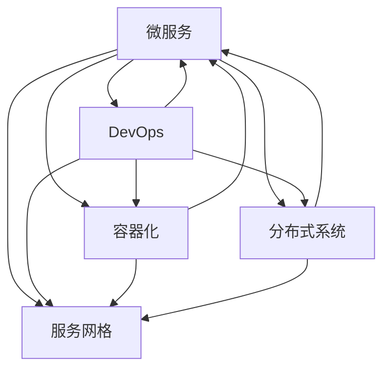

                 

# Web架构设计：从单体到微服务

> 关键词：Web架构,单体应用,微服务,服务网格,DevOps,容器化,分布式系统

## 1. 背景介绍

### 1.1 问题由来
随着互联网的迅速发展，Web应用程序的数量和复杂性都在不断增加。早期的Web应用多为单体应用(Monolithic Application)，即将整个应用程序集成在一个单一的代码库中。这种架构的优点在于开发和维护相对简单，但随着应用的规模扩大，单体应用逐渐暴露出以下问题：

- **扩展性差**：单体应用的单一代码库导致了维护成本高，难以进行模块化扩展。
- **部署复杂**：单体应用的发布和部署涉及整个应用，任何一处变动都可能影响到整个系统的稳定性。
- **技术债务积累**：为了满足业务需求，不断添加新的功能和特性，导致代码混乱、难以维护。

这些问题使得单体应用难以应对日益复杂的业务需求和不断增长的用户规模。为此，微服务架构(Microservices Architecture)应运而生。微服务架构将应用程序拆分成多个小模块，每个模块独立部署、独立运行，大大提高了系统的扩展性和维护性。

### 1.2 问题核心关键点
微服务架构通过将应用程序拆分为多个微服务，使得各个服务独立部署、独立运行，从而提升了系统的扩展性和灵活性。但与此同时，微服务架构也带来了新的挑战，如服务间的通信复杂性增加、数据一致性问题、系统调试难度增大等。因此，微服务架构的设计和实现需要综合考虑业务需求、技术栈选择、部署策略等多方面因素。

## 2. 核心概念与联系

### 2.1 核心概念概述

为了更好地理解微服务架构，本节将介绍几个密切相关的核心概念：

- **微服务(Microservices)**：将一个大型的单体应用拆分成多个独立运行的、可部署的服务单元，每个服务负责不同的业务功能，能够独立部署、独立运行。
- **服务网格(Service Mesh)**：一种为服务间通信提供代理的网络基础设施，能够实现服务的负载均衡、故障恢复、安全保障等。
- **DevOps**：一种将开发和运维紧密结合的工程文化，旨在提高软件交付速度和质量，缩短交付周期。
- **容器化**：将应用程序及其依赖打包到一个可移植、独立运行的容器中，以实现软件的分发、部署、运行。
- **分布式系统(Distributed System)**：由多个自治的计算单元构成的系统，各单元通过网络相互通信，实现复杂、大型的业务需求。

这些核心概念之间的逻辑关系可以通过以下Mermaid流程图来展示：



这个流程图展示了几大核心概念之间的相互作用和关联：

1. 微服务是整个架构的核心，通过将应用拆分成多个服务，实现了系统的可扩展性和灵活性。
2. 服务网格通过提供代理和网络基础设施，实现了服务间的负载均衡、故障恢复等功能。
3. DevOps将开发和运维紧密结合，缩短了交付周期，提高了系统的可靠性和稳定性。
4. 容器化通过将应用和依赖打包到容器中，实现了应用的可移植性和快速部署。
5. 分布式系统通过多个自治计算单元的协同工作，实现了复杂、大型的业务需求。

这些概念共同构成了微服务架构的基础，为实现高效的Web应用设计提供了有力支持。

## 3. 核心算法原理 & 具体操作步骤
### 3.1 算法原理概述

微服务架构的核心思想是将应用程序拆分为多个独立的服务单元，每个服务负责不同的业务功能，能够独立部署、独立运行。这种架构有助于提升系统的扩展性、灵活性和可靠性。

形式化地，假设一个Web应用分为多个微服务 $S_i$，$i=1,2,\cdots,n$，每个微服务都可以独立运行，并且通过网络进行通信。微服务的访问接口定义在服务层面上，不同服务之间通过服务发现机制进行定位。微服务的实现可以是任何一种编程语言和框架。

### 3.2 算法步骤详解

微服务架构的设计和实现一般包括以下几个关键步骤：

**Step 1: 需求分析和业务拆分**
- 确定业务需求，对需求进行分析和分解，确定需要哪些功能模块。
- 根据业务需求，将应用拆分为多个独立的服务单元，每个服务单元负责一个或多个核心业务功能。

**Step 2: 选择技术栈和开发框架**
- 根据业务需求和技术栈的特点，选择适合的技术栈和开发框架。常见的技术栈包括Spring Boot、Django等，开发框架包括Express、Ruby on Rails等。
- 使用容器化工具（如Docker）对每个服务进行打包和部署。

**Step 3: 设计和实现服务间通信**
- 设计服务间的通信协议，常见的有RESTful API、gRPC等。
- 实现服务发现机制，如使用Consul、Kubernetes等。
- 实现服务的负载均衡和故障恢复机制，如使用Nginx、HAProxy等。

**Step 4: 实施持续集成和持续部署**
- 使用DevOps工具（如Jenkins、GitLab CI等）进行代码自动构建、测试和部署。
- 实现持续集成(CI)和持续部署(CD)流程，确保代码质量的同时，快速交付新功能。

**Step 5: 监控和管理**
- 使用监控工具（如Prometheus、Grafana等）实时监控应用性能和资源使用情况。
- 使用日志分析工具（如ELK Stack、Graylog等）分析系统日志，定位和解决故障。
- 使用服务网格（如Istio、Linkerd等）实现服务的动态管理，包括流量控制、安全保障等。

以上是微服务架构的设计和实现的一般流程。在实际应用中，还需要根据具体的业务场景和技术栈，进行更详细的优化设计，如服务编排、分布式事务处理等。

### 3.3 算法优缺点

微服务架构相较于单体应用有以下优点：

1. **灵活性高**：微服务能够独立部署、独立运行，能够快速响应业务需求变化，满足不断增长的用户规模。
2. **扩展性好**：微服务可以按需扩展，单个服务出现问题不会影响到整个系统的稳定性。
3. **可靠性强**：通过服务网格、DevOps等机制，能够实现故障快速定位和恢复，提高系统的可靠性和稳定性。

但微服务架构也存在以下缺点：

1. **复杂性高**：微服务架构的设计和实现需要综合考虑多个因素，系统复杂度相对较高。
2. **通信成本高**：微服务之间通过网络进行通信，通信开销较大。
3. **数据一致性问题**：多个服务之间的数据一致性问题需要特别注意，如分布式事务的处理。
4. **调试难度大**：微服务架构增加了系统的复杂性，调试和排错难度较大。

## 4. 数学模型和公式 & 详细讲解
### 4.1 数学模型构建

为了更好地理解微服务架构的设计和优化，本节将介绍几个常用的数学模型和公式。

假设一个Web应用分为 $n$ 个微服务 $S_i$，每个微服务 $S_i$ 的负载为 $L_i$，请求到达率为 $\lambda_i$，服务响应时间为 $t_i$，系统整体的吞吐量为 $T$，每个请求需要的平均资源量为 $R$。则系统的平均请求响应时间为：

$$
T = \sum_{i=1}^n \frac{\lambda_i t_i}{\sum_{i=1}^n \lambda_i}
$$

系统的平均资源利用率为：

$$
U = \frac{R}{T}
$$

系统的平均请求处理时间为：

$$
\tau = \frac{T}{\lambda}
$$

其中 $\lambda$ 为系统的平均请求到达率。

通过这些公式，可以对微服务架构的性能进行分析和优化。

### 4.2 公式推导过程

假设一个Web应用分为两个微服务 $S_1$ 和 $S_2$，服务响应时间分别为 $t_1$ 和 $t_2$，系统整体的吞吐量为 $T$。则系统的平均请求响应时间 $T$ 和平均资源利用率 $U$ 可以表示为：

$$
T = \frac{t_1}{1-\frac{\lambda_1}{\lambda}} + \frac{t_2}{1-\frac{\lambda_2}{\lambda}}
$$

$$
U = \frac{\lambda_1}{\lambda} t_1 + \frac{\lambda_2}{\lambda} t_2
$$

其中 $\lambda = \lambda_1 + \lambda_2$。

通过上述公式，我们可以看出，增加服务间的负载均衡，能够提高系统的平均请求响应时间和平均资源利用率。

### 4.3 案例分析与讲解

假设一个电商应用的订单管理系统分为两个微服务 $S_1$（订单生成）和 $S_2$（订单支付），每个微服务的负载均衡策略不同。当负载均衡策略为随机分配时，系统整体的平均请求响应时间和平均资源利用率分别为：

$$
T_{\text{random}} = \frac{t_1}{1-\frac{\lambda_1}{\lambda}} + \frac{t_2}{1-\frac{\lambda_2}{\lambda}}
$$

$$
U_{\text{random}} = \frac{\lambda_1}{\lambda} t_1 + \frac{\lambda_2}{\lambda} t_2
$$

其中 $\lambda = \lambda_1 + \lambda_2$。

当负载均衡策略为权重分配时，系统整体的平均请求响应时间和平均资源利用率分别为：

$$
T_{\text{weighted}} = \frac{t_1\lambda_1}{\lambda} + \frac{t_2\lambda_2}{\lambda}
$$

$$
U_{\text{weighted}} = \frac{t_1\lambda_1 + t_2\lambda_2}{\lambda}
$$

其中 $\lambda = \lambda_1 + \lambda_2$。

通过对比两种负载均衡策略，可以看出，权重分配策略能够更好地平衡服务间的请求和资源利用，提高系统的性能。

## 5. 项目实践：代码实例和详细解释说明
### 5.1 开发环境搭建

在进行微服务架构开发前，我们需要准备好开发环境。以下是使用Docker和Kubernetes进行微服务开发的环境配置流程：

1. 安装Docker：从官网下载并安装Docker，用于构建和部署容器镜像。

2. 创建Docker镜像：编写Dockerfile，定义应用的环境、依赖、启动命令等，并使用Docker构建镜像。

3. 安装Kubernetes：在Kubernetes集群上部署Docker镜像，使用Kubernetes进行服务编排和调度。

4. 使用Kubernetes命令：如kubectl等工具，对Kubernetes集群进行管理，包括部署、扩展、监控等。

完成上述步骤后，即可在Docker和Kubernetes环境中开始微服务开发。

### 5.2 源代码详细实现

下面我们以微服务架构中的订单管理系统为例，给出使用Docker和Kubernetes进行微服务开发和部署的PyTorch代码实现。

首先，定义订单管理系统中的订单生成服务：

```python
from flask import Flask, request

app = Flask(__name__)

@app.route('/order', methods=['POST'])
def generate_order():
    data = request.get_json()
    order_id = data['id']
    # 生成订单逻辑
    return {'id': order_id}

if __name__ == '__main__':
    app.run(host='0.0.0.0', port=8080)
```

然后，定义订单管理系统的订单支付服务：

```python
from flask import Flask, request

app = Flask(__name__)

@app.route('/payment', methods=['POST'])
def pay_order():
    data = request.get_json()
    order_id = data['id']
    # 支付订单逻辑
    return {'id': order_id}

if __name__ == '__main__':
    app.run(host='0.0.0.0', port=8081)
```

接着，使用Docker构建服务镜像：

```bash
docker build -t order-generator .
docker build -t order-payment .
```

最后，使用Kubernetes部署服务：

```bash
kubectl apply -f deployment.yaml
```

其中，deployment.yaml文件定义了服务的配置信息，包括容器镜像、环境变量、服务端口等。

### 5.3 代码解读与分析

让我们再详细解读一下关键代码的实现细节：

**Flask应用**：
- 使用Flask框架实现RESTful API服务，处理HTTP请求并返回JSON格式的数据。
- 定义了两个路由，分别对应订单生成和订单支付的API接口。

**Dockerfile**：
- 使用Dockerfile定义了服务的应用环境、依赖、启动命令等。
- 通过Docker构建服务镜像，实现了应用的容器化。

**Kubernetes配置文件**：
- 使用Kubernetes配置文件（如deployment.yaml）定义了服务的配置信息。
- 包括服务镜像、容器端口、资源限制等，确保服务的正确部署和运行。

这些代码实现了微服务架构中的订单管理系统，通过Docker和Kubernetes技术，能够方便地进行服务的部署和扩展。

## 6. 实际应用场景
### 6.1 电子商务平台

微服务架构在电子商务平台中的应用非常广泛，能够满足电商平台的快速扩展和灵活变更需求。

电商平台的订单管理系统可以拆分为订单生成、订单支付、订单查询等多个微服务，每个服务独立部署、独立运行。订单生成服务负责生成订单，订单支付服务负责处理支付逻辑，订单查询服务负责查询订单状态等。通过微服务架构，电商平台的订单管理系统可以方便地进行扩展和变更，如增加新的订单功能模块，只需要新增一个新的微服务，并进行相应的部署和配置即可。

### 6.2 金融服务平台

金融服务平台需要处理大量的交易数据和用户数据，微服务架构能够满足其高并发、高可用性的需求。

金融平台的交易系统可以拆分为交易订单、账户管理、风险控制等多个微服务，每个服务独立部署、独立运行。交易订单服务负责处理交易订单的生成、确认等逻辑，账户管理服务负责处理用户账户的管理、查询等逻辑，风险控制服务负责处理交易的风险控制、异常检测等逻辑。通过微服务架构，金融平台的交易系统可以方便地进行扩展和变更，如增加新的交易功能模块，只需要新增一个新的微服务，并进行相应的部署和配置即可。

### 6.3 企业级应用

微服务架构在企业级应用中的应用也非常广泛，能够满足企业级应用的复杂需求和高可用性需求。

企业级应用的业务系统可以拆分为多个微服务，如订单管理、库存管理、物流管理等。每个服务独立部署、独立运行，能够方便地进行扩展和变更，如增加新的功能模块，只需要新增一个新的微服务，并进行相应的部署和配置即可。

### 6.4 未来应用展望

随着微服务架构的不断发展和完善，其在Web应用中的应用前景将更加广阔。未来，微服务架构将在以下几个方面取得新的突破：

1. **更细粒度的拆分**：微服务将更细粒度地拆分，每个服务只负责一个具体的业务功能，提高系统的可维护性和可扩展性。
2. **更高效的通信**：通过引入服务网格技术，微服务之间的通信将更加高效、可靠。
3. **更强大的监控和故障恢复**：通过更强大的监控和故障恢复机制，微服务架构将具备更高的可靠性和稳定性。
4. **更灵活的编排和管理**：通过引入先进的编排和管理工具，微服务架构将能够更好地支持复杂的业务需求和部署场景。
5. **更智能的运维**：通过引入AI和机器学习技术，微服务架构将能够实现更智能的运维和优化。

这些趋势将推动微服务架构向更加高效、智能、可靠的方向发展，为Web应用的开发和运维带来更多的可能性。

## 7. 工具和资源推荐
### 7.1 学习资源推荐

为了帮助开发者系统掌握微服务架构的理论基础和实践技巧，这里推荐一些优质的学习资源：

1. **《微服务架构：构建可伸缩和可靠系统》**：Spring Cloud专家所著，全面介绍了微服务架构的基本概念、设计原则和实现技巧。

2. **《Kubernetes权威指南》**：Kubernetes社区成员所著，详细介绍了Kubernetes的部署、管理和运维，是学习Kubernetes的必备资料。

3. **《Docker实战》**：Docker官方文档和社区资源，全面介绍了Docker的部署、管理和优化技巧，是学习Docker的必备资料。

4. **《DevOps实践》**：DevOps专家所著，详细介绍了DevOps工程文化的基本概念、实践方法和工具，是学习DevOps的必备资料。

5. **《分布式系统设计》**：经典教材，全面介绍了分布式系统的基本概念、设计和实现技巧，是学习分布式系统的必备资料。

通过对这些资源的学习实践，相信你一定能够快速掌握微服务架构的精髓，并用于解决实际的Web应用问题。

### 7.2 开发工具推荐

高效的开发离不开优秀的工具支持。以下是几款用于微服务架构开发的常用工具：

1. **Docker**：轻量级的容器化平台，便于构建、部署和管理容器镜像。

2. **Kubernetes**：开源的容器编排平台，提供高效的资源管理和服务调度。

3. **Prometheus**：开源的监控系统，实时监控应用的性能和资源使用情况。

4. **ELK Stack**：日志管理和分析工具，帮助分析和定位系统故障。

5. **Istio**：服务网格解决方案，实现服务的负载均衡、故障恢复和安全保障。

6. **Jenkins**：开源的持续集成和持续部署工具，自动化构建、测试和部署。

合理利用这些工具，可以显著提升微服务架构的开发效率，加快创新迭代的步伐。

### 7.3 相关论文推荐

微服务架构的发展源于学界的持续研究。以下是几篇奠基性的相关论文，推荐阅读：

1. **《微服务架构的实践和挑战》**：Spring Cloud专家所著，总结了微服务架构的实践经验和面临的挑战，是微服务架构的必备参考资料。

2. **《构建可伸缩和可靠的系统：微服务架构的实践》**：Spring Cloud专家所著，全面介绍了微服务架构的基本概念、设计原则和实现技巧。

3. **《Kubernetes的设计与实现》**：Kubernetes社区成员所著，详细介绍了Kubernetes的设计理念和实现机制，是学习Kubernetes的必备参考资料。

这些论文代表了大规模微服务架构的发展脉络。通过学习这些前沿成果，可以帮助研究者把握学科前进方向，激发更多的创新灵感。

## 8. 总结：未来发展趋势与挑战
### 8.1 总结

本文对微服务架构的设计和实现进行了全面系统的介绍。首先阐述了微服务架构的背景和意义，明确了微服务在满足Web应用业务需求、提升系统扩展性和灵活性方面的独特价值。其次，从原理到实践，详细讲解了微服务架构的数学模型和公式，给出了微服务架构的代码实例和详细解释。同时，本文还广泛探讨了微服务架构在电子商务、金融服务、企业级应用等多个领域的应用前景，展示了微服务架构的巨大潜力。此外，本文精选了微服务架构的学习资源，力求为读者提供全方位的技术指引。

通过本文的系统梳理，可以看到，微服务架构为Web应用的开发和运维带来了新的解决方案，提升了系统的扩展性、灵活性和可靠性。未来，伴随微服务架构的不断演进和完善，Web应用的开发和运维将更加高效、智能、可靠。

### 8.2 未来发展趋势

展望未来，微服务架构将呈现以下几个发展趋势：

1. **更细粒度的拆分**：微服务将更细粒度地拆分，每个服务只负责一个具体的业务功能，提高系统的可维护性和可扩展性。
2. **更高效的通信**：通过引入服务网格技术，微服务之间的通信将更加高效、可靠。
3. **更强大的监控和故障恢复**：通过更强大的监控和故障恢复机制，微服务架构将具备更高的可靠性和稳定性。
4. **更灵活的编排和管理**：通过引入先进的编排和管理工具，微服务架构将能够更好地支持复杂的业务需求和部署场景。
5. **更智能的运维**：通过引入AI和机器学习技术，微服务架构将能够实现更智能的运维和优化。

这些趋势将推动微服务架构向更加高效、智能、可靠的方向发展，为Web应用的开发和运维带来更多的可能性。

### 8.3 面临的挑战

尽管微服务架构已经取得了显著成就，但在迈向更加智能化、普适化应用的过程中，它仍面临诸多挑战：

1. **系统复杂性增加**：微服务架构的设计和实现需要综合考虑多个因素，系统复杂度相对较高。
2. **通信成本增加**：微服务之间通过网络进行通信，通信开销较大。
3. **数据一致性问题**：多个服务之间的数据一致性问题需要特别注意，如分布式事务的处理。
4. **调试难度增加**：微服务架构增加了系统的复杂性，调试和排错难度较大。
5. **资源消耗增加**：微服务架构需要更多的计算和存储资源，增加了系统的运行成本。

## 8.4 研究展望

面对微服务架构所面临的挑战，未来的研究需要在以下几个方面寻求新的突破：

1. **更高效的服务通信机制**：通过引入更高效的服务通信机制，如WebAssembly、gRPC等，降低微服务之间的通信成本，提升系统的性能。
2. **更智能的服务编排和管理**：通过引入先进的编排和管理工具，如Kubernetes、Istio等，实现更智能的服务编排和管理。
3. **更强大的监控和故障恢复机制**：通过引入更强大的监控和故障恢复机制，如Prometheus、Grafana等，提升微服务架构的可靠性和稳定性。
4. **更灵活的数据一致性处理**：通过引入更灵活的数据一致性处理机制，如分布式事务、事件驱动等，解决微服务架构中的数据一致性问题。
5. **更智能的运维和优化**：通过引入AI和机器学习技术，实现更智能的运维和优化。

这些研究方向的探索，必将引领微服务架构向更加高效、智能、可靠的方向发展，为Web应用的开发和运维带来更多的可能性。

## 9. 附录：常见问题与解答

**Q1：微服务架构是否适用于所有Web应用？**

A: 微服务架构适用于大多数Web应用，尤其是那些具有复杂业务需求和高度可扩展性的应用。但对于一些简单的Web应用，单体应用可能更加适合，可以避免微服务架构带来的额外复杂性。

**Q2：微服务架构和单体应用有哪些区别？**

A: 微服务架构和单体应用的主要区别在于：

1. **系统结构**：微服务架构将应用程序拆分成多个独立的服务单元，每个服务独立部署、独立运行。单体应用则是将整个应用程序集成在一个单一的代码库中。
2. **扩展性**：微服务架构能够按需扩展，单个服务出现问题不会影响到整个系统的稳定性。单体应用则难以进行模块化扩展。
3. **运维复杂性**：微服务架构增加了系统的复杂性，调试和排错难度较大。单体应用则相对简单。

**Q3：如何选择合适的微服务拆分策略？**

A: 选择合适的微服务拆分策略需要综合考虑业务需求、技术栈选择、部署策略等多方面因素。一般建议按照业务领域进行拆分，将应用拆分为多个相对独立的功能模块，每个模块负责一个具体的业务功能。同时，可以通过接口定义、依赖关系等进行进一步的细粒度拆分。

**Q4：微服务架构如何实现高可用性？**

A: 微服务架构的高可用性可以通过服务网格、负载均衡、故障恢复等机制实现。通过服务网格，可以实现服务的负载均衡和故障恢复，确保系统的稳定性和可靠性。同时，通过持续集成和持续部署机制，可以快速交付新功能，缩短交付周期，提升系统的可靠性和稳定性。

**Q5：微服务架构如何实现高效的监控和运维？**

A: 微服务架构可以通过引入先进的监控和运维工具，如Prometheus、ELK Stack、Istio等，实现系统的实时监控和故障恢复。通过实时监控应用性能和资源使用情况，可以及时发现和解决系统故障，提升系统的可靠性和稳定性。同时，通过日志分析工具，可以定位和解决系统故障，提升系统的可维护性和可扩展性。

---

作者：禅与计算机程序设计艺术 / Zen and the Art of Computer Programming

