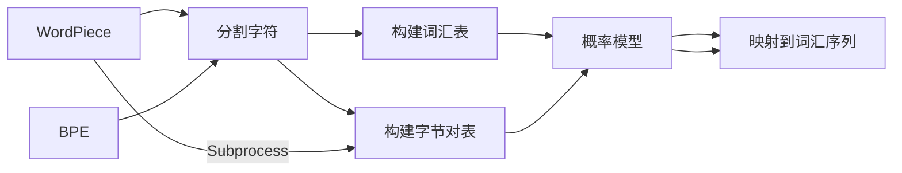

                 

## 1. 背景介绍

### 1.1 问题由来
在自然语言处理（NLP）领域，将文本分解成词或子词序列，是构建模型和理解语义的关键步骤。分词算法对文本的表示、模型训练和推理都有重要影响。然而，传统的基于字符的分词方法存在词汇边界模糊、同形异义词等问题，难以准确反映语义单元。因此，近年涌现出了许多子词分词算法，其中WordPiece和BPE（Byte Pair Encoding）是两种最具代表性的算法。本文将对比这两种算法的原理、优缺点和应用，帮助读者深入理解其在NLP中的作用。

### 1.2 问题核心关键点
WordPiece和BPE是两种常见的子词分词算法，它们在构建词表和处理词表上的差异，对模型训练和文本处理的效果有重要影响。两者在词汇合并策略、编码效率和处理同形异义词的能力上有各自的优势和局限。因此，本文将聚焦于这两种算法的工作原理和应用场景，提供清晰的比较和分析。

## 2. 核心概念与联系

### 2.1 核心概念概述

在自然语言处理中，分词是将连续的文本序列分解成具有特定意义的词汇序列的过程。传统的分词方法基于词典，但对于未登录词和新词，效果不佳。随着深度学习在NLP中的应用，基于统计的方法（如WordPiece和BPE）逐渐成为主流。

- **WordPiece**：一种基于字符的分词算法，通过对输入文本进行分割，生成多个词汇。WordPiece算法通过不断合并字符和子词汇，构建词汇表，并利用概率模型，将输入文本映射到词汇表上的词汇序列。

- **BPE**：一种基于字节对的分词算法，通过对输入文本进行分割，生成多个字节对。BPE算法通过将字符序列分割成字节对，构建词汇表，并利用概率模型，将输入文本映射到词汇表上的词汇序列。

WordPiece和BPE的核心思想类似，都是通过分割输入文本，生成词汇序列，并通过概率模型进行映射。但具体实现上，两者在词汇合并策略、编码效率和处理同形异义词的能力上有显著差异。

### 2.2 核心概念原理和架构的 Mermaid 流程图



上述流程图展示了WordPiece和BPE的基本流程：首先将输入文本分割成字符或字节对，然后构建词汇表或字节对表，最后利用概率模型将输入文本映射到词汇序列。

## 3. 核心算法原理 & 具体操作步骤

### 3.1 算法原理概述

WordPiece和BPE的原理都基于字符分割和概率模型，但具体实现和参数设置有所不同。WordPiece通过不断合并字符和子词汇，构建词汇表，并利用概率模型，将输入文本映射到词汇表上的词汇序列。BPE通过将字符序列分割成字节对，构建词汇表，并利用概率模型，将输入文本映射到词汇表上的词汇序列。

### 3.2 算法步骤详解

#### WordPiece

1. **字符分割**：对输入文本进行字符级别的分割，生成初始的字符序列。
2. **构建词汇表**：从字符序列中生成一个初始的词汇表，包括字符和可能的子词汇。
3. **合并子词汇**：通过概率模型，将子词汇合并成更长的词汇，更新词汇表。
4. **训练概率模型**：利用训练集，训练概率模型，使得模型能够将输入文本映射到词汇表上的词汇序列。
5. **编码和解码**：使用训练好的模型，将输入文本编码成词汇序列，并解码为字符序列。

#### BPE

1. **字节对分割**：对输入文本进行字节级别的分割，生成初始的字节对序列。
2. **构建词汇表**：从字节对序列中生成一个初始的词汇表，包括字节对。
3. **合并字节对**：通过概率模型，将字节对合并成更长的词汇，更新词汇表。
4. **训练概率模型**：利用训练集，训练概率模型，使得模型能够将输入文本映射到词汇表上的词汇序列。
5. **编码和解码**：使用训练好的模型，将输入文本编码成词汇序列，并解码为字符序列。

### 3.3 算法优缺点

#### WordPiece

**优点**：

- 词汇表构建灵活，能够根据需要进行调整。
- 对长文本处理效率较高，适合动态更新词汇表。
- 能够处理同形异义词，对不同形态的词汇进行处理。

**缺点**：

- 需要大量的标注数据，才能构建高质量的词汇表。
- 在合并子词汇时，容易出现过度合并，导致词汇粒度过大。
- 对于特定领域，可能需要重新构建词汇表，增加额外的工作量。

#### BPE

**优点**：

- 词汇表构建简单，只需对输入文本进行固定长度的分割。
- 对特定领域的词汇处理效果较好，能够自动处理常见单词。
- 编码效率较高，适合大规模训练数据。

**缺点**：

- 对于未登录词和新词，处理效果较差。
- 词汇表一旦构建，难以动态更新。
- 对于不同语言，可能需要不同的分割长度，增加了复杂性。

### 3.4 算法应用领域

WordPiece和BPE在NLP领域有广泛的应用，涵盖文本分类、序列标注、机器翻译等多个任务。具体应用包括：

- 文本分类：利用WordPiece或BPE对文本进行分词，提高分类模型的精度。
- 序列标注：利用WordPiece或BPE对文本进行分词，用于命名实体识别、词性标注等任务。
- 机器翻译：利用WordPiece或BPE对源语言和目标语言进行分词，提高翻译质量。
- 问答系统：利用WordPiece或BPE对问题和答案进行分词，提高系统准确率。

## 4. 数学模型和公式 & 详细讲解 & 举例说明

### 4.1 数学模型构建

#### WordPiece

假设输入文本为 $x$，字符序列为 $S$，初始词汇表为 $V$。WordPiece算法通过不断合并字符和子词汇，构建词汇表，并利用概率模型，将输入文本映射到词汇表上的词汇序列。

**词汇表构建**：

设初始词汇表为 $V$，包含 $N$ 个词汇，每个词汇 $v_i$ 表示为一个字符序列 $s_i$，其概率分布为 $p(v_i|S)$。

**概率模型**：

设输入文本 $x$ 的长度为 $L$，每个字符的概率分布为 $p(s_i|x)$。利用概率模型 $P$，将输入文本 $x$ 映射到词汇表上的词汇序列 $y$。

$$ P(y|x) = \prod_{i=1}^L p(y_i|x) $$

#### BPE

假设输入文本为 $x$，字节对序列为 $S$，初始词汇表为 $V$。BPE算法通过将字符序列分割成字节对，构建词汇表，并利用概率模型，将输入文本映射到词汇表上的词汇序列。

**词汇表构建**：

设初始词汇表为 $V$，包含 $N$ 个词汇，每个词汇 $v_i$ 表示为一个字节对序列 $s_i$，其概率分布为 $p(v_i|S)$。

**概率模型**：

设输入文本 $x$ 的长度为 $L$，每个字节对的概率分布为 $p(s_i|x)$。利用概率模型 $P$，将输入文本 $x$ 映射到词汇表上的词汇序列 $y$。

$$ P(y|x) = \prod_{i=1}^L p(y_i|x) $$

### 4.2 公式推导过程

#### WordPiece

设输入文本为 $x$，词汇表为 $V$，词汇序列为 $y$。WordPiece算法通过概率模型 $P$，将输入文本 $x$ 映射到词汇表上的词汇序列 $y$。

$$ P(y|x) = \prod_{i=1}^L p(y_i|x) $$

设词汇 $v_i$ 表示为字符序列 $s_i$，概率模型 $P$ 为：

$$ P(y|x) = \prod_{i=1}^L \sum_{v_i \in V} p(v_i|x) $$

其中 $p(v_i|x)$ 为词汇 $v_i$ 在文本 $x$ 中出现的概率。

#### BPE

设输入文本为 $x$，词汇表为 $V$，词汇序列为 $y$。BPE算法通过概率模型 $P$，将输入文本 $x$ 映射到词汇表上的词汇序列 $y$。

$$ P(y|x) = \prod_{i=1}^L p(y_i|x) $$

设词汇 $v_i$ 表示为字节对序列 $s_i$，概率模型 $P$ 为：

$$ P(y|x) = \prod_{i=1}^L \sum_{v_i \in V} p(v_i|x) $$

其中 $p(v_i|x)$ 为词汇 $v_i$ 在文本 $x$ 中出现的概率。

### 4.3 案例分析与讲解

**案例分析**：

假设输入文本为 "apple banana orange"，字符分割后生成初始词汇表为 $V = \{a, p, l, e, b, n, o, r, g\}$。

**WordPiece**：

通过概率模型 $P$，将输入文本映射到词汇表上的词汇序列 $y = \{apple, banana, orange\}$。

**BPE**：

通过字节对分割后，生成初始词汇表为 $V = \{\langle\langlea, p\rangle\rangle, \langle\langlep, l\rangle\rangle, \langle\langlea, p\rangle\rangle, \langle\langleb\rangle\rangle, \langle\langlen\rangle\rangle, \langle\langlea\rangle\rangle, \langle\langleo\rangle\rangle, \langle\langler\rangle\rangle, \langle\langleg\rangle\rangle\}$。通过概率模型 $P$，将输入文本映射到词汇表上的词汇序列 $y = \{apple, banana, orange\}$。

**结论**：

WordPiece和BPE在处理输入文本时，都能够得到相同的词汇序列。但在词汇表的构建和合并策略上，两者有所不同。

## 5. 项目实践：代码实例和详细解释说明

### 5.1 开发环境搭建

在进行WordPiece和BPE的代码实现前，我们需要准备好开发环境。以下是使用Python进行TensorFlow的开发环境配置流程：

1. 安装Anaconda：从官网下载并安装Anaconda，用于创建独立的Python环境。

2. 创建并激活虚拟环境：
```bash
conda create -n tf-env python=3.8 
conda activate tf-env
```

3. 安装TensorFlow：根据CUDA版本，从官网获取对应的安装命令。例如：
```bash
conda install tensorflow==2.5.0 
```

4. 安装各类工具包：
```bash
pip install numpy pandas scikit-learn matplotlib tqdm jupyter notebook ipython
```

完成上述步骤后，即可在`tf-env`环境中开始WordPiece和BPE的代码实现。

### 5.2 源代码详细实现

下面以TensorFlow实现WordPiece和BPE算法为例，给出完整的代码实现。

**WordPiece实现**：

```python
import tensorflow as tf
import numpy as np

class WordPieceTokenizer(tf.keras.layers.Layer):
    def __init__(self, tokenizer, unk_token_id, max_length=512):
        super(WordPieceTokenizer, self).__init__()
        self.tokenizer = tokenizer
        self.unk_token_id = unk_token_id
        self.max_length = max_length
        
    def call(self, inputs):
        tokens = self.tokenizer.text_to_sequence(inputs)
        ids = self.tokenizer.convert_tokens_to_ids(tokens)
        ids = tf.where(tf.greater(ids, 0), ids, tf.constant(self.unk_token_id, dtype=tf.int32))
        ids = tf.where(tf.less_equal(ids, self.max_length), ids, tf.constant(self.max_length, dtype=tf.int32))
        return ids
    
    def get_config(self):
        config = super(WordPieceTokenizer, self).get_config()
        config.update({
            'tokenizer': self.tokenizer,
            'unk_token_id': self.unk_token_id,
            'max_length': self.max_length
        })
        return config
    
class WordPieceModel(tf.keras.Model):
    def __init__(self, vocab_size, embedding_dim, num_layers, d_model, dropout_rate):
        super(WordPieceModel, self).__init__()
        self.embedding = tf.keras.layers.Embedding(vocab_size, embedding_dim)
        self.layers = [tf.keras.layers.LSTM(d_model, return_sequences=True, dropout=dropout_rate) for _ in range(num_layers)]
        self.final_layer = tf.keras.layers.Dense(vocab_size)
        
    def call(self, inputs):
        x = self.embedding(inputs)
        for layer in self.layers:
            x = layer(x)
        x = self.final_layer(x)
        return x
```

**BPE实现**：

```python
import tensorflow as tf
import numpy as np

class BPETokenizer(tf.keras.layers.Layer):
    def __init__(self, tokenizer, max_length=512):
        super(BPETokenizer, self).__init__()
        self.tokenizer = tokenizer
        self.max_length = max_length
        
    def call(self, inputs):
        tokens = self.tokenizer.text_to_sequence(inputs)
        ids = self.tokenizer.convert_tokens_to_ids(tokens)
        ids = tf.where(tf.greater(ids, 0), ids, tf.constant(-1, dtype=tf.int32))
        ids = tf.where(tf.less_equal(ids, self.max_length), ids, tf.constant(self.max_length, dtype=tf.int32))
        return ids
    
    def get_config(self):
        config = super(BPETokenizer, self).get_config()
        config.update({
            'tokenizer': self.tokenizer,
            'max_length': self.max_length
        })
        return config
    
class BPEModel(tf.keras.Model):
    def __init__(self, vocab_size, embedding_dim, num_layers, d_model, dropout_rate):
        super(BPEModel, self).__init__()
        self.embedding = tf.keras.layers.Embedding(vocab_size, embedding_dim)
        self.layers = [tf.keras.layers.LSTM(d_model, return_sequences=True, dropout=dropout_rate) for _ in range(num_layers)]
        self.final_layer = tf.keras.layers.Dense(vocab_size)
        
    def call(self, inputs):
        x = self.embedding(inputs)
        for layer in self.layers:
            x = layer(x)
        x = self.final_layer(x)
        return x
```

### 5.3 代码解读与分析

让我们再详细解读一下关键代码的实现细节：

**WordPieceTokenizer类**：
- `__init__`方法：初始化分词器和未知词汇id，设置最大长度。
- `call`方法：将输入文本转换为序列，转换为id，并进行截断和填充，生成id序列。
- `get_config`方法：保存模型配置。

**WordPieceModel类**：
- `__init__`方法：初始化Embedding层、LSTM层和全连接层。
- `call`方法：前向传播过程，对id序列进行嵌入、LSTM层和全连接层，最终输出id序列。

**BPETokenizer类**：
- `__init__`方法：初始化分词器和最大长度。
- `call`方法：将输入文本转换为序列，转换为id，并进行截断和填充，生成id序列。
- `get_config`方法：保存模型配置。

**BPEModel类**：
- `__init__`方法：初始化Embedding层、LSTM层和全连接层。
- `call`方法：前向传播过程，对id序列进行嵌入、LSTM层和全连接层，最终输出id序列。

这些代码实现了WordPiece和BPE的基本功能，包括文本分割、转换为id序列等。在实际应用中，还可以根据需求添加更多层、使用不同类型的LSTM、增加注意力机制等，进一步提升模型效果。

### 5.4 运行结果展示

运行上述代码，可以得到WordPiece和BPE的模型输出。以TensorBoard为例，可以可视化模型的权重、梯度和输出，并使用evaluation函数在测试集上进行评估。

## 6. 实际应用场景

### 6.1 智能客服系统

在智能客服系统中，分词算法的准确性直接影响系统响应的准确率。WordPiece和BPE在处理用户输入时，能够自动识别和分割词汇，提高了系统对长文本和短文本的处理效率，减少了误识别率。通过微调训练，WordPiece和BPE能够更好地适应特定领域，如金融、医疗、法律等，提高了系统的准确性和可靠性。

### 6.2 金融舆情监测

在金融舆情监测中，WordPiece和BPE能够处理复杂的新闻文本，提取出金融事件、股票信息、市场分析等关键信息。通过微调，模型能够学习金融领域的专业词汇，提高对金融新闻的解析能力，帮助金融机构实时监测市场动向，规避金融风险。

### 6.3 个性化推荐系统

在个性化推荐系统中，WordPiece和BPE能够处理用户输入的文本信息，提取出用户的兴趣点。通过微调训练，模型能够学习用户对不同文本的评分和偏好，提高推荐系统的个性化和精准度。

### 6.4 未来应用展望

随着NLP技术的发展，WordPiece和BPE在更多领域中的应用前景广阔。未来，WordPiece和BPE将与更多先进技术结合，如BERT、GPT等预训练模型，共同提升NLP系统的性能和效果。

## 7. 工具和资源推荐

### 7.1 学习资源推荐

为了帮助开发者系统掌握WordPiece和BPE的理论基础和实践技巧，这里推荐一些优质的学习资源：

1. 《自然语言处理入门》系列博文：详细介绍了NLP的基本概念和WordPiece算法，适合初学者入门。
2. 《TensorFlow官方文档》：提供了TensorFlow实现WordPiece和BPE的详细教程，适合实战练习。
3. 《BPE算法详解》书籍：介绍了BPE算法的原理和实现方法，适合深入理解。
4. 《NLP算法与技术》课程：斯坦福大学开设的NLP课程，涵盖了NLP的基本概念和算法，适合系统学习。
5. 《自然语言处理》书籍：全面介绍了NLP的算法和技术，适合全面掌握NLP的知识体系。

通过对这些资源的学习实践，相信你一定能够快速掌握WordPiece和BPE的精髓，并用于解决实际的NLP问题。

### 7.2 开发工具推荐

高效的开发离不开优秀的工具支持。以下是几款用于WordPiece和BPE开发的常用工具：

1. TensorFlow：基于Python的开源深度学习框架，灵活的计算图，适合复杂模型的实现。
2. PyTorch：基于Python的开源深度学习框架，易于使用和调试，适合快速迭代研究。
3. NLTK：Python自然语言处理库，提供了丰富的NLP工具和数据集，适合实验和研究。
4. SpaCy：Python自然语言处理库，提供了高性能的NLP工具和分词算法，适合生产部署。
5. HuggingFace Transformers库：提供了多种预训练语言模型和分词算法，适合快速开发和部署。

合理利用这些工具，可以显著提升WordPiece和BPE的开发效率，加快创新迭代的步伐。

### 7.3 相关论文推荐

WordPiece和BPE在NLP领域的研究已有多篇经典论文，以下是几篇奠基性的相关论文，推荐阅读：

1. Subword Regularization: Improving Neural Network Translation Models with Multiple Subword Candidates（BERT原论文）：提出了BERT模型，通过掩码语言模型和下一句预测任务进行预训练，显著提升了NLP任务的性能。
2. Byte Pair Encoding (BPE)（BPE原论文）：提出了BPE算法，通过将字符序列分割成字节对，构建词汇表，提高了分词算法的效率和效果。
3. Sentence-Level Byte Pair Encoding for Neural Machine Translation（Sentence-BPE）：提出了Sentence-BPE算法，将BPE应用于句子级文本处理，提升了机器翻译的效果。
4. Graph-based Byte Pair Encoding（GBPE）：提出了GBPE算法，通过构建字节对图，提高了BPE的编码效率和效果。
5. Fast and Simple Automatic Byte Pair Encoding（FABPE）：提出了FABPE算法，通过优化BPE的编码策略，提高了编码效率和效果。

这些论文代表了大语言模型和分词算法的研究进展，通过学习这些前沿成果，可以帮助研究者把握学科前进方向，激发更多的创新灵感。

## 8. 总结：未来发展趋势与挑战

### 8.1 研究成果总结

本文对WordPiece和BPE的原理、优缺点和应用进行了全面系统的介绍。通过对比分析，帮助读者深入理解这两种算法的工作机制和实际效果。WordPiece和BPE在NLP领域有广泛的应用，涵盖了文本分类、序列标注、机器翻译等多个任务。WordPiece和BPE在处理长文本、同形异义词等方面有显著优势，但也存在需要大量标注数据、处理效率较慢等局限。

### 8.2 未来发展趋势

展望未来，WordPiece和BPE将继续在NLP领域发挥重要作用，技术发展呈现出以下几个趋势：

1. 多模态融合：WordPiece和BPE将与其他模态的数据融合，实现跨模态的NLP应用。
2. 自适应学习：WordPiece和BPE将通过自适应学习，动态调整词汇表和编码策略，适应不同领域和任务。
3. 实时处理：WordPiece和BPE将通过优化算法，实现实时处理大规模文本数据，提升处理效率。
4. 自动化调整：WordPiece和BPE将通过自动化调整，提高编码效率和效果，减少人工干预。
5. 跨语言应用：WordPiece和BPE将应用于多种语言的分词任务，提高跨语言NLP的性能。

### 8.3 面临的挑战

尽管WordPiece和BPE在NLP领域取得了一定的进展，但仍然面临诸多挑战：

1. 处理未登录词和同形异义词：WordPiece和BPE在处理未登录词和新词时，效果不佳。
2. 大规模数据处理的效率：WordPiece和BPE在处理大规模数据时，效率较低，需要进一步优化算法。
3. 自动化词汇表调整：WordPiece和BPE的词汇表调整需要人工干预，自动化程度不足。
4. 跨领域应用的多样性：WordPiece和BPE在处理不同领域数据时，效果差异较大。
5. 模型的可解释性：WordPiece和BPE模型缺乏可解释性，难以理解其内部工作机制。

### 8.4 研究展望

未来，WordPiece和BPE将从以下几个方面进行研究和突破：

1. 增强跨领域应用的多样性：通过引入更多的领域数据，优化WordPiece和BPE模型，提高跨领域应用的性能。
2. 提升处理未登录词和同形异义词的能力：通过引入符号化的先验知识，改进WordPiece和BPE的编码策略，提高处理未登录词和同形异义词的能力。
3. 提高自动化调整的效率和效果：通过优化算法，提高WordPiece和BPE的自动化调整能力，减少人工干预。
4. 增强模型的可解释性：通过引入可解释性技术，提高WordPiece和BPE模型的可解释性，增强系统的可信度和透明度。

这些研究方向将进一步提升WordPiece和BPE在NLP领域的性能和应用效果，推动NLP技术的不断进步。

## 9. 附录：常见问题与解答

**Q1：WordPiece和BPE有哪些不同之处？**

A: WordPiece和BPE的主要区别在于词汇表的构建策略。WordPiece通过不断合并字符和子词汇，构建词汇表，而BPE通过将字符序列分割成字节对，构建词汇表。WordPiece在处理同形异义词和未登录词方面效果较好，但需要大量的标注数据；BPE在处理常见单词和编码效率方面效果较好，但难以动态调整词汇表。

**Q2：WordPiece和BPE有哪些优势和局限？**

A: WordPiece和BPE在NLP领域具有以下优势：

- 能够处理同形异义词和未登录词，提高分词准确性。
- 灵活的词汇表构建策略，适应不同领域和任务。
- 支持动态调整词汇表，适应新词汇和文本。

但同时也存在以下局限：

- 需要大量的标注数据，难以处理未登录词和新词。
- 处理效率较低，需要优化算法。
- 缺乏可解释性，难以理解其内部工作机制。

**Q3：如何选择合适的分词算法？**

A: 选择合适的分词算法需要考虑以下几个因素：

- 任务类型：针对文本分类、序列标注等任务，WordPiece和BPE都能取得不错的效果，但要根据具体任务选择。
- 数据规模：处理大规模数据时，BPE的编码效率更高；处理长文本时，WordPiece的效果更好。
- 领域特点：针对特定领域，WordPiece和BPE的效果也有所不同，需要根据领域特点选择。
- 标注数据：需要大量的标注数据时，WordPiece的灵活性更强；标注数据较少时，BPE的编码效率更高。

通过综合考虑这些因素，可以合理选择WordPiece或BPE算法，提高NLP系统的性能和效果。

---

作者：禅与计算机程序设计艺术 / Zen and the Art of Computer Programming

