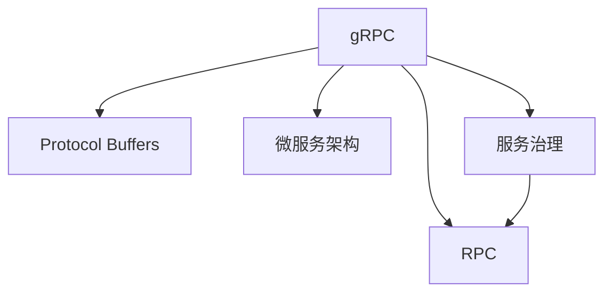

                 

# gRPC：高性能跨语言RPC框架

> 关键词：gRPC, RPC框架, 高性能, 跨语言, 协议缓冲区, Protocol Buffers, 微服务架构, 服务治理, 网络传输, 分布式系统, 服务发现

## 1. 背景介绍

### 1.1 问题由来
在现代互联网应用中，微服务架构成为分布式系统建设的主流范式。各个服务通过网络进行通信，彼此独立运行，互相协作，共同实现复杂的业务逻辑。随着服务的数量和规模不断增加，服务间通信的效率、可靠性和可维护性成为首要考虑的问题。

传统的网络通信方式，如HTTP RESTful API，常常受到如下限制：
- **效率低下**：HTTP RESTful API基于纯文本协议，通信效率较低。
- **灵活性差**：请求格式和响应格式受限于JSON/XML，扩展性差。
- **可读性低**：HTTP请求和响应的内容较难理解，调试和维护困难。

为了解决这些问题，高性能、轻量级、跨语言的RPC框架应运而生。gRPC是一个符合这些要求的优秀RPC框架，由Google开源，得到了广泛的应用。本文将详细介绍gRPC的基本原理和实际应用，帮助读者深入理解其在现代分布式系统中的应用价值。

### 1.2 问题核心关键点
gRPC作为一种高性能、轻量级、跨语言的RPC框架，具有以下核心关键点：
- **高性能**：基于Protocol Buffers的序列化和反序列化，支持TCP、gRPC Web等传输协议。
- **跨语言**：支持Java、C++、Python、Go、Node.js等多种编程语言。
- **零拷贝**：采用gRPC的客户端和服务器端的异步特性，实现零拷贝传输，提高通信效率。
- **服务治理**：集成了负载均衡、健康检查、故障转移等功能，提高系统的可用性和可靠性。

## 2. 核心概念与联系

### 2.1 核心概念概述

为了更好地理解gRPC的工作原理和架构设计，本节将介绍几个密切相关的核心概念：

- **远程过程调用（Remote Procedure Call, RPC）**：一种编程范式，允许不同进程或不同机器之间的进程通过网络进行通信，调用远程过程。
- **Protocol Buffers（简称PB）**：Google开发的一种高效的二进制序列化框架，用于跨语言的序列化和反序列化。
- **gRPC**：一种高性能、跨语言、框架无关的RPC框架，基于Protocol Buffers实现，支持多种编程语言。
- **微服务架构**：将大型应用拆分为一系列小型服务，每个服务独立部署和运行，通过网络通信协同工作，实现高可扩展性和高可用性。
- **服务治理**：包括负载均衡、健康检查、故障转移、服务发现等功能，用于管理服务实例的运行状态，提高系统的稳定性和可维护性。

这些概念之间的逻辑关系可以通过以下Mermaid流程图来展示：



这个流程图展示了大语言模型的核心概念及其之间的关系：

1. gRPC基于Protocol Buffers进行序列化和反序列化。
2. gRPC与RPC、微服务架构、服务治理等概念密切相关，共同构成分布式系统的核心技术栈。

## 3. 核心算法原理 & 具体操作步骤
### 3.1 算法原理概述

gRPC框架的核心原理是基于Protocol Buffers进行序列化和反序列化，通过网络进行高性能的跨语言通信。其核心算法原理包括：

- **协议定义**：使用Protocol Buffers定义服务接口和数据结构。
- **序列化与反序列化**：在客户端和服务端进行数据的序列化和反序列化。
- **网络传输**：通过TCP/UDP等网络协议进行高效的数据传输。
- **服务发现与负载均衡**：集成了服务发现和负载均衡功能，提高系统的可扩展性和可用性。

### 3.2 算法步骤详解

以下我们详细介绍gRPC的实现流程：

**Step 1: 定义协议接口**
- 使用Protocol Buffers定义服务接口和数据结构，生成客户端和服务端的代码。

**Step 2: 编译和打包服务**
- 使用Protocol Buffers的编译器，将定义文件编译为服务端和客户端的代码。

**Step 3: 启动服务端**
- 编译服务端代码，启动服务端。服务端可以接收客户端的请求，进行业务处理并返回结果。

**Step 4: 调用服务端**
- 编译客户端代码，发起远程调用。客户端将请求序列化为PB格式，发送到服务端。

**Step 5: 处理并返回结果**
- 服务端处理请求，生成PB格式的响应结果，并返回给客户端。
- 客户端解析响应结果，使用其定义的数据结构进行处理。

**Step 6: 优雅终止**
- 服务端支持优雅终止，即在服务关闭前，服务端会主动关闭连接，并发送终止信号给客户端。

**Step 7: 服务治理**
- gRPC集成了服务发现、负载均衡、健康检查、故障转移等技术，用于管理服务的运行状态。

### 3.3 算法优缺点

gRPC作为一种高性能、跨语言的RPC框架，具有以下优点：
1. **高性能**：基于Protocol Buffers的序列化和反序列化，支持TCP、gRPC Web等传输协议，传输效率高。
2. **跨语言**：支持Java、C++、Python、Go、Node.js等多种编程语言，便于跨语言协作。
3. **零拷贝**：采用gRPC的客户端和服务器端的异步特性，实现零拷贝传输，提高通信效率。
4. **服务治理**：集成了负载均衡、健康检查、故障转移等功能，提高系统的可用性和可靠性。

同时，该框架也存在一些局限性：
1. **协议复杂**：需要学习Protocol Buffers和gRPC的协议定义，门槛较高。
2. **二进制格式**：PB格式的二进制数据在可视化上不如JSON/XML，调试和维护稍显困难。
3. **学习曲线陡**：相比RESTful API，gRPC的学习曲线较陡，上手成本较高。
4. **生态不如HTTP**：由于生态不如RESTful API成熟，某些第三方库和服务可能支持不佳。

尽管存在这些局限性，但就目前而言，gRPC仍是最为优秀的RPC框架之一，广泛应用于大规模分布式系统和高性能微服务架构中。未来相关研究的重点在于如何进一步优化PB格式，提高其可读性和可维护性，同时保持高性能、跨语言、服务治理等优势。

### 3.4 算法应用领域

gRPC作为一种高性能、跨语言的RPC框架，广泛应用于以下领域：

- **分布式系统**：如微服务架构、云原生应用、大数据集群等，用于提高系统的可扩展性和可维护性。
- **高性能计算**：如并行计算、分布式训练等，用于加速计算任务。
- **实时通信**：如游戏、社交网络等，用于提高网络通信效率和稳定性。
- **物联网**：如智能家居、工业物联网等，用于设备之间的通信和数据传输。

## 4. 数学模型和公式 & 详细讲解 & 举例说明
### 4.1 数学模型构建

在gRPC中，使用Protocol Buffers进行数据的序列化和反序列化。Protocol Buffers使用了一种高效的二进制格式进行序列化，其基本原理包括：

- **数据定义**：使用.proto文件定义数据结构，包含字段名、字段类型、字段标签等信息。
- **编译**：使用编译器将.proto文件编译为服务端和客户端的代码。
- **序列化**：将PB数据结构序列化为二进制格式。
- **反序列化**：将二进制格式反序列化为PB数据结构。

### 4.2 公式推导过程

以一个简单的PB数据结构为例，推导其序列化和反序列化的过程。

**数据定义**：
```proto
message Person {
    required string name = 1;
    required int32 id = 2;
    optional string address = 3;
}
```

**序列化**：
- 将PB数据结构序列化为二进制格式，包含三个字段：字段名、字段类型、字段长度等信息。

**反序列化**：
- 将二进制格式反序列化为PB数据结构，解析每个字段的值。

### 4.3 案例分析与讲解

假设有一个简单的gRPC服务，用于处理Person数据。其服务定义如下：

```proto
service PersonService {
    rpc GetPerson(GetPersonRequest) returns (GetPersonResponse);
}

message GetPersonRequest {
    required string id = 1;
}

message GetPersonResponse {
    required Person person = 1;
}
```

客户端调用服务的过程如下：

1. 定义客户端代码，编译PB文件。
2. 启动服务端，定义Person数据结构，并编译PB文件。
3. 客户端发起远程调用，将id参数序列化为PB格式。
4. 服务端处理请求，生成PB格式的Person数据。
5. 客户端反序列化响应结果，使用Person数据结构进行处理。

## 5. 项目实践：代码实例和详细解释说明
### 5.1 开发环境搭建

在进行gRPC实践前，我们需要准备好开发环境。以下是使用Java进行gRPC开发的环境配置流程：

1. 安装Java：从官网下载并安装Java Development Kit (JDK)。
2. 安装Protocol Buffers：从官网下载并安装Protocol Buffers编译器。
3. 安装gRPC依赖：使用Maven或Gradle，引入gRPC的依赖包。

```bash
<dependency>
    <groupId>io.grpc</groupId>
    <artifactId>grpc-netty-shaded</artifactId>
    <version>1.48.0</version>
</dependency>
```

4. 配置gRPC服务：在服务端和客户端的配置文件中，设置服务地址、端口等信息。

### 5.2 源代码详细实现

下面以Java为例，提供一个简单的gRPC服务实现示例：

**服务端代码**：

```java
import io.grpc.Server;
import io.grpc.ServerBuilder;
import io.grpc.stub.StreamObserver;

public class PersonService {
    public static void main(String[] args) throws IOException, InterruptedException {
        Server server = ServerBuilder.forPort(8080)
                .addService(new PersonServiceImpl())
                .build();
        server.start();
        server.awaitTermination();
    }
}

class PersonServiceImpl extends PersonServiceGrpc.PersonServiceImplBase {
    @Override
    public void getPerson(GetPersonRequest request, StreamObserver<GetPersonResponse> responseObserver) {
        Person person = Person.newBuilder()
                .setId("1")
                .setName("Tom")
                .setAddress("Shanghai")
                .build();
        responseObserver.onNext(GetPersonResponse.newBuilder()
                .setPerson(person)
                .build());
        responseObserver.onCompleted();
    }
}
```

**客户端代码**：

```java
import io.grpc.ManagedChannel;
import io.grpc.ManagedChannelBuilder;
import io.grpc.stub.StreamObserver;

public class PersonClient {
    public static void main(String[] args) throws InterruptedException {
        ManagedChannel channel = ManagedChannelBuilder.forAddress("localhost", 8080)
                .usePlaintext()
                .build();
        PersonServiceGrpc.PersonServiceBlockingStub stub = PersonServiceGrpc.newBlockingStub(channel);
        PersonResponse response = stub.getPerson(GetPersonRequest.newBuilder().setId("1").build()).get();
        System.out.println(response.getPerson());
        channel.shutdown();
    }
}
```

### 5.3 代码解读与分析

让我们再详细解读一下关键代码的实现细节：

**服务端代码**：
- 启动Server，监听8080端口，并添加PersonService的服务实现。
- 实现PersonService接口的getPerson方法，生成Person数据并返回。

**客户端代码**：
- 创建ManagedChannel，连接服务端。
- 使用BlockingStub调用服务端的方法，接收响应并处理。

## 6. 实际应用场景
### 6.1 服务治理

gRPC集成了服务发现、负载均衡、健康检查、故障转移等功能，用于管理服务的运行状态。具体实现如下：

**服务发现**：使用gRPC的gRPC Discovery服务，根据服务名获取服务实例的IP地址和端口信息。
```java
ManagedChannel channel = ManagedChannelBuilder.forAddress("localhost", 8080)
        .usePlaintext()
        .discoveryName("my-service")
        .build();
```

**负载均衡**：gRPC内置了负载均衡器，根据服务实例的运行状态自动分配请求。
```java
ManagedChannel channel = ManagedChannelBuilder.forAddress("localhost", 8080)
        .usePlaintext()
        .build();
```

**健康检查**：服务端可以定期发送健康检查请求，客户端根据健康状态决定是否连接服务实例。
```java
HealthCheckResponse response = stub.checkHealth(HealthCheckRequest.newBuilder().setService("my-service").build()).get();
```

**故障转移**：服务端可以根据运行状态，自动切换到备用服务实例。
```java
ManagedChannel channel = ManagedChannelBuilder.forAddress("localhost", 8080)
        .usePlaintext()
        .build();
```

### 6.2 未来应用展望

随着gRPC的不断演进，其应用场景将进一步扩展，成为分布式系统和高性能微服务架构中的重要工具。以下是几个未来应用展望：

1. **大规模微服务架构**：随着微服务架构的普及，gRPC将在更多的分布式系统中得到应用，实现高可扩展性和高可用性。
2. **云原生应用**：随着云原生应用的兴起，gRPC将作为标准化的通信协议，加速应用的部署和运维。
3. **大数据处理**：gRPC的高性能特性，将使其在大数据集群中发挥重要作用，加速数据的处理和传输。
4. **实时通信**：gRPC的实时通信特性，将使其在游戏、社交网络等实时通信应用中得到广泛应用。

## 7. 工具和资源推荐
### 7.1 学习资源推荐

为了帮助开发者系统掌握gRPC的理论基础和实践技巧，这里推荐一些优质的学习资源：

1. **gRPC官方文档**：gRPC官方提供的文档，包含详细的使用说明、API接口、示例代码等，是学习gRPC的必备资料。
2. **Protocol Buffers官方文档**：Protocol Buffers官方提供的文档，包含详细的数据定义规范、编译器使用、序列化和反序列化方法等，是理解PB格式的必备资料。
3. **Java gRPC学习资源**：Java平台上，有很多优秀的gRPC教程和示例，可以帮助开发者快速上手使用。
4. **Google Cloud Platform博客**：Google Cloud Platform提供的gRPC教程和案例，涵盖服务发现、负载均衡、健康检查等功能，是深入学习gRPC的优秀资源。

通过对这些资源的学习实践，相信你一定能够快速掌握gRPC的核心技术，并用于解决实际的分布式系统问题。

### 7.2 开发工具推荐

gRPC的开发工具有很多，以下是几款常用的开发工具：

1. **IntelliJ IDEA**：支持gRPC的IDE，提供智能代码补全、调试、测试等功能。
2. **Visual Studio Code**：支持gRPC的轻量级IDE，提供快速安装、调试、文档查询等功能。
3. **Eclipse**：支持gRPC的IDE，提供代码分析、重构、测试等功能。

合理利用这些工具，可以显著提升gRPC的开发效率，加快创新迭代的步伐。

### 7.3 相关论文推荐

gRPC作为一种高性能、跨语言的RPC框架，其设计思想和技术细节受到了广泛的关注和研究。以下是几篇奠基性的相关论文，推荐阅读：

1. **gRPC: A Universal RPC Framework for High Performance**：介绍gRPC的设计思想和实现细节，展示了其在高性能、跨语言等方面的优势。
2. **Protocol Buffers for Java: The Protocol Buffer Compass**：介绍Protocol Buffers的设计思想和实现细节，展示了其在序列化和反序列化方面的优势。
3. **Microservices with gRPC**：介绍gRPC在微服务架构中的应用，展示了其在服务发现、负载均衡、健康检查等方面的优势。
4. **Serving gRPC Traffic in the Cloud**：介绍gRPC在云平台上的应用，展示了其在云原生应用、服务治理等方面的优势。

这些论文代表了大语言模型微调技术的发展脉络。通过学习这些前沿成果，可以帮助研究者把握学科前进方向，激发更多的创新灵感。

## 8. 总结：未来发展趋势与挑战
### 8.1 总结

本文对gRPC的基本原理和实际应用进行了全面系统的介绍。首先阐述了gRPC作为高性能、跨语言、服务治理的RPC框架的背景和意义，明确了其在分布式系统中的应用价值。其次，从原理到实践，详细讲解了gRPC的实现流程和关键技术点，给出了gRPC服务实现的完整代码实例。同时，本文还广泛探讨了gRPC在微服务架构、云原生应用、大数据集群等实际场景中的应用前景，展示了gRPC范式的广泛适用性。此外，本文精选了gRPC学习的各类资源，力求为读者提供全方位的技术指引。

通过本文的系统梳理，可以看到，gRPC作为一种高性能、跨语言的RPC框架，具有广泛的应用场景和显著的优势，已成为现代分布式系统中的重要工具。随着gRPC的不断演进，其应用范围和性能将继续提升，为分布式系统的构建和运维带来新的变革。

### 8.2 未来发展趋势

展望未来，gRPC的发展趋势主要体现在以下几个方面：

1. **性能优化**：随着硬件性能的提升和网络传输技术的进步，gRPC的性能将继续优化，实现更高的通信效率。
2. **生态扩展**：随着gRPC的应用普及，其生态系统将不断扩展，支持更多的编程语言和工具。
3. **服务治理**：随着服务治理技术的成熟，gRPC的服务发现、负载均衡、健康检查等功能将更加完善，提高系统的可用性和可靠性。
4. **跨平台支持**：gRPC将支持更多的操作系统和硬件平台，提升跨平台的兼容性。
5. **云原生支持**：gRPC将进一步优化云原生应用的支持，提高云平台上的性能和稳定性。

### 8.3 面临的挑战

尽管gRPC已经取得了显著的进展，但在迈向更加智能化、普适化应用的过程中，仍面临诸多挑战：

1. **学习曲线陡**：相比RESTful API，gRPC的学习曲线较陡，门槛较高。
2. **协议复杂**：需要学习Protocol Buffers和gRPC的协议定义，门槛较高。
3. **生态不如HTTP**：由于生态不如HTTP成熟，某些第三方库和服务可能支持不佳。
4. **跨语言兼容性**：不同编程语言之间的兼容性问题，仍需不断优化。
5. **网络传输安全**：gRPC的网络传输安全性问题，仍需进一步加强。

尽管存在这些挑战，但gRPC作为一种高性能、跨语言的RPC框架，其发展潜力仍然巨大。未来相关研究的重点在于如何进一步优化gRPC的性能和生态，同时保持其跨语言、服务治理等优势。

### 8.4 研究展望

面对gRPC所面临的挑战，未来的研究需要在以下几个方面寻求新的突破：

1. **协议简化**：引入更简单的序列化和反序列化方法，提高其易用性和可维护性。
2. **跨语言优化**：优化跨语言兼容性的问题，支持更多的编程语言和工具。
3. **生态扩展**：引入更多生态支持，提供更丰富的工具和资源。
4. **网络安全**：增强gRPC的网络传输安全性，防止数据泄露和攻击。
5. **服务治理**：引入更完善的服务治理功能，提高系统的可用性和可靠性。

这些研究方向的探索，必将引领gRPC技术迈向更高的台阶，为分布式系统的构建和运维带来新的变革。面向未来，gRPC需要与其他分布式系统技术进行更深入的融合，共同推动分布式系统的进步。只有勇于创新、敢于突破，才能不断拓展分布式系统的边界，让智能技术更好地造福人类社会。

## 9. 附录：常见问题与解答
**Q1：gRPC的性能优势主要体现在哪些方面？**

A: gRPC的性能优势主要体现在以下几个方面：

1. **零拷贝**：gRPC采用客户端和服务器端的异步特性，实现零拷贝传输，提高了通信效率。
2. **基于Protocol Buffers的序列化和反序列化**：Protocol Buffers使用高效的二进制格式进行序列化和反序列化，提高了数据传输的速度。
3. **轻量级协议**：gRPC使用轻量级的Protocol Buffers格式进行通信，减少了网络传输的带宽占用。

**Q2：gRPC的服务发现功能如何使用？**

A: gRPC的服务发现功能通过gRPC Discovery服务实现。具体使用如下：

1. 在服务端和客户端的配置文件中，设置服务名和Discovery服务地址。
2. 启动服务端，并开启Discovery服务。
3. 在客户端代码中，使用Discovery服务地址获取服务实例的IP地址和端口信息。

**Q3：gRPC的负载均衡功能如何使用？**

A: gRPC的负载均衡功能通过gRPC客户端的LoadBalancingStrategy实现。具体使用如下：

1. 在客户端的配置文件中，设置LoadBalancingStrategy策略。
2. 启动客户端，连接到服务端。
3. 客户端根据LoadBalancingStrategy策略，自动分配请求到服务实例。

**Q4：gRPC的健康检查功能如何使用？**

A: gRPC的健康检查功能通过gRPC服务端和客户端的Health Check服务实现。具体使用如下：

1. 在服务端的配置文件中，设置Health Check地址。
2. 启动服务端，并开启Health Check服务。
3. 在客户端代码中，使用Health Check地址获取服务实例的健康状态。

**Q5：gRPC的故障转移功能如何使用？**

A: gRPC的故障转移功能通过gRPC服务端的Health Check和LoadBalancingStrategy实现。具体使用如下：

1. 在服务端的配置文件中，设置Health Check地址和LoadBalancingStrategy策略。
2. 启动服务端，并开启Health Check和LoadBalancingStrategy服务。
3. 客户端根据Health Check和LoadBalancingStrategy服务，自动切换到备用服务实例。

---

作者：禅与计算机程序设计艺术 / Zen and the Art of Computer Programming

