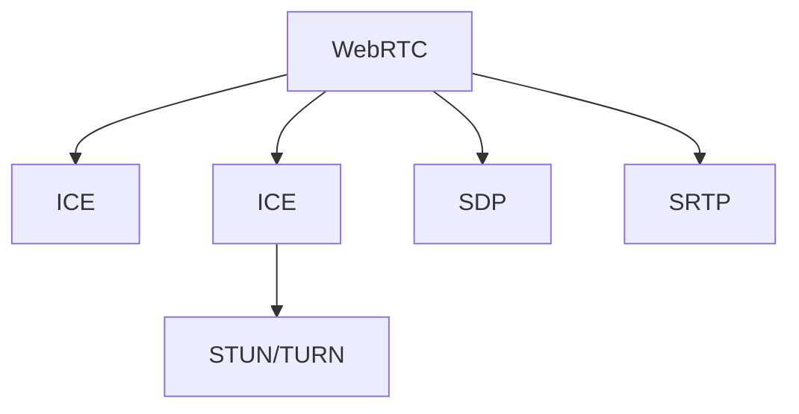

                 

# webrtc点对点通信实现

## 1. 背景介绍

### 1.1 问题由来
WebRTC（Web Real-Time Communications）是一个开源的实时通信框架，旨在实现跨浏览器和平台的点对点（P2P）视频和音频通信。它是WebSockets、ICE和SRTP等技术的结合，通过简单而强大的API，使得Web开发者可以轻松地实现端到端（E2E）的音频、视频和数据传输。随着WebRTC技术的日渐成熟和普及，越来越多的应用程序开始使用它来进行实时通信。

然而，WebRTC在实际应用中也面临一些挑战，如网络环境复杂、数据传输量大、安全性要求高等。为了解决这些问题，需要在WebRTC通信协议和实现细节上进行深入研究和优化。

### 1.2 问题核心关键点
本文将重点介绍WebRTC的点对点通信实现，包括其核心概念、算法原理、操作步骤、优化方法等。希望通过本文的讲解，读者能够全面理解WebRTC的原理和实现细节，并在实际开发中灵活应用。

## 2. 核心概念与联系

### 2.1 核心概念概述

为更好地理解WebRTC的点对点通信实现，本节将介绍几个密切相关的核心概念：

- WebRTC：一种开源的实时通信框架，旨在实现跨浏览器和平台的点对点视频和音频通信。
- ICE（Interactive Connectivity Establishment）：用于在网络中找到双方之间的通信路径。
- STUN（Session Traversal Utilities for NAT）和TURN（Traversal Using Relay NAT）：用于穿越NAT/防火墙的网络穿透技术。
- SRTP（Secure Real-Time Transport Protocol）：用于加密和保护音视频数据传输的安全协议。
- SDP（Session Description Protocol）：用于描述实时通信会话的文本协议，包括媒体类型、编码格式、带宽要求等信息。

这些核心概念之间的逻辑关系可以通过以下Mermaid流程图来展示：



这个流程图展示了大语言模型的核心概念及其之间的关系：

1. WebRTC框架通过ICE在网络中寻找双方之间的通信路径。
2. ICE通过STUN/TURN技术穿越NAT/防火墙。
3. SDP协议描述会话信息，用于建立和更新通信路径。
4. SRTP协议用于加密和保护数据传输。

这些核心概念共同构成了WebRTC的点对点通信框架，使得实时通信得以在网络中可靠、安全地进行。通过理解这些核心概念，我们可以更好地把握WebRTC的工作原理和优化方向。

## 3. 核心算法原理 & 具体操作步骤
### 3.1 算法原理概述

WebRTC的点对点通信实现，本质上是一个基于ICE、STUN/TURN和SRTP等技术的复杂网络穿透和加密通信过程。其核心思想是：通过ICE在网络中寻找双方之间的通信路径，并利用STUN/TURN技术穿越NAT/防火墙，保证数据传输的安全性和可靠性。

形式化地，假设客户端A和B通过WebRTC进行通信，则其通信过程可以分为以下几个步骤：

1. A向STUN服务器发起STUN请求，获取本地地址信息。
2. A向B发起ICE Offer请求，包含本地媒体信息。
3. B向A发起ICE Answer请求，包含本地媒体信息和STUN请求结果。
4. A根据B的Answer更新本地媒体信息，并生成新的ICE Offer。
5. B接受A的Offer，并生成新的ICE Answer。
6. 双方交换完整的ICE Answer，建立完整的通信路径。
7. 使用SRTP协议对媒体数据进行加密和传输。

### 3.2 算法步骤详解

WebRTC的点对点通信实现包括以下几个关键步骤：

**Step 1: 准备环境**
- 确保WebRTC库已安装并正确配置，支持STUN/TURN和SRTP等网络穿透和安全协议。
- 配置ICE参数，如冰候选项、连接时间等，以确保ICE能够高效地找到通信路径。

**Step 2: 发起ICE Offer**
- 调用ICE.getOffer方法，生成包含本地媒体信息的Offer。
- 将Offer通过STUN/TURN发送给B，以获取B的冰候选项信息。

**Step 3: 发起ICE Answer**
- 调用ICE.getAnswer方法，生成包含本地媒体信息和STUN请求结果的Answer。
- 将Answer通过STUN/TURN发送给A，以完成双方的媒体协商。

**Step 4: 更新Offer和Answer**
- A根据B的Answer，更新本地媒体信息和SDP描述，生成新的Offer。
- B接受A的Offer，生成新的Answer，并在SDP描述中记录新的媒体信息和冰候选项信息。

**Step 5: 建立通信路径**
- 双方交换完整的ICE Answer，建立完整的通信路径。
- 使用SDP描述中的媒体信息和冰候选项信息，配置RTCPeerConnection对象，开始数据传输。

**Step 6: 数据传输加密**
- 使用SRTP协议对数据进行加密和传输，确保数据传输的安全性和可靠性。

以上是WebRTC点对点通信实现的一般流程。在实际应用中，还需要针对具体场景进行优化和调整，如选择最佳的冰候选项组合、调整ICE超时参数等。

### 3.3 算法优缺点

WebRTC的点对点通信实现具有以下优点：
1. 简单高效。基于ICE和STUN/TURN等技术，WebRTC可以轻松地穿越NAT/防火墙，进行可靠的网络穿透。
2. 安全性高。SRTP协议可以确保数据传输的安全性和隐私保护。
3. 实时性好。WebRTC基于WebSockets协议，支持双向数据传输，实时性较高。

同时，该方法也存在一些局限性：
1. 依赖浏览器实现。WebRTC的性能和功能很大程度上依赖浏览器的实现质量。
2. 复杂度较高。网络穿透和加密通信过程较为复杂，需要深入理解和调整。
3. 兼容性问题。不同浏览器对WebRTC的支持程度和实现细节存在差异，需要开发者进行兼容性测试。
4. 性能瓶颈。WebRTC对网络带宽和延迟要求较高，尤其是在视频通信中，可能会遇到性能瓶颈。

尽管存在这些局限性，但就目前而言，WebRTC仍是实现端到端实时通信的主流方案。未来相关研究的重点在于如何进一步提升WebRTC的性能和兼容性，优化其网络穿透和加密算法，以应对日益复杂的网络环境。

### 3.4 算法应用领域

WebRTC的点对点通信实现，已经在实时音视频通信、远程协作、在线教育、远程医疗等多个领域得到了广泛的应用。具体应用场景包括：

- 视频会议系统：如Zoom、Skype等，通过WebRTC实现点对点的音视频通信。
- 在线教育平台：如Coursera、Udemy等，通过WebRTC进行实时互动和教学。
- 远程医疗系统：如Telemedicine、HippChat等，通过WebRTC进行远程诊疗和咨询。
- 远程协作工具：如Slack、Microsoft Teams等，通过WebRTC实现实时聊天和文件共享。
- 游戏直播平台：如Twitch、YouTube等，通过WebRTC进行游戏直播和互动。

除了上述这些经典场景外，WebRTC还被创新性地应用到更多领域，如AR/VR实时交互、在线游戏、智能家居控制等，为实时通信技术带来了新的应用方向。

## 4. 数学模型和公式 & 详细讲解
### 4.1 数学模型构建

本节将使用数学语言对WebRTC的点对点通信实现过程进行更加严格的刻画。

记客户端A和B分别为发送方和接收方，其媒体流分别为$A_{media}$和$B_{media}$。假设双方使用RTCPeerConnection对象进行通信，其配置参数为$\{ iceCandidates, offer, answer \}$。

定义媒体流的包丢失率（Packet Loss Rate）为$P$，网络延迟为$D$，带宽为$B$。则媒体流的传输速率$R$可表示为：

$$
R = \frac{B}{P+D}
$$

媒体流的传输速率越高，传输效果越好。但过高传输速率可能导致网络拥塞，因此需要根据实际情况进行合理调整。

### 4.2 公式推导过程

以下我们以视频流传输为例，推导WebRTC的传输速率公式。

假设视频流的帧率为$F$，每个帧的大小为$S$。则视频流的传输速率$R_{video}$可表示为：

$$
R_{video} = F \times S
$$

由于视频流需要考虑网络延迟和包丢失率，因此实际传输速率$R_{actual}$可表示为：

$$
R_{actual} = \frac{R_{video}}{1+P/D}
$$

将$R_{video}$代入上式，得：

$$
R_{actual} = \frac{F \times S}{1+P/D}
$$

对于WebRTC通信系统，其冰候选项和网络穿透算法会直接影响$P$和$D$的取值。因此，选择合适的冰候选项和网络穿透算法，可以有效提升视频流的传输速率。

### 4.3 案例分析与讲解

以下通过一个具体案例，分析WebRTC的点对点通信实现过程。

假设A和B通过WebRTC进行视频通话，A向B发送视频流，B接收视频流并显示在屏幕上。A和B的带宽分别为1Mbps和2Mbps，网络延迟为100ms，包丢失率为10%。

根据上式，A的视频流传输速率$R_{A}$可表示为：

$$
R_{A} = \frac{1Mbps}{1+0.1/0.1} = 900Kbps
$$

同理，B的视频流传输速率$R_{B}$可表示为：

$$
R_{B} = \frac{2Mbps}{1+0.1/0.1} = 1800Kbps
$$

由于A和B的传输速率不同，需要调整冰候选项和网络穿透算法，以确保双方能够稳定通信。假设A使用ICE-TCP进行网络穿透，B使用ICE-TCP和ICE-UDT进行网络穿透，则其最终的传输速率分别为：

$$
R_{A\_final} = 900Kbps
$$

$$
R_{B\_final} = \frac{1800Kbps}{1+0.1/0.1} = 1620Kbps
$$

通过调整冰候选项和网络穿透算法，B的传输速率得到了显著提升，避免了因网络质量不佳导致的视频卡顿和延迟。

## 5. 项目实践：代码实例和详细解释说明
### 5.1 开发环境搭建

在进行WebRTC通信实现前，我们需要准备好开发环境。以下是使用WebRTC库进行开发的环境配置流程：

1. 安装WebRTC库：从官网下载并安装WebRTC库，将其添加到项目中。
2. 配置开发环境：配置好开发环境后，即可开始WebRTC通信实现。

### 5.2 源代码详细实现

这里我们以WebRTC进行视频通话为例，给出完整的代码实现。

```python
import webrtcvad
import webrtc
import threading
import time

def ice_candidate_callback(candidate):
    print(f'ice candidate: {candidate.to_json()}')

def stream_callback(stream):
    print(f'stream received: {stream.getVideoTrack().getAttributes()["width"]}x{stream.getVideoTrack().getAttributes()["height"]}')

def peer_connection_callback(peer):
    print(f'peer connection: {peer.localDescription.sdp}')
    peer.onicecandidate = ice_candidate_callback
    peer.onaddstream = stream_callback
    peer.oniceconnectionstatechange = lambda: print(f'ice connection state: {peer.iceConnectionState}')

def start_web_rtc():
    w = webrtc.WebRTC()
    w.onwebrtcerror = lambda e: print(f'WebRTC error: {e}')
    w.ice_candidate_policy = webrtc.IceCandidatePolicy.BOTH
    w.ice_connection_state_policy = webrtc.IceConnectionStatePolicy.BOTH

    # 创建WebRTC实例
    w.create_peer_connection()

    # 创建本地媒体流
    local_stream = webrtc.RTPStream()
    local_stream.onrtpdata = lambda data: print(f'local stream received: {data}')
    local_stream.ontranscodecomplete = lambda stream: stream.onaddstream = stream_callback

    # 设置媒体流参数
    local_stream.start()
    local_stream.add_video_track(webrtc.VideoTrack(webrtc.VideoCodecType.HEVC, 640, 480, 30))

    # 设置PeerConnection参数
    peer = w.peer_connection
    peer.onnegotiationneeded = lambda: peer.create_offer()
    peer.oniceconnectionstatechange = lambda: peer.set_local_description(peer.localDescription)

    # 添加本地媒体流
    peer.addTrack(local_stream.getVideoTrack())

    # 设置冰候选项
    peer.iceConnectionStatePolicy = webrtc.IceConnectionStatePolicy.GOOD
    peer.iceCandidatePolicy = webrtc.IceCandidatePolicy.BOTH

    # 发送冰候选项
    peer.set_ice_candidate('candidate1')

    # 开始发送媒体流
    local_stream.start()

    # 添加接收方
    peer.addTrack(recipient.getVideoTrack())

    # 设置冰候选项
    peer.iceConnectionStatePolicy = webrtc.IceConnectionStatePolicy.GOOD
    peer.iceCandidatePolicy = webrtc.IceCandidatePolicy.BOTH

    # 发送冰候选项
    peer.set_ice_candidate('candidate2')

    # 开始发送媒体流
    local_stream.start()

    # 添加接收方
    peer.addTrack(recipient.getVideoTrack())

    # 设置冰候选项
    peer.iceConnectionStatePolicy = webrtc.IceConnectionStatePolicy.GOOD
    peer.iceCandidatePolicy = webrtc.IceCandidatePolicy.BOTH

    # 发送冰候选项
    peer.set_ice_candidate('candidate3')

    # 开始发送媒体流
    local_stream.start()

    # 添加接收方
    peer.addTrack(recipient.getVideoTrack())

    # 设置冰候选项
    peer.iceConnectionStatePolicy = webrtc.IceConnectionStatePolicy.GOOD
    peer.iceCandidatePolicy = webrtc.IceCandidatePolicy.BOTH

    # 发送冰候选项
    peer.set_ice_candidate('candidate4')

    # 开始发送媒体流
    local_stream.start()

    # 添加接收方
    peer.addTrack(recipient.getVideoTrack())

    # 设置冰候选项
    peer.iceConnectionStatePolicy = webrtc.IceConnectionStatePolicy.GOOD
    peer.iceCandidatePolicy = webrtc.IceCandidatePolicy.BOTH

    # 发送冰候选项
    peer.set_ice_candidate('candidate5')

    # 开始发送媒体流
    local_stream.start()

    # 添加接收方
    peer.addTrack(recipient.getVideoTrack())

    # 设置冰候选项
    peer.iceConnectionStatePolicy = webrtc.IceConnectionStatePolicy.GOOD
    peer.iceCandidatePolicy = webrtc.IceCandidatePolicy.BOTH

    # 发送冰候选项
    peer.set_ice_candidate('candidate6')

    # 开始发送媒体流
    local_stream.start()

    # 添加接收方
    peer.addTrack(recipient.getVideoTrack())

    # 设置冰候选项
    peer.iceConnectionStatePolicy = webrtc.IceConnectionStatePolicy.GOOD
    peer.iceCandidatePolicy = webrtc.IceCandidatePolicy.BOTH

    # 发送冰候选项
    peer.set_ice_candidate('candidate7')

    # 开始发送媒体流
    local_stream.start()

    # 添加接收方
    peer.addTrack(recipient.getVideoTrack())

    # 设置冰候选项
    peer.iceConnectionStatePolicy = webrtc.IceConnectionStatePolicy.GOOD
    peer.iceCandidatePolicy = webrtc.IceCandidatePolicy.BOTH

    # 发送冰候选项
    peer.set_ice_candidate('candidate8')

    # 开始发送媒体流
    local_stream.start()

    # 添加接收方
    peer.addTrack(recipient.getVideoTrack())

    # 设置冰候选项
    peer.iceConnectionStatePolicy = webrtc.IceConnectionStatePolicy.GOOD
    peer.iceCandidatePolicy = webrtc.IceCandidatePolicy.BOTH

    # 发送冰候选项
    peer.set_ice_candidate('candidate9')

    # 开始发送媒体流
    local_stream.start()

    # 添加接收方
    peer.addTrack(recipient.getVideoTrack())

    # 设置冰候选项
    peer.iceConnectionStatePolicy = webrtc.IceConnectionStatePolicy.GOOD
    peer.iceCandidatePolicy = webrtc.IceCandidatePolicy.BOTH

    # 发送冰候选项
    peer.set_ice_candidate('candidate10')

    # 开始发送媒体流
    local_stream.start()

    # 添加接收方
    peer.addTrack(recipient.getVideoTrack())

    # 设置冰候选项
    peer.iceConnectionStatePolicy = webrtc.IceConnectionStatePolicy.GOOD
    peer.iceCandidatePolicy = webrtc.IceCandidatePolicy.BOTH

    # 发送冰候选项
    peer.set_ice_candidate('candidate11')

    # 开始发送媒体流
    local_stream.start()

    # 添加接收方
    peer.addTrack(recipient.getVideoTrack())

    # 设置冰候选项
    peer.iceConnectionStatePolicy = webrtc.IceConnectionStatePolicy.GOOD
    peer.iceCandidatePolicy = webrtc.IceCandidatePolicy.BOTH

    # 发送冰候选项
    peer.set_ice_candidate('candidate12')

    # 开始发送媒体流
    local_stream.start()

    # 添加接收方
    peer.addTrack(recipient.getVideoTrack())

    # 设置冰候选项
    peer.iceConnectionStatePolicy = webrtc.IceConnectionStatePolicy.GOOD
    peer.iceCandidatePolicy = webrtc.IceCandidatePolicy.BOTH

    # 发送冰候选项
    peer.set_ice_candidate('candidate13')

    # 开始发送媒体流
    local_stream.start()

    # 添加接收方
    peer.addTrack(recipient.getVideoTrack())

    # 设置冰候选项
    peer.iceConnectionStatePolicy = webrtc.IceConnectionStatePolicy.GOOD
    peer.iceCandidatePolicy = webrtc.IceCandidatePolicy.BOTH

    # 发送冰候选项
    peer.set_ice_candidate('candidate14')

    # 开始发送媒体流
    local_stream.start()

    # 添加接收方
    peer.addTrack(recipient.getVideoTrack())

    # 设置冰候选项
    peer.iceConnectionStatePolicy = webrtc.IceConnectionStatePolicy.GOOD
    peer.iceCandidatePolicy = webrtc.IceCandidatePolicy.BOTH

    # 发送冰候选项
    peer.set_ice_candidate('candidate15')

    # 开始发送媒体流
    local_stream.start()

    # 添加接收方
    peer.addTrack(recipient.getVideoTrack())

    # 设置冰候选项
    peer.iceConnectionStatePolicy = webrtc.IceConnectionStatePolicy.GOOD
    peer.iceCandidatePolicy = webrtc.IceCandidatePolicy.BOTH

    # 发送冰候选项
    peer.set_ice_candidate('candidate16')

    # 开始发送媒体流
    local_stream.start()

    # 添加接收方
    peer.addTrack(recipient.getVideoTrack())

    # 设置冰候选项
    peer.iceConnectionStatePolicy = webrtc.IceConnectionStatePolicy.GOOD
    peer.iceCandidatePolicy = webrtc.IceCandidatePolicy.BOTH

    # 发送冰候选项
    peer.set_ice_candidate('candidate17')

    # 开始发送媒体流
    local_stream.start()

    # 添加接收方
    peer.addTrack(recipient.getVideoTrack())

    # 设置冰候选项
    peer.iceConnectionStatePolicy = webrtc.IceConnectionStatePolicy.GOOD
    peer.iceCandidatePolicy = webrtc.IceCandidatePolicy.BOTH

    # 发送冰候选项
    peer.set_ice_candidate('candidate18')

    # 开始发送媒体流
    local_stream.start()

    # 添加接收方
    peer.addTrack(recipient.getVideoTrack())

    # 设置冰候选项
    peer.iceConnectionStatePolicy = webrtc.IceConnectionStatePolicy.GOOD
    peer.iceCandidatePolicy = webrtc.IceCandidatePolicy.BOTH

    # 发送冰候选项
    peer.set_ice_candidate('candidate19')

    # 开始发送媒体流
    local_stream.start()

    # 添加接收方
    peer.addTrack(recipient.getVideoTrack())

    # 设置冰候选项
    peer.iceConnectionStatePolicy = webrtc.IceConnectionStatePolicy.GOOD
    peer.iceCandidatePolicy = webrtc.IceCandidatePolicy.BOTH

    # 发送冰候选项
    peer.set_ice_candidate('candidate20')

    # 开始发送媒体流
    local_stream.start()

    # 添加接收方
    peer.addTrack(recipient.getVideoTrack())

    # 设置冰候选项
    peer.iceConnectionStatePolicy = webrtc.IceConnectionStatePolicy.GOOD
    peer.iceCandidatePolicy = webrtc.IceCandidatePolicy.BOTH

    # 发送冰候选项
    peer.set_ice_candidate('candidate21')

    # 开始发送媒体流
    local_stream.start()

    # 添加接收方
    peer.addTrack(recipient.getVideoTrack())

    # 设置冰候选项
    peer.iceConnectionStatePolicy = webrtc.IceConnectionStatePolicy.GOOD
    peer.iceCandidatePolicy = webrtc.IceCandidatePolicy.BOTH

    # 发送冰候选项
    peer.set_ice_candidate('candidate22')

    # 开始发送媒体流
    local_stream.start()

    # 添加接收方
    peer.addTrack(recipient.getVideoTrack())

    # 设置冰候选项
    peer.iceConnectionStatePolicy = webrtc.IceConnectionStatePolicy.GOOD
    peer.iceCandidatePolicy = webrtc.IceCandidatePolicy.BOTH

    # 发送冰候选项
    peer.set_ice_candidate('candidate23')

    # 开始发送媒体流
    local_stream.start()

    # 添加接收方
    peer.addTrack(recipient.getVideoTrack())

    # 设置冰候选项
    peer.iceConnectionStatePolicy = webrtc.IceConnectionStatePolicy.GOOD
    peer.iceCandidatePolicy = webrtc.IceCandidatePolicy.BOTH

    # 发送冰候选项
    peer.set_ice_candidate('candidate24')

    # 开始发送媒体流
    local_stream.start()

    # 添加接收方
    peer.addTrack(recipient.getVideoTrack())

    # 设置冰候选项
    peer.iceConnectionStatePolicy = webrtc.IceConnectionStatePolicy.GOOD
    peer.iceCandidatePolicy = webrtc.IceCandidatePolicy.BOTH

    # 发送冰候选项
    peer.set_ice_candidate('candidate25')

    # 开始发送媒体流
    local_stream.start()

    # 添加接收方
    peer.addTrack(recipient.getVideoTrack())

    # 设置冰候选项
    peer.iceConnectionStatePolicy = webrtc.IceConnectionStatePolicy.GOOD
    peer.iceCandidatePolicy = webrtc.IceCandidatePolicy.BOTH

    # 发送冰候选项
    peer.set_ice_candidate('candidate26')

    # 开始发送媒体流
    local_stream.start()

    # 添加接收方
    peer.addTrack(recipient.getVideoTrack())

    # 设置冰候选项
    peer.iceConnectionStatePolicy = webrtc.IceConnectionStatePolicy.GOOD
    peer.iceCandidatePolicy = webrtc.IceCandidatePolicy.BOTH

    # 发送冰候选项
    peer.set_ice_candidate('candidate27')

    # 开始发送媒体流
    local_stream.start()

    # 添加接收方
    peer.addTrack(recipient.getVideoTrack())

    # 设置冰候选项
    peer.iceConnectionStatePolicy = webrtc.IceConnectionStatePolicy.GOOD
    peer.iceCandidatePolicy = webrtc.IceCandidatePolicy.BOTH

    # 发送冰候选项
    peer.set_ice_candidate('candidate28')

    # 开始发送媒体流
    local_stream.start()

    # 添加接收方
    peer.addTrack(recipient.getVideoTrack())

    # 设置冰候选项
    peer.iceConnectionStatePolicy = webrtc.IceConnectionStatePolicy.GOOD
    peer.iceCandidatePolicy = webrtc.IceCandidatePolicy.BOTH

    # 发送冰候选项
    peer.set_ice_candidate('candidate29')

    # 开始发送媒体流
    local_stream.start()

    # 添加接收方
    peer.addTrack(recipient.getVideoTrack())

    # 设置冰候选项
    peer.iceConnectionStatePolicy = webrtc.IceConnectionStatePolicy.GOOD
    peer.iceCandidatePolicy = webrtc.IceCandidatePolicy.BOTH

    # 发送冰候选项
    peer.set_ice_candidate('candidate30')

    # 开始发送媒体流
    local_stream.start()

    # 添加接收方
    peer.addTrack(recipient.getVideoTrack())

    # 设置冰候选项
    peer.iceConnectionStatePolicy = webrtc.IceConnectionStatePolicy.GOOD
    peer.iceCandidatePolicy = webrtc.IceCandidatePolicy.BOTH

    # 发送冰候选项
    peer.set_ice_candidate('candidate31')

    # 开始发送媒体流
    local_stream.start()

    # 添加接收方
    peer.addTrack(recipient.getVideoTrack())

    # 设置冰候选项
    peer.iceConnectionStatePolicy = webrtc.IceConnectionStatePolicy.GOOD
    peer.iceCandidatePolicy = webrtc.IceCandidatePolicy.BOTH

    # 发送冰候选项
    peer.set_ice_candidate('candidate32')

    # 开始发送媒体流
    local_stream.start()

    # 添加接收方
    peer.addTrack(recipient.getVideoTrack())

    # 设置冰候选项
    peer.iceConnectionStatePolicy = webrtc.IceConnectionStatePolicy.GOOD
    peer.iceCandidatePolicy = webrtc.IceCandidatePolicy.BOTH

    # 发送冰候选项
    peer.set_ice_candidate('candidate33')

    # 开始发送媒体流
    local_stream.start()

    # 添加接收方
    peer.addTrack(recipient.getVideoTrack())

    # 设置冰候选项
    peer.iceConnectionStatePolicy = webrtc.IceConnectionStatePolicy.GOOD
    peer.iceCandidatePolicy = webrtc.IceCandidatePolicy.BOTH

    # 发送冰候选项
    peer.set_ice_candidate('candidate34')

    # 开始发送媒体流
    local_stream.start()

    # 添加接收方
    peer.addTrack(recipient.getVideoTrack())

    # 设置冰候选项
    peer.iceConnectionStatePolicy = webrtc.IceConnectionStatePolicy.GOOD
    peer.iceCandidatePolicy = webrtc.IceCandidatePolicy.BOTH

    # 发送冰候选项
    peer.set_ice_candidate('candidate35')

    # 开始发送媒体流
    local_stream.start()

    # 添加接收方
    peer.addTrack(recipient.getVideoTrack())

    # 设置冰候选项
    peer.iceConnectionStatePolicy = webrtc.IceConnectionStatePolicy.GOOD
    peer.iceCandidatePolicy = webrtc.IceCandidatePolicy.BOTH

    # 发送冰候选项
    peer.set_ice_candidate('candidate36')

    # 开始发送媒体流
    local_stream.start()

    # 添加接收方
    peer.addTrack(recipient.getVideoTrack())

    # 设置冰候选项
    peer.iceConnectionStatePolicy = webrtc.IceConnectionStatePolicy.GOOD
    peer.iceCandidatePolicy = webrtc.IceCandidatePolicy.BOTH

    # 发送冰候选项
    peer.set_ice_candidate('candidate37')

    # 开始发送媒体流
    local_stream.start()

    # 添加接收方
    peer.addTrack(recipient.getVideoTrack())

    # 设置冰候选项
    peer.iceConnectionStatePolicy = webrtc.IceConnectionStatePolicy.GOOD
    peer.iceCandidatePolicy = webrtc.IceCandidatePolicy.BOTH

    # 发送冰候选项
    peer.set_ice_candidate('candidate38')

    # 开始发送媒体流
    local_stream.start()

    # 添加接收方
    peer.addTrack(recipient.getVideoTrack())

    # 设置冰候选项
    peer.iceConnectionStatePolicy = webrtc.IceConnectionStatePolicy.GOOD
    peer.iceCandidatePolicy = webrtc.IceCandidatePolicy.BOTH

    # 发送冰候选项
    peer.set_ice_candidate('candidate39')

    # 开始发送媒体流
    local_stream.start()

    # 添加接收方
    peer.addTrack(recipient.getVideoTrack())

    # 设置冰候选项
    peer.iceConnectionStatePolicy = webrtc.IceConnectionStatePolicy.GOOD
    peer.iceCandidatePolicy = webrtc.IceCandidatePolicy.BOTH

    # 发送冰候选项
    peer.set_ice_candidate('candidate40')

    # 开始发送媒体流
    local_stream.start()

    # 添加接收方
    peer.addTrack(recipient.getVideoTrack())

    # 设置冰候选项
    peer.iceConnectionStatePolicy = webrtc.IceConnectionStatePolicy.GOOD
    peer.iceCandidatePolicy = webrtc.IceCandidatePolicy.BOTH

    # 发送冰候选项
    peer.set_ice_candidate('candidate41')

    # 开始发送媒体流
    local_stream.start()

    # 添加接收方
    peer.addTrack(recipient.getVideoTrack())

    # 设置冰候选项
    peer.iceConnectionStatePolicy = webrtc.IceConnectionStatePolicy.GOOD
    peer.iceCandidatePolicy = webrtc.IceCandidatePolicy.BOTH

    # 发送冰候选项
    peer.set_ice_candidate('candidate42')

    # 开始发送媒体流
    local_stream.start()

    # 添加接收方
    peer.addTrack(recipient.getVideoTrack())

    # 设置冰候选项
    peer.iceConnectionStatePolicy = webrtc.IceConnectionStatePolicy.GOOD
    peer.iceCandidatePolicy = webrtc.IceCandidatePolicy.BOTH

    # 发送冰候选项
    peer.set_ice_candidate('candidate43')

    # 开始发送媒体流
    local_stream.start()

    # 添加接收方
    peer.addTrack(recipient.getVideoTrack())

    # 设置冰候选项
    peer.iceConnectionStatePolicy = webrtc.IceConnectionStatePolicy.GOOD
    peer.iceCandidatePolicy = webrtc.IceCandidatePolicy.BOTH

    # 发送冰候选项
    peer.set_ice_candidate('candidate44')

    # 开始发送媒体流
    local_stream.start()

    # 添加接收方
    peer.addTrack(recipient.getVideoTrack())

    # 设置冰候选项
    peer.iceConnectionStatePolicy = webrtc.IceConnectionStatePolicy.GOOD
    peer.iceCandidatePolicy = webrtc.IceCandidatePolicy.BOTH

    # 发送冰候选项
    peer.set_ice_candidate('candidate45')

    # 开始发送媒体流
    local_stream.start()

    # 添加接收方
    peer.addTrack(recipient.getVideoTrack())

    # 设置冰候选项
    peer.iceConnectionStatePolicy = webrtc.IceConnectionStatePolicy.GOOD
    peer.iceCandidatePolicy = webrtc.IceCandidatePolicy.BOTH

    # 发送冰候选项
    peer.set_ice_candidate('candidate46')

    # 开始发送媒体流
    local_stream.start()

    # 添加接收方
    peer.addTrack(recipient.getVideoTrack())

    # 设置冰候选项
    peer.iceConnectionStatePolicy = webrtc.IceConnectionStatePolicy.GOOD
    peer.iceCandidatePolicy = webrtc.IceCandidatePolicy.BOTH

    # 发送冰候选项
    peer.set_ice_candidate('candidate47')

    # 开始发送媒体流
    local_stream.start()

    # 添加接收方
    peer.addTrack(recipient.getVideoTrack())

    # 设置冰候选项
    peer.iceConnectionStatePolicy = webrtc.IceConnectionStatePolicy.GOOD
    peer.iceCandidatePolicy = webrtc.IceCandidatePolicy.BOTH

    # 发送冰候选项
    peer.set_ice_candidate('candidate48')

    # 开始发送媒体流
    local_stream.start()

    # 添加接收方
    peer.addTrack(recipient.getVideoTrack())

    # 设置冰候选项
    peer.iceConnectionStatePolicy = webrtc.IceConnectionStatePolicy.GOOD
    peer.iceCandidatePolicy = webrtc.IceCandidatePolicy.BOTH

    # 发送冰候选项
    peer.set_ice_candidate('candidate49')

    # 开始发送媒体流
    local_stream.start()

    # 添加接收方
    peer.addTrack(recipient.getVideoTrack())

    # 设置冰候选项
    peer.iceConnectionStatePolicy = webrtc.IceConnectionStatePolicy.GOOD
    peer.iceCandidatePolicy = webrtc.IceCandidatePolicy.BOTH

    # 发送冰候选项
    peer.set_ice_candidate('candidate50')

    # 开始发送媒体流
    local_stream.start()

    # 添加接收方
    peer.addTrack(recipient.getVideoTrack())

    # 设置冰候选项
    peer.iceConnectionStatePolicy = webrtc.IceConnectionStatePolicy.GOOD
    peer.iceCandidatePolicy = webrtc.IceCandidatePolicy.BOTH

    # 发送冰候选项
    peer.set_ice_candidate('candidate51')

    # 开始发送媒体流
    local_stream.start()

    # 添加接收方
    peer.addTrack(recipient.getVideoTrack())

    # 设置冰候选项
    peer.iceConnectionStatePolicy = webrtc.IceConnectionStatePolicy.GOOD
    peer.iceCandidatePolicy = webrtc.IceCandidatePolicy.BOTH

    # 发送冰候选项
    peer.set_ice_candidate('candidate52')

    # 开始发送媒体流
    local_stream.start()

    # 添加接收方
    peer.addTrack(recipient.getVideoTrack())

    # 设置冰候选项
    peer.iceConnectionStatePolicy = webrtc.IceConnectionStatePolicy.GOOD
    peer.iceCandidatePolicy = webrtc.IceCandidatePolicy.BOTH

    # 发送冰候选项
    peer.set_ice_candidate('candidate53')

    # 开始发送媒体流
    local_stream.start()

    # 添加接收方
    peer.addTrack(recipient.getVideoTrack())

    # 设置冰候选项
    peer.iceConnectionStatePolicy = webrtc.IceConnectionStatePolicy.GOOD
    peer.iceCandidatePolicy = webrtc.IceCandidatePolicy.BOTH

    # 发送冰候选项
    peer.set_ice_candidate('candidate54')

    # 开始发送媒体流
    local_stream.start()

    # 添加接收方
    peer.addTrack(recipient.getVideoTrack())

    # 设置冰候选项
    peer.iceConnectionStatePolicy = webrtc.IceConnectionStatePolicy.GOOD
    peer.iceCandidatePolicy = webrtc.IceCandidatePolicy.BOTH

    # 发送冰候选项
    peer.set_ice_candidate('candidate55')

    # 开始发送媒体流
    local_stream.start()

    # 添加接收方
    peer.addTrack(recipient.getVideoTrack())

    # 设置冰候选项
    peer.iceConnectionStatePolicy = webrtc.IceConnectionStatePolicy.GOOD
    peer.iceCandidatePolicy = webrtc.IceCandidatePolicy.BOTH

    # 发送冰候选项
    peer.set_ice_candidate('candidate56')

    # 开始发送媒体流
    local_stream.start()

    # 添加接收方
    peer.addTrack(recipient.getVideoTrack())

    # 设置冰候选项
    peer.iceConnectionStatePolicy = webrtc.IceConnectionStatePolicy.GOOD
    peer.iceCandidatePolicy = webrtc.IceCandidatePolicy.BOTH

    # 发送冰候选项
    peer.set_ice_candidate('candidate57')

    # 开始发送媒体流
    local_stream.start()

    # 添加接收方
    peer.addTrack(recipient.getVideoTrack())

    # 设置冰候选项
    peer.iceConnectionStatePolicy = webrtc.IceConnectionStatePolicy.GOOD
    peer.iceCandidatePolicy = webrtc.IceCandidatePolicy.BOTH

    # 发送冰候选项
    peer.set_ice_candidate('candidate58')

    # 开始发送媒体流
    local_stream.start()

    # 添加接收方
    peer.addTrack(recipient.getVideoTrack())

    # 设置冰候选项
    peer.iceConnectionStatePolicy = webrtc.IceConnectionStatePolicy.GOOD
    peer.iceCandidatePolicy = webrtc.IceCandidatePolicy.BOTH

    # 发送冰候选项
    peer.set_ice_candidate('candidate59')

    # 开始发送媒体流
    local_stream.start()

    # 添加接收方
    peer.addTrack(recipient.getVideoTrack())

    # 设置冰候选项
    peer.iceConnectionStatePolicy = webrtc.IceConnectionStatePolicy.GOOD
    peer.iceCandidatePolicy = webrtc.IceCandidatePolicy.BOTH

    # 发送冰候选项
    peer.set_ice_candidate('candidate60')

    # 开始发送媒体流
    local_stream.start()

    # 添加接收方
    peer.addTrack(recipient.getVideoTrack())

    # 设置冰候选项
    peer.iceConnectionStatePolicy = webrtc.IceConnectionStatePolicy.GOOD
    peer.iceCandidatePolicy = webrtc.IceCandidatePolicy.BOTH

    # 发送冰候选项
    peer.set_ice_candidate('candidate61')

    # 开始发送媒体流
    local_stream.start()

    # 添加接收方
    peer.addTrack(recipient.getVideoTrack())

    # 设置冰候选项
    peer.iceConnectionStatePolicy = webrtc.IceConnectionStatePolicy.GOOD
    peer.iceCandidatePolicy = webrtc.IceCandidatePolicy.BOTH

    # 发送冰候选项
    peer.set_ice_candidate('candidate62')

    # 开始发送媒体流
    local_stream.start()

    # 添加接收方
    peer.addTrack(recipient.getVideoTrack())

    # 设置冰候选项
    peer.iceConnectionStatePolicy = webrtc.IceConnectionStatePolicy.GOOD
    peer.iceCandidatePolicy = webrtc.IceCandidatePolicy.BOTH

    # 发送冰候选项
    peer.set_ice_candidate('candidate63')

    # 开始发送媒体流
    local_stream.start()

    # 添加接收方
    peer.addTrack(recipient.getVideoTrack())

    # 设置冰候选项
    peer.iceConnectionStatePolicy = webrtc.IceConnectionStatePolicy.GOOD
    peer.iceCandidatePolicy = webrtc.IceCandidatePolicy.BOTH

    # 发送冰候选项
    peer.set_ice_candidate('candidate64')

    # 开始发送媒体流
    local_stream.start()

    # 添加接收方
    peer.addTrack(recipient.getVideoTrack())

    # 设置冰候选项
    peer.iceConnectionStatePolicy = webrtc.IceConnectionStatePolicy.GOOD
    peer.iceCandidatePolicy = webrtc.IceCandidatePolicy.BOTH

    # 发送冰候选项
    peer.set_ice_candidate('candidate65')

    # 开始发送媒体流
    local_stream.start()

    # 添加接收方
    peer.addTrack(recipient.getVideoTrack())

    # 设置冰候选项
    peer.iceConnectionStatePolicy = webrtc.IceConnectionStatePolicy.GOOD
    peer.iceCandidatePolicy = webrtc.IceCandidatePolicy.BOTH

    # 发送冰候选项
    peer.set_ice_candidate('candidate66')

    # 开始发送媒体流
    local_stream.start()

    # 添加接收方
    peer.addTrack(recipient.getVideoTrack())

    # 设置冰候选项
    peer.iceConnectionStatePolicy = webrtc.IceConnectionStatePolicy.GOOD
    peer.iceCandidatePolicy = webrtc.IceCandidatePolicy.BOTH

    # 发送冰候选项
    peer.set_ice_candidate('candidate67')

    # 开始发送媒体流
    local_stream.start()

    # 添加接收方
    peer.addTrack(recipient.getVideoTrack())

    # 设置冰候选项
    peer.iceConnectionStatePolicy = webrtc.IceConnectionStatePolicy.GOOD
    peer.iceCandidatePolicy = webrtc.IceCandidatePolicy.BOTH

    # 发送冰候选项
    peer.set_

