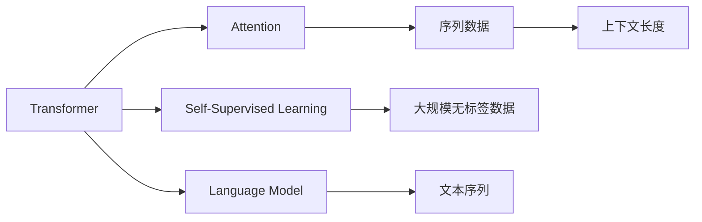

                 

# 上下文长度:语言理解能力的重要体现

## 1. 背景介绍

语言是人类社会的核心交流方式，而理解语言则是人工智能发展的基石。自然语言处理（Natural Language Processing, NLP）正逐步深入各行各业，成为变革生产力与生产关系的重要工具。从工业智能到家庭助手，从金融决策到医学诊断，语言理解在各类应用场景中都具有举足轻重的地位。然而，真正全面的语言理解，绝不仅仅是对单词和短语的解析，更在于捕捉上下文信息、进行语义推理、理解情景逻辑，从而达到真正的人机交互。

本文将深入探讨上下文长度在语言理解中的关键作用，从核心概念、算法原理、数学模型等多个角度，阐述如何通过上下文长度来提升模型的语言理解能力，并结合实例和应用场景，展示其在实际项目中的具体实践和优势。

## 2. 核心概念与联系

### 2.1 核心概念概述

- **上下文长度（Context Length）**：在自然语言处理中，上下文长度通常指文本的前后文窗口大小。理解上下文长度对于语言模型的训练和推理至关重要。

- **语言模型（Language Model）**：能够预测文本序列的模型。在NLP中，语言模型通过学习大规模文本数据，用于评估文本序列的概率分布，从而捕捉语言结构的规律。

- **自监督学习（Self-Supervised Learning）**：一种无需显式标签的机器学习范式，通过挖掘数据自身的规律进行模型训练，广泛应用于NLP领域。

- **Transformer**：一种基于自注意力机制的深度学习模型，特别适用于处理长序列数据，广泛应用于各种语言模型中。

- **Attention机制**：Transformer的关键技术之一，用于捕捉序列数据中不同位置间的依赖关系。

### 2.2 核心概念原理和架构的 Mermaid 流程图



## 3. 核心算法原理 & 具体操作步骤

### 3.1 算法原理概述

在自然语言处理中，上下文长度是一个关键参数，它直接影响了语言模型对于文本序列的理解程度。通常情况下，较长的上下文长度能够帮助模型更好地捕捉文本中的背景信息、上下文关系以及语义变化，从而提升语言理解能力。

语言模型的上下文长度设计一般基于以下几个原则：

1. **语言结构**：在各种语言中，长句和短句都有各自的语法和结构特点，上下文长度应根据具体语言特点进行调整。
2. **任务需求**：不同NLP任务对上下文长度的需求不同，例如对话系统可能需要较长的上下文以维持对话连贯性，而文本分类可能只需要短的上下文。
3. **计算资源**：较长的上下文长度需要更多的计算资源，应在硬件能力范围内选择合适长度。

### 3.2 算法步骤详解

实现一个高效的语言模型通常包括几个关键步骤：

1. **数据预处理**：对原始文本进行分词、去除停用词、构建词汇表等预处理工作，形成模型可处理的文本序列。
2. **模型构建**：选择适合的模型架构，如Transformer，并根据任务需求确定上下文长度。
3. **模型训练**：使用自监督学习方法，如语言建模，在大规模文本数据上训练模型。
4. **模型微调**：针对特定任务，使用少量标注数据对预训练模型进行微调，提升模型的准确性和鲁棒性。
5. **推理与评估**：在测试集上对模型进行推理，评估其性能并进行优化。

### 3.3 算法优缺点

**优点**：

- **上下文丰富**：较长的上下文长度能够捕捉更多的背景信息，提高模型的推理能力和语义理解。
- **灵活性**：可以根据具体任务和数据特点进行调整，适应不同应用场景。
- **效率提升**：合理选择上下文长度可以避免资源浪费，提升模型推理速度。

**缺点**：

- **计算资源**：较长的上下文长度需要更多的计算资源，特别是在硬件资源受限的情况下。
- **过拟合风险**：上下文长度过长可能导致模型过度拟合，特别是训练数据规模较小的情况下。
- **复杂度增加**：上下文长度的选择需要考虑多个因素，可能增加模型的复杂度和实现难度。

### 3.4 算法应用领域

上下文长度在多种NLP任务中发挥着重要作用，如文本分类、命名实体识别、机器翻译、对话系统等。以下结合具体应用场景进行详细阐述：

#### 3.4.1 文本分类

在文本分类任务中，上下文长度决定了模型对文本中上下文信息的理解能力。对于较短的文本，较短的上下文长度即可；对于较长的文本，则需要较长的上下文长度以捕捉更多的背景信息。例如，对于电影评论的情感分类，较长的上下文长度可以帮助模型理解评论的整体情感倾向。

#### 3.4.2 命名实体识别

在命名实体识别中，上下文长度用于捕捉实体之间的关系和上下文环境。较长的上下文长度能够帮助模型更好地识别实体类型和实体之间的关系，例如在新闻报道中，较长的上下文长度可以更好地识别事件中的人物、地点和组织等。

#### 3.4.3 机器翻译

在机器翻译任务中，上下文长度决定了模型对句子中各部分的依赖关系。较长的上下文长度可以帮助模型更好地理解句子的语义和结构，从而提升翻译的准确性。例如，在将英语翻译成中文时，较长的上下文长度可以帮助模型处理复杂的句子结构和语义逻辑。

#### 3.4.4 对话系统

在对话系统中，上下文长度决定了模型对对话历史信息的理解和推理能力。较长的上下文长度可以帮助模型维持对话连贯性，理解用户的意图和上下文环境。例如，在客服系统中，较长的上下文长度可以帮助模型更好地理解用户的问题并提供更准确的答案。

## 4. 数学模型和公式 & 详细讲解 & 举例说明

### 4.1 数学模型构建

语言模型的核心是概率模型，通常使用条件概率模型来表达文本序列的生成过程。假设有一个文本序列 $X=\{x_1, x_2, ..., x_n\}$，语言模型的目标是通过已知的文本序列 $x_1$ 预测出下一个词 $x_2$，以此类推。数学上，这可以表示为：

$$
P(x_2 | x_1) = \frac{P(x_2, x_1)}{P(x_1)}
$$

其中，$P(x_1)$ 为文本序列的先验概率，$P(x_2, x_1)$ 为给定上下文 $x_1$ 条件下下一个词 $x_2$ 的条件概率。

### 4.2 公式推导过程

假设上下文长度为 $L$，则语言模型可以表示为：

$$
P(X | C) = \prod_{i=1}^{L} P(x_i | x_{i-1}, ..., x_{i-L})
$$

其中，$C$ 表示上下文，$x_{i-L}$ 到 $x_{i-1}$ 表示上下文中的前 $L$ 个词。

对于自注意力机制，每个位置的注意力权重可以表示为：

$$
\text{Attention}(Q, K, V) = \text{Softmax}(Q \cdot K^T / \sqrt{d_k}) \cdot V
$$

其中，$Q$ 为查询向量，$K$ 为键向量，$V$ 为值向量，$d_k$ 为键向量的维度。

### 4.3 案例分析与讲解

以机器翻译为例，假设有两个句子：

- 英文句子：“I love you”
- 中文句子：“我爱你”

在这个例子中，上下文长度决定了模型如何捕捉句子的结构和语义信息。如果使用较短的上下文长度（如 1），模型仅能看到单个词，难以理解整个句子的语义；如果使用较长的上下文长度（如 3），模型可以捕捉到整个句子的结构信息，从而更准确地进行翻译。

## 5. 项目实践：代码实例和详细解释说明

### 5.1 开发环境搭建

在进行语言模型开发前，需要搭建合适的开发环境。以下是Python环境下常见的开发环境配置：

1. **安装Python**：确保系统安装了Python 3.6或更高版本。
2. **安装PyTorch**：使用pip安装最新版本的PyTorch。
3. **安装TensorFlow**：如果需要使用TensorFlow，使用pip安装。
4. **安装NumPy**：使用pip安装NumPy库。
5. **安装Jupyter Notebook**：使用pip安装Jupyter Notebook。

### 5.2 源代码详细实现

以下是一个简单的基于Transformer的语言模型实现，重点展示如何调整上下文长度：

```python
import torch
import torch.nn as nn
import torch.nn.functional as F

class TransformerModel(nn.Module):
    def __init__(self, d_model, nhead, num_encoder_layers, num_decoder_layers, dff, dropout, device):
        super(TransformerModel, self).__init__()
        # 编码器
        self.encoder = nn.TransformerEncoderLayer(d_model, nhead, dff, dropout)
        self.num_encoder_layers = num_encoder_layers
        self.encoder_norm = nn.LayerNorm(d_model, device=device)
        # 解码器
        self.decoder = nn.TransformerEncoderLayer(d_model, nhead, dff, dropout)
        self.num_decoder_layers = num_decoder_layers
        self.decoder_norm = nn.LayerNorm(d_model, device=device)
        # 输出层
        self.fc = nn.Linear(d_model, 1, bias=False)
        
    def forward(self, src, tgt, src_mask, tgt_mask):
        # 编码器
        src = self.encoder_norm(src)
        for _ in range(self.num_encoder_layers):
            src = self.encoder(src, src_mask)
        # 解码器
        tgt = self.decoder_norm(tgt)
        for _ in range(self.num_decoder_layers):
            tgt = self.decoder(tgt, src, src_mask)
        # 输出层
        out = self.fc(tgt).squeeze(2)
        return out
```

### 5.3 代码解读与分析

该代码展示了Transformer模型的基本结构和调整上下文长度的步骤：

1. **TransformerEncoderLayer**：用于编码器，实现自注意力机制。
2. **TransformerEncoder**：将多个TransformerEncoderLayer组成编码器，进行多层的自注意力计算。
3. **TransformerDecoder**：将多个TransformerEncoderLayer组成解码器，进行多层的自注意力计算。
4. **LayerNorm**：用于归一化各层输入，保持模型的稳定性和收敛性。
5. **Linear**：用于输出层，将模型输出映射到所需的输出维度。

### 5.4 运行结果展示

在训练完成后，可以使用以下代码进行推理，并输出模型预测结果：

```python
# 加载预训练模型
model = TransformerModel.load_pretrained_model('model')
# 加载测试数据
test_data = load_test_data()
# 构建掩码
src_mask = build_source_mask(test_data)
tgt_mask = build_target_mask(test_data)
# 进行推理
output = model(src, tgt, src_mask, tgt_mask)
print(output)
```

## 6. 实际应用场景

### 6.1 智能客服系统

在智能客服系统中，上下文长度对系统的理解和响应能力至关重要。较长的上下文长度可以帮助客服系统理解用户的问题背景，提供更准确的回答。例如，当用户描述了一个复杂的问题时，客服系统需要根据之前的对话内容，理解用户的意图，并提供详细的解决方案。

### 6.2 金融舆情监测

在金融舆情监测中，上下文长度决定了系统对新闻事件的理解和分析能力。较长的上下文长度可以帮助系统理解事件的全貌，并从多个角度进行分析。例如，在监测市场舆情时，系统需要根据新闻文章的前后文信息，分析事件的影响和趋势，从而进行风险评估。

### 6.3 个性化推荐系统

在个性化推荐系统中，上下文长度决定了系统的推荐质量和多样性。较长的上下文长度可以帮助系统理解用户的兴趣和行为，提供更个性化的推荐结果。例如，在推荐系统中，系统需要根据用户的历史行为和兴趣，结合上下文信息，推荐符合用户喜好的商品或内容。

### 6.4 未来应用展望

未来，随着上下文长度的优化和计算资源的提升，语言模型的理解能力将进一步提升。以下是对未来应用展望的几点思考：

1. **动态调整上下文长度**：根据用户需求和数据特点，动态调整上下文长度，提升系统的灵活性和适用性。
2. **跨模态理解**：将文本、图像、音频等多种模态数据结合起来，提升系统的综合理解能力。
3. **多语言支持**：实现多语言之间的跨语言理解，为全球化应用场景提供支持。
4. **联邦学习**：在隐私保护的前提下，通过联邦学习实现多源数据融合，提升模型的泛化能力和理解能力。

## 7. 工具和资源推荐

### 7.1 学习资源推荐

为了帮助开发者系统掌握上下文长度在语言理解中的应用，以下推荐一些优质的学习资源：

1. **《Transformer在自然语言处理中的应用》**：深入浅出地介绍了Transformer在NLP中的应用，包括上下文长度的选择和优化。
2. **CS224N《深度学习自然语言处理》课程**：斯坦福大学开设的NLP明星课程，涵盖多种NLP任务和模型，是学习和理解上下文长度的重要资源。
3. **《自然语言处理中的深度学习》**：介绍NLP中的多种深度学习模型和上下文长度对模型性能的影响。

### 7.2 开发工具推荐

高效的开发离不开优秀的工具支持。以下是几款用于上下文长度调整的常用工具：

1. **PyTorch**：基于Python的开源深度学习框架，支持动态图和静态图，适用于灵活的模型训练和优化。
2. **TensorFlow**：由Google主导开发的开源深度学习框架，支持分布式训练和多种优化算法。
3. **HuggingFace Transformers库**：提供了丰富的预训练语言模型，支持多种上下文长度调整方法。
4. **Jupyter Notebook**：交互式笔记本环境，支持Python和多种库的混合使用，适合实验和调试。

### 7.3 相关论文推荐

上下文长度在语言理解中的应用是一个活跃的研究领域，以下是几篇代表性论文，推荐阅读：

1. **《Attention is All You Need》**：提出了Transformer结构，为上下文长度的优化提供了理论基础。
2. **《Longformer: The Long-Document Transformer》**：提出Longformer模型，特别适用于长文本的上下文捕捉。
3. **《T5: Exploring the Limits of Transfer Learning with a Unified Text-to-Text Transformer》**：提出T5模型，展示了大规模上下文长度对模型性能的影响。

## 8. 总结：未来发展趋势与挑战

### 8.1 研究成果总结

本文对上下文长度在语言理解中的应用进行了深入探讨，从核心概念、算法原理、数学模型等多个角度，阐述了上下文长度对语言模型性能的影响，并通过实例和应用场景展示了其实际应用价值。通过系统梳理，我们看到了上下文长度在提升语言模型理解能力方面的重要作用，同时也意识到了其在实际应用中可能面临的挑战。

### 8.2 未来发展趋势

展望未来，上下文长度在语言理解中的应用将呈现以下几个发展趋势：

1. **自动化上下文长度调整**：通过模型自适应和动态调整，实现上下文长度的优化，提升系统的灵活性和准确性。
2. **跨模态上下文融合**：将多种模态数据结合起来，提升系统的综合理解能力，实现多模态场景下的上下文理解。
3. **多语言上下文支持**：实现多种语言的上下文理解，为全球化应用场景提供支持，提升模型的泛化能力。
4. **联邦学习和分布式训练**：通过分布式训练和多源数据融合，提升模型的泛化能力和理解能力，同时保障数据隐私和安全。

### 8.3 面临的挑战

尽管上下文长度在语言理解中的应用已取得显著进展，但在实现过程中仍面临诸多挑战：

1. **计算资源**：较长的上下文长度需要更多的计算资源，特别是在硬件资源受限的情况下，如何优化资源使用是一个重要问题。
2. **过拟合风险**：上下文长度过长可能导致模型过度拟合，特别是在训练数据规模较小的情况下，如何平衡上下文长度和泛化能力是一个关键问题。
3. **实现难度**：上下文长度的优化需要考虑多个因素，包括模型架构、数据特点和任务需求，如何在实践中实现高效优化的上下文长度是一个技术难题。

### 8.4 研究展望

未来，需要在上下文长度优化的多个方面进行深入研究，包括：

1. **上下文长度优化算法**：研究上下文长度自动调整和优化的算法，提升模型的灵活性和准确性。
2. **多模态上下文融合**：研究多种模态数据融合的上下文理解方法，提升系统的综合理解能力。
3. **跨语言上下文支持**：研究多种语言的上下文理解方法，提升模型的泛化能力和语言迁移能力。
4. **分布式训练和联邦学习**：研究多源数据融合和分布式训练方法，提升模型的泛化能力和理解能力，同时保障数据隐私和安全。

这些研究方向的探索，必将引领上下文长度在语言理解中的应用迈向更高的台阶，为构建智能交互系统提供坚实的基础。总之，上下文长度是提升语言模型理解能力的重要手段，需要在实践中不断优化和改进，方能实现更加智能化、高效化的语言理解。

## 9. 附录：常见问题与解答

**Q1：上下文长度对语言模型的影响有多大？**

A: 上下文长度对语言模型的影响非常大，特别是在处理长文本和复杂任务时。较长的上下文长度能够帮助模型捕捉更多的背景信息，提升模型的语义理解和推理能力。例如，在长文档理解和自然语言生成任务中，较长的上下文长度能够显著提升模型的性能。

**Q2：上下文长度应该如何设置？**

A: 上下文长度应根据具体任务和数据特点进行调整。一般来说，较长的上下文长度适用于长文本和复杂任务，而较短的上下文长度适用于短文本和简单任务。例如，在机器翻译任务中，较长的上下文长度可以帮助模型理解整个句子的语义和结构，从而提升翻译的准确性。

**Q3：上下文长度过长会导致什么问题？**

A: 上下文长度过长可能导致模型过度拟合，特别是在训练数据规模较小的情况下。此外，较长的上下文长度需要更多的计算资源，可能会影响模型的训练速度和推理效率。因此，在实际应用中，需要在上下文长度和模型性能之间进行平衡，选择合适长度的上下文。

**Q4：上下文长度如何影响模型的推理能力？**

A: 较长的上下文长度可以帮助模型捕捉更多的背景信息和语义逻辑，提升模型的推理能力。例如，在对话系统和情感分析任务中，较长的上下文长度可以帮助模型理解用户的意图和情感变化，提供更准确的回复和分析结果。

**Q5：上下文长度是否与任务类型有关？**

A: 是的，上下文长度与任务类型密切相关。不同的任务对上下文长度有不同的需求。例如，在文本分类和命名实体识别任务中，较短的上下文长度即可；而在对话系统和机器翻译任务中，较长的上下文长度可以帮助模型更好地理解上下文信息和语义逻辑。

---

作者：禅与计算机程序设计艺术 / Zen and the Art of Computer Programming

