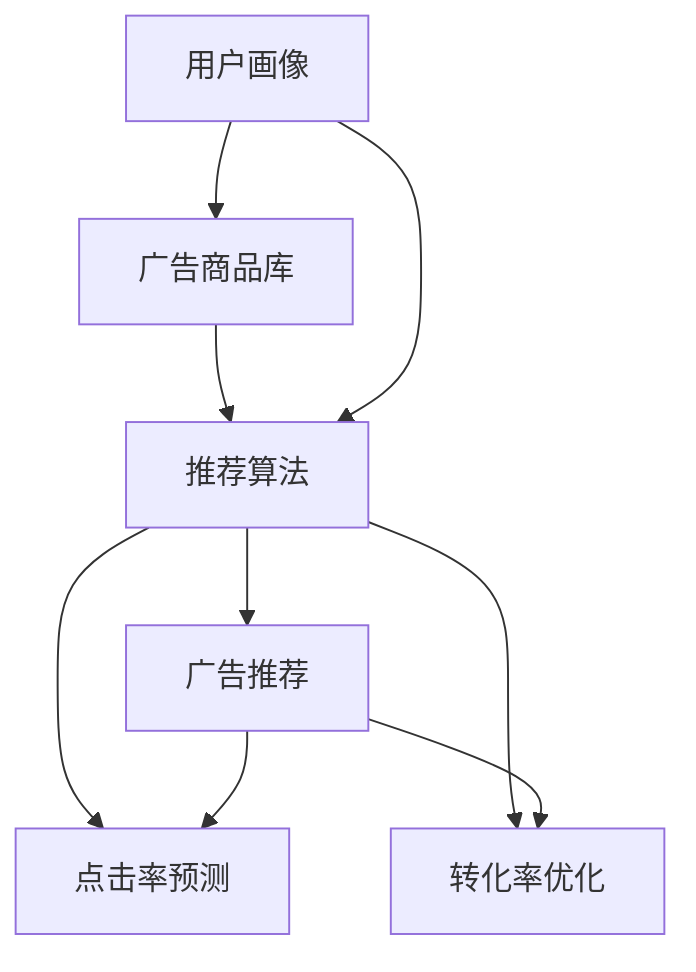

                 

# 个性化广告推荐：大模型的精准定位

> 关键词：个性化广告推荐,大模型,广告投放,用户行为分析,协同过滤,深度学习,点击率预测,转化率优化

## 1. 背景介绍

在互联网时代，广告推荐成为商家获取流量、提升销售的重要手段。传统的基于规则、手工特征工程的推荐算法难以适应快速变化的商业环境，无法精准捕捉用户兴趣变化。而基于机器学习的大模型推荐系统，以其高效、灵活、自适应等特点，成为广告推荐领域的新宠。

本文章将聚焦于基于大模型的个性化广告推荐系统，探讨其核心算法原理、操作步骤、实际应用场景及未来发展趋势。通过对这些关键问题的深入探讨，希望能为广告投放业务提供新的思路，推动行业健康发展。

## 2. 核心概念与联系

### 2.1 核心概念概述

广告推荐系统的工作流程如图1所示。广告推荐系统主要由三个关键组件构成：

1. **用户画像模块**：通过收集用户行为数据，构建用户画像，包括用户的兴趣、偏好、历史行为等特征。

2. **广告商品库**：包括各种商品广告的描述、属性、类别等信息。

3. **推荐算法模块**：结合用户画像和商品库，使用推荐算法预测用户对各广告的兴趣程度，进行广告推荐。


- **用户画像模块**：通过用户行为数据（如浏览历史、点击记录、购买行为等），构建用户的兴趣偏好模型，进行特征提取。

- **广告商品库**：广告商品库包含商品的属性、类别、描述等信息，用于特征工程和相似度计算。

- **推荐算法模块**：基于用户画像和商品库，使用协同过滤、深度学习等算法进行广告推荐，优化广告投放效果。

### 2.2 核心概念原理和架构的 Mermaid 流程图



以上流程图中，用户画像和广告商品库是输入，推荐算法是核心模块，点击率预测和转化率优化是输出。推荐算法通过预测模型和优化模型，结合用户画像和商品库，输出最优广告推荐。

## 3. 核心算法原理 & 具体操作步骤
### 3.1 算法原理概述

基于大模型的个性化广告推荐系统，通常采用协同过滤、深度学习等算法，通过预测用户对各广告的兴趣程度进行推荐。以下是几种常见算法的简介：

1. **协同过滤（Collaborative Filtering）**：通过用户对商品的评分或点击行为，构建用户之间的相似度矩阵，进行推荐。协同过滤算法主要包括基于用户的协同过滤和基于物品的协同过滤两种方式。

2. **深度学习（Deep Learning）**：使用深度神经网络进行特征提取和预测，学习用户和商品之间的隐式特征关系，进行精准推荐。常用的深度学习模型包括基于序列的神经网络（如RNN、LSTM）、基于嵌入的神经网络（如Word2Vec、Doc2Vec）和基于端到端的神经网络（如CNN、DNN）。

3. **点击率预测（Click-Through Rate Prediction）**：通过构建用户行为数据与广告特征之间的关系，使用回归模型或分类模型预测用户点击广告的概率。

4. **转化率优化（Conversion Rate Optimization, CRO）**：结合用户行为数据和广告特征，预测用户完成某一行为（如购买、注册等）的概率，优化广告投放策略。

### 3.2 算法步骤详解

下面是深度学习在大模型个性化广告推荐系统中的应用步骤：

**Step 1: 准备数据**

- 收集用户行为数据：如浏览历史、点击记录、购买行为等，构建用户画像。
- 收集商品广告数据：如商品描述、属性、类别等，构建广告商品库。
- 对数据进行预处理：如去除噪声、标准化、特征工程等。

**Step 2: 选择合适的模型**

- 选择合适的深度学习模型：如DNN、CNN、RNN等，用于特征提取和预测。
- 对模型进行超参数调优：如隐藏层数量、学习率、优化器等，优化模型性能。

**Step 3: 训练模型**

- 将用户画像和广告商品库进行特征编码，转化为模型的输入。
- 使用训练数据对模型进行迭代训练，最小化损失函数，优化模型参数。

**Step 4: 预测推荐**

- 对新用户行为数据进行特征编码，输入模型进行预测。
- 输出模型对各广告的兴趣评分，进行广告推荐。

**Step 5: 结果评估与优化**

- 使用测试数据集评估模型性能：如精确率、召回率、点击率等。
- 根据评估结果优化模型：如调整超参数、重新训练、引入正则化等。

### 3.3 算法优缺点

基于大模型的个性化广告推荐系统有以下优缺点：

**优点**：

1. **高效灵活**：大模型可以处理海量数据，适应多变业务环境，提供高效、灵活的广告推荐。

2. **精准预测**：大模型具备强大的学习能力，可以从数据中提取深层次的特征，提高预测精度。

3. **自适应性**：大模型可以不断学习和优化，适应用户兴趣变化，提高广告推荐效果。

**缺点**：

1. **数据依赖**：大模型需要大量的用户行为数据和商品信息，对数据质量和数量有较高要求。

2. **模型复杂**：大模型的结构复杂，训练和预测成本较高，需要高性能计算资源。

3. **可解释性不足**：大模型难以解释其内部机制和决策过程，用户和广告商难以理解和信任。

4. **隐私保护**：用户行为数据涉及个人隐私，如何保护用户隐私，同时提高广告推荐效果，是亟需解决的问题。

### 3.4 算法应用领域

基于大模型的个性化广告推荐系统，已经在多个领域得到应用，包括但不限于以下几种：

1. **电商推荐**：在电商平台上，通过分析用户浏览和购买行为，推荐用户感兴趣的商品，提升销售额。

2. **内容推荐**：在新闻网站、视频网站等，通过分析用户观看记录和兴趣，推荐相关内容，提升用户体验。

3. **社交媒体推荐**：在社交平台上，通过分析用户互动记录，推荐感兴趣的朋友、文章、广告等，提升平台活跃度。

4. **视频广告推荐**：在视频网站上，通过分析用户观看行为，推荐相关视频广告，提升广告投放效果。

5. **金融推荐**：在金融平台上，通过分析用户投资行为，推荐相关金融产品，提升用户黏性和收益。

## 4. 数学模型和公式 & 详细讲解 & 举例说明

### 4.1 数学模型构建

基于深度学习的个性化广告推荐系统，主要包括以下几个关键模块：

1. **用户行为编码模块**：将用户行为数据转化为向量表示，用于输入模型。

2. **广告商品编码模块**：将广告商品库转化为向量表示，用于输入模型。

3. **广告推荐预测模块**：使用深度神经网络对用户行为和商品广告进行特征编码，进行广告推荐。

### 4.2 公式推导过程

假设用户画像为 $U$，广告商品库为 $I$，深度学习模型为 $F$，广告推荐预测模块为 $P$，推荐函数为 $R$。

用户行为编码模块的公式如下：

$$
X_U = \mathbf{U}^\top \mathbf{D}_u + \mathbf{I}^\top \mathbf{D}_i
$$

其中 $\mathbf{D}_u$ 和 $\mathbf{D}_i$ 分别为用户行为和广告商品的嵌入矩阵。

广告商品编码模块的公式如下：

$$
X_I = \mathbf{I}^\top \mathbf{D}_i
$$

其中 $\mathbf{D}_i$ 为广告商品的嵌入矩阵。

广告推荐预测模块的公式如下：

$$
P = F(X_U, X_I; \theta)
$$

其中 $F$ 为深度神经网络模型，$\theta$ 为模型参数。

推荐函数公式如下：

$$
R = R(P)
$$

其中 $R$ 为推荐函数，用于生成推荐结果。

### 4.3 案例分析与讲解

假设有一家电商平台，使用深度学习模型对用户进行广告推荐。具体步骤如下：

1. 收集用户行为数据：如用户浏览历史、点击记录、购买行为等。

2. 对数据进行预处理：去除噪声、标准化、特征工程等。

3. 构建用户画像：使用协同过滤或深度学习模型，构建用户兴趣模型。

4. 构建广告商品库：收集商品描述、属性、类别等信息，构建广告商品库。

5. 选择合适的深度学习模型：如DNN、CNN等，用于特征提取和预测。

6. 对模型进行超参数调优：如隐藏层数量、学习率、优化器等，优化模型性能。

7. 使用训练数据对模型进行迭代训练，最小化损失函数，优化模型参数。

8. 对新用户行为数据进行特征编码，输入模型进行预测。

9. 输出模型对各广告的兴趣评分，进行广告推荐。

10. 使用测试数据集评估模型性能：如精确率、召回率、点击率等。

11. 根据评估结果优化模型：如调整超参数、重新训练、引入正则化等。

## 5. 项目实践：代码实例和详细解释说明

### 5.1 开发环境搭建

在进行项目实践前，需要先搭建好开发环境。以下是使用Python进行TensorFlow开发的环境配置流程：

1. 安装Anaconda：从官网下载并安装Anaconda，用于创建独立的Python环境。

2. 创建并激活虚拟环境：
```bash
conda create -n tf-env python=3.8 
conda activate tf-env
```

3. 安装TensorFlow：根据CUDA版本，从官网获取对应的安装命令。例如：
```bash
conda install tensorflow=2.6 -c pytorch -c conda-forge
```

4. 安装各类工具包：
```bash
pip install numpy pandas scikit-learn matplotlib tqdm jupyter notebook ipython
```

完成上述步骤后，即可在`tf-env`环境中开始项目实践。

### 5.2 源代码详细实现

下面是使用TensorFlow实现个性化广告推荐系统的示例代码：

```python
import tensorflow as tf
import numpy as np
import pandas as pd

# 构建用户行为数据
user_data = pd.read_csv('user_data.csv')
user_data['behavior'] = [1, 0, 1, 1, 0]

# 构建广告商品库
item_data = pd.read_csv('item_data.csv')
item_data['label'] = [1, 1, 0, 1, 1]

# 构建特征矩阵
user_features = user_data['behavior'].values.reshape(-1, 1)
item_features = item_data['label'].values.reshape(-1, 1)

# 定义模型
model = tf.keras.Sequential([
    tf.keras.layers.Dense(32, activation='relu'),
    tf.keras.layers.Dense(16, activation='relu'),
    tf.keras.layers.Dense(1, activation='sigmoid')
])

# 编译模型
model.compile(optimizer='adam', loss='binary_crossentropy', metrics=['accuracy'])

# 训练模型
model.fit(user_features, item_features, epochs=10, batch_size=16, validation_split=0.2)

# 预测推荐
new_user_data = pd.read_csv('new_user_data.csv')
new_user_features = new_user_data['behavior'].values.reshape(-1, 1)
predictions = model.predict(new_user_features)
```

以上代码示例中，我们使用了TensorFlow框架，构建了一个包含两个隐藏层的深度神经网络模型。通过训练模型，预测新用户对各广告商品的兴趣评分，进行广告推荐。

### 5.3 代码解读与分析

让我们再详细解读一下关键代码的实现细节：

**构建用户行为数据**：
```python
user_data = pd.read_csv('user_data.csv')
user_data['behavior'] = [1, 0, 1, 1, 0]
```

从CSV文件中读取用户行为数据，将用户行为标签（如点击、未点击）转化为向量表示，用于输入模型。

**构建广告商品库**：
```python
item_data = pd.read_csv('item_data.csv')
item_data['label'] = [1, 1, 0, 1, 1]
```

从CSV文件中读取广告商品库数据，将广告商品标签（如感兴趣、不感兴趣）转化为向量表示，用于输入模型。

**定义模型**：
```python
model = tf.keras.Sequential([
    tf.keras.layers.Dense(32, activation='relu'),
    tf.keras.layers.Dense(16, activation='relu'),
    tf.keras.layers.Dense(1, activation='sigmoid')
])
```

定义一个包含两个隐藏层的深度神经网络模型，最后一层使用sigmoid激活函数，输出0-1之间的概率值。

**编译模型**：
```python
model.compile(optimizer='adam', loss='binary_crossentropy', metrics=['accuracy'])
```

编译模型，使用Adam优化器，二元交叉熵损失函数，输出准确率作为评估指标。

**训练模型**：
```python
model.fit(user_features, item_features, epochs=10, batch_size=16, validation_split=0.2)
```

使用训练数据对模型进行迭代训练，最小化损失函数，优化模型参数。

**预测推荐**：
```python
new_user_data = pd.read_csv('new_user_data.csv')
new_user_features = new_user_data['behavior'].values.reshape(-1, 1)
predictions = model.predict(new_user_features)
```

对新用户行为数据进行特征编码，输入模型进行预测，输出模型对各广告商品的兴趣评分，进行广告推荐。

## 6. 实际应用场景

### 6.1 电商推荐

基于大模型的个性化广告推荐系统，在电商推荐领域有广泛应用。电商推荐系统通常由用户画像、广告商品库、推荐算法等组件构成。用户画像模块通过分析用户浏览、点击、购买行为，构建用户兴趣模型。广告商品库包含各种商品广告的描述、属性、类别等信息。推荐算法模块通过协同过滤或深度学习算法，对用户行为和商品广告进行特征编码，预测用户对各广告的兴趣程度，进行广告推荐。

电商推荐系统的实际应用场景包括：

1. **商品推荐**：根据用户浏览和购买历史，推荐用户感兴趣的商品，提升用户体验。

2. **活动推荐**：根据用户行为数据，推荐用户感兴趣的活动或优惠券，提高用户参与度。

3. **新商品推荐**：推荐用户可能感兴趣的新商品，增加平台销售额。

### 6.2 内容推荐

基于大模型的个性化广告推荐系统，在内容推荐领域也有广泛应用。内容推荐系统通常由用户画像、广告商品库、推荐算法等组件构成。用户画像模块通过分析用户观看记录、互动行为等，构建用户兴趣模型。广告商品库包含各种内容广告的描述、类别等信息。推荐算法模块通过协同过滤或深度学习算法，对用户行为和内容广告进行特征编码，预测用户对各内容的兴趣程度，进行内容推荐。

内容推荐系统的实际应用场景包括：

1. **视频推荐**：根据用户观看记录，推荐用户感兴趣的视频内容，提高视频平台的用户黏性。

2. **新闻推荐**：根据用户阅读行为，推荐用户感兴趣的新闻内容，提升新闻平台的用户参与度。

3. **音频推荐**：根据用户听歌记录，推荐用户感兴趣的音乐内容，提升音频平台的用户黏性。

### 6.3 社交媒体推荐

基于大模型的个性化广告推荐系统，在社交媒体推荐领域也有广泛应用。社交媒体推荐系统通常由用户画像、广告商品库、推荐算法等组件构成。用户画像模块通过分析用户互动记录、关注行为等，构建用户兴趣模型。广告商品库包含各种社交媒体广告的描述、类别等信息。推荐算法模块通过协同过滤或深度学习算法，对用户行为和社交媒体广告进行特征编码，预测用户对各广告的兴趣程度，进行广告推荐。

社交媒体推荐系统的实际应用场景包括：

1. **好友推荐**：根据用户关注行为，推荐用户感兴趣的朋友，提高社交平台的用户黏性。

2. **文章推荐**：根据用户阅读行为，推荐用户感兴趣的文章内容，提升内容平台的用户参与度。

3. **广告推荐**：推荐用户可能感兴趣的品牌或产品，增加广告平台的用户点击率和转化率。

### 6.4 视频广告推荐

基于大模型的个性化广告推荐系统，在视频广告推荐领域也有广泛应用。视频广告推荐系统通常由用户画像、广告商品库、推荐算法等组件构成。用户画像模块通过分析用户观看行为，构建用户兴趣模型。广告商品库包含各种视频广告的描述、类别等信息。推荐算法模块通过协同过滤或深度学习算法，对用户行为和视频广告进行特征编码，预测用户对各广告的兴趣程度，进行广告推荐。

视频广告推荐系统的实际应用场景包括：

1. **视频广告推荐**：根据用户观看记录，推荐用户感兴趣的视频广告，提高广告平台的用户点击率和转化率。

2. **品牌推荐**：推荐用户感兴趣的品牌，增加品牌曝光度和用户黏性。

3. **产品推荐**：推荐用户感兴趣的产品，增加电商平台的销售额。

## 7. 工具和资源推荐

### 7.1 学习资源推荐

为了帮助开发者系统掌握个性化广告推荐系统的理论基础和实践技巧，这里推荐一些优质的学习资源：

1. **《深度学习推荐系统》**：本书详细介绍了推荐系统的经典算法和深度学习技术，包括协同过滤、深度学习、点击率预测、转化率优化等。

2. **《广告推荐系统》**：本书系统讲解了广告推荐系统的设计原理、算法实现和优化策略，适合广告从业者阅读。

3. **《TensorFlow实战》**：本书介绍了TensorFlow框架的深度学习应用，包括广告推荐系统的实现和优化。

4. **Coursera《推荐系统》课程**：斯坦福大学开设的推荐系统课程，介绍了推荐系统的理论和算法，适合学习者系统掌握推荐系统知识。

5. **Kaggle广告推荐竞赛**：Kaggle举办的多场广告推荐竞赛，可以提供实际案例和模型优化思路，适合实战练习。

通过对这些资源的学习实践，相信你一定能够快速掌握个性化广告推荐系统的精髓，并用于解决实际的广告投放问题。

### 7.2 开发工具推荐

高效的开发离不开优秀的工具支持。以下是几款用于广告推荐系统开发的常用工具：

1. **TensorFlow**：由Google主导开发的开源深度学习框架，生产部署方便，适合大规模工程应用。

2. **PyTorch**：基于Python的开源深度学习框架，灵活动态的计算图，适合快速迭代研究。

3. **Keras**：由Google主导开发的深度学习框架，接口简洁易用，适合初学者快速上手。

4. **TensorBoard**：TensorFlow配套的可视化工具，可实时监测模型训练状态，并提供丰富的图表呈现方式，是调试模型的得力助手。

5. **Weights & Biases**：模型训练的实验跟踪工具，可以记录和可视化模型训练过程中的各项指标，方便对比和调优。

合理利用这些工具，可以显著提升广告推荐系统的开发效率，加快创新迭代的步伐。

### 7.3 相关论文推荐

广告推荐系统的发展源于学界的持续研究。以下是几篇奠基性的相关论文，推荐阅读：

1. **《基于协同过滤的个性化推荐系统》**：文章介绍了协同过滤算法的原理和实现，详细讲解了基于用户的协同过滤和基于物品的协同过滤。

2. **《深度学习在广告推荐中的应用》**：文章介绍了深度学习在广告推荐系统中的应用，包括DNN、CNN等模型的实现和优化。

3. **《点击率预测模型的构建与优化》**：文章介绍了点击率预测模型的构建和优化，包括线性回归、决策树、神经网络等模型的实现。

4. **《广告推荐系统中的特征工程》**：文章详细讲解了广告推荐系统中的特征工程方法，包括用户行为特征、商品广告特征等。

5. **《广告推荐系统的评估与优化》**：文章介绍了广告推荐系统的评估指标和优化策略，包括精确率、召回率、点击率等。

这些论文代表了大模型广告推荐技术的发展脉络。通过学习这些前沿成果，可以帮助研究者把握学科前进方向，激发更多的创新灵感。

## 8. 总结：未来发展趋势与挑战

### 8.1 总结

本文对基于大模型的个性化广告推荐系统进行了全面系统的介绍。首先阐述了广告推荐系统的核心算法原理和工作流程，明确了推荐系统在广告投放业务中的重要性。其次，从原理到实践，详细讲解了广告推荐系统的数学模型和代码实现，给出了广告推荐系统的完整开发流程。同时，本文还广泛探讨了广告推荐系统在电商、内容、社交媒体等多个领域的应用前景，展示了广告推荐系统的广阔发展空间。

通过本文的系统梳理，可以看到，基于大模型的个性化广告推荐系统已经在广告投放业务中取得了显著的成效，成为广告推荐领域的重要范式。大模型在广告推荐中展现出了高效、灵活、自适应的特点，为广告投放业务提供了新的思路，推动了行业健康发展。未来，伴随大模型的不断演进，广告推荐系统必将在广告投放中发挥更大的作用，为商家带来更多的流量和收益。

### 8.2 未来发展趋势

展望未来，基于大模型的个性化广告推荐系统将呈现以下几个发展趋势：

1. **模型规模持续增大**：随着算力成本的下降和数据规模的扩张，广告推荐系统的模型规模还将持续增长。超大模型将带来更加丰富的广告投放效果，提升广告推荐精度和覆盖面。

2. **算法多样性增强**：除了传统的协同过滤和深度学习算法，未来将涌现更多算法，如知识图谱推荐、基于社交网络的推荐等，拓展广告推荐系统的应用场景。

3. **实时性提升**：广告推荐系统将具备更加实时化的特征提取和预测能力，根据用户实时行为数据进行动态推荐，提升广告投放效果。

4. **用户隐私保护加强**：伴随数据隐私保护意识的增强，广告推荐系统将更加注重用户隐私保护，采用匿名化、差分隐私等技术手段，保护用户隐私。

5. **个性化程度提高**：广告推荐系统将更加精准地捕捉用户兴趣变化，采用个性化推荐算法，提升广告投放效果。

6. **广告效果评估改进**：广告推荐系统将采用更加全面、客观的评估指标，如用户行为预测误差、广告点击率等，优化广告投放效果。

### 8.3 面临的挑战

尽管基于大模型的个性化广告推荐系统已经取得了瞩目成就，但在迈向更加智能化、普适化应用的过程中，它仍面临着诸多挑战：

1. **数据隐私保护**：用户行为数据涉及个人隐私，如何保护用户隐私，同时提高广告推荐效果，是亟需解决的问题。

2. **算法复杂度**：大模型结构复杂，训练和预测成本较高，如何提高模型效率，优化推荐算法，是亟需解决的问题。

3. **模型可解释性不足**：大模型难以解释其内部机制和决策过程，用户和广告商难以理解和信任。

4. **广告点击率和转化率不稳定**：广告推荐系统的效果受到用户行为数据和广告商品库的影响，如何提高广告点击率和转化率，是亟需解决的问题。

5. **广告投放效果评估**：广告推荐系统的评估指标复杂多样，如何制定统一的评估标准，优化广告投放效果，是亟需解决的问题。

6. **广告投放预算控制**：广告推荐系统的投放预算有限，如何合理分配预算，优化广告投放效果，是亟需解决的问题。

### 8.4 研究展望

面对广告推荐系统所面临的挑战，未来的研究需要在以下几个方面寻求新的突破：

1. **多模态广告推荐**：结合图像、视频、文本等多模态数据，提升广告推荐系统的感知能力和推荐效果。

2. **跨领域广告推荐**：将广告推荐系统应用于不同领域，如医疗、金融等，拓展广告推荐系统的应用场景。

3. **知识图谱广告推荐**：结合知识图谱和深度学习技术，提升广告推荐系统的推荐效果和用户信任度。

4. **实时广告推荐**：结合实时数据流处理技术，提升广告推荐系统的实时性和精准度。

5. **个性化广告推荐**：采用更加精准的个性化推荐算法，提升广告推荐系统的用户黏性和投放效果。

6. **广告投放预算优化**：结合强化学习、博弈论等方法，优化广告投放预算分配，提升广告推荐系统的投放效果。

这些研究方向的探索，必将引领广告推荐系统迈向更高的台阶，为广告投放业务带来更多的创新和突破。面向未来，广告推荐系统还需要与其他人工智能技术进行更深入的融合，如知识表示、因果推理、强化学习等，多路径协同发力，共同推动广告推荐系统的发展。只有勇于创新、敢于突破，才能不断拓展广告推荐系统的边界，让广告投放业务迈向更加智能、高效、普适化。

## 9. 附录：常见问题与解答

**Q1：广告推荐系统的核心算法是什么？**

A: 广告推荐系统的核心算法主要有协同过滤和深度学习两种。协同过滤算法通过构建用户之间和商品之间的相似度矩阵，进行推荐。深度学习算法通过构建神经网络模型，学习用户和商品之间的隐式特征关系，进行推荐。

**Q2：如何选择合适的广告推荐系统算法？**

A: 选择合适的广告推荐系统算法需要根据具体业务场景和数据特点进行综合评估。一般而言，协同过滤适用于数据量较小的场景，深度学习适用于数据量较大的场景。需要根据实际数据量和计算资源，选择适合的算法。

**Q3：广告推荐系统如何保护用户隐私？**

A: 广告推荐系统保护用户隐私的方法包括数据匿名化、差分隐私、数据加密等。数据匿名化是将用户标识信息去除，保护用户隐私。差分隐私是对数据进行扰动，保护用户隐私。数据加密是对数据进行加密存储和传输，保护用户隐私。

**Q4：广告推荐系统如何优化广告投放效果？**

A: 广告推荐系统优化广告投放效果的方法包括模型调参、特征工程、数据增强等。模型调参是通过调整模型参数，优化模型性能。特征工程是通过提取和筛选关键特征，提升模型效果。数据增强是通过增加数据量和数据多样性，提升模型泛化能力。

**Q5：广告推荐系统如何提高实时性？**

A: 广告推荐系统提高实时性的方法包括使用流式处理技术、缓存推荐结果、优化算法等。流式处理技术可以实时处理数据流，提升推荐系统实时性。缓存推荐结果可以将推荐结果缓存起来，减少重复计算。优化算法可以提升模型推理速度，减少计算时间。

通过对这些问题的解答，相信读者对广告推荐系统的理论和实践有了更全面的理解，可以在实际应用中更加高效地开发和优化广告推荐系统。

