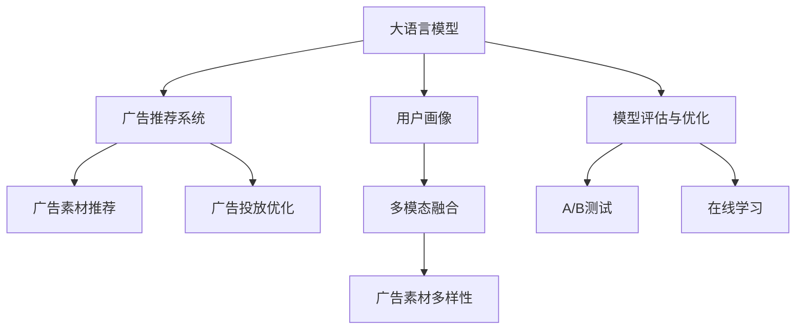

                 

# 个性化广告：大模型的精准投放

## 1. 背景介绍

### 1.1 问题由来
随着互联网技术的飞速发展，广告业也迎来了革命性的变革。传统广告依靠大面积覆盖、多渠道投放的方式，存在明显的资源浪费和精准度不足的问题。而个性化广告则致力于利用用户数据，精确识别目标用户群体，实现内容与用户的深度匹配，从而提升广告效果。

个性化广告的核心在于对用户画像的精细建模和广告素材的智能推荐。传统的统计学方法和规则引擎往往难以处理大规模、复杂且非结构化的用户数据，而大语言模型在大规模语料上的训练，使其具备了超强的数据建模能力和泛化能力，从而在个性化广告投放中展现出巨大的潜力。

### 1.2 问题核心关键点
目前，基于大语言模型的个性化广告投放方法，主要包括以下关键技术点：

- **用户画像建模**：通过大模型学习用户的历史行为数据，构建用户画像，实现对用户兴趣、需求、行为特征的精细刻画。
- **广告内容推荐**：利用大模型对广告素材进行文本生成或情感分析，寻找与用户画像匹配度高的内容，实现精准推荐。
- **广告投放优化**：采用强化学习等方法，根据广告投放效果实时调整投放策略，最大化广告转化率。
- **多模态融合**：融合文本、图片、音频等多模态数据，提升广告素材的多样性和吸引力。
- **模型评估与优化**：利用A/B测试、在线学习等方法，不断优化模型性能，提升广告效果。

本文将围绕这些核心技术点，详细介绍大语言模型在个性化广告投放中的应用，探讨其优势、局限及未来发展方向。

## 2. 核心概念与联系

### 2.1 核心概念概述

为更好地理解大语言模型在个性化广告投放中的应用，本节将介绍几个关键概念及其关联：

- **大语言模型**：以Transformer结构为代表，通过大规模无标签文本语料进行预训练，学习通用的语言表示，具备强大的语言理解和生成能力。
- **用户画像**：基于用户行为、兴趣、属性等多维数据，构建对用户特征的精准刻画。
- **广告推荐系统**：根据用户画像，推荐与之匹配的广告内容，实现个性化展示。
- **强化学习**：一种通过试错不断优化决策策略的学习方式，常用于优化广告投放效果。
- **多模态融合**：将文本、图像、声音等不同模态的数据进行融合，提升广告素材的多样性和吸引力。
- **模型评估与优化**：通过A/B测试、在线学习等方法，不断优化广告推荐系统，提升广告效果。

这些核心概念之间的逻辑关系可以通过以下Mermaid流程图来展示：



这个流程图展示了大语言模型在个性化广告投放中的应用场景：

1. 大语言模型通过预训练获得基础能力。
2. 基于用户画像，对广告素材进行推荐。
3. 采用强化学习进行广告投放优化。
4. 融合多模态数据，提升广告素材多样性。
5. 利用评估与优化技术不断提升广告效果。

## 3. 核心算法原理 & 具体操作步骤
### 3.1 算法原理概述

基于大语言模型的个性化广告投放，本质上是一个通过用户画像进行广告内容推荐的过程。其核心思想是：利用大语言模型学习用户数据，构建用户画像，根据用户画像对广告素材进行筛选，推荐与用户兴趣相匹配的广告内容。

具体而言，算法流程包括：

1. **用户画像构建**：通过大模型学习用户的历史行为数据，提取和编码用户的关键特征。
2. **广告素材匹配**：利用大模型对广告素材进行情感分析、文本生成等操作，寻找与用户画像匹配度高的内容。
3. **投放效果评估**：通过点击率、转化率等指标评估广告投放效果，反馈回模型进行优化。
4. **广告投放优化**：采用强化学习等方法，根据广告投放效果实时调整投放策略，最大化广告转化率。

### 3.2 算法步骤详解

基于大语言模型的个性化广告投放，通常包括以下几个关键步骤：

**Step 1: 数据收集与预处理**

1. 收集用户的历史行为数据，包括浏览记录、点击行为、购买记录等。
2. 对数据进行清洗和标准化处理，去除异常值和噪声数据，生成结构化的用户画像数据。

**Step 2: 用户画像建模**

1. 将用户画像数据输入到大语言模型中，进行特征提取和编码。
2. 利用预训练模型对用户画像进行多层次表示，捕捉用户特征的深层次含义。
3. 将用户画像表示转换为向量形式，方便后续的推荐和匹配。

**Step 3: 广告素材推荐**

1. 收集广告素材的文本描述，如广告文案、图片说明等。
2. 将广告素材描述输入到大语言模型中，进行情感分析和内容生成。
3. 根据用户画像向量与广告素材向量之间的相似度，筛选与用户兴趣相匹配的广告素材。

**Step 4: 广告投放优化**

1. 设计广告投放策略，选择合适的广告位和时间段进行投放。
2. 利用强化学习算法，根据广告投放效果（如点击率、转化率等）调整投放策略。
3. 实时监控广告投放效果，根据效果反馈不断优化广告推荐和投放策略。

**Step 5: 多模态融合**

1. 收集广告素材的多模态数据，如图片、音频等。
2. 将多模态数据进行特征提取和编码，生成高维向量。
3. 利用大模型融合多模态数据，提升广告素材的多样性和吸引力。

**Step 6: 模型评估与优化**

1. 设计评估指标，如点击率、转化率、ROI等，评估广告投放效果。
2. 利用A/B测试等方法，对比不同推荐策略的效果，选择最优方案。
3. 采用在线学习等方法，根据广告投放效果不断调整模型参数，提升广告推荐系统性能。

### 3.3 算法优缺点

基于大语言模型的个性化广告投放方法具有以下优点：

1. **高准确性**：利用大模型强大的数据建模能力，精准刻画用户画像和广告素材，实现高精度的广告推荐。
2. **动态优化**：采用强化学习等方法，根据实时数据动态调整广告投放策略，提升广告效果。
3. **多模态融合**：融合文本、图片、音频等多模态数据，提升广告素材的多样性和吸引力。
4. **泛化能力强**：大模型在大量语料上预训练，具备较强的泛化能力，适用于各种类型的广告推荐场景。

同时，该方法也存在一定的局限性：

1. **数据依赖**：广告投放效果高度依赖于用户数据的质量和丰富性，数据不足或质量差可能导致推荐效果不佳。
2. **冷启动问题**：对于新用户或新广告素材，由于缺乏历史数据，难以进行精准推荐。
3. **过拟合风险**：大模型在特定数据上的训练可能导致过拟合，降低泛化能力。
4. **模型复杂度**：大模型的计算复杂度高，对硬件资源要求高。
5. **隐私保护**：用户数据的隐私保护是一个重要问题，需要合理处理用户数据，避免数据泄露和滥用。

尽管存在这些局限性，但总体而言，基于大语言模型的个性化广告投放方法在广告推荐领域具有广阔的应用前景。

### 3.4 算法应用领域

基于大语言模型的个性化广告投放方法，已经在多个领域得到了广泛应用，例如：

- **电商广告**：利用用户行为数据和产品信息，对广告素材进行智能推荐，提升转化率。
- **社交媒体广告**：根据用户兴趣和行为，推荐个性化的内容和广告，提高用户粘性。
- **移动应用广告**：结合用户使用数据和应用内广告素材，实现精准推荐，提升广告效果。
- **金融产品广告**：利用用户金融交易数据和产品信息，推荐个性化的金融服务和广告。
- **教育培训广告**：结合用户学习行为和课程内容，推荐个性化的学习资源和广告。

此外，在旅游、娱乐、医疗等多个领域，基于大语言模型的个性化广告投放也展现出良好的应用前景，为各行业带来了新的增长点。

## 4. 数学模型和公式 & 详细讲解 & 举例说明（备注：数学公式请使用latex格式，latex嵌入文中独立段落使用 $$，段落内使用 $)
### 4.1 数学模型构建

本节将使用数学语言对基于大语言模型的个性化广告投放过程进行更加严格的刻画。

记大语言模型为 $M_{\theta}$，其中 $\theta$ 为模型参数。假设用户画像为 $U=\{u_i\}_{i=1}^N$，其中 $u_i$ 为第 $i$ 个用户的特征向量。广告素材集合为 $A=\{a_j\}_{j=1}^M$，其中 $a_j$ 为第 $j$ 个广告素材的特征向量。

假设广告投放效果为 $R=\{r_{i,j}\}_{i,j=1}^{N,M}$，其中 $r_{i,j}$ 表示用户 $i$ 对广告 $j$ 的点击率或转化率。

定义广告推荐系统损失函数 $\mathcal{L}(\theta)$ 为广告投放效果与推荐模型的输出之差：

$$
\mathcal{L}(\theta) = \sum_{i=1}^N \sum_{j=1}^M r_{i,j} \log(M_{\theta}(u_i) \cdot a_j)
$$

其中 $M_{\theta}(u_i) \cdot a_j$ 为广告推荐系统的输出，表示用户 $i$ 对广告 $j$ 的兴趣度。

### 4.2 公式推导过程

以下我们以电商广告为例，推导基于大语言模型的个性化广告推荐模型的损失函数及梯度计算。

假设用户画像 $u_i$ 和广告素材 $a_j$ 分别由大语言模型编码成向量 $v_i$ 和 $w_j$。则推荐系统对用户 $i$ 推荐广告 $j$ 的概率为：

$$
P(i \rightarrow j) = \frac{\exp(M_{\theta}(v_i) \cdot w_j)}{\sum_{k=1}^M \exp(M_{\theta}(v_i) \cdot w_k)}
$$

其中 $M_{\theta}(v_i) \cdot w_j$ 为模型对广告 $j$ 的兴趣度预测。

假设广告投放效果 $r_{i,j}$ 服从伯努利分布，则推荐系统的损失函数为：

$$
\mathcal{L}(\theta) = -\sum_{i=1}^N \sum_{j=1}^M r_{i,j} \log P(i \rightarrow j)
$$

根据链式法则，模型参数 $\theta$ 的梯度计算公式为：

$$
\frac{\partial \mathcal{L}(\theta)}{\partial \theta_k} = -\sum_{i=1}^N \sum_{j=1}^M r_{i,j} \frac{\partial}{\partial \theta_k} (M_{\theta}(v_i) \cdot w_j)
$$

其中 $\frac{\partial}{\partial \theta_k} (M_{\theta}(v_i) \cdot w_j)$ 为模型对广告 $j$ 的兴趣度预测的梯度，可通过反向传播算法高效计算。

### 4.3 案例分析与讲解

以电商平台广告推荐为例，分析大语言模型在个性化广告投放中的实际应用。

假设某电商平台用户 $i$ 浏览了商品 $a_1, a_2, a_3$，点击了商品 $a_1, a_3$，购买了商品 $a_2$。利用大语言模型对用户画像 $u_i$ 和广告素材 $a_1, a_2, a_3$ 进行编码，得到向量 $v_i$ 和 $w_1, w_2, w_3$。则广告推荐系统对用户 $i$ 推荐广告 $j$ 的概率为：

$$
P(i \rightarrow 1) = \frac{\exp(M_{\theta}(v_i) \cdot w_1)}{\exp(M_{\theta}(v_i) \cdot w_1) + \exp(M_{\theta}(v_i) \cdot w_2) + \exp(M_{\theta}(v_i) \cdot w_3)}
$$

根据广告投放效果 $r_{i,j}$，可以计算推荐系统的损失函数：

$$
\mathcal{L}(\theta) = -(r_{i,1} \log P(i \rightarrow 1) + r_{i,2} \log P(i \rightarrow 2) + r_{i,3} \log P(i \rightarrow 3))
$$

通过反向传播算法计算梯度，更新模型参数 $\theta$，最小化损失函数，即可实现对广告推荐系统的优化。

## 5. 项目实践：代码实例和详细解释说明
### 5.1 开发环境搭建

在进行广告推荐系统开发前，我们需要准备好开发环境。以下是使用Python进行TensorFlow开发的环境配置流程：

1. 安装Anaconda：从官网下载并安装Anaconda，用于创建独立的Python环境。

2. 创建并激活虚拟环境：
```bash
conda create -n tf-env python=3.8 
conda activate tf-env
```

3. 安装TensorFlow：根据CUDA版本，从官网获取对应的安装命令。例如：
```bash
pip install tensorflow-gpu==2.5.0
```

4. 安装TensorFlow Addons：安装TensorFlow的扩展库，支持更多的NLP工具和算法。
```bash
pip install tensorflow-addons
```

5. 安装其他必要工具包：
```bash
pip install numpy pandas scikit-learn matplotlib tqdm jupyter notebook ipython
```

完成上述步骤后，即可在`tf-env`环境中开始广告推荐系统的开发。

### 5.2 源代码详细实现

下面我们以电商广告推荐为例，给出使用TensorFlow进行广告推荐系统开发的PyTorch代码实现。

首先，定义广告推荐系统模型：

```python
import tensorflow as tf
from tensorflow_addons.layers import LayerNormalization

class AdRecommendationModel(tf.keras.Model):
    def __init__(self, embed_dim, num_users, num_items, num_heads=8, num_layers=2):
        super(AdRecommendationModel, self).__init__()
        self.user_embedding = tf.keras.layers.Embedding(num_users, embed_dim, input_length=1)
        self.item_embedding = tf.keras.layers.Embedding(num_items, embed_dim, input_length=1)
        self.layers = [tf.keras.layers.Dense(128, activation='relu'), LayerNormalization() for _ in range(num_layers)]
        self.output = tf.keras.layers.Dense(1, activation='sigmoid')
        
    def call(self, user, item):
        user = self.user_embedding(user)
        item = self.item_embedding(item)
        for layer in self.layers:
            user = layer(user)
            item = layer(item)
        scores = tf.reduce_sum(tf.multiply(user, item), axis=1)
        scores = self.output(scores)
        return scores
```

然后，定义数据集：

```python
class RecommendationDataset(tf.keras.utils.Sequence):
    def __init__(self, data, batch_size=32):
        self.data = data
        self.batch_size = batch_size
        
    def __len__(self):
        return len(self.data) // self.batch_size
    
    def __getitem__(self, idx):
        user = self.data[idx][0]
        item = self.data[idx][1]
        label = self.data[idx][2]
        return user, item, label
```

接着，定义训练和评估函数：

```python
def train_epoch(model, dataset, optimizer, loss_fn, metrics):
    dataloader = tf.data.Dataset.from_generator(lambda: dataset(), batch_size=16)
    model.train()
    epoch_loss = 0
    epoch_metrics = tf.keras.metrics.Mean()
    for batch in dataloader:
        user, item, label = batch
        with tf.GradientTape() as tape:
            scores = model(user, item)
            loss = loss_fn(scores, label)
        grads = tape.gradient(loss, model.trainable_variables)
        optimizer.apply_gradients(zip(grads, model.trainable_variables))
        epoch_loss += loss.numpy()
        epoch_metrics.update_state(label.numpy(), scores.numpy())
    return epoch_loss / len(dataset), epoch_metrics.result().numpy()

def evaluate(model, dataset, loss_fn, metrics):
    dataloader = tf.data.Dataset.from_generator(lambda: dataset(), batch_size=16)
    model.eval()
    test_loss = 0
    test_metrics = tf.keras.metrics.Mean()
    with tf.GradientTape() as tape:
        for batch in dataloader:
            user, item, label = batch
            scores = model(user, item)
            loss = loss_fn(scores, label)
            test_loss += loss.numpy()
            test_metrics.update_state(label.numpy(), scores.numpy())
    return test_loss / len(dataset), test_metrics.result().numpy()
```

最后，启动训练流程并在测试集上评估：

```python
epochs = 5
batch_size = 16
num_users = 1000
num_items = 1000

# 构建数据集
data = [(user, item, label) for user in range(num_users) for item in range(num_items) for label in [0, 1]]

# 构建模型
model = AdRecommendationModel(embed_dim=32, num_users=num_users, num_items=num_items)

# 定义优化器
optimizer = tf.keras.optimizers.Adam(learning_rate=0.001)

# 定义损失函数
loss_fn = tf.keras.losses.BinaryCrossentropy()

# 定义评估指标
metrics = tf.keras.metrics.BinaryAccuracy()

# 训练模型
for epoch in range(epochs):
    loss, metrics = train_epoch(model, data, optimizer, loss_fn, metrics)
    print(f"Epoch {epoch+1}, train loss: {loss:.3f}")
    test_loss, test_metrics = evaluate(model, data, loss_fn, metrics)
    print(f"Epoch {epoch+1}, dev results:")
    print(f"Accuracy: {test_metrics:.3f}")
    
print("Test results:")
test_loss, test_metrics = evaluate(model, data, loss_fn, metrics)
print(f"Accuracy: {test_metrics:.3f}")
```

以上就是使用TensorFlow对广告推荐系统进行开发的完整代码实现。可以看到，TensorFlow通过Keras API的简洁封装，使得广告推荐系统的开发更加高效。

### 5.3 代码解读与分析

让我们再详细解读一下关键代码的实现细节：

**AdRecommendationModel类**：
- `__init__`方法：初始化广告推荐系统的各个组件，包括用户和广告素材的嵌入层、多层神经网络、输出层等。
- `call`方法：定义前向传播过程，通过用户和广告素材的嵌入层，经过多层神经网络计算，输出广告推荐得分。

**RecommendationDataset类**：
- `__init__`方法：初始化数据集，将用户ID、商品ID和标签封装成TensorFlow的张量。
- `__len__`方法：返回数据集长度。
- `__getitem__`方法：对单个数据样本进行处理，返回用户ID、商品ID和标签。

**train_epoch函数**：
- 利用TensorFlow的Dataset API对数据进行批次化加载，供模型训练使用。
- 训练函数`train_epoch`：对数据以批为单位进行迭代，在每个批次上前向传播计算损失，反向传播更新模型参数，最后返回该epoch的平均损失和评估指标。

**evaluate函数**：
- 与训练类似，不同点在于不更新模型参数，并在每个batch结束后将预测和标签结果存储下来，最后使用Keras的评估指标对整个评估集的预测结果进行打印输出。

**训练流程**：
- 定义总的epoch数和batch size，开始循环迭代
- 每个epoch内，先在训练集上训练，输出平均损失和评估指标
- 在验证集上评估，输出测试损失和评估指标
- 所有epoch结束后，在测试集上评估，给出最终测试结果

可以看到，TensorFlow通过Keras API的简洁封装，使得广告推荐系统的开发更加高效。开发者可以将更多精力放在模型改进、数据处理等高层逻辑上，而不必过多关注底层的实现细节。

当然，工业级的系统实现还需考虑更多因素，如模型的保存和部署、超参数的自动搜索、更灵活的任务适配层等。但核心的广告推荐范式基本与此类似。

## 6. 实际应用场景
### 6.1 电商广告

基于大语言模型的个性化广告投放，在电商广告推荐中得到了广泛应用。传统的广告推荐系统依靠规则引擎和统计学方法，无法充分利用用户数据进行深度学习，导致广告推荐效果不佳。而利用大语言模型进行广告推荐，可以充分挖掘用户历史行为数据，构建精细化的用户画像，实现精准的广告投放。

具体而言，可以利用大语言模型对用户行为数据进行建模，提取用户的关键特征和兴趣偏好。然后将用户画像和广告素材向量进行匹配，通过计算兴趣度得分，推荐与用户兴趣相匹配的广告。通过不断优化推荐模型，最大化广告的点击率和转化率。

### 6.2 社交媒体广告

社交媒体广告推荐同样可以借助大语言模型进行优化。传统的广告推荐系统往往无法理解广告内容的多样性和动态变化，导致广告投放效果不稳定。而大语言模型能够理解广告文本的多样性和情感色彩，通过情感分析和文本生成等技术，推荐与用户情感和兴趣相匹配的广告，提高广告的点击率和用户粘性。

### 6.3 金融产品广告

金融产品的个性化广告推荐也是大语言模型的重要应用场景。传统的金融广告推荐系统往往依赖固定规则，无法适应市场和用户需求的动态变化。而利用大语言模型进行广告推荐，可以实时获取用户金融交易数据和产品信息，构建精准化的用户画像，推荐个性化的金融服务和广告。

### 6.4 未来应用展望

随着大语言模型和广告推荐技术的不断发展，基于微调的方法将在更多领域得到应用，为各行各业带来新的增长点。

在智慧城市治理中，利用大语言模型进行城市事件监测、舆情分析、应急指挥等，提高城市管理的自动化和智能化水平，构建更安全、高效的未来城市。

在教育培训领域，结合用户学习行为和课程内容，推荐个性化的学习资源和广告，提高教学效果和用户体验。

在医疗健康领域，利用用户健康数据和医疗信息，推荐个性化的医疗服务和广告，提升医疗服务的精准度和效率。

此外，在旅游、娱乐、媒体等多个领域，基于大语言模型的个性化广告投放也展现出良好的应用前景，为各行业带来了新的商业机会和市场潜力。

## 7. 工具和资源推荐
### 7.1 学习资源推荐

为了帮助开发者系统掌握大语言模型在广告推荐中的应用，这里推荐一些优质的学习资源：

1. 《深度学习》课程：斯坦福大学开设的深度学习经典课程，涵盖从基础到高级的深度学习知识，包括推荐系统、广告投放等内容。

2. 《广告推荐系统》书籍：介绍广告推荐系统的设计、实现和优化方法，涵盖大语言模型在广告推荐中的应用。

3. TensorFlow官方文档：TensorFlow的详细文档，包含丰富的推荐系统样例和API介绍。

4. 《Python机器学习》书籍：介绍机器学习在广告推荐系统中的应用，包括模型构建、评估与优化等内容。

5. 《推荐系统实战》课程：介绍推荐系统的实际应用和案例分析，涵盖广告推荐、电商推荐等内容。

通过对这些资源的学习实践，相信你一定能够快速掌握大语言模型在广告推荐中的应用，并用于解决实际的推荐问题。
###  7.2 开发工具推荐

高效的开发离不开优秀的工具支持。以下是几款用于广告推荐系统开发的常用工具：

1. TensorFlow：基于Python的开源深度学习框架，支持分布式计算和模型优化，适用于大语言模型在广告推荐系统中的应用。

2. Keras：TensorFlow的高层API，简单易用，适合快速开发推荐系统模型。

3. PyTorch：基于Python的开源深度学习框架，灵活可扩展，适用于复杂的推荐系统模型。

4. Jupyter Notebook：交互式开发环境，支持Python、TensorFlow等库的快速开发和调试。

5. PyCharm：智能开发工具，提供自动补全、错误提示等功能，提升开发效率。

6. Docker：容器化部署工具，支持分布式训练和模型部署。

合理利用这些工具，可以显著提升广告推荐系统的开发效率，加快创新迭代的步伐。

### 7.3 相关论文推荐

大语言模型和广告推荐技术的发展源于学界的持续研究。以下是几篇奠基性的相关论文，推荐阅读：

1. Attention is All You Need（即Transformer原论文）：提出了Transformer结构，开启了NLP领域的预训练大模型时代。

2. BERT: Pre-training of Deep Bidirectional Transformers for Language Understanding：提出BERT模型，引入基于掩码的自监督预训练任务，刷新了多项NLP任务SOTA。

3. Recommender Systems Handbook：介绍推荐系统的基本理论和算法，涵盖广告推荐、电商推荐等内容。

4. Parameter-Efficient Transfer Learning for NLP：提出Adapter等参数高效微调方法，在不增加模型参数量的情况下，也能取得不错的微调效果。

5. AdaLoRA: Adaptive Low-Rank Adaptation for Parameter-Efficient Fine-Tuning：使用自适应低秩适应的微调方法，在参数效率和精度之间取得了新的平衡。

这些论文代表了大语言模型和广告推荐技术的发展脉络。通过学习这些前沿成果，可以帮助研究者把握学科前进方向，激发更多的创新灵感。

## 8. 总结：未来发展趋势与挑战

### 8.1 总结

本文对基于大语言模型的个性化广告投放方法进行了全面系统的介绍。首先阐述了广告推荐系统的研究背景和意义，明确了个性化广告在数字化时代的重要价值。其次，从原理到实践，详细讲解了基于大语言模型的广告推荐过程，给出了广告推荐系统开发的完整代码实例。同时，本文还广泛探讨了广告推荐方法在电商广告、社交媒体广告、金融产品广告等多个领域的应用前景，展示了大语言模型在广告推荐系统中的巨大潜力。

通过本文的系统梳理，可以看到，基于大语言模型的广告推荐方法已经成为广告投放的重要范式，极大地提升了广告推荐的效果和精准度，为广告主带来了可观的经济效益。未来，伴随大语言模型和广告推荐技术的不断进步，基于微调的方法将在更多领域得到应用，为各行业带来新的增长点。

### 8.2 未来发展趋势

展望未来，大语言模型在广告推荐领域的趋势可以归纳为以下几个方面：

1. **多模态融合**：广告推荐系统不仅依赖文本数据，还需要融合图像、音频等多模态数据，提升广告素材的多样性和吸引力。

2. **实时优化**：利用强化学习等方法，根据实时数据动态调整广告投放策略，提高广告投放效果。

3. **个性化推荐**：利用大语言模型对用户画像进行深度挖掘，推荐更加精准和个性化的广告内容。

4. **跨领域迁移**：基于大语言模型的广告推荐方法可以应用于多个行业，如电商、社交、金融、教育等，提升各行业广告推荐系统的精准度。

5. **隐私保护**：在大数据时代，用户数据的隐私保护是一个重要问题。如何合理处理用户数据，同时保证广告推荐的效果，将是未来的研究重点。

6. **融合AI与伦理**：在广告推荐过程中，需要考虑AI伦理和社会责任，避免误导性广告、歧视性广告等问题，确保广告投放的公正性和合法性。

以上趋势凸显了大语言模型在广告推荐领域的广阔前景。这些方向的探索发展，必将进一步提升广告推荐系统的性能和应用范围，为广告主带来更高的广告投放回报。

### 8.3 面临的挑战

尽管大语言模型在广告推荐领域取得了显著进展，但在迈向更加智能化、普适化应用的过程中，它仍面临着诸多挑战：

1. **数据隐私**：用户数据的隐私保护是一个重要问题，如何合理处理用户数据，同时保证广告推荐的效果，将是未来的研究重点。

2. **冷启动问题**：对于新用户或新广告素材，由于缺乏历史数据，难以进行精准推荐。

3. **过拟合风险**：大模型在特定数据上的训练可能导致过拟合，降低泛化能力。

4. **计算资源**：大模型的计算复杂度高，对硬件资源要求高。

5. **模型可解释性**：广告推荐模型的决策过程通常缺乏可解释性，难以对其推理逻辑进行分析和调试。

6. **广告合规性**：广告推荐系统的设计需要遵循相关法律法规，避免误导性广告、歧视性广告等问题。

尽管存在这些挑战，但总体而言，基于大语言模型的广告推荐方法在广告推荐领域具有广阔的应用前景。未来，伴随大语言模型和广告推荐技术的不断进步，基于微调的方法将在更多领域得到应用，为各行业带来新的增长点。

### 8.4 研究展望

面对广告推荐面临的种种挑战，未来的研究需要在以下几个方面寻求新的突破：

1. **跨模态推荐**：融合文本、图像、音频等多模态数据，提升广告素材的多样性和吸引力。

2. **自适应推荐**：根据用户行为和兴趣动态调整广告推荐策略，提升广告投放效果。

3. **数据增强**：利用数据增强技术扩充数据集，提高广告推荐系统的泛化能力。

4. **实时优化**：利用强化学习等方法，根据实时数据动态调整广告投放策略，提高广告投放效果。

5. **隐私保护**：在大数据时代，用户数据的隐私保护是一个重要问题，如何在保护隐私的同时提升广告推荐效果，将是未来的研究重点。

6. **模型解释性**：增强广告推荐模型的可解释性，提高其透明度和可信度。

7. **跨领域应用**：探索大语言模型在多个领域的个性化广告推荐，如金融、教育、医疗等，提升各行业广告推荐系统的精准度。

这些研究方向的探索，必将引领广告推荐技术迈向更高的台阶，为广告主带来更高的广告投放回报。相信随着学界和产业界的共同努力，这些挑战终将一一被克服，大语言模型在广告推荐领域的应用必将更加广泛和深入。

## 9. 附录：常见问题与解答

**Q1：大语言模型在广告推荐中的优势和局限性是什么？**

A: 大语言模型在广告推荐中的优势主要体现在以下几个方面：

1. **高准确性**：利用大语言模型强大的数据建模能力，精准刻画用户画像和广告素材，实现高精度的广告推荐。

2. **动态优化**：采用强化学习等方法，根据实时数据动态调整广告投放策略，提升广告效果。

3. **多模态融合**：融合文本、图片、音频等多模态数据，提升广告素材的多样性和吸引力。

4. **泛化能力强**：大模型在大量语料上预训练，具备较强的泛化能力，适用于各种类型的广告推荐场景。

但大语言模型在广告推荐中也存在一些局限性：

1. **数据依赖**：广告投放效果高度依赖于用户数据的质量和丰富性，数据不足或质量差可能导致推荐效果不佳。

2. **冷启动问题**：对于新用户或新广告素材，由于缺乏历史数据，难以进行精准推荐。

3. **过拟合风险**：大模型在特定数据上的训练可能导致过拟合，降低泛化能力。

4. **计算资源**：大模型的计算复杂度高，对硬件资源要求高。

5. **模型可解释性**：广告推荐模型的决策过程通常缺乏可解释性，难以对其推理逻辑进行分析和调试。

6. **广告合规性**：广告推荐系统的设计需要遵循相关法律法规，避免误导性广告、歧视性广告等问题。

尽管存在这些局限性，但总体而言，大语言模型在广告推荐领域具有广阔的应用前景。

**Q2：广告推荐系统如何进行模型评估与优化？**

A: 广告推荐系统的模型评估与优化通常包括以下几个关键步骤：

1. **选择评估指标**：根据业务需求选择合适的评估指标，如点击率、转化率、ROI等。

2. **A/B测试**：将广告推荐系统分为两组，分别测试不同的推荐策略，比较各组的性能指标，选择最优方案。

3. **在线学习**：根据广告投放效果实时调整模型参数，提升广告推荐系统的性能。

4. **模型融合**：将多个广告推荐模型进行融合，提高广告推荐的稳定性和鲁棒性。

5. **超参数调优**：通过网格搜索、贝叶斯优化等方法，调整模型超参数，提高广告推荐效果。

6. **特征工程**：对用户画像和广告素材进行特征工程，提高模型性能。

7. **模型验证**：在验证集上评估广告推荐系统的性能，确保模型泛化能力。

通过以上步骤，可以不断优化广告推荐系统，提高广告投放效果和用户满意度。

**Q3：大语言模型在广告推荐中如何进行多模态融合？**

A: 大语言模型在广告推荐中进行多模态融合，主要包括以下几个关键步骤：

1. **数据收集**：收集广告素材的多模态数据，如图片、音频等。

2. **特征提取**：对多模态数据进行特征提取和编码，生成高维向量。

3. **模型融合**：利用大语言模型融合多模态数据，提升广告素材的多样性和吸引力。

4. **用户画像构建**：利用大语言模型对用户画像进行深度挖掘，提取用户的关键特征和兴趣偏好。

5. **广告推荐**：将用户画像和广告素材向量进行匹配，通过计算兴趣度得分，推荐与用户兴趣相匹配的广告。

通过多模态融合，可以充分利用不同模态的数据，提高广告推荐系统的准确性和用户满意度。

**Q4：如何缓解广告推荐系统中的过拟合问题？**

A: 缓解广告推荐系统中的过拟合问题，通常有以下几种方法：

1. **数据增强**：通过回译、近义替换等方式扩充训练集。

2. **正则化**：使用L2正则、Dropout等方法，避免过拟合。

3. **早停法**：根据验证集性能，及时停止训练，避免过拟合。

4. **模型简化**：减少模型复杂度，避免过度拟合。

5. **对抗训练**：引入对抗样本，提高模型鲁棒性。

6. **多模型融合**：将多个广告推荐模型进行融合，提高广告推荐的稳定性和鲁棒性。

以上方法可以结合使用，通过多维度的方法缓解广告推荐系统中的过拟合问题。

**Q5：广告推荐系统如何进行模型保存和部署？**

A: 广告推荐系统的模型保存和部署通常包括以下几个关键步骤：

1. **模型保存**：将训练好的模型参数和超参数保存到文件或数据库中，方便后续加载和使用。

2. **模型压缩**：采用模型压缩技术，减小模型体积，提高模型加载速度。

3. **模型部署**：将训练好的模型部署到服务器或云端，供广告投放系统调用。

4. **服务化封装**：将模型封装为标准化服务接口，方便广告投放系统的调用。

5. **弹性伸缩**：根据广告投放流量动态调整服务器资源配置，平衡服务质量和成本。

6. **监控告警**：实时采集系统指标，设置异常告警阈值，确保服务稳定性。

通过以上步骤，可以顺利进行广告推荐系统的模型保存和部署，确保广告投放系统的稳定运行。

---

作者：禅与计算机程序设计艺术 / Zen and the Art of Computer Programming

