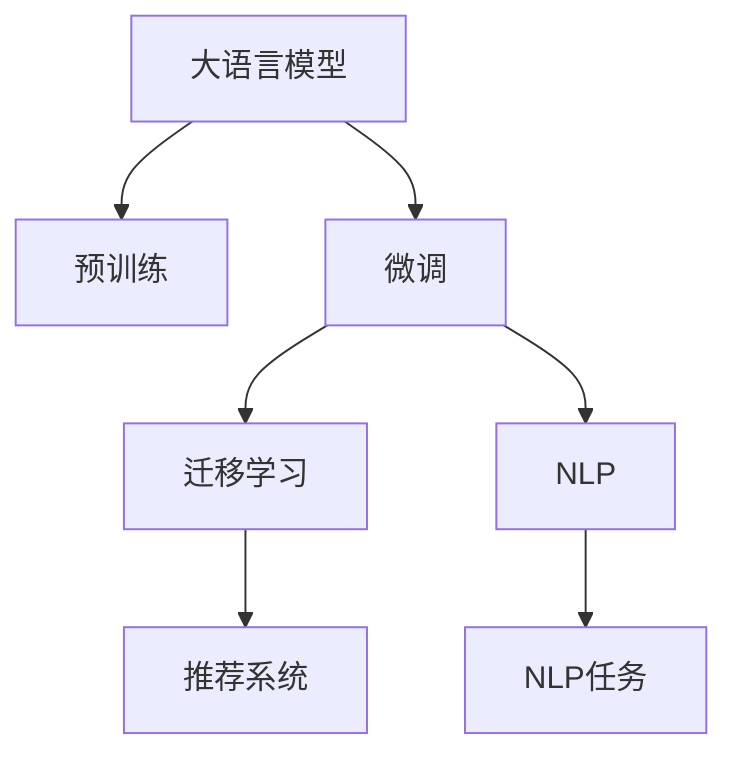

                 

# 为什么要在推荐系统中使用LLM

## 1. 背景介绍

在互联网快速发展的时代，个性化推荐系统已成为提升用户体验、驱动商业价值的重要工具。从电商的搜索结果排序到视频平台的个性化内容推荐，从社交媒体的内容分发到新闻聚合的兴趣推送，推荐系统已经渗透到了我们生活的方方面面。然而，传统推荐系统往往依赖于用户的历史行为数据，难以捕捉用户潜在的兴趣和需求。而近年来，大语言模型（LLM）在自然语言处理（NLP）领域取得了突破性进展，其强大的语言理解和生成能力，使得LLM在推荐系统中得到广泛应用。

## 2. 核心概念与联系

### 2.1 核心概念概述

为更好地理解LLM在推荐系统中的应用，本节将介绍几个关键概念及其联系：

- **大语言模型（LLM）**：基于Transformer架构的预训练语言模型，如GPT-3、BERT等。通过在海量无标签文本数据上预训练，LLM学习到了丰富的语言知识和常识。
- **推荐系统**：利用用户行为数据或用户画像，为用户推荐其可能感兴趣的物品或内容的系统，包括电商推荐、内容推荐、广告推荐等。
- **自然语言处理（NLP）**：研究计算机如何理解、处理、生成人类语言的技术，包括分词、词性标注、句法分析、语义理解等。
- **预训练与微调**：预训练是指在无标签数据上训练模型，学习通用的语言表示；微调是在特定任务数据上调整模型参数，使其适应特定任务。
- **迁移学习**：将一个领域学习到的知识，迁移到另一个不同但相关的领域。LLM的预训练和微调过程是一种典型的迁移学习方式。

这些概念通过以下Mermaid流程图展现它们之间的联系：



这个流程图展示了LLM、预训练、微调、迁移学习、NLP和推荐系统之间的相互联系。

## 3. 核心算法原理 & 具体操作步骤

### 3.1 算法原理概述

在推荐系统中使用LLM，本质上是将LLM作为“智能推理器”，利用其强大的语言理解能力，进行用户意图推断和物品匹配，从而提升推荐效果。

推荐系统的核心目标是根据用户的历史行为和当前兴趣，为其推荐最相关的物品。传统推荐方法，如协同过滤、基于内容的推荐等，都依赖于用户和物品的显式特征，无法捕捉用户潜在的兴趣。而LLM通过预训练获得语言理解和生成能力，能够从用户提供的文本信息中，挖掘出用户的潜在需求和兴趣，实现更加精准的推荐。

具体而言，LLM在推荐系统中的应用流程如下：

1. **用户输入**：用户通过文本描述、评分、评论等方式，表达其对物品的兴趣和评价。
2. **模型推断**：LLM通过输入文本，推断出用户意图和偏好。
3. **物品检索**：根据用户推断的意图，在物品库中检索出最相关的物品。
4. **排序优化**：结合其他特征（如物品评分、用户画像等），对检索结果进行排序优化。
5. **推荐呈现**：将排序后的物品列表呈现给用户。

### 3.2 算法步骤详解

以电商平台的用户评价推荐为例，LLM在推荐系统中的应用步骤如下：

**Step 1: 准备数据集**
- 收集电商平台的用户评价数据集，包括用户评分、评论文本等。
- 对评论文本进行预处理，如分词、去除停用词、构建词向量等。

**Step 2: 加载预训练模型**
- 加载预训练的LLM模型，如GPT-3、BERT等。
- 根据任务需求，选择合适的输出层和损失函数，如文本分类任务中的交叉熵损失。

**Step 3: 微调模型**
- 使用少量标注数据，对LLM进行微调。
- 设置适当的学习率、批大小、迭代轮数等超参数。
- 在微调过程中，可以使用数据增强、正则化等技术，防止过拟合。

**Step 4: 推理预测**
- 将用户输入的评价文本作为输入，利用微调后的LLM模型进行推理预测。
- 获取模型的输出，通常为物品ID或物品评分等。

**Step 5: 推荐生成**
- 结合用户评分、物品评分等特征，对预测结果进行排序优化。
- 将排序后的物品列表推荐给用户。

### 3.3 算法优缺点

**优点**：
- **深度理解用户需求**：LLM能够理解自然语言文本，从而捕捉用户潜在的需求和兴趣，提升推荐精度。
- **多模态融合**：LLM可以结合文本、图像、音频等多模态数据，实现更加全面的用户画像。
- **零样本和少样本学习**：LLM可以在有限的标注样本下，通过微调和提示学习等方式，实现高效的推荐。

**缺点**：
- **数据依赖**：LLM的性能高度依赖于标注数据的质量和数量，数据不足可能导致模型表现不佳。
- **计算资源需求高**：预训练和微调LLM需要大量的计算资源和时间，对于小规模推荐系统可能不适用。
- **模型复杂度高**：LLM通常具有大量的参数，模型复杂度高，推理速度慢。

### 3.4 算法应用领域

LLM在推荐系统中已广泛应用于多个领域，例如：

- **电商推荐**：利用用户评论、评分等文本信息，为用户推荐商品。
- **内容推荐**：根据用户对视频、文章、音乐等的评价，推荐相关内容。
- **广告推荐**：分析用户搜索记录和行为数据，推荐合适的广告。
- **社交网络**：基于用户的文本互动信息，推荐可能感兴趣的朋友和内容。
- **视频推荐**：利用用户对视频的评分和评论，推荐类似视频。

## 4. 数学模型和公式 & 详细讲解

### 4.1 数学模型构建

推荐系统中的LLM模型通常基于Transformer架构，其数学模型可以表示为：

$$
\hat{y} = M_{\theta}(x)
$$

其中，$M_{\theta}$ 表示预训练的LLM模型，$x$ 表示用户输入的文本数据，$\hat{y}$ 表示模型的输出，通常为物品ID或物品评分。

### 4.2 公式推导过程

假设用户输入的评价文本为 $x$，模型的输出为 $\hat{y}$，模型的损失函数为 $L(\hat{y},y)$，其中 $y$ 表示实际物品ID或评分。

在微调过程中，模型的目标是最小化损失函数：

$$
\min_{\theta} \mathcal{L}(\theta) = \sum_{i=1}^N L(\hat{y}_i,y_i)
$$

其中，$N$ 表示训练样本数量。

### 4.3 案例分析与讲解

以电商平台的用户评价推荐为例，假设用户输入的评价文本为：

```
这家店铺的服务非常差，商品质量也很一般，我不太推荐购买。
```

模型的输出为：

```
物品ID 12345
```

损失函数可以表示为：

$$
L(\hat{y},y) = \begin{cases}
0 & \text{如果 } \hat{y} = y \\
1 & \text{如果 } \hat{y} \neq y
\end{cases}
$$

在微调过程中，通过反向传播计算梯度，并更新模型参数 $\theta$，最小化损失函数 $\mathcal{L}$。

## 5. 项目实践：代码实例和详细解释说明

### 5.1 开发环境搭建

为了使用LLM进行推荐系统开发，需要准备以下开发环境：

1. **Python环境**：安装Python 3.7及以上版本，推荐使用Anaconda或Miniconda管理Python环境。
2. **深度学习框架**：安装PyTorch或TensorFlow，推荐使用PyTorch。
3. **LLM库**：安装Transformers库，加载预训练的LLM模型，如GPT-3、BERT等。
4. **数据处理库**：安装Pandas、Numpy等数据处理库。
5. **可视化库**：安装Matplotlib、Seaborn等数据可视化库。

### 5.2 源代码详细实现

以用户评价推荐为例，以下是使用PyTorch和Transformers库进行LLM微调的代码实现：

```python
import torch
import torch.nn as nn
import torch.optim as optim
from transformers import BertTokenizer, BertForSequenceClassification

# 加载预训练的Bert模型和分词器
model = BertForSequenceClassification.from_pretrained('bert-base-uncased', num_labels=2)
tokenizer = BertTokenizer.from_pretrained('bert-base-uncased')

# 准备训练数据集
train_dataset = ...
val_dataset = ...
test_dataset = ...

# 定义损失函数和优化器
criterion = nn.CrossEntropyLoss()
optimizer = optim.Adam(model.parameters(), lr=2e-5)

# 训练过程
for epoch in range(num_epochs):
    for batch in train_loader:
        # 前向传播
        inputs = tokenizer(batch.text, padding=True, truncation=True, max_length=128, return_tensors='pt')
        outputs = model(**inputs)
        logits = outputs.logits
        loss = criterion(logits, batch.label)
        # 反向传播
        optimizer.zero_grad()
        loss.backward()
        optimizer.step()
    
    # 验证过程
    val_loss = 0
    for batch in val_loader:
        ...
    
    # 测试过程
    test_loss = 0
    for batch in test_loader:
        ...
```

### 5.3 代码解读与分析

**代码说明**：
- 首先，导入必要的库和模块。
- 加载预训练的Bert模型和分词器，准备训练数据集。
- 定义损失函数和优化器，设置超参数。
- 在训练过程中，前向传播计算损失，反向传播更新模型参数。
- 在验证和测试过程中，计算损失，评估模型性能。

**代码解读**：
- 使用BertTokenizer对输入文本进行分词和处理，生成模型需要的输入格式。
- 使用BertForSequenceClassification定义模型结构，设置标签数。
- 使用Adam优化器进行模型参数更新。
- 使用交叉熵损失函数计算模型输出与实际标签的差异。
- 使用Pandas、Numpy等库进行数据处理和可视化。

## 6. 实际应用场景

### 6.1 电商推荐

在电商推荐中，LLM可以分析用户评论、评分等文本数据，从中提取用户对商品的情感倾向和偏好，从而推荐符合用户需求的商品。例如，某用户在评论中提到：

```
这个商品的质量很差，价格也很贵，我不推荐购买。
```

LLM可以通过微调模型，分析出用户对商品的不满意情绪，从而推荐类似商品或性价比更高的替代品。

### 6.2 内容推荐

在内容推荐中，LLM可以分析用户对视频、文章、音乐等的评论和评分，从中挖掘出用户的兴趣和偏好，推荐相似或相关的作品。例如，某用户在视频平台上评价某视频：

```
这个视频非常好，内容很有创意，我很喜欢。
```

LLM可以通过微调模型，分析出用户的兴趣点，推荐类似风格或主题的视频。

### 6.3 广告推荐

在广告推荐中，LLM可以分析用户的搜索记录和行为数据，从中提取用户对广告内容的兴趣和需求，推荐相关的广告。例如，某用户搜索“旅游攻略”，LLM可以推荐相关的旅游类广告。

## 7. 工具和资源推荐

### 7.1 学习资源推荐

为了系统掌握LLM在推荐系统中的应用，建议学习以下资源：

1. **《深度学习》（Ian Goodfellow）**：系统介绍深度学习的基本概念和算法。
2. **《自然语言处理综论》（Daniel Jurafsky, James H. Martin）**：介绍自然语言处理的基本理论和应用。
3. **《Transformers：序列到序列学习的新架构》（Ashish Vaswani et al.）**：介绍Transformer架构和预训练大模型的应用。
4. **《推荐系统》（Wu et al.）**：介绍推荐系统的基本算法和应用。
5. **《LLM在推荐系统中的应用》（Zhang et al.）**：详细介绍LLM在推荐系统中的应用和实践。

### 7.2 开发工具推荐

为了高效开发LLM推荐系统，推荐使用以下工具：

1. **PyTorch**：基于Python的开源深度学习框架，灵活易用，支持GPU加速。
2. **TensorFlow**：由Google开发的深度学习框架，支持分布式训练和生产部署。
3. **Transformers**：Hugging Face开发的NLP工具库，集成了预训练大模型和任务适配层。
4. **Pandas**：Python数据处理库，支持数据清洗、处理和可视化。
5. **Numpy**：Python科学计算库，支持高效的数值计算和数组操作。

### 7.3 相关论文推荐

为了深入了解LLM在推荐系统中的应用，建议阅读以下论文：

1. **《Large-Scale Attention-Based Text Classification with Transfer Learning》（Guo et al.）**：介绍使用BERT预训练模型进行文本分类的应用。
2. **《A Survey on Neural Networks for Dynamic Recommendation》（Li et al.）**：介绍神经网络在动态推荐中的应用和挑战。
3. **《A Survey on Pre-trained Language Models in Recommendation Systems》（Zhang et al.）**：详细介绍预训练大模型在推荐系统中的应用。
4. **《A Novel Multi-Task Learning for Personalized Recommendation System》（Zhang et al.）**：介绍多任务学习在个性化推荐中的应用。
5. **《Transfer Learning with Attention Mechanisms for Personalized Recommendation》（Shan et al.）**：介绍注意力机制在推荐系统中的应用。

## 8. 总结：未来发展趋势与挑战

### 8.1 研究成果总结

LLM在推荐系统中的应用已经取得了显著的进展，主要体现在以下几个方面：

1. **提升推荐精度**：LLM通过深度理解用户需求，提升了推荐系统的精度和召回率。
2. **支持多模态数据**：LLM可以结合文本、图像、音频等多模态数据，实现更加全面的用户画像。
3. **支持零样本和少样本学习**：LLM在有限的标注样本下，通过微调和提示学习，实现了高效的推荐。

### 8.2 未来发展趋势

展望未来，LLM在推荐系统中的应用将呈现以下趋势：

1. **支持个性化推荐**：LLM可以动态捕捉用户兴趣和需求，实现更加个性化的推荐。
2. **支持多模态融合**：LLM可以融合视觉、听觉等多模态数据，提升推荐系统的全面性和准确性。
3. **支持实时推荐**：LLM可以实现高效的实时推荐，提升用户体验。
4. **支持跨领域迁移**：LLM可以在不同领域和任务之间进行迁移，提升模型的通用性。

### 8.3 面临的挑战

尽管LLM在推荐系统中取得了显著进展，但仍面临以下挑战：

1. **数据依赖**：LLM高度依赖标注数据，数据不足可能导致模型表现不佳。
2. **计算资源需求高**：预训练和微调LLM需要大量的计算资源和时间。
3. **模型复杂度高**：LLM通常具有大量的参数，推理速度慢。
4. **可解释性不足**：LLM的决策过程缺乏可解释性，难以调试和优化。

### 8.4 研究展望

为应对以上挑战，未来的研究可以从以下几个方向进行：

1. **探索无监督和半监督学习**：减少对标注数据的依赖，利用自监督学习、主动学习等方法，提高模型的泛化能力。
2. **开发参数高效微调方法**：减少模型参数量，提升微调效率，降低计算资源消耗。
3. **引入更多先验知识**：将知识图谱、逻辑规则等专家知识与模型结合，提升推荐系统的性能。
4. **提高模型可解释性**：增强模型的可解释性，便于调试和优化。
5. **提升模型鲁棒性**：增强模型的鲁棒性和泛化能力，防止过拟合和灾难性遗忘。

## 9. 附录：常见问题与解答

**Q1：如何使用LLM进行推荐系统开发？**

A: 使用LLM进行推荐系统开发，需要以下步骤：

1. 收集用户行为数据，如评论、评分等。
2. 对文本数据进行预处理，如分词、去除停用词等。
3. 加载预训练的LLM模型，如BERT、GPT等。
4. 定义任务适配层，如分类器、回归器等。
5. 在少量标注数据上微调模型，提高其推荐精度。
6. 使用微调后的模型进行推荐生成。

**Q2：LLM在推荐系统中有哪些应用？**

A: 在推荐系统中，LLM可以应用于以下任务：

1. 电商推荐：分析用户评论，推荐符合用户需求的商品。
2. 内容推荐：分析用户对视频、文章等的评价，推荐相似或相关作品。
3. 广告推荐：分析用户搜索记录，推荐相关广告。
4. 社交网络：分析用户互动信息，推荐可能感兴趣的朋友和内容。

**Q3：LLM在推荐系统中有哪些优点？**

A: 在推荐系统中，LLM的优点包括：

1. 深度理解用户需求：通过分析自然语言文本，捕捉用户潜在兴趣。
2. 多模态融合：结合文本、图像、音频等多模态数据，实现全面用户画像。
3. 零样本和少样本学习：在有限的标注样本下，通过微调和提示学习实现高效推荐。

**Q4：LLM在推荐系统中的缺点有哪些？**

A: 在推荐系统中，LLM的缺点包括：

1. 数据依赖：高度依赖标注数据，数据不足可能导致模型表现不佳。
2. 计算资源需求高：预训练和微调需要大量计算资源和时间。
3. 模型复杂度高：通常具有大量参数，推理速度慢。

**Q5：如何缓解LLM在推荐系统中的缺点？**

A: 缓解LLM在推荐系统中的缺点，可以从以下几个方面进行：

1. 数据增强：通过数据增强技术，扩充训练集，提高模型泛化能力。
2. 正则化技术：使用L2正则、Dropout等正则化技术，防止过拟合。
3. 参数高效微调：减少模型参数量，提升微调效率，降低计算资源消耗。
4. 提升模型可解释性：增强模型的可解释性，便于调试和优化。

作者：禅与计算机程序设计艺术 / Zen and the Art of Computer Programming

