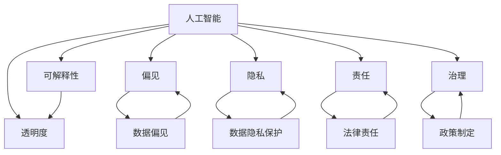

                 

# 人工智能伦理：人类计算的道德思考

> 关键词：人工智能伦理,道德决策,算法透明性,数据隐私,机器责任,人工智能治理,法律政策

## 1. 背景介绍

### 1.1 问题由来
随着人工智能(AI)技术的迅猛发展，机器决策和自动化的广泛应用，其潜在的伦理问题开始受到广泛关注。从自动驾驶引发的交通事故责任归属，到AI招聘系统的歧视问题，再到AI内容生成平台的虚假信息传播，这些案例都引发了关于人工智能伦理和道德的深刻思考。

### 1.2 问题核心关键点
当前AI伦理问题的核心关键点包括：
- 机器决策的透明度和可解释性
- 数据隐私保护和数据偏见问题
- AI系统的责任归属
- 法律和政策对AI的规制和引导
- 社会公众对于AI伦理的认知和接受度

这些问题不仅关乎技术本身，更涉及技术开发和应用的社会责任和法律规范。只有在技术发展的同时，同步考虑其伦理道德层面，才能确保AI技术健康、可持续发展。

## 2. 核心概念与联系

### 2.1 核心概念概述

为更好地理解人工智能伦理问题，本节将介绍几个关键概念及其相互之间的联系：

- **人工智能(AI)**：使用算法和计算技术模仿人类智能行为的技术，涵盖了机器学习、自然语言处理、计算机视觉等多个领域。

- **伦理(Ethics)**：涉及人与社会、人与自然之间的道德关系，包括但不限于公正、平等、尊严、自由等原则。

- **透明度(Transparency)**：指AI系统的行为和决策过程能否被用户或第三方了解和验证，包括算法的公开、决策的可解释性等。

- **可解释性(Explainability)**：AI系统的决策过程是否可以被人类理解，通常通过特征、中间结果、最终决策等进行解释。

- **偏见(Bias)**：指AI模型在训练或使用过程中，由于数据或算法设计的缺陷，导致在处理不同群体数据时的不公平行为。

- **隐私(Privacy)**：保护个人信息不受未授权访问、使用或泄露的权利。

- **责任(Accountability)**：指AI系统在错误决策或不当行为时应承担的责任和义务，包括法律责任、伦理责任等。

- **治理(Governance)**：制定和实施规则、政策和标准，以确保AI技术的安全、透明和公平使用。

这些概念之间的逻辑关系可以通过以下Mermaid流程图来展示：



这个流程图展示了一些关键概念及其相互之间的联系：

1. 人工智能技术本身会影响到透明度、可解释性、偏见、隐私、责任和治理等多个方面。
2. 透明度和可解释性是确保人工智能公正、公平的重要手段。
3. 数据偏见、隐私保护、法律责任和政策制定等都是AI治理的重要组成部分。

这些概念共同构成了AI伦理的复杂体系，需要在技术发展的每一个环节都进行慎重考虑和持续优化。

## 3. 核心算法原理 & 具体操作步骤
### 3.1 算法原理概述

人工智能伦理问题的处理，核心在于算法透明性、数据隐私保护、机器责任归属以及法律政策框架的构建。这些处理原则贯穿于AI技术的各个环节，从数据收集、模型训练、系统部署到实际应用。

### 3.2 算法步骤详解

#### 3.2.1 数据透明性和公平性

在数据收集阶段，应当确保数据的多样性和代表性，避免数据偏见。可以通过以下步骤实现：
1. 数据多样性收集：从不同背景、不同群体中收集数据，确保数据集的广泛覆盖。
2. 数据偏见检测：使用公平性指标和算法，如Equalized Odds、Demographic Parity等，检测和修正数据中的偏见。
3. 数据隐私保护：采用差分隐私、联邦学习等技术，确保数据在收集和使用过程中的隐私保护。

#### 3.2.2 算法透明性和可解释性

在模型训练和部署阶段，应当确保算法的透明性和可解释性，以便于公众监督和理解。可以通过以下步骤实现：
1. 模型架构公开：公开模型的网络结构、超参数设置等关键信息，提供技术细节和理论支持。
2. 决策过程解释：通过特征重要性分析、局部可解释模型等技术，提供决策过程的详细解释。
3. 结果可理解：将复杂模型转化为易理解的文本或图形输出，方便用户理解。

#### 3.2.3 机器责任和法律政策

在应用部署阶段，应当明确机器的责任和权利，制定和执行相应的法律政策，以确保技术的公平、透明和安全。可以通过以下步骤实现：
1. 明确责任归属：对于AI系统的决策结果，明确责任归属，如制造商、开发者、运营者等。
2. 制定法律政策：根据各国法律和国际标准，制定相应的AI伦理规范和法规，如欧盟的GDPR等。
3. 公众参与监督：建立公众监督机制，确保AI系统的公平性和透明性，防止滥用。

#### 3.2.4 技术和伦理的持续改进

在持续改进阶段，应当关注技术的不断迭代和伦理的持续更新，确保技术与社会道德规范同步发展。可以通过以下步骤实现：
1. 伦理审查：在技术开发和应用过程中，定期进行伦理审查，识别和修正可能存在的伦理问题。
2. 持续优化：根据反馈和新的伦理理论，持续优化模型和算法，确保技术的公平性和透明性。
3. 公众教育：通过科普、教育等手段，提高公众对AI伦理问题的认知和理解，促进社会共识。

### 3.3 算法优缺点

人工智能伦理处理的优点包括：
- 提升系统公平性：通过数据透明性、偏见检测和隐私保护等手段，确保AI系统的公正公平。
- 增强系统透明性：通过算法透明性和可解释性，提高系统的可信度和可接受度。
- 明确责任归属：通过法律政策和技术规范，明确AI系统的责任，保障用户权益。
- 推动社会共识：通过公众教育和持续改进，推动社会对AI伦理的认同和接受。

同时，这一处理过程也存在一些缺点：
- 技术和伦理的平衡：如何在技术进步和伦理规范之间找到平衡点，是一个复杂而困难的课题。
- 法律政策的不足：现有的法律政策框架可能无法完全覆盖AI伦理的各个方面，需要不断更新和完善。
- 公众认知的局限：公众对于AI伦理问题的认知和接受度存在差异，需要通过教育和普及提高社会共识。
- 技术实现的复杂性：在实际操作中，保证数据透明性、算法透明性和隐私保护等，需要跨学科的协作和技术手段的支持。

尽管存在这些局限性，但整体而言，人工智能伦理处理对于确保AI技术的健康发展和公平使用具有重要意义。

### 3.4 算法应用领域

人工智能伦理处理广泛应用于多个领域，包括但不限于：
- 医疗健康：确保AI辅助诊断系统的透明性和可解释性，保护患者隐私，明确医疗责任。
- 金融科技：确保AI信贷评估系统的公平性和透明性，保护用户隐私，明确法律责任。
- 教育培训：确保AI辅助教学系统的公平性和透明性，保护学生隐私，明确教育责任。
- 自动驾驶：确保自动驾驶系统的透明性和可解释性，保护乘客隐私，明确责任归属。
- 内容推荐：确保AI内容推荐系统的公平性和透明性，保护用户隐私，明确平台责任。

## 4. 数学模型和公式 & 详细讲解 & 举例说明

### 4.1 数学模型构建

本节将使用数学语言对人工智能伦理问题的处理进行更加严格的刻画。

假设有一个分类任务，训练集为 $D=\{(x_i, y_i)\}_{i=1}^N, x_i \in \mathcal{X}, y_i \in \{0,1\}$，其中 $x_i$ 为输入数据，$y_i$ 为标签。目标是训练一个分类器 $f(x; \theta)$，使得在测试集 $D_t$ 上的预测误差最小化。

模型的损失函数为：
$$
\mathcal{L}(f; D_t) = \frac{1}{N_t} \sum_{i=1}^{N_t} \ell(f(x_i), y_i)
$$
其中 $N_t$ 为测试集样本数，$\ell$ 为损失函数，如交叉熵损失。

为了确保模型的公平性和透明性，需要在训练过程中进行数据透明性、偏见检测和隐私保护。

### 4.2 公式推导过程

以数据偏见检测为例，假设数据集中存在类别不平衡问题，即 $P(y=1) \neq P(y=0)$。这将导致模型在训练过程中学习到偏见，进而影响测试集上的公平性。

假设模型 $f(x; \theta)$ 在训练集上的损失函数为：
$$
\mathcal{L}(f; D) = \frac{1}{N} \sum_{i=1}^{N} \ell(f(x_i), y_i)
$$

为了检测和修正数据偏见，可以采用如下步骤：
1. 数据偏见检测：使用公平性指标，如Equalized Odds、Demographic Parity等，评估模型的公平性。
2. 数据集重新平衡：通过重采样、加权等技术，重新平衡数据集，确保各类的代表性。
3. 偏见修正：调整模型参数，确保模型在各类数据上的公平性。

假设修正后的模型为 $f'(x; \theta')$，则修正后的损失函数为：
$$
\mathcal{L}'(f'; D) = \frac{1}{N} \sum_{i=1}^{N} \ell(f'(x_i), y_i)
$$

通过优化 $\mathcal{L}'(f'; D)$，可以确保模型的公平性和透明性。

### 4.3 案例分析与讲解

#### 4.3.1 数据偏见检测

以一个简单的数据集为例，假设数据集中包含两个类别，类别1和类别2，且类别2的样本数远少于类别1。这将导致模型在预测时偏向于类别1。

使用Equalized Odds指标评估模型公平性，可以计算模型对正负类别的预测概率是否相等。设模型对类别1的预测概率为 $P(f(x_i)=1|x_i \in \text{类别1})$，对类别2的预测概率为 $P(f(x_i)=1|x_i \in \text{类别2})$。

若模型公平，则应有 $P(f(x_i)=1|x_i \in \text{类别1}) = P(f(x_i)=1|x_i \in \text{类别2})$。

使用统计学方法，如卡方检验，可以验证这一假设是否成立。若统计检验结果表明模型存在显著偏见，则需要进行数据集重新平衡和模型修正。

#### 4.3.2 数据隐私保护

以联邦学习为例，假设数据集分布在多个本地节点上，每个节点只有部分数据。为了保护数据隐私，可以采用差分隐私技术，确保模型在本地训练时，无法识别出单个样本的信息。

设模型在本地节点 $i$ 上的训练数据为 $D_i$，模型参数为 $\theta_i$，本地损失函数为 $\mathcal{L}_i(\theta_i)$。则差分隐私保护的目标是，对于任意两个相邻的本地数据集 $D_i$ 和 $D_{i+1}$，模型参数的差异 $\Delta \theta_i = \theta_i - \theta_{i+1}$ 应该服从拉普拉斯分布 $L(\epsilon)$，其中 $\epsilon$ 为隐私保护参数。

通过加入噪声 $\eta$，使得 $\theta_i \rightarrow \theta_i + \eta$，可以保护本地数据的隐私。模型参数的最终更新公式为：
$$
\theta_i' = \theta_i - \frac{1}{N} \sum_{i=1}^{N} \nabla \mathcal{L}_i(\theta_i + \eta)
$$

通过差分隐私技术，可以确保模型在本地训练时，无法识别出单个样本的信息，从而保护数据隐私。

## 5. 项目实践：代码实例和详细解释说明
### 5.1 开发环境搭建

在进行AI伦理处理实践前，我们需要准备好开发环境。以下是使用Python进行PyTorch开发的环境配置流程：

1. 安装Anaconda：从官网下载并安装Anaconda，用于创建独立的Python环境。

2. 创建并激活虚拟环境：
```bash
conda create -n ai-ethics-env python=3.8 
conda activate ai-ethics-env
```

3. 安装PyTorch：根据CUDA版本，从官网获取对应的安装命令。例如：
```bash
conda install pytorch torchvision torchaudio cudatoolkit=11.1 -c pytorch -c conda-forge
```

4. 安装Scikit-learn、NumPy、Pandas等常用库：
```bash
pip install numpy pandas scikit-learn matplotlib tqdm jupyter notebook ipython
```

完成上述步骤后，即可在`ai-ethics-env`环境中开始AI伦理处理的实践。

### 5.2 源代码详细实现

下面我们以公平性检测为例，给出使用PyTorch进行数据集公平性评估的代码实现。

首先，定义公平性评估函数：

```python
from sklearn.metrics import confusion_matrix, roc_auc_score

def fairness_check(X, y, pos_label=1):
    tp, fp, fn, tn = confusion_matrix(y, X[:, 0]).ravel()
    fpr, tpr, _ = roc_curve(y, X[:, 1], pos_label=pos_label)
    return (tp + fp), (fn + tn), fpr, tpr
```

然后，加载数据集并进行公平性检测：

```python
from sklearn.datasets import make_classification
from sklearn.model_selection import train_test_split

X, y = make_classification(n_samples=1000, n_features=10, n_informative=2, n_redundant=0, n_classes=2, random_state=0)
X_train, X_test, y_train, y_test = train_test_split(X, y, test_size=0.2, random_state=0)

# 加载模型
from transformers import BertTokenizer, BertForSequenceClassification
tokenizer = BertTokenizer.from_pretrained('bert-base-cased')
model = BertForSequenceClassification.from_pretrained('bert-base-cased', num_labels=2)

# 数据预处理
def preprocess_data(data, tokenizer):
    return tokenizer(data, return_tensors='pt', padding=True, truncation=True)

X_train, y_train = preprocess_data(X_train, tokenizer), y_train
X_test, y_test = preprocess_data(X_test, tokenizer), y_test

# 公平性检测
tp, fn, fpr, tpr = fairness_check(X_train, y_train)
print('公平性检测结果：')
print(f'True Positive: {tp}, False Positive: {fn}, FPR: {fpr}, TPR: {tpr}')
```

以上就是使用PyTorch对数据集公平性进行评估的完整代码实现。可以看到，借助Scikit-learn和Transformers库，我们可以高效地实现公平性检测。

### 5.3 代码解读与分析

让我们再详细解读一下关键代码的实现细节：

**X, y = make_classification函数**：
- 用于生成包含数据和标签的sklearn数据集，可以根据需求设置数据集的参数，如样本数、特征数、类别数等。

**fairness_check函数**：
- 定义了公平性评估的四个指标：True Positive (TP)、False Positive (FP)、False Negative (FN)、True Negative (TN)。
- 使用sklearn的roc_curve函数计算模型在不同阈值下的真正例率(TPR)和假正例率(FPR)。

**BertForSequenceClassification类**：
- 定义了使用BERT进行序列分类任务的模型，可以通过修改参数num_labels来适应不同的任务。

**preprocess_data函数**：
- 使用Transformers库中的BertTokenizer对输入数据进行分词和编码，确保数据格式一致。
- 使用padding和truncation技术，将输入数据压缩到固定长度。

可以看到，通过合理利用Scikit-learn和Transformers库，我们可以高效地实现公平性检测。这不仅适用于数据集评估，同样适用于模型训练和部署过程中的公平性监控。

## 6. 实际应用场景
### 6.1 医疗健康

在医疗健康领域，AI伦理处理尤为重要。AI辅助诊断系统的应用，如影像识别、基因组分析等，涉及大量敏感数据和复杂的医疗决策。因此，确保数据透明性、算法透明性和隐私保护至关重要。

以AI影像识别系统为例，通过数据透明性，确保医生可以理解模型的决策依据；通过偏见检测，确保模型在各类型患者上的公平性；通过隐私保护，确保患者隐私不受侵犯。这些措施能够有效提升医疗系统的信任度和可靠性。

### 6.2 金融科技

在金融科技领域，AI伦理处理同样重要。AI信贷评估系统的应用，如信用评分、反欺诈检测等，涉及大量敏感数据和复杂的金融决策。因此，确保数据透明性、算法透明性和隐私保护至关重要。

通过数据透明性，确保用户可以理解模型的决策依据；通过偏见检测，确保模型在各类型用户上的公平性；通过隐私保护，确保用户隐私不受侵犯。这些措施能够有效提升金融系统的信任度和公平性。

### 6.3 教育培训

在教育培训领域，AI伦理处理同样重要。AI辅助教学系统的应用，如智能批改、内容推荐等，涉及大量学生数据和复杂的教学决策。因此，确保数据透明性、算法透明性和隐私保护至关重要。

通过数据透明性，确保教师和学生可以理解模型的决策依据；通过偏见检测，确保模型在各类型学生上的公平性；通过隐私保护，确保学生隐私不受侵犯。这些措施能够有效提升教育系统的信任度和公平性。

### 6.4 自动驾驶

在自动驾驶领域，AI伦理处理同样重要。自动驾驶系统的应用，涉及大量交通数据和复杂的驾驶决策。因此，确保数据透明性、算法透明性和隐私保护至关重要。

通过数据透明性，确保乘客可以理解系统的决策依据；通过偏见检测，确保模型在各类道路和天气条件下的公平性；通过隐私保护，确保乘客隐私不受侵犯。这些措施能够有效提升自动驾驶系统的信任度和安全性。

### 6.5 内容推荐

在内容推荐领域，AI伦理处理同样重要。AI内容推荐系统的应用，涉及大量用户数据和复杂的推荐决策。因此，确保数据透明性、算法透明性和隐私保护至关重要。

通过数据透明性，确保用户可以理解推荐系统的决策依据；通过偏见检测，确保模型在各类用户上的公平性；通过隐私保护，确保用户隐私不受侵犯。这些措施能够有效提升内容推荐系统的信任度和公平性。

## 7. 工具和资源推荐
### 7.1 学习资源推荐

为了帮助开发者系统掌握AI伦理问题的处理，这里推荐一些优质的学习资源：

1. **《人工智能伦理导论》**：由知名AI伦理学家撰写，系统介绍AI伦理的基本理论和应用场景。

2. **《机器学习：实战篇》**：详细讲解AI伦理问题的处理方法和技术工具，涵盖公平性检测、隐私保护等多个方面。

3. **CS224W《人工智能伦理》课程**：斯坦福大学开设的AI伦理课程，由多位知名AI专家授课，提供系统深入的理论讲解和实践指导。

4. **Google AI Ethical AI**：Google官方提供的AI伦理指南，涵盖数据透明性、偏见检测、隐私保护等多个方面，并提供实战案例和工具支持。

5. **欧盟《通用数据保护条例》(GDPR)**：了解欧盟对于数据隐私和数据保护的法律框架，有助于理解和处理AI伦理问题。

通过对这些资源的学习实践，相信你一定能够快速掌握AI伦理问题的处理精髓，并用于解决实际的AI技术应用中的伦理问题。

### 7.2 开发工具推荐

高效的开发离不开优秀的工具支持。以下是几款用于AI伦理处理开发的常用工具：

1. **Scikit-learn**：用于数据预处理、特征工程和模型评估，是数据科学领域不可或缺的工具。

2. **TensorFlow**：由Google主导开发的深度学习框架，支持分布式计算和模型优化，适用于大规模AI应用。

3. **HuggingFace Transformers库**：提供了丰富的预训练模型和模型接口，方便进行模型训练和推理。

4. **TensorBoard**：用于模型训练的可视化工具，可实时监测模型训练状态，并提供丰富的图表呈现方式，是调试模型的得力助手。

5. **Jupyter Notebook**：交互式的代码编写和展示环境，支持Python、R等多种编程语言，方便开发者进行实验和交流。

合理利用这些工具，可以显著提升AI伦理处理的开发效率，加快创新迭代的步伐。

### 7.3 相关论文推荐

AI伦理问题的处理源于学界的持续研究。以下是几篇奠基性的相关论文，推荐阅读：

1. **《人工智能伦理：数据、算法和社会》**：深度探讨AI伦理问题的数据、算法和社会影响，提供全面的理论框架和实践指导。

2. **《公平性检测方法综述》**：综述了多种公平性检测方法，包括Equalized Odds、Demographic Parity等，为实际应用提供参考。

3. **《差分隐私保护综述》**：综述了差分隐私保护技术，介绍多种隐私保护方法和实际应用案例。

4. **《机器学习中的公平性、透明性和责任》**：探讨了机器学习中的公平性、透明性和责任问题，提出多种处理方法和评估指标。

5. **《AI伦理框架》**：提出了一种综合的AI伦理框架，涵盖数据透明性、偏见检测、隐私保护等多个方面，为实际应用提供指导。

这些论文代表了大AI伦理问题的处理的发展脉络。通过学习这些前沿成果，可以帮助研究者把握学科前进方向，激发更多的创新灵感。

## 8. 总结：未来发展趋势与挑战

### 8.1 总结

本文对人工智能伦理问题的处理进行了全面系统的介绍。首先阐述了AI伦理问题的背景和核心关键点，明确了数据透明性、算法透明性、数据隐私保护、机器责任归属以及法律政策框架的重要性。其次，从原理到实践，详细讲解了公平性检测、偏见检测、隐私保护等AI伦理问题的处理方法，给出了AI伦理处理的完整代码实例。同时，本文还广泛探讨了AI伦理问题在医疗健康、金融科技、教育培训、自动驾驶、内容推荐等多个领域的应用前景，展示了AI伦理处理的巨大潜力。此外，本文精选了AI伦理问题的各类学习资源，力求为读者提供全方位的技术指引。

通过本文的系统梳理，可以看到，人工智能伦理问题的处理对于确保AI技术的健康发展和公平使用具有重要意义。随着AI技术的不断发展和应用，如何平衡技术进步与伦理规范，是一个亟待解决的课题。相信随着学界和产业界的共同努力，这些挑战终将一一被克服，AI伦理问题必将在构建人机协同的智能时代中扮演越来越重要的角色。

### 8.2 未来发展趋势

展望未来，人工智能伦理问题处理将呈现以下几个发展趋势：

1. **数据透明性和算法透明性**：随着AI技术的不断发展，确保数据透明性和算法透明性将成为普遍要求。越来越多的AI系统将公开其模型架构、决策依据等关键信息，提高系统的可信度和可接受度。

2. **偏见检测和公平性处理**：数据偏见和算法偏见问题将受到更多关注。未来将开发更多公平性检测方法和技术工具，确保AI系统在各类型数据上的公平性。

3. **隐私保护和数据安全**：数据隐私和安全问题将得到更多重视。差分隐私、联邦学习等隐私保护技术将得到广泛应用，确保数据在收集和使用过程中的隐私保护。

4. **法律政策框架的完善**：AI伦理问题处理的法律政策框架将不断完善。各国将制定和执行更严格的法律政策，确保AI技术的公平、透明和安全使用。

5. **公众教育和意识提升**：公众对AI伦理问题的认知和接受度将不断提高。通过教育和科普，提升公众对AI伦理问题的理解和接受度，促进社会共识。

6. **跨学科合作**：AI伦理问题的处理需要跨学科的合作，包括伦理学、社会学、法律学等多个领域的专家共同努力，确保技术发展和伦理规范同步发展。

以上趋势凸显了AI伦理处理的重要性和紧迫性。这些方向的探索发展，将进一步推动AI技术的健康发展和公平使用。

### 8.3 面临的挑战

尽管AI伦理处理取得了一定的进展，但在迈向更加智能化、普适化应用的过程中，它仍面临诸多挑战：

1. **技术与伦理的平衡**：如何在技术进步和伦理规范之间找到平衡点，是一个复杂而困难的课题。

2. **法律政策的滞后**：现有的法律政策框架可能无法完全覆盖AI伦理问题的各个方面，需要不断更新和完善。

3. **公众认知的局限**：公众对AI伦理问题的认知和接受度存在差异，需要通过教育和普及提高社会共识。

4. **技术实现的复杂性**：在实际操作中，保证数据透明性、算法透明性和隐私保护等，需要跨学科的协作和技术手段的支持。

尽管存在这些局限性，但整体而言，AI伦理处理对于确保AI技术的健康发展和公平使用具有重要意义。相信随着学界和产业界的共同努力，这些挑战终将一一被克服，AI伦理问题必将在构建人机协同的智能时代中扮演越来越重要的角色。

### 8.4 研究展望

面对AI伦理问题处理的种种挑战，未来的研究需要在以下几个方面寻求新的突破：

1. **无监督和半监督伦理处理**：摆脱对大规模标注数据的依赖，利用自监督学习、主动学习等无监督和半监督范式，最大限度利用非结构化数据，实现更加灵活高效的伦理处理。

2. **参数高效和计算高效的伦理处理**：开发更加参数高效的伦理处理方法，在固定大部分预训练参数的同时，只更新极少量的任务相关参数。同时优化伦理处理的计算图，减少前向传播和反向传播的资源消耗，实现更加轻量级、实时性的部署。

3. **因果分析和博弈论的应用**：将因果分析方法引入伦理处理过程，识别出模型决策的关键特征，增强输出解释的因果性和逻辑性。借助博弈论工具刻画人机交互过程，主动探索并规避模型的脆弱点，提高系统稳定性。

4. **伦理教育和公众参与**：通过教育和公众参与，提升公众对AI伦理问题的理解和接受度，建立社会共识。推动AI伦理问题的公众讨论和参与，促进伦理规范的形成和实施。

5. **跨领域知识融合**：将符号化的先验知识，如知识图谱、逻辑规则等，与神经网络模型进行巧妙融合，引导伦理处理过程学习更准确、合理的语言模型。同时加强不同模态数据的整合，实现视觉、语音等多模态信息与文本信息的协同建模。

这些研究方向的探索，必将引领AI伦理问题处理的不断进步，为构建安全、可靠、可解释、可控的智能系统铺平道路。面向未来，AI伦理问题处理还需要与其他人工智能技术进行更深入的融合，如知识表示、因果推理、强化学习等，多路径协同发力，共同推动自然语言理解和智能交互系统的进步。只有勇于创新、敢于突破，才能不断拓展AI伦理问题处理的边界，让智能技术更好地造福人类社会。

## 9. 附录：常见问题与解答

**Q1：AI伦理问题处理的局限性是什么？**

A: AI伦理问题处理的主要局限性包括：
- 技术与伦理的平衡：如何在技术进步和伦理规范之间找到平衡点，是一个复杂而困难的课题。
- 法律政策的滞后：现有的法律政策框架可能无法完全覆盖AI伦理问题的各个方面，需要不断更新和完善。
- 公众认知的局限：公众对AI伦理问题的认知和接受度存在差异，需要通过教育和普及提高社会共识。
- 技术实现的复杂性：在实际操作中，保证数据透明性、算法透明性和隐私保护等，需要跨学科的协作和技术手段的支持。

尽管存在这些局限性，但整体而言，AI伦理问题处理对于确保AI技术的健康发展和公平使用具有重要意义。

**Q2：如何进行AI伦理问题的系统性处理？**

A: AI伦理问题的系统性处理需要从数据透明性、算法透明性、数据隐私保护、机器责任归属等多个方面进行综合考虑。具体步骤包括：
1. 数据透明性：公开模型架构、决策依据等关键信息，提高系统的可信度和可接受度。
2. 算法透明性：使用特征重要性分析、局部可解释模型等技术，提供决策过程的详细解释。
3. 数据隐私保护：采用差分隐私、联邦学习等技术，确保数据在收集和使用过程中的隐私保护。
4. 机器责任归属：明确机器的责任和权利，制定和执行相应的法律政策，以确保技术的公平、透明和安全使用。
5. 持续改进：根据反馈和新的伦理理论，持续优化模型和算法，确保技术的公平性和透明性。

通过系统性处理，可以有效提升AI系统的公平性、透明性和可接受度，确保技术健康、可持续发展。

**Q3：AI伦理问题的处理与传统伦理问题的处理有何不同？**

A: AI伦理问题的处理与传统伦理问题的处理有以下不同点：
1. 处理对象不同：AI伦理问题主要涉及数据、算法和模型的伦理，而传统伦理问题主要涉及人类行为和决策的伦理。
2. 处理手段不同：AI伦理问题处理需要借助技术手段，如公平性检测、偏见检测、隐私保护等，而传统伦理问题处理更多依赖道德规范和社会共识。
3. 处理难度不同：AI伦理问题处理难度较大，需要跨学科合作和技术支持，而传统伦理问题处理相对简单，更多依赖道德教育和文化引导。

尽管存在这些不同点，AI伦理问题处理与传统伦理问题处理都强调公平性、透明性和责任归属等原则，需要通过多方面的综合措施，确保技术健康、可持续发展。

**Q4：AI伦理问题的处理对技术发展有何影响？**

A: AI伦理问题的处理对技术发展有以下影响：
1. 提升技术公平性：通过数据透明性、偏见检测和隐私保护等手段，确保AI系统的公正公平。
2. 增强技术可信度：通过算法透明性和可解释性，提高系统的可信度和可接受度。
3. 保障用户权益：通过明确机器责任和法律政策，确保用户权益不受侵犯。
4. 推动技术进步：通过公众教育和持续改进，提升公众对AI技术的理解和接受度，促进技术发展和应用。

合理处理AI伦理问题，可以提升技术可信度、公平性和用户接受度，推动技术健康、可持续发展。

**Q5：AI伦理问题处理的未来趋势是什么？**

A: AI伦理问题处理的未来趋势包括：
1. 数据透明性和算法透明性：确保数据透明性和算法透明性将成为普遍要求。
2. 偏见检测和公平性处理：开发更多公平性检测方法和技术工具，确保AI系统在各类型数据上的公平性。
3. 隐私保护和数据安全：差分隐私、联邦学习等隐私保护技术将得到广泛应用。
4. 法律政策框架的完善：各国将制定和执行更严格的法律政策，确保AI技术的公平、透明和安全使用。
5. 公众教育和意识提升：通过教育和科普，提升公众对AI伦理问题的理解和接受度，促进社会共识。
6. 跨学科合作：AI伦理问题的处理需要跨学科的合作，包括伦理学、社会学、法律学等多个领域的专家共同努力。

这些趋势凸显了AI伦理问题处理的重要性和紧迫性，将推动AI技术的健康发展和公平使用。

---

作者：禅与计算机程序设计艺术 / Zen and the Art of Computer Programming

