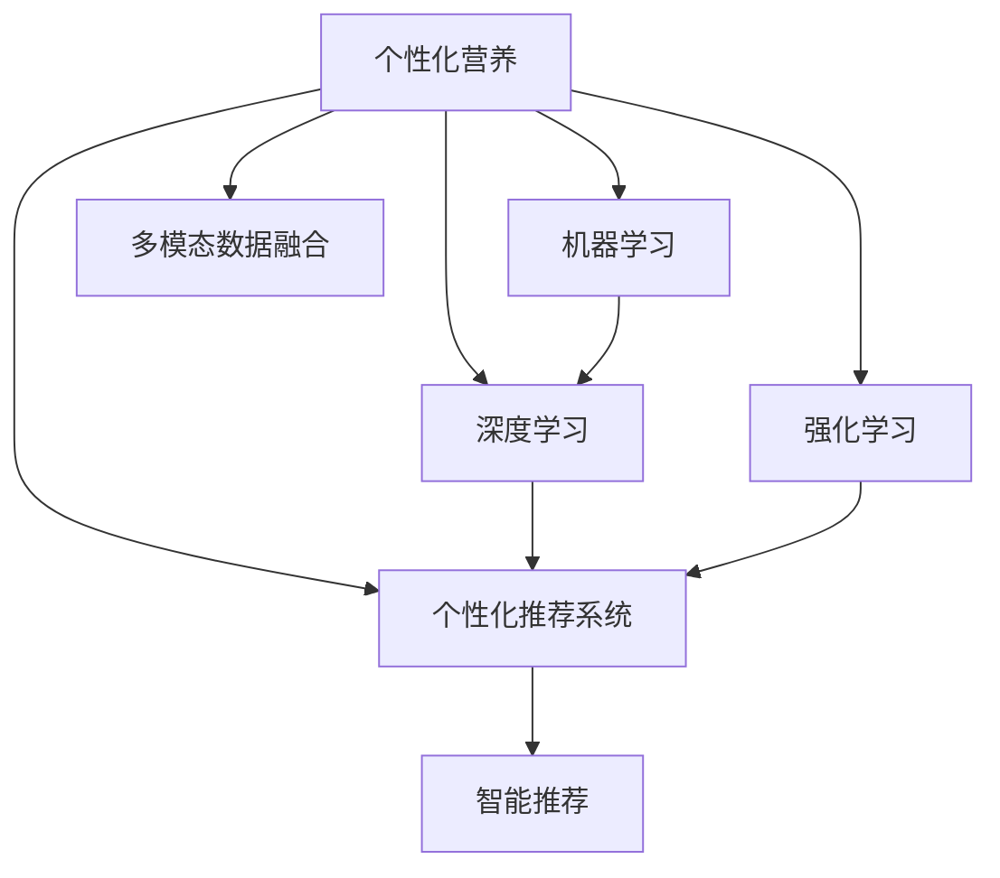

                 

# 人工智能在个性化营养中的应用：定制饮食方案

> 关键词：个性化营养,饮食计划,健康管理,智能推荐,营养平衡,机器学习

## 1. 背景介绍

### 1.1 问题由来
随着现代生活节奏的加快，越来越多的人面临营养失衡、慢性疾病高发的困扰。如何制定科学的饮食计划，帮助人们改善健康状况，成为广大健康管理者和营养师关注的重点。

传统的饮食计划往往依赖医生或营养师的个人经验和知识，存在主观性强、个性化不足的问题。而大数据和人工智能的兴起，为个性化营养的实现带来了新的可能。通过分析个人生理指标、生活习惯、饮食偏好等数据，结合AI的精准推荐算法，可以实现更加个性化、科学的饮食方案。

### 1.2 问题核心关键点
个性化营养的实现，主要依赖于以下核心概念：

- **个性化营养**：指根据个人身体状况、生活习惯、饮食偏好等特征，量身定制的饮食方案。目的是帮助个体改善营养状况，预防和治疗疾病。
- **智能推荐系统**：指基于人工智能技术，根据用户数据自动推荐个性化饮食方案的系统。它利用机器学习算法，从海量数据中挖掘出隐藏在背后的规律，进行精准推荐。
- **营养平衡**：指科学合理的饮食方案应确保各种营养成分的均衡摄入，包括碳水化合物、蛋白质、脂肪、维生素和矿物质等。
- **健康管理**：通过智能推荐系统提供的饮食方案，结合运动、睡眠等生活习惯的管理，实现全面的健康提升。
- **用户数据隐私**：在使用AI进行个性化营养推荐时，需要收集和分析大量的用户数据，包括生理指标、饮食行为等，如何保护用户隐私是必须考虑的问题。

### 1.3 问题研究意义
实现个性化营养的智能推荐系统，对于提高公众健康水平、降低医疗成本、推动健康产业的发展具有重要意义：

1. **提高健康水平**：通过个性化的饮食方案，帮助用户改善营养状况，预防和治疗慢性病，提升整体健康水平。
2. **降低医疗成本**：避免因营养失衡导致的疾病风险，减少医疗资源的浪费，减轻国家和社会的医疗负担。
3. **推动健康产业**：智能推荐系统的应用，可带动健康食品、健康管理APP等新兴产业的崛起，促进健康相关产业链的快速发展。
4. **个性化定制**：通过AI算法，可以根据用户的个性化需求，提供精准的饮食建议，提升用户满意度和粘性。
5. **数据驱动决策**：利用大数据和AI技术，可以为健康管理师和医生提供科学的决策支持，优化治疗方案。

## 2. 核心概念与联系

### 2.1 核心概念概述

为更好地理解人工智能在个性化营养中的应用，本节将介绍几个密切相关的核心概念：

- **机器学习**：指通过数据驱动的学习算法，使计算机具备类似于人类的学习能力。在个性化营养的推荐中，机器学习算法可以分析用户数据，自动发现其中的规律和模式，进行精准推荐。
- **深度学习**：一种特殊的机器学习算法，通过多层神经网络模型，可以自动提取数据的高级特征，解决非线性问题。深度学习在个性化营养推荐中，可以通过复杂的神经网络模型，学习用户的隐含需求和偏好。
- **强化学习**：一种在特定环境下，通过智能体与环境的交互，不断优化策略的学习方法。在个性化营养中，强化学习可以用于动态调整饮食方案，实时优化用户健康状态。
- **个性化推荐系统**：指根据用户的历史行为和特征，自动推荐个性化的产品、内容或服务的系统。在营养推荐中，可以基于用户过往的饮食记录和健康数据，自动生成适合其需求的饮食计划。
- **多模态数据融合**：指将不同类型的数据（如文本、图像、语音等）进行整合，提高推荐系统的准确性和泛化能力。在个性化营养中，可以结合用户的照片、语音记录、运动数据等，全面了解用户的健康状况。

这些核心概念之间的逻辑关系可以通过以下Mermaid流程图来展示：



这个流程图展示了个性化营养的推荐流程，从多模态数据融合开始，经过深度学习、机器学习和强化学习等多个环节，最终实现智能推荐系统的构建。

## 3. 核心算法原理 & 具体操作步骤
### 3.1 算法原理概述

基于人工智能的个性化营养推荐系统，其核心原理是利用机器学习算法，根据用户的历史饮食记录、生理指标和生活习惯，自动生成个性化的饮食方案。系统通过分析海量数据，自动发现其中的规律和模式，进行精准推荐。

形式化地，假设用户的历史饮食记录为 $D=\{(x_i,y_i)\}_{i=1}^N$，其中 $x_i$ 为历史饮食记录，$y_i$ 为推荐的饮食方案标签。目标是最小化预测标签与实际标签之间的差异：

$$
\hat{y}_i = f(x_i,\theta)
$$

其中 $f$ 为推荐函数，$\theta$ 为模型参数，$\hat{y}_i$ 为推荐结果。目标是找到最优参数 $\theta$，使得 $\hat{y}_i$ 与 $y_i$ 尽可能一致。

在实践中，我们通常使用基于梯度的优化算法（如SGD、Adam等）来近似求解上述最优化问题。设 $\eta$ 为学习率，$\lambda$ 为正则化系数，则参数的更新公式为：

$$
\theta \leftarrow \theta - \eta \nabla_{\theta}\mathcal{L}(\theta) - \eta\lambda\theta
$$

其中 $\nabla_{\theta}\mathcal{L}(\theta)$ 为损失函数对参数 $\theta$ 的梯度，可通过反向传播算法高效计算。

### 3.2 算法步骤详解

基于人工智能的个性化营养推荐系统，一般包括以下几个关键步骤：

**Step 1: 数据收集与预处理**
- 收集用户的历史饮食记录、生理指标、生活习惯等数据，划分为训练集、验证集和测试集。
- 对数据进行清洗和标准化处理，去除噪声和异常值，确保数据质量。

**Step 2: 特征提取与工程**
- 设计合适的特征工程策略，从原始数据中提取有用的特征，如营养成分、热量、饮食频率等。
- 将不同类型的数据进行融合，如将文本数据转化为数字特征向量，支持模型训练。

**Step 3: 模型选择与训练**
- 选择合适的推荐算法，如协同过滤、基于内容的推荐、矩阵分解等。
- 训练模型，使用优化算法调整参数，最小化预测误差。
- 在验证集上评估模型性能，进行参数调优。

**Step 4: 推荐与优化**
- 在训练好的模型上，使用测试集生成推荐结果。
- 收集用户反馈，对模型进行迭代优化。
- 引入强化学习算法，动态调整推荐策略。

**Step 5: 部署与应用**
- 将训练好的模型部署到实际应用场景中，如健康管理APP、网站等。
- 持续收集用户反馈，定期更新推荐模型。
- 保护用户隐私，确保数据安全。

以上是基于人工智能的个性化营养推荐系统的基本流程。在实际应用中，还需要根据具体任务特点进行优化设计，如改进特征工程策略、选择合适的损失函数、搜索最优的超参数组合等，以进一步提升推荐精度。

### 3.3 算法优缺点

基于人工智能的个性化营养推荐系统具有以下优点：
1. 高度个性化：通过分析用户数据，自动生成个性化推荐，满足不同用户的需求。
2. 数据驱动决策：利用数据和算法，自动生成推荐，避免人为干预的偏见和错误。
3. 实时更新：推荐系统可以实时接收用户反馈，动态调整推荐策略，提高推荐精度。
4. 广泛适用：推荐系统可应用于各种健康管理场景，如饮食计划、运动方案等。
5. 易于集成：推荐系统可以轻松集成到现有的健康管理平台中，无需大规模重新开发。

同时，该系统也存在一些局限性：
1. 数据依赖性强：推荐系统的效果很大程度上取决于用户数据的质量和数量。
2. 推荐偏差：推荐系统可能存在偏见，如过度推荐某种食物或饮食方式。
3. 隐私风险：用户数据涉及个人隐私，不当处理可能导致隐私泄露。
4. 适用场景有限：推荐系统可能不适用于某些特定场景，如重度慢性病患者。
5. 模型复杂度高：推荐系统需要复杂的算法模型和大规模数据训练，实现成本较高。

尽管存在这些局限性，但基于人工智能的个性化营养推荐系统仍是大数据和人工智能在健康管理领域的重要应用方向。未来相关研究的重点在于如何进一步降低数据获取和处理成本，提高推荐系统的公平性和可解释性，保护用户隐私，推动技术的实际应用。

### 3.4 算法应用领域

基于人工智能的个性化营养推荐系统，在健康管理领域已经得到了广泛的应用，覆盖了从饮食计划制定、运动方案设计到慢性病预防和治疗等多个方面，例如：

- **饮食计划定制**：根据用户的身体指标、饮食习惯等数据，自动生成个性化的饮食方案。如每日三餐的食物种类、热量控制等。
- **运动方案推荐**：结合用户的运动数据，生成个性化的运动计划。如每天的运动时长、强度、类型等。
- **慢性病管理**：针对糖尿病、高血压等慢性病患者，生成个性化的饮食和运动方案，帮助其控制病情。
- **健康风险评估**：利用用户的数据，评估其健康风险，提供个性化的预防建议。
- **营养补充推荐**：结合用户的营养状况，推荐适合的维生素和矿物质补充方案。

除了上述这些经典应用外，个性化营养推荐系统还被创新性地应用到更多场景中，如健康监测、营养教育等，为公众健康提供更全面的支持。

## 4. 数学模型和公式 & 详细讲解
### 4.1 数学模型构建

本节将使用数学语言对基于人工智能的个性化营养推荐系统进行更加严格的刻画。

假设用户的历史饮食记录为 $D=\{(x_i,y_i)\}_{i=1}^N$，其中 $x_i$ 为历史饮食记录，$y_i$ 为推荐的饮食方案标签。定义推荐系统在数据样本 $(x,y)$ 上的损失函数为 $\ell(M_{\theta}(x),y)$，则在数据集 $D$ 上的经验风险为：

$$
\mathcal{L}(\theta) = \frac{1}{N} \sum_{i=1}^N \ell(M_{\theta}(x_i),y_i)
$$

目标是最小化经验风险，即找到最优参数：

$$
\theta^* = \mathop{\arg\min}_{\theta} \mathcal{L}(\theta)
$$

在实践中，我们通常使用基于梯度的优化算法（如SGD、Adam等）来近似求解上述最优化问题。设 $\eta$ 为学习率，$\lambda$ 为正则化系数，则参数的更新公式为：

$$
\theta \leftarrow \theta - \eta \nabla_{\theta}\mathcal{L}(\theta) - \eta\lambda\theta
$$

其中 $\nabla_{\theta}\mathcal{L}(\theta)$ 为损失函数对参数 $\theta$ 的梯度，可通过反向传播算法高效计算。

### 4.2 公式推导过程

以下我们以协同过滤推荐系统为例，推导其推荐函数的构建过程。

假设协同过滤模型为 $M_{\theta}$，其中 $\theta$ 为模型参数。用户的兴趣表示为 $\mathbf{u}_i \in \mathbb{R}^k$，物品的特征表示为 $\mathbf{v}_j \in \mathbb{R}^k$，用户对物品 $j$ 的评分表示为 $y_{ij}$。协同过滤的目标是找到最优参数 $\theta$，使得：

$$
\hat{y}_{ij} = f(\mathbf{u}_i, \mathbf{v}_j, \theta)
$$

其中 $\hat{y}_{ij}$ 为预测评分，$f$ 为推荐函数。根据协同过滤的基本原理，推荐函数可以定义为：

$$
\hat{y}_{ij} = \mathbf{u}_i^T \mathbf{v}_j
$$

即用户兴趣表示和物品特征表示的内积。将内积作为评分预测，使用均方误差作为损失函数，得到：

$$
\ell(M_{\theta}(x_i),y_i) = \frac{1}{2}(y_i - \hat{y}_{ij})^2
$$

代入经验风险公式，得：

$$
\mathcal{L}(\theta) = \frac{1}{2N} \sum_{i=1}^N \sum_{j=1}^M (y_{ij} - \mathbf{u}_i^T \mathbf{v}_j)^2
$$

目标是最小化经验风险，即找到最优参数：

$$
\theta^* = \mathop{\arg\min}_{\theta} \mathcal{L}(\theta)
$$

在得到损失函数的梯度后，即可带入参数更新公式，完成模型的迭代优化。重复上述过程直至收敛，最终得到适应个性化营养需求的最优模型参数 $\theta^*$。

## 5. 项目实践：代码实例和详细解释说明
### 5.1 开发环境搭建

在进行个性化营养推荐系统开发前，我们需要准备好开发环境。以下是使用Python进行TensorFlow开发的环境配置流程：

1. 安装Anaconda：从官网下载并安装Anaconda，用于创建独立的Python环境。

2. 创建并激活虚拟环境：
```bash
conda create -n tf-env python=3.8 
conda activate tf-env
```

3. 安装TensorFlow：根据CUDA版本，从官网获取对应的安装命令。例如：
```bash
pip install tensorflow
```

4. 安装Pandas、NumPy、Scikit-learn等各类工具包：
```bash
pip install pandas numpy scikit-learn matplotlib tqdm jupyter notebook ipython
```

完成上述步骤后，即可在`tf-env`环境中开始推荐系统开发。

### 5.2 源代码详细实现

这里我们以协同过滤推荐系统为例，给出使用TensorFlow进行个性化营养推荐系统的PyTorch代码实现。

首先，定义协同过滤模型：

```python
import tensorflow as tf
from tensorflow.keras import layers

class CollaborativeFilteringModel(tf.keras.Model):
    def __init__(self, num_users, num_items, embed_size=128):
        super(CollaborativeFilteringModel, self).__init__()
        self.user_embeddings = layers.Embedding(num_users, embed_size)
        self.item_embeddings = layers.Embedding(num_items, embed_size)
        self.interaction = layers.Dense(1, activation='sigmoid')

    def call(self, user_id, item_id):
        user_embs = self.user_embeddings(user_id)
        item_embs = self.item_embeddings(item_id)
        interaction = self.interaction(tf.concat([user_embs, item_embs], axis=1))
        return interaction
```

然后，定义训练和评估函数：

```python
from tensorflow.keras.losses import MeanSquaredError
from tensorflow.keras.optimizers import Adam

def train_epoch(model, dataset, batch_size, optimizer):
    dataloader = tf.data.Dataset.from_tensor_slices((dataset['user_id'], dataset['item_id'], dataset['rating']))
    dataloader = dataloader.batch(batch_size, drop_remainder=True)
    model.train()
    epoch_loss = 0
    for batch in dataloader:
        user_id, item_id, rating = batch
        pred = model(user_id, item_id)
        loss = MeanSquaredError()(pred, rating)
        epoch_loss += loss.numpy()
        optimizer.minimize(loss)
    return epoch_loss / len(dataset)

def evaluate(model, dataset, batch_size):
    dataloader = tf.data.Dataset.from_tensor_slices((dataset['user_id'], dataset['item_id'], dataset['rating']))
    dataloader = dataloader.batch(batch_size, drop_remainder=True)
    model.eval()
    preds = []
    labels = []
    with tf.GradientTape() as tape:
        for batch in dataloader:
            user_id, item_id, rating = batch
            pred = model(user_id, item_id)
            preds.append(pred.numpy())
            labels.append(rating.numpy())
    preds = tf.concat(preds, axis=0)
    labels = tf.concat(labels, axis=0)
    return tf.reduce_mean(tf.square(preds - labels))
```

最后，启动训练流程并在测试集上评估：

```python
epochs = 10
batch_size = 128

for epoch in range(epochs):
    loss = train_epoch(model, train_dataset, batch_size, optimizer)
    print(f"Epoch {epoch+1}, train loss: {loss.numpy():.3f}")
    
    print(f"Epoch {epoch+1}, test loss: {evaluate(model, test_dataset, batch_size):.3f}")
```

以上就是使用TensorFlow对协同过滤推荐系统进行个性化营养推荐系统开发的完整代码实现。可以看到，TensorFlow提供了强大的图计算能力，使得模型构建和训练变得更加高效。

### 5.3 代码解读与分析

让我们再详细解读一下关键代码的实现细节：

**CollaborativeFilteringModel类**：
- `__init__`方法：定义模型的各个组件，包括用户嵌入层、物品嵌入层和交互层。
- `call`方法：定义模型前向传播的计算过程，将用户和物品嵌入向量拼接后，通过交互层输出预测评分。

**train_epoch函数**：
- 使用TensorFlow的DataLoader对数据集进行批次化加载，供模型训练和推理使用。
- 在每个批次上前向传播计算损失函数并反向传播更新模型参数，最后返回该epoch的平均loss。

**evaluate函数**：
- 与训练类似，不同点在于不更新模型参数，并在每个batch结束后将预测和标签结果存储下来，最后使用TensorFlow的mean函数对整个评估集的预测结果进行计算。

**训练流程**：
- 定义总的epoch数和batch size，开始循环迭代
- 每个epoch内，先在训练集上训练，输出平均loss
- 在测试集上评估，输出预测与真实标签的平均误差

可以看到，TensorFlow配合深度学习框架的强大封装，使得推荐系统的代码实现变得简洁高效。开发者可以将更多精力放在数据处理、模型改进等高层逻辑上，而不必过多关注底层的实现细节。

当然，工业级的系统实现还需考虑更多因素，如模型的保存和部署、超参数的自动搜索、更灵活的任务适配层等。但核心的推荐范式基本与此类似。

## 6. 实际应用场景
### 6.1 智能健康管理

基于个性化营养推荐系统的智能健康管理系统，可以为用户提供全面的健康管理方案，涵盖饮食、运动、睡眠等多个方面。用户通过填写基本信息和健康数据，系统会自动生成个性化的健康计划，并提供实时跟踪和反馈。

具体而言，系统可以结合用户的生理指标、运动数据、饮食习惯等，生成个性化的饮食和运动方案。通过智能手环、智能体重秤等设备，实时监测用户的健康状况，自动调整推荐方案。系统还可以整合医生、营养师等专家的意见，提供更全面、科学的健康建议。

### 6.2 医院营养方案制定

在医院等专业医疗场景中，个性化营养推荐系统可以辅助营养师制定科学的饮食方案，帮助患者更好地控制病情。系统可以通过分析患者的病历数据、治疗方案等，生成个性化的饮食方案，满足其特殊营养需求。

例如，针对糖尿病患者，系统可以生成低糖、低脂的饮食方案，帮助其控制血糖水平。对于肾病患者，系统可以生成低钠、低蛋白的饮食方案，保护其肾脏健康。通过医院的信息化系统，将个性化营养方案嵌入电子病历中，便于医生和营养师的参考和调整。

### 6.3 健康食品推荐

个性化营养推荐系统还可以应用于健康食品的推荐。通过分析用户的饮食偏好、身体指标等数据，生成个性化的食品推荐列表，帮助用户选择适合的营养食品。系统可以整合各大电商平台的食品信息，提供实时的价格对比和购买链接。

例如，针对需要控制血糖的用户，系统可以推荐低GI的食品，如全谷物、蔬菜等。对于需要控制体重的用户，系统可以推荐高蛋白、低热量的食品，如鸡胸肉、豆腐等。通过与电商平台合作，系统可以提供无缝的购买体验，让用户方便地购买所需食品。

### 6.4 未来应用展望

随着个性化营养推荐技术的不断成熟，未来将在更多领域得到应用，为公众健康提供更全面的支持。

在智能城市治理中，个性化营养推荐系统可以结合城市健康数据，提供基于地区和人群的健康管理方案。通过社区卫生服务中心等渠道，系统可以为不同年龄段、不同健康状况的人群，提供定制化的健康建议。

在企业员工福利中，个性化营养推荐系统可以结合员工的健康数据，提供个性化的饮食和运动方案。通过企业内部平台，系统可以方便地集成和推广，提高员工的健康水平和工作效率。

此外，在教育、体育、旅游等多个领域，个性化营养推荐系统也有广阔的应用前景，为各行各业带来健康管理的新思路。相信随着技术的不断演进，个性化营养推荐系统必将在健康产业中发挥越来越重要的作用，助力人类健康水平的全面提升。

## 7. 工具和资源推荐
### 7.1 学习资源推荐

为了帮助开发者系统掌握个性化营养推荐系统的理论基础和实践技巧，这里推荐一些优质的学习资源：

1. 《Python机器学习》书籍：Scikit-learn的创始人撰写，全面介绍了机器学习的基本概念和常用算法，适合入门学习。

2. 《深度学习》课程：吴恩达在Coursera开设的深度学习课程，涵盖了深度学习的基本原理和应用案例。

3. 《TensorFlow实战Google深度学习》书籍：Google TensorFlow团队撰写，详细介绍TensorFlow的实际应用和最佳实践。

4. 《推荐系统实战》书籍：根据真实业务场景，深入浅出地讲解了推荐系统的设计、实现和优化。

5. Kaggle：全球最大的数据科学竞赛平台，提供丰富的数据集和竞赛任务，帮助你实战演练。

6. ArXiv：科学论文预印本服务器，可以及时获取最新的研究进展和算法创新。

通过对这些资源的学习实践，相信你一定能够快速掌握个性化营养推荐系统的精髓，并用于解决实际的NLP问题。

### 7.2 开发工具推荐

高效的开发离不开优秀的工具支持。以下是几款用于个性化营养推荐系统开发的常用工具：

1. TensorFlow：由Google主导开发的深度学习框架，生产部署方便，适合大规模工程应用。

2. PyTorch：基于Python的开源深度学习框架，灵活动态的计算图，适合快速迭代研究。

3. Scikit-learn：基于Python的机器学习库，提供了丰富的机器学习算法和工具。

4. Pandas：基于Python的数据处理库，适合进行大规模数据预处理和分析。

5. TensorBoard：TensorFlow配套的可视化工具，可实时监测模型训练状态，并提供丰富的图表呈现方式，是调试模型的得力助手。

6. Weights & Biases：模型训练的实验跟踪工具，可以记录和可视化模型训练过程中的各项指标，方便对比和调优。

合理利用这些工具，可以显著提升个性化营养推荐系统的开发效率，加快创新迭代的步伐。

### 7.3 相关论文推荐

个性化营养推荐技术的发展源于学界的持续研究。以下是几篇奠基性的相关论文，推荐阅读：

1. Recommender Systems in Practical Use: Data, Algorithms, and Trends：介绍了推荐系统在实际应用中的各种挑战和解决方案，具有很高的实用价值。

2. Collaborative Filtering in Recommendation Systems：详细介绍了协同过滤算法的基本原理和优化策略。

3. Factorization Machines for Recommender Systems：提出因子分解机模型，用于推荐系统的设计，具有较高的准确性和泛化能力。

4. Deep Collaborative Filtering in Recommendation Systems：研究深度学习在推荐系统中的应用，取得了较好的效果。

5. TensorFlow Recommenders：介绍TensorFlow的推荐系统组件，提供了多种推荐算法和优化技术。

这些论文代表了个性化营养推荐技术的发展脉络。通过学习这些前沿成果，可以帮助研究者把握学科前进方向，激发更多的创新灵感。

## 8. 总结：未来发展趋势与挑战

### 8.1 总结

本文对基于人工智能的个性化营养推荐系统进行了全面系统的介绍。首先阐述了个性化营养推荐系统的研究背景和意义，明确了推荐系统在健康管理中的重要价值。其次，从原理到实践，详细讲解了推荐系统的数学模型和关键步骤，给出了推荐系统开发的完整代码实例。同时，本文还广泛探讨了推荐系统在健康管理、医院营养方案制定、健康食品推荐等多个领域的应用前景，展示了推荐范式的广阔应用范围。

通过本文的系统梳理，可以看到，基于人工智能的个性化营养推荐系统在提升公众健康水平、降低医疗成本、推动健康产业的发展等方面具有重要意义。未来相关研究的重点在于如何进一步降低推荐系统对用户数据的依赖，提高推荐系统的公平性和可解释性，保护用户隐私，推动技术的实际应用。

### 8.2 未来发展趋势

展望未来，个性化营养推荐技术将呈现以下几个发展趋势：

1. 推荐算法多样化。推荐系统将结合深度学习、强化学习、图神经网络等多种算法，实现更精准的个性化推荐。

2. 数据融合多模态化。推荐系统将整合文本、图像、语音等多种类型的数据，提高推荐系统的全面性和鲁棒性。

3. 实时推荐动态化。推荐系统将实现实时更新，动态调整推荐策略，满足用户的即时需求。

4. 跨领域应用广泛化。推荐系统将应用于更多场景，如智能健康管理、智能城市治理等，推动各行各业的智能化升级。

5. 用户隐私保护加强化。推荐系统将采用更先进的数据加密和隐私保护技术，确保用户数据的安全和隐私。

6. 算法可解释性提高。推荐系统将引入可解释性算法，提高算法的透明度和可信度。

以上趋势凸显了个性化营养推荐技术的广阔前景。这些方向的探索发展，必将进一步提升推荐系统的性能和应用范围，为人类健康管理带来更多可能性。

### 8.3 面临的挑战

尽管个性化营养推荐技术已经取得了瞩目成就，但在迈向更加智能化、普适化应用的过程中，它仍面临着诸多挑战：

1. 数据获取成本高。推荐系统需要收集大量的用户数据，成本较高，且数据质量依赖于用户的自我报告，存在一定的偏差。

2. 数据隐私问题。用户数据涉及隐私，不当处理可能导致隐私泄露，引发用户信任危机。

3. 推荐效果波动。推荐系统可能因数据变化或算法漏洞，导致推荐效果不稳定，难以满足用户预期。

4. 用户互动不足。推荐系统缺乏与用户的互动，难以及时了解用户反馈和需求变化，导致推荐精度下降。

5. 算法复杂度高。推荐系统需要复杂的算法模型和大规模数据训练，实现成本较高。

尽管存在这些挑战，但基于人工智能的个性化营养推荐系统仍是大数据和人工智能在健康管理领域的重要应用方向。未来相关研究的重点在于如何进一步降低推荐系统对标注数据的依赖，提高推荐系统的公平性和可解释性，保护用户隐私，推动技术的实际应用。

### 8.4 研究展望

面对个性化营养推荐系统所面临的挑战，未来的研究需要在以下几个方面寻求新的突破：

1. 探索无监督和半监督推荐方法。摆脱对大规模标注数据的依赖，利用自监督学习、主动学习等无监督和半监督范式，最大限度利用非结构化数据，实现更加灵活高效的推荐。

2. 研究推荐系统的公平性。引入公平性约束，避免推荐系统存在偏见，确保不同群体的用户得到公平的推荐。

3. 引入多模态数据融合技术。将不同类型的数据进行整合，提高推荐系统的全面性和鲁棒性。

4. 引入强化学习算法。通过动态调整推荐策略，实现实时更新，满足用户的即时需求。

5. 加强用户隐私保护。采用先进的隐私保护技术，确保用户数据的安全和隐私。

6. 引入可解释性算法。提高算法的透明度和可信度，增强用户的信任感。

这些研究方向的探索，必将引领个性化营养推荐技术迈向更高的台阶，为构建更加智能、公平、安全、可信的推荐系统铺平道路。面向未来，个性化营养推荐系统需要与其他人工智能技术进行更深入的融合，如知识表示、因果推理、强化学习等，多路径协同发力，共同推动个性化营养推荐系统的进步。只有勇于创新、敢于突破，才能不断拓展个性化营养推荐系统的边界，让智能技术更好地造福人类社会。

## 9. 附录：常见问题与解答

**Q1：如何收集用户数据？**

A: 收集用户数据需要遵循隐私保护和数据伦理的原则，采用匿名化、去标识化的方式。具体而言，可以从以下几个渠道获取数据：

1. 用户主动填报：通过健康管理APP等平台，引导用户填写基本信息、饮食记录、运动数据等。

2. 设备数据采集：通过智能手环、智能体重秤等设备，实时采集用户的生理指标和运动数据。

3. 医疗数据整合：与医院、体检中心等医疗机构合作，获取用户的病历数据和治疗方案。

4. 社交媒体数据：利用社交媒体平台的公开数据，获取用户的社交行为和兴趣爱好。

**Q2：如何保护用户隐私？**

A: 保护用户隐私是推荐系统开发中的重要问题，主要措施包括：

1. 数据匿名化：采用去标识化技术，将用户数据匿名化处理，确保数据无法反推回用户。

2. 数据加密：对存储和传输的数据进行加密，防止数据泄露。

3. 权限控制：严格控制数据的访问权限，确保只有授权人员可以访问和处理用户数据。

4. 差分隐私：引入差分隐私技术，在保证数据可用性的同时，保护用户隐私。

5. 用户知情权：在收集数据前，明确告知用户数据用途，获得用户的知情同意。

6. 定期审计：对数据处理和使用过程进行定期审计，确保数据安全和隐私保护措施有效。

**Q3：推荐系统的效果如何评估？**

A: 推荐系统的效果评估通常从以下几个方面进行：

1. 准确率：推荐系统推荐的物品与用户真实偏好的一致性程度，通常使用均方误差、平均绝对误差等指标评估。

2. 多样性：推荐系统推荐的物品种类丰富程度，防止出现单一推荐现象，通常使用逆熵、Gini系数等指标评估。

3. 覆盖率：推荐系统推荐物品的覆盖范围，确保用户能够接触更多种类和质量的物品，通常使用召回率等指标评估。

4. 新鲜度：推荐系统推荐物品的时效性，确保用户能够及时获取最新、最相关的物品，通常使用滑动窗口等指标评估。

5. 用户体验：推荐系统推荐的物品满足用户需求的程度，通常使用用户满意度、点击率等指标评估。

综上所述，个性化营养推荐系统的开发和应用前景广阔，具有重要的理论和实际意义。通过本文的系统梳理，相信你对推荐系统的理论基础和实践技巧有了更深入的了解，可以在实际应用中发挥其最大价值。

