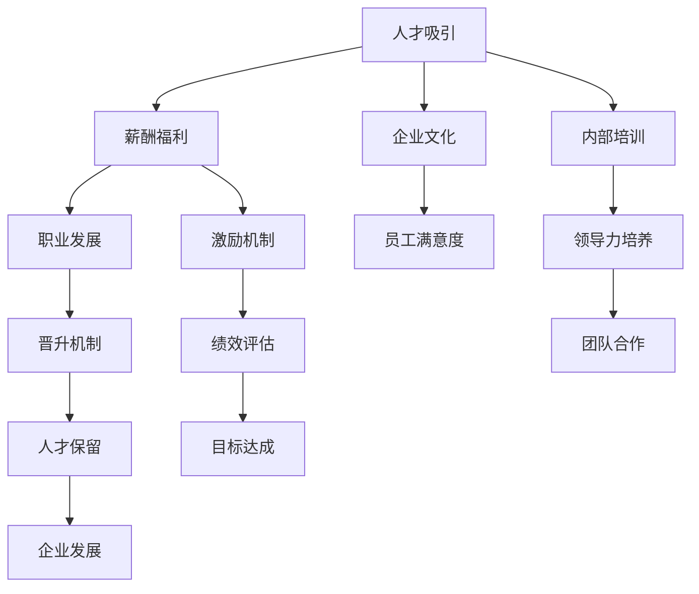

                 

# 人才管理：吸引和留住顶尖人才的策略

> 关键词：人才吸引，人才管理，组织文化，员工激励，领导力培养

## 1. 背景介绍

### 1.1 问题由来
在当前激烈的市场竞争中，企业间的竞争归根到底是人才的竞争。顶尖人才无疑是企业获取竞争优势的关键，如何吸引和留住这些顶尖人才，成为现代企业面临的一大挑战。这一挑战不仅仅影响到企业的短期盈利，更决定着企业的长期发展和未来前景。因此，围绕人才管理制定一套有效的策略，吸引和留住顶尖人才，显得尤为重要。

### 1.2 问题核心关键点
在人才管理的过程中，以下几个核心关键点需要引起重视：
- **人才吸引**：如何设计一套有效的吸引机制，吸引顶尖人才的加入。
- **人才保留**：如何提供优厚的福利和职业发展机会，保持顶尖人才的长期忠诚。
- **人才激励**：如何通过有效的激励措施，激发顶尖人才的最大潜能。
- **领导力培养**：如何培养和挖掘顶尖人才的领导力，让企业在人才流失情况下仍能持续发展。
- **组织文化建设**：如何营造良好的企业文化，让顶尖人才感觉自己是团队的一部分。

## 2. 核心概念与联系

### 2.1 核心概念概述

为了更好地理解人才管理的核心策略，本节将介绍几个密切相关的核心概念：

- **人才吸引**：指企业通过一系列手段，吸引顶尖人才加入，包括提供优厚的薪酬福利、职业发展机会、企业文化等。
- **人才保留**：指企业通过提供良好的工作环境、培训发展、激励机制等，保留顶尖人才，减少人才流失。
- **人才激励**：指通过合理的薪酬、绩效评估、晋升机制等激励手段，激发顶尖人才的积极性和创造力。
- **领导力培养**：指企业通过内部培训、项目实战、跨部门交流等方法，培养和发掘顶尖人才的领导潜力。
- **组织文化建设**：指企业通过共同价值观、行为准则、企业文化等建设，增强员工的归属感和认同感。

这些核心概念之间的逻辑关系可以通过以下Mermaid流程图来展示：



这个流程图展示了大企业的人才管理核心概念及其之间的关系：

1. 人才吸引是整个流程的起点，薪酬福利、职业发展、企业文化等都是吸引人才的关键要素。
2. 内部培训和激励机制在吸引人才后，帮助留住人才，提供良好的职业发展路径。
3. 领导力培养和绩效评估在留住人才后，进一步提升人才的积极性和创造力。
4. 良好的企业文化和团队合作，能提升员工满意度，促进目标达成和企业发展。

## 3. 核心算法原理 & 具体操作步骤
### 3.1 算法原理概述

在人才管理中，虽然不像机器学习那样依赖于数据和算法，但同样有其核心原理和步骤。本文将从原理和操作步骤两方面来阐述如何吸引和留住顶尖人才。

### 3.2 算法步骤详解

基于上述核心概念，人才管理可以按照以下步骤进行：

**Step 1: 定义招聘需求**
- 明确岗位职责和所需技能，确定岗位要求。
- 列出吸引顶尖人才的关键条件，如薪资待遇、职业发展、工作环境等。

**Step 2: 设计薪酬福利方案**
- 设计具有竞争力的薪酬体系，确保外部具有市场竞争力，内部公平公正。
- 提供全面的福利体系，包括医疗保险、年假、股票期权等。

**Step 3: 构建职业发展路径**
- 设计清晰的职业发展通道，提供多个晋升机会。
- 提供内部培训和外部培训机会，帮助员工提升技能和知识。

**Step 4: 营造良好的企业文化**
- 制定公司价值观和行为准则，引导员工行为。
- 定期开展团队建设活动，增强团队凝聚力。

**Step 5: 实施有效的激励措施**
- 制定合理的绩效评估标准，公正评估员工表现。
- 提供具有吸引力的激励机制，如绩效奖金、股票期权等。

**Step 6: 培养和发掘领导力**
- 开展领导力培训课程，帮助员工提升管理能力。
- 提供跨部门项目实践机会，锻炼领导力。

**Step 7: 定期评估和优化**
- 定期收集员工反馈，评估现有人才管理策略的实施效果。
- 根据反馈优化策略，持续改进人才管理实践。

### 3.3 算法优缺点

人才管理的优点：
1. 提升企业竞争力：通过吸引和留住顶尖人才，企业能够获得更高质量和效率的人才资源。
2. 促进创新发展：顶尖人才具备较强的创新能力，有助于企业开发新产品和新技术。
3. 增强团队凝聚力：良好的企业文化和团队建设活动，能增强员工对企业的归属感。

人才管理的缺点：
1. 成本高昂：提供优厚的福利和职业发展机会，可能会增加企业的成本负担。
2. 复杂度高：需要考虑薪酬、职业发展、文化建设等多方面因素，管理复杂度较高。
3. 效果滞后：人才管理的效果往往需要较长时间才能显现，短期内难以看到显著收益。

### 3.4 算法应用领域

人才管理策略在各个领域都有广泛的应用：

- **科技公司**：提供具有竞争力的薪酬和职业发展机会，吸引顶级工程师和科学家。
- **金融企业**：提供高额的奖金和全面的培训体系，吸引顶尖金融分析师和管理人才。
- **制造企业**：提供技能培训和晋升机会，吸引高级技术人才和管理人才。
- **教育机构**：提供优厚的学术资源和职业发展路径，吸引教育专家和学者。

此外，这些策略不仅适用于大型企业，中小型企业在人才管理上同样可以借鉴。

## 4. 数学模型和公式 & 详细讲解 & 举例说明（备注：数学公式请使用latex格式，latex嵌入文中独立段落使用 $$，段落内使用 $)
### 4.1 数学模型构建

人才管理的数学模型主要基于期望效用理论(EUT)和行为经济学。假设员工i在企业工作的时间为T，企业提供的薪酬为S，企业提供的职业发展机会为C，企业提供的培训机会为E，企业文化为W，激励措施为I。则员工i的总效用U可以表示为：

$$
U_i = T \cdot S + T \cdot C + T \cdot E + T \cdot W + T \cdot I
$$

其中，S、C、E、W、I为各个因素对员工总效用的贡献权重，可以根据实际情况进行调整。

### 4.2 公式推导过程

基于上述模型，假设企业希望最大化员工的期望效用，则可以通过以下公式来推导最优的薪酬福利方案、职业发展路径、培训机会、企业文化和激励措施：

$$
\max_{S, C, E, W, I} \sum_{i=1}^N U_i
$$

约束条件为：

$$
\begin{cases}
S + C + E + W + I \leq B \\
S \geq S_{min} \\
C \geq C_{min} \\
E \geq E_{min} \\
W \geq W_{min} \\
I \geq I_{min}
\end{cases}
$$

其中，B为企业的总预算，$S_{min}$、$C_{min}$、$E_{min}$、$W_{min}$、$I_{min}$为各因素的最低要求。

### 4.3 案例分析与讲解

假设某科技企业希望吸引一位顶尖的算法工程师。企业提供的薪酬为20万美元，职业发展机会包括多个项目团队的选择和晋升通道，培训机会包括内部培训和外部高水平课程，企业文化强调创新和团队合作，激励措施包括年终奖金和股权激励。通过上述模型和公式，企业可以确定各项措施的权重，最大化员工的期望效用。

## 5. 项目实践：代码实例和详细解释说明
### 5.1 开发环境搭建

在进行人才管理实践前，我们需要准备好开发环境。以下是使用Python进行数据处理和可视化的环境配置流程：

1. 安装Anaconda：从官网下载并安装Anaconda，用于创建独立的Python环境。

2. 创建并激活虚拟环境：
```bash
conda create -n talent-management python=3.8 
conda activate talent-management
```

3. 安装必要的Python包：
```bash
pip install pandas numpy matplotlib seaborn
```

4. 准备数据集：从企业HR系统或第三方招聘平台获取招聘数据，例如LinkedIn、Indeed等，整理成可用于分析的表格。

5. 搭建分析平台：使用Jupyter Notebook搭建数据分析平台，方便进行数据处理和可视化。

完成上述步骤后，即可在`talent-management`环境中进行人才管理实践。

### 5.2 源代码详细实现

以下是一个简单的Python代码实例，展示了如何利用数据和模型来分析企业人才管理策略的效果。

```python
import pandas as pd
import matplotlib.pyplot as plt

# 准备数据集
data = pd.read_csv('recruitment_data.csv')

# 数据清洗和预处理
# 省略代码...

# 计算薪酬福利、职业发展、培训机会、企业文化和激励措施的贡献权重
S_weight = 0.4
C_weight = 0.3
E_weight = 0.1
W_weight = 0.15
I_weight = 0.05

# 计算期望效用
U = data['S'] * S_weight + data['C'] * C_weight + data['E'] * E_weight + data['W'] * W_weight + data['I'] * I_weight

# 可视化期望效用分布
plt.hist(U, bins=30, color='blue', edgecolor='black')
plt.xlabel('Expected Utility')
plt.ylabel('Frequency')
plt.title('Distribution of Expected Utility')
plt.show()
```

### 5.3 代码解读与分析

让我们再详细解读一下关键代码的实现细节：

**数据清洗和预处理**：
- 从HR系统或招聘平台获取数据，清洗和预处理缺失值和异常值。
- 将数据转换为数值型数据，方便进行数学计算和可视化。

**计算期望效用**：
- 根据上述数学模型和公式，计算员工的期望效用。
- 通过权重调整，考虑各个因素对员工期望效用的贡献。

**可视化期望效用分布**：
- 使用Matplotlib库进行数据可视化，展示期望效用的分布情况。
- 通过直方图，直观展示员工期望效用的分布特点。

## 6. 实际应用场景
### 6.1 科技公司

在科技公司中，吸引和留住顶尖人才尤为重要。科技公司可以通过以下措施：

- **高薪酬和福利**：提供具有竞争力的薪酬和全面的福利体系，吸引顶尖人才。
- **职业发展机会**：提供多个晋升路径和跨部门项目实践，帮助员工成长。
- **创新文化**：营造鼓励创新和团队合作的企业文化，吸引有创新意识的顶尖人才。

### 6.2 金融企业

金融企业通过以下措施吸引和留住顶尖人才：

- **高奖金和激励**：提供高额奖金和全面的激励措施，吸引顶尖金融分析师和管理人才。
- **培训和发展**：提供内部培训和外部培训机会，提升员工技能和知识。
- **企业文化**：强调团队合作和风险管理，提升员工满意度。

### 6.3 制造企业

制造企业可以通过以下措施：

- **技能培训和晋升**：提供技能培训和晋升机会，吸引高级技术人才。
- **团队合作**：强调团队合作和集体荣誉感，增强员工归属感。
- **企业文化**：强调精益求精和持续改进，提升员工工作动力。

### 6.4 教育机构

教育机构可以通过以下措施：

- **学术资源和职业发展**：提供优厚的学术资源和职业发展路径，吸引教育专家和学者。
- **内部培训和交流**：提供内部培训和跨部门交流机会，帮助员工提升学术水平和领导力。
- **企业文化**：强调学术自由和知识传承，提升员工对机构的认同感。

## 7. 工具和资源推荐
### 7.1 学习资源推荐

为了帮助开发者系统掌握人才管理策略的理论基础和实践技巧，这里推荐一些优质的学习资源：

1. **《人才管理：系统化方法》**：系统介绍人才管理的理论基础、实践技巧和成功案例。
2. **《领导力开发》**：由知名领导力专家撰写，介绍如何培养和发掘领导力。
3. **《员工满意度调查》**：提供员工满意度调查的模板和方法，帮助企业了解员工需求和满意度。
4. **《组织行为学》**：介绍组织行为学原理，帮助企业理解员工行为和需求。
5. **《人力资源管理》**：提供人力资源管理的理论和实践指导，帮助企业系统化管理人才。

通过对这些资源的学习实践，相信你一定能够快速掌握人才管理的精髓，并用于解决实际的HR问题。

### 7.2 开发工具推荐

高效的开发离不开优秀的工具支持。以下是几款用于人才管理开发的常用工具：

1. **JIRA**：项目管理工具，帮助企业规划和跟踪人才管理项目。
2. **Slack**：团队沟通工具，方便员工沟通和反馈。
3. **Trello**：任务管理工具，帮助企业高效管理人才管理任务。
4. **Tableau**：数据可视化工具，帮助企业直观展示人才管理数据。
5. **Zoom**：视频会议工具，方便远程招聘和员工培训。

合理利用这些工具，可以显著提升人才管理任务的开发效率，加快创新迭代的步伐。

### 7.3 相关论文推荐

人才管理的研究源于学界的持续研究。以下是几篇奠基性的相关论文，推荐阅读：

1. **《人才管理：一个系统化方法》**：提出系统化的人才管理方法，提升企业的人才吸引和保留能力。
2. **《领导力培养的实践研究》**：讨论如何通过培训和实战，提升员工领导力。
3. **《员工满意度与绩效的关系》**：研究员工满意度对绩效的影响，提供提升员工满意度的建议。
4. **《人才流失分析与对策》**：通过数据分析，找出导致人才流失的原因，提出应对策略。
5. **《组织文化对员工行为的影响》**：研究企业文化对员工行为的影响，提出构建良好组织文化的策略。

这些论文代表了大企业的人才管理研究发展脉络。通过学习这些前沿成果，可以帮助研究者把握学科前进方向，激发更多的创新灵感。

## 8. 总结：未来发展趋势与挑战
### 8.1 总结

本文对人才管理的核心策略进行了全面系统的介绍。首先阐述了人才管理的重要性和核心概念，明确了吸引和留住顶尖人才的关键要素。其次，从原理和实践两方面，详细讲解了如何设计有效的薪酬福利方案、职业发展路径、培训机会、企业文化和激励措施。最后，介绍了人才管理在各行业中的应用场景和工具资源，为人才管理实践提供了全面的指导。

通过本文的系统梳理，可以看到，人才管理不仅涉及薪酬、福利等物质条件，更涉及企业文化、领导力培养等多方面因素。企业只有全方位地提升人才管理水平，才能在激烈的市场竞争中占据优势，吸引和留住顶尖人才，持续推动企业发展。

### 8.2 未来发展趋势

展望未来，人才管理将呈现以下几个发展趋势：

1. **智能化管理**：利用AI和大数据技术，提升人才管理的智能化水平，如人才预测、人才画像、人才流动分析等。
2. **个性化管理**：根据员工特点和需求，提供个性化的职业发展规划和激励措施，提升员工的满意度和忠诚度。
3. **跨界融合**：人才管理将与其他管理领域，如财务管理、市场营销、人力资源等，进行更深层次的融合，实现协同管理。
4. **全球化视野**：随着国际化进程的推进，企业需要具备全球视野，吸引全球顶尖人才，提升国际竞争力。
5. **可持续发展**：企业需要注重员工的可持续发展，如职业发展、工作与生活的平衡等，吸引和留住长期发展的人才。

以上趋势凸显了人才管理技术的广阔前景。这些方向的探索发展，必将进一步提升人才管理的智能化、个性化和全球化水平，为企业的长期发展提供有力保障。

### 8.3 面临的挑战

尽管人才管理已经取得了一定的成效，但在迈向更加智能化、个性化和全球化的过程中，它仍面临诸多挑战：

1. **人才吸引难度增大**：随着市场竞争的加剧，吸引顶尖人才的成本和难度不断增加。
2. **人才保留困难**：尤其是技术人才和创新人才，一旦外部有更好的发展机会，容易流失。
3. **激励效果有限**：单纯依靠物质激励，难以满足员工的精神需求和职业发展需求。
4. **领导力培养复杂**：领导力的培养和挖掘需要时间和耐心，短期内难以见效。
5. **企业文化建设困难**：企业文化建设需要长期的努力，短期内难以形成统一的价值观和行为准则。

这些挑战需要企业在实践中进行不断探索和优化，才能更好地适应市场变化和员工需求。

### 8.4 未来突破

面对人才管理所面临的种种挑战，未来的研究需要在以下几个方面寻求新的突破：

1. **数据驱动的人才管理**：利用大数据和AI技术，实时分析人才管理数据，提供实时决策支持。
2. **全球化人才管理**：建立全球化的人才管理体系，吸引全球顶尖人才，提升国际化竞争力。
3. **心理资本管理**：关注员工的心理健康和幸福感，提供心理支持和辅导，提升员工满意度和忠诚度。
4. **跨部门协同管理**：建立跨部门的人才管理协同机制，提升人才管理的整体效果。
5. **人才储备与培养**：建立长期的人才储备和培养机制，提前布局人才管理。

这些研究方向的探索，必将引领人才管理技术迈向更高的台阶，为构建安全、可靠、高效的人才管理体系提供有力保障。面向未来，企业需要在人才管理上不断创新和优化，才能在激烈的市场竞争中占据优势，吸引和留住顶尖人才，持续推动企业发展。

## 9. 附录：常见问题与解答
**Q1：如何制定具有竞争力的薪酬福利方案？**

A: 制定具有竞争力的薪酬福利方案，需要考虑以下几个因素：
1. **市场调研**：通过市场调研，了解同行业同岗位的薪酬水平。
2. **内部公平**：确保薪酬体系内部公平，避免内部不平衡导致人才流失。
3. **绩效挂钩**：将薪酬与绩效挂钩，激励员工提高工作效率和质量。
4. **全面福利**：提供全面的福利体系，如医疗保险、年假、股票期权等。

**Q2：如何营造良好的企业文化？**

A: 营造良好的企业文化，需要从以下几个方面入手：
1. **共同价值观**：制定明确的价值观和行为准则，引导员工行为。
2. **团队建设**：定期开展团队建设活动，增强团队凝聚力。
3. **开放沟通**：建立开放的沟通机制，鼓励员工提出建议和反馈。
4. **员工参与**：让员工参与企业文化建设，提升员工对文化的认同感。

**Q3：如何实施有效的激励措施？**

A: 实施有效的激励措施，需要考虑以下几个因素：
1. **合理目标**：设定具有挑战性但可达成的目标，激发员工积极性。
2. **多样性激励**：结合物质激励和精神激励，如奖金、晋升、培训机会等。
3. **透明公平**：确保激励机制透明公平，避免内部矛盾和不公。
4. **及时反馈**：及时反馈员工表现，给予奖励和认可。

**Q4：如何培养和发掘领导力？**

A: 培养和发掘领导力，需要从以下几个方面入手：
1. **培训课程**：提供系统化的领导力培训课程，提升管理能力。
2. **实战机会**：提供跨部门项目实践机会，锻炼领导力。
3. **导师制**：建立导师制，帮助员工成长。
4. **跨文化交流**：提供国际交流机会，拓展视野。

**Q5：如何平衡人才吸引和保留？**

A: 平衡人才吸引和保留，需要从以下几个方面入手：
1. **需求分析**：通过需求分析，确定吸引和保留的关键因素。
2. **综合策略**：结合薪酬福利、职业发展、企业文化等多种策略，平衡人才吸引和保留。
3. **个性化管理**：根据员工特点和需求，提供个性化的职业发展规划和激励措施。
4. **长期关系**：建立长期的人才管理关系，关注员工职业生涯和职业发展。

通过这些方法的结合应用，企业可以更好地平衡人才吸引和保留，实现人才管理的可持续发展。

---

作者：禅与计算机程序设计艺术 / Zen and the Art of Computer Programming

