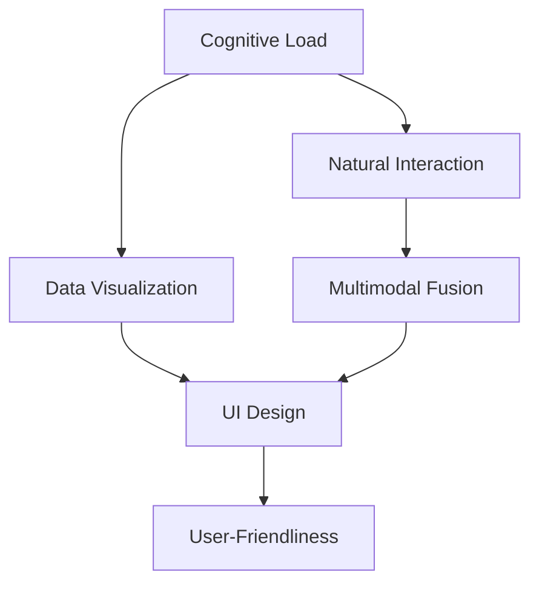

                 

# 人机交互：设计高效的人类计算系统

> 关键词：人机交互, 人类计算系统, 认知负荷, 自然交互, 多通道融合, 数据可视化, 界面设计, 用户友好

## 1. 背景介绍

### 1.1 问题由来
随着技术的迅猛发展，现代计算机系统在处理数据和执行任务上已经达到了极高的速度和精度，但与人类的交互方式仍然停留在传统的键盘、鼠标、触摸屏等层面，导致了人机交互的瓶颈问题，制约了计算系统性能的全面发挥。如何在计算系统与人之间建立起更高效、自然的交互方式，释放人类潜力，成为当前人机交互研究的一个重要课题。

### 1.2 问题核心关键点
当前人机交互的核心问题包括：
1. **认知负荷**：人类大脑处理信息的能力是有限的，复杂的交互流程可能增加认知负担，影响工作效率和用户体验。
2. **自然交互**：传统的文本输入和界面操作方式缺乏自然性，与现实世界的交互体验存在较大差异。
3. **多通道融合**：单一的交互方式无法充分利用人的感官，融合多通道（如视觉、听觉、触觉等）可以显著提升交互效率和用户体验。
4. **数据可视化**：复杂数据的直观展示是提高理解力和决策力的重要手段，合理的可视化可以显著减轻认知负荷。
5. **界面设计**：界面设计的好坏直接影响用户的使用体验和操作效率，良好的界面设计能够降低使用难度，提高工作效率。
6. **用户友好性**：界面和交互方式应尽可能贴近用户习惯，降低使用门槛，提高使用便捷性。

### 1.3 问题研究意义
设计高效的人机交互系统，能够有效降低认知负荷，提升工作和学习效率，优化用户体验，具有重要的研究和应用价值：

1. **提升生产力**：减少人机交互过程中的认知负担，提高工作效率和产出量。
2. **改善用户体验**：通过自然交互和多通道融合，使用户操作更加便捷，提升满意度。
3. **推动科技应用**：更高效的人机交互界面可以推动各类科技产品的普及和应用，促进社会进步。
4. **促进人机融合**：通过设计合理的交互方式，促进人与机器的深度融合，推动人工智能、机器人等技术的发展。

## 2. 核心概念与联系

### 2.1 核心概念概述

为更好地理解人机交互系统，本节将介绍几个密切相关的核心概念：

- **认知负荷(Cognitive Load)**：指人类在信息处理过程中所承担的心理负担，包括注意力、记忆和理解等方面的负担。过高的认知负荷会降低工作效率和学习效果。
- **自然交互(Natural Interaction)**：通过模拟自然界中的人类行为和感官输入，提供更加直观、自然的交互方式。
- **多通道融合(Multimodal Fusion)**：将视觉、听觉、触觉等多种感官通道的信息进行整合，提升交互效率和体验。
- **数据可视化(Data Visualization)**：将复杂数据转换为直观的图形或图表，帮助用户更好地理解和分析信息。
- **界面设计(UI Design)**：用户界面设计的好坏直接影响用户体验和操作效率，良好的界面设计能够降低使用难度，提高使用便捷性。
- **用户友好性(User-Friendliness)**：界面和交互方式应尽可能贴近用户习惯，降低使用门槛，提高使用便捷性。

这些核心概念之间的逻辑关系可以通过以下Mermaid流程图来展示：



这个流程图展示了一系列与认知负荷相关联的概念，以及它们之间的相互关系：

1. 认知负荷是设计自然交互的基础，通过减少认知负荷提升工作效率。
2. 自然交互可以通过数据可视化进一步优化，提升信息的直观理解。
3. 多通道融合能更自然地反映用户的交互需求，提高系统的智能化和友好性。
4. 界面设计是构建用户友好系统的关键，确保系统操作的便捷性和易用性。
5. 用户友好性是评价系统可用性的标准，不断提升用户的使用体验。

## 3. 核心算法原理 & 具体操作步骤

### 3.1 算法原理概述

设计高效的人机交互系统，其核心思想是通过多种技术手段降低认知负荷，提升交互的自然性和多通道融合程度，同时采用数据可视化和界面设计等方法优化用户体验。

具体而言，算法原理可以概括为以下几个方面：

- **认知负荷降低**：通过自然交互和多通道融合，减少用户对复杂操作的认知负担。
- **自然交互设计**：设计符合人类自然行为模式的交互方式，如手势、语音、眼动等。
- **数据可视化优化**：合理设计图形和界面，将复杂数据转换为直观易懂的可视化形式。
- **界面设计优化**：采用合理的布局和交互方式，降低操作难度，提升使用效率。

### 3.2 算法步骤详解

基于上述原理，设计高效的人机交互系统一般包括以下几个关键步骤：

**Step 1: 用户需求分析**
- 收集用户反馈和行为数据，理解用户需求和使用场景。
- 分析用户操作流程，识别出可能造成认知负荷和操作障碍的环节。

**Step 2: 设计交互框架**
- 选择合适的交互方式，如手势、语音、眼动等。
- 确定多通道融合的策略，决定哪些信息可以通过哪些通道输入。

**Step 3: 数据可视化设计**
- 确定数据可视化的目标，选择合适的图形和图表形式。
- 设计交互式可视化界面，如可拖动、缩放、旋转等操作。

**Step 4: 界面设计**
- 进行UI设计，采用符合用户习惯的布局和操作方式。
- 考虑用户界面的美观性和一致性，确保系统的整体风格统一。

**Step 5: 系统集成与测试**
- 将设计好的交互方式和界面集成到系统中。
- 进行系统测试，确保系统的稳定性和可用性。
- 收集用户反馈，不断优化系统。

**Step 6: 用户培训与引导**
- 为用户提供必要的培训和引导，确保其熟悉新系统的使用方法。
- 设计交互指南和帮助文档，便于用户自助使用。

**Step 7: 系统迭代与优化**
- 根据用户反馈，不断迭代优化系统。
- 定期更新系统，保持技术的前沿性。

### 3.3 算法优缺点

高效的人机交互系统设计具有以下优点：
1. **提升工作效率**：通过自然交互和多通道融合，减少认知负荷，提高操作效率。
2. **改善用户体验**：直观易懂的可视化界面和操作方式，提升用户满意度。
3. **提高系统的智能化**：多通道融合和数据可视化可以更自然地反映用户需求，提升系统的智能化和响应速度。

同时，该系统设计也存在一定的局限性：
1. **技术复杂性**：多通道融合和数据可视化技术的实现较为复杂，需要较高的技术投入。
2. **用户适应性**：新系统需要用户有一定的学习和适应时间，短期内可能存在使用障碍。
3. **成本高**：系统设计和实现的成本较高，需要投入大量的研发资源。
4. **扩展性差**：多通道融合和数据可视化需要系统整体设计和集成，难以扩展。

尽管存在这些局限性，但高效人机交互系统设计在现代科技应用中具有重要价值，可以显著提升系统的性能和用户体验。

### 3.4 算法应用领域

高效的人机交互系统设计已经在多个领域得到了应用，如医疗、教育、工业控制、智能家居等。这些领域中，高效交互系统设计的应用实例包括：

- **医疗领域**：在电子病历系统设计中，采用自然交互和多通道融合，提高医生和护士的工作效率和信息获取能力。
- **教育领域**：在教育软件设计中，通过数据可视化和用户友好的界面设计，提升教师和学生的教学和学习体验。
- **工业控制**：在工业控制系统设计中，采用多通道交互界面，提高操作效率和设备维护的便捷性。
- **智能家居**：在智能家居系统设计中，通过语音和手势控制，提升用户的生活便利性和舒适度。

除了上述这些经典领域外，高效人机交互系统设计还在更多新兴领域得到应用，如虚拟现实、增强现实、智能交通等，为各行各业带来创新性的体验和服务。

## 4. 数学模型和公式 & 详细讲解  
### 4.1 数学模型构建

本节将使用数学语言对高效人机交互系统设计的理论基础进行严格的刻画。

设用户操作任务为 $T$，系统提供的交互方式为 $I$，设计目标为 $O$。系统设计的目标是最大化用户满意度和操作效率，数学模型可以表示为：

$$
\max_{O, I} \left( \mathcal{U}(T, O, I) \right)
$$

其中，$\mathcal{U}$ 表示用户满意度函数，$T$ 和 $I$ 分别表示用户任务和系统交互方式，$O$ 表示设计目标，包括界面设计、数据可视化、多通道融合等。

用户满意度函数 $\mathcal{U}$ 可以分解为若干子函数，例如：

$$
\mathcal{U}(T, O, I) = \mathcal{U}_{UI}(O) + \mathcal{U}_{VI}(T, O) + \mathcal{U}_{MI}(T, O)
$$

其中 $\mathcal{U}_{UI}$ 表示用户界面设计的满意度，$\mathcal{U}_{VI}$ 表示数据可视化的满意度，$\mathcal{U}_{MI}$ 表示多通道融合的满意度。

### 4.2 公式推导过程

以下我们以自然交互界面设计为例，推导用户满意度函数的计算公式。

假设用户任务 $T$ 可以分解为若干步骤 $T=\{T_1, T_2, ..., T_n\}$，每个步骤对应的操作时间 $t_i$ 和认知负荷 $c_i$ 可以表示为：

$$
t_i = f_i(O, I) \\
c_i = g_i(O, I)
$$

其中 $f_i$ 和 $g_i$ 分别表示操作时间和认知负荷的函数，$O$ 和 $I$ 分别表示设计和交互方式。

用户满意度函数 $\mathcal{U}_{UI}$ 可以表示为：

$$
\mathcal{U}_{UI}(O) = -\sum_{i=1}^n \left( \alpha_i t_i + \beta_i c_i \right)
$$

其中 $\alpha_i$ 和 $\beta_i$ 分别表示操作时间和认知负荷的权重，可以根据用户反馈调整。

### 4.3 案例分析与讲解

我们以智能医疗系统为例，展示如何通过高效人机交互设计提升用户体验。

假设智能医疗系统的设计目标是提高医生的诊断效率和患者的就诊体验。系统设计包括交互方式、界面布局和数据可视化等方面。

1. **交互方式设计**：采用语音和手势交互，减少医生和患者的键盘和鼠标操作，降低认知负荷。
2. **界面布局设计**：将病历信息和患者信息合理布局，采用分屏和滚动条等方式，提高信息的访问效率。
3. **数据可视化设计**：通过图表和动画展示患者的健康数据，帮助医生直观理解患者的健康状况，减少误诊和漏诊。

在用户满意度函数 $\mathcal{U}_{UI}$ 中，操作时间 $t_i$ 和认知负荷 $c_i$ 可以表示为：

$$
t_i = f_i(O, I) = \begin{cases}
0.1 \text{ 秒}, & \text{语音或手势操作} \\
1 \text{ 秒}, & \text{鼠标或键盘操作}
\end{cases} \\
c_i = g_i(O, I) = \begin{cases}
0.5, & \text{语音或手势操作} \\
1.2, & \text{鼠标或键盘操作}
\end{cases}
$$

权重 $\alpha_i$ 和 $\beta_i$ 可以根据实际反馈调整，例如：

$$
\alpha_i = 0.8, \beta_i = 0.2
$$

根据上述公式，计算得到用户满意度函数 $\mathcal{U}_{UI}$ 为：

$$
\mathcal{U}_{UI}(O) = -\sum_{i=1}^n \left( 0.8 \cdot f_i(O, I) + 0.2 \cdot g_i(O, I) \right)
$$

通过优化操作时间和认知负荷，最大化用户满意度函数 $\mathcal{U}_{UI}$，从而提升智能医疗系统的用户友好性和操作效率。

## 5. 项目实践：代码实例和详细解释说明
### 5.1 开发环境搭建

在进行高效人机交互系统设计时，需要先准备好开发环境。以下是使用Python进行交互系统开发的环境配置流程：

1. 安装Anaconda：从官网下载并安装Anaconda，用于创建独立的Python环境。

2. 创建并激活虚拟环境：
```bash
conda create -n ui-design-env python=3.8 
conda activate ui-design-env
```

3. 安装必要的工具包：
```bash
pip install pandas numpy matplotlib scikit-learn tensorflow
```

4. 安装交互设计库：
```bash
pip install pyviz pyplot pysurfy
```

5. 安装数据可视化库：
```bash
pip install plotly dash pyecharts
```

完成上述步骤后，即可在`ui-design-env`环境中开始开发实践。

### 5.2 源代码详细实现

这里我们以医疗健康数据可视化为例，展示使用Python和PyViz库进行界面设计和数据可视化的代码实现。

首先，定义数据处理函数：

```python
import pandas as pd
import numpy as np

def load_data():
    # 加载医疗健康数据
    data = pd.read_csv('health_data.csv')
    return data
```

然后，设计界面布局：

```python
import dash
import dash_core_components as dcc
import dash_html_components as html
from dash.dependencies import Input, Output

app = dash.Dash(__name__)

app.layout = html.Div([
    html.H1('Medical Health Data Visualization'),
    dcc.Graph(id='health_graph'),
    html.Div([
        html.Label('Time Period:'),
        dcc.RangeSlider(
            id='time_range',
            min=0,
            max=365,
            value=[0, 365],
            marks={i: str(i) for i in range(0, 366, 30)}
        )
    ]),
    html.Div([
        html.Label('Patient ID:'),
        dcc.Input(id='patient_id', type='text', value='12345')
    ])
])

app.callback(
    Output('health_graph', 'figure'),
    [Output('time_range', 'value'),
     Output('patient_id', 'value')]
)

def plot_health_data(time_range, patient_id):
    # 处理时间范围和患者ID
    # 返回可视化的图表
    pass
```

接着，实现数据可视化的回调函数：

```python
@app.callback(
    Output('health_graph', 'figure'),
    [Input('time_range', 'value'),
     Input('patient_id', 'value')]
)

def plot_health_data(time_range, patient_id):
    # 加载数据
    data = load_data()
    # 筛选时间范围和患者ID
    filtered_data = data[(data['time'] >= time_range[0]) & (data['time'] <= time_range[1])]
    # 筛选患者ID
    filtered_data = filtered_data[filtered_data['patient_id'] == patient_id]
    # 可视化处理
    fig = plot_health_data(filtered_data)
    return fig
```

最后，启动交互系统：

```python
if __name__ == '__main__':
    app.run_server(debug=True)
```

运行上述代码后，可以在浏览器中访问http://localhost:8050，看到设计的交互界面和数据可视化图表。

### 5.3 代码解读与分析

让我们再详细解读一下关键代码的实现细节：

**load_data函数**：
- 加载医疗健康数据，并将其转换为DataFrame格式，方便后续处理。

**app.layout定义**：
- 定义交互系统的布局，包括标题、图表、时间范围选择器和患者ID输入框。
- 使用Dash库的Graph和Input组件，创建交互式的图表和输入框。

**app.callback定义**：
- 定义回调函数，当用户操作时间范围选择器和患者ID输入框时，重新计算并显示图表。
- 使用Output和Input参数，将时间范围和患者ID传递给plot_health_data函数，重新生成图表。

**plot_health_data函数**：
- 处理时间范围和患者ID，筛选出符合条件的健康数据。
- 调用可视化函数，生成图表对象，并返回。

### 5.4 运行结果展示

运行上述代码后，可以在浏览器中看到设计的交互界面和数据可视化图表。用户可以通过滑块和输入框选择时间范围和患者ID，实时查看对应的健康数据图表，实现自然交互和多通道融合，提升用户体验和操作效率。

## 6. 实际应用场景
### 6.1 智能医疗系统

高效人机交互系统设计在智能医疗系统中具有重要应用价值。通过设计自然交互和多通道融合的界面，可以有效提升医生的诊断效率和患者的治疗体验。

在智能医疗系统中，医生可以通过语音和手势控制系统，快速浏览患者病历，查看健康数据，进行诊断和治疗。患者可以通过触摸屏或手势输入，进行病情描述和反馈，与医生进行互动。系统还可以结合智能推荐和个性化医疗，提高诊疗的精准度和效率。

### 6.2 工业控制系统

工业控制系统是人机交互的重要应用场景。通过高效交互系统设计，可以有效提升操作效率和设备维护的便捷性。

在工业控制系统中，操作员可以通过触摸屏或手势控制，快速启动、停止、调整设备，监控生产流程。系统还可以根据操作员的手势和表情，自动调整工作参数，优化生产过程。通过数据可视化和交互式界面，操作员可以实时监控设备的运行状态，及时发现和解决问题，提升生产效率和设备利用率。

### 6.3 教育软件系统

教育软件是高效人机交互系统设计的另一个重要应用领域。通过设计用户友好的界面和自然交互方式，可以有效提升教师和学生的学习体验。

在教育软件中，教师可以通过手势控制和语音命令，快速切换课程内容，播放多媒体资源，进行互动教学。学生可以通过触摸屏或手势输入，进行知识点的学习，参与互动讨论，提高学习效果。系统还可以根据学生的学习行为和反馈，提供个性化的学习建议和资源推荐，提升学习效率和质量。

### 6.4 未来应用展望

展望未来，高效人机交互系统设计将有以下几个发展趋势：

1. **人工智能融合**：将人工智能技术融入人机交互系统设计，提升系统的智能水平和用户满意度。
2. **多模态交互**：通过融合视觉、听觉、触觉等多通道信息，提升系统的自然交互能力。
3. **数据驱动设计**：利用大数据和用户反馈，优化系统设计和交互方式，提升用户体验。
4. **个性化定制**：根据用户需求和偏好，设计个性化的交互界面和操作方式，提升系统的适应性和灵活性。
5. **增强现实和虚拟现实**：结合增强现实和虚拟现实技术，提升交互系统的沉浸感和互动性。
6. **远程协作**：支持远程协作和团队协同，提升团队工作效率和沟通效率。

这些趋势将引领高效人机交互系统设计走向更高的水平，为各行各业带来创新性的体验和服务。

## 7. 工具和资源推荐
### 7.1 学习资源推荐

为了帮助开发者系统掌握高效人机交互系统设计的理论基础和实践技巧，这里推荐一些优质的学习资源：

1. 《Human-Computer Interaction》教材：详细介绍了人机交互的基本概念和设计原则。
2. 《Interaction Design Foundation》在线课程：涵盖了交互设计的全流程，包括用户研究、设计思维、原型制作等。
3. 《Designing Interfaces》书籍：介绍了界面设计的最佳实践和设计原则。
4. 《Data Visualization with Python》课程：介绍如何使用Python和库进行数据可视化，提升图表设计和可视化能力。
5. 《Natural Interaction Design》博客：分享自然交互设计的最新研究和实践案例，深入探讨多通道融合和数据可视化技术。

通过对这些资源的学习实践，相信你一定能够快速掌握高效人机交互系统设计的精髓，并用于解决实际的交互问题。

### 7.2 开发工具推荐

高效的开发离不开优秀的工具支持。以下是几款用于人机交互系统开发的常用工具：

1. Python：强大的编程语言，易于实现交互系统和数据分析功能。
2. Dash：Python数据可视化库，方便创建交互式的Web应用程序。
3. PyViz：Python可视化库，支持多维数据可视化。
4. Plotly：高性能的交互式图表库，支持多种图表类型和交互效果。
5. PyEcharts：中文可视化库，支持丰富的图表和动画效果。
6. Sketch：专业的UI设计工具，方便绘制界面原型和交互流程图。
7. Adobe XD：专业的界面设计工具，支持快速创建原型和互动效果。
8. SketchUp：三维建模工具，支持创建复杂的三维交互界面。

合理利用这些工具，可以显著提升人机交互系统设计的开发效率，加快创新迭代的步伐。

### 7.3 相关论文推荐

人机交互研究是学界的持续热点，以下是几篇奠基性的相关论文，推荐阅读：

1. A Framework for Human-Computer Interaction (HCI)：Mark B. DeLucchi和Fred P. Bloch，为HCI研究提供了全面的框架和理论基础。
2. Designing Interactive Systems（第2版）：Jared Spool，详细介绍了交互设计的实践和案例。
3. Human-Computer Interaction：Trevor P. Kite和Shavali D. Sahai，系统介绍了人机交互的研究方向和应用场景。
4. Interactive Information Seeking and Task Solving：Larry E. Gass和Yan Xie，介绍了交互信息寻求和任务解决的理论和实践。
5. Human-Computer Interaction with Natural Multimodal Displays：M. Geneen和J.D. Beale，探讨了多模态交互技术的理论基础和实现方法。

这些论文代表了大规模人机交互设计的发展脉络，通过学习这些前沿成果，可以帮助研究者把握学科前进方向，激发更多的创新灵感。

## 8. 总结：未来发展趋势与挑战

### 8.1 总结

本文对高效人机交互系统设计进行了全面系统的介绍。首先阐述了高效人机交互系统设计的背景和意义，明确了设计的目标和关键点。其次，从原理到实践，详细讲解了高效人机交互系统设计的数学模型和具体步骤，给出了交互系统开发的完整代码实例。同时，本文还广泛探讨了高效交互系统设计在智能医疗、工业控制、教育软件等多个行业领域的应用前景，展示了高效人机交互设计的广泛价值。

通过本文的系统梳理，可以看到，高效人机交互系统设计在提升系统性能和用户体验方面具有重要意义。未来，伴随技术的不断进步和应用的不断拓展，高效人机交互系统设计必将成为提升各行业应用效率和服务水平的关键技术。

### 8.2 未来发展趋势

展望未来，高效人机交互系统设计将呈现以下几个发展趋势：

1. **人工智能融合**：将人工智能技术融入交互设计，提升系统的智能水平和用户满意度。
2. **多模态交互**：通过融合视觉、听觉、触觉等多通道信息，提升系统的自然交互能力。
3. **数据驱动设计**：利用大数据和用户反馈，优化系统设计和交互方式，提升用户体验。
4. **个性化定制**：根据用户需求和偏好，设计个性化的交互界面和操作方式，提升系统的适应性和灵活性。
5. **增强现实和虚拟现实**：结合增强现实和虚拟现实技术，提升交互系统的沉浸感和互动性。
6. **远程协作**：支持远程协作和团队协同，提升团队工作效率和沟通效率。

这些趋势将引领高效人机交互系统设计走向更高的水平，为各行各业带来创新性的体验和服务。

### 8.3 面临的挑战

尽管高效人机交互系统设计已经取得了瞩目成就，但在迈向更加智能化、普适化应用的过程中，它仍面临诸多挑战：

1. **技术复杂性**：多通道融合和数据可视化技术的实现较为复杂，需要较高的技术投入。
2. **用户适应性**：新系统需要用户有一定的学习和适应时间，短期内可能存在使用障碍。
3. **成本高**：系统设计和实现的成本较高，需要投入大量的研发资源。
4. **扩展性差**：多通道融合和数据可视化需要系统整体设计和集成，难以扩展。
5. **安全性**：交互系统的安全性问题，如数据隐私和网络安全，需要引起足够重视。

尽管存在这些挑战，但高效人机交互系统设计在现代科技应用中具有重要价值，可以显著提升系统的性能和用户体验。

### 8.4 未来突破

面对高效人机交互系统设计所面临的挑战，未来的研究需要在以下几个方面寻求新的突破：

1. **技术创新**：开发更高效、更灵活的多通道融合和数据可视化技术，降低技术实现难度和成本。
2. **用户体验优化**：通过用户研究，不断优化系统设计和交互方式，提升用户体验和系统可用性。
3. **安全性保障**：设计安全可靠的数据传输和存储机制，确保用户数据和系统的安全性。
4. **实时交互优化**：优化实时交互和响应机制，提升系统的实时性和稳定性。
5. **跨平台兼容性**：设计跨平台兼容的交互系统，支持多种设备和操作系统。

这些研究方向的探索，必将引领高效人机交互系统设计迈向更高的台阶，为构建高效、智能、安全的人机交互系统铺平道路。面向未来，高效人机交互系统设计还需要与其他人工智能技术进行更深入的融合，如知识表示、因果推理、强化学习等，多路径协同发力，共同推动人工智能技术的发展。只有勇于创新、敢于突破，才能不断拓展人机交互系统的边界，让智能技术更好地造福人类社会。

## 9. 附录：常见问题与解答

**Q1：高效人机交互系统设计是否适用于所有应用场景？**

A: 高效人机交互系统设计在大多数应用场景中都能提升用户体验和操作效率，但并非所有场景都适合。例如，对于需要高度安全性和实时性的场景，如金融交易、医疗诊断等，还需要考虑系统的安全性和可靠性。

**Q2：如何选择最适合的交互方式？**

A: 选择最适合的交互方式需要考虑多个因素，包括用户习惯、任务特点、设备性能等。可以通过用户调研和A/B测试，了解用户对不同交互方式的偏好和接受度，从而选择最适合的系统设计方案。

**Q3：如何降低用户的学习成本？**

A: 降低用户的学习成本是高效人机交互系统设计的关键目标之一。可以通过设计合理的用户引导和帮助文档，提供交互式教程和演示，逐步引导用户熟悉系统。同时，采用用户友好的界面设计和自然交互方式，可以减少用户的操作步骤和认知负荷。

**Q4：如何保证系统的可扩展性和维护性？**

A: 保证系统的可扩展性和维护性需要在设计阶段充分考虑模块化和标准化。采用模块化设计，将不同的交互方式和可视化模块独立开发和集成，便于后续的扩展和维护。同时，建立标准化的接口和数据格式，方便不同模块之间的协同工作。

**Q5：如何确保系统的安全性？**

A: 确保系统的安全性需要在设计阶段充分考虑数据隐私和安全机制。采用加密传输、访问控制等安全措施，保护用户数据和系统安全。同时，定期进行安全漏洞扫描和修复，确保系统的稳定性。

总之，高效人机交互系统设计需要充分考虑用户需求、任务特点和系统性能，通过技术创新和用户体验优化，提升系统的智能化和友好性。未来，随着技术的不断进步和应用的不断拓展，高效人机交互系统设计必将成为提升各行业应用效率和服务水平的关键技术。

---

作者：禅与计算机程序设计艺术 / Zen and the Art of Computer Programming

