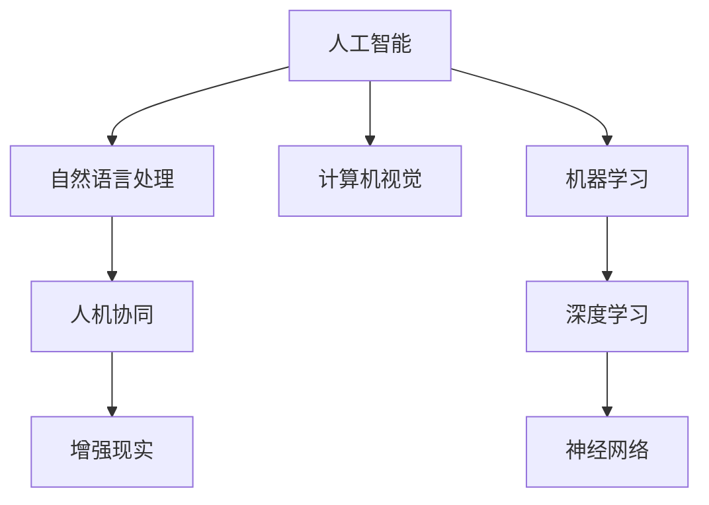
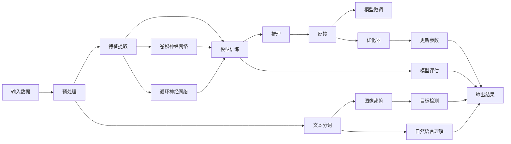

                 

# 人机协同：未来工作的核心驱动力

## 1. 背景介绍

在飞速发展的技术革命浪潮中，人工智能（AI）和人类智能的融合已经成为不可逆转的大趋势。这一变革不仅深刻地影响了产业结构，也对工作方式和组织形态产生了深远影响。人工智能技术的飞速发展，特别是深度学习、自然语言处理、计算机视觉等领域的突破，为实现人机协同提供了坚实的基础。本专题将系统介绍人工智能技术在实际工作场景中的应用，探讨未来工作方式的发展趋势和面临的挑战。

## 2. 核心概念与联系

### 2.1 核心概念概述

本专题将围绕以下几个核心概念进行详细讨论：

- **人工智能（AI）**：指通过计算机系统模拟人类智能行为的能力，包括学习、推理、自我修正、感知、语言理解与生成、问题求解等。

- **人机协同（Human-Machine Collaboration）**：指人类与机器在任务执行、信息处理、决策支持等方面的协同工作，旨在充分发挥人机各自的优点，提高工作效率和质量。

- **增强现实（Augmented Reality, AR）**：将虚拟信息与现实环境相结合，以增强用户对现实世界的感知和理解。

- **自然语言处理（Natural Language Processing, NLP）**：使计算机能够理解和生成自然语言，实现文本信息处理、情感分析、机器翻译等。

- **计算机视觉（Computer Vision）**：让计算机理解并分析图像和视频内容，实现图像识别、目标检测、场景理解等。

这些概念之间的关系可以通过以下Mermaid流程图来展示：



这个流程图展示了人工智能领域的主要技术分支及其相互关联：自然语言处理、计算机视觉作为AI的重要组成部分，通过深度学习等技术进行模型的构建与优化；人机协同将AI技术与实际工作场景结合，增强现实则为人机交互提供了全新的视角。

### 2.2 核心概念原理和架构的 Mermaid 流程图



## 3. 核心算法原理 & 具体操作步骤

### 3.1 算法原理概述

本专题将以人机协同为线索，探讨AI技术在不同工作场景中的应用。通过几个经典案例，展现AI如何与人类智能结合，提升工作效率与质量。

### 3.2 算法步骤详解

**Step 1: 需求分析**

- 明确任务目标：例如，自动生成报告、语音识别、图像标注、实时监控等。
- 确定输入输出格式：例如，PDF、音频文件、图片、传感器数据等。

**Step 2: 数据预处理**

- 数据清洗：去除噪音数据、处理缺失值。
- 数据增强：扩充训练集，例如文本数据可以进行近义词替换、句子分割等。
- 数据标准化：统一数据格式，例如图片归一化、文本分词等。

**Step 3: 模型选择与训练**

- 选择合适的模型：例如卷积神经网络（CNN）用于图像处理、循环神经网络（RNN）用于文本处理、Transformer用于自然语言处理等。
- 设计训练流程：例如，使用随机梯度下降（SGD）、Adam优化器进行参数更新，设定训练轮数、学习率等超参数。
- 模型训练与评估：例如，在验证集上评估模型性能，调整超参数以优化模型表现。

**Step 4: 模型部署与优化**

- 部署模型：例如，将模型保存为模型文件，部署至服务器或云端。
- 模型优化：例如，进行模型压缩、剪枝、量化，提高模型推理速度和降低资源消耗。
- 持续学习：例如，定期收集新数据，重新训练模型以适应数据分布的变化。

### 3.3 算法优缺点

#### 优点：

- **效率提升**：AI技术可以自动化处理大量重复性、低价值工作，节省时间，提高效率。
- **决策支持**：AI可以提供基于数据分析的洞察，辅助决策，减少人为失误。
- **个性化定制**：AI可以针对不同用户需求进行定制化，提供更加贴合的解决方案。

#### 缺点：

- **依赖数据质量**：AI模型的准确性和可靠性依赖于输入数据的质量和代表性。
- **算法透明性不足**：AI模型往往作为“黑盒”，其内部工作机制不透明，难以解释。
- **技术门槛高**：AI技术开发和部署需要较高的技术门槛，需要专业知识。

### 3.4 算法应用领域

本专题将重点探讨以下领域的人机协同：

- **医疗健康**：AI辅助诊断、药物研发、患者管理等。
- **金融服务**：自动化交易、风险评估、客户服务等。
- **制造业**：质量检测、设备维护、供应链优化等。
- **教育培训**：个性化学习推荐、智能辅导、考试评分等。
- **零售电商**：智能推荐、库存管理、客户服务等。

## 4. 数学模型和公式 & 详细讲解 & 举例说明

### 4.1 数学模型构建

本专题将以图像识别为例，介绍基于深度学习的卷积神经网络模型。卷积神经网络（Convolutional Neural Network, CNN）是一种特别适用于图像处理任务的神经网络结构。

### 4.2 公式推导过程

**卷积层**：输入特征图 $X$ 通过卷积核 $K$ 进行卷积运算，得到输出特征图 $Y$。卷积公式如下：

$$
Y_{i,j} = \sum_{k} K_{i,j,k} \times X_{i+k,j+l} + B
$$

其中，$K$ 为卷积核，$B$ 为偏置项，$i$ 和 $j$ 分别表示卷积层输出的高度和宽度。

**池化层**：对卷积层的输出进行下采样，以减少计算量，保持特征不变性。

**全连接层**：将池化层输出的特征图展平，接入全连接层进行分类。

### 4.3 案例分析与讲解

**案例：图像分类任务**

- 输入：输入一张彩色图片，像素为 $H\times W\times 3$。
- 输出：输出图片中属于特定类别的概率。
- 模型：使用LeNet-5作为基础网络结构，并进行多次卷积、池化、全连接层的组合。
- 训练数据：ImageNet、CIFAR-10等公开数据集。
- 测试数据：特定类别的图片。

通过将卷积神经网络应用于图像分类任务，可以有效地识别不同物体的特征，实现高精度的图像分类。

## 5. 项目实践：代码实例和详细解释说明

### 5.1 开发环境搭建

- 安装Python和PyTorch。
- 安装相关的数据集和预训练模型。
- 搭建服务器环境，部署模型。

### 5.2 源代码详细实现

**代码示例**：

```python
import torch
import torchvision.transforms as transforms
import torchvision.models as models

# 定义模型
model = models.resnet50(pretrained=True)

# 定义数据增强
transform = transforms.Compose([
    transforms.Resize(256),
    transforms.RandomCrop(224),
    transforms.RandomHorizontalFlip(),
    transforms.ToTensor(),
    transforms.Normalize(mean=[0.485, 0.456, 0.406], std=[0.229, 0.224, 0.225])
])

# 训练模型
for epoch in range(num_epochs):
    for images, labels in train_loader:
        images = transform(images)
        labels = labels
        optimizer.zero_grad()
        outputs = model(images)
        loss = loss_function(outputs, labels)
        loss.backward()
        optimizer.step()
```

**代码解读与分析**：

- 引入必要的库和模型。
- 定义数据增强，对输入图片进行预处理。
- 循环迭代训练数据，进行模型前向传播、反向传播和参数更新。
- 定期在验证集上评估模型性能。

### 5.4 运行结果展示

```python
# 评估模型
correct = 0
total = 0
with torch.no_grad():
    for images, labels in test_loader:
        images = transform(images)
        outputs = model(images)
        _, predicted = torch.max(outputs, 1)
        total += labels.size(0)
        correct += (predicted == labels).sum().item()

print(f'Accuracy: {100 * correct / total}%')
```

## 6. 实际应用场景

### 6.1 医疗健康

AI技术在医疗健康领域有着广泛的应用，例如：

- **智能诊断**：利用深度学习模型对医学影像进行自动分析，辅助医生诊断。
- **个性化治疗**：根据患者基因信息和病史数据，推荐个性化治疗方案。
- **患者管理**：通过AI技术监测患者健康状况，提供即时反馈和干预。

### 6.2 金融服务

金融服务领域的AI应用包括：

- **风险评估**：利用机器学习模型预测客户违约风险。
- **投资管理**：通过智能算法进行资产配置和交易策略优化。
- **客户服务**：提供基于NLP技术的智能客服，解答客户咨询。

### 6.3 制造业

AI技术在制造业中的应用主要体现在：

- **质量检测**：通过图像识别和深度学习模型检测产品缺陷。
- **设备维护**：通过预测性维护算法预测设备故障，减少停机时间。
- **供应链优化**：利用AI优化库存管理和物流调度。

### 6.4 教育培训

AI技术在教育培训领域可以：

- **个性化学习推荐**：根据学生学习行为和兴趣，推荐合适的学习资源。
- **智能辅导**：利用自然语言处理技术进行问题解答和答疑。
- **考试评分**：利用自动评分系统，提高评分效率和准确性。

### 6.5 零售电商

AI技术在零售电商中的应用主要包括：

- **智能推荐**：基于用户行为数据，推荐个性化商品。
- **库存管理**：通过AI优化库存水平和配送路线。
- **客户服务**：通过NLP技术处理客户投诉和反馈。

## 7. 工具和资源推荐

### 7.1 学习资源推荐

- **《深度学习》书籍**：由Ian Goodfellow等人撰写，全面介绍深度学习原理和应用。
- **CS231n《卷积神经网络》课程**：斯坦福大学开设的计算机视觉经典课程，提供理论和实践的深度学习知识。
- **Coursera《自然语言处理》课程**：斯坦福大学教授提供的NLP入门课程，涵盖NLP基础和高级技术。

### 7.2 开发工具推荐

- **PyTorch**：深度学习框架，提供灵活的计算图和丰富的预训练模型库。
- **TensorFlow**：Google推出的深度学习框架，适合大规模工程应用。
- **Keras**：高级API，简化深度学习模型构建过程。
- **Jupyter Notebook**：交互式编程环境，支持代码开发和展示。

### 7.3 相关论文推荐

- **《ImageNet大规模视觉识别挑战》**：介绍ImageNet数据集和图像分类任务，推动计算机视觉研究发展。
- **《Attention is All You Need》**：介绍Transformer模型和自注意力机制，推动NLP领域的发展。
- **《AlphaGo Zero》**：介绍AlphaGo Zero在围棋中的胜利，展示深度强化学习的力量。

## 8. 总结：未来发展趋势与挑战

### 8.1 研究成果总结

人工智能技术在各领域的应用已经取得了显著成效，未来将进一步推动人机协同的发展。

### 8.2 未来发展趋势

- **AI与大数据结合**：数据是AI的基石，未来将依赖于更多高质量、实时更新的数据。
- **跨领域融合**：AI技术与其他学科的深度融合将推动更多领域的技术突破。
- **伦理与法律问题**：AI的广泛应用将带来伦理和法律挑战，需要制定相应的规范和标准。

### 8.3 面临的挑战

- **数据隐私保护**：如何在利用数据训练AI模型的同时保护用户隐私，是未来亟待解决的问题。
- **技术普及度**：如何降低AI技术的入门门槛，让更多人能够使用AI技术。
- **算法透明性**：提高AI算法的透明性，增强可解释性和可信度。

### 8.4 研究展望

- **普适性AI**：开发能够适应不同领域、解决多任务的人工智能系统。
- **边缘计算**：在低带宽、高延迟的环境下，开发轻量级、高效运行的AI算法。
- **混合智能**：将AI与人类智能相结合，构建更具智能化的工作系统。

## 9. 附录：常见问题与解答

**Q1：AI技术会取代人类工作吗？**

A: AI技术的发展将提升工作效率，但不会取代人类工作。AI更多地用于辅助决策和执行重复性任务，人类智能仍将在复杂、创造性工作场景中发挥重要作用。

**Q2：AI技术是否需要大量资金投入？**

A: AI技术的研发和部署需要一定资金支持，但随着开源社区的壮大，许多AI工具和框架免费提供，降低了技术门槛和成本。

**Q3：AI技术的风险和挑战有哪些？**

A: 数据隐私、算法透明性、伦理道德、安全防护等问题都是AI技术发展中需要重点关注的问题。

**Q4：如何学习AI技术？**

A: 可以通过在线课程、书籍、实战项目等方式进行学习，掌握基本的理论知识和实践技能。

**Q5：AI技术的应用前景如何？**

A: AI技术在各领域都有广泛的应用前景，未来将推动更多行业的数字化转型和智能化升级。

