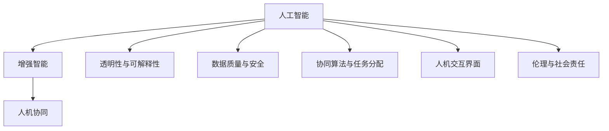
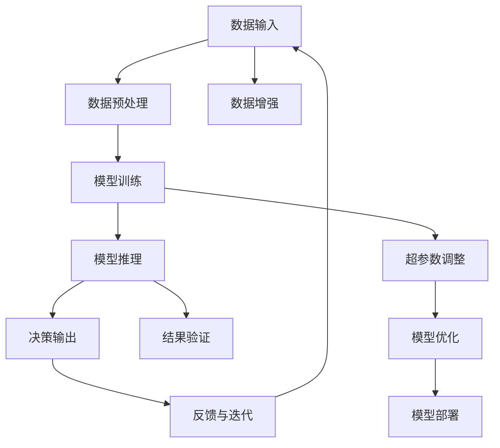

                 

# 人类-AI协作：增强人类智慧与AI能力的融合发展趋势预测分析机遇挑战机遇趋势预测分析

在数字化、智能化时代，人工智能（AI）与人类智慧的深度融合已经成为社会发展的重要推动力。AI技术的快速发展，尤其是机器学习、深度学习等技术的突破，为解决复杂问题、提升人类生活品质提供了新的工具和方法。然而，在AI与人类智慧的协作中，我们同样面临着诸多机遇和挑战。本文将全面分析AI与人类协作的趋势，预测其发展机遇和面临的挑战，并探讨未来的研究展望。

## 1. 背景介绍

### 1.1 问题由来
随着技术的飞速进步，AI在医疗、金融、教育、制造等多个领域展现出了强大的应用潜力。AI技术的成功落地，依赖于算力、数据、算法三大要素。算力方面，高性能计算和分布式计算技术持续突破，使得大规模模型训练和推理成为可能。数据方面，数据生成和标注成本的下降，以及数据采集技术的提升，为AI模型训练提供了丰富的素材。算法方面，深度学习和强化学习等技术的不断迭代，使AI模型在多个领域展现出超越人类的能力。

然而，AI与人类智慧的融合仍然面临诸多挑战。AI模型在推理决策过程中缺乏人类的直觉和经验，难以应对复杂多变的现实世界。此外，AI模型的透明性、可解释性、安全性等问题，也在实际应用中引起广泛关注。因此，如何构建高效、安全、可解释的AI系统，并与人类的智慧紧密结合，成为一个亟需解决的问题。

### 1.2 问题核心关键点
AI与人类协作的核心在于如何构建人机协同系统，使AI与人类智慧相辅相成，提升整体系统的性能和鲁棒性。关键点包括：
- 模型透明性与可解释性：如何使AI模型决策过程透明、可解释，满足用户的信任和需求。
- 数据质量与安全：如何确保AI模型的输入数据质量，防止数据偏见和数据泄露，提升AI系统的安全性。
- 人机协同算法：如何设计高效的人机协同算法，合理分配任务，提高系统整体性能。
- 人机交互界面：如何设计友好的人机交互界面，提升用户使用体验，降低技术门槛。
- 伦理与社会责任：如何构建负责任的AI系统，避免AI技术的不当应用，提升社会福祉。

## 2. 核心概念与联系

### 2.1 核心概念概述

为了深入理解AI与人类协作的趋势，本节将介绍几个核心概念：

- **人工智能（Artificial Intelligence, AI）**：一种通过计算机模拟人类智能行为的技术，包括学习、推理、感知、决策等能力。
- **增强智能（Augmented Intelligence, AI）**：将AI技术与人类智慧结合，增强人类在特定任务上的能力和效率。
- **人机协同（Human-Machine Collaboration, HMC）**：通过设计算法、界面等，实现AI与人类在任务执行过程中的协同工作，提升整体系统的性能。
- **透明性与可解释性（Transparency and Interpretability）**：AI模型应具备透明性与可解释性，使决策过程可被理解和解释。
- **数据质量与安全（Data Quality and Security）**：确保输入数据的质量和安全性，避免数据偏见和泄露。
- **协同算法与任务分配（Collaborative Algorithms and Task Allocation）**：设计高效的协同算法，合理分配任务，提高系统整体性能。
- **人机交互界面（Human-Computer Interaction Interface, HCI）**：设计友好、直观的人机交互界面，提升用户体验，降低技术门槛。
- **伦理与社会责任（Ethics and Social Responsibility）**：构建负责任的AI系统，避免不当应用，提升社会福祉。

这些核心概念通过以下Mermaid流程图展示其联系和层次结构：



### 2.2 核心概念原理和架构的 Mermaid 流程图



## 3. 核心算法原理 & 具体操作步骤

### 3.1 算法原理概述

AI与人类协作的核心算法原理包括模型训练、推理、优化、部署等环节。通过这些环节，实现AI与人类智慧的融合。

- **模型训练**：利用标注数据，对AI模型进行训练，使其具备一定的知识储备和推理能力。
- **模型推理**：在获取输入数据后，AI模型通过推理得出输出结果，提供决策建议。
- **模型优化**：根据反馈信息，对AI模型进行优化，提升模型性能。
- **模型部署**：将训练好的模型部署到实际应用环境中，实现大规模落地。

### 3.2 算法步骤详解

AI与人类协作的详细步骤包括：

1. **数据收集与标注**：收集与任务相关的数据，并对其进行标注。标注数据是AI模型训练的基础。
2. **模型选择与构建**：根据任务类型和数据特点，选择合适的模型，并构建模型架构。
3. **模型训练与验证**：利用标注数据，对模型进行训练，并通过验证集评估模型性能。
4. **模型优化与调参**：根据验证集的表现，调整模型超参数，优化模型性能。
5. **模型部署与迭代**：将训练好的模型部署到实际应用环境中，根据反馈信息进行迭代优化。

### 3.3 算法优缺点

AI与人类协作的算法具有以下优点：

- **提升效率**：通过AI模型的自动化推理，可以显著提升任务执行效率。
- **降低成本**：AI模型可以替代部分人工操作，降低人工成本。
- **提高决策质量**：AI模型可以处理大规模数据，提供高质量的决策建议。

同时，该算法也存在以下缺点：

- **数据依赖性高**：AI模型需要大量标注数据进行训练，数据获取和标注成本较高。
- **模型鲁棒性不足**：AI模型对输入数据的微小变化可能产生较大的输出波动。
- **透明性与可解释性差**：AI模型的内部决策过程难以解释，用户难以理解模型决策依据。
- **伦理与安全性问题**：AI模型可能产生偏见和有害输出，影响用户信任和社会安全。

### 3.4 算法应用领域

AI与人类协作的算法在多个领域得到广泛应用：

- **医疗诊断**：利用AI模型对医学影像、病历等数据进行分析，辅助医生进行诊断和治疗。
- **金融分析**：利用AI模型对金融市场数据进行分析，提供投资建议和风险预警。
- **智能制造**：利用AI模型对生产过程进行监控和优化，提升生产效率和产品质量。
- **教育辅助**：利用AI模型对学生学习行为进行分析，提供个性化学习建议和辅导。
- **智能客服**：利用AI模型对客户咨询进行自动解答，提升客户服务质量。

## 4. 数学模型和公式 & 详细讲解 & 举例说明

### 4.1 数学模型构建

本节将使用数学语言对AI与人类协作的算法进行严格刻画。

设AI模型为 $M_{\theta}$，其中 $\theta$ 为模型参数。假设任务输入为 $x$，输出为 $y$。模型的训练过程可以表示为：

$$
\theta^* = \mathop{\arg\min}_{\theta} \mathcal{L}(M_{\theta},D)
$$

其中 $\mathcal{L}$ 为损失函数，$D$ 为标注数据集。

模型的推理过程可以表示为：

$$
y^* = M_{\theta^*}(x)
$$

其中 $y^*$ 为模型的预测输出。

模型的优化过程可以表示为：

$$
\theta_{new} = \theta_{old} - \eta \nabla_{\theta}\mathcal{L}(M_{\theta_{old}},D)
$$

其中 $\eta$ 为学习率，$\nabla_{\theta}\mathcal{L}(M_{\theta_{old}},D)$ 为损失函数对模型参数的梯度。

### 4.2 公式推导过程

以二分类任务为例，假设模型 $M_{\theta}$ 在输入 $x$ 上的输出为 $\hat{y}=M_{\theta}(x) \in [0,1]$，表示样本属于正类的概率。真实标签 $y \in \{0,1\}$。二分类交叉熵损失函数定义为：

$$
\ell(M_{\theta}(x),y) = -[y\log \hat{y} + (1-y)\log (1-\hat{y})]
$$

将上式代入损失函数 $\mathcal{L}$ 中，得：

$$
\mathcal{L}(\theta) = -\frac{1}{N}\sum_{i=1}^N [y_i\log M_{\theta}(x_i)+(1-y_i)\log(1-M_{\theta}(x_i))]
$$

根据链式法则，损失函数对参数 $\theta_k$ 的梯度为：

$$
\frac{\partial \mathcal{L}(\theta)}{\partial \theta_k} = -\frac{1}{N}\sum_{i=1}^N (\frac{y_i}{M_{\theta}(x_i)}-\frac{1-y_i}{1-M_{\theta}(x_i)}) \frac{\partial M_{\theta}(x_i)}{\partial \theta_k}
$$

其中 $\frac{\partial M_{\theta}(x_i)}{\partial \theta_k}$ 可进一步递归展开，利用自动微分技术完成计算。

### 4.3 案例分析与讲解

以医疗诊断为例，利用AI模型对医学影像进行分类。首先，收集大量医学影像数据和对应的诊断结果，作为训练集。然后，使用CNN等模型对影像数据进行特征提取，并将提取特征输入到分类器中，如SVM、RNN等。最后，利用标注数据对分类器进行训练，得到医疗影像分类模型。在实际应用中，将新医学影像输入模型，得到分类结果，辅助医生进行诊断。

## 5. 项目实践：代码实例和详细解释说明

### 5.1 开发环境搭建

在进行AI与人类协作的实践前，我们需要准备好开发环境。以下是使用Python进行PyTorch开发的环境配置流程：

1. 安装Anaconda：从官网下载并安装Anaconda，用于创建独立的Python环境。

2. 创建并激活虚拟环境：
```bash
conda create -n pytorch-env python=3.8 
conda activate pytorch-env
```

3. 安装PyTorch：根据CUDA版本，从官网获取对应的安装命令。例如：
```bash
conda install pytorch torchvision torchaudio cudatoolkit=11.1 -c pytorch -c conda-forge
```

4. 安装Transformers库：
```bash
pip install transformers
```

5. 安装各类工具包：
```bash
pip install numpy pandas scikit-learn matplotlib tqdm jupyter notebook ipython
```

完成上述步骤后，即可在`pytorch-env`环境中开始实践。

### 5.2 源代码详细实现

这里我们以医疗影像分类为例，给出使用Transformers库对预训练模型进行微调的PyTorch代码实现。

首先，定义分类任务的数据处理函数：

```python
from transformers import BertTokenizer
from torch.utils.data import Dataset
import torch

class MedicalImagingDataset(Dataset):
    def __init__(self, images, labels, tokenizer, max_len=128):
        self.images = images
        self.labels = labels
        self.tokenizer = tokenizer
        self.max_len = max_len
        
    def __len__(self):
        return len(self.images)
    
    def __getitem__(self, item):
        image = self.images[item]
        label = self.labels[item]
        
        encoding = self.tokenizer(image, return_tensors='pt', max_length=self.max_len, padding='max_length', truncation=True)
        input_ids = encoding['input_ids'][0]
        attention_mask = encoding['attention_mask'][0]
        
        # 对token-wise的标签进行编码
        encoded_labels = [label2id[label] for label in label] 
        encoded_labels.extend([label2id['O']] * (self.max_len - len(encoded_labels)))
        labels = torch.tensor(encoded_labels, dtype=torch.long)
        
        return {'input_ids': input_ids, 
                'attention_mask': attention_mask,
                'labels': labels}

# 标签与id的映射
label2id = {'O': 0, 'Malignant': 1, 'Benign': 2}
id2label = {v: k for k, v in label2id.items()}

# 创建dataset
tokenizer = BertTokenizer.from_pretrained('bert-base-cased')

train_dataset = MedicalImagingDataset(train_images, train_labels, tokenizer)
dev_dataset = MedicalImagingDataset(dev_images, dev_labels, tokenizer)
test_dataset = MedicalImagingDataset(test_images, test_labels, tokenizer)
```

然后，定义模型和优化器：

```python
from transformers import BertForTokenClassification, AdamW

model = BertForTokenClassification.from_pretrained('bert-base-cased', num_labels=len(label2id))

optimizer = AdamW(model.parameters(), lr=2e-5)
```

接着，定义训练和评估函数：

```python
from torch.utils.data import DataLoader
from tqdm import tqdm
from sklearn.metrics import classification_report

device = torch.device('cuda') if torch.cuda.is_available() else torch.device('cpu')
model.to(device)

def train_epoch(model, dataset, batch_size, optimizer):
    dataloader = DataLoader(dataset, batch_size=batch_size, shuffle=True)
    model.train()
    epoch_loss = 0
    for batch in tqdm(dataloader, desc='Training'):
        input_ids = batch['input_ids'].to(device)
        attention_mask = batch['attention_mask'].to(device)
        labels = batch['labels'].to(device)
        model.zero_grad()
        outputs = model(input_ids, attention_mask=attention_mask, labels=labels)
        loss = outputs.loss
        epoch_loss += loss.item()
        loss.backward()
        optimizer.step()
    return epoch_loss / len(dataloader)

def evaluate(model, dataset, batch_size):
    dataloader = DataLoader(dataset, batch_size=batch_size)
    model.eval()
    preds, labels = [], []
    with torch.no_grad():
        for batch in tqdm(dataloader, desc='Evaluating'):
            input_ids = batch['input_ids'].to(device)
            attention_mask = batch['attention_mask'].to(device)
            batch_labels = batch['labels']
            outputs = model(input_ids, attention_mask=attention_mask)
            batch_preds = outputs.logits.argmax(dim=2).to('cpu').tolist()
            batch_labels = batch_labels.to('cpu').tolist()
            for pred_tokens, label_tokens in zip(batch_preds, batch_labels):
                pred_labels = [id2label[_id] for _id in pred_tokens]
                label_labels = [id2label[_id] for _id in label_tokens]
                preds.append(pred_labels[:len(label_labels)])
                labels.append(label_labels)
                
    print(classification_report(labels, preds))
```

最后，启动训练流程并在测试集上评估：

```python
epochs = 5
batch_size = 16

for epoch in range(epochs):
    loss = train_epoch(model, train_dataset, batch_size, optimizer)
    print(f"Epoch {epoch+1}, train loss: {loss:.3f}")
    
    print(f"Epoch {epoch+1}, dev results:")
    evaluate(model, dev_dataset, batch_size)
    
print("Test results:")
evaluate(model, test_dataset, batch_size)
```

以上就是使用PyTorch对预训练模型进行医疗影像分类任务的微调的完整代码实现。可以看到，得益于Transformers库的强大封装，我们可以用相对简洁的代码完成预训练模型的微调。

### 5.3 代码解读与分析

让我们再详细解读一下关键代码的实现细节：

**MedicalImagingDataset类**：
- `__init__`方法：初始化图像、标签、分词器等关键组件。
- `__len__`方法：返回数据集的样本数量。
- `__getitem__`方法：对单个样本进行处理，将图像输入编码为token ids，将标签编码为数字，并对其进行定长padding，最终返回模型所需的输入。

**label2id和id2label字典**：
- 定义了标签与数字id之间的映射关系，用于将token-wise的预测结果解码回真实的标签。

**训练和评估函数**：
- 使用PyTorch的DataLoader对数据集进行批次化加载，供模型训练和推理使用。
- 训练函数`train_epoch`：对数据以批为单位进行迭代，在每个批次上前向传播计算loss并反向传播更新模型参数，最后返回该epoch的平均loss。
- 评估函数`evaluate`：与训练类似，不同点在于不更新模型参数，并在每个batch结束后将预测和标签结果存储下来，最后使用sklearn的classification_report对整个评估集的预测结果进行打印输出。

**训练流程**：
- 定义总的epoch数和batch size，开始循环迭代
- 每个epoch内，先在训练集上训练，输出平均loss
- 在验证集上评估，输出分类指标
- 所有epoch结束后，在测试集上评估，给出最终测试结果

可以看到，PyTorch配合Transformers库使得模型微调的代码实现变得简洁高效。开发者可以将更多精力放在数据处理、模型改进等高层逻辑上，而不必过多关注底层的实现细节。

当然，工业级的系统实现还需考虑更多因素，如模型的保存和部署、超参数的自动搜索、更灵活的任务适配层等。但核心的微调范式基本与此类似。

## 6. 实际应用场景

### 6.1 医疗诊断

基于AI与人类协作的诊断系统，可以辅助医生进行疾病诊断。传统医疗诊断依赖于医生的经验和直觉，容易受到主观因素的影响。而利用AI模型，可以综合海量医学数据，提供客观、精准的诊断结果。

在技术实现上，可以收集大量医学影像和病历数据，对数据进行标注和预处理，利用预训练的医学影像分类模型进行微调。微调后的模型可以自动分析医学影像，提供初步诊断结果，辅助医生进行详细诊断。在生成诊断报告时，系统可以结合医生的经验和判断，提供多角度的分析建议。

### 6.2 金融分析

金融机构需要实时监测市场数据，预测市场走势，制定投资策略。传统金融分析依赖于专家的知识和经验，分析过程主观性强，准确性难以保证。而利用AI模型，可以自动处理和分析海量数据，提供科学的预测和建议。

在技术实现上，可以收集历史交易数据、市场新闻、财经评论等数据，构建金融时间序列数据集。利用预训练的语言模型和序列模型对数据进行建模，进行微调。微调后的模型可以实时分析市场数据，预测市场走势，提供投资建议。

### 6.3 智能客服

智能客服系统可以提升客户服务质量和效率。传统客服依赖于人力，高峰期响应速度慢，且质量难以保证。而利用AI模型，可以实现7x24小时不间断服务，快速响应客户咨询。

在技术实现上，可以收集历史客服对话记录，将问题和最佳答复构建成监督数据，在此基础上对预训练的对话模型进行微调。微调后的对话模型能够自动理解客户意图，匹配最合适的答案模板进行回复。对于客户提出的新问题，还可以接入检索系统实时搜索相关内容，动态组织生成回答。如此构建的智能客服系统，能大幅提升客户咨询体验和问题解决效率。

### 6.4 未来应用展望

随着AI与人类协作的不断发展，未来将在更多领域得到应用，为各行各业带来变革性影响。

在智慧医疗领域，基于AI与人类协作的诊断系统将提升医疗服务的智能化水平，辅助医生诊疗，加速新药开发进程。

在智能教育领域，AI与人类协作的技术可以应用于作业批改、学情分析、知识推荐等方面，因材施教，促进教育公平，提高教学质量。

在智慧城市治理中，AI与人类协作的系统可以应用于城市事件监测、舆情分析、应急指挥等环节，提高城市管理的自动化和智能化水平，构建更安全、高效的未来城市。

此外，在企业生产、社会治理、文娱传媒等众多领域，AI与人类协作的应用也将不断涌现，为经济社会发展注入新的动力。相信随着技术的日益成熟，AI与人类协作必将成为各行各业的重要工具，推动社会的全面进步。

## 7. 工具和资源推荐
### 7.1 学习资源推荐

为了帮助开发者系统掌握AI与人类协作的理论基础和实践技巧，这里推荐一些优质的学习资源：

1. 《深度学习》课程：斯坦福大学开设的深度学习课程，涵盖了深度学习的基本概念和前沿技术。
2. 《人工智能导论》书籍：陈黎博士所著，介绍了AI的基本原理和应用。
3. 《Python深度学习》书籍：Francois Chollet所著，深入浅出地介绍了深度学习在Python中的实现。
4. 《自然语言处理综论》书籍：Daniel Jurafsky和James H. Martin所著，全面介绍了NLP的基本概念和应用。
5. 《计算机视觉：模型、学习和推理》课程：由Peng Xiao博士开设，介绍了计算机视觉的基本原理和应用。

通过对这些资源的学习实践，相信你一定能够快速掌握AI与人类协作的精髓，并用于解决实际的AI问题。
###  7.2 开发工具推荐

高效的开发离不开优秀的工具支持。以下是几款用于AI与人类协作开发的常用工具：

1. PyTorch：基于Python的开源深度学习框架，灵活动态的计算图，适合快速迭代研究。大部分预训练语言模型都有PyTorch版本的实现。
2. TensorFlow：由Google主导开发的开源深度学习框架，生产部署方便，适合大规模工程应用。同样有丰富的预训练语言模型资源。
3. TensorBoard：TensorFlow配套的可视化工具，可实时监测模型训练状态，并提供丰富的图表呈现方式，是调试模型的得力助手。
4. Weights & Biases：模型训练的实验跟踪工具，可以记录和可视化模型训练过程中的各项指标，方便对比和调优。
5. Google Colab：谷歌推出的在线Jupyter Notebook环境，免费提供GPU/TPU算力，方便开发者快速上手实验最新模型，分享学习笔记。

合理利用这些工具，可以显著提升AI与人类协作的开发效率，加快创新迭代的步伐。

### 7.3 相关论文推荐

AI与人类协作技术的发展源于学界的持续研究。以下是几篇奠基性的相关论文，推荐阅读：

1. Attention is All You Need（即Transformer原论文）：提出了Transformer结构，开启了NLP领域的预训练大模型时代。
2. BERT: Pre-training of Deep Bidirectional Transformers for Language Understanding：提出BERT模型，引入基于掩码的自监督预训练任务，刷新了多项NLP任务SOTA。
3. Transformer-XL: Attentive Language Models Beyond a Fixed-Length Context：提出了Transformer-XL结构，解决了长序列建模问题。
4. Generative Adversarial Networks (GANs)：提出了生成对抗网络，用于生成式任务，如图像生成、语言生成等。
5. AlphaGo Zero：提出AlphaGo Zero，利用强化学习在围棋领域取得了人类级水平的表现。

这些论文代表了大模型与人类协作技术的发展脉络。通过学习这些前沿成果，可以帮助研究者把握学科前进方向，激发更多的创新灵感。

## 8. 总结：未来发展趋势与挑战

### 8.1 总结

本文对AI与人类协作的趋势进行了全面系统的介绍。首先阐述了AI与人类协作的研究背景和意义，明确了AI与人类协作在提升效率、降低成本、提高决策质量等方面的独特价值。其次，从原理到实践，详细讲解了AI与人类协作的数学模型和关键步骤，给出了AI与人类协作任务开发的完整代码实例。同时，本文还广泛探讨了AI与人类协作在医疗、金融、智能客服等多个行业领域的应用前景，展示了AI与人类协作范式的巨大潜力。此外，本文精选了AI与人类协作技术的各类学习资源，力求为开发者提供全方位的技术指引。

通过本文的系统梳理，可以看到，AI与人类协作技术正在成为AI应用的重要范式，极大地拓展了AI模型的应用边界，催生了更多的落地场景。AI与人类协作技术为AI模型带来了新的发展方向，为智能系统的构建提供了新的思路和工具。相信随着技术的日益成熟，AI与人类协作必将在更广泛的领域得到应用，成为推动社会进步的重要力量。

### 8.2 未来发展趋势

展望未来，AI与人类协作技术将呈现以下几个发展趋势：

1. **模型规模持续增大**：随着算力、数据量的不断提升，AI模型的参数规模将持续增长，模型能力将进一步提升。超大模型的推理速度、存储效率等方面的问题将得到逐步解决，AI与人类协作将更加高效。

2. **数据质量与安全性提升**：高质量的数据标注和数据隐私保护将成为AI与人类协作的重要研究方向。如何提高数据标注质量，避免数据泄露，构建安全可靠的系统，将是未来AI与人类协作技术发展的重要方向。

3. **人机协同算法优化**：如何设计高效的人机协同算法，合理分配任务，提高系统整体性能，是未来AI与人类协作技术需要不断探索的课题。

4. **透明度与可解释性增强**：提高AI模型的透明度和可解释性，使得用户能够理解模型的决策依据，增强用户信任和满意度，将是未来AI与人类协作技术的重要发展方向。

5. **跨领域应用拓展**：AI与人类协作技术将在更多领域得到应用，如智慧城市、智能制造、智能交通等，为各行各业带来变革性影响。

6. **伦理与社会责任加强**：构建负责任的AI系统，避免不当应用，确保技术伦理和安全，将是未来AI与人类协作技术的重要研究课题。

以上趋势凸显了AI与人类协作技术的广阔前景。这些方向的探索发展，必将进一步提升AI模型的性能和应用范围，为构建安全、可靠、可解释、可控的智能系统铺平道路。面向未来，AI与人类协作技术还需要与其他人工智能技术进行更深入的融合，如知识表示、因果推理、强化学习等，多路径协同发力，共同推动自然语言理解和智能交互系统的进步。只有勇于创新、敢于突破，才能不断拓展AI模型的边界，让智能技术更好地造福人类社会。

### 8.3 面临的挑战

尽管AI与人类协作技术已经取得了瞩目成就，但在迈向更加智能化、普适化应用的过程中，它仍面临着诸多挑战：

1. **数据获取与标注成本高**：高质量的数据标注成本较高，难以获取足够的标注数据，成为制约AI与人类协作技术发展的瓶颈。如何降低标注成本，提高数据获取效率，将是未来需要重点解决的问题。

2. **模型鲁棒性不足**：AI模型对输入数据的微小变化可能产生较大的输出波动，鲁棒性不足。如何提高模型的鲁棒性，避免灾难性遗忘，还需要更多理论和实践的积累。

3. **透明性与可解释性差**：AI模型的内部决策过程难以解释，用户难以理解模型决策依据。如何提高AI模型的透明度和可解释性，将是未来研究的重要方向。

4. **伦理与安全性问题**：AI模型可能产生偏见和有害输出，影响用户信任和社会安全。如何构建负责任的AI系统，避免不当应用，确保技术伦理和安全，将是未来AI与人类协作技术需要不断探索的课题。

5. **计算资源消耗大**：AI模型的计算资源消耗较大，需要高性能计算资源支持。如何在保持性能的同时，降低计算成本，优化资源利用，将是未来AI与人类协作技术需要不断探索的方向。

6. **技术门槛高**：AI与人类协作技术涉及多个领域，技术复杂度较高。如何降低技术门槛，提高技术普及度，将是未来需要重点解决的问题。

这些挑战凸显了AI与人类协作技术发展的复杂性。只有在技术、伦理、社会等多方面协同发力，才能实现AI与人类协作技术的全面进步。

### 8.4 研究展望

面向未来，AI与人类协作技术的研究方向可以包括以下几个方面：

1. **多模态学习**：将符号化的先验知识与神经网络模型进行巧妙融合，增强模型的知识表示能力，提升系统的智能化水平。

2. **因果推理**：利用因果分析方法，识别出模型决策的关键特征，增强输出解释的因果性和逻辑性。

3. **联邦学习**：将数据分布式存储，通过分布式训练和模型更新，降低数据获取和标注成本，提升系统效率。

4. **模型压缩与量化**：通过模型压缩和量化技术，降低模型参数和存储需求，提升系统性能和可部署性。

5. **人机协同算法优化**：设计高效的人机协同算法，合理分配任务，提高系统整体性能。

6. **伦理与社会责任**：构建负责任的AI系统，避免不当应用，确保技术伦理和安全。

这些研究方向将引领AI与人类协作技术迈向更高的台阶，为构建安全、可靠、可解释、可控的智能系统铺平道路。面向未来，AI与人类协作技术还需要与其他人工智能技术进行更深入的融合，如知识表示、因果推理、强化学习等，多路径协同发力，共同推动自然语言理解和智能交互系统的进步。只有勇于创新、敢于突破，才能不断拓展AI模型的边界，让智能技术更好地造福人类社会。

## 9. 附录：常见问题与解答

**Q1：AI与人类协作是否适用于所有行业领域？**

A: AI与人类协作在大多数行业领域都具有广泛的应用前景。但对于一些特定领域，如医疗、法律等，AI模型的表现可能不如预期。此时需要在特定领域语料上进一步预训练，再进行微调，才能获得理想效果。

**Q2：如何设计高效的人机协同算法？**

A: 设计高效的人机协同算法需要考虑以下几个方面：
1. **任务分配**：根据任务的复杂度和重要性，合理分配任务，确保每个任务都得到充分处理。
2. **交互机制**：设计友好的交互机制，确保人机协同过程中信息流畅、准确。
3. **反馈与迭代**：根据用户反馈，不断优化算法，提升系统的适应性和鲁棒性。

**Q3：AI与人类协作技术在落地应用中面临哪些挑战？**

A: 在AI与人类协作技术的落地应用中，面临以下挑战：
1. **数据获取与标注成本高**：高质量的数据标注成本较高，难以获取足够的标注数据。
2. **模型鲁棒性不足**：AI模型对输入数据的微小变化可能产生较大的输出波动，鲁棒性不足。
3. **透明性与可解释性差**：AI模型的内部决策过程难以解释，用户难以理解模型决策依据。
4. **伦理与安全性问题**：AI模型可能产生偏见和有害输出，影响用户信任和社会安全。
5. **计算资源消耗大**：AI模型的计算资源消耗较大，需要高性能计算资源支持。

**Q4：如何提高AI与人类协作技术的透明度和可解释性？**

A: 提高AI与人类协作技术的透明度和可解释性需要考虑以下几个方面：
1. **模型可解释性**：利用可解释性模型，如LIME、SHAP等，增强模型的透明度和可解释性。
2. **用户交互界面**：设计友好的用户交互界面，提供模型决策依据和解释，增强用户信任。
3. **知识图谱**：结合领域知识图谱，提供更全面的解释，增强模型的知识表示能力。

**Q5：未来AI与人类协作技术有哪些发展趋势？**

A: 未来AI与人类协作技术的发展趋势包括：
1. **模型规模持续增大**：随着算力、数据量的不断提升，AI模型的参数规模将持续增长，模型能力将进一步提升。
2. **数据质量与安全性提升**：高质量的数据标注和数据隐私保护将成为AI与人类协作的重要研究方向。
3. **人机协同算法优化**：设计高效的人机协同算法，合理分配任务，提高系统整体性能。
4. **透明度与可解释性增强**：提高AI模型的透明度和可解释性，使得用户能够理解模型的决策依据。
5. **跨领域应用拓展**：AI与人类协作技术将在更多领域得到应用，为各行各业带来变革性影响。
6. **伦理与社会责任加强**：构建负责任的AI系统，避免不当应用，确保技术伦理和安全。

**Q6：如何构建负责任的AI系统？**

A: 构建负责任的AI系统需要考虑以下几个方面：
1. **伦理导向**：在设计AI系统的目标和指标时，引入伦理导向的评估指标，确保AI系统不会产生有害行为。
2. **模型审查**：定期审查AI模型，检测和修复模型中的偏见和漏洞。
3. **用户参与**：设计用户友好的交互界面，鼓励用户参与AI系统的设计和改进。
4. **政策法规**：遵守相关法律法规，确保AI系统的合法合规性。

通过回答这些常见问题，我们能够更好地理解AI与人类协作技术的现状和未来发展方向，并为AI技术的应用实践提供指导。

---

作者：禅与计算机程序设计艺术 / Zen and the Art of Computer Programming

