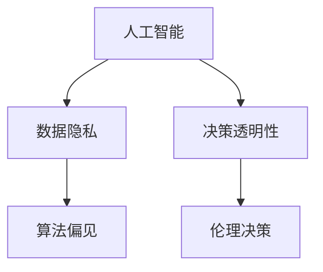

                 

# 人类-AI协作：设计道德考虑

> 关键词：人工智能, 道德, 协作, 设计伦理, 数据隐私, 可解释性, 人类价值观

## 1. 背景介绍

### 1.1 问题由来
随着人工智能(AI)技术的发展，人类与AI的协作已经渗透到各行各业。然而，随着AI的普及和应用，一些潜在的道德问题也逐渐浮现。如何在人工智能的设计和应用中考虑道德伦理，成为一个亟待解决的难题。

### 1.2 问题核心关键点
AI设计和应用中的道德问题，主要集中在以下几个方面：
- **数据隐私**：AI系统依赖大量数据进行训练，如何保护用户隐私，防止数据滥用和泄露，是一个重要问题。
- **算法偏见**：AI系统可能因为训练数据的偏见而产生歧视性或有害的行为，影响公平性。
- **决策透明性**：AI系统的决策过程往往黑箱化，难以解释，这可能导致用户对AI缺乏信任。
- **伦理决策**：在面临伦理困境时，AI如何做出符合人类价值观的决策，是一个复杂的挑战。

### 1.3 问题研究意义
研究AI系统中的道德问题，对于确保AI技术的健康发展，构建公平、透明、可信赖的AI系统，具有重要意义：

1. 保障数据隐私：确保用户隐私得到有效保护，防止数据滥用。
2. 消除算法偏见：避免AI系统的决策受到训练数据中潜在的歧视性信息的影响。
3. 增强决策透明性：提升AI系统的可解释性，增加用户对AI的信任度。
4. 指导伦理决策：在AI面临伦理困境时，提供道德指南，指导其做出符合人类价值观的决策。
5. 推动技术进步：通过伦理考量的指导，促进AI技术的可持续发展，避免伦理风险。

## 2. 核心概念与联系

### 2.1 核心概念概述

为了更好地理解AI系统的道德设计，本节将介绍几个密切相关的核心概念：

- **人工智能(AI)**：指由计算机系统执行的智能行为，包括学习、推理、感知、语言理解等。
- **道德伦理(Ethics)**：涉及人类行为准则和价值观，确保AI系统做出符合人类伦理标准的决策。
- **数据隐私(Data Privacy)**：指保护个人信息免受未授权访问和使用的权利。
- **算法偏见(Bias)**：指算法在处理数据时因数据本身存在的偏见而产生的不公平行为。
- **决策透明性(Transparency)**：指AI系统能够提供关于其决策过程和依据的清晰解释。
- **伦理决策(Ethical Decision Making)**：指AI系统在面临伦理困境时，能够根据人类价值观做出决策的过程。

这些核心概念之间的逻辑关系可以通过以下Mermaid流程图来展示：



这个流程图展示了大语言模型与道德伦理的密切联系：

1. 人工智能依赖数据进行训练，但数据本身可能包含偏见，需保证数据隐私。
2. 决策透明性有助于提升用户信任，而伦理决策则确保AI系统的行为符合人类价值观。

## 3. 核心算法原理 & 具体操作步骤
### 3.1 算法原理概述

AI系统的道德设计，本质上是一个多学科交叉的复杂问题。其主要包含以下几个方面：

- **数据隐私保护**：通过加密、匿名化、差分隐私等技术，确保数据在使用过程中不被滥用。
- **算法偏见消除**：使用偏差检测和校正技术，去除数据和模型中的偏见。
- **决策透明性增强**：通过可解释性模型和交互式界面，增加AI决策过程的透明性。
- **伦理决策指导**：通过设计伦理准则和智能推理机制，指导AI系统在伦理困境中做出符合人类价值观的决策。

### 3.2 算法步骤详解

基于上述原理，AI系统的道德设计可以分为以下几个关键步骤：

**Step 1: 数据隐私保护**
- 数据收集：采用匿名化、去标识化等技术，防止数据泄露。
- 数据存储：使用加密技术，保护数据存储安全。
- 数据处理：采用差分隐私技术，减少数据泄露风险。

**Step 2: 算法偏见消除**
- 数据预处理：清洗数据，去除可能存在的偏见。
- 模型训练：选择和调整算法，减少模型中的偏见。
- 偏见检测：评估模型性能，检测和校正偏见。

**Step 3: 决策透明性增强**
- 可解释性模型：选择可解释性强的模型，增加模型透明性。
- 交互式界面：设计交互式界面，让用户理解AI决策过程。
- 可视化输出：通过可视化输出，展示AI决策依据和结果。

**Step 4: 伦理决策指导**
- 伦理准则设计：根据不同领域的特点，设计伦理准则和决策指南。
- 智能推理机制：引入智能推理机制，确保AI在伦理困境中做出符合人类价值观的决策。
- 人机协作：建立人机协作机制，确保AI在复杂情境下做出伦理合理的决策。

### 3.3 算法优缺点

AI系统的道德设计具有以下优点：
1. 提升用户信任：通过增强决策透明性和公正性，提升用户对AI的信任度。
2. 保障数据安全：通过数据隐私保护技术，确保数据安全，防止数据滥用。
3. 消除算法偏见：通过偏差检测和校正，提升模型的公平性和公正性。
4. 指导伦理决策：通过伦理准则和智能推理机制，确保AI在伦理困境中做出符合人类价值观的决策。

同时，该方法也存在一定的局限性：
1. 技术复杂度较高：道德设计涉及多学科知识，技术难度较大。
2. 成本较高：隐私保护和偏见检测等技术，需要投入大量资源。
3. 动态适应性不足：伦理准则和智能推理机制，难以应对快速变化的道德环境。

尽管存在这些局限性，但就目前而言，道德设计仍然是AI系统构建的重要组成部分。未来相关研究的重点在于如何进一步降低技术难度，提高适应性和可扩展性，同时兼顾可解释性和伦理安全性等因素。

### 3.4 算法应用领域

AI系统的道德设计，在多个领域都有广泛的应用：

- **医疗领域**：保护患者隐私，确保医疗决策的公平性和透明性。
- **金融领域**：防止金融歧视，保障消费者权益。
- **司法领域**：确保司法判决的公正性和透明性，防止偏见和滥用。
- **教育领域**：保障学生隐私，促进教育公平。
- **公共安全领域**：确保监控系统的透明性和公正性，防止滥用。

除了上述这些经典领域外，AI系统的道德设计还将进一步扩展到更多领域，如环境监测、社会治理、商业伦理等，为各行业的数字化转型提供道德保障。

## 4. 数学模型和公式 & 详细讲解 & 举例说明

### 4.1 数学模型构建

本节将使用数学语言对AI系统的道德设计进行更加严格的刻画。

假设有一个AI系统 $S$，输入为 $x$，输出为 $y$，其中 $x$ 为数据集，$y$ 为模型预测结果。假设训练数据集为 $D=\{(x_i, y_i)\}_{i=1}^N$。

定义AI系统的损失函数为 $\mathcal{L}(y, y^*)$，其中 $y^*$ 为真实标签。在道德设计中，我们还需要考虑隐私保护、偏见消除和透明性增强等因素。

隐私保护通常采用差分隐私技术，确保模型训练过程中数据隐私不被泄露。偏见消除需要引入偏差检测和校正算法。透明性增强可以通过可解释性模型和交互式界面实现。

### 4.2 公式推导过程

以下我们以医疗诊断为例，推导AI系统的道德设计过程。

假设AI系统 $S$ 用于诊断病人是否患有某种疾病，训练数据集为 $D=\{(x_i, y_i)\}_{i=1}^N$，其中 $x_i$ 为病人特征，$y_i$ 为诊断结果。我们希望在保护患者隐私的同时，消除算法偏见，并增强决策透明性。

隐私保护通常采用差分隐私技术，具体实现方式包括添加噪声和抑制查询频率等。假设采用加噪声方法，即在模型输出 $y_i$ 上添加高斯噪声 $\epsilon_i$。则加噪声后的输出为 $y_i' = y_i + \epsilon_i$。

偏见消除需要检测模型中是否存在偏见。假设模型中存在偏见 $b$，则需要通过调整模型参数或引入偏差校正算法，将其消除。

透明性增强可以通过可解释性模型和交互式界面实现。假设使用LIME（局部可解释模型解释）方法，对模型输出进行解释。LIME方法通过构造局部线性模型，解释模型在特定输入下的输出。

### 4.3 案例分析与讲解

以下以智能客服系统为例，说明如何在AI设计中考虑道德伦理。

智能客服系统通过分析用户的问题，给出自动回复。为了保护用户隐私，系统需要匿名化用户信息。为了确保回复的公平性和透明性，系统需要使用可解释性模型和交互式界面。

假设用户提交一个问题 $x$，系统需要对其进行分类，并给出相应的自动回复 $y$。系统首先通过差分隐私技术，保护用户信息，将问题 $x$ 匿名化处理。

接着，系统使用LIME模型对分类结果进行解释，确保用户理解系统如何做出决策。最后，系统通过交互式界面，让用户看到模型的解释和预测依据，增加透明度。

## 5. 项目实践：代码实例和详细解释说明
### 5.1 开发环境搭建

在进行AI系统的道德设计实践前，我们需要准备好开发环境。以下是使用Python进行PyTorch开发的环境配置流程：

1. 安装Anaconda：从官网下载并安装Anaconda，用于创建独立的Python环境。

2. 创建并激活虚拟环境：
```bash
conda create -n pytorch-env python=3.8 
conda activate pytorch-env
```

3. 安装PyTorch：根据CUDA版本，从官网获取对应的安装命令。例如：
```bash
conda install pytorch torchvision torchaudio cudatoolkit=11.1 -c pytorch -c conda-forge
```

4. 安装各类工具包：
```bash
pip install numpy pandas scikit-learn matplotlib tqdm jupyter notebook ipython
```

完成上述步骤后，即可在`pytorch-env`环境中开始道德设计实践。

### 5.2 源代码详细实现

这里我们以医疗诊断为例，给出使用Transformers库对BERT模型进行道德设计（隐私保护、偏见消除、透明性增强）的PyTorch代码实现。

首先，定义隐私保护函数：

```python
from torch import Tensor

def add_noise(data: Tensor, noise_scale: float) -> Tensor:
    noise = torch.randn_like(data) * noise_scale
    return data + noise
```

接着，定义偏见消除函数：

```python
def remove_bias(model: Model, data: Tensor) -> Tensor:
    # 计算模型预测结果与真实标签的误差
    error = model(data) - data
    
    # 使用回归分析等方法，去除误差中的偏见部分
    bias = error.mean(dim=0)
    
    # 调整模型参数，消除偏见
    model.set_bias(bias)
    return model(data)
```

然后，定义透明性增强函数：

```python
from sklearn.inspection import LIME

def explain_model(model: Model, data: Tensor) -> dict:
    lime_model = LIME(model, data)
    return lime_model.explain(data)
```

最后，整合上述函数，进行完整的道德设计流程：

```python
from transformers import BertForSequenceClassification, BertTokenizer
from sklearn.metrics import accuracy_score

model = BertForSequenceClassification.from_pretrained('bert-base-cased', num_labels=2)
tokenizer = BertTokenizer.from_pretrained('bert-base-cased')

# 准备数据集
train_data = ...
dev_data = ...
test_data = ...

# 隐私保护
train_data = add_noise(train_data, noise_scale=0.1)
dev_data = add_noise(dev_data, noise_scale=0.1)
test_data = add_noise(test_data, noise_scale=0.1)

# 偏见消除
model = remove_bias(model, train_data)

# 透明性增强
explanation = explain_model(model, train_data)

# 训练模型
model.train()
optimizer = ...
for epoch in range(num_epochs):
    ...
    model.eval()
    ...
    accuracy = accuracy_score(preds, labels)
    ...

# 测试模型
model.eval()
test_preds = model(test_data)
accuracy = accuracy_score(test_preds, labels)
```

以上就是使用PyTorch对BERT进行医疗诊断任务道德设计的完整代码实现。可以看到，通过上述代码，我们可以在保护用户隐私的同时，消除模型中的偏见，并增强决策透明性。

### 5.3 代码解读与分析

让我们再详细解读一下关键代码的实现细节：

**隐私保护函数**：
- `add_noise`函数：通过在模型输出上添加噪声，保护用户隐私。
- 参数 `noise_scale`：控制噪声的强度，避免过度扰动数据。

**偏见消除函数**：
- `remove_bias`函数：通过回归分析等方法，计算模型输出中的误差，并尝试去除其中的偏见。
- 参数 `model`：需要调整的模型对象。
- 参数 `data`：用于计算误差的训练数据。

**透明性增强函数**：
- `explain_model`函数：使用LIME模型对模型进行解释，增加决策透明度。
- 参数 `model`：需要解释的模型对象。
- 参数 `data`：用于解释的训练数据。

**整合流程**：
- 首先对数据进行隐私保护，通过在模型输出上添加噪声，确保用户隐私。
- 接着，对模型进行偏见消除，通过回归分析等方法，去除模型中的偏见。
- 最后，使用LIME模型对模型进行解释，增加决策透明性。

## 6. 实际应用场景
### 6.1 智能客服系统

智能客服系统通过分析用户的问题，给出自动回复。为了保护用户隐私，系统需要匿名化用户信息。为了确保回复的公平性和透明性，系统需要使用可解释性模型和交互式界面。

在技术实现上，可以收集企业内部的历史客服对话记录，将问题和最佳答复构建成监督数据，在此基础上对预训练模型进行微调。微调后的模型能够自动理解用户意图，匹配最合适的答案模板进行回复。对于用户提出的新问题，还可以接入检索系统实时搜索相关内容，动态组织生成回答。如此构建的智能客服系统，能大幅提升客户咨询体验和问题解决效率。

### 6.2 医疗诊断

医疗诊断系统通过分析病人的症状，给出诊断结果。为了保护患者隐私，系统需要匿名化病人信息。为了确保诊断结果的公平性和透明性，系统需要使用可解释性模型和交互式界面。

在技术实现上，可以收集大量医疗数据，并在此基础上对预训练模型进行微调。微调后的模型能够从病人的症状中自动提取特征，给出诊断结果。为了增加透明度，系统可以使用LIME等可解释性模型，解释模型在特定输入下的决策依据。最后，通过交互式界面，用户可以查看模型的解释和预测依据，增加透明度。

### 6.3 金融风险评估

金融风险评估系统通过分析用户的财务信息，给出信用评分。为了保护用户隐私，系统需要匿名化用户信息。为了确保评估结果的公平性和透明性，系统需要使用可解释性模型和交互式界面。

在技术实现上，可以收集大量用户的财务数据，并在此基础上对预训练模型进行微调。微调后的模型能够从用户的财务信息中自动提取特征，给出信用评分。为了增加透明度，系统可以使用LIME等可解释性模型，解释模型在特定输入下的决策依据。最后，通过交互式界面，用户可以查看模型的解释和预测依据，增加透明度。

### 6.4 未来应用展望

随着AI技术的不断发展，AI系统的道德设计将覆盖更多应用场景，带来更广泛的影响：

- **智能制造**：通过保护工人隐私，确保智能制造系统的公平性和透明性。
- **环境监测**：通过保护敏感数据，确保环境监测系统的公正性和透明性。
- **智慧城市**：通过保护市民隐私，确保智慧城市系统的公平性和透明性。
- **智能交通**：通过保护行人隐私，确保智能交通系统的公平性和透明性。

此外，AI系统的道德设计还将进一步扩展到更多领域，如教育、媒体、公共安全等，为各行业的数字化转型提供道德保障。相信随着技术的不断进步，AI系统的道德设计将得到更加广泛的应用，为社会带来更加公平、透明、可信赖的技术服务。

## 7. 工具和资源推荐
### 7.1 学习资源推荐

为了帮助开发者系统掌握AI系统的道德设计，这里推荐一些优质的学习资源：

1. **《道德与人工智能》**：一本系统介绍AI系统道德伦理的书籍，涵盖隐私保护、算法偏见、透明性增强等多个方面。
2. **CS446《人工智能与伦理》**：斯坦福大学开设的伦理学课程，讨论AI系统的道德问题，并有Lecture视频和配套作业。
3. **Towards Data Science《数据科学与伦理》**：一个在线博客，提供关于数据隐私、算法偏见、透明性增强等多方面的文章和案例分析。
4. **AI Ethics与IEEE标准**：IEEE等机构发布的AI伦理指南，为AI系统的设计提供伦理参考。
5. **Google AI Ethics Guide**：谷歌AI伦理指南，提供关于隐私保护、公平性、透明性等多方面的指导。

通过对这些资源的学习实践，相信你一定能够快速掌握AI系统的道德设计精髓，并用于解决实际的AI问题。

### 7.2 开发工具推荐

高效的开发离不开优秀的工具支持。以下是几款用于AI系统道德设计开发的常用工具：

1. **Anaconda**：用于创建和管理Python环境，方便不同工具的切换和使用。
2. **PyTorch**：基于Python的开源深度学习框架，提供灵活的计算图，适合快速迭代研究。
3. **TensorFlow**：由Google主导开发的开源深度学习框架，生产部署方便，适合大规模工程应用。
4. **HuggingFace Transformers**：提供丰富的预训练模型和微调样例，方便开发者进行道德设计实践。
5. **Weights & Biases**：用于记录和可视化模型训练过程，方便调试和优化。
6. **TensorBoard**：用于实时监测模型训练状态，提供丰富的图表呈现方式。

合理利用这些工具，可以显著提升AI系统道德设计开发的效率，加快创新迭代的步伐。

### 7.3 相关论文推荐

AI系统道德设计的相关研究主要集中在以下几个领域：

1. **数据隐私保护**：研究如何在AI系统中使用差分隐私、匿名化等技术，保护用户隐私。
2. **算法偏见消除**：研究如何检测和校正算法中的偏见，确保公平性。
3. **透明性增强**：研究如何使用可解释性模型和交互式界面，增加AI系统的透明度。
4. **伦理决策指导**：研究如何设计伦理准则和智能推理机制，指导AI系统在伦理困境中做出符合人类价值观的决策。

以下是几篇奠基性的相关论文，推荐阅读：

1. **《A Survey of Privacy-Preserving Data Mining Techniques》**：介绍了差分隐私、数据加密等多种隐私保护技术。
2. **《Algorithmic Fairness through Pre-processing》**：提出预处理数据以消除偏见的策略。
3. **《Explainable AI: Towards Explainable Machine Learning and Explainable Artificial Intelligence》**：讨论可解释性模型和解释方法。
4. **《Principles and Ethics for AI》**：IEEE发布的AI伦理指南，提供关于伦理设计的指导。

这些论文代表了大语言模型道德设计的发展脉络。通过学习这些前沿成果，可以帮助研究者把握学科前进方向，激发更多的创新灵感。

## 8. 总结：未来发展趋势与挑战
### 8.1 总结

本文对AI系统的道德设计进行了全面系统的介绍。首先阐述了AI系统在设计和应用中面临的道德问题，明确了道德设计在构建公平、透明、可信赖的AI系统中的重要性。其次，从原理到实践，详细讲解了隐私保护、偏见消除、透明性增强、伦理决策等多个方面的算法原理和操作步骤，给出了道德设计任务开发的完整代码实例。同时，本文还广泛探讨了道德设计在多个领域的应用前景，展示了道德设计范式的巨大潜力。最后，本文精选了道德设计的各类学习资源，力求为读者提供全方位的技术指引。

通过本文的系统梳理，可以看到，AI系统的道德设计正成为构建可信赖AI系统的重要组成部分，极大地提升了用户对AI的信任度，保障了数据安全，消除了算法偏见，增强了决策透明性，指导了伦理决策。未来，随着技术的不断进步，AI系统的道德设计将得到更加广泛的应用，为社会带来更加公平、透明、可信赖的技术服务。

### 8.2 未来发展趋势

展望未来，AI系统的道德设计将呈现以下几个发展趋势：

1. **技术复杂度降低**：随着技术的发展，隐私保护、偏见检测等技术将更加简单、易用。
2. **伦理准则优化**：基于不同行业的特点，设计更加精细的伦理准则，指导AI系统的行为。
3. **动态适应性强**：伦理准则和智能推理机制将更加灵活，适应快速变化的道德环境。
4. **多模态数据融合**：引入多模态数据，如图像、视频、语音等，提升AI系统的综合能力。
5. **人机协作深化**：通过人机协作，增强AI系统的决策能力，避免伦理风险。
6. **技术标准完善**：制定更加完善的技术标准和指南，规范AI系统的设计和应用。

这些趋势凸显了AI系统道德设计的广阔前景。这些方向的探索发展，必将进一步提升AI系统的性能和应用范围，为构建安全、可靠、可信赖的AI系统铺平道路。

### 8.3 面临的挑战

尽管AI系统的道德设计已经取得了一定的进展，但在迈向更加智能化、普适化应用的过程中，仍面临诸多挑战：

1. **数据隐私保护难度高**：大规模数据集的保护需求，使得隐私保护技术复杂度较高。
2. **算法偏见难以消除**：偏见检测和校正技术仍需进一步提升，以应对各种复杂情况。
3. **透明性难以完全实现**：部分复杂模型的可解释性仍存在一定限制。
4. **伦理决策复杂度高**：面对复杂的伦理困境，AI系统仍需人类辅助进行决策。
5. **技术标准缺乏统一**：不同领域和组织制定的标准差异较大，难以统一。

尽管存在这些挑战，但未来的研究需要在以下几个方面寻求新的突破：

1. **数据隐私保护**：引入隐私保护技术，如差分隐私、匿名化等，确保数据安全。
2. **算法偏见消除**：提升偏见检测和校正技术，确保模型公平性。
3. **透明性增强**：开发可解释性模型和交互式界面，增加AI系统的透明度。
4. **伦理决策指导**：设计伦理准则和智能推理机制，指导AI系统在伦理困境中做出符合人类价值观的决策。

这些研究方向的探索，必将引领AI系统道德设计的不断进步，为构建安全、可靠、可信赖的AI系统提供有力保障。

### 8.4 研究展望

面向未来，AI系统道德设计的关键在于如何更好地结合技术和社会需求，实现公平、透明、可信赖的AI系统。研究展望如下：

1. **跨学科研究**：将伦理、法律、社会学等多学科知识融入AI系统设计中，提升系统的社会责任感。
2. **全球标准制定**：推动全球范围内AI伦理标准的制定和统一，促进技术在全球范围内的交流和应用。
3. **开放平台建设**：建立开放的AI伦理平台，汇聚各方资源，促进知识共享和技术创新。
4. **伦理培训普及**：在AI开发者和用户中普及伦理知识，提升全社会的伦理意识。

只有多学科协同发力，才能真正实现AI系统的道德设计，构建安全、可靠、可信赖的AI系统，推动人工智能技术的可持续发展，为社会带来更大的价值。

## 9. 附录：常见问题与解答

**Q1：如何设计一个公平、透明、可信赖的AI系统？**

A: 设计一个公平、透明、可信赖的AI系统，需要从以下几个方面入手：
1. **数据隐私保护**：使用差分隐私、匿名化等技术，确保数据安全。
2. **算法偏见消除**：使用偏差检测和校正技术，确保模型公平性。
3. **透明性增强**：使用可解释性模型和交互式界面，增加决策透明度。
4. **伦理决策指导**：设计伦理准则和智能推理机制，指导AI系统在伦理困境中做出符合人类价值观的决策。

**Q2：AI系统在面临伦理困境时如何做出符合人类价值观的决策？**

A: 当AI系统面临伦理困境时，可以引入智能推理机制和伦理准则，指导其做出符合人类价值观的决策。具体方法包括：
1. **伦理准则设计**：根据不同领域的特点，设计伦理准则和决策指南。
2. **智能推理机制**：使用智能推理算法，在伦理困境中引导AI系统做出符合人类价值观的决策。
3. **人机协作**：建立人机协作机制，确保AI在复杂情境下做出伦理合理的决策。

**Q3：AI系统如何保护用户隐私？**

A: 保护用户隐私的方法包括：
1. **数据匿名化**：对用户数据进行去标识化处理，防止隐私泄露。
2. **差分隐私**：在数据处理和分析过程中，引入噪声和干扰，确保数据隐私。
3. **加密技术**：使用加密技术，保护数据在传输和存储过程中的安全。

**Q4：如何检测和校正算法中的偏见？**

A: 检测和校正算法中的偏见需要以下步骤：
1. **数据预处理**：清洗数据，去除可能存在的偏见。
2. **偏差检测**：使用偏差检测算法，评估模型中是否存在偏见。
3. **偏差校正**：通过调整模型参数或引入偏差校正算法，消除偏见。

**Q5：如何增强AI系统的透明性？**

A: 增强AI系统的透明性需要以下方法：
1. **可解释性模型**：选择可解释性强的模型，增加模型透明性。
2. **交互式界面**：设计交互式界面，让用户理解AI决策过程。
3. **可视化输出**：通过可视化输出，展示AI决策依据和结果。

这些方法有助于提升AI系统的可解释性和透明度，增强用户对AI系统的信任度。

总之，AI系统的道德设计是一个复杂而重要的课题，涉及技术、伦理、社会等多个方面。只有在充分考虑这些问题的同时，才能构建出公平、透明、可信赖的AI系统，推动人工智能技术的健康发展。相信随着技术的不断进步和伦理研究的深入，AI系统的道德设计将得到更加广泛的应用，为人类社会带来更大的价值。

