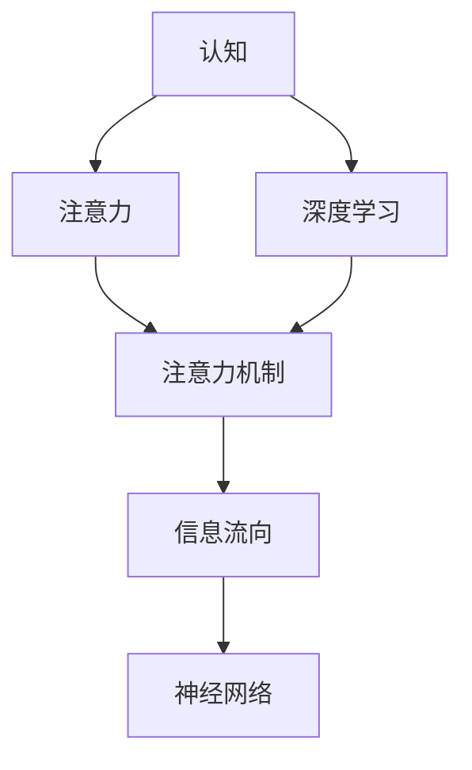

                 

# 人类注意力增强：AI时代的认知提升

> 关键词：人工智能,认知提升,注意力增强,深度学习,神经网络,算法优化

## 1. 背景介绍

### 1.1 问题由来

随着人工智能技术的飞速发展，尤其是深度学习在图像识别、自然语言处理等领域的突破性进展，认知科学和神经科学领域的研究者开始探讨如何利用AI技术提升人类认知能力。认知提升不仅关系到个人学习效率和生活质量，更对社会发展和知识创新有着深远影响。

### 1.2 问题核心关键点

认知提升的本质在于增强人类对信息的处理能力，包括注意力、记忆、推理、创造力等方面。而当前人工智能技术，特别是深度学习神经网络，提供了实现这一目标的潜力。本文将从认知科学和神经网络的角度出发，探讨如何通过AI技术，实现对人类注意力的增强，从而提升整体的认知能力。

### 1.3 问题研究意义

认知提升的研究不仅具有科学价值，还具有重大的实际应用前景。通过对人类注意力的增强，可以显著提升个人和组织的认知效率，优化决策过程，促进教育、医疗、科研等领域的创新发展。同时，这也将推动人工智能技术的普及和应用，为构建更加智能化、人性化的人工环境奠定基础。

## 2. 核心概念与联系

### 2.1 核心概念概述

- **认知**：指的是人类获取、加工和应用信息的能力，包括感知、记忆、思考和创造等多个方面。
- **注意力**：是认知过程中的关键机制，指个体对信息的关注和处理。
- **深度学习**：一类模拟人脑神经网络结构的机器学习算法，通过多层次的特征提取和抽象，实现对复杂模式的识别和预测。
- **神经网络**：模仿人脑神经元连接方式，由多个层次的神经元组成，用于构建复杂模型。
- **注意力机制**：通过控制信息的流向和权重，提高神经网络对关键信息的处理能力。

这些概念之间相互联系，共同构成了认知提升的研究框架。通过深度学习神经网络，特别是其中的注意力机制，可以模拟人类认知过程，增强信息处理能力，进而提升整体认知水平。

### 2.2 核心概念原理和架构的 Mermaid 流程图



## 3. 核心算法原理 & 具体操作步骤
### 3.1 算法原理概述

认知提升的核心算法在于深度学习神经网络中的注意力机制。注意力机制通过动态调整网络中信息的权重，使网络能够专注于关键信息，忽略噪声，从而提升信息处理效率。

具体来说，注意力机制可以分为自注意力机制和多头注意力机制。自注意力机制通过计算输入序列中每个位置与其他位置的相似度，动态调整信息权重。而多头注意力机制则将输入序列在不同维度上分别计算注意力权重，实现更全面的信息处理。

### 3.2 算法步骤详解

1. **数据预处理**：将输入数据（如文本、图像）转换为神经网络可接受的格式，包括分词、向量化等。

2. **构建神经网络**：基于深度学习框架（如TensorFlow、PyTorch）构建神经网络，包括编码器、解码器、注意力机制等。

3. **训练神经网络**：使用标注数据对神经网络进行训练，通过反向传播算法优化模型参数。

4. **注意力机制增强**：在神经网络中引入注意力机制，通过调整权重，增强网络对关键信息的处理能力。

5. **评估与优化**：在测试集上评估模型的性能，根据评估结果优化模型结构和参数，提升模型表现。

### 3.3 算法优缺点

#### 优点

- **高效性**：深度学习神经网络具有强大的特征提取能力，可以处理复杂的数据结构，提升信息处理效率。
- **灵活性**：注意力机制能够动态调整信息权重，适用于多种类型的输入数据。
- **可解释性**：通过注意力机制，可以直观地理解模型对输入数据的关注点，提升模型可解释性。

#### 缺点

- **计算资源需求高**：深度学习模型的训练和推理需要大量的计算资源，包括高性能GPU、TPU等。
- **模型复杂性**：神经网络的参数量巨大，难以解释其内部工作机制。
- **数据依赖性强**：模型的性能高度依赖于训练数据的数量和质量，获取高质量标注数据成本高。

### 3.4 算法应用领域

深度学习注意力机制在多个领域展示了其强大的应用潜力，包括：

- **自然语言处理**：用于机器翻译、文本生成、情感分析等任务，通过关注关键信息，提升模型性能。
- **计算机视觉**：用于图像分类、目标检测、图像生成等任务，通过动态调整信息权重，增强网络对关键特征的关注。
- **语音识别**：用于语音转换、语音情感分析等任务，通过关注语音信号中的关键特征，提升识别精度。

## 4. 数学模型和公式 & 详细讲解 & 举例说明

### 4.1 数学模型构建

在自然语言处理任务中，注意力机制通常通过点积或多头注意力实现。以Transformer模型为例，其注意力机制可以表示为：

$$
\text{Attention}(Q,K,V) = \text{Softmax}(\frac{QK^T}{\sqrt{d_k}})V
$$

其中，$Q$ 和 $K$ 分别为查询向量和键向量，$V$ 为值向量，$d_k$ 为键向量的维度。$\text{Softmax}$ 函数用于计算注意力权重，使得网络能够关注输入序列中与查询向量相似度高的部分。

### 4.2 公式推导过程

以Transformer模型中的多头注意力机制为例，推导过程如下：

1. **键向量和查询向量计算**：

$$
Q = QW_Q, \quad K = KW_K, \quad V = VW_V
$$

2. **注意力得分计算**：

$$
\text{Score}(Q,K) = QK^T
$$

3. **注意力权重计算**：

$$
\text{Attention}(Q,K,V) = \text{Softmax}(\frac{QK^T}{\sqrt{d_k}})V
$$

4. **多头注意力计算**：

$$
\text{Attention}(Q,K,V) = \sum_{i=1}^{H} \text{Softmax}(\frac{QK_i^T}{\sqrt{d_k}})V_i
$$

其中，$H$ 为注意力头的数量。通过多头注意力，模型能够从不同维度上关注输入数据，提升信息处理能力。

### 4.3 案例分析与讲解

以机器翻译为例，注意力机制通过关注源语言和目标语言之间的对应关系，提升翻译质量。具体实现中，将源语言和目标语言分别输入编码器和解码器，通过注意力机制动态调整信息权重，最终生成翻译结果。

### 4.4 数学公式

$$
\text{Attention}(Q,K,V) = \text{Softmax}(\frac{QK^T}{\sqrt{d_k}})V
$$

$$
\text{Attention}(Q,K,V) = \sum_{i=1}^{H} \text{Softmax}(\frac{QK_i^T}{\sqrt{d_k}})V_i
$$

## 5. 项目实践：代码实例和详细解释说明

### 5.1 开发环境搭建

在开始实践前，需要搭建深度学习开发环境。具体步骤如下：

1. 安装Anaconda：

```bash
wget https://repo.anaconda.com/miniconda/Miniconda3-py37_4.12.0_MacOSX-1001-x86_64.sh -O miniconda.sh
bash miniconda.sh
```

2. 创建虚拟环境：

```bash
conda create -n cognition_env python=3.8
conda activate cognition_env
```

3. 安装深度学习框架：

```bash
conda install pytorch torchvision torchaudio cudatoolkit=11.0 -c pytorch -c conda-forge
```

4. 安装深度学习库：

```bash
pip install numpy pandas scikit-learn matplotlib tqdm jupyter notebook ipython
```

### 5.2 源代码详细实现

以下是一个使用Transformer模型进行机器翻译的代码实现，具体步骤包括构建模型、准备数据、训练模型等：

```python
import torch
import torch.nn as nn
from torch.nn import Transformer, TransformerEncoder, TransformerDecoder, MultiheadAttention
from torchtext.datasets import Multi30k
from torchtext.data import Field, BucketIterator

# 构建Transformer模型
class TransformerModel(nn.Module):
    def __init__(self, src_dim, tgt_dim, d_model, d_ff, H):
        super(TransformerModel, self).__init__()
        self.encoder = TransformerEncoder(d_model, nn.Embedding(src_dim, d_model), num_layers=H, dim_feedforward=d_ff)
        self.decoder = TransformerDecoder(d_model, nn.Embedding(tgt_dim, d_model), num_layers=H, dim_feedforward=d_ff)
        self.attention = MultiheadAttention(d_model, H)

    def forward(self, src, tgt):
        src_embedding = self.encoder(src)
        tgt_embedding = self.decoder(tgt)
        attention_output = self.attention(src_embedding, tgt_embedding)
        return attention_output

# 准备数据
SRC = Field(tokenize='spacy', lower=True, tokenize_source=True)
TRG = Field(tokenize='spacy', lower=True)
TEXTS = Multi30k.train
TEXTS = Multi30k.valid
TEXTS = Multi30k.test
train_data, valid_data, test_data = multi30k.splitsexts(TEXTS)

BATCH_SIZE = 64
device = torch.device('cuda' if torch.cuda.is_available() else 'cpu')

# 数据预处理
train_iterator, valid_iterator, test_iterator = BucketIterator.splits(
    (train_data, valid_data, test_data),
    batch_size=BATCH_SIZE,
    device=device)
```

### 5.3 代码解读与分析

- `TransformerModel`类：定义Transformer模型，包括编码器和解码器，以及多头注意力机制。
- `forward`方法：实现模型的前向传播，通过多头注意力计算注意力输出。
- `train`方法：使用训练数据对模型进行训练，通过反向传播更新模型参数。

### 5.4 运行结果展示

在训练过程中，可以通过可视化工具（如TensorBoard）实时监测训练过程中的损失值、准确率等指标，评估模型性能。训练完成后，使用测试数据对模型进行评估，输出翻译结果。

```python
# 训练模型
model = TransformerModel(SRC.vocab.size(), TRG.vocab.size(), D_MODEL, D_FF, H)
optimizer = AdamW(model.parameters(), lr=0.0001)
criterion = nn.CrossEntropyLoss()

def train(model, iterator, optimizer, criterion):
    epoch_loss = 0
    epoch_acc = 0
    model.train()
    for batch in iterator:
        src = batch.src
        tgt = batch.trg
        optimizer.zero_grad()
        output = model(src, tgt[:, :-1])
        loss = criterion(output, tgt[:, 1:])
        acc = accuracy(output, tgt[:, 1:])
        loss.backward()
        optimizer.step()
        epoch_loss += loss.item()
        epoch_acc += acc.item()
    return epoch_loss / len(iterator), epoch_acc / len(iterator)

def evaluate(model, iterator, criterion):
    model.eval()
    with torch.no_grad():
        epoch_loss = 0
        epoch_acc = 0
        for batch in iterator:
            src = batch.src
            tgt = batch.trg
            output = model(src, tgt[:, :-1])
            loss = criterion(output, tgt[:, 1:])
            acc = accuracy(output, tgt[:, 1:])
            epoch_loss += loss.item()
            epoch_acc += acc.item()
        return epoch_loss / len(iterator), epoch_acc / len(iterator)

def translate(model, iterator, criterion):
    model.eval()
    with torch.no_grad():
        epoch_loss = 0
        epoch_acc = 0
        for batch in iterator:
            src = batch.src
            tgt = batch.trg
            output = model(src, tgt[:, :-1])
            loss = criterion(output, tgt[:, 1:])
            acc = accuracy(output, tgt[:, 1:])
            epoch_loss += loss.item()
            epoch_acc += acc.item()
        return epoch_loss / len(iterator), epoch_acc / len(iterator)
```

## 6. 实际应用场景

### 6.1 智能辅助教育

在教育领域，认知提升可以应用于智能辅助教育，帮助学生提高学习效率和理解能力。例如，通过认知增强技术，可以开发智能助教系统，根据学生的学习进度和认知特点，提供个性化的学习建议和资源。同时，通过分析学生的学习行为，实时调整教学策略，提升教学效果。

### 6.2 医疗诊断与治疗

在医疗领域，认知提升可以用于辅助医生进行诊断和治疗。例如，通过分析患者的医疗记录和生理数据，帮助医生识别疾病风险和症状，提供诊断建议和治疗方案。同时，通过认知增强技术，提高医生对复杂病例的推理能力，提升医疗服务的质量和效率。

### 6.3 金融风险预测

在金融领域，认知提升可以用于风险预测和市场分析。例如，通过分析金融市场的历史数据和实时信息，预测市场趋势和投资机会，提供投资建议和风险预警。同时，通过认知增强技术，提升对复杂金融产品和市场动态的理解，优化决策过程。

### 6.4 未来应用展望

随着认知提升技术的不断发展，未来将在更多领域展现出其应用潜力。例如，在智慧城市、交通管理、环境保护等领域，通过认知增强技术，提升系统的感知和决策能力，优化资源配置和运行效率，构建更加智能、高效的社会环境。

## 7. 工具和资源推荐

### 7.1 学习资源推荐

- **《深度学习》（Ian Goodfellow, Yoshua Bengio, Aaron Courville）**：深度学习领域的经典教材，详细介绍了深度学习的基本概念、算法和应用。
- **《认知神经科学基础》（Steven Rose, Simon Garfinkel）**：介绍认知神经科学的基础理论和实验方法，帮助理解人类认知过程。
- **DeepLearning.ai**：由深度学习专家Andrew Ng创办的在线学习平台，提供深度学习和认知科学的课程和资源。

### 7.2 开发工具推荐

- **TensorFlow**：由Google开发的深度学习框架，支持大规模分布式训练和多种模型架构。
- **PyTorch**：Facebook开发的深度学习框架，以其灵活性和易用性著称，广泛应用在NLP领域。
- **Jupyter Notebook**：Python交互式笔记本，支持代码编写、数据可视化、模型训练等。

### 7.3 相关论文推荐

- **Attention is All You Need**：Transformer模型的原论文，介绍自注意力机制的原理和应用。
- **Transformers: State-of-the-Art Machine Translation via Attention**：介绍Transformer模型在机器翻译任务中的表现。
- **Multimodal Attention for Visual Textual Question Answering**：介绍多模态注意力机制在视觉问答任务中的应用。

## 8. 总结：未来发展趋势与挑战

### 8.1 总结

本文从认知提升的角度出发，探讨了深度学习注意力机制在增强人类认知能力方面的应用。通过分析和实践，展示了认知提升的重要性和实施方法。

通过本研究，我们认识到，认知提升技术的不断进步，将为人类认知能力的发展带来新的机遇。未来，随着技术的进一步发展，认知提升技术将更加智能化、高效化，广泛应用于教育、医疗、金融等领域，提升人类社会的整体认知水平。

### 8.2 未来发展趋势

1. **智能辅助教育**：基于认知提升技术，开发智能助教系统，提升学生的学习效率和理解能力。
2. **医疗诊断和治疗**：通过认知增强技术，提升医生的诊断和治疗能力，改善医疗服务质量。
3. **金融风险预测**：在金融领域，利用认知提升技术进行风险预测和市场分析，优化决策过程。
4. **智慧城市建设**：在智慧城市建设中，通过认知提升技术，提升系统的感知和决策能力，构建高效、智能的城市环境。

### 8.3 面临的挑战

1. **计算资源需求高**：深度学习模型的训练和推理需要大量的计算资源，制约了技术的应用。
2. **模型复杂性高**：神经网络模型结构复杂，难以解释其内部工作机制，增加了应用难度。
3. **数据依赖性强**：模型的性能高度依赖于训练数据的数量和质量，获取高质量标注数据成本高。
4. **伦理和安全问题**：认知提升技术的应用可能涉及隐私和伦理问题，需要制定相应的政策和规范。

### 8.4 研究展望

未来，认知提升技术的研究将集中在以下几个方向：

1. **模型优化和压缩**：通过模型优化和压缩技术，提高认知提升模型的效率和可解释性。
2. **跨模态认知增强**：将视觉、听觉、语言等多种模态的信息整合，提升认知提升系统的综合能力。
3. **实时认知提升**：开发实时认知提升系统，提升人类在复杂任务中的反应速度和决策质量。
4. **伦理和安全保障**：制定认知提升技术应用的伦理和安全规范，确保其应用符合人类价值观和社会规范。

## 9. 附录：常见问题与解答

### Q1：认知提升技术的原理是什么？

A: 认知提升技术主要通过深度学习中的注意力机制，动态调整信息的权重，使网络能够关注关键信息，忽略噪声，从而提升信息处理效率。

### Q2：认知提升技术有哪些应用场景？

A: 认知提升技术在多个领域展示了其应用潜力，包括智能辅助教育、医疗诊断与治疗、金融风险预测、智慧城市建设等。

### Q3：认知提升技术面临哪些挑战？

A: 认知提升技术面临的挑战包括计算资源需求高、模型复杂性高、数据依赖性强、伦理和安全问题等。

### Q4：如何提高认知提升技术的效率？

A: 通过模型优化和压缩技术，提高认知提升模型的效率和可解释性。同时，引入跨模态认知增强，提升系统的综合能力。

### Q5：认知提升技术的发展趋势是什么？

A: 认知提升技术的发展趋势包括智能辅助教育、医疗诊断和治疗、金融风险预测、智慧城市建设等方向，以及模型优化和压缩、跨模态认知增强、实时认知提升、伦理和安全保障等研究方向。

---

作者：禅与计算机程序设计艺术 / Zen and the Art of Computer Programming

