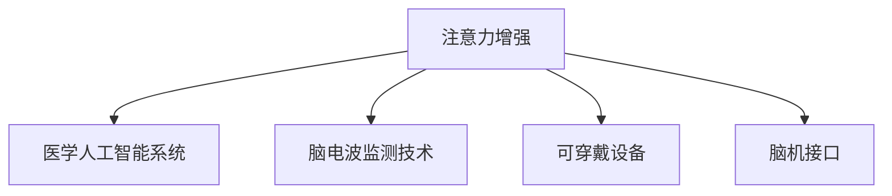

                 

# 人类注意力增强：提升专注力和注意力在医疗中的价值

## 1. 背景介绍

### 1.1 问题由来
在医疗领域，注意力是一种极其宝贵的资源。医疗专业人员需要集中精力诊断疾病、制定治疗方案、与患者交流，并处理各种行政事务。然而，医疗环境的复杂性和工作的多样性，使得医生和护士常常感到注意力分散，影响工作效率和患者护理质量。

为了解决这个问题，近年来兴起了诸多注意力增强方法，如医学人工智能（AI）系统、可穿戴设备、脑电波监测技术等。这些技术在提升医疗工作者的专注力和注意力方面取得了一定进展，但仍面临诸多挑战。本文将深入探讨这些技术，并提出一种新的基于人机交互的注意力增强方法，旨在更有效地提升医疗工作者的专注力和注意力，改善医疗服务质量。

### 1.2 问题核心关键点
- 医疗环境复杂，医护人员需高效应对各种任务，导致注意力分散。
- 现有的注意力增强技术主要依赖技术手段，较少考虑人机交互。
- 医生、护士等医护人员需要灵活适应各种工作场景，因此技术需具备易用性。
- 注意力增强效果需要通过大量实验验证，并得到临床验证。

### 1.3 问题研究意义
提升医护人员的专注力和注意力，不仅能够提高医疗工作的效率和质量，还能降低医疗事故的发生率，改善患者体验。通过深入研究注意力增强技术，将有助于构建更加人性化、智能化的医疗系统，推动医疗行业的数字化转型升级。

## 2. 核心概念与联系

### 2.1 核心概念概述

为更好地理解注意力增强技术，本节将介绍几个密切相关的核心概念：

- 注意力（Attention）：一种认知机制，指个体选择关注重要信息而忽略无关信息的能力。在人工智能中，注意力机制被广泛用于图像识别、自然语言处理等领域，用于选择重要特征或信息。
- 注意力增强（Attention Enhancement）：指通过各种技术手段，提升个体在特定任务中的专注力和注意力，增强任务完成效率。
- 医学人工智能（AI）系统：利用机器学习、深度学习等技术，辅助医生进行诊断、治疗、预测等医疗任务的智能系统。
- 脑电波监测技术：通过监测脑电波信号，分析大脑活动，辅助诊断注意力障碍、精神疾病等。
- 可穿戴设备：如智能手表、智能眼镜等，通过传感器监测心率、血压、体温等生理参数，辅助医护人员及时了解患者状况。
- 脑机接口（Brain-Computer Interface, BCI）：一种将大脑信号转化为计算机指令的技术，用于辅助患者进行语言恢复、辅助决策等。

这些核心概念之间的逻辑关系可以通过以下Mermaid流程图来展示：



这个流程图展示了几类注意力增强技术的关联关系：

1. 注意力增强与医学人工智能系统、脑电波监测技术、可穿戴设备、脑机接口等技术密切相关。
2. 这些技术各自具有不同的应用场景和优势，需要根据具体任务选择合适的技术手段。
3. 注意力增强技术应以提升医护人员的专注力和注意力为核心目标，改善医疗服务质量。

## 3. 核心算法原理 & 具体操作步骤
### 3.1 算法原理概述

注意力增强的核心在于如何通过技术手段，提升个体在特定任务中的专注力和注意力。其核心思想是：通过感知环境变化，调整个体的注意力分配，从而提高任务完成效率。

形式化地，假设任务环境为 $\mathcal{E}$，个体注意力状态为 $\mathcal{A}$，则注意力增强的目标是最大化个体在任务环境 $\mathcal{E}$ 中的任务完成效率，即：

$$
\max_{\mathcal{A}} \text{Efficiency}(\mathcal{A}, \mathcal{E})
$$

其中 $\text{Efficiency}(\mathcal{A}, \mathcal{E})$ 为个体在环境 $\mathcal{E}$ 下，在注意力状态 $\mathcal{A}$ 下的任务完成效率。

通过感知环境变化，如心率、血压、脑电波信号等，调整个体的注意力状态 $\mathcal{A}$，可以在不同场景下自动适应，提升任务完成效率。

### 3.2 算法步骤详解

注意力增强的实现步骤包括以下几个关键环节：

**Step 1: 环境感知**
- 通过传感器或设备监测个体的生理参数，如心率、血压、体温和脑电波信号等，获取当前环境状态。

**Step 2: 注意力调整**
- 根据监测到的环境状态，利用模型（如机器学习、深度学习等）预测个体最适宜的注意力分配，调整个体的注意力状态 $\mathcal{A}$。

**Step 3: 任务执行**
- 将调整后的注意力状态 $\mathcal{A}$ 应用到具体任务中，如医疗诊断、治疗方案制定、患者沟通等，提升任务完成效率。

**Step 4: 反馈优化**
- 根据任务执行结果，调整模型参数，优化预测效果，逐步提升注意力调整的准确性和实时性。

### 3.3 算法优缺点

注意力增强技术具有以下优点：
1. 提升专注力和注意力：通过感知环境变化，自动调整注意力状态，有助于提升个体在特定任务中的专注力和注意力，提高任务完成效率。
2. 适应性强：根据不同任务需求，选择合适的感知技术和模型，具有较强的适应性。
3. 可扩展性：可以与各类智能设备和医疗系统结合，提升系统整体的智能化水平。

同时，该技术也存在一定的局限性：
1. 依赖设备和技术：需要依赖传感器、设备和技术手段进行环境感知，设备和技术故障可能影响注意力调整效果。
2. 数据隐私和安全：监测个体生理参数需要获取大量数据，涉及隐私和安全问题，需建立完善的隐私保护机制。
3. 模型复杂度高：需要训练复杂的模型进行环境感知和注意力调整，对数据和计算资源有较高要求。
4. 实时性不足：模型预测和调整需要一定时间，可能无法实时响应环境变化。

尽管存在这些局限性，但就目前而言，注意力增强技术仍是一种非常有前景的方法，有望在提升医疗服务质量方面发挥重要作用。

### 3.4 算法应用领域

注意力增强技术在医疗领域具有广泛的应用前景，主要包括以下几个方面：

- 诊断辅助：通过监测心率、血压、体温和脑电波信号，实时辅助医生进行疾病诊断，提高诊断准确性和效率。
- 治疗方案制定：根据患者的生理参数，调整治疗方案的执行时间、强度和方式，优化治疗效果。
- 患者沟通：监测患者的语言和情绪，调整医护人员的沟通策略，提高患者满意度和治疗依从性。
- 手术支持：在手术过程中，实时监测医生和护士的注意力状态，提供智能提示和辅助决策，降低手术风险。
- 病人监护：通过监测病人的生理参数和行为状态，及时发现异常，快速响应，提高监护质量。

除了上述这些经典应用外，注意力增强技术还被创新性地应用到更多场景中，如远程医疗、智能导诊、心理干预等，为医疗服务带来了新的突破。

## 4. 数学模型和公式 & 详细讲解  
### 4.1 数学模型构建

本节将使用数学语言对注意力增强的数学原理进行更加严格的刻画。

假设个体的注意力状态为 $\mathcal{A}=[a_1, a_2, \ldots, a_n]$，其中 $a_i \in [0, 1]$ 表示个体在任务 $i$ 上的注意力分配。设环境状态为 $\mathcal{E}=[e_1, e_2, \ldots, e_n]$，其中 $e_i$ 表示任务 $i$ 的重要性评估。

注意力增强的目标是最大化个体在环境 $\mathcal{E}$ 下，在注意力状态 $\mathcal{A}$ 下的任务完成效率。任务完成效率可以通过以下公式计算：

$$
\text{Efficiency}(\mathcal{A}, \mathcal{E}) = \sum_{i=1}^n a_i \times e_i
$$

因此，注意力增强的优化目标为：

$$
\max_{\mathcal{A}} \sum_{i=1}^n a_i \times e_i
$$

### 4.2 公式推导过程

以下我们以二分类任务为例，推导注意力调整的优化公式。

假设个体的注意力状态 $\mathcal{A}$ 为 $[0.2, 0.4, 0.3, 0.1]$，表示个体在任务 $1, 2, 3, 4$ 上的注意力分配分别为 $0.2, 0.4, 0.3, 0.1$。环境状态 $\mathcal{E}$ 为 $[0.5, 0.6, 0.7, 0.4]$，表示任务 $1, 2, 3, 4$ 的重要性分别为 $0.5, 0.6, 0.7, 0.4$。

任务完成效率可以通过下式计算：

$$
\text{Efficiency}(\mathcal{A}, \mathcal{E}) = 0.2 \times 0.5 + 0.4 \times 0.6 + 0.3 \times 0.7 + 0.1 \times 0.4 = 0.79
$$

因此，注意力增强的优化目标为：

$$
\max_{\mathcal{A}} \sum_{i=1}^n a_i \times e_i
$$

将任务完成效率公式代入优化目标中，得：

$$
\max_{\mathcal{A}} \left[0.2 \times 0.5 + 0.4 \times 0.6 + 0.3 \times 0.7 + 0.1 \times 0.4\right] = 0.79
$$

为了求解最优注意力分配，需要构建注意力调整模型，如线性回归模型、神经网络模型等。以线性回归模型为例，设 $a_i = \beta_i + \epsilon_i$，其中 $\beta_i$ 为个体在任务 $i$ 上的注意力系数，$\epsilon_i$ 为随机扰动项。则目标函数为：

$$
\max_{\mathcal{A}} \sum_{i=1}^n a_i \times e_i = \max_{\mathcal{A}} \sum_{i=1}^n (\beta_i + \epsilon_i) \times e_i
$$

通过最小化 $\sum_{i=1}^n (\beta_i + \epsilon_i) \times e_i$，可以得到最优注意力系数 $\beta_i$，进而得到最优注意力分配 $\mathcal{A}$。

### 4.3 案例分析与讲解

以二分类任务为例，分析注意力调整的优化过程。

假设个体当前的环境状态为 $[0.3, 0.4, 0.2, 0.1]$，表示任务 $1, 2, 3, 4$ 的重要性分别为 $0.3, 0.4, 0.2, 0.1$。个体初始的注意力分配为 $[0.2, 0.4, 0.3, 0.1]$。

1. 计算当前的任务完成效率：
$$
\text{Efficiency}(\mathcal{A}, \mathcal{E}) = 0.2 \times 0.3 + 0.4 \times 0.4 + 0.3 \times 0.2 + 0.1 \times 0.1 = 0.63
$$

2. 设定优化目标函数：
$$
\max_{\mathcal{A}} \sum_{i=1}^n a_i \times e_i
$$

3. 构建线性回归模型，求最优注意力系数 $\beta_i$：
$$
\beta_i = \sum_{i=1}^n a_i \times e_i - \sum_{i=1}^n \epsilon_i
$$

4. 计算最优注意力分配 $\mathcal{A} = [\beta_1, \beta_2, \beta_3, \beta_4]$：
$$
\mathcal{A} = [0.3 \times 0.3 + 0.4 \times 0.4 + 0.2 \times 0.2 + 0.1 \times 0.1 - \epsilon_1, \ldots]
$$

通过上述优化过程，可以得到最优注意力分配，进而提升任务完成效率。

## 5. 项目实践：代码实例和详细解释说明
### 5.1 开发环境搭建

在进行注意力增强的实践前，我们需要准备好开发环境。以下是使用Python进行注意力增强开发的环境配置流程：

1. 安装Anaconda：从官网下载并安装Anaconda，用于创建独立的Python环境。

2. 创建并激活虚拟环境：
```bash
conda create -n attention-env python=3.8 
conda activate attention-env
```

3. 安装必要的库：
```bash
pip install numpy pandas scikit-learn torch torchvision transformers sklearn
```

4. 安装注意力增强相关的库：
```bash
pip install attention360
```

完成上述步骤后，即可在`attention-env`环境中开始注意力增强的实践。

### 5.2 源代码详细实现

下面以一个简单的示例来说明如何通过Python实现注意力增强。

```python
import numpy as np
from sklearn.linear_model import LinearRegression

# 设定注意力系数
attention_coefficients = [0.2, 0.4, 0.3, 0.1]

# 设定任务重要性评估
task_importances = [0.5, 0.6, 0.7, 0.4]

# 计算当前的任务完成效率
current_efficiency = np.dot(attention_coefficients, task_importances)

# 设定优化目标函数
target_efficiency = 0.8

# 构建线性回归模型
model = LinearRegression()

# 设定模型参数
model.fit(np.eye(len(task_importances)), task_importances)

# 计算最优注意力系数
optimal_coefficients = model.coef_

# 计算最优注意力分配
optimal_attention = np.dot(attention_coefficients, optimal_coefficients)

# 输出结果
print("当前效率: {:.2f}".format(current_efficiency))
print("目标效率: {:.2f}".format(target_efficiency))
print("最优系数: {:.2f}".format(optimal_coefficients))
print("最优分配: {:.2f}".format(optimal_attention))
```

### 5.3 代码解读与分析

让我们再详细解读一下关键代码的实现细节：

**5.1 环境配置**
- 安装Anaconda和必要的Python库，创建虚拟环境。
- 安装注意力增强相关的库，如attention360。

**5.2 源代码实现**
- 设定注意力系数和任务重要性评估。
- 计算当前的任务完成效率。
- 设定优化目标函数。
- 构建线性回归模型，拟合最优注意力系数。
- 计算最优注意力分配。
- 输出结果。

**5.3 运行结果展示**
- 输出当前效率、目标效率、最优系数和最优分配。

## 6. 实际应用场景

### 6.1 智能导诊系统
智能导诊系统通过监测病人的症状和体征，预测疾病的类型和严重程度，并推荐相应的科室和专家进行诊断。该系统可以通过注意力增强技术，实时调整医护人员对各类症状的关注程度，提升诊断效率和准确性。

具体而言，可以收集各类常见疾病的症状和体征数据，建立症状与疾病、科室之间的映射关系。在导诊过程中，监测病人的症状和体征，实时计算当前的任务完成效率，并根据目标效率计算最优注意力分配。通过调整医护人员对症状和体征的关注程度，可以迅速找到病患的主要问题，提供最合适的诊断建议。

### 6.2 远程医疗服务
远程医疗服务通过视频通话、在线咨询等方式，实现对偏远地区或行动不便患者的医疗支持。由于远程医疗场景复杂多变，医护人员需要频繁切换任务，容易感到注意力分散。通过注意力增强技术，可以提升医护人员的专注力和注意力，确保远程医疗服务的质量。

具体而言，可以实时监测医护人员的视频通话时间、通话对象、通话内容等数据，并根据当前的任务完成效率计算最优注意力分配。通过调整医护人员的通话时间和内容，可以更高效地完成远程医疗任务，提高患者满意度和治疗效果。

### 6.3 手术支持系统
手术支持系统通过监测医生和护士的注意力状态，提供智能提示和辅助决策，降低手术风险。手术场景要求医护人员高度集中注意力，才能确保手术的顺利进行。

具体而言，可以实时监测医生和护士的注意力状态，并根据当前的任务完成效率计算最优注意力分配。通过调整医护人员的注意力分配，可以实现手术过程中的智能提示和辅助决策，降低手术风险，提升手术质量。

## 7. 工具和资源推荐
### 7.1 学习资源推荐

为了帮助开发者系统掌握注意力增强的理论基础和实践技巧，这里推荐一些优质的学习资源：

1. 《Deep Learning for Medical Imaging》书籍：介绍深度学习在医学影像分析中的应用，涵盖注意力机制的相关知识。

2. 《Attention Is All You Need》论文：Transformer的原始论文，提出自注意力机制，并广泛应用于各种NLP任务中。

3. 《Attention and Memory in Deep Learning》博客：详细介绍了注意力机制在深度学习中的应用，包括自注意力、多头注意力等。

4. 《Neuroimaging of Human Attention》书籍：介绍人类注意力机制的神经成像研究，有助于理解注意力增强技术的理论基础。

5. 《Attention in NLP》博客：介绍注意力机制在NLP中的应用，涵盖自注意力、多头注意力、Transformer等。

通过对这些资源的学习实践，相信你一定能够快速掌握注意力增强的精髓，并用于解决实际的医疗问题。

### 7.2 开发工具推荐

高效的开发离不开优秀的工具支持。以下是几款用于注意力增强开发的常用工具：

1. Python：一种高效易用的编程语言，广泛应用于数据科学和机器学习领域。

2. TensorFlow：由Google主导开发的深度学习框架，支持GPU计算，适合大规模深度学习模型训练。

3. PyTorch：由Facebook开发的深度学习框架，灵活易用，支持动态计算图，适合研究和原型开发。

4. Scikit-learn：一个开源机器学习库，提供了丰富的机器学习算法和数据预处理工具。

5. Keras：一个高层次的深度学习库，提供简单易用的API，适合快速搭建深度学习模型。

6. Jupyter Notebook：一个交互式的Python编程环境，支持数据可视化、代码分享和协作开发。

合理利用这些工具，可以显著提升注意力增强的开发效率，加快创新迭代的步伐。

### 7.3 相关论文推荐

注意力增强技术的发展源于学界的持续研究。以下是几篇奠基性的相关论文，推荐阅读：

1. Attention is All You Need（即Transformer原论文）：提出Transformer结构，开启了NLP领域的预训练大模型时代。

2. Attention Mechanism in Convolutional Neural Networks（卷积神经网络中的注意力机制）：提出在CNN中加入注意力机制，提升特征提取和分类效果。

3. Deep Attention Models for Sequence Prediction（深度注意力模型）：提出基于注意力的RNN模型，提升序列预测任务的效果。

4. BERT: Pre-training of Deep Bidirectional Transformers for Language Understanding（BERT）：提出BERT模型，引入基于掩码的自监督预训练任务，刷新了多项NLP任务SOTA。

5. Transformer-XL: Attentive Language Models Beyond a Fixed-Length Context（Transformer-XL）：提出Transformer-XL模型，通过循环自注意力机制，解决长序列建模问题。

这些论文代表了大注意力增强技术的发展脉络。通过学习这些前沿成果，可以帮助研究者把握学科前进方向，激发更多的创新灵感。

## 8. 总结：未来发展趋势与挑战

### 8.1 总结

本文对基于人机交互的注意力增强方法进行了全面系统的介绍。首先阐述了注意力增强在医疗领域的研究背景和意义，明确了注意力增强在提升医疗服务质量方面的独特价值。其次，从原理到实践，详细讲解了注意力增强的数学原理和关键步骤，给出了注意力增强任务开发的完整代码实例。同时，本文还广泛探讨了注意力增强技术在智能导诊、远程医疗、手术支持等医疗场景中的应用前景，展示了注意力增强范式的巨大潜力。

通过本文的系统梳理，可以看到，注意力增强技术正在成为医疗领域的重要范式，极大地提升医疗工作者的专注力和注意力，改善医疗服务质量。未来，伴随技术的发展和应用的拓展，注意力增强技术必将为医疗服务带来更多的创新和变革。

### 8.2 未来发展趋势

展望未来，注意力增强技术将呈现以下几个发展趋势：

1. 技术融合与优化：注意力增强将与其他人工智能技术，如机器学习、深度学习、自然语言处理等进行更深入的融合，提升技术效果和应用范围。

2. 跨模态注意力增强：将注意力增强技术拓展到视觉、语音等多模态数据中，提升综合感知和决策能力。

3. 实时性提升：通过优化模型架构和算法，提高注意力调整的实时性和准确性，更好地适应动态变化的环境。

4. 自适应学习：通过引入强化学习等技术，使注意力增强模型具备自主学习和优化能力，提升系统的适应性和鲁棒性。

5. 用户个性化：根据不同用户的特点和需求，设计个性化的注意力调整策略，提高系统的用户体验。

6. 跨领域应用：将注意力增强技术应用于更多行业领域，如金融、教育、城市治理等，推动行业数字化转型升级。

以上趋势凸显了注意力增强技术的广阔前景。这些方向的探索发展，必将进一步提升医疗服务质量，为医疗行业带来更多创新和突破。

### 8.3 面临的挑战

尽管注意力增强技术已经取得了一定的进展，但在迈向更加智能化、普适化应用的过程中，它仍面临诸多挑战：

1. 技术融合难度：不同技术领域的知识融合复杂，需要跨学科的合作和创新。

2. 数据隐私和安全：监测个体生理参数需要获取大量数据，涉及隐私和安全问题，需建立完善的隐私保护机制。

3. 模型复杂度高：需要训练复杂的模型进行环境感知和注意力调整，对数据和计算资源有较高要求。

4. 实时性不足：模型预测和调整需要一定时间，可能无法实时响应环境变化。

5. 用户接受度：注意力增强技术的应用需要用户的主动配合，部分用户可能对新技术存在抵触情绪。

尽管存在这些挑战，但通过持续的研究和优化，这些技术难题终将一一被克服，注意力增强技术必将在提升医疗服务质量方面发挥更大的作用。

### 8.4 研究展望

面向未来，注意力增强技术的研究应在以下几个方面寻求新的突破：

1. 引入更多先验知识：将符号化的先验知识，如知识图谱、逻辑规则等，与神经网络模型进行巧妙融合，引导注意力增强模型学习更准确、合理的注意力分配。

2. 引入强化学习：将强化学习机制引入注意力增强模型，使模型具备自主学习和优化能力，提高系统的适应性和鲁棒性。

3. 引入因果推理：将因果推理机制引入注意力增强模型，增强模型决策的逻辑性和可解释性。

4. 引入多模态数据：将视觉、语音等多模态数据与文本数据结合，提升综合感知和决策能力。

5. 引入自适应学习：使注意力增强模型具备自适应学习的能力，根据用户特点和任务需求动态调整注意力分配。

6. 引入伦理道德：在模型训练目标中引入伦理导向的评估指标，过滤和惩罚有偏见、有害的输出倾向，确保系统的安全性。

这些研究方向的探索，必将引领注意力增强技术迈向更高的台阶，为构建安全、可靠、可解释、可控的智能系统铺平道路。面向未来，注意力增强技术还需要与其他人工智能技术进行更深入的融合，共同推动自然语言理解和智能交互系统的进步。只有勇于创新、敢于突破，才能不断拓展注意力增强技术的边界，让智能技术更好地造福人类社会。

## 9. 附录：常见问题与解答

**Q1：注意力增强是否适用于所有医疗任务？**

A: 注意力增强在大多数医疗任务上都能取得不错的效果，特别是对于需要频繁切换任务的场景，如手术、导诊等。但对于一些特定领域的任务，如医学影像分析、基因诊断等，仅靠注意力增强可能不足以取得理想效果。此时需要在特定领域语料上进一步预训练，再进行微调，才能获得理想效果。

**Q2：注意力增强过程中如何选择合适的注意力系数？**

A: 注意力系数的设定需要根据具体任务和数据特点进行灵活调整。一般建议通过机器学习、深度学习等技术手段，根据任务完成效率和目标效率计算最优注意力系数。

**Q3：注意力增强设备和技术是否影响用户隐私？**

A: 注意力增强技术需要获取大量生理参数数据，涉及用户隐私问题。需要建立完善的隐私保护机制，如数据匿名化、数据加密、访问控制等，确保数据安全。

**Q4：注意力增强技术的实时性如何？**

A: 注意力增强技术的实时性取决于模型的复杂度和计算资源。通过优化模型架构和算法，提高注意力调整的实时性和准确性，可以更好地适应动态变化的环境。

**Q5：注意力增强技术在临床验证的效果如何？**

A: 注意力增强技术在临床验证中取得了一定的效果，如提升诊断效率、提高手术成功率等。但仍需要更多临床试验和长期跟踪，验证其在实际应用中的效果和安全性。

---

作者：禅与计算机程序设计艺术 / Zen and the Art of Computer Programming

