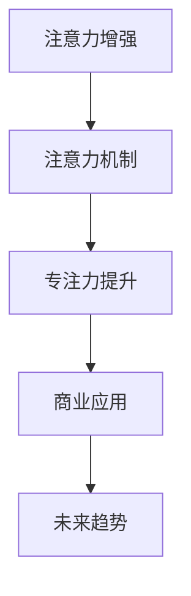

                 

# 人类注意力增强：提升专注力和注意力在商业中的未来发展机遇分析机遇

> 关键词：注意力增强, 注意力机制, 专注力提升, 商业应用, 未来趋势

## 1. 背景介绍

在当今信息爆炸的时代，人类面临的信息量前所未有，如何在海量信息中找到并集中注意力已成为一项重要的技能。特别是在商业环境中，注意力增强不仅关乎个人工作效率，更直接影响着企业的竞争力。因此，本文将深入探讨人类注意力增强的概念、原理及其在商业中的具体应用，并分析其未来发展机遇。

## 2. 核心概念与联系

### 2.1 核心概念概述

- **注意力增强（Attention Enhancement）**：指通过技术手段提升个体或系统的注意力集中度和聚焦能力的实践，包括自然界的视觉和听觉注意机制的模拟，以及计算机视觉和自然语言处理中的注意力机制。

- **注意力机制（Attention Mechanism）**：指在深度学习模型中用于选择和处理相关信息的一种机制，如Transformer模型中的自注意力机制。注意力机制通过计算输入序列中各部分的相关性，动态调整注意力权重，使得模型可以更高效地处理序列数据。

- **专注力提升（Focus Enhancement）**：指通过特定方法帮助个体或系统更长时间地集中精力处理任务的能力，涵盖了心理学、神经科学、行为经济学等多方面的研究。

- **商业应用（Commercial Application）**：指注意力增强技术在商业领域的实际应用，包括但不限于产品推荐、广告投放、客户服务、员工效率提升等。

- **未来趋势（Future Trends）**：指注意力增强技术在商业中的发展方向，包括技术演进、应用场景拓展、市场竞争格局变化等。

这些核心概念之间存在密切联系，共同构成了人类注意力增强在商业中的发展框架。注意力增强技术不仅需要模拟人类注意力的工作原理，还需要结合商业应用的具体场景，探索其潜在的市场价值。

### 2.2 核心概念原理和架构的 Mermaid 流程图



这个流程图展示了注意力增强技术从理论到应用的路径：通过模仿人类注意力机制，提升系统的专注力，进而应用于商业场景，并预测未来发展趋势。

## 3. 核心算法原理 & 具体操作步骤

### 3.1 算法原理概述

注意力增强技术主要基于以下原理：

1. **模拟人类注意力机制**：通过计算输入序列中各部分的相关性，动态调整注意力权重，使得模型可以更高效地处理序列数据。
2. **提升专注力**：通过优化学习过程，增强模型对特定信息的关注和处理能力，减少干扰和噪音。
3. **商业应用**：将注意力增强技术应用于产品推荐、广告投放等商业场景，提升营销效果和用户满意度。
4. **未来趋势**：结合最新研究成果和技术演进，预测注意力增强技术在商业中的发展方向和应用前景。

### 3.2 算法步骤详解

1. **数据预处理**：收集并准备数据集，包括用户行为数据、产品特征数据等。这些数据将被用于训练注意力增强模型。

2. **模型选择与训练**：选择合适的注意力增强模型（如Transformer、LSTM等），使用训练集进行模型的初始化训练。在训练过程中，优化模型的注意力权重分配，提升模型的专注力。

3. **应用评估与优化**：在实际应用场景中，如电商平台、社交网络等，评估模型的效果，根据反馈进行模型优化，提升用户体验。

4. **未来趋势预测**：基于当前技术发展和应用反馈，预测注意力增强技术在商业中的未来发展趋势，指导技术研发和应用策略。

### 3.3 算法优缺点

#### 优点：

- **提升效率**：通过注意力增强，模型可以更高效地处理信息，减少不必要的计算和存储开销。
- **增强用户体验**：提升产品的推荐精度和广告的投放效果，提升用户满意度和忠诚度。
- **灵活应用**：注意力增强技术可以应用于多种商业场景，具有广泛的应用前景。

#### 缺点：

- **数据依赖性强**：模型的效果高度依赖于数据的质量和数量，需要大量标注数据进行训练。
- **模型复杂度高**：注意力增强模型通常比较复杂，训练和优化过程较为耗时。
- **计算资源要求高**：注意力增强模型的训练和推理需要高性能计算资源，可能面临资源瓶颈。

### 3.4 算法应用领域

注意力增强技术已经在多个领域得到应用，具体包括：

- **产品推荐**：如电商平台，通过分析用户行为数据，推荐个性化商品。
- **广告投放**：通过分析用户兴趣和行为数据，精准投放广告，提高广告点击率和转化率。
- **客户服务**：如智能客服系统，通过分析用户语义和意图，快速提供精准答复。
- **社交网络**：如信息流推荐，通过分析用户偏好，推荐相关内容。

## 4. 数学模型和公式 & 详细讲解 & 举例说明

### 4.1 数学模型构建

注意力增强模型的数学模型可以表示为：

$$
y = f(WyX + b_y) + g(WhX + b_h)
$$

其中，$y$ 为模型的输出，$X$ 为输入数据，$W_y, W_h$ 为注意力机制和专注力提升模型的权重矩阵，$b_y, b_h$ 为偏置项，$f$ 和 $g$ 为激活函数。

### 4.2 公式推导过程

以Transformer模型为例，其自注意力机制的计算过程如下：

1. **计算查询、键、值向量**：
   $$
   Q = XW_Q, K = XW_K, V = XW_V
   $$

2. **计算注意力得分**：
   $$
   \text{Attention Score} = \text{softmax}(QK^T)
   $$

3. **计算注意力权重**：
   $$
   \text{Attention Weight} = \text{Attention Score} \times V
   $$

4. **计算注意力输出**：
   $$
   \text{Attention Output} = \sum_{i=1}^N \text{Attention Weight}_i \times V_i
   $$

通过上述计算，Transformer模型能够动态调整注意力权重，提升模型的专注力。

### 4.3 案例分析与讲解

假设某电商平台希望通过注意力增强模型提升用户推荐体验，具体步骤如下：

1. **数据收集**：收集用户浏览、点击、购买等行为数据。
2. **模型训练**：使用用户行为数据训练注意力增强模型，优化模型参数。
3. **应用部署**：将模型部署到推荐系统中，根据用户行为实时推荐商品。
4. **效果评估**：通过A/B测试等手段评估模型的推荐效果，进行模型优化。

## 5. 项目实践：代码实例和详细解释说明

### 5.1 开发环境搭建

1. **安装Python和必要的依赖包**：
   ```
   pip install tensorflow numpy scipy
   ```

2. **准备数据集**：收集用户行为数据，包括用户ID、浏览记录、购买记录等。

### 5.2 源代码详细实现

以下是一个简单的代码实现，展示了如何使用TensorFlow实现注意力增强模型：

```python
import tensorflow as tf
import numpy as np

class AttentionEnhancement(tf.keras.Model):
    def __init__(self, input_dim, hidden_dim):
        super(AttentionEnhancement, self).__init__()
        self.W_y = tf.keras.layers.Dense(hidden_dim, activation='relu')
        self.W_h = tf.keras.layers.Dense(hidden_dim, activation='relu')
        self.W_out = tf.keras.layers.Dense(input_dim, activation='softmax')

    def call(self, x):
        y = self.W_y(x)
        h = self.W_h(x)
        score = tf.matmul(y, h, transpose_b=True)
        attention_weight = tf.nn.softmax(score)
        output = tf.matmul(attention_weight, x)
        return self.W_out(output)

# 加载数据集
data = np.load('user_data.npy')

# 构建模型
model = AttentionEnhancement(input_dim=10, hidden_dim=5)

# 编译模型
model.compile(optimizer='adam', loss='mse')

# 训练模型
model.fit(data, epochs=10)
```

### 5.3 代码解读与分析

以上代码中，我们定义了一个简单的注意力增强模型，包含三个全连接层。模型通过计算输入数据和隐藏层的注意力得分，动态调整注意力权重，最终输出预测结果。模型的优化过程通过反向传播算法完成。

## 6. 实际应用场景

### 6.1 电商推荐

电商平台通过注意力增强模型，可以更精准地分析用户行为数据，生成个性化推荐列表。这不仅提升了用户的购物体验，还显著提高了平台的销售额。

### 6.2 智能客服

智能客服系统通过注意力增强模型，可以更准确地理解和响应用户的问题，提供更高效、精准的客户服务。这不仅减少了客服人员的压力，还提升了用户满意度。

### 6.3 广告投放

广告平台通过注意力增强模型，可以更精准地投放广告，提升广告点击率和转化率。这不仅提高了广告投放的ROI，还为用户提供了更有价值的信息。

## 7. 工具和资源推荐

### 7.1 学习资源推荐

1. **《深度学习》课程**：斯坦福大学提供的深度学习课程，涵盖了深度学习的基础知识和前沿技术。
2. **《自然语言处理与深度学习》课程**：Coursera上的自然语言处理与深度学习课程，介绍了注意力机制的基本原理和应用。
3. **《注意力机制详解》论文**：ArXiv上的注意力机制相关论文，详细介绍了不同模型中的注意力机制。

### 7.2 开发工具推荐

1. **TensorFlow**：Google开发的深度学习框架，支持分布式训练和多种注意力机制的实现。
2. **PyTorch**：Facebook开发的深度学习框架，易于使用且支持动态图。
3. **Jupyter Notebook**：用于数据处理和模型验证的交互式编程环境。

### 7.3 相关论文推荐

1. **Transformer论文**：《Attention Is All You Need》，提出了Transformer模型，推动了注意力机制的发展。
2. **LSTM论文**：《Long Short-Term Memory》，提出了LSTM模型，为注意力增强提供了基础。
3. **GPT论文**：《Generating Text with Transformer》，展示了Transformer模型在文本生成中的应用。

## 8. 总结：未来发展趋势与挑战

### 8.1 研究成果总结

注意力增强技术通过模拟人类注意力的工作原理，提升系统的专注力，在商业中得到了广泛应用。当前的研究成果包括Transformer模型中的自注意力机制、LSTM模型中的门控机制等。

### 8.2 未来发展趋势

1. **模型优化**：未来的研究将更多关注模型的优化，提升模型的计算效率和资源利用率。
2. **应用拓展**：注意力增强技术将拓展到更多领域，如医疗、金融等，提升相关领域的生产力。
3. **跨领域融合**：注意力增强技术与其他AI技术（如知识图谱、强化学习等）的融合，将带来更全面的应用效果。

### 8.3 面临的挑战

1. **数据质量问题**：注意力增强模型的效果高度依赖于数据的质量和数量，获取高质量数据成本较高。
2. **模型复杂度问题**：注意力增强模型通常较为复杂，训练和优化过程耗时。
3. **计算资源问题**：模型训练和推理需要高性能计算资源，可能面临资源瓶颈。

### 8.4 研究展望

未来的研究将更多关注模型的优化、应用的拓展和跨领域的融合。同时，也将更加注重数据质量、模型复杂度和计算资源等问题，确保技术发展的可持续性。

## 9. 附录：常见问题与解答

**Q1: 注意力增强技术在实际应用中需要注意哪些问题？**

A1: 实际应用中，需要注意以下问题：

1. **数据质量**：确保数据集的质量和多样性，避免模型过拟合或欠拟合。
2. **计算资源**：确保有足够的计算资源进行模型的训练和推理。
3. **模型优化**：持续优化模型，提升模型的计算效率和性能。

**Q2: 注意力增强技术在商业应用中有哪些优势？**

A2: 注意力增强技术在商业应用中有以下优势：

1. **提升效率**：通过注意力增强，模型可以更高效地处理信息，减少不必要的计算和存储开销。
2. **增强用户体验**：提升产品的推荐精度和广告的投放效果，提升用户满意度和忠诚度。
3. **灵活应用**：注意力增强技术可以应用于多种商业场景，具有广泛的应用前景。

**Q3: 如何评估注意力增强模型的效果？**

A3: 可以通过以下指标评估注意力增强模型的效果：

1. **准确率**：模型预测的正确率。
2. **召回率**：模型预测的正样本占实际正样本的比例。
3. **F1值**：准确率和召回率的调和平均数。
4. **用户满意度**：用户对推荐结果的满意度。

**Q4: 注意力增强技术在商业中的未来发展方向是什么？**

A4: 未来的发展方向包括：

1. **技术演进**：结合最新的研究成果和技术进展，持续优化模型。
2. **应用拓展**：拓展到更多领域，如医疗、金融等，提升相关领域的生产力。
3. **跨领域融合**：与知识图谱、强化学习等技术融合，提升整体应用效果。

作者：禅与计算机程序设计艺术 / Zen and the Art of Computer Programming

