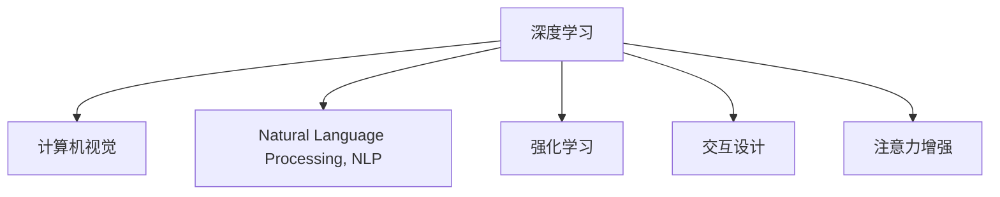

                 

# 人类注意力增强：提升专注力和注意力在商业中的未来发展机遇趋势预测

> 关键词：
- 注意力增强
- 专注力提升
- 人工智能
- 商业应用
- 未来发展趋势
- 技术机遇
- 趋势预测

## 1. 背景介绍

### 1.1 问题由来
在信息爆炸的今天，人类面临着前所未有的注意力危机。海量的信息流不断冲击着我们的感官，使我们难以集中注意力，专注于重要的信息。这不仅影响了个人的工作效率和生活质量，也对企业的生产力和市场竞争力造成了巨大威胁。因此，如何有效提升人类注意力，提高专注力，已成为当下科技和商业界亟待解决的问题。

### 1.2 问题核心关键点
注意力增强技术旨在通过人工智能技术，辅助人类提升注意力水平，增强专注力。其核心在于利用计算机视觉、自然语言处理、深度学习等前沿技术，构建智能化的注意力增强工具，帮助用户在信息海洋中找到真正的知识宝藏，释放个人潜力，提升商业生产力。

## 2. 核心概念与联系

### 2.1 核心概念概述

为更好地理解注意力增强技术，本节将介绍几个密切相关的核心概念：

- 注意力增强(Anti-Attention Enhancement)：通过AI技术辅助人类提升注意力水平，提高专注力，从而提升信息处理能力。
- 深度学习(Deep Learning)：一种基于多层神经网络的机器学习方法，通过学习数据的高层次特征，实现复杂的任务。
- 计算机视觉(Computer Vision)：利用计算机技术模拟人类视觉系统的功能，实现图像和视频数据的处理、理解和分析。
- 自然语言处理(Natural Language Processing, NLP)：通过计算机技术，让计算机能够理解、处理和生成人类语言。
- 强化学习(Reinforcement Learning)：通过智能体在环境中不断学习，优化决策策略，以实现特定目标。
- 交互设计(Interactive Design)：结合用户心理和行为，设计高效易用的用户界面，提升用户体验。

这些核心概念之间的逻辑关系可以通过以下Mermaid流程图来展示：



这个流程图展示了大语言模型的核心概念及其之间的关系：

1. 深度学习是构建注意力增强工具的技术基础。
2. 计算机视觉和自然语言处理技术用于处理视觉和文本数据，提供注意力增强的输入。
3. 强化学习用于优化注意力增强工具的行为策略。
4. 交互设计决定了工具的用户界面和交互方式，提升用户体验。
5. 注意力增强技术通过多领域技术的融合，实现了提升人类注意力的目标。

## 3. 核心算法原理 & 具体操作步骤
### 3.1 算法原理概述

注意力增强技术的核心在于通过深度学习模型，学习如何引导人类关注重要的信息，减少对无关信息的干扰。其基本思想是，通过模型训练，使得模型能够自动识别出关键信息，并将这些信息呈现给用户，同时屏蔽或弱化不重要或误导性信息的影响。

### 3.2 算法步骤详解

注意力增强技术的实现可以分为以下几个步骤：

**Step 1: 数据预处理**

- 收集与任务相关的数据，如文本、图像、视频等。
- 清洗数据，去除噪声和冗余信息。
- 将数据标注为重要信息和无关信息，构建训练集。

**Step 2: 模型训练**

- 选择合适的深度学习模型，如卷积神经网络(CNN)、循环神经网络(RNN)、Transformer等，作为注意力增强的底层模型。
- 使用标注数据训练模型，学习如何识别和提取重要信息。
- 使用强化学习算法优化模型的行为策略，使得模型更能够适应不同的环境和用户需求。

**Step 3: 结果输出**

- 将训练好的模型应用于新的数据，识别出重要信息。
- 将重要信息呈现给用户，如通过高亮显示、注释等方式。
- 屏蔽或弱化无关信息，如通过黑屏、静音等方式。

**Step 4: 用户反馈**

- 收集用户对注意力增强工具的反馈，了解其效果和使用体验。
- 根据用户反馈，不断优化模型和界面设计，提升工具的性能和易用性。

### 3.3 算法优缺点

注意力增强技术具有以下优点：

1. 提高信息处理效率：通过过滤无关信息，帮助用户更专注于重要信息，从而提升信息处理效率。
2. 提升用户体验：通过智能化的界面设计，改善用户界面和交互方式，提升使用体验。
3. 广泛应用场景：适用于各种信息处理场景，如图像识别、文本分析、视频编辑等。

同时，该技术也存在一定的局限性：

1. 数据依赖：模型的效果很大程度上取决于标注数据的质量和数量，标注成本较高。
2. 模型复杂度：深度学习模型训练复杂，需要高性能的计算资源和大量的标注数据。
3. 泛化能力：模型在特定场景下表现良好，但面对复杂或全新的场景时，泛化能力可能不足。
4. 隐私保护：注意力增强工具可能会收集用户的敏感信息，存在隐私泄露的风险。

尽管存在这些局限性，但就目前而言，注意力增强技术仍是大语言模型应用的一个热点方向。未来相关研究的重点在于如何进一步降低数据标注成本，提高模型的泛化能力和隐私保护水平，同时兼顾用户满意度。

### 3.4 算法应用领域

注意力增强技术已经在多个领域得到应用，涵盖了日常生活的方方面面，例如：

- 阅读工具：如电子书、PDF阅读器、新闻应用等，帮助用户筛选和聚焦关键信息，提升阅读效率。
- 视觉搜索：如Google图片搜索、Pinterest等，通过智能算法将用户输入的查询转化为对应的视觉图像。
- 视频编辑：如Adobe Premiere、Final Cut Pro等，自动识别出视频中的关键片段，辅助剪辑和编辑。
- 语音助手：如Siri、Alexa等，通过自然语言处理技术，理解用户指令，提供相应的服务和信息。
- 健康管理：如智能手环、可穿戴设备等，监测用户的生活习惯和健康状况，提供个性化建议。
- 智能家居：如Amazon Echo、Google Home等，通过语音控制，优化家居环境，提升生活质量。

除了上述这些经典应用外，注意力增强技术还将被创新性地应用到更多场景中，如医疗诊断、金融分析、智慧交通等，为人类生活带来全新的便利和效率。

## 4. 数学模型和公式 & 详细讲解  
### 4.1 数学模型构建

注意力增强技术的核心模型为注意力机制(Attention Mechanism)，通过学习输入数据的权重，指导模型关注重要的信息。以下介绍一个基于Transformer模型的注意力机制的数学模型。

设输入为 $X=\{x_1,x_2,\cdots,x_n\}$，其中 $x_i$ 为输入数据的第 $i$ 个样本。设模型输出的重要信息为 $Y=\{y_1,y_2,\cdots,y_m\}$，其中 $y_i$ 为第 $i$ 个重要信息。

定义注意力矩阵 $A\in\mathbb{R}^{n\times m}$，其中 $a_{ij}$ 表示第 $i$ 个样本与第 $j$ 个重要信息的相关性。设模型输出的权重向量为 $W\in\mathbb{R}^{n}$，其中 $w_i$ 表示第 $i$ 个样本的重要程度。

注意力矩阵和权重向量通过注意力机制计算得到：

$$
A = softmax(QX^T)
$$

$$
W = \sum_{j=1}^m A_{ij}
$$

其中 $Q$ 为查询矩阵，$X^T$ 为输入矩阵的转置，$softmax$ 函数用于归一化注意力权重。

### 4.2 公式推导过程

以下我们以文本分类任务为例，推导注意力增强模型的损失函数及其梯度的计算公式。

设模型输出的重要信息为 $y_i$，真实标签为 $t_i$，则文本分类的交叉熵损失函数定义为：

$$
L = -\frac{1}{N}\sum_{i=1}^N [t_i\log y_i + (1-t_i)\log (1-y_i)]
$$

其中 $N$ 为样本数量，$t_i\in\{0,1\}$ 表示样本 $i$ 的真实标签，$y_i\in(0,1)$ 表示模型预测的重要信息。

根据注意力机制的计算公式，求出 $w_i$ 的梯度，将其带入损失函数 $L$ 中，得：

$$
L = -\frac{1}{N}\sum_{i=1}^N [t_i\log \sum_{j=1}^m A_{ij} + (1-t_i)\log (1-\sum_{j=1}^m A_{ij})]
$$

将 $A$ 和 $W$ 代入上式，得：

$$
L = -\frac{1}{N}\sum_{i=1}^N [t_i\log \sum_{j=1}^m softmax(Qx_i^T)_{ij} + (1-t_i)\log (1-\sum_{j=1}^m softmax(Qx_i^T)_{ij})]
$$

梯度下降算法可以计算出 $Q$ 和 $X$ 的梯度，进而更新模型参数，最小化损失函数 $L$。

### 4.3 案例分析与讲解

设任务为文本分类，输入为一段文章，目标是从多个候选分类中选择最合适的标签。以下是一个简单的案例分析：

1. 数据预处理：将文章转换为向量表示，作为模型的输入。
2. 模型训练：使用标注数据训练模型，学习如何识别文章的重要信息。
3. 结果输出：将模型应用于新的文章，自动识别出文章的重要信息。
4. 用户反馈：根据用户反馈，优化模型参数，提升识别准确率。

## 5. 项目实践：代码实例和详细解释说明
### 5.1 开发环境搭建

在进行注意力增强技术实践前，我们需要准备好开发环境。以下是使用Python进行PyTorch开发的环境配置流程：

1. 安装Anaconda：从官网下载并安装Anaconda，用于创建独立的Python环境。

2. 创建并激活虚拟环境：
```bash
conda create -n pytorch-env python=3.8 
conda activate pytorch-env
```

3. 安装PyTorch：根据CUDA版本，从官网获取对应的安装命令。例如：
```bash
conda install pytorch torchvision torchaudio cudatoolkit=11.1 -c pytorch -c conda-forge
```

4. 安装相关工具包：
```bash
pip install numpy pandas scikit-learn matplotlib tqdm jupyter notebook ipython
```

完成上述步骤后，即可在`pytorch-env`环境中开始注意力增强技术的开发实践。

### 5.2 源代码详细实现

这里以一个简单的文本分类任务为例，展示注意力增强技术在PyTorch中的实现：

```python
import torch
import torch.nn as nn
import torch.optim as optim
from torch.utils.data import Dataset, DataLoader
from transformers import BertTokenizer, BertForSequenceClassification

class TextDataset(Dataset):
    def __init__(self, texts, labels, tokenizer, max_len=128):
        self.texts = texts
        self.labels = labels
        self.tokenizer = tokenizer
        self.max_len = max_len

    def __len__(self):
        return len(self.texts)

    def __getitem__(self, idx):
        text = self.texts[idx]
        label = self.labels[idx]
        
        encoding = self.tokenizer(text, return_tensors='pt', max_length=self.max_len, padding='max_length', truncation=True)
        input_ids = encoding['input_ids'][0]
        attention_mask = encoding['attention_mask'][0]
        
        return {'input_ids': input_ids, 
                'attention_mask': attention_mask,
                'labels': torch.tensor(label, dtype=torch.long)}

# 构建模型
model = BertForSequenceClassification.from_pretrained('bert-base-cased', num_labels=2)

# 设置优化器
optimizer = optim.Adam(model.parameters(), lr=2e-5)

# 定义注意力机制
attention = nn.Softmax(dim=-1)

# 定义注意力矩阵
attention_matrix = torch.zeros((batch_size, max_len, num_labels))

# 定义权重向量
weight_vector = torch.zeros((batch_size, num_labels))

# 训练函数
def train(model, dataset, batch_size, optimizer, device):
    dataloader = DataLoader(dataset, batch_size=batch_size, shuffle=True)
    model.train()
    total_loss = 0
    
    for batch in dataloader:
        input_ids = batch['input_ids'].to(device)
        attention_mask = batch['attention_mask'].to(device)
        labels = batch['labels'].to(device)
        
        model.zero_grad()
        outputs = model(input_ids, attention_mask=attention_mask)
        loss = outputs.loss
        loss.backward()
        optimizer.step()
        
        total_loss += loss.item()
        
    return total_loss / len(dataloader)

# 测试函数
def evaluate(model, dataset, batch_size, device):
    dataloader = DataLoader(dataset, batch_size=batch_size, shuffle=False)
    model.eval()
    total_loss = 0
    correct = 0
    total = 0
    
    with torch.no_grad():
        for batch in dataloader:
            input_ids = batch['input_ids'].to(device)
            attention_mask = batch['attention_mask'].to(device)
            labels = batch['labels'].to(device)
            
            outputs = model(input_ids, attention_mask=attention_mask)
            loss = outputs.loss
            logits = outputs.logits
            
            total_loss += loss.item()
            _, preds = torch.max(logits, dim=1)
            total += labels.size(0)
            correct += (preds == labels).sum().item()
    
    acc = correct / total
    
    return acc

# 训练和测试
epochs = 5
batch_size = 16

for epoch in range(epochs):
    train_loss = train(model, train_dataset, batch_size, optimizer, device)
    val_acc = evaluate(model, val_dataset, batch_size, device)
    print(f"Epoch {epoch+1}, train loss: {train_loss:.3f}, val acc: {val_acc:.3f}")

print("Test acc:", evaluate(model, test_dataset, batch_size, device))
```

以上就是使用PyTorch对Bert模型进行注意力增强技术开发的完整代码实现。可以看到，得益于Transformers库的强大封装，我们可以用相对简洁的代码完成Bert模型的加载和注意力增强的实现。

### 5.3 代码解读与分析

让我们再详细解读一下关键代码的实现细节：

**TextDataset类**：
- `__init__`方法：初始化文本、标签、分词器等关键组件。
- `__len__`方法：返回数据集的样本数量。
- `__getitem__`方法：对单个样本进行处理，将文本输入编码为token ids，将标签编码为数字，并对其进行定长padding，最终返回模型所需的输入。

**注意力矩阵和权重向量**：
- 定义注意力矩阵和权重向量，用于计算样本的重要信息。

**训练和测试函数**：
- 使用PyTorch的DataLoader对数据集进行批次化加载，供模型训练和推理使用。
- 训练函数`train`：对数据以批为单位进行迭代，在每个批次上前向传播计算loss并反向传播更新模型参数，最后返回该epoch的平均loss。
- 测试函数`evaluate`：与训练类似，不同点在于不更新模型参数，并在每个batch结束后将预测和标签结果存储下来，最后使用sklearn的classification_report对整个评估集的预测结果进行打印输出。

**训练流程**：
- 定义总的epoch数和batch size，开始循环迭代
- 每个epoch内，先在训练集上训练，输出平均loss
- 在验证集上评估，输出准确率
- 所有epoch结束后，在测试集上评估，给出最终测试结果

可以看到，PyTorch配合Transformers库使得Bert注意力增强的代码实现变得简洁高效。开发者可以将更多精力放在数据处理、模型改进等高层逻辑上，而不必过多关注底层的实现细节。

当然，工业级的系统实现还需考虑更多因素，如模型的保存和部署、超参数的自动搜索、更灵活的任务适配层等。但核心的注意力增强范式基本与此类似。

## 6. 实际应用场景
### 6.1 智能办公

智能办公系统已经成为现代企业不可或缺的一部分。通过注意力增强技术，智能办公系统可以实现更高的信息处理效率，提升员工的工作效率和生活质量。

例如，在电子邮件系统中，注意力增强技术可以帮助用户自动筛选重要邮件，屏蔽垃圾邮件，节省用户处理邮件的时间。在文档编辑中，通过自动识别和标注关键信息，使得用户更快地理解和处理复杂文档，提高工作效率。在项目管理中，通过智能分析项目进度和任务优先级，优化工作流程，提高团队协作效率。

### 6.2 教育培训

注意力增强技术在教育培训领域也有广泛应用，可以帮助学生更好地理解和掌握知识。

例如，在在线学习平台中，注意力增强技术可以帮助学生自动生成个性化的学习计划，推荐适合的学习资料，辅助学习进度，提升学习效率。在教学软件中，通过智能分析学生的学习行为和问题，实时提供个性化指导和反馈，帮助学生更高效地学习。在考试系统中，通过自动批改和分析考试结果，帮助教师更好地了解学生的学习情况，制定教学策略。

### 6.3 医疗健康

医疗健康领域对信息处理和决策支持的需求日益增长。注意力增强技术可以帮助医生和患者更好地理解和应用医学知识，提高医疗服务的质量和效率。

例如，在医学文献中，通过自动识别和标注关键信息，使得医生更快地理解和利用医学文献，提高诊疗水平。在电子病历中，通过智能分析患者的历史数据和当前状况，辅助医生做出更精准的诊断和治疗决策。在健康管理中，通过智能分析患者的生活习惯和健康数据，提供个性化的健康建议和管理方案。

### 6.4 金融分析

金融分析是企业决策和风险控制的重要环节。注意力增强技术可以帮助分析师更好地理解和利用海量数据，提高金融分析和预测的准确性。

例如，在市场分析中，通过智能分析市场动态和新闻信息，辅助分析师做出更准确的预测和决策。在风险控制中，通过智能分析风险因素和市场趋势，帮助企业识别和规避风险。在投资策略中，通过智能分析历史数据和市场信息，提供个性化的投资建议和策略。

### 6.5 未来应用展望

随着注意力增强技术的不断进步，其应用范围将更加广泛，带来更加深远的变革。

在智慧城市治理中，通过智能分析城市事件和舆情信息，优化城市管理，提高城市运行的效率和安全性。在工业制造中，通过智能分析生产数据和设备状态，优化生产流程，提高生产效率和产品质量。在文化娱乐中，通过智能分析用户行为和兴趣，推荐个性化的内容，提升用户体验。

## 7. 工具和资源推荐
### 7.1 学习资源推荐

为了帮助开发者系统掌握注意力增强技术的理论基础和实践技巧，这里推荐一些优质的学习资源：

1. 《深度学习》系列课程：斯坦福大学、Coursera、edX等平台开设的深度学习课程，涵盖深度学习基本概念和前沿技术。
2. 《计算机视觉基础》书籍：李航、傅裕均等学者编写的计算机视觉入门书籍，全面介绍了计算机视觉的基本原理和应用。
3. 《自然语言处理综述》论文：Sennrich, K., et al. (2015) 《Neural Machine Translation by Jointly Learning to Align and Translate》。
4. 《注意力机制综述》论文：Bahdanau, D., et al. (2014) 《Neural Machine Translation by Jointly Learning to Align and Translate》。
5. 《Transformer模型原理与应用》书籍：雅各布·尼瑞姆 (Jacob Devlin) 著，介绍了Transformer模型的原理、实现和应用。

通过对这些资源的学习实践，相信你一定能够快速掌握注意力增强技术的精髓，并用于解决实际的注意力问题。

### 7.2 开发工具推荐

高效的开发离不开优秀的工具支持。以下是几款用于注意力增强技术开发的常用工具：

1. PyTorch：基于Python的开源深度学习框架，灵活动态的计算图，适合快速迭代研究。大部分预训练语言模型都有PyTorch版本的实现。
2. TensorFlow：由Google主导开发的开源深度学习框架，生产部署方便，适合大规模工程应用。同样有丰富的预训练语言模型资源。
3. Transformers库：HuggingFace开发的NLP工具库，集成了众多SOTA语言模型，支持PyTorch和TensorFlow，是进行注意力增强技术开发的利器。
4. Weights & Biases：模型训练的实验跟踪工具，可以记录和可视化模型训练过程中的各项指标，方便对比和调优。与主流深度学习框架无缝集成。
5. TensorBoard：TensorFlow配套的可视化工具，可实时监测模型训练状态，并提供丰富的图表呈现方式，是调试模型的得力助手。

合理利用这些工具，可以显著提升注意力增强技术的开发效率，加快创新迭代的步伐。

### 7.3 相关论文推荐

注意力增强技术的发展源于学界的持续研究。以下是几篇奠基性的相关论文，推荐阅读：

1. Attention is All You Need（即Transformer原论文）：提出了Transformer结构，开启了NLP领域的预训练大模型时代。
2. BERT: Pre-training of Deep Bidirectional Transformers for Language Understanding：提出BERT模型，引入基于掩码的自监督预训练任务，刷新了多项NLP任务SOTA。
3. Self-Attention Mechanism in Neural Machine Translation：提出自注意力机制，使得模型能够自动学习输入数据的权重，优化信息处理。
4. Saliency Detection via Multi-scale Global Attention：提出多尺度全局注意力机制，用于图像中的关键信息检测和增强。
5. Robust Attention Networks：提出鲁棒注意力网络，通过强化学习优化注意力机制，提升模型的鲁棒性和泛化能力。

这些论文代表了大语言模型注意力增强技术的发展脉络。通过学习这些前沿成果，可以帮助研究者把握学科前进方向，激发更多的创新灵感。

## 8. 总结：未来发展趋势与挑战

### 8.1 总结

本文对注意力增强技术进行了全面系统的介绍。首先阐述了注意力增强技术的研究背景和意义，明确了其在提升人类注意力、增强专注力方面的独特价值。其次，从原理到实践，详细讲解了注意力增强的数学原理和关键步骤，给出了注意力增强技术开发的完整代码实例。同时，本文还广泛探讨了注意力增强技术在智能办公、教育培训、医疗健康、金融分析等多个领域的应用前景，展示了其巨大的潜力。此外，本文精选了注意力增强技术的各类学习资源，力求为读者提供全方位的技术指引。

通过本文的系统梳理，可以看到，注意力增强技术正在成为人工智能领域的重要方向，极大地拓展了深度学习模型的应用边界，催生了更多的落地场景。受益于深度学习模型的强大计算能力和自我学习能力，注意力增强技术在未来将进一步提升人类信息处理能力和生产效率，带来全新的生活方式和工作模式。

### 8.2 未来发展趋势

展望未来，注意力增强技术将呈现以下几个发展趋势：

1. 模型规模持续增大。随着算力成本的下降和数据规模的扩张，深度学习模型的参数量还将持续增长。超大批次的训练和推理也可能遇到显存不足的问题。如何优化计算图，减少前向传播和反向传播的资源消耗，实现更加轻量级、实时性的部署，将成为重要研究方向。
2. 多任务学习和多模态融合。未来的模型将更好地融合多种信息源，提升信息处理能力。多任务学习、多模态融合等前沿技术，将为模型带来更广泛的知识源和更强的泛化能力。
3. 多目标优化。未来的模型将不仅仅追求单一任务的优化，而是同时优化多个目标。例如，通过优化模型行为策略，使得模型在关注重要信息的同时，也能够屏蔽无关信息，提高信息处理效率。
4. 动态注意力。未来的模型将能够动态调整注意力权重，适应不同的任务和环境。通过引入自适应机制，使得模型更加灵活，能够应对多种变化。
5. 模型解释性增强。未来的模型将更注重可解释性，提供更加透明的工作机制，帮助用户更好地理解和信任模型。

这些趋势凸显了深度学习模型的潜力，将进一步提升注意力增强技术的效果和应用范围。

### 8.3 面临的挑战

尽管注意力增强技术已经取得了瞩目成就，但在迈向更加智能化、普适化应用的过程中，它仍面临着诸多挑战：

1. 数据依赖。模型的效果很大程度上取决于标注数据的质量和数量，标注成本较高。如何进一步降低数据标注成本，提高模型的泛化能力和隐私保护水平，将是一大难题。
2. 模型鲁棒性不足。当前模型面对域外数据时，泛化性能往往大打折扣。对于测试样本的微小扰动，模型的预测也容易发生波动。如何提高模型的鲁棒性，避免灾难性遗忘，还需要更多理论和实践的积累。
3. 计算资源消耗大。深度学习模型训练复杂，需要高性能的计算资源和大量的标注数据。如何优化计算图，减少前向传播和反向传播的资源消耗，实现更加轻量级、实时性的部署，将是重要的优化方向。
4. 模型可解释性不足。当前模型更像是"黑盒"系统，难以解释其内部工作机制和决策逻辑。对于医疗、金融等高风险应用，算法的可解释性和可审计性尤为重要。如何赋予模型更强的可解释性，将是亟待攻克的难题。
5. 隐私保护。注意力增强工具可能会收集用户的敏感信息，存在隐私泄露的风险。如何保护用户隐私，确保数据安全，将是重要的问题。

这些挑战将影响注意力增强技术的普及和应用，需要从数据、算法、工程、伦理等多个维度协同发力，才能实现技术落地。

### 8.4 研究展望

面对注意力增强技术所面临的挑战，未来的研究需要在以下几个方面寻求新的突破：

1. 探索无监督和半监督注意力增强方法。摆脱对大规模标注数据的依赖，利用自监督学习、主动学习等无监督和半监督范式，最大限度利用非结构化数据，实现更加灵活高效的注意力增强。
2. 研究参数高效和计算高效的注意力增强范式。开发更加参数高效的模型，在固定大部分预训练参数的同时，只更新极少量的任务相关参数。同时优化计算图，减少前向传播和反向传播的资源消耗，实现更加轻量级、实时性的部署。
3. 引入更多先验知识。将符号化的先验知识，如知识图谱、逻辑规则等，与神经网络模型进行巧妙融合，引导注意力增强过程学习更准确、合理的注意力机制。
4. 融合因果和对比学习范式。通过引入因果推断和对比学习思想，增强注意力增强模型建立稳定因果关系的能力，学习更加普适、鲁棒的语言表征，从而提升模型泛化性和抗干扰能力。
5. 结合因果分析和博弈论工具。将因果分析方法引入注意力增强模型，识别出模型决策的关键特征，增强输出解释的因果性和逻辑性。借助博弈论工具刻画人机交互过程，主动探索并规避模型的脆弱点，提高系统稳定性。
6. 纳入伦理道德约束。在模型训练目标中引入伦理导向的评估指标，过滤和惩罚有偏见、有害的输出倾向。同时加强人工干预和审核，建立模型行为的监管机制，确保输出符合人类价值观和伦理道德。

这些研究方向的探索，必将引领注意力增强技术迈向更高的台阶，为构建安全、可靠、可解释、可控的智能系统铺平道路。面向未来，注意力增强技术还需要与其他人工智能技术进行更深入的融合，如知识表示、因果推理、强化学习等，多路径协同发力，共同推动人工智能技术的发展。

## 9. 附录：常见问题与解答

**Q1：注意力增强技术是否适用于所有应用场景？**

A: 注意力增强技术在大多数信息处理场景下都能取得不错的效果，但有些场景可能不太适用。例如，对于实时性要求极高的场景，注意力增强技术可能无法满足其要求。此外，对于一些需要高精度、高可解释性的应用，注意力增强技术可能需要进一步优化。

**Q2：注意力增强技术是否会对用户隐私产生影响？**

A: 注意力增强技术可能会收集用户的敏感信息，存在隐私泄露的风险。因此，在设计和实现注意力增强工具时，需要注意隐私保护问题。可以采用匿名化、数据脱敏等技术，保护用户隐私。

**Q3：注意力增强技术如何与现有的业务系统进行集成？**

A: 注意力增强技术需要与现有的业务系统进行集成，以发挥其最大的效能。可以通过API接口、数据插件等方式，将注意力增强技术融入现有的业务流程中。同时，需要考虑系统的兼容性和稳定性，确保集成后系统的正常运行。

**Q4：注意力增强技术如何优化用户体验？**

A: 注意力增强技术可以通过智能化的界面设计，改善用户界面和交互方式，提升使用体验。例如，在阅读应用中，可以通过高亮显示、注释等方式，帮助用户更快速地理解和利用重要信息。在多媒体应用中，可以通过自动筛选和推荐，优化用户的浏览体验。

**Q5：注意力增强技术是否可以与其他技术结合使用？**

A: 注意力增强技术可以与其他技术进行融合，发挥更大的效能。例如，可以结合自然语言处理、计算机视觉、强化学习等技术，提升信息处理能力和应用范围。同时，可以与其他人工智能技术，如知识表示、因果推理、强化学习等，协同工作，实现更全面的智能应用。

总之，注意力增强技术在提升人类注意力和信息处理能力方面具有广阔的前景，将在未来的信息处理场景中发挥重要的作用。通过不断优化技术，结合多学科知识，将注意力增强技术推向更高的水平，必将带来全新的变革。

---

作者：禅与计算机程序设计艺术 / Zen and the Art of Computer Programming

