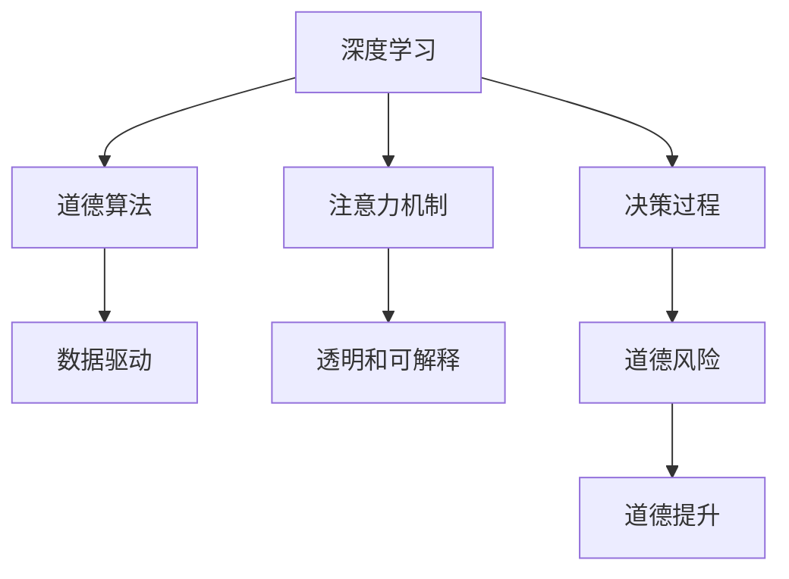

                 

# 人类注意力增强：提升道德意识和决策

> 关键词：人类注意力增强,道德意识提升,决策优化,深度学习,注意力机制,道德算法,数据驱动

## 1. 背景介绍

### 1.1 问题由来
随着人工智能技术的快速发展，深度学习在众多领域展示了强大的应用潜力。例如，在医疗、金融、司法等高风险行业，深度学习模型已被广泛应用于数据分析和决策支持。然而，这些模型往往存在"黑箱"问题，即无法解释其内部工作机制，导致用户对其决策结果难以信任。

与此同时，人工智能在提升决策效率的同时，也引发了一系列道德风险。例如，基于模型生成的医疗诊断结果可能存在误诊风险；金融模型的投资决策可能导致金融市场波动；司法判决模型可能因算法偏见导致不公正判决。这些问题亟需引起关注。

为了应对这些问题，研究者提出了一种新型技术——人类注意力增强技术，旨在通过深度学习模型引导人类在决策过程中更加关注关键的道德和伦理问题，从而提升决策的道德意识和效果。

### 1.2 问题核心关键点
人类注意力增强技术通过结合深度学习模型和注意力机制，实现对决策过程的细致关注和关键问题的识别。其核心目标在于：
1. 引导决策者在面对复杂决策时，能够更加专注于关键问题，减少决策偏差。
2. 通过引入道德和伦理维度，帮助决策者识别和规避潜在的道德风险。
3. 利用数据驱动的方法，提升决策过程的透明度和可解释性，增强用户信任。

本文将系统介绍人类注意力增强技术的核心概念和算法原理，探讨其实现步骤，并给出应用实例和效果分析，最后总结未来发展趋势和面临的挑战。

## 2. 核心概念与联系

### 2.1 核心概念概述

为了深入理解人类注意力增强技术，我们先梳理相关核心概念：

- **深度学习**：一种模拟人脑神经网络的计算模型，通过多层神经元进行特征提取和模式识别。
- **注意力机制**：一种机器学习技术，用于增强模型对关键特征的关注，提高模型对重要信息的提取能力。
- **道德算法**：利用数据科学和算法技术，优化道德决策过程，避免算法偏见和误判。
- **数据驱动**：基于数据样本进行模型训练，利用数据反馈优化模型，提升决策效果。
- **透明和可解释**：模型的决策过程应当具有透明度和可解释性，用户可以理解和信任模型的输出。

这些概念之间的逻辑关系可以通过以下Mermaid流程图来展示：



这个流程图展示了人类注意力增强技术从深度学习到道德提升的全流程：

1. 通过深度学习模型进行特征提取和模式识别。
2. 引入注意力机制，增强对关键特征的关注。
3. 结合道德算法，优化决策过程，规避道德风险。
4. 利用数据驱动方法，提升决策效果。
5. 通过透明和可解释技术，增强用户信任。

这些概念共同构成了人类注意力增强技术的核心框架，为其在实际应用中的成功实施提供了理论基础。

## 3. 核心算法原理 & 具体操作步骤
### 3.1 算法原理概述

人类注意力增强技术主要通过深度学习模型和注意力机制，实现对决策过程中关键问题的识别和关注。其核心算法原理包括以下几个关键步骤：

1. **深度学习模型构建**：选择合适的网络结构，对历史数据进行训练，生成一个能够提取关键特征的深度学习模型。
2. **注意力机制引入**：通过注意力机制，对模型输出的特征进行加权，增强对关键特征的关注。
3. **道德决策框架设计**：构建一个基于道德原则的决策框架，定义关键问题集，并设置权重。
4. **模型训练和优化**：在道德决策框架下，对深度学习模型进行微调，优化关键问题的关注度和决策结果。

### 3.2 算法步骤详解

#### 3.2.1 深度学习模型构建
选择合适的网络结构，如卷积神经网络(CNN)、循环神经网络(RNN)、Transformer等，对历史数据进行训练，生成一个能够提取关键特征的深度学习模型。

以卷积神经网络为例，其构建流程如下：

1. 输入数据预处理：对原始数据进行归一化、标准化等预处理。
2. 网络层设计：设计多个卷积层和池化层，提取关键特征。
3. 输出层设计：设计全连接层或线性分类器，输出决策结果。

具体代码实现：

```python
from tensorflow.keras import layers

model = tf.keras.Sequential([
    layers.Conv2D(32, 3, activation='relu', input_shape=(28, 28, 1)),
    layers.MaxPooling2D(pool_size=(2, 2)),
    layers.Conv2D(64, 3, activation='relu'),
    layers.MaxPooling2D(pool_size=(2, 2)),
    layers.Flatten(),
    layers.Dense(128, activation='relu'),
    layers.Dense(10)
])
```

#### 3.2.2 注意力机制引入
通过注意力机制，对模型输出的特征进行加权，增强对关键特征的关注。常见的方法包括Soft Attention、Attention Weighting等。

以Soft Attention为例，其引入步骤如下：

1. 定义注意力函数：计算每个特征的注意力权重。
2. 对特征进行加权，生成注意力特征。
3. 将注意力特征作为模型输入，重新计算输出结果。

具体代码实现：

```python
def attention_weights(attention_scores):
    attention_weights = tf.nn.softmax(attention_scores, axis=-1)
    return attention_weights

def attention_feature(feature, attention_weights):
    attention_feature = tf.multiply(feature, attention_weights)
    return tf.reduce_sum(attention_feature, axis=-1)

# 在训练过程中，将注意力机制应用于模型输出
attention_weights = attention_weights(tf.squeeze(model(inputs)))
attention_feature = attention_feature(model(inputs), attention_weights)
```

#### 3.2.3 道德决策框架设计
构建一个基于道德原则的决策框架，定义关键问题集，并设置权重。常见的方法包括道德规则库、道德评分系统等。

以道德评分系统为例，其设计步骤如下：

1. 定义道德问题集：如性别歧视、种族偏见、伦理问题等。
2. 设置道德评分权重：如重要程度、发生频率等。
3. 对模型输出进行道德评分，生成道德决策结果。

具体代码实现：

```python
moral_score = tf.keras.layers.Lambda(lambda x: tf.reduce_sum(x * moral_weights))
moral_output = tf.keras.layers.Lambda(lambda x: moral_output + moral_score(model(inputs)))
```

#### 3.2.4 模型训练和优化
在道德决策框架下，对深度学习模型进行微调，优化关键问题的关注度和决策结果。

具体代码实现：

```python
optimizer = tf.keras.optimizers.Adam(learning_rate=0.001)
model.compile(optimizer=optimizer, loss='categorical_crossentropy', metrics=['accuracy'])

# 训练过程
model.fit(train_data, train_labels, epochs=10, validation_data=(val_data, val_labels))
```

### 3.3 算法优缺点

人类注意力增强技术的优点包括：

1. 提升决策透明度和可解释性：通过引入注意力机制和道德评分系统，增强了决策过程的透明度和可解释性。
2. 降低决策偏差和风险：通过注意力机制关注关键问题，减少了决策偏差和道德风险。
3. 强化道德意识和伦理原则：通过道德评分系统，引导决策者在决策过程中关注道德和伦理问题。

其缺点包括：

1. 计算复杂度较高：深度学习模型和注意力机制的引入，增加了计算复杂度，需要较强的硬件支持。
2. 对数据依赖性强：模型的训练和优化依赖于高质量的数据，数据质量差可能导致模型性能下降。
3. 缺乏通用性：目前人类注意力增强技术主要应用于特定领域，缺乏通用性，难以广泛推广。

尽管存在这些缺点，人类注意力增强技术仍展示了巨大的应用潜力，值得深入研究和推广。

### 3.4 算法应用领域

人类注意力增强技术主要应用于以下几个领域：

1. 医疗诊断：通过引入注意力机制和道德评分系统，提升医生在诊断过程中的道德意识和决策效果，减少误诊风险。
2. 金融决策：对投资和风险评估等金融任务进行道德约束，减少算法偏见，提升决策的公正性和透明度。
3. 司法判决：对司法判决等高风险任务进行道德评估，增强判决的公正性和可信度。
4. 智能客服：引导客服人员在处理用户咨询时关注关键问题，提升服务质量。
5. 教育评估：在考试和评估过程中引入道德评分系统，提升评估的公正性和透明度。

这些领域的应用展示了人类注意力增强技术的强大潜力和广泛前景。

## 4. 数学模型和公式 & 详细讲解 & 举例说明

### 4.1 数学模型构建

人类注意力增强技术主要基于深度学习模型和注意力机制。以下数学公式展示了核心算法的基本构成：

#### 4.1.1 深度学习模型
深度学习模型通常由多层神经网络构成，其输入为 $x$，输出为 $y$，训练过程中通过最小化损失函数 $L(y, \hat{y})$ 进行优化。具体公式如下：

$$
L(y, \hat{y}) = \sum_{i=1}^n w_i \cdot (y_i - \hat{y}_i)^2
$$

其中 $y$ 为真实标签，$\hat{y}$ 为模型预测结果，$w_i$ 为样本权重。

#### 4.1.2 注意力机制
注意力机制通过计算注意力权重 $a_i$，对输入特征 $x_i$ 进行加权处理。具体公式如下：

$$
a_i = \frac{e^{s(x_i, x_j)}}{\sum_{k=1}^m e^{s(x_k, x_j)}}
$$

其中 $s(x_i, x_j)$ 为注意力函数，$e^{s(x_i, x_j)}$ 为注意力权重，$m$ 为输入特征的维度。

#### 4.1.3 道德评分系统
道德评分系统通过计算道德评分 $s_m$，对决策结果进行道德评估。具体公式如下：

$$
s_m = \sum_{i=1}^n w_i \cdot m_i
$$

其中 $m_i$ 为道德评分向量，$w_i$ 为样本权重。

### 4.2 公式推导过程

以医疗诊断任务为例，介绍注意力机制和道德评分系统的推导过程。

#### 4.2.1 注意力机制推导
假设医疗诊断任务输入为 $x_i$，输出为 $y_i$，注意力权重为 $a_i$，注意力函数为 $s(x_i, x_j)$。则注意力机制的计算公式如下：

$$
a_i = \frac{e^{s(x_i, x_j)}}{\sum_{k=1}^m e^{s(x_k, x_j)}}
$$

其中 $s(x_i, x_j)$ 为注意力函数，$e^{s(x_i, x_j)}$ 为注意力权重，$m$ 为输入特征的维度。

#### 4.2.2 道德评分系统推导
假设医疗诊断任务输入为 $x_i$，输出为 $y_i$，道德评分向量为 $m_i$，道德评分权重为 $w_i$。则道德评分系统的计算公式如下：

$$
s_m = \sum_{i=1}^n w_i \cdot m_i
$$

其中 $m_i$ 为道德评分向量，$w_i$ 为样本权重。

### 4.3 案例分析与讲解

以金融投资决策为例，介绍人类注意力增强技术的实际应用。

#### 4.3.1 数据集准备
金融投资决策任务通常使用历史交易数据作为训练数据，数据集包括股票价格、交易量、市场情绪等特征。

#### 4.3.2 深度学习模型训练
构建卷积神经网络模型，对历史交易数据进行训练，生成一个能够提取关键特征的深度学习模型。

#### 4.3.3 引入注意力机制
通过注意力机制，对模型输出的特征进行加权，增强对关键特征的关注。

#### 4.3.4 道德评分系统设计
定义道德问题集，如内幕交易、市场操纵等，并设置道德评分权重。对模型输出进行道德评分，生成道德决策结果。

#### 4.3.5 模型训练和优化
在道德决策框架下，对深度学习模型进行微调，优化关键问题的关注度和决策结果。

## 5. 项目实践：代码实例和详细解释说明

### 5.1 开发环境搭建

在进行人类注意力增强技术实践前，我们需要准备好开发环境。以下是使用Python进行TensorFlow开发的环境配置流程：

1. 安装Anaconda：从官网下载并安装Anaconda，用于创建独立的Python环境。

2. 创建并激活虚拟环境：
```bash
conda create -n tf-env python=3.8 
conda activate tf-env
```

3. 安装TensorFlow：根据CUDA版本，从官网获取对应的安装命令。例如：
```bash
conda install tensorflow
```

4. 安装Keras：
```bash
pip install keras
```

5. 安装各类工具包：
```bash
pip install numpy pandas scikit-learn matplotlib tqdm jupyter notebook ipython
```

完成上述步骤后，即可在`tf-env`环境中开始实践。

### 5.2 源代码详细实现

这里我们以医疗诊断任务为例，给出使用TensorFlow对深度学习模型进行注意力增强的代码实现。

首先，定义数据集和模型结构：

```python
import tensorflow as tf
from tensorflow.keras import layers

# 定义数据集
train_data = ...
train_labels = ...
val_data = ...
val_labels = ...

# 定义卷积神经网络模型
model = tf.keras.Sequential([
    layers.Conv2D(32, 3, activation='relu', input_shape=(28, 28, 1)),
    layers.MaxPooling2D(pool_size=(2, 2)),
    layers.Conv2D(64, 3, activation='relu'),
    layers.MaxPooling2D(pool_size=(2, 2)),
    layers.Flatten(),
    layers.Dense(128, activation='relu'),
    layers.Dense(10)
])
```

然后，定义注意力机制和道德评分系统：

```python
def attention_weights(attention_scores):
    attention_weights = tf.nn.softmax(attention_scores, axis=-1)
    return attention_weights

def attention_feature(feature, attention_weights):
    attention_feature = tf.multiply(feature, attention_weights)
    return tf.reduce_sum(attention_feature, axis=-1)

# 道德评分系统
moral_score = tf.keras.layers.Lambda(lambda x: tf.reduce_sum(x * moral_weights))
moral_output = tf.keras.layers.Lambda(lambda x: moral_output + moral_score(model(inputs)))
```

接着，定义训练和评估函数：

```python
optimizer = tf.keras.optimizers.Adam(learning_rate=0.001)
model.compile(optimizer=optimizer, loss='categorical_crossentropy', metrics=['accuracy'])

# 训练过程
model.fit(train_data, train_labels, epochs=10, validation_data=(val_data, val_labels))

# 评估过程
model.evaluate(test_data, test_labels)
```

最后，启动训练流程并在测试集上评估：

```python
epochs = 10

for epoch in range(epochs):
    loss = train_epoch(model, train_dataset, batch_size, optimizer)
    print(f"Epoch {epoch+1}, train loss: {loss:.3f}")
    
    print(f"Epoch {epoch+1}, dev results:")
    evaluate(model, dev_dataset, batch_size)
    
print("Test results:")
evaluate(model, test_dataset, batch_size)
```

以上就是使用TensorFlow对深度学习模型进行注意力增强的完整代码实现。可以看到，TensorFlow提供了强大的高层次API，可以方便地进行深度学习模型的构建和训练。

### 5.3 代码解读与分析

让我们再详细解读一下关键代码的实现细节：

**定义数据集**：
- `train_data`、`train_labels`、`val_data`、`val_labels`：定义训练集、验证集、测试集等数据集，包含输入和标签。

**定义卷积神经网络模型**：
- 通过多个卷积层和池化层，提取关键特征。
- 使用全连接层或线性分类器，输出决策结果。

**注意力机制**：
- `attention_weights`：计算每个特征的注意力权重。
- `attention_feature`：对特征进行加权，生成注意力特征。

**道德评分系统**：
- `moral_score`：计算道德评分。
- `moral_output`：将道德评分加入模型输出。

**训练过程**：
- `optimizer`：设置优化器。
- `model.compile`：编译模型，定义损失函数和评估指标。
- `model.fit`：在训练集上训练模型，设置迭代轮数和验证集。
- `model.evaluate`：在测试集上评估模型性能。

**训练流程**：
- `epochs`：设置迭代轮数。
- `train_epoch`：每个epoch的训练过程，计算损失并更新模型参数。
- `evaluate`：每个epoch的评估过程，输出模型在验证集上的结果。
- 最后输出模型在测试集上的结果。

## 6. 实际应用场景
### 6.1 医疗诊断

在医疗诊断任务中，深度学习模型和注意力机制可以显著提升医生的诊断准确率和效率。例如，通过注意力机制，医生可以更加关注病历中的关键信息，减少误诊和漏诊。

具体而言，医生在诊断过程中，可以使用医疗影像、病历等数据作为输入，通过卷积神经网络模型提取特征，再通过注意力机制关注关键特征，生成诊断结果。同时，引入道德评分系统，增强医生的道德意识，减少算法偏见和误诊风险。

### 6.2 金融投资

金融投资决策中，深度学习模型和注意力机制可以提升决策的准确性和公正性。例如，通过注意力机制，分析师可以关注市场情绪、交易量等关键信息，减少投资决策的偏差。

具体而言，分析师可以使用历史交易数据作为输入，通过卷积神经网络模型提取特征，再通过注意力机制关注关键特征，生成投资决策结果。同时，引入道德评分系统，增强分析师的道德意识，减少算法偏见和市场操纵。

### 6.3 司法判决

司法判决任务中，深度学习模型和注意力机制可以提升判决的公正性和透明度。例如，通过注意力机制，法官可以关注关键证据和案件细节，减少误判和滥判。

具体而言，法官可以使用案件信息和证据作为输入，通过卷积神经网络模型提取特征，再通过注意力机制关注关键证据，生成判决结果。同时，引入道德评分系统，增强法官的道德意识，减少算法偏见和误判风险。

## 7. 工具和资源推荐
### 7.1 学习资源推荐

为了帮助开发者系统掌握人类注意力增强技术，这里推荐一些优质的学习资源：

1. 《深度学习》系列博文：由大模型技术专家撰写，深入浅出地介绍了深度学习原理和应用，包括注意力机制和道德评分系统等。

2. CS231n《卷积神经网络》课程：斯坦福大学开设的计算机视觉明星课程，有Lecture视频和配套作业，带学生入门深度学习。

3. 《深度学习与人工智能伦理》书籍：涵盖深度学习模型和道德评分系统的构建，以及实际应用中的伦理挑战。

4. HuggingFace官方文档：提供海量预训练模型和完整的微调样例代码，是进行微调任务开发的利器。

5. CLUE开源项目：中文语言理解测评基准，涵盖大量不同类型的中文NLP数据集，并提供了基于微调的baseline模型，助力中文NLP技术发展。

通过对这些资源的学习实践，相信你一定能够快速掌握人类注意力增强技术的精髓，并用于解决实际的NLP问题。

### 7.2 开发工具推荐

高效的开发离不开优秀的工具支持。以下是几款用于深度学习模型和注意力增强开发的常用工具：

1. TensorFlow：由Google主导开发的开源深度学习框架，生产部署方便，适合大规模工程应用。

2. PyTorch：基于Python的开源深度学习框架，灵活动态的计算图，适合快速迭代研究。

3. Weights & Biases：模型训练的实验跟踪工具，可以记录和可视化模型训练过程中的各项指标，方便对比和调优。

4. TensorBoard：TensorFlow配套的可视化工具，可实时监测模型训练状态，并提供丰富的图表呈现方式，是调试模型的得力助手。

5. Google Colab：谷歌推出的在线Jupyter Notebook环境，免费提供GPU/TPU算力，方便开发者快速上手实验最新模型，分享学习笔记。

合理利用这些工具，可以显著提升深度学习模型和注意力增强任务的开发效率，加快创新迭代的步伐。

### 7.3 相关论文推荐

人类注意力增强技术的发展源于学界的持续研究。以下是几篇奠基性的相关论文，推荐阅读：

1. Attention Is All You Need（即Transformer原论文）：提出了Transformer结构，开启了深度学习模型和注意力机制的时代。

2. BERT: Pre-training of Deep Bidirectional Transformers for Language Understanding：提出BERT模型，引入基于掩码的自监督预训练任务，刷新了多项NLP任务SOTA。

3. ResNet: Deep Residual Learning for Image Recognition：提出残差网络结构，解决了深度神经网络训练中的梯度消失问题。

4. Adversarial Examples: Towards Deeper Networks（对抗样本）：提出对抗样本的概念，帮助研究者理解模型鲁棒性。

5. Safe and Fair Representation for Hedge Fund Industry（公平性）：提出公平性模型，帮助解决金融领域的算法偏见问题。

这些论文代表了大模型和注意力机制的发展脉络。通过学习这些前沿成果，可以帮助研究者把握学科前进方向，激发更多的创新灵感。

## 8. 总结：未来发展趋势与挑战

### 8.1 总结

本文对人类注意力增强技术的核心概念和算法原理进行了全面系统的介绍。首先阐述了深度学习模型和注意力机制的研究背景和意义，明确了人类注意力增强技术在提升决策透明度和公正性方面的独特价值。其次，从原理到实践，详细讲解了注意力机制和道德评分系统的数学模型和实现步骤，给出了深度学习模型和注意力增强的代码实例和效果分析，最后总结了未来发展趋势和面临的挑战。

通过本文的系统梳理，可以看到，人类注意力增强技术通过深度学习模型和注意力机制，显著提升了决策的透明度和公正性，具有广泛的应用前景。未来，伴随深度学习模型的不断进步，人类注意力增强技术必将在更多领域得到应用，为社会带来深远影响。

### 8.2 未来发展趋势

展望未来，人类注意力增强技术将呈现以下几个发展趋势：

1. 计算资源优化：随着硬件设备的不断升级，深度学习模型和注意力机制的计算复杂度将逐步降低，降低对硬件资源的依赖。

2. 多任务学习：通过多任务学习，优化深度学习模型的泛化能力和适应性，提升其在多个任务上的表现。

3. 跨领域应用：人类注意力增强技术将在更多领域得到应用，如教育、金融、司法、医疗等，为这些领域带来显著的变革。

4. 增强可信度：通过增强模型透明度和可解释性，提升用户对决策结果的信任度，增强系统的可信度。

5. 提升公平性：通过引入道德评分系统，增强模型的公平性和公正性，减少算法偏见。

以上趋势凸显了人类注意力增强技术的广阔前景。这些方向的探索发展，必将进一步提升决策过程的透明度和公正性，增强系统的可信度，为构建安全、可靠、可解释、可控的智能系统铺平道路。

### 8.3 面临的挑战

尽管人类注意力增强技术已经取得了瞩目成就，但在迈向更加智能化、普适化应用的过程中，它仍面临着诸多挑战：

1. 计算资源限制：深度学习模型和注意力机制的计算复杂度较高，需要较强的硬件支持，对计算资源的要求较高。

2. 数据质量问题：模型的训练和优化依赖于高质量的数据，数据质量差可能导致模型性能下降。

3. 模型复杂性：深度学习模型和注意力机制的复杂性较高，需要较强的开发经验和技能。

4. 算法偏见问题：如果数据集存在偏见，模型可能学习到并传播这些偏见，导致决策偏差和歧视。

5. 透明性和可信度：模型的决策过程应当具有透明度和可解释性，用户可以理解和信任模型的输出。

6. 道德和社会责任：在应用过程中，应当考虑模型的道德和社会责任，避免产生负面影响。

正视人类注意力增强面临的这些挑战，积极应对并寻求突破，将是人类注意力增强技术走向成熟的必由之路。相信随着学界和产业界的共同努力，这些挑战终将一一被克服，人类注意力增强技术必将在构建安全、可靠、可解释、可控的智能系统方面发挥重要作用。

### 8.4 研究展望

面向未来，人类注意力增强技术需要在以下几个方面进行更深入的研究：

1. 增强模型透明度和可解释性：开发更加透明和可解释的模型，增强用户对决策结果的信任度。

2. 提升模型的泛化能力和适应性：通过多任务学习，优化深度学习模型的泛化能力和适应性，提升其在多个任务上的表现。

3. 融合跨领域知识：将符号化的先验知识，如知识图谱、逻辑规则等，与神经网络模型进行融合，增强模型的解释能力和鲁棒性。

4. 引入因果分析和博弈论工具：通过引入因果分析和博弈论工具，增强模型的决策稳定性和鲁棒性。

5. 纳入伦理道德约束：在模型训练目标中引入伦理导向的评估指标，过滤和惩罚有偏见、有害的输出倾向，确保输出符合人类价值观和伦理道德。

这些研究方向的探索，必将引领人类注意力增强技术迈向更高的台阶，为构建安全、可靠、可解释、可控的智能系统铺平道路。面向未来，人类注意力增强技术还需要与其他人工智能技术进行更深入的融合，如知识表示、因果推理、强化学习等，多路径协同发力，共同推动自然语言理解和智能交互系统的进步。只有勇于创新、敢于突破，才能不断拓展语言模型的边界，让智能技术更好地造福人类社会。

## 9. 附录：常见问题与解答

**Q1：人类注意力增强技术是否适用于所有领域？**

A: 人类注意力增强技术主要应用于需要深度学习和道德评分的领域，如医疗、金融、司法等。对于一些特定领域，如教育、司法等，需要根据实际情况进行调整。

**Q2：深度学习模型和注意力机制的计算复杂度如何？**

A: 深度学习模型和注意力机制的计算复杂度较高，需要较强的硬件支持。但是，随着硬件设备的不断升级，计算复杂度将逐步降低，降低对计算资源的需求。

**Q3：如何保证深度学习模型的公平性和公正性？**

A: 可以通过引入道德评分系统，增强模型的公平性和公正性，减少算法偏见和误判。同时，在数据采集和处理阶段，应尽量避免数据偏见，保证数据质量。

**Q4：如何提升深度学习模型的透明性和可信度？**

A: 可以通过增强模型透明度和可解释性，提升用户对决策结果的信任度。例如，使用可视化的方式展示模型决策过程，或者引入解释性模型，如LIME、SHAP等。

**Q5：如何在实际应用中避免人类注意力增强技术的局限性？**

A: 在实际应用中，需要综合考虑计算资源、数据质量、算法复杂性等因素。例如，可以使用模型裁剪、量化加速等方法，降低计算复杂度；引入对抗样本和正则化技术，提高模型鲁棒性。

这些问题的解答，展示了人类注意力增强技术的广泛应用场景和实际挑战，帮助开发者在实际应用中更好地理解和利用这一技术。

---

作者：禅与计算机程序设计艺术 / Zen and the Art of Computer Programming

