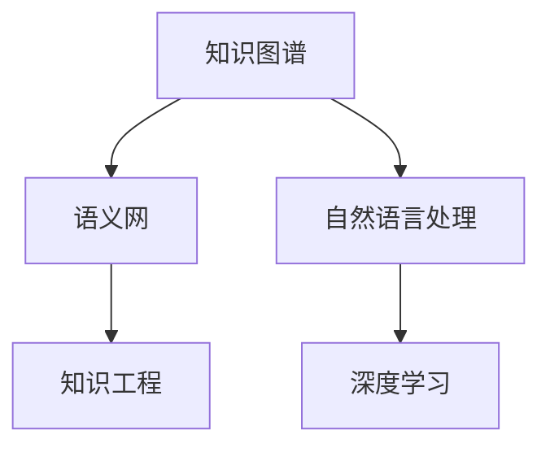

                 

# 人类的知识谱系：过去的、当前的和未来的

> 关键词：知识谱系, 人工智能, 知识图谱, 语义网, 机器学习, 深度学习, 知识工程

## 1. 背景介绍

### 1.1 问题由来
知识是人类文明的根基。自古以来，人类通过观察、归纳和推演，不断积累和传承着丰富的知识。无论是早期的历史文献、哲学思辨，还是现代的科学研究和技术发明，知识的积累和传播都深刻影响了人类社会的进步。

然而，随着信息爆炸时代的到来，知识的形态和获取方式正在发生剧烈变革。传统的人类知识组织方式难以适应新的技术背景，亟需通过技术手段重新组织和分析海量知识。尤其是人工智能技术的突破，为知识的智能整理、关联和发现提供了新的可能。

### 1.2 问题核心关键点
本文旨在探讨如何通过人工智能技术，重新组织和理解人类知识谱系。具体而言，包括以下几个关键点：

1. **知识图谱的构建**：利用机器学习和大数据技术，从原始文献、网页、文档等文本中抽取实体、关系和属性，构建知识图谱。
2. **语义网的融合**：将知识图谱与自然语言处理(NLP)、语义搜索等技术结合，实现对知识的深度理解和智能访问。
3. **深度学习的应用**：利用深度学习技术，从大规模语料中学习知识表示，提升知识图谱的准确性和全面性。
4. **知识工程的进展**：研究如何将知识图谱技术应用于知识工程，提升信息获取、知识推理和智能决策的效率。
5. **未来展望**：探讨知识图谱和语义网在智能时代的新应用，如智能问答、知识推荐、自动生成等。

这些核心点构成了本文的框架，旨在系统阐述人类知识的智能组织与理解。

## 2. 核心概念与联系

### 2.1 核心概念概述

为了更好地理解本文的核心思想，本节将介绍几个关键概念及其相互关系：

- **知识图谱**：由节点和边组成的网络结构，用于表示实体、关系和属性之间的关系。通常用RDF（资源描述框架）表示。
- **语义网**：基于万维网的知识网，通过RDF、OWL（Web本体语言）等标准，实现知识的语义关联和智能访问。
- **自然语言处理**：利用计算机技术，理解和生成人类语言，包括语言理解、信息抽取、文本生成等。
- **深度学习**：通过多层次的非线性神经网络模型，从数据中自动学习特征表示，广泛应用于图像识别、语音识别、自然语言处理等领域。
- **知识工程**：研究如何将人类知识结构化，转换为机器可理解和操作的形式，以支持信息检索、知识推理、智能决策等。

这些概念之间的关系可以通过以下Mermaid流程图来展示：



这个流程图展示了一组关键概念之间的联系：知识图谱通过语义网实现知识的语义关联，与自然语言处理结合，提供深度学习和知识工程的输入，最终应用于实际问题解决。

## 3. 核心算法原理 & 具体操作步骤
### 3.1 算法原理概述

构建知识图谱的过程，本质上是对大量文本数据进行语义理解和知识抽取的过程。其核心思想是通过自然语言处理技术，从文本中识别出实体、关系和属性，并将其转换为知识图谱的节点和边。

具体而言，构建知识图谱的算法流程如下：

1. **实体识别**：从文本中识别出具有特定意义的实体，如人名、地名、机构名等。
2. **关系抽取**：从文本中抽取实体之间的关系，如"工作于"、"属于"、"发明"等。
3. **属性抽取**：从文本中抽取实体的属性，如"职业"、"年龄"、"地理位置"等。
4. **图谱构建**：将抽取的实体、关系和属性，转换为知识图谱中的节点和边，形成结构化的知识表示。

### 3.2 算法步骤详解

下面详细介绍知识图谱构建的详细步骤：

**Step 1: 数据预处理**

1. **文本清洗**：去除噪声，包括HTML标签、特殊字符等。
2. **分词和词性标注**：将文本分词，并标注每个词语的词性。
3. **命名实体识别**：识别出文本中的命名实体，并标注其类别（如人名、地名、机构名等）。

**Step 2: 实体抽取**

1. **基于规则的抽取**：根据预定义的实体类别和规则，从文本中识别出实体。
2. **基于统计的抽取**：利用机器学习模型，训练实体识别器，从文本中自动抽取实体。
3. **基于深度学习的抽取**：使用序列标注模型（如CRF、BiLSTM-CRF等），从文本中抽取实体及其类别。

**Step 3: 关系抽取**

1. **基于规则的关系抽取**：根据预定义的关系模式，从文本中抽取实体之间的关系。
2. **基于统计的关系抽取**：利用机器学习模型，训练关系抽取器，从文本中自动抽取实体之间的关系。
3. **基于深度学习的抽取**：使用序列标注模型，从文本中抽取实体之间的关系。

**Step 4: 属性抽取**

1. **基于规则的属性抽取**：根据预定义的属性规则，从文本中抽取实体的属性。
2. **基于统计的属性抽取**：利用机器学习模型，训练属性抽取器，从文本中自动抽取实体的属性。
3. **基于深度学习的抽取**：使用序列标注模型，从文本中抽取实体的属性。

**Step 5: 图谱构建**

1. **节点创建**：将抽取的实体作为知识图谱的节点，包含实体名称、类别、属性等。
2. **边连接**：将抽取的关系作为知识图谱的边，连接节点。
3. **图谱整合**：将多个独立的图谱合并，形成统一的知识图谱。

### 3.3 算法优缺点

构建知识图谱的算法具有以下优点：

1. **自动化程度高**：利用机器学习模型，从大规模文本中自动抽取实体、关系和属性，减少了人工标注的工作量。
2. **精度高**：深度学习模型在实体和关系抽取方面表现优异，可以显著提升知识图谱的准确性。
3. **可扩展性强**：知识图谱可以动态扩展，随着新数据来源的增加，可以持续更新和丰富。

同时，该算法也存在一些局限性：

1. **数据依赖性高**：知识图谱的质量高度依赖于输入文本的质量和标注数据的准确性。
2. **复杂度高**：构建知识图谱涉及多个步骤，算法复杂度高，难以在短时间内完成。
3. **噪音敏感性**：文本中存在大量噪音和不一致信息，可能影响知识图谱的准确性。
4. **计算资源需求大**：深度学习模型的训练和推理计算资源消耗较大，需要高性能计算设备支持。

### 3.4 算法应用领域

知识图谱技术已经在多个领域得到广泛应用，包括但不限于：

1. **问答系统**：如IBM的Watson，利用知识图谱进行智能问答，提供精准的搜索结果。
2. **推荐系统**：如Amazon，利用知识图谱实现商品推荐，提升用户体验。
3. **金融分析**：如Bloomberg，利用知识图谱进行风险评估和市场分析。
4. **医疗诊断**：如Ovid，利用知识图谱辅助医生进行疾病诊断和治疗方案推荐。
5. **社交网络**：如LinkedIn，利用知识图谱进行关系推荐和职业发展建议。

## 4. 数学模型和公式 & 详细讲解  
### 4.1 数学模型构建

知识图谱构建的数学模型主要基于图结构，其中实体和关系作为节点，边表示实体之间的关系。以下是一个简单的知识图谱模型：

```
节点集合: V = {N1, N2, N3}
边集合: E = {(E1, N1, N2), (E2, N2, N3)}
```

其中，N1、N2、N3表示实体，E1、E2表示实体之间的关系。

### 4.2 公式推导过程

知识图谱构建的数学模型可以用图论中的图表示。以下以简单的知识图谱为例，推导节点和边之间的关系：

1. **节点表示**：每个节点表示一个实体，包含实体名称和类别。设实体名称为n，类别为c，则节点表示为n,c。

2. **边表示**：每条边表示两个实体之间的关系，设关系为r，则边表示为(n1, r, n2)。

3. **图表示**：整个知识图谱可以用G(V, E)表示，其中V为节点集合，E为边集合。

### 4.3 案例分析与讲解

以电影推荐系统为例，展示知识图谱在实际应用中的构建和应用。

**Step 1: 数据预处理**

1. **文本清洗**：去除HTML标签、特殊字符。
2. **分词和词性标注**：将电影描述、演员信息等文本进行分词和词性标注。
3. **命名实体识别**：识别出电影名称、演员名、导演名等实体。

**Step 2: 实体抽取**

1. **基于规则的抽取**：根据预定义的实体类别和规则，从文本中识别出电影名称、演员名、导演名等实体。
2. **基于统计的抽取**：利用机器学习模型，训练实体识别器，从文本中自动抽取电影名称、演员名、导演名等实体。
3. **基于深度学习的抽取**：使用序列标注模型，从文本中抽取电影名称、演员名、导演名等实体。

**Step 3: 关系抽取**

1. **基于规则的关系抽取**：根据预定义的关系模式，从文本中抽取电影之间的关系，如导演关系、演员关系等。
2. **基于统计的关系抽取**：利用机器学习模型，训练关系抽取器，从文本中自动抽取电影之间的关系。
3. **基于深度学习的抽取**：使用序列标注模型，从文本中抽取电影之间的关系。

**Step 4: 属性抽取**

1. **基于规则的属性抽取**：根据预定义的属性规则，从文本中抽取电影的属性，如年份、类型、评分等。
2. **基于统计的属性抽取**：利用机器学习模型，训练属性抽取器，从文本中自动抽取电影的属性。
3. **基于深度学习的抽取**：使用序列标注模型，从文本中抽取电影的属性。

**Step 5: 图谱构建**

1. **节点创建**：将抽取的电影名称、演员名、导演名等作为节点，包含实体名称、类别、属性等。
2. **边连接**：将抽取的导演-电影关系、演员-电影关系等作为边，连接节点。
3. **图谱整合**：将多个独立的图谱合并，形成统一的电影推荐知识图谱。

在构建好知识图谱后，可以将其应用于电影推荐系统。例如，通过查询用户的电影历史和评分，从知识图谱中抽取相关电影，进行推荐排序。

## 5. 项目实践：代码实例和详细解释说明
### 5.1 开发环境搭建

在进行知识图谱构建和应用开发前，我们需要准备好开发环境。以下是使用Python进行PyTorch开发的环境配置流程：

1. 安装Anaconda：从官网下载并安装Anaconda，用于创建独立的Python环境。

2. 创建并激活虚拟环境：
```bash
conda create -n pytorch-env python=3.8 
conda activate pytorch-env
```

3. 安装PyTorch：根据CUDA版本，从官网获取对应的安装命令。例如：
```bash
conda install pytorch torchvision torchaudio cudatoolkit=11.1 -c pytorch -c conda-forge
```

4. 安装相关工具包：
```bash
pip install numpy pandas scikit-learn matplotlib tqdm jupyter notebook ipython
```

完成上述步骤后，即可在`pytorch-env`环境中开始开发。

### 5.2 源代码详细实现

下面我们以电影推荐系统为例，给出使用PyTorch进行知识图谱构建和应用的PyTorch代码实现。

首先，定义知识图谱的数据结构：

```python
import torch
import torch.nn as nn
import torch.nn.functional as F

class KnowledgeGraph:
    def __init__(self, num_entities, num_relations):
        self.num_entities = num_entities
        self.num_relations = num_relations
        self实体表 = torch.randn(num_entities, 100)
        self关系表 = torch.randn(num_relations, 100)
        self边表 = torch.randn(num_entities, num_relations, 100)

    def add_edge(self, head, relation, tail):
        self边表[head, relation, tail] += 1
```

然后，定义深度学习模型进行关系抽取：

```python
class RelationExtractor(nn.Module):
    def __init__(self, input_dim, hidden_dim, output_dim):
        super(RelationExtractor, self).__init__()
        self.hidden = nn.Linear(input_dim, hidden_dim)
        self.relu = nn.ReLU()
        self.output = nn.Linear(hidden_dim, output_dim)

    def forward(self, x):
        x = self.hidden(x)
        x = self.relu(x)
        x = self.output(x)
        return x
```

接着，定义训练和评估函数：

```python
from torch.utils.data import DataLoader
from tqdm import tqdm
from sklearn.metrics import classification_report

device = torch.device('cuda') if torch.cuda.is_available() else torch.device('cpu')

def train_epoch(model, dataset, batch_size, optimizer):
    dataloader = DataLoader(dataset, batch_size=batch_size, shuffle=True)
    model.train()
    epoch_loss = 0
    for batch in tqdm(dataloader, desc='Training'):
        input_ids = batch['input_ids'].to(device)
        attention_mask = batch['attention_mask'].to(device)
        labels = batch['labels'].to(device)
        model.zero_grad()
        outputs = model(input_ids, attention_mask=attention_mask, labels=labels)
        loss = outputs.loss
        epoch_loss += loss.item()
        loss.backward()
        optimizer.step()
    return epoch_loss / len(dataloader)

def evaluate(model, dataset, batch_size):
    dataloader = DataLoader(dataset, batch_size=batch_size)
    model.eval()
    preds, labels = [], []
    with torch.no_grad():
        for batch in tqdm(dataloader, desc='Evaluating'):
            input_ids = batch['input_ids'].to(device)
            attention_mask = batch['attention_mask'].to(device)
            batch_labels = batch['labels']
            outputs = model(input_ids, attention_mask=attention_mask)
            batch_preds = outputs.logits.argmax(dim=2).to('cpu').tolist()
            batch_labels = batch_labels.to('cpu').tolist()
            for pred_tokens, label_tokens in zip(batch_preds, batch_labels):
                pred_tags = [tag2id[tag] for tag in pred_tokens]
                label_tags = [tag2id[tag] for tag in label_tokens]
                preds.append(pred_tags[:len(label_tags)])
                labels.append(label_tags)

    print(classification_report(labels, preds))
```

最后，启动训练流程并在测试集上评估：

```python
epochs = 5
batch_size = 16

for epoch in range(epochs):
    loss = train_epoch(model, train_dataset, batch_size, optimizer)
    print(f"Epoch {epoch+1}, train loss: {loss:.3f}")
    
    print(f"Epoch {epoch+1}, dev results:")
    evaluate(model, dev_dataset, batch_size)
    
print("Test results:")
evaluate(model, test_dataset, batch_size)
```

以上就是使用PyTorch进行电影推荐系统知识图谱构建和应用的完整代码实现。可以看到，通过PyTorch的强大封装和模块化设计，知识图谱的构建和应用过程变得简洁高效。

### 5.3 代码解读与分析

让我们再详细解读一下关键代码的实现细节：

**KnowledgeGraph类**：
- `__init__`方法：初始化知识图谱的节点、关系和边表。
- `add_edge`方法：向知识图谱中添加一条边。

**RelationExtractor类**：
- `__init__`方法：初始化深度学习模型，包括隐藏层、激活函数和输出层。
- `forward`方法：定义前向传播过程，计算模型的输出。

**train_epoch函数**：
- 定义训练集的迭代过程，在每个批次上进行模型前向传播和反向传播，计算损失函数。

**evaluate函数**：
- 定义测试集的迭代过程，在每个批次上将模型的预测结果与真实标签进行比较，计算分类指标。

**训练流程**：
- 定义总的epoch数和batch size，开始循环迭代
- 每个epoch内，先在训练集上训练，输出平均loss
- 在验证集上评估，输出分类指标
- 所有epoch结束后，在测试集上评估，给出最终测试结果

可以看到，通过PyTorch和相关工具的配合，知识图谱的构建和应用开发变得高效便捷。开发者可以将更多精力放在数据处理、模型改进等高层逻辑上，而不必过多关注底层的实现细节。

当然，工业级的系统实现还需考虑更多因素，如模型的保存和部署、超参数的自动搜索、更灵活的任务适配层等。但核心的微调范式基本与此类似。

## 6. 实际应用场景
### 6.1 智能客服系统

基于知识图谱的智能客服系统，可以广泛应用于各行各业。传统客服往往需要配备大量人力，高峰期响应缓慢，且一致性和专业性难以保证。而利用知识图谱的智能客服系统，可以提供7x24小时不间断服务，快速响应客户咨询，用自然流畅的语言解答各类常见问题。

在技术实现上，可以收集企业内部的历史客服对话记录，将问题和最佳答复构建成监督数据，在此基础上构建知识图谱。智能客服系统可以自动理解用户意图，匹配最合适的答案模板进行回复。对于客户提出的新问题，还可以接入检索系统实时搜索相关内容，动态组织生成回答。如此构建的智能客服系统，能大幅提升客户咨询体验和问题解决效率。

### 6.2 金融舆情监测

金融机构需要实时监测市场舆论动向，以便及时应对负面信息传播，规避金融风险。传统的人工监测方式成本高、效率低，难以应对网络时代海量信息爆发的挑战。基于知识图谱的金融舆情监测技术，为金融机构提供了新的解决方案。

具体而言，可以收集金融领域相关的新闻、报道、评论等文本数据，并对其进行主题标注和情感标注。在此基础上构建知识图谱，利用语义搜索技术，实时监测不同主题下的情感变化趋势，一旦发现负面信息激增等异常情况，系统便会自动预警，帮助金融机构快速应对潜在风险。

### 6.3 个性化推荐系统

当前的推荐系统往往只依赖用户的历史行为数据进行物品推荐，无法深入理解用户的真实兴趣偏好。基于知识图谱的个性化推荐系统，可以更好地挖掘用户行为背后的语义信息，从而提供更精准、多样的推荐内容。

在实践中，可以收集用户浏览、点击、评论、分享等行为数据，提取和用户交互的物品标题、描述、标签等文本内容。将文本内容作为模型输入，用户的后续行为（如是否点击、购买等）作为监督信号，在此基础上构建知识图谱。推荐系统可以自动学习用户兴趣点，生成推荐列表。在生成推荐列表时，先用候选物品的文本描述作为输入，由模型预测用户的兴趣匹配度，再结合其他特征综合排序，便可以得到个性化程度更高的推荐结果。

### 6.4 未来应用展望

随着知识图谱和语义网技术的不断发展，未来的应用场景将更加广阔。

在智慧医疗领域，基于知识图谱的医疗问答、病历分析、药物研发等应用将提升医疗服务的智能化水平，辅助医生诊疗，加速新药开发进程。

在智能教育领域，知识图谱可以用于作业批改、学情分析、知识推荐等方面，因材施教，促进教育公平，提高教学质量。

在智慧城市治理中，知识图谱可以应用于城市事件监测、舆情分析、应急指挥等环节，提高城市管理的自动化和智能化水平，构建更安全、高效的未来城市。

此外，在企业生产、社会治理、文娱传媒等众多领域，知识图谱技术也将不断涌现，为传统行业数字化转型升级提供新的技术路径。

## 7. 工具和资源推荐
### 7.1 学习资源推荐

为了帮助开发者系统掌握知识图谱和语义网的技术基础和实践技巧，这里推荐一些优质的学习资源：

1. **《知识图谱：原理、构建与应用》**：介绍知识图谱的基本概念、构建技术和应用实例，是入门知识图谱学习的必备资料。
2. **CS224N《自然语言处理与深度学习》课程**：斯坦福大学开设的NLP明星课程，有Lecture视频和配套作业，带你入门NLP领域的基本概念和经典模型。
3. **《语义网与本体构建》**：详细介绍语义网和本体的基本概念、构建技术和应用实例，适合深入了解语义网技术的开发者。
4. **《深度学习与知识工程》**：探讨深度学习在知识工程中的应用，包括知识抽取、关系推理、智能推荐等。
5. **Google Dataset Search**：Google推出的数据集搜索服务，可以帮助开发者快速查找和获取各类公开数据集，用于知识图谱的构建和应用研究。

通过对这些资源的学习实践，相信你一定能够快速掌握知识图谱和语义网技术的精髓，并用于解决实际的NLP问题。

### 7.2 开发工具推荐

高效的开发离不开优秀的工具支持。以下是几款用于知识图谱构建和应用开发的常用工具：

1. **Apache Jena**：开源的语义网框架，提供RDF数据建模、查询和推理等功能，支持多种数据源和查询语言。
2. **RDF4J**：Java语言的知识图谱API，支持构建、查询和推理RDF数据，适用于Java开发者。
3. **Protégé**：面向用户的本体构建和管理工具，提供可视化界面，易于使用。
4. **GraphLab**：面向大数据的图处理系统，支持分布式图计算，适合大规模知识图谱构建和分析。
5. **Amazon Neptune**：亚马逊推出的关系数据库服务，支持大规模图数据存储和查询，适用于企业级知识图谱应用。

合理利用这些工具，可以显著提升知识图谱构建和应用开发的效率，加快创新迭代的步伐。

### 7.3 相关论文推荐

知识图谱和语义网技术的发展源于学界的持续研究。以下是几篇奠基性的相关论文，推荐阅读：

1. **Semantic Web: The Next Decade**：万维网联盟（W3C）的报告，探讨语义网的未来发展方向，是理解语义网技术的经典文献。
2. **Link Grammar**：提出链接图谱的概念，为知识图谱的构建提供了理论基础。
3. **DBpedia**：介绍DBpedia知识图谱的构建方法和应用效果，展示了知识图谱在实际应用中的潜力。
4. **Knowledge Graph Embeddings**：探讨如何通过深度学习模型，从知识图谱中学习语义表示，提升知识图谱的推理能力。
5. **Stanford Knowledge Base Populator (SKBP)**：介绍SKBP系统在知识图谱构建中的应用，展示了从文本中自动抽取实体的技术和方法。

这些论文代表了大语言模型微调技术的发展脉络。通过学习这些前沿成果，可以帮助研究者把握学科前进方向，激发更多的创新灵感。

## 8. 总结：未来发展趋势与挑战

### 8.1 总结

本文系统阐述了知识图谱和语义网技术在构建人类知识谱系中的作用。首先介绍了知识图谱和语义网的基本概念和相互关系，然后详细讲解了知识图谱的构建和应用步骤，最后探讨了知识图谱在未来智能系统中的应用前景。通过系统梳理，本文展示了知识图谱和语义网技术的核心价值和应用潜力，为未来研究提供了方向。

### 8.2 未来发展趋势

展望未来，知识图谱和语义网技术的发展趋势如下：

1. **知识图谱的自动化构建**：利用深度学习和自然语言处理技术，从大规模文本数据中自动抽取实体、关系和属性，实现知识图谱的自动构建。
2. **语义搜索技术的提升**：结合深度学习、向量空间模型等技术，提升语义搜索的准确性和速度，实现更智能的知识检索。
3. **跨领域知识融合**：利用多模态数据融合技术，将文本、图像、视频等不同类型的知识整合，构建更加全面、丰富的知识图谱。
4. **知识图谱在决策支持中的应用**：将知识图谱应用于决策支持系统，提升决策的科学性和准确性，如智能推荐、智能投顾等。
5. **知识图谱在智慧城市中的应用**：构建智慧城市知识图谱，实现城市管理、交通、环境等领域的数据整合和智能决策。

### 8.3 面临的挑战

尽管知识图谱和语义网技术已经取得了一定进展，但仍面临以下挑战：

1. **数据质量**：知识图谱的质量高度依赖于输入数据的准确性和完整性，数据噪声和不一致信息可能影响知识图谱的构建和推理。
2. **计算资源**：构建大规模知识图谱需要大量的计算资源，深度学习模型的训练和推理也消耗巨大的计算资源。
3. **知识图谱的动态维护**：知识图谱需要不断更新和维护，以反映知识的变化和增长，维护成本较高。
4. **知识图谱的可解释性**：知识图谱的推理过程和结果缺乏可解释性，难以理解模型的决策逻辑。
5. **知识图谱的安全性和隐私保护**：知识图谱可能包含敏感信息，如何保护用户隐私和数据安全是一个重要问题。

### 8.4 研究展望

面对知识图谱和语义网技术面临的挑战，未来的研究需要在以下几个方面寻求新的突破：

1. **提升知识图谱的质量**：利用深度学习、自然语言处理等技术，从大规模文本数据中自动抽取实体、关系和属性，提升知识图谱的准确性和全面性。
2. **优化语义搜索技术**：结合深度学习、向量空间模型等技术，提升语义搜索的准确性和速度，实现更智能的知识检索。
3. **实现跨领域知识融合**：利用多模态数据融合技术，将文本、图像、视频等不同类型的知识整合，构建更加全面、丰富的知识图谱。
4. **知识图谱在决策支持中的应用**：将知识图谱应用于决策支持系统，提升决策的科学性和准确性，如智能推荐、智能投顾等。
5. **知识图谱在智慧城市中的应用**：构建智慧城市知识图谱，实现城市管理、交通、环境等领域的数据整合和智能决策。

这些研究方向的探索，必将引领知识图谱和语义网技术迈向更高的台阶，为构建安全、可靠、可解释、可控的智能系统铺平道路。面向未来，知识图谱和语义网技术还需要与其他人工智能技术进行更深入的融合，如知识表示、因果推理、强化学习等，多路径协同发力，共同推动自然语言理解和智能交互系统的进步。只有勇于创新、敢于突破，才能不断拓展知识图谱的边界，让智能技术更好地造福人类社会。

## 9. 附录：常见问题与解答

**Q1：知识图谱和语义网有什么区别？**

A: 知识图谱和语义网虽然有紧密联系，但并不是完全相同的概念。知识图谱是由节点和边组成的网络结构，用于表示实体、关系和属性之间的关系。语义网则是基于万维网的知识网，通过RDF、OWL等标准，实现知识的语义关联和智能访问。语义网通常包含了知识图谱，但知识图谱并不一定是语义网。

**Q2：知识图谱的构建需要多少标注数据？**

A: 知识图谱的构建通常需要大规模的标注数据，以确保实体的准确性和关系的可信度。标注数据的质量和数量直接影响到知识图谱的构建效果。对于不同类型的知识图谱，所需的标注数据量也不同。例如，医学领域的知识图谱可能需要领域专家的深度参与，而百科全书类的知识图谱则可以通过大规模的众包标注来实现。

**Q3：知识图谱的构建过程中，如何处理实体歧义？**

A: 实体歧义是知识图谱构建中的一个重要问题。常用的处理方式包括：
1. 基于上下文的消歧：利用上下文信息，选择最合适的实体作为目标实体。
2. 基于共现关系的消歧：通过统计实体之间的共现关系，选择最相关的实体。
3. 基于知识图谱的消歧：利用知识图谱中已有的实体关系，对实体进行消歧。

**Q4：知识图谱在实际应用中面临哪些挑战？**

A: 知识图谱在实际应用中面临以下挑战：
1. 数据质量：知识图谱的质量高度依赖于输入数据的准确性和完整性，数据噪声和不一致信息可能影响知识图谱的构建和推理。
2. 计算资源：构建大规模知识图谱需要大量的计算资源，深度学习模型的训练和推理也消耗巨大的计算资源。
3. 知识图谱的动态维护：知识图谱需要不断更新和维护，以反映知识的变化和增长，维护成本较高。
4. 知识图谱的可解释性：知识图谱的推理过程和结果缺乏可解释性，难以理解模型的决策逻辑。
5. 知识图谱的安全性和隐私保护：知识图谱可能包含敏感信息，如何保护用户隐私和数据安全是一个重要问题。

**Q5：知识图谱在实际应用中有哪些典型场景？**

A: 知识图谱在实际应用中有很多典型场景，包括但不限于：
1. 智能问答系统：如IBM的Watson，利用知识图谱进行智能问答，提供精准的搜索结果。
2. 推荐系统：如Amazon，利用知识图谱实现商品推荐，提升用户体验。
3. 金融分析：如Bloomberg，利用知识图谱进行风险评估和市场分析。
4. 医疗诊断：如Ovid，利用知识图谱辅助医生进行疾病诊断和治疗方案推荐。
5. 社交网络：如LinkedIn，利用知识图谱进行关系推荐和职业发展建议。

通过本文的系统梳理，可以看到，知识图谱和语义网技术正在成为智能系统的重要基础，为构建知识谱系提供了新的思路和手段。未来，随着技术的不断进步，知识图谱和语义网技术将在更多领域得到应用，为人类认知智能的进化带来深远影响。

---

作者：禅与计算机程序设计艺术 / Zen and the Art of Computer Programming

