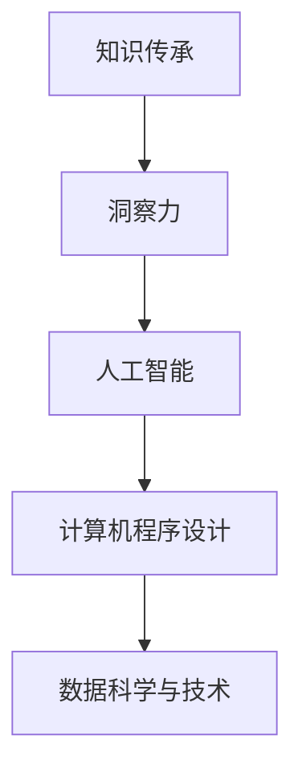

                 

# 人类知识的传承与发展：洞察力的重要作用

> 关键词：知识传承, 洞察力, 人工智能, 计算机程序设计, 数据科学与技术

## 1. 背景介绍

### 1.1 问题由来

在数字化时代，知识的获取和传承面临着前所未有的挑战。一方面，海量的信息使我们沉浸在数据海洋中，需要从中筛选和提取有用知识；另一方面，传统的人类知识传递方式，如书籍、讲座、讨论等，正在逐步被数字化的技术所替代。人工智能和大数据技术为知识传承带来了新的可能性，但同时也不断考验着我们对知识深度理解的洞察力。

### 1.2 问题核心关键点

- **知识传承**：将人类积累的知识经验传递给下一代，保持其连续性和有效性。
- **洞察力**：从数据中挖掘出深层次的知识和规律，洞察事物的本质，推动知识的创新和发展。
- **人工智能**：利用算法和模型处理和分析大规模数据，实现对知识的智能提取和应用。
- **计算机程序设计**：构建高效、可维护的代码体系，支撑知识传承和洞察力的实现。
- **数据科学与技术**：通过数据分析、机器学习等技术手段，促进知识的高效获取和创新。

## 2. 核心概念与联系

### 2.1 核心概念概述

- **知识传承**：指将人类的知识和智慧从一代人传递到另一代人，保障知识体系的连续性和稳定性。
- **洞察力**：指通过分析数据、观察现象，深刻理解事物本质和内在规律的能力。
- **人工智能**：以机器学习、深度学习等为核心，通过算法自动处理和分析数据，实现智能决策和任务执行。
- **计算机程序设计**：构建能够高效执行任务的程序代码，实现对数据和知识的自动化处理。
- **数据科学与技术**：涉及数据的采集、存储、处理和分析，是人工智能和洞察力的基础。

这些核心概念之间通过以下Mermaid流程图进行连接：



这个流程图展示了从知识传承到人工智能再到数据科学技术的逻辑关系，每个环节相互依存、相互促进，共同推动知识传承和洞察力的发展。

## 3. 核心算法原理 & 具体操作步骤

### 3.1 算法原理概述

基于洞察力的知识传承，主要通过以下三个步骤实现：

1. **数据获取**：从各种数据源中收集相关信息，包括文本、图像、音频、视频等。
2. **洞察分析**：利用算法模型对数据进行深度分析，提取有用信息和知识。
3. **知识传递**：将洞察力转化为可理解和应用的知识，通过多种方式传递给用户。

### 3.2 算法步骤详解

#### 3.2.1 数据获取

数据获取是知识传承的第一步，涉及以下关键操作：

- **数据源选择**：选择合适的数据源，如在线平台、社交网络、传感器等。
- **数据清洗**：去除噪声和无用数据，确保数据质量。
- **数据存储**：使用高效的数据存储技术，如分布式文件系统、数据库等。

#### 3.2.2 洞察分析

洞察分析是知识传承的核心，主要通过以下算法和步骤实现：

- **数据预处理**：包括数据清洗、归一化、特征提取等操作。
- **模型训练**：使用机器学习、深度学习等技术，训练合适的模型，如随机森林、神经网络等。
- **特征提取**：从数据中提取有意义的特征，如文本的词频、图像的特征向量等。
- **结果解释**：使用模型解释技术，如可解释AI、可视化等，帮助理解模型的决策过程。

#### 3.2.3 知识传递

知识传递是将洞察力转化为可理解的知识，并传递给用户的过程。包括以下关键操作：

- **知识表达**：将洞察力转化为图表、报告、文章等形式的知识表达。
- **用户交互**：通过用户界面、移动应用、在线课程等方式，提供交互式学习体验。
- **知识管理**：构建知识库、专家系统等，方便知识的存储、检索和应用。

### 3.3 算法优缺点

#### 3.3.1 优点

- **自动化高效**：通过算法自动化处理和分析数据，提升知识获取和传承的效率。
- **深度洞察**：借助模型深入挖掘数据中的隐含信息和知识，推动知识的创新和发展。
- **泛化性强**：算法模型可以应用于不同领域和数据类型，具备较强的泛化能力。

#### 3.3.2 缺点

- **数据依赖**：算法的性能和结果高度依赖于数据的质量和数量，存在数据偏差问题。
- **模型复杂**：部分算法模型较为复杂，需要专业的知识和技能进行维护和优化。
- **解释性不足**：部分算法模型如深度学习，结果难以解释，可能存在"黑箱"问题。

### 3.4 算法应用领域

基于洞察力的知识传承，广泛应用于以下领域：

- **教育培训**：通过在线课程、智能辅导系统等，传递和提升知识技能。
- **医疗健康**：利用数据分析模型，提取疾病信息，提供个性化医疗服务。
- **金融科技**：通过大数据和机器学习，挖掘金融市场规律，提升投资决策效率。
- **科学研究**：利用数据分析模型，处理和分析实验数据，推动科学发现和技术创新。
- **企业管理**：通过数据洞察和智能分析，优化运营管理，提升企业竞争力。

## 4. 数学模型和公式 & 详细讲解 & 举例说明

### 4.1 数学模型构建

基于洞察力的知识传承，核心数学模型包括：

- **数据预处理模型**：如文本清洗模型、图像归一化模型等。
- **特征提取模型**：如TF-IDF模型、卷积神经网络等。
- **分类模型**：如随机森林、支持向量机等。
- **聚类模型**：如K-Means、层次聚类等。

### 4.2 公式推导过程

以文本分类为例，展示分类模型的公式推导过程：

1. **文本预处理**：
   - **词频统计**：计算文本中每个词的频率。
   - **特征提取**：将文本转化为向量表示。
   - **特征选择**：选择最重要的特征，如TF-IDF特征。

2. **模型训练**：
   - **训练集划分**：将数据分为训练集和测试集。
   - **模型训练**：使用随机森林等算法，训练分类模型。
   - **模型评估**：使用准确率、召回率、F1-score等指标，评估模型性能。

3. **模型应用**：
   - **新文本分类**：输入新文本，经过预处理后，使用训练好的模型进行分类。
   - **模型解释**：通过可视化等方法，解释模型的分类决策。

### 4.3 案例分析与讲解

以金融风险预测为例，展示数据洞察和模型应用：

- **数据获取**：收集股票市场的历史数据、经济指标等。
- **洞察分析**：利用机器学习模型，提取市场趋势、周期性特征等。
- **知识传递**：将风险预测结果转化为图表、报告，供投资者参考。

## 5. 项目实践：代码实例和详细解释说明

### 5.1 开发环境搭建

基于Python和PyTorch框架，搭建知识传承和洞察力分析的开发环境：

1. **环境配置**：安装Python、PyTorch、Numpy等依赖库。
2. **数据准备**：收集和处理数据，如股票市场数据、客户反馈数据等。
3. **模型构建**：设计分类模型、回归模型等。
4. **模型训练**：使用GPU加速模型训练，确保高效运行。
5. **模型应用**：将模型集成到Web应用中，供用户交互使用。

### 5.2 源代码详细实现

以文本分类为例，展示Python代码实现：

```python
import torch
import torch.nn as nn
from sklearn.datasets import fetch_20newsgroups
from sklearn.model_selection import train_test_split
from sklearn.feature_extraction.text import TfidfVectorizer
from sklearn.metrics import accuracy_score

class TextClassification(nn.Module):
    def __init__(self, input_size, hidden_size, output_size):
        super(TextClassification, self).__init__()
        self.embedding = nn.Embedding(input_size, hidden_size)
        self.fc1 = nn.Linear(hidden_size, hidden_size)
        self.fc2 = nn.Linear(hidden_size, output_size)
        self.softmax = nn.Softmax(dim=1)
        
    def forward(self, x):
        x = self.embedding(x)
        x = torch.relu(self.fc1(x))
        x = self.fc2(x)
        x = self.softmax(x)
        return x

# 数据准备
newsgroups_data = fetch_20newsgroups(subset='train')
X_train, X_test, y_train, y_test = train_test_split(newsgroups_data.data, newsgroups_data.target, test_size=0.2)

# 特征提取
vectorizer = TfidfVectorizer(max_features=2000)
X_train = vectorizer.fit_transform(X_train)
X_test = vectorizer.transform(X_test)

# 模型构建和训练
model = TextClassification(input_size=2000, hidden_size=512, output_size=20)
optimizer = torch.optim.Adam(model.parameters(), lr=0.001)
criterion = nn.CrossEntropyLoss()

for epoch in range(10):
    optimizer.zero_grad()
    y_pred = model(X_train)
    loss = criterion(y_pred, y_train)
    loss.backward()
    optimizer.step()

    y_pred = model(X_test)
    accuracy = accuracy_score(y_test, y_pred.argmax(dim=1))
    print(f"Epoch {epoch+1}, Loss: {loss.item()}, Accuracy: {accuracy:.3f}")

# 模型应用
newsgroups_test = fetch_20newsgroups(subset='test')
X_test = vectorizer.transform(newsgroups_test.data)
y_pred = model(X_test)
y_pred = y_pred.argmax(dim=1)
print(classification_report(newsgroups_test.target, y_pred))
```

### 5.3 代码解读与分析

- **环境配置**：安装所需的依赖库，确保代码运行环境。
- **数据准备**：使用Scikit-learn库获取新闻组数据集，并进行划分。
- **特征提取**：使用TF-IDF模型提取文本特征。
- **模型构建**：定义一个简单的神经网络模型，包括嵌入层、全连接层和softmax层。
- **模型训练**：使用Adam优化器训练模型，并通过交叉熵损失函数进行优化。
- **模型应用**：在测试集上评估模型性能，并使用scikit-learn的classification_report函数输出分类报告。

## 6. 实际应用场景

### 6.1 教育培训

基于洞察力的知识传承，在教育培训领域具有广泛应用：

- **在线学习平台**：通过数据分析和机器学习，推荐个性化学习资源和课程。
- **智能辅导系统**：使用自然语言处理技术，解答学生疑问，提供个性化辅导。
- **虚拟实验室**：利用虚拟仿真技术，模拟实验过程，提升学习效果。

### 6.2 医疗健康

在医疗健康领域，洞察力分析对提高诊疗效率和质量具有重要作用：

- **病历分析**：通过文本挖掘技术，提取病历中的关键信息，辅助医生诊断。
- **疾病预测**：利用机器学习模型，预测疾病发生风险，制定预防措施。
- **个性化治疗**：根据患者数据，设计个性化治疗方案，提升治疗效果。

### 6.3 金融科技

金融科技领域，洞察力分析有助于提升投资决策和风险管理：

- **市场趋势分析**：通过大数据分析，识别市场趋势和周期性特征。
- **信用评分模型**：利用机器学习模型，评估用户信用风险，优化信贷决策。
- **算法交易**：开发自动交易系统，利用洞察力分析市场数据，执行高频交易。

## 7. 工具和资源推荐

### 7.1 学习资源推荐

为了深入理解基于洞察力的知识传承，推荐以下学习资源：

1. **《数据科学与机器学习》书籍**：系统介绍了数据科学和机器学习的基本概念和技术。
2. **Coursera课程《机器学习》**：由斯坦福大学教授Andrew Ng主讲的经典课程，涵盖机器学习基础和应用。
3. **Kaggle平台**：提供海量数据集和竞赛任务，锻炼数据处理和分析能力。
4. **GitHub代码库**：汇集了众多开源项目和算法实现，方便学习和参考。
5. **DeepLearning.ai平台**：提供深度学习课程和实战项目，适合进阶学习。

### 7.2 开发工具推荐

以下是一些常用的开发工具，推荐用于知识传承和洞察力分析的开发：

1. **Python编程语言**：功能强大、生态丰富，适合进行算法实现和数据分析。
2. **PyTorch框架**：深度学习领域的领先框架，提供高效的计算图和模型训练能力。
3. **Jupyter Notebook**：交互式编程环境，方便实验和展示代码结果。
4. **TensorBoard**：可视化工具，展示模型训练过程和性能指标。
5. **scikit-learn库**：提供丰富的机器学习算法和工具，方便数据处理和模型训练。

### 7.3 相关论文推荐

以下是几篇经典的论文，推荐阅读以深入理解洞察力和知识传承：

1. **《自然语言处理》书籍**：《Speech and Language Processing》，作者Daniel Jurafsky和James H. Martin。
2. **《机器学习》论文**：《Learning from Data》，作者Peter Flach。
3. **《深度学习》论文**：《Deep Learning》，作者Ian Goodfellow、Yoshua Bengio和Aaron Courville。
4. **《数据科学》论文**：《Data Science for Business》，作者DJ Patil和Arunav Vaswani。
5. **《数据挖掘》论文**：《Data Mining: Concepts and Techniques》，作者Geoffrey Karypis和Dawei W. Yin。

## 8. 总结：未来发展趋势与挑战

### 8.1 总结

本文从洞察力和知识传承的角度，全面系统地介绍了基于洞察力的知识传承技术。通过从数据获取、洞察分析到知识传递的流程，展示了如何利用人工智能和大数据技术，提升知识的传承效率和深度理解。通过代码实例和实际应用场景，深入浅出地说明了算法实现和应用落地的方法。

通过本文的系统梳理，可以看到，基于洞察力的知识传承技术正在成为推动知识传承和创新的重要手段，广泛应用于各个领域。这一技术的不断发展，将深刻影响人类的学习、工作和生活方式，提升社会的知识水平和创新能力。

### 8.2 未来发展趋势

未来，基于洞察力的知识传承技术将呈现以下发展趋势：

1. **自动化深化**：随着算法和模型的不断优化，自动化处理和分析数据的能力将进一步提升。
2. **跨领域融合**：不同领域的知识将通过数据和模型进行融合，形成更加全面、系统的洞察力分析。
3. **人机协作**：人工智能将与人类专家协作，提升决策的准确性和可解释性。
4. **实时化智能**：通过实时数据流处理，实现对知识传承的即时响应和调整。
5. **多模态分析**：结合文本、图像、声音等多种数据形式，提升洞察力的深度和广度。

这些趋势展示了基于洞察力的知识传承技术的巨大潜力和发展方向，预示着一个智能、高效、协作的知识传承新时代。

### 8.3 面临的挑战

尽管基于洞察力的知识传承技术已经取得了显著成果，但在进一步发展和应用过程中，仍面临以下挑战：

1. **数据隐私和安全**：数据的采集、存储和处理需要严格遵守隐私和安全性要求。
2. **算法复杂性**：部分算法模型复杂，需要专业知识和技能进行维护和优化。
3. **结果解释性**：部分算法结果难以解释，可能存在"黑箱"问题。
4. **数据偏差**：数据的不均衡和不完整可能导致模型结果的偏差。
5. **模型鲁棒性**：模型需要在不同场景和数据下保持稳定和可靠。

这些挑战需要学界和业界共同努力，不断优化算法和模型，提升知识传承的可靠性和可解释性。

### 8.4 研究展望

未来，基于洞察力的知识传承技术的研究和应用将从以下几个方向进行：

1. **数据驱动**：通过大规模数据集和高质量标注数据，提升算法模型的性能和泛化能力。
2. **模型可解释**：开发具有良好可解释性的算法模型，提升知识的透明度和可信度。
3. **跨领域应用**：将知识传承技术应用于更多领域，提升各行业的效率和创新能力。
4. **人机协作**：构建人机协同的知识传承系统，发挥人类专家的智慧和机器的智能优势。
5. **社会化知识**：利用社交网络和众包平台，汇聚社会知识资源，提升整体知识水平。

通过在这些方向上的持续探索和创新，基于洞察力的知识传承技术将为社会的知识传承和创新带来深远影响，构建更加智能、高效、协作的知识传承体系。

## 9. 附录：常见问题与解答

**Q1：如何提高洞察力的准确性？**

A: 提高洞察力的准确性需要以下几个方面：
1. **数据质量**：确保数据源的可靠性和数据处理的准确性。
2. **模型选择**：选择合适的算法模型，如深度学习、随机森林等。
3. **特征选择**：选择有意义的特征，提升模型的表现。
4. **模型训练**：使用足够的训练数据和合适的训练策略，优化模型参数。
5. **模型解释**：使用可视化工具，解释模型决策过程，提升理解和信任。

**Q2：如何平衡洞察力和知识传承的可解释性？**

A: 平衡洞察力和知识传承的可解释性需要：
1. **简单模型**：使用简单的算法模型，便于理解和解释。
2. **解释工具**：使用可解释AI工具，解释模型决策过程。
3. **模型集成**：将多个模型集成，结合解释信息，提升整体可解释性。
4. **透明度设计**：在模型设计中考虑透明性和可解释性，便于理解。

**Q3：如何处理数据偏差问题？**

A: 处理数据偏差问题需要：
1. **数据清洗**：去除数据中的异常值和噪声。
2. **数据增强**：使用数据增强技术，生成更多训练样本。
3. **模型公平性**：设计公平性评估指标，避免模型偏见。
4. **数据采集**：从多样化的数据源中采集数据，提升数据均衡性。

**Q4：如何确保模型鲁棒性？**

A: 确保模型鲁棒性需要：
1. **对抗训练**：使用对抗样本，提高模型的鲁棒性。
2. **正则化**：使用正则化技术，防止过拟合和欠拟合。
3. **多模型集成**：使用多个模型集成，提升模型的稳定性和鲁棒性。
4. **模型验证**：在多个数据集和场景下验证模型性能，确保鲁棒性。

**Q5：如何在实际应用中实现知识传承的实时化智能？**

A: 在实际应用中实现知识传承的实时化智能需要：
1. **流式处理**：使用流式处理技术，处理实时数据。
2. **在线学习**：使用在线学习算法，实时更新模型参数。
3. **缓存机制**：使用缓存机制，存储和快速访问历史数据。
4. **分布式计算**：使用分布式计算技术，提升计算效率。

通过解决这些问题，可以在实际应用中实现高效、智能的知识传承和洞察力分析。

---

作者：禅与计算机程序设计艺术 / Zen and the Art of Computer Programming

