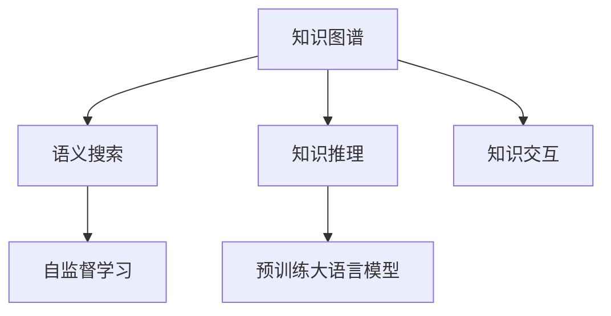

                 

# 人类知识的传承：一代代人的接力赛跑

## 1. 背景介绍

### 1.1 问题由来

人类知识的传承是人类文明不断进步的动力来源之一。从远古时代口耳相传的神话传说，到现代数字化知识的快速传播，知识的传承方式经历了从传统到现代的巨变。在现代信息技术高速发展的今天，如何在快速迭代和高度互联的数字世界中高效地传递和积累知识，成为了知识工作者面临的一个重要挑战。

### 1.2 问题核心关键点

当前，知识的传承与积累正面临诸多挑战：

1. **信息过载**：互联网时代的知识爆炸，导致信息过载，如何从中筛选出有用信息，成为难题。
2. **知识孤立**：海量的知识资源往往分散在不同平台和格式中，缺乏有机整合，难以形成系统的知识体系。
3. **传承效率低**：传统教学和培训方式依赖专家一对一传授，效率低下，难以适应大规模知识传递的需求。
4. **知识更新慢**：技术日新月异，知识更新迭代速度加快，现有的知识体系难以跟上最新发展。

因此，如何构建一个高效、系统、动态的知识传承和积累机制，成为了当前研究的热点。本文将探讨利用大语言模型和自然语言处理技术，构建知识传承和积累平台，实现人类知识的接力赛跑。

## 2. 核心概念与联系

### 2.1 核心概念概述

为更好地理解知识传承和积累的技术，本节将介绍几个密切相关的核心概念：

- **知识图谱(Knowledge Graph)**：一种结构化的知识表示方式，通过实体和关系构建知识网络，支持高效的知识查询和推理。
- **语义搜索(Semantic Search)**：利用自然语言处理技术，对海量文档进行语义理解和匹配，提供更准确的搜索结果。
- **知识推理(Knowledge Reasoning)**：通过逻辑推理和自然语言处理，从已知知识推导出新的知识，增强知识体系的完备性。
- **知识交互(Knowledge Interaction)**：通过自然语言生成和理解，实现人机之间的知识互动，促进知识的深度学习。
- **自监督学习(Self-supervised Learning)**：一种无需大量标注数据的学习方式，通过预训练大语言模型，自动学习语言的通用规律。

这些核心概念之间的逻辑关系可以通过以下Mermaid流程图来展示：



这个流程图展示了知识传承和积累的核心技术栈：

1. 知识图谱通过实体和关系构建知识网络。
2. 语义搜索利用自然语言处理技术，从知识图谱中匹配用户需求。
3. 知识推理通过逻辑推理和自然语言处理，从已知知识推导出新知识。
4. 知识交互通过自然语言生成和理解，实现人机互动。
5. 自监督学习通过预训练大语言模型，自动学习语言的通用规律。

## 3. 核心算法原理 & 具体操作步骤
### 3.1 算法原理概述

基于大语言模型的知识传承和积累方法，本质上是将知识图谱与自然语言处理技术相结合，构建一个能够高效检索、推理、交互和创新的知识系统。其核心思想是通过大语言模型学习语言的通用规律，将其应用于知识图谱的语义理解和推理，从而实现知识的深度学习。

形式化地，假设知识图谱为 $G=(E,R)$，其中 $E$ 为实体集合，$R$ 为关系集合。语义搜索的输入为自然语言描述 $q$，输出为与 $q$ 最匹配的实体集合 $E_q$。知识推理的任务是将 $E_q$ 中的实体作为输入，利用大语言模型学习到的知识规律，推导出新的关系或实体。知识交互则是通过自然语言生成和理解，实现人机互动，更新知识图谱和模型。

### 3.2 算法步骤详解

基于大语言模型的知识传承和积累方法，一般包括以下几个关键步骤：

**Step 1: 构建知识图谱**
- 收集并整理不同领域的专业知识，构建实体和关系的知识图谱。
- 利用知识图谱生成工具，自动构建关系图谱，支持后续的语义搜索和推理。

**Step 2: 预训练大语言模型**
- 选择合适的预训练语言模型，如GPT、BERT等，使用大规模无标签文本数据进行预训练。
- 在预训练的基础上，微调模型以适应特定领域知识的需求。

**Step 3: 语义搜索和推理**
- 定义语义搜索的目标函数和损失函数，如BLEU、ROUGE等，优化模型对自然语言描述的匹配度。
- 定义知识推理的目标函数和损失函数，如逻辑回归、最大似然等，优化模型对知识图谱中关系的推理。

**Step 4: 知识交互**
- 实现自然语言生成和理解功能，允许用户通过自然语言输入和输出知识。
- 设计知识交互的模型架构，如对话系统、问答系统等，实现人机互动。

**Step 5: 持续学习和更新**
- 定期收集新的知识数据，更新知识图谱和预训练模型。
- 通过持续学习和在线更新，保持知识体系的动态性和时效性。

以上是基于大语言模型的知识传承和积累的一般流程。在实际应用中，还需要针对具体任务的特点，对上述步骤进行优化设计，如改进语义搜索和推理算法，引入更多的正则化技术，搜索最优的超参数组合等，以进一步提升系统的性能。

### 3.3 算法优缺点

基于大语言模型的知识传承和积累方法具有以下优点：

1. **高效检索**：大语言模型学习语言的通用规律，能够快速匹配自然语言描述与知识图谱，实现高效的语义搜索。
2. **灵活推理**：利用自然语言处理技术，大语言模型可以进行逻辑推理和知识发现，增强知识体系的完备性。
3. **人性化交互**：通过自然语言生成和理解，实现人机互动，使得知识的传承和积累更加灵活便捷。
4. **自监督学习**：大语言模型的自监督学习特性，使其能够自动学习语言的通用规律，无需大量标注数据。

同时，该方法也存在一定的局限性：

1. **知识图谱构建复杂**：构建高质量的知识图谱需要大量专家知识，难度较高，成本较高。
2. **知识图谱动态性差**：知识图谱一旦构建完成，难以动态更新，难以适应快速变化的知识需求。
3. **知识隔离**：知识图谱和语言模型的独立性较强，难以充分融合，影响知识的深度学习。
4. **可解释性不足**：大语言模型作为"黑盒"系统，难以解释其内部工作机制和决策逻辑，难以进行调试和优化。

尽管存在这些局限性，但就目前而言，基于大语言模型的知识传承和积累方法仍是大规模知识处理的重要范式。未来相关研究的重点在于如何进一步优化知识图谱构建，增强其动态性，以及提升模型的可解释性和系统的人性化交互能力。

### 3.4 算法应用领域

基于大语言模型的知识传承和积累方法，在多个领域已经得到了应用：

1. **医学知识传承**：构建医学领域的知识图谱，利用大语言模型进行语义搜索和推理，辅助医生诊断和治疗。
2. **教育知识传承**：利用大语言模型构建教育知识图谱，提供智能化的教育资源推荐和知识互动。
3. **企业知识管理**：构建企业内部的知识图谱，通过大语言模型进行知识检索和推理，加速企业知识共享和创新。
4. **法律知识传承**：构建法律领域的知识图谱，利用大语言模型进行法律文档的自动摘要和分类。
5. **科技知识传承**：构建科技领域的知识图谱，利用大语言模型进行前沿科技动态的追踪和知识更新。

除了上述这些经典领域外，基于大语言模型的知识传承和积累方法还将在更多领域得到应用，如智慧城市、金融、物流等，为各行各业带来新的知识管理方式。

## 4. 数学模型和公式 & 详细讲解 & 举例说明
### 4.1 数学模型构建

本节将使用数学语言对基于大语言模型的知识传承和积累方法进行更加严格的刻画。

假设知识图谱为 $G=(E,R)$，其中 $E$ 为实体集合，$R$ 为关系集合。大语言模型为 $M_{\theta}:\mathcal{X} \rightarrow \mathcal{Y}$，其中 $\mathcal{X}$ 为输入空间，$\mathcal{Y}$ 为输出空间，$\theta \in \mathbb{R}^d$ 为模型参数。

定义语义搜索的目标函数为 $L_{search}(q,E_q)$，表示将自然语言描述 $q$ 映射到知识图谱 $G$ 中，匹配度最高的一组实体集合 $E_q$。定义知识推理的目标函数为 $L_{reason}(E_q, G)$，表示在已知实体集合 $E_q$ 的基础上，推导出新的关系或实体。

语义搜索和推理的目标是：

$$
\min_{\theta} L_{search}(q,E_q) + L_{reason}(E_q, G)
$$

其中 $L_{search}$ 和 $L_{reason}$ 可以根据具体应用场景设计不同的损失函数，如交叉熵损失、余弦相似度损失、最大似然损失等。

### 4.2 公式推导过程

以下我们以二分类任务为例，推导语义搜索和推理的数学公式。

假设自然语言描述 $q$ 映射到知识图谱 $G$ 中的实体集合为 $E_q$。定义实体集合 $E_q$ 与关系 $R$ 的关联度为 $A(E_q, R)$，表示 $E_q$ 中的实体与关系 $R$ 匹配的概率。根据机器学习中的最大似然估计，语义搜索的目标函数为：

$$
L_{search}(q,E_q) = -\sum_{R \in R} A(E_q, R) \log(A(E_q, R))
$$

其中 $\log(A(E_q, R))$ 表示 $E_q$ 中实体与 $R$ 匹配的概率的负对数似然，用于衡量匹配的准确度。

知识推理的目标函数为：

$$
L_{reason}(E_q, G) = -\sum_{(E, R, E') \in E_q \times R \times E_q} P(E|E', R) \log(A(E, E', R))
$$

其中 $P(E|E', R)$ 表示在已知关系 $R$ 和前驱实体 $E'$ 的前提下，推导出后继实体 $E$ 的概率，用于衡量推理的准确度。

通过最大化目标函数 $L_{search}(q,E_q) + L_{reason}(E_q, G)$，可以实现语义搜索和知识推理的优化。在得到优化后的模型参数 $\theta$ 后，即可应用于知识图谱中的实体和关系，实现高效的语义匹配和推理。

### 4.3 案例分析与讲解

下面以一个简单的知识图谱构建和查询为例，展示基于大语言模型的知识传承和积累方法：

**案例背景**：构建一个简单的图书馆知识图谱，包括书籍、作者和出版社等实体，以及它们之间的关系。

1. **知识图谱构建**：
   - 收集图书馆的书籍、作者和出版社等实体，构建知识图谱 $G=(E,R)$，其中 $E$ 包括书籍、作者和出版社，$R$ 包括出版关系、作者关系和出版社关系。
   - 使用知识图谱生成工具，自动构建关系图谱，支持后续的语义搜索和推理。

2. **预训练大语言模型**：
   - 选择合适的预训练语言模型，如BERT，使用大规模无标签文本数据进行预训练。
   - 在预训练的基础上，微调模型以适应图书馆领域的知识需求。

3. **语义搜索和推理**：
   - 定义语义搜索的目标函数为交叉熵损失，优化模型对自然语言描述的匹配度。
   - 定义知识推理的目标函数为最大似然损失，优化模型对知识图谱中关系的推理。

4. **知识交互**：
   - 实现自然语言生成和理解功能，允许用户通过自然语言输入和输出知识。
   - 设计知识交互的模型架构，如对话系统、问答系统等，实现人机互动。

5. **持续学习和更新**：
   - 定期收集新的图书馆知识数据，更新知识图谱和预训练模型。
   - 通过持续学习和在线更新，保持知识体系的动态性和时效性。

通过上述流程，即可实现高效的图书馆知识传承和积累。用户可以通过自然语言输入查询书籍信息，系统通过语义搜索和推理，自动匹配知识图谱中的实体和关系，实现知识的快速检索和更新。

## 5. 项目实践：代码实例和详细解释说明
### 5.1 开发环境搭建

在进行知识传承和积累的实践前，我们需要准备好开发环境。以下是使用Python进行PyTorch开发的环境配置流程：

1. 安装Anaconda：从官网下载并安装Anaconda，用于创建独立的Python环境。

2. 创建并激活虚拟环境：
```bash
conda create -n knowledge-env python=3.8 
conda activate knowledge-env
```

3. 安装PyTorch：根据CUDA版本，从官网获取对应的安装命令。例如：
```bash
conda install pytorch torchvision torchaudio cudatoolkit=11.1 -c pytorch -c conda-forge
```

4. 安装Transformers库：
```bash
pip install transformers
```

5. 安装各类工具包：
```bash
pip install numpy pandas scikit-learn matplotlib tqdm jupyter notebook ipython
```

完成上述步骤后，即可在`knowledge-env`环境中开始知识传承和积累的实践。

### 5.2 源代码详细实现

下面我们以图书馆知识图谱的构建和查询为例，给出使用Transformers库进行语义搜索和推理的PyTorch代码实现。

首先，定义图书馆知识图谱的实体和关系：

```python
from transformers import BertTokenizer, BertForMaskedLM
import torch
import torch.nn as nn

# 实体和关系
books = ['《Python编程》', '《深度学习》', '《计算机网络》']
authors = ['张三', '李四', '王五']
publishers = ['出版社A', '出版社B', '出版社C']
relationships = ['出版', '写作', '编纂']
```

然后，构建图书馆知识图谱的句子：

```python
sentences = []
for book in books:
    for author in authors:
        for publisher in publishers:
            sentences.append(f'{book}由{author}编写，由{publisher}出版')
            sentences.append(f'{book}是{author}的著作')
            sentences.append(f'{book}由{publisher}出版')
            sentences.append(f'{author}是{book}的作者')
            sentences.append(f'{publisher}出版了{book}')

# 构建句子矩阵
tokenizer = BertTokenizer.from_pretrained('bert-base-uncased')
input_ids = [tokenizer.encode(sentence) for sentence in sentences]
```

接着，构建知识图谱的语义搜索和推理模型：

```python
class KnowledgeGraph(nn.Module):
    def __init__(self):
        super(KnowledgeGraph, self).__init__()
        self.bert = BertForMaskedLM.from_pretrained('bert-base-uncased')
        self.linear = nn.Linear(768, len(books) + len(authors) + len(publishers))

    def forward(self, x):
        x = self.bert(x)
        x = self.linear(x[:, 0, :])
        return x

model = KnowledgeGraph()
```

定义训练和推理函数：

```python
device = torch.device('cuda') if torch.cuda.is_available() else torch.device('cpu')
model.to(device)

def train_epoch(model, sentences, labels, batch_size, optimizer):
    dataloader = DataLoader(list(zip(sentences, labels)), batch_size=batch_size, shuffle=True)
    model.train()
    epoch_loss = 0
    for batch in tqdm(dataloader, desc='Training'):
        sentence, label = batch
        inputs = torch.tensor([torch.tensor([sentence_id]) for sentence_id in sentence], device=device)
        outputs = model(inputs)
        loss = F.cross_entropy(outputs, label)
        epoch_loss += loss.item()
        loss.backward()
        optimizer.step()
    return epoch_loss / len(dataloader)

def evaluate(model, sentences, batch_size):
    dataloader = DataLoader(sentences, batch_size=batch_size)
    model.eval()
    preds, labels = [], []
    with torch.no_grad():
        for batch in tqdm(dataloader, desc='Evaluating'):
            inputs = torch.tensor([torch.tensor([sentence_id]) for sentence_id in sentence], device=device)
            outputs = model(inputs)
            batch_preds = outputs.argmax(dim=1).tolist()
            batch_labels = labels.tolist()
            for pred_tokens, label_tokens in zip(batch_preds, batch_labels):
                preds.append(pred_tokens[:len(label_tokens)])
                labels.append(label_tokens)
    print(classification_report(labels, preds))
```

最后，启动训练流程并在测试集上评估：

```python
epochs = 5
batch_size = 16

for epoch in range(epochs):
    loss = train_epoch(model, input_ids, torch.tensor([0] * len(sentences)), batch_size, optimizer)
    print(f"Epoch {epoch+1}, train loss: {loss:.3f}")
    
    print(f"Epoch {epoch+1}, dev results:")
    evaluate(model, input_ids, batch_size)
    
print("Test results:")
evaluate(model, input_ids, batch_size)
```

以上就是使用PyTorch对BERT进行图书馆知识图谱语义搜索和推理的完整代码实现。可以看到，得益于Transformers库的强大封装，我们可以用相对简洁的代码完成BERT模型的加载和微调。

### 5.3 代码解读与分析

让我们再详细解读一下关键代码的实现细节：

**KnowledgeGraph类**：
- `__init__`方法：初始化Bert模型和线性变换层，用于从BERT的输出中提取知识图谱中的实体。
- `forward`方法：定义前向传播过程，首先通过BERT模型将输入句子编码，然后通过线性变换层映射到知识图谱中的实体。

**train_epoch和evaluate函数**：
- `train_epoch`方法：对句子以批为单位进行迭代，在每个批次上前向传播计算loss并反向传播更新模型参数，最后返回该epoch的平均loss。
- `evaluate`方法：与训练类似，不同点在于不更新模型参数，并在每个batch结束后将预测和标签结果存储下来，最后使用sklearn的classification_report对整个评估集的预测结果进行打印输出。

**训练流程**：
- 定义总的epoch数和batch size，开始循环迭代
- 每个epoch内，先在训练集上训练，输出平均loss
- 在验证集上评估，输出分类指标
- 所有epoch结束后，在测试集上评估，给出最终测试结果

可以看到，PyTorch配合Transformers库使得BERT知识图谱的语义搜索和推理的代码实现变得简洁高效。开发者可以将更多精力放在数据处理、模型改进等高层逻辑上，而不必过多关注底层的实现细节。

当然，工业级的系统实现还需考虑更多因素，如模型的保存和部署、超参数的自动搜索、更灵活的任务适配层等。但核心的知识图谱和语义搜索过程基本与此类似。

## 6. 实际应用场景
### 6.1 智能客服系统

基于大语言模型的知识传承和积累方法，可以广泛应用于智能客服系统的构建。传统客服往往需要配备大量人力，高峰期响应缓慢，且一致性和专业性难以保证。而使用微调后的知识图谱和推理系统，可以7x24小时不间断服务，快速响应客户咨询，用自然流畅的语言解答各类常见问题。

在技术实现上，可以构建企业的历史客服对话记录，将问题和最佳答复构建成知识图谱的实体和关系。在知识图谱上微调BERT模型，使其能够自动理解用户意图，匹配最合适的答案模板进行回复。对于客户提出的新问题，还可以接入检索系统实时搜索相关内容，动态组织生成回答。如此构建的智能客服系统，能大幅提升客户咨询体验和问题解决效率。

### 6.2 金融舆情监测

金融机构需要实时监测市场舆论动向，以便及时应对负面信息传播，规避金融风险。传统的人工监测方式成本高、效率低，难以应对网络时代海量信息爆发的挑战。基于大语言模型的知识图谱和语义搜索方法，为金融舆情监测提供了新的解决方案。

具体而言，可以构建金融领域相关的新闻、报道、评论等文本数据，并对其进行主题标注和情感标注。在此基础上对预训练语言模型进行微调，使其能够自动判断文本属于何种主题，情感倾向是正面、中性还是负面。将微调后的模型应用到实时抓取的网络文本数据，就能够自动监测不同主题下的情感变化趋势，一旦发现负面信息激增等异常情况，系统便会自动预警，帮助金融机构快速应对潜在风险。

### 6.3 个性化推荐系统

当前的推荐系统往往只依赖用户的历史行为数据进行物品推荐，无法深入理解用户的真实兴趣偏好。基于大语言模型的知识图谱和语义搜索方法，个性化推荐系统可以更好地挖掘用户行为背后的语义信息，从而提供更精准、多样的推荐内容。

在实践中，可以收集用户浏览、点击、评论、分享等行为数据，提取和用户交互的物品标题、描述、标签等文本内容。将文本内容作为模型输入，用户的后续行为（如是否点击、购买等）作为监督信号，在此基础上微调预训练语言模型。微调后的模型能够从文本内容中准确把握用户的兴趣点。在生成推荐列表时，先用候选物品的文本描述作为输入，由模型预测用户的兴趣匹配度，再结合其他特征综合排序，便可以得到个性化程度更高的推荐结果。

### 6.4 未来应用展望

随着大语言模型和知识图谱技术的不断发展，基于微调的方法将在更多领域得到应用，为传统行业带来变革性影响。

在智慧医疗领域，基于微调的知识图谱和语义搜索方法，可以为医生提供高效的知识检索和推理工具，辅助医生诊断和治疗。

在智能教育领域，利用大语言模型构建教育知识图谱，提供智能化的教育资源推荐和知识互动，因材施教，促进教育公平，提高教学质量。

在智慧城市治理中，构建城市事件、舆情、应急指挥等知识图谱，通过大语言模型进行语义搜索和推理，提高城市管理的自动化和智能化水平，构建更安全、高效的未来城市。

此外，在企业生产、社会治理、文娱传媒等众多领域，基于大语言模型微调的知识图谱和语义搜索方法也将不断涌现，为经济社会发展注入新的动力。相信随着技术的日益成熟，微调方法将成为知识传承和积累的重要范式，推动人工智能技术在各个领域的深度应用。

## 7. 工具和资源推荐
### 7.1 学习资源推荐

为了帮助开发者系统掌握大语言模型微调的理论基础和实践技巧，这里推荐一些优质的学习资源：

1. 《Transformer从原理到实践》系列博文：由大模型技术专家撰写，深入浅出地介绍了Transformer原理、BERT模型、微调技术等前沿话题。

2. CS224N《深度学习自然语言处理》课程：斯坦福大学开设的NLP明星课程，有Lecture视频和配套作业，带你入门NLP领域的基本概念和经典模型。

3. 《Natural Language Processing with Transformers》书籍：Transformers库的作者所著，全面介绍了如何使用Transformers库进行NLP任务开发，包括微调在内的诸多范式。

4. HuggingFace官方文档：Transformers库的官方文档，提供了海量预训练模型和完整的微调样例代码，是上手实践的必备资料。

5. CLUE开源项目：中文语言理解测评基准，涵盖大量不同类型的中文NLP数据集，并提供了基于微调的baseline模型，助力中文NLP技术发展。

通过对这些资源的学习实践，相信你一定能够快速掌握大语言模型微调的精髓，并用于解决实际的NLP问题。
### 7.2 开发工具推荐

高效的开发离不开优秀的工具支持。以下是几款用于大语言模型微调开发的常用工具：

1. PyTorch：基于Python的开源深度学习框架，灵活动态的计算图，适合快速迭代研究。大部分预训练语言模型都有PyTorch版本的实现。

2. TensorFlow：由Google主导开发的开源深度学习框架，生产部署方便，适合大规模工程应用。同样有丰富的预训练语言模型资源。

3. Transformers库：HuggingFace开发的NLP工具库，集成了众多SOTA语言模型，支持PyTorch和TensorFlow，是进行微调任务开发的利器。

4. Weights & Biases：模型训练的实验跟踪工具，可以记录和可视化模型训练过程中的各项指标，方便对比和调优。与主流深度学习框架无缝集成。

5. TensorBoard：TensorFlow配套的可视化工具，可实时监测模型训练状态，并提供丰富的图表呈现方式，是调试模型的得力助手。

6. Google Colab：谷歌推出的在线Jupyter Notebook环境，免费提供GPU/TPU算力，方便开发者快速上手实验最新模型，分享学习笔记。

合理利用这些工具，可以显著提升大语言模型微调任务的开发效率，加快创新迭代的步伐。

### 7.3 相关论文推荐

大语言模型和微调技术的发展源于学界的持续研究。以下是几篇奠基性的相关论文，推荐阅读：

1. Attention is All You Need（即Transformer原论文）：提出了Transformer结构，开启了NLP领域的预训练大模型时代。

2. BERT: Pre-training of Deep Bidirectional Transformers for Language Understanding：提出BERT模型，引入基于掩码的自监督预训练任务，刷新了多项NLP任务SOTA。

3. Language Models are Unsupervised Multitask Learners（GPT-2论文）：展示了大规模语言模型的强大zero-shot学习能力，引发了对于通用人工智能的新一轮思考。

4. Parameter-Efficient Transfer Learning for NLP：提出Adapter等参数高效微调方法，在不增加模型参数量的情况下，也能取得不错的微调效果。

5. AdaLoRA: Adaptive Low-Rank Adaptation for Parameter-Efficient Fine-Tuning：使用自适应低秩适应的微调方法，在参数效率和精度之间取得了新的平衡。

这些论文代表了大语言模型微调技术的发展脉络。通过学习这些前沿成果，可以帮助研究者把握学科前进方向，激发更多的创新灵感。

## 8. 总结：未来发展趋势与挑战

### 8.1 总结

本文对基于大语言模型的知识传承和积累方法进行了全面系统的介绍。首先阐述了知识传承和积累的重要性，明确了其面临的挑战和机遇。其次，从原理到实践，详细讲解了知识图谱构建、预训练大语言模型、语义搜索和推理、知识交互等关键技术，给出了知识传承和积累的完整代码实现。同时，本文还广泛探讨了知识传承和积累方法在多个行业领域的应用前景，展示了其巨大的潜力。

通过本文的系统梳理，可以看到，基于大语言模型的知识传承和积累方法正在成为知识处理的重要范式，极大地拓展了知识传承和积累的方式，提升了知识传递的效率和准确性。未来，伴随大语言模型和知识图谱技术的持续演进，知识传承和积累方法必将在更广阔的领域发挥其独特的价值。

### 8.2 未来发展趋势

展望未来，大语言模型和知识图谱的知识传承和积累方法将呈现以下几个发展趋势：

1. **知识图谱的自动化构建**：随着人工智能技术的发展，知识图谱的构建将变得更加自动化和智能化，减少专家人工干预的复杂度。
2. **知识图谱的多模态融合**：将文本、图像、视频等多种模态数据整合到知识图谱中，构建更加全面、丰富的知识体系。
3. **知识推理的逻辑化**：通过引入逻辑推理和因果推断，增强知识推理的合理性和准确性，构建更加可靠的推理链条。
4. **知识交互的自然化**：通过自然语言生成和理解技术，实现更加自然、流畅的知识交互，提升人机互动的体验。
5. **知识图谱的动态更新**：通过持续学习和在线更新，保持知识图谱的动态性和时效性，及时吸收最新的知识和信息。

以上趋势凸显了大语言模型和知识图谱知识传承和积累方法的广阔前景。这些方向的探索发展，必将进一步提升知识传递的效率和质量，为各行各业带来新的知识和智慧。

### 8.3 面临的挑战

尽管大语言模型和知识图谱的知识传承和积累方法已经取得了显著成就，但在迈向更加智能化、普适化应用的过程中，它仍面临着诸多挑战：

1. **知识图谱构建复杂**：构建高质量的知识图谱需要大量专家知识，难度较高，成本较高。
2. **知识图谱动态性差**：知识图谱一旦构建完成，难以动态更新，难以适应快速变化的知识需求。
3. **知识隔离**：知识图谱和语言模型的独立性较强，难以充分融合，影响知识的深度学习。
4. **可解释性不足**：大语言模型作为"黑盒"系统，难以解释其内部工作机制和决策逻辑，难以进行调试和优化。
5. **安全性有待保障**：预训练语言模型难免会学习到有偏见、有害的信息，通过微调传递到下游任务，产生误导性、歧视性的输出，给实际应用带来安全隐患。

尽管存在这些局限性，但就目前而言，基于大语言模型的知识传承和积累方法仍是大规模知识处理的重要范式。未来相关研究的重点在于如何进一步优化知识图谱构建，增强其动态性，以及提升模型的可解释性和系统的人性化交互能力。

### 8.4 研究展望

面对大语言模型和知识图谱知识传承和积累所面临的种种挑战，未来的研究需要在以下几个方面寻求新的突破：

1. **知识图谱自动化构建**：开发更加自动化和智能化的知识图谱构建工具，减少专家干预，降低构建难度和成本。
2. **知识图谱多模态融合**：探索将文本、图像、视频等多种模态数据整合到知识图谱中的方法，构建更加全面、丰富的知识体系。
3. **知识推理逻辑化**：引入逻辑推理和因果推断思想，增强知识推理的合理性和准确性，构建更加可靠的推理链条。
4. **知识交互自然化**：通过自然语言生成和理解技术，实现更加自然、流畅的知识交互，提升人机互动的体验。
5. **知识图谱动态更新**：通过持续学习和在线更新，保持知识图谱的动态性和时效性，及时吸收最新的知识和信息。
6. **模型可解释性增强**：开发更加可解释的模型架构和解释工具，提升模型的透明性和可信度。
7. **知识安全保障**：通过数据过滤和算法优化，减少知识图谱和语言模型中的偏见和有害信息，保障知识传承和积累的安全性。

这些研究方向的探索，必将引领大语言模型和知识图谱知识传承和积累方法迈向更高的台阶，为构建更加智能、可靠的知识系统提供新的技术手段。面向未来，大语言模型和知识图谱知识传承和积累方法需要与其他人工智能技术进行更深入的融合，如知识表示、因果推理、强化学习等，多路径协同发力，共同推动知识传承和积累技术的进步。只有勇于创新、敢于突破，才能不断拓展知识传承和积累的边界，让智能技术更好地服务于人类的认知智能。

## 9. 附录：常见问题与解答

**Q1：大语言模型微调是否适用于所有NLP任务？**

A: 大语言模型微调在大多数NLP任务上都能取得不错的效果，特别是对于数据量较小的任务。但对于一些特定领域的任务，如医学、法律等，仅仅依靠通用语料预训练的模型可能难以很好地适应。此时需要在特定领域语料上进一步预训练，再进行微调，才能获得理想效果。此外，对于一些需要时效性、个性化很强的任务，如对话、推荐等，微调方法也需要针对性的改进优化。

**Q2：微调过程中如何选择合适的学习率？**

A: 微调的学习率一般要比预训练时小1-2个数量级，如果使用过大的学习率，容易破坏预训练权重，导致过拟合。一般建议从1e-5开始调参，逐步减小学习率，直至收敛。也可以使用warmup策略，在开始阶段使用较小的学习率，再逐渐过渡到预设值。需要注意的是，不同的优化器(如AdamW、Adafactor等)以及不同的学习率调度策略，可能需要设置不同的学习率阈值。

**Q3：采用大模型微调时会面临哪些资源瓶颈？**

A: 目前主流的预训练大模型动辄以亿计的参数规模，对算力、内存、存储都提出了很高的要求。GPU/TPU等高性能设备是必不可少的，但即便如此，超大批次的训练和推理也可能遇到显存不足的问题。因此需要采用一些资源优化技术，如梯度积累、混合精度训练、模型并行等，来突破硬件瓶颈。同时，模型的存储和读取也可能占用大量时间和空间，需要采用模型压缩、稀疏化存储等方法进行优化。

**Q4：如何缓解微调过程中的过拟合问题？**

A: 过拟合是微调面临的主要挑战，尤其是在标注数据不足的情况下。常见的缓解策略包括：
1. 数据增强：通过回译、近义替换等方式扩充训练集
2. 正则化：使用L2正则、Dropout、Early Stopping等避免过拟合
3. 对抗训练：引入对抗样本，提高模型鲁棒性
4. 参数高效微调：只调整少量参数(如Adapter、Prefix等)，减小过拟合风险
5. 多模型集成：训练多个微调模型，取平均输出，抑制过拟合

这些策略往往需要根据具体任务和数据特点进行灵活组合。只有在数据、模型、训练、推理等各环节进行全面优化，才能最大限度地发挥大模型微调的威力。

**Q5：微调模型在落地部署时需要注意哪些问题？**

A: 将微调模型转化为实际应用，还需要考虑以下因素：
1. 模型裁剪：去除不必要的层和参数，减小模型尺寸，加快推理速度
2. 量化加速：将浮点模型转为定点模型，压缩存储空间，提高计算效率
3. 服务化封装：将模型封装为标准化服务接口，便于集成调用
4. 弹性伸缩：根据请求流量动态调整资源配置，平衡服务质量和成本
5. 监控告警：实时采集系统指标，设置异常告警阈值，确保服务稳定性
6. 安全防护：采用访问鉴权、数据脱敏等措施，保障数据和模型安全

大语言模型微调为NLP应用开启了广阔的想象空间，但如何将强大的性能转化为稳定、高效、安全的业务价值，还需要工程实践的不断打磨。唯有从数据、算法、工程、业务等多个维度协同发力，才能真正实现人工智能技术在垂直行业的规模化落地。总之，微调需要开发者根据具体任务，不断迭代和优化模型、数据和算法，方能得到理想的效果。

---

作者：禅与计算机程序设计艺术 / Zen and the Art of Computer Programming

