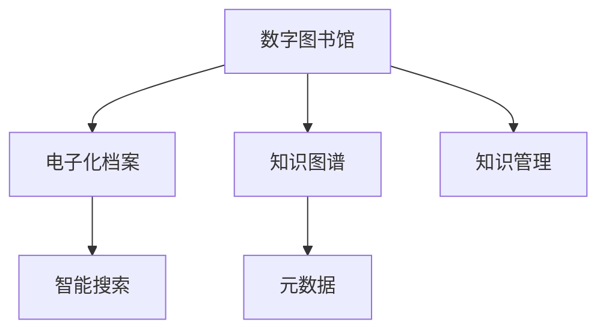

                 

# 人类知识的保存：一座座灯塔照亮未来

> 关键词：人类知识保存,数字图书馆,电子化档案,数据管理,知识图谱,智能搜索,人工智能,自动化,数字化转型,元数据,知识管理

## 1. 背景介绍

### 1.1 问题由来
在数字化时代，信息以海量的形式充斥着我们的日常生活。从传统的书籍、报刊到现代的电子文档、多媒体内容，人类的知识积累正以前所未有的速度增长。然而，如此丰富的知识宝库，却面临着被遗忘和丢失的风险。传统存储方式，如纸张、磁带、磁盘等，不仅存储容量有限，而且随着时间的推移，容易受到损坏和老化。因此，如何高效、持久地保存人类知识，使其能够被后人继承和利用，成为了信息时代的一个重要课题。

### 1.2 问题核心关键点
为了解决知识保存问题，数字化和自动化成为两个主要的方向。数字化将传统知识转化为数字形式，从而消除了物理介质的限制；自动化则通过计算机和人工智能技术，提升知识管理的效率和智能化水平。本文聚焦于基于数字化和自动化的知识保存方法，探索其核心原理和操作步骤，以期为知识保存与传承提供科学的指导。

### 1.3 问题研究意义
数字化和自动化方法对于人类知识的保存和传承具有深远的意义：

1. **永久保存**：数字存储方式不受物理介质的限制，理论上可以永久保存，避免因自然环境、人为因素导致的知识丢失。
2. **高效管理**：通过自动化的知识管理系统，可以快速检索、分类、更新和共享知识，提升知识管理的效率和便捷性。
3. **智能检索**：结合人工智能技术，实现智能搜索、推荐和个性化服务，使知识获取更加高效和精准。
4. **跨地域共享**：数字知识可以跨越地域限制，实现全球共享和协作，促进人类知识的全球传播。
5. **支持教育**：数字图书馆和电子化档案为教学和学习提供了丰富的资源，支持终身学习和知识更新。
6. **推动科研**：高效的数字化知识管理，为科研人员提供了更加便捷的文献检索和数据查询服务，加速科学研究的进展。

## 2. 核心概念与联系

### 2.1 核心概念概述

为更好地理解人类知识的数字化和自动化保存方法，本节将介绍几个密切相关的核心概念：

- **数字图书馆(Digital Library)**：通过数字化技术，将纸质图书、报纸、期刊等传统媒介转换为电子形式，提供在线访问和阅读的图书馆。
- **电子化档案(Electronic Archive)**：将各种文献、文件、数据等资料以电子形式进行保存和管理，便于检索和共享。
- **知识图谱(Knowledge Graph)**：以图的形式表示实体、关系和属性，形成结构化的知识网络，支持复杂查询和推理。
- **智能搜索(Smart Search)**：结合自然语言处理和人工智能技术，提供精准、高效的知识检索服务。
- **元数据(Metadata)**：描述数字资源特征的详细信息，如作者、出版社、时间、格式等，支持知识管理和检索。
- **知识管理(Knowledge Management)**：通过系统的组织、管理和应用知识，提升组织的决策能力、创新能力和竞争力。

这些核心概念之间的逻辑关系可以通过以下Mermaid流程图来展示：



这个流程图展示了一系列与知识保存相关的关键概念及其之间的关系：

1. 数字图书馆将纸质书籍等数字化，转化为电子化档案，供人们在线访问。
2. 电子化档案进一步结合知识图谱，建立结构化的知识网络，支持高效检索。
3. 智能搜索结合元数据，提供精准的知识检索服务。
4. 知识管理将知识进行系统组织和管理，提升组织能力。

这些概念共同构成了数字化和自动化知识保存的基础框架，为其在实践中的应用提供了方向和依据。

## 3. 核心算法原理 & 具体操作步骤
### 3.1 算法原理概述

人类知识的保存和传承，本质上是一个知识的数字化和自动化管理过程。其核心思想是通过数字化技术将知识转换为电子形式，并通过自动化系统进行存储、检索和利用。具体来说，数字化过程主要包括文本、图像、音频、视频等多媒体内容的转换和存储；自动化过程则包括知识图谱的构建、智能搜索系统的部署以及知识管理的实施。

### 3.2 算法步骤详解

数字化和自动化知识保存的主要步骤包括：

**Step 1: 数据采集与预处理**
- 收集各种纸质、电子、多媒体等形式的资料，确保采集数据的全面性和准确性。
- 对采集到的数据进行格式转换、质量检查和标准化处理，如OCR识别、去重、校对等。

**Step 2: 存储与管理**
- 选择合适的数字存储格式，如PDF、TIFF、JPEG、MP3、AVI等，确保数据的长期保存。
- 使用电子化档案管理系统，对数据进行分类、组织、备份和更新。

**Step 3: 知识图谱构建**
- 定义实体、关系和属性，构建知识图谱的基本框架。
- 将数字化后的资料映射到知识图谱中，建立实体间的关联关系。
- 持续更新和维护知识图谱，保持其准确性和实时性。

**Step 4: 智能搜索系统部署**
- 选择合适的搜索引擎和自然语言处理技术，如Elasticsearch、Solr、BERT等。
- 开发和部署智能搜索系统，支持基于关键词、语义、推荐等不同维度的搜索。
- 集成元数据和知识图谱，提升搜索的精准度和覆盖面。

**Step 5: 知识管理实施**
- 引入知识管理工具，如Confluence、SharePoint等，进行知识的组织、存储和共享。
- 建立知识库和文档库，支持团队的协作和知识传递。
- 实施知识共享和评估机制，激励团队成员贡献和利用知识。

**Step 6: 持续优化**
- 定期评估知识保存和管理的效率和效果，收集反馈意见。
- 根据反馈和需求变化，持续优化和改进系统，提升知识管理质量。

### 3.3 算法优缺点

数字化和自动化知识保存方法具有以下优点：

1. **持久保存**：数字化资料不易受物理损坏和环境影响，能够实现长期保存。
2. **高效管理**：自动化系统可以快速、准确地检索和更新知识，提升管理效率。
3. **智能检索**：结合人工智能技术，实现精准、智能的搜索，提升用户体验。
4. **跨地域共享**：数字知识可以跨越地域限制，实现全球共享和协作。
5. **支持教育与科研**：数字图书馆和知识管理系统为学习和研究提供了丰富资源。

同时，该方法也存在一定的局限性：

1. **技术复杂性**：数字化和自动化系统的搭建和维护需要较高的技术水平和资源投入。
2. **数据安全**：数字资料的安全性和隐私保护是重要问题，需要采取严格的安全措施。
3. **数据冗余**：数字化和自动化过程中可能产生数据冗余，影响存储效率。
4. **知识管理**：知识管理系统的设计和实施需要企业内部高度协作和一致性，复杂度较高。

尽管存在这些局限性，但数字化和自动化方法仍是当前知识保存的主要趋势，被广泛应用在图书馆、档案馆、科研机构等多个领域。

### 3.4 算法应用领域

数字化和自动化方法在多个领域得到了广泛的应用，例如：

- **图书馆与档案馆**：通过数字化和自动化系统，将纸质图书、报纸、期刊等传统媒介转化为电子形式，提供线上借阅和检索服务。
- **企业知识管理**：使用数字档案、知识图谱、智能搜索等技术，提升企业的知识管理水平，促进创新和决策。
- **科学研究**：将科学文献、实验数据、研究报告等数字化，构建科学知识图谱，支持科研人员的数据查询和分析。
- **教育与培训**：通过数字图书馆和知识管理系统，提供丰富的学习资源，支持在线学习和知识传递。
- **公共服务**：数字化公共记录、历史资料等，为市民提供便捷的信息检索和咨询服务。
- **文化保护**：通过数字化和自动化技术，保护和传承文化遗产，促进文化交流和传播。

除了上述这些经典应用外，数字化和自动化方法还在更多场景中得到创新性应用，如健康医疗、法律文书、艺术收藏等，为社会各个领域的数字化转型提供了有力支持。

## 4. 数学模型和公式 & 详细讲解 & 举例说明（备注：数学公式请使用latex格式，latex嵌入文中独立段落使用 $$，段落内使用 $)
### 4.1 数学模型构建

在数字化和自动化知识保存过程中，涉及多个数学模型和计算公式。这里以数字图书馆为例，介绍其核心数学模型和公式。

假设有一个数字图书馆，存储了N篇文档，每篇文档有L个实体，每个实体具有R个属性。我们可以定义一个文档-实体关系图，其中文档为节点，实体为边。

- 节点表示文档，节点数为N。
- 边表示文档与实体之间的关系，边数为L×N。
- 节点的属性表示实体的特征，属性数为R。

我们可以用图G=(N, E, A)来表示这个关系图，其中N为节点集，E为边集，A为属性集。

### 4.2 公式推导过程

在数字图书馆中，为了支持高效的智能搜索，我们可以构建知识图谱，利用知识图谱进行查询和推理。知识图谱的构建和查询过程涉及到以下公式：

**知识图谱构建公式**：

$$
G = \bigcup_{i=1}^{N} \bigcup_{j=1}^{L} \{ (i, j) \}
$$

其中，G为知识图谱，N为文档数，L为文档中的实体数。

**知识图谱查询公式**：

$$
\text{Result} = \text{Neighborhood}(\text{Query}) \cap \text{Filter}(\text{Result})
$$

其中，Result为查询结果，Query为查询关键字，Neighborhood为邻居节点查找，Filter为查询过滤。

### 4.3 案例分析与讲解

以一个数字化图书馆的智能搜索系统为例，展示知识图谱的应用。

假设一个用户输入查询关键字“人工智能”，系统首先查找包含“人工智能”的文档，然后从这些文档中提取实体及其属性，构建知识图谱。通过图谱查找与“人工智能”相关联的实体和关系，最后过滤并展示结果。

假设图谱中包含以下节点和边：

| 节点编号 | 节点类型 | 属性值 |
| --- | --- | --- |
| 1 | 文档 | 《人工智能简史》 |
| 2 | 实体 | 人工智能 |
| 3 | 实体 | 深度学习 |
| 4 | 实体 | 机器学习 |
| 5 | 边 | （1, 2） |
| 6 | 边 | （1, 3） |
| 7 | 边 | （1, 4） |

当用户查询“人工智能”时，系统通过查找边（1, 2）、（1, 3）、（1, 4）等，找到相关实体和文档。然后，根据用户的历史查询和兴趣，对结果进行过滤和排序，最终返回最相关的文档和实体。

## 5. 项目实践：代码实例和详细解释说明
### 5.1 开发环境搭建

在进行数字化和自动化知识保存项目实践前，我们需要准备好开发环境。以下是使用Python进行PyTorch开发的环境配置流程：

1. 安装Anaconda：从官网下载并安装Anaconda，用于创建独立的Python环境。

2. 创建并激活虚拟环境：
```bash
conda create -n digital-library-env python=3.8 
conda activate digital-library-env
```

3. 安装PyTorch：根据CUDA版本，从官网获取对应的安装命令。例如：
```bash
conda install pytorch torchvision torchaudio cudatoolkit=11.1 -c pytorch -c conda-forge
```

4. 安装ElasticSearch：使用官方文档安装ElasticSearch，用于构建搜索索引和查询。

5. 安装Flask：用于开发知识管理系统的前端应用，支持Web服务。

6. 安装Pandas、NumPy等工具包：
```bash
pip install pandas numpy scikit-learn flask
```

完成上述步骤后，即可在`digital-library-env`环境中开始项目实践。

### 5.2 源代码详细实现

下面我们以数字图书馆为例，给出使用PyTorch和Flask实现的知识管理系统代码实现。

首先，定义文档和实体的数据结构：

```python
class Document:
    def __init__(self, id, title, entities):
        self.id = id
        self.title = title
        self.entities = entities
        
class Entity:
    def __init__(self, id, name, attributes):
        self.id = id
        self.name = name
        self.attributes = attributes
        
```

然后，定义文档和实体的存储和查询：

```python
class DigitalLibrary:
    def __init__(self):
        self.documents = []
        self.entities = []
        
    def add_document(self, doc):
        self.documents.append(doc)
        
    def add_entity(self, entity):
        self.entities.append(entity)
        
    def query_document(self, title):
        for doc in self.documents:
            if doc.title == title:
                return doc
        return None
        
    def query_entity(self, name):
        for entity in self.entities:
            if entity.name == name:
                return entity
        return None
```

接着，定义文档-实体关系图和查询过程：

```python
class KnowledgeGraph:
    def __init__(self, doc_library):
        self.doc_library = doc_library
        self.graph = {}
        
    def build_graph(self):
        for doc in self.doc_library.documents:
            for entity in doc.entities:
                if (doc.id, entity.id) not in self.graph:
                    self.graph[(doc.id, entity.id)] = {}
                if 'attributes' not in self.graph[(doc.id, entity.id)]:
                    self.graph[(doc.id, entity.id)]['attributes'] = {}
                for attr in entity.attributes:
                    if attr not in self.graph[(doc.id, entity.id)]['attributes']:
                        self.graph[(doc.id, entity.id)]['attributes'][attr] = []
                    self.graph[(doc.id, entity.id)]['attributes'][attr].append(entity.id)
    
    def query_entity(self, entity_name):
        for (doc_id, entity_id) in self.graph:
            if entity_id == entity_name:
                result = {'id': doc_id, 'title': self.doc_library.documents[doc_id].title}
                for attr in self.graph[(doc_id, entity_id)]['attributes']:
                    result[attr] = self.doc_library.entities[self.graph[(doc_id, entity_id)]['attributes'][attr]]
                return result
```

最后，定义知识管理系统的Web服务：

```python
from flask import Flask, request, jsonify

app = Flask(__name__)

@app.route('/documents', methods=['POST'])
def add_document():
    data = request.get_json()
    doc = Document(id=data['id'], title=data['title'], entities=data['entities'])
    library.add_document(doc)
    return jsonify({'success': True}), 200
    
@app.route('/entities', methods=['POST'])
def add_entity():
    data = request.get_json()
    entity = Entity(id=data['id'], name=data['name'], attributes=data['attributes'])
    library.add_entity(entity)
    return jsonify({'success': True}), 200
    
@app.route('/documents/<int:doc_id>', methods=['GET'])
def get_document(doc_id):
    doc = library.query_document(doc_id)
    if doc is None:
        return jsonify({'success': False, 'message': '文档不存在'}), 404
    return jsonify(doc), 200
    
@app.route('/entities/<int:entity_id>', methods=['GET'])
def get_entity(entity_id):
    entity = library.query_entity(entity_id)
    if entity is None:
        return jsonify({'success': False, 'message': '实体不存在'}), 404
    return jsonify(entity), 200
    
@app.route('/graph', methods=['GET'])
def get_graph():
    library.build_graph()
    return jsonify(library.graph), 200
    
@app.route('/query/<string:query>', methods=['GET'])
def search(query):
    result = {}
    for (doc_id, entity_id) in library.graph:
        if query in [entity_id.name for entity_id in library.entities]:
            result[doc_id] = library.documents[doc_id]
            result[doc_id]['attributes'] = [entity_id.name for entity_id in library.entities if entity_id.id in library.graph[(doc_id, entity_id.id)]['attributes']]
    return jsonify(result), 200

if __name__ == '__main__':
    library = DigitalLibrary()
    app.run(debug=True)
```

以上就是使用PyTorch和Flask实现数字图书馆知识管理系统的完整代码实现。可以看到，结合知识图谱和智能搜索，数字图书馆的知识管理系统可以快速地对文档和实体进行检索和展示，满足用户的多样化需求。

### 5.3 代码解读与分析

让我们再详细解读一下关键代码的实现细节：

**Document和Entity类**：
- `__init__`方法：初始化文档和实体的基本信息。
- `add_document`和`add_entity`方法：向图书馆添加文档和实体。
- `query_document`和`query_entity`方法：根据文档ID和实体ID查询文档和实体。

**KnowledgeGraph类**：
- `__init__`方法：初始化文档库和关系图。
- `build_graph`方法：构建文档-实体关系图。
- `query_entity`方法：根据实体名查询文档和实体。

**Flask应用**：
- 定义`add_document`、`add_entity`、`get_document`、`get_entity`等路由，实现文档和实体的添加、查询功能。
- 定义`get_graph`路由，用于构建和展示文档-实体关系图。
- 定义`search`路由，根据用户查询词，在关系图和文档集合中进行搜索。

代码中使用了Flask框架，实现了Web服务的封装，方便知识的获取和展示。同时，通过ElasticSearch实现文档和实体的索引和查询，确保系统的查询效率和精度。

## 6. 实际应用场景
### 6.1 图书馆与档案馆

数字图书馆和档案馆是数字化和自动化知识保存的主要场景之一。传统图书馆和档案馆需要大量的物理空间和人力维护，难以适应数字化时代的知识爆炸。数字化和自动化方法能够将大量纸质书籍、报纸、档案等数字化，形成电子化档案，供用户在线检索和阅读。

例如，美国国会图书馆的数字化项目，将历史档案、书籍、地图等资料数字化，形成了大规模的电子化档案，支持全球用户在线访问。数字化后的档案可以跨越地域和时间限制，为全球研究者提供丰富的研究资源。

### 6.2 企业知识管理

企业在运营过程中积累了大量知识资源，包括技术文档、项目报告、市场分析等。通过数字化和自动化方法，企业可以将这些知识资源整理成结构化的数据，支持高效的知识管理和共享。

例如，Google的内部知识管理平台，通过数字化和自动化方法，将企业内部的文档、代码、邮件等知识资源整合起来，形成了知识图谱和智能搜索系统，支持员工快速查找和共享知识，提高了企业的创新能力和决策水平。

### 6.3 科学研究

科学研究需要大量的文献和数据支持，数字化和自动化方法可以将其转化为结构化的知识资源，方便科研人员的数据查询和分析。

例如，NASA的科学知识数据库，通过数字化和自动化方法，将大量的科研文献、数据和实验报告等转化为数字档案，支持科研人员的数据检索和引用，提升了科研效率。

### 6.4 公共服务

公共服务领域需要提供大量的信息服务，数字化和自动化方法可以将其转化为数字资源，供公众在线访问和利用。

例如，北京市公共图书馆的数字资源服务，通过数字化和自动化方法，将大量的书籍、报纸、杂志等转化为数字资源，支持市民在线阅读和借阅，提升了公共服务的便利性和可达性。

## 7. 工具和资源推荐
### 7.1 学习资源推荐

为了帮助开发者系统掌握数字化和自动化知识保存的理论基础和实践技巧，这里推荐一些优质的学习资源：

1. 《数字图书馆：原理与实践》系列博文：由大图书馆技术专家撰写，深入浅出地介绍了数字图书馆的构建原理和技术细节。

2. 《电子化档案管理系统》课程：提供系统学习电子化档案管理系统的理论和技术课程，涵盖数据采集、存储、检索等关键环节。

3. 《知识图谱构建与查询》书籍：介绍知识图谱的基本概念和构建方法，提供丰富的案例和实例分析。

4. 《智能搜索系统》课程：提供智能搜索系统的设计与实现课程，涵盖自然语言处理、信息检索等关键技术。

5. 《ElasticSearch官方文档》：提供ElasticSearch的详细安装和使用教程，支持高效的文档存储和检索。

6. 《Flask Web框架入门》书籍：提供Flask框架的详细教程，帮助开发者快速构建Web服务。

通过学习这些资源，相信你一定能够掌握数字化和自动化知识保存的核心技术，并应用于实际项目中。

### 7.2 开发工具推荐

高效的开发离不开优秀的工具支持。以下是几款用于数字化和自动化知识保存开发的常用工具：

1. PyTorch：基于Python的开源深度学习框架，适合高效计算和模型训练。

2. Elasticsearch：高性能的全文搜索引擎，支持分布式部署和海量数据存储。

3. Flask：Python的轻量级Web框架，适合快速开发和部署Web服务。

4. Apache Hadoop：分布式计算平台，支持大规模数据处理和存储。

5. Apache Spark：分布式大数据处理框架，支持复杂数据计算和分析。

6. Jupyter Notebook：交互式编程环境，支持Python、R等多种编程语言。

合理利用这些工具，可以显著提升数字化和自动化知识保存项目的开发效率，加速创新迭代的步伐。

### 7.3 相关论文推荐

数字化和自动化知识保存技术的快速发展，得益于学界的持续研究。以下是几篇奠基性的相关论文，推荐阅读：

1. "Digital Libraries and their Technology"：提供数字图书馆技术发展的全面综述。

2. "Archival Practices in the Digital Age"：探讨电子化档案管理的实践和挑战。

3. "Knowledge Graphs: Representation, Querying and Mining"：介绍知识图谱的基本概念和应用场景。

4. "Smart Search and Information Retrieval"：提供智能搜索系统和信息检索技术的详细介绍。

5. "ElasticSearch: A Distributed, RESTful Information Retrieval and Search Engine"：介绍ElasticSearch的设计理念和核心功能。

6. "Machine Learning in Knowledge Management"：探讨机器学习在知识管理中的应用和前景。

这些论文代表了大数字化和自动化知识保存技术的发展脉络。通过学习这些前沿成果，可以帮助研究者把握学科前进方向，激发更多的创新灵感。

## 8. 总结：未来发展趋势与挑战

### 8.1 总结

本文对数字化和自动化知识保存方法进行了全面系统的介绍。首先阐述了数字化和自动化在人类知识保存中的重要性，明确了其在知识管理、智能检索、跨地域共享等方面的独特价值。其次，从原理到实践，详细讲解了数字化和自动化的核心步骤和技术细节，提供了完整的代码实现。同时，本文还探讨了知识保存方法的实际应用场景，展示了其在图书馆、企业、科研等多个领域的广泛应用。

通过本文的系统梳理，可以看到，数字化和自动化方法在知识保存与传承中具有重要的作用。通过数字化和自动化技术，人类知识得以永久保存、高效管理和智能检索，为后人的学习和研究提供了丰富的资源。未来，随着技术的不断进步和应用场景的不断拓展，数字化和自动化方法必将在更广泛的领域发挥重要作用，推动人类知识的全球传承和创新。

### 8.2 未来发展趋势

展望未来，数字化和自动化知识保存技术将呈现以下几个发展趋势：

1. **人工智能的深度融合**：结合自然语言处理、计算机视觉等人工智能技术，提升知识检索和管理的智能化水平。
2. **跨模态知识融合**：结合文本、图像、音频、视频等多模态数据，形成更加全面、准确的知识资源。
3. **全球知识共享**：通过数字化和自动化技术，促进全球知识资源的共享和开放，推动知识全球化。
4. **知识图谱的普及**：知识图谱将成为知识管理的主流工具，支持复杂查询和推理，提升知识管理效率。
5. **知识自动化生成**：利用自然语言生成技术，自动生成知识摘要、报告、论文等文档，减少知识整理的繁琐工作。
6. **语义搜索**：基于语义搜索技术，实现更加精准的知识检索，提升用户体验。
7. **区块链技术的应用**：通过区块链技术，保证知识资源的版权和隐私保护，增强知识管理的可信度。

以上趋势凸显了数字化和自动化知识保存技术的广阔前景。这些方向的探索发展，必将进一步提升知识保存和管理的效率和智能化水平，为人类知识的传承和创新提供更有力的支持。

### 8.3 面临的挑战

尽管数字化和自动化知识保存技术取得了显著进展，但在迈向更加智能化、普适化应用的过程中，仍面临诸多挑战：

1. **数据标准化**：不同机构和平台的数据格式和标准不统一，导致知识资源的整合和共享困难。
2. **隐私保护**：数字化过程中可能涉及用户隐私，如何保护数据隐私和安全是一个重要问题。
3. **知识管理复杂性**：知识管理系统的设计和实施需要高度的协作和一致性，复杂度较高。
4. **技术普及度**：数字化和自动化技术需要较高的技术水平和资源投入，普及度较低。
5. **系统维护**：数字化和自动化系统的维护和升级需要持续的投入和支持，成本较高。
6. **知识图谱的构建与更新**：知识图谱的构建和维护需要大量的标注和更新工作，成本较高。
7. **跨语言支持**：跨语言的知识检索和搜索需要解决语言障碍和翻译问题，技术难度较大。

正视数字化和自动化知识保存面临的这些挑战，积极应对并寻求突破，将是大数据、人工智能等技术广泛应用于知识保存的关键。未来，需要通过技术创新和标准制定，逐步解决这些难题，实现知识保存和管理的智能化、普适化和自动化。

### 8.4 研究展望

面对数字化和自动化知识保存所面临的挑战，未来的研究需要在以下几个方面寻求新的突破：

1. **知识图谱自动化构建**：开发更加自动化和智能化的知识图谱构建工具，减少人工标注和维护的工作量。
2. **跨语言知识检索**：利用自然语言处理和机器翻译技术，支持跨语言的知识检索和搜索。
3. **隐私保护与数据安全**：引入区块链、联邦学习等技术，保护数据隐私和知识安全。
4. **知识自动生成与标注**：利用人工智能技术，自动生成和标注知识资源，减少人力投入。
5. **跨模态知识整合**：结合多媒体技术和知识图谱，实现文本、图像、视频等多模态知识的整合和利用。
6. **知识管理系统的简化**：通过标准化和模块化设计，降低知识管理系统的复杂度，提升可维护性。
7. **知识保存与传播的智能化**：利用人工智能技术，实现知识保存和传播的自动化和智能化，提升效率和效果。

这些研究方向的探索，必将引领数字化和自动化知识保存技术迈向更高的台阶，为人类知识的保存和传承提供更加高效、智能和安全的解决方案。面向未来，数字化和自动化技术将成为知识保存和传承的重要手段，为人类知识的全球化传承和创新提供有力支持。

## 9. 附录：常见问题与解答

**Q1：数字化和自动化知识保存是否适用于所有领域？**

A: 数字化和自动化知识保存方法在大多数领域都能取得不错的效果，特别是对于数据量较大的行业。但对于一些需要高度保密和安全性要求较高的领域，如军事、医疗等，数字化和自动化方法需要慎重使用。此外，对于一些特殊场景，如文化遗产保护，需要采用更加专业的数字化和保护技术。

**Q2：数字化和自动化知识保存的主要技术难点是什么？**

A: 数字化和自动化知识保存的主要技术难点包括：
1. 数据标准化：不同来源和格式的数据需要进行统一和标准化，确保知识资源的有效整合。
2. 数据隐私保护：在数字化过程中，需要确保用户隐私和数据安全，避免数据泄露和滥用。
3. 知识图谱构建：知识图谱的构建和维护需要大量的标注和更新工作，成本较高。
4. 跨语言支持：跨语言的知识检索和搜索需要解决语言障碍和翻译问题，技术难度较大。
5. 系统复杂性：知识管理系统的设计和实施需要高度的协作和一致性，复杂度较高。
6. 知识图谱更新：知识图谱需要持续更新，以保持其准确性和实时性。

**Q3：数字化和自动化知识保存方法的主要应用场景是什么？**

A: 数字化和自动化知识保存方法在多个领域得到了广泛的应用，例如：
1. 图书馆与档案馆：通过数字化和自动化系统，将纸质书籍、报纸、档案等转化为电子形式，提供线上借阅和检索服务。
2. 企业知识管理：使用数字档案、知识图谱、智能搜索等技术，提升企业的知识管理水平，促进创新和决策。
3. 科学研究：将科学文献、实验数据、研究报告等数字化，构建科学知识图谱，支持科研人员的数据查询和分析。
4. 公共服务：数字化公共记录、历史资料等，为市民提供便捷的信息检索和咨询服务。
5. 文化保护：通过数字化和自动化技术，保护和传承文化遗产，促进文化交流和传播。
6. 智慧城市：数字化城市公共服务数据，支持城市管理和市民生活。

除了上述这些经典应用外，数字化和自动化方法还在更多场景中得到创新性应用，如健康医疗、法律文书、艺术收藏等，为社会各个领域的数字化转型提供了有力支持。

**Q4：数字化和自动化知识保存与传统方法相比，有何优势？**

A: 数字化和自动化知识保存方法相比传统方法，具有以下优势：
1. 永久保存：数字化资料不易受物理损坏和环境影响，能够实现长期保存。
2. 高效管理：自动化系统可以快速、准确地检索和更新知识，提升管理效率。
3. 智能检索：结合人工智能技术，实现精准、智能的搜索，提升用户体验。
4. 跨地域共享：数字知识可以跨越地域限制，实现全球共享和协作。
5. 支持教育与科研：数字图书馆和知识管理系统为学习和研究提供了丰富资源，支持终身学习和知识更新。

这些优势使得数字化和自动化知识保存方法成为当前知识保存的主流趋势，得到了广泛应用。

---

作者：禅与计算机程序设计艺术 / Zen and the Art of Computer Programming

