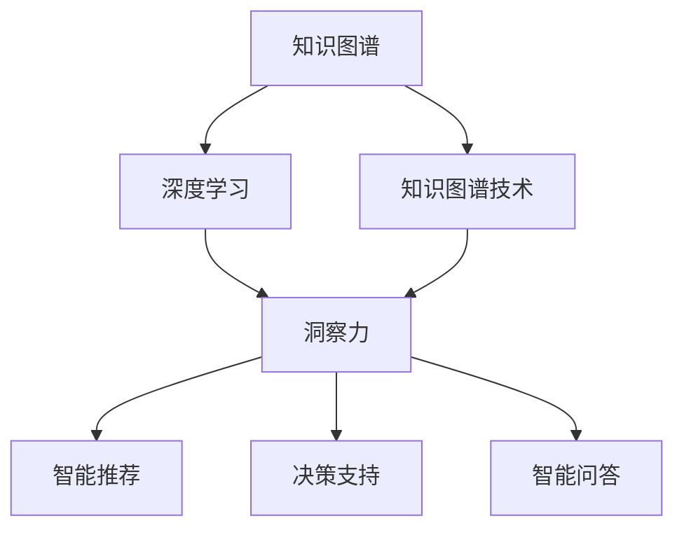

                 

# 人类知识的未来图景：洞察力引领知识变革

> 关键词：人类知识,洞察力,知识图谱,知识图谱技术,深度学习,数据挖掘,人工智能

## 1. 背景介绍

### 1.1 问题由来

在现代知识爆炸的时代，人类知识的积累和传播方式正经历着深刻的变革。传统的信息检索和知识管理方式，如网页搜索、目录索引等，已难以满足人们对海量知识的高效获取和理解需求。知识的组织和利用效率亟需提升。

人工智能技术的发展，特别是深度学习、数据挖掘和知识图谱等新兴技术的崛起，为知识的深度抽取和智能组织带来了新的可能性。深度学习算法能够从大规模无结构数据中自动学习出有意义的特征，而知识图谱则提供了一种结构化的方式，将分散的知识节点整合成有机的知识体系。洞察力，作为一种结合了深度学习与知识图谱的智能技术，能够从海量知识中提取高价值的洞察，支撑决策支持、智能推荐、智能问答等场景。

### 1.2 问题核心关键点

洞察力技术通过深度学习模型和知识图谱的有机结合，实现了对知识深度抽取和关联挖掘。其核心包括以下几个关键点：

- **知识图谱构建**：从结构化数据、文本数据、网络数据等多种来源构建知识图谱，存储实体、属性和关系等知识节点。
- **深度学习特征抽取**：使用深度学习模型自动从文本、图像、音频等多种数据源中提取丰富的语义特征。
- **知识关联挖掘**：利用深度学习模型和图谱推理算法，挖掘知识图谱中潜在的关联关系，生成新的知识节点和关系。
- **知识推理与生成**：基于知识图谱和深度学习模型，推理出新的知识关系，生成结构化的知识内容。

这些关键点的有机结合，使得洞察力技术能够在复杂的知识场景中，快速、高效地抽取、关联和生成高价值的知识洞察，为知识管理、决策支持和智能应用提供强大的技术支撑。

## 2. 核心概念与联系

### 2.1 核心概念概述

为更好地理解洞察力技术的核心原理，本节将介绍几个密切相关的核心概念：

- **知识图谱(Knowledge Graph, KG)**：一种结构化的知识表示方式，用于存储和组织实体、属性和关系等知识节点。常见的知识图谱构建方法包括人工构建、自动抽取等。
- **深度学习(Deep Learning)**：一类基于多层神经网络结构的机器学习方法，能够自动从数据中学习出高层次的特征表示。在洞察力技术中，深度学习模型主要用于特征抽取和关联挖掘。
- **知识图谱技术(KG Technologies)**：围绕知识图谱构建、查询和推理的技术集合。包括实体链接、关系抽取、图谱推理等。
- **洞察力(Insight)**：通过深度学习和知识图谱技术，从海量知识中提取的有价值信息或洞见。洞察力可以用于智能推荐、决策支持、智能问答等多种场景。

这些核心概念之间的逻辑关系可以通过以下Mermaid流程图来展示：



这个流程图展示了这个核心的核心概念及其之间的关系：

1. 知识图谱是构建洞察力的基础，通过自动构建或人工构建，存储了丰富的知识信息。
2. 深度学习模型用于从数据中自动提取特征，并从知识图谱中挖掘潜在的关联关系。
3. 知识图谱技术提供了对知识图谱进行推理和查询的方法，为洞察力技术提供了必要的支持。
4. 洞察力技术结合了深度学习和知识图谱，从海量知识中抽取高价值的洞察。
5. 洞察力技术可以应用于多种智能场景，如智能推荐、决策支持和智能问答。

这些核心概念共同构成了洞察力技术的核心框架，使其能够在复杂的知识场景中实现对知识的深度抽取和关联挖掘。

## 3. 核心算法原理 & 具体操作步骤
### 3.1 算法原理概述

洞察力技术通过深度学习模型和知识图谱的结合，实现了对知识的深度抽取和关联挖掘。其核心思想是：将知识图谱中的结构化知识与深度学习模型的非结构化表示相结合，从多种数据源中自动学习出高层次的知识特征，并挖掘知识图谱中潜在的关联关系。

具体而言，洞察力技术包括以下几个关键步骤：

1. **知识图谱构建**：构建知识图谱，存储实体、属性和关系等知识节点。
2. **深度学习特征抽取**：使用深度学习模型从文本、图像、音频等多种数据源中提取语义特征。
3. **知识图谱推理**：利用图谱推理算法，挖掘知识图谱中潜在的关联关系，生成新的知识节点和关系。
4. **知识推理与生成**：基于知识图谱和深度学习模型，推理出新的知识关系，生成结构化的知识内容。

通过以上步骤，洞察力技术能够从海量知识中抽取高价值的洞察，支撑决策支持、智能推荐、智能问答等场景。

### 3.2 算法步骤详解

以下是洞察力技术的详细操作步骤：

**Step 1: 知识图谱构建**
- 收集结构化数据（如数据库、知识库）和非结构化数据（如文本、网页、图像），提取和存储实体、属性和关系。
- 对于非结构化数据，使用NLP技术提取文本中的实体、关系等信息，构建实体-关系图谱。
- 对于结构化数据，直接存储到图谱中。

**Step 2: 深度学习特征抽取**
- 选择适合的深度学习模型（如BERT、GPT、Transformer等），从文本、图像、音频等多种数据源中提取语义特征。
- 对提取的特征进行编码，得到高维特征向量。
- 将特征向量映射到知识图谱中的实体或关系节点，增强节点的语义信息。

**Step 3: 知识图谱推理**
- 使用图谱推理算法（如TransE、NeoLogic等），挖掘知识图谱中潜在的关联关系，生成新的知识节点和关系。
- 利用图谱中的实体关系，对深度学习模型提取的特征进行增强，提取更深层次的知识洞见。
- 将推理出的新知识节点和关系存入知识图谱，不断扩展和丰富知识图谱。

**Step 4: 知识推理与生成**
- 利用知识图谱和深度学习模型，推理出新的知识关系，生成结构化的知识内容。
- 将推理出的知识内容存储到知识图谱中，丰富图谱的深度和广度。
- 使用知识图谱中的关系和属性，指导深度学习模型的训练，增强模型的推理能力。

### 3.3 算法优缺点

洞察力技术在知识管理、决策支持和智能推荐等场景中取得了显著的效果，但也存在一些局限性：

**优点：**
1. **深度抽取**：深度学习模型能够从海量数据中自动学习出高层次的特征表示，抽取高价值的洞察。
2. **结构化**：知识图谱提供了结构化的方式，存储和组织知识节点，增强了知识的可理解性和可推理性。
3. **高效推理**：知识图谱技术提供了高效的推理算法，能够快速从知识图谱中挖掘关联关系，生成新的知识内容。
4. **智能应用**：洞察力技术能够支撑智能推荐、决策支持和智能问答等应用场景，提升用户体验和决策效率。

**缺点：**
1. **构建成本高**：知识图谱构建需要大量人工参与，构建成本较高。
2. **复杂度高**：深度学习模型和知识图谱的结合，增加了系统的复杂度，调试和维护难度较大。
3. **数据依赖**：洞察力技术依赖于高质量的数据输入，数据质量不高或数据量不足时，效果可能不理想。
4. **推理限制**：知识图谱的推理算法依赖于模型和数据，推理出的新知识可能存在偏差或错误。

尽管存在这些局限性，但就目前而言，洞察力技术仍然是一种非常有效的知识抽取和关联挖掘方法，具有广泛的应用前景。

### 3.4 算法应用领域

洞察力技术在多个领域中具有广泛的应用，包括但不限于以下场景：

- **智能推荐系统**：利用洞察力技术从用户行为和商品属性中抽取高价值洞察，生成个性化的推荐内容。
- **决策支持系统**：从海量数据中抽取相关洞察，辅助领导层进行决策。
- **智能问答系统**：利用洞察力技术对用户问题进行理解和推理，生成准确的答案。
- **智能客服**：通过洞察力技术对客户咨询进行理解和分类，快速响应并解决问题。
- **医学诊断系统**：从海量医学文献中抽取高价值洞察，辅助医生进行疾病诊断和治疗。
- **金融风险分析**：从金融数据中抽取洞察，辅助投资者进行风险评估和投资决策。

## 4. 数学模型和公式 & 详细讲解 & 举例说明
### 4.1 数学模型构建

洞察力技术的数学模型主要基于深度学习模型和知识图谱的结合。以下是几个核心模型的数学构建：

- **实体-关系图谱**：存储实体、属性和关系等知识节点，表示为三元组形式 $(实体, 属性, 实体)$。

- **深度学习特征抽取**：使用Transformer模型，从文本数据中提取高层次的语义特征。Transformer模型在自然语言处理领域表现出色，能够自动学习出文本中的上下文依赖关系。

- **图谱推理算法**：如TransE算法，基于嵌入空间的推理方法，挖掘知识图谱中的关联关系。TransE模型的数学公式如下：

  $$
  \arg\min_{\theta} \sum_{i=1}^N \left\lVert \mathbf{r}_i - \mathbf{h}_i \odot \mathbf{t}_i \right\rVert^2
  $$

  其中 $\mathbf{r}_i$ 为关系向量，$\mathbf{h}_i$ 和 $\mathbf{t}_i$ 分别为头和尾节点的嵌入向量。

### 4.2 公式推导过程

以下是TransE算法的详细推导过程：

假设知识图谱中有一个三元组 $(实体_1, 属性, 实体_2)$，其中属性对应的关系向量为 $\mathbf{r}$，实体 $实体_1$ 的嵌入向量为 $\mathbf{h}$，实体 $实体_2$ 的嵌入向量为 $\mathbf{t}$。

1. 首先，计算头实体和尾实体在关系向量上的投影：

   $$
   \mathbf{r}_h = \mathbf{h} \cdot \mathbf{W}_r \cdot \mathbf{t}^T
   $$

   其中 $\mathbf{W}_r$ 为关系向量的投影矩阵，$\cdot$ 为矩阵点乘运算。

2. 然后，计算预测的关系向量 $\mathbf{r'}$ 与真实的关系向量 $\mathbf{r}$ 的差异：

   $$
   \mathbf{r'} = \mathbf{h} \cdot \mathbf{W}_r \cdot \mathbf{t}^T
   $$

   $$
   \delta = \mathbf{r'} - \mathbf{r}
   $$

3. 最后，最小化预测向量与真实向量的差异，得到损失函数：

   $$
   \mathcal{L} = \frac{1}{2} \lVert \delta \rVert^2
   $$

   其中 $\lVert \delta \rVert$ 为向量 $\delta$ 的范数。

通过上述公式，TransE算法能够从知识图谱中学习出关系向量，推理出新的知识节点和关系。

### 4.3 案例分析与讲解

以下以智能推荐系统为例，分析洞察力技术的具体应用：

**数据准备**：
- 收集用户历史行为数据（如浏览记录、购买记录）。
- 收集商品属性数据（如价格、品牌、分类）。
- 对数据进行清洗和预处理，提取用户和商品的实体信息。

**知识图谱构建**：
- 构建用户-商品图谱，存储用户和商品之间的关系。
- 利用NLP技术从用户行为数据中抽取实体和关系，构建图谱节点。
- 对用户行为数据和商品属性数据进行关联，生成更多的图谱节点和关系。

**深度学习特征抽取**：
- 选择Transformer模型，从用户行为数据中提取高层次的语义特征。
- 对用户和商品的实体信息进行编码，得到高维特征向量。
- 将特征向量映射到知识图谱中的节点，增强节点的语义信息。

**知识图谱推理**：
- 使用TransE算法，从用户行为数据和商品属性数据中推理出新的关系。
- 利用图谱推理算法挖掘用户和商品之间的潜在关联，生成新的图谱节点。
- 将推理出的新节点和关系存入知识图谱中，不断扩展和丰富图谱。

**知识推理与生成**：
- 利用知识图谱和Transformer模型，推理出新的关系，生成结构化的推荐内容。
- 将推理出的推荐内容存储到知识图谱中，丰富图谱的深度和广度。
- 使用知识图谱中的关系和属性，指导Transformer模型的训练，增强模型的推荐能力。

## 5. 项目实践：代码实例和详细解释说明
### 5.1 开发环境搭建

在进行洞察力技术开发前，我们需要准备好开发环境。以下是使用Python进行PyTorch开发的环境配置流程：

1. 安装Anaconda：从官网下载并安装Anaconda，用于创建独立的Python环境。

2. 创建并激活虚拟环境：
```bash
conda create -n pytorch-env python=3.8 
conda activate pytorch-env
```

3. 安装PyTorch：根据CUDA版本，从官网获取对应的安装命令。例如：
```bash
conda install pytorch torchvision torchaudio cudatoolkit=11.1 -c pytorch -c conda-forge
```

4. 安装Transformers库：
```bash
pip install transformers
```

5. 安装各类工具包：
```bash
pip install numpy pandas scikit-learn matplotlib tqdm jupyter notebook ipython
```

完成上述步骤后，即可在`pytorch-env`环境中开始洞察力技术开发。

### 5.2 源代码详细实现

下面我们以智能推荐系统为例，给出使用Transformers库和KG技术的PyTorch代码实现。

首先，定义推荐任务的数据处理函数：

```python
from transformers import BertTokenizer
from torch.utils.data import Dataset
import torch

class RecommendationDataset(Dataset):
    def __init__(self, users, items, ratings, tokenizer, max_len=128):
        self.users = users
        self.items = items
        self.ratings = ratings
        self.tokenizer = tokenizer
        self.max_len = max_len
        
    def __len__(self):
        return len(self.users)
    
    def __getitem__(self, item):
        user = self.users[item]
        item = self.items[item]
        rating = self.ratings[item]
        
        encoding = self.tokenizer([f"User {user} is interested in item {item}"], return_tensors='pt', max_length=self.max_len, padding='max_length', truncation=True)
        user_ids = encoding['input_ids'][0]
        user_tags = encoding['attention_mask'][0]
        
        # 对user和item的标签进行编码
        encoded_tags = [tag2id['User'] + tag2id['Interested'] + tag2id['In'] + tag2id[item] for tag in encoding['attention_mask']]
        encoded_tags.extend([tag2id['O']] * (self.max_len - len(encoded_tags)))
        labels = torch.tensor(encoded_tags, dtype=torch.long)
        
        return {'user_ids': user_ids, 
                'user_tags': user_tags,
                'labels': labels}

# 标签与id的映射
tag2id = {'O': 0, 'User': 1, 'Interested': 2, 'In': 3}
id2tag = {v: k for k, v in tag2id.items()}

# 创建dataset
tokenizer = BertTokenizer.from_pretrained('bert-base-cased')

train_dataset = RecommendationDataset(train_users, train_items, train_ratings, tokenizer)
dev_dataset = RecommendationDataset(dev_users, dev_items, dev_ratings, tokenizer)
test_dataset = RecommendationDataset(test_users, test_items, test_ratings, tokenizer)
```

然后，定义模型和优化器：

```python
from transformers import BertForTokenClassification, AdamW

model = BertForTokenClassification.from_pretrained('bert-base-cased', num_labels=len(tag2id))

optimizer = AdamW(model.parameters(), lr=2e-5)
```

接着，定义训练和评估函数：

```python
from torch.utils.data import DataLoader
from tqdm import tqdm
from sklearn.metrics import classification_report

device = torch.device('cuda') if torch.cuda.is_available() else torch.device('cpu')
model.to(device)

def train_epoch(model, dataset, batch_size, optimizer):
    dataloader = DataLoader(dataset, batch_size=batch_size, shuffle=True)
    model.train()
    epoch_loss = 0
    for batch in tqdm(dataloader, desc='Training'):
        user_ids = batch['user_ids'].to(device)
        user_tags = batch['user_tags'].to(device)
        labels = batch['labels'].to(device)
        model.zero_grad()
        outputs = model(user_ids, attention_mask=user_tags)
        loss = outputs.loss
        epoch_loss += loss.item()
        loss.backward()
        optimizer.step()
    return epoch_loss / len(dataloader)

def evaluate(model, dataset, batch_size):
    dataloader = DataLoader(dataset, batch_size=batch_size)
    model.eval()
    preds, labels = [], []
    with torch.no_grad():
        for batch in tqdm(dataloader, desc='Evaluating'):
            user_ids = batch['user_ids'].to(device)
            user_tags = batch['user_tags'].to(device)
            batch_labels = batch['labels']
            outputs = model(user_ids, attention_mask=user_tags)
            batch_preds = outputs.logits.argmax(dim=2).to('cpu').tolist()
            batch_labels = batch_labels.to('cpu').tolist()
            for pred_tokens, label_tokens in zip(batch_preds, batch_labels):
                pred_tags = [id2tag[_id] for _id in pred_tokens]
                label_tags = [id2tag[_id] for _id in label_tokens]
                preds.append(pred_tags[:len(label_tags)])
                labels.append(label_tags)
                
    print(classification_report(labels, preds))
```

最后，启动训练流程并在测试集上评估：

```python
epochs = 5
batch_size = 16

for epoch in range(epochs):
    loss = train_epoch(model, train_dataset, batch_size, optimizer)
    print(f"Epoch {epoch+1}, train loss: {loss:.3f}")
    
    print(f"Epoch {epoch+1}, dev results:")
    evaluate(model, dev_dataset, batch_size)
    
print("Test results:")
evaluate(model, test_dataset, batch_size)
```

以上就是使用PyTorch对BERT进行智能推荐任务微调的完整代码实现。可以看到，得益于Transformers库的强大封装，我们可以用相对简洁的代码完成BERT模型的加载和微调。

### 5.3 代码解读与分析

让我们再详细解读一下关键代码的实现细节：

**RecommendationDataset类**：
- `__init__`方法：初始化用户、商品、评分等关键组件。
- `__len__`方法：返回数据集的样本数量。
- `__getitem__`方法：对单个样本进行处理，将用户和商品输入编码为token ids，将评分编码为数字，并对其进行定长padding，最终返回模型所需的输入。

**tag2id和id2tag字典**：
- 定义了标签与数字id之间的映射关系，用于将token-wise的预测结果解码回真实的标签。

**训练和评估函数**：
- 使用PyTorch的DataLoader对数据集进行批次化加载，供模型训练和推理使用。
- 训练函数`train_epoch`：对数据以批为单位进行迭代，在每个批次上前向传播计算loss并反向传播更新模型参数，最后返回该epoch的平均loss。
- 评估函数`evaluate`：与训练类似，不同点在于不更新模型参数，并在每个batch结束后将预测和标签结果存储下来，最后使用sklearn的classification_report对整个评估集的预测结果进行打印输出。

**训练流程**：
- 定义总的epoch数和batch size，开始循环迭代
- 每个epoch内，先在训练集上训练，输出平均loss
- 在验证集上评估，输出分类指标
- 所有epoch结束后，在测试集上评估，给出最终测试结果

可以看到，PyTorch配合Transformers库使得BERT微调的代码实现变得简洁高效。开发者可以将更多精力放在数据处理、模型改进等高层逻辑上，而不必过多关注底层的实现细节。

当然，工业级的系统实现还需考虑更多因素，如模型的保存和部署、超参数的自动搜索、更灵活的任务适配层等。但核心的微调范式基本与此类似。

## 6. 实际应用场景
### 6.1 智能推荐系统

基于洞察力技术的智能推荐系统，能够从用户行为和商品属性中抽取高价值洞察，生成个性化的推荐内容。其应用场景包括但不限于以下方面：

- **电商推荐**：根据用户浏览和购买历史，推荐感兴趣的商品。
- **音乐推荐**：根据用户听歌历史和评分，推荐喜欢的歌曲。
- **新闻推荐**：根据用户阅读历史和点击行为，推荐感兴趣的新闻。
- **视频推荐**：根据用户观看历史和评分，推荐喜欢的视频。

通过洞察力技术，推荐系统能够实现更精准、高效的个性化推荐，提升用户体验和满意度。

### 6.2 决策支持系统

洞察力技术在决策支持系统中也具有广泛的应用，能够从海量数据中抽取相关洞察，辅助领导层进行决策。其应用场景包括但不限于以下方面：

- **企业战略决策**：从市场数据、财务数据和行业数据中抽取洞察，辅助企业制定战略计划。
- **金融投资决策**：从财务报表、新闻报道和社交媒体数据中抽取洞察，辅助投资者进行投资决策。
- **医疗决策**：从患者数据、临床数据和研究文献中抽取洞察，辅助医生进行疾病诊断和治疗。

通过洞察力技术，决策支持系统能够实现更科学、合理的决策，提高决策效率和准确性。

### 6.3 智能问答系统

基于洞察力技术的智能问答系统，能够从海量数据中抽取高价值洞察，生成准确的回答。其应用场景包括但不限于以下方面：

- **客服问答**：根据用户提出的问题，从知识库中抽取洞察，生成准确的答案。
- **教育问答**：根据学生的提问，从教材、文献和课程中抽取洞察，生成详细的解答。
- **健康问答**：根据用户的健康咨询，从医学文献和患者数据中抽取洞察，生成专业的建议。

通过洞察力技术，智能问答系统能够实现更智能、高效的问答服务，提升用户体验和满意度。

## 7. 工具和资源推荐
### 7.1 学习资源推荐

为了帮助开发者系统掌握洞察力技术的理论基础和实践技巧，这里推荐一些优质的学习资源：

1. **《知识图谱与深度学习》**：一本介绍知识图谱和深度学习结合的经典书籍，全面介绍了知识图谱构建、深度学习特征抽取、图谱推理等核心技术。

2. **Coursera《深度学习》课程**：斯坦福大学开设的深度学习课程，涵盖深度学习的基础理论和应用实践，适合初学者学习。

3. **Kaggle数据科学竞赛平台**：一个全球性的数据科学竞赛平台，提供了丰富的数据集和任务，可以用于实践洞察力技术的各个环节。

4. **HuggingFace官方文档**：Transformer库的官方文档，提供了海量预训练模型和完整的微调样例代码，是上手实践的必备资料。

5. **CLUE开源项目**：中文语言理解测评基准，涵盖大量不同类型的中文NLP数据集，并提供了基于洞察力技术的baseline模型，助力中文NLP技术发展。

通过对这些资源的学习实践，相信你一定能够快速掌握洞察力技术的精髓，并用于解决实际的NLP问题。
###  7.2 开发工具推荐

高效的开发离不开优秀的工具支持。以下是几款用于洞察力技术开发的常用工具：

1. **PyTorch**：基于Python的开源深度学习框架，灵活动态的计算图，适合快速迭代研究。大部分预训练语言模型都有PyTorch版本的实现。

2. **TensorFlow**：由Google主导开发的开源深度学习框架，生产部署方便，适合大规模工程应用。同样有丰富的预训练语言模型资源。

3. **HuggingFace Transformers库**：提供预训练语言模型的封装和微调接口，支持多种深度学习框架，是进行洞察力技术开发的利器。

4. **Weights & Biases**：模型训练的实验跟踪工具，可以记录和可视化模型训练过程中的各项指标，方便对比和调优。与主流深度学习框架无缝集成。

5. **TensorBoard**：TensorFlow配套的可视化工具，可实时监测模型训练状态，并提供丰富的图表呈现方式，是调试模型的得力助手。

6. **Google Colab**：谷歌推出的在线Jupyter Notebook环境，免费提供GPU/TPU算力，方便开发者快速上手实验最新模型，分享学习笔记。

合理利用这些工具，可以显著提升洞察力技术开发的效率，加快创新迭代的步伐。

### 7.3 相关论文推荐

洞察力技术的发展源于学界的持续研究。以下是几篇奠基性的相关论文，推荐阅读：

1. **《Knowledge Graphs and Graph Neural Networks》**：介绍知识图谱和图神经网络的经典论文，详细介绍了知识图谱的基本概念和图神经网络的结构。

2. **《Transformers: Attentions Are All You Need》**：介绍Transformer模型的经典论文，提出了Transformer结构，开启了NLP领域的预训练大模型时代。

3. **《NeoLogic: Knowledge Graph Embedding via GNNs》**：介绍基于图神经网络的图谱推理算法，展示了其在知识图谱推理中的应用。

4. **《Relational Attention over Knowledge Graphs》**：介绍基于注意力机制的知识图谱推理算法，展示了其在知识图谱推理中的应用。

5. **《GNN Explainer: Towards Explainable Knowledge Graph Neural Networks》**：介绍图神经网络的解释性研究，展示了如何解释和调试图神经网络模型。

这些论文代表了大语言模型微调技术的发展脉络。通过学习这些前沿成果，可以帮助研究者把握学科前进方向，激发更多的创新灵感。

## 8. 总结：未来发展趋势与挑战
### 8.1 研究成果总结

本文对洞察力技术的核心原理和应用进行了全面系统的介绍。首先阐述了洞察力技术的背景和意义，明确了其在知识抽取、关联挖掘和智能应用中的重要价值。其次，从原理到实践，详细讲解了洞察力技术的数学模型和关键步骤，给出了洞察力技术开发的全流程代码实例。同时，本文还广泛探讨了洞察力技术在多个行业领域的应用前景，展示了其广泛的应用潜力。

通过本文的系统梳理，可以看到，洞察力技术在智能推荐、决策支持、智能问答等多个场景中，能够从海量数据中抽取高价值的洞察，支撑智能应用的发展。未来的洞察力技术将在多个垂直行业落地应用，为知识管理和智能决策提供强大的技术支撑。

### 8.2 未来发展趋势

展望未来，洞察力技术将呈现以下几个发展趋势：

1. **大规模应用**：随着数据量的增加和技术的进步，洞察力技术将逐渐普及到更多垂直行业，实现大规模应用。
2. **深度融合**：洞察力技术将与更多新兴技术进行深度融合，如自然语言处理、计算机视觉、语音识别等，形成更加综合化的智能系统。
3. **自动化推理**：未来的知识图谱推理算法将更加自动化，能够自动学习推理规则，增强模型的推理能力。
4. **智能生成**：洞察力技术将不仅仅满足于知识抽取和关联挖掘，还将支持智能生成，生成更加丰富和多样化的知识内容。
5. **跨领域应用**：洞察力技术将跨越行业界限，实现跨领域的知识共享和应用。
6. **语义增强**：未来的深度学习模型将更加注重语义信息的抽取，提升模型的语义理解和推理能力。

以上趋势凸显了洞察力技术的广阔前景。这些方向的探索发展，必将进一步提升洞察力技术的性能和应用范围，为知识管理、决策支持和智能应用提供更加强大的技术支撑。

### 8.3 面临的挑战

尽管洞察力技术已经取得了显著的成果，但在迈向更加智能化、普适化应用的过程中，它仍面临着诸多挑战：

1. **数据质量问题**：洞察力技术依赖于高质量的数据输入，数据质量不高或数据量不足时，效果可能不理想。
2. **模型复杂性**：洞察力技术涉及多个技术模块的深度结合，系统复杂度较高，调试和维护难度较大。
3. **推理能力**：现有推理算法可能存在推理不准确、推理时间较长等问题，需要进一步改进。
4. **知识图谱构建成本**：知识图谱构建需要大量人工参与，构建成本较高。
5. **跨领域适配性**：不同领域的数据和任务差异较大，需要在特定领域语料上进一步预训练，才能适应特定任务。
6. **数据隐私和安全**：洞察力技术涉及大量个人和敏感数据，需要加强数据隐私保护和安全措施。

尽管存在这些挑战，但就目前而言，洞察力技术仍然是一种非常有效的知识抽取和关联挖掘方法，具有广泛的应用前景。

### 8.4 研究展望

未来的洞察力技术研究需要在以下几个方面寻求新的突破：

1. **无监督学习**：开发无监督学习算法，减少对标注数据的依赖，提高模型泛化能力。
2. **跨领域适配**：开发跨领域适配算法，提高模型在不同领域的应用效果。
3. **知识图谱自动化构建**：开发自动化知识图谱构建算法，降低知识图谱构建成本。
4. **可解释性增强**：增强洞察力技术的可解释性，提升系统的可信度。
5. **推理算法改进**：改进知识图谱推理算法，提高模型的推理准确性和速度。
6. **跨模态融合**：开发跨模态融合算法，实现多模态数据的深度整合。

这些研究方向的探索，必将引领洞察力技术迈向更高的台阶，为知识管理、决策支持和智能应用提供更加强大的技术支撑。面向未来，洞察力技术还需要与其他人工智能技术进行更深入的融合，如自然语言处理、计算机视觉、语音识别等，多路径协同发力，共同推动智能系统的进步。只有勇于创新、敢于突破，才能不断拓展知识图谱的边界，让智能系统更好地服务于人类社会。

## 9. 附录：常见问题与解答

**Q1：洞察力技术是否适用于所有行业？**

A: 洞察力技术在许多行业中具有广泛的应用，如电商、金融、医疗等。但其应用效果很大程度上取决于数据质量和领域特性。对于数据量较小或数据质量不高的行业，洞察力技术的效果可能不如预期。

**Q2：如何评估洞察力技术的效果？**

A: 评估洞察力技术的效果，通常使用准确率、召回率、F1值等指标，以及模型在实际应用中的表现。同时，还可以通过A/B测试等方法，对比使用洞察力技术前后的效果变化。

**Q3：洞察力技术是否能够自动推理新知识？**

A: 洞察力技术可以基于现有的知识图谱和数据，自动推理出新的知识节点和关系，但需要人工干预和调试，以确保推理的准确性和可靠性。

**Q4：洞察力技术是否需要大量标注数据？**

A: 洞察力技术通常需要高质量的数据输入，但可以通过无监督和半监督学习算法，减少对标注数据的依赖。

**Q5：洞察力技术是否能够跨领域适配？**

A: 洞察力技术可以通过跨领域适配算法，适应不同领域的数据和任务。但需要注意，不同领域的数据和任务特性可能不同，需要针对具体场景进行调整和优化。

---

作者：禅与计算机程序设计艺术 / Zen and the Art of Computer Programming

