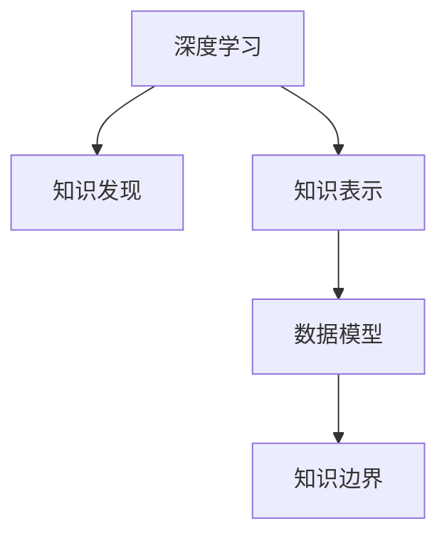

                 

# 人类知识的边界在哪里：无限的探索之旅

## 1. 背景介绍

### 1.1 问题由来
人类知识的边界在哪里？这个问题并非一日之寒，而是自古以来人类不断探索的宏大主题。从古代的哲学、宗教到近现代的科学、技术，人们始终在试图理解和定义知识的极限。然而，伴随着计算机科学的飞速发展，我们终于有机会从数字计算的角度，去探究和重新定义这个古老的问题。

在计算机科学中，知识并非简单的字符串或数字序列，而是存在于数据、算法和模型之中。这些数据和模型，通过算法进行计算，从而得到对真实世界的一种理解和预测。因此，从计算机科学的角度来看，人类知识的边界实际上是由数据和算法共同决定的。

### 1.2 问题核心关键点
当前，随着深度学习和大数据技术的不断成熟，我们已经有能力通过大量数据和复杂算法，从数据中学习和提取知识，甚至在一定程度上超越人类的直觉和经验。但与此同时，计算机模型的局限性也逐渐显现。因此，本文将聚焦于如何通过深度学习和计算机科学，探索和重新定义人类知识的边界。

本文的核心关键点包括：
1. 深度学习与知识发现
2. 知识表示与算法
3. 数据与模型的关系
4. 知识边界与算法优化
5. 未来展望与挑战

这些核心关键点共同构成了我们对人类知识边界进行探索的框架，通过理解这些核心概念，我们可以更好地把握知识与计算机科学之间的关系，并探索未来知识的极限。

## 2. 核心概念与联系

### 2.1 核心概念概述

在探讨人类知识的边界之前，我们首先需要明确几个核心概念：

- **深度学习**：一种基于神经网络的机器学习方法，通过多层非线性变换，从数据中自动学习特征表示，并进行分类、回归等任务。
- **知识发现**：通过分析数据，识别和提取其中的隐含知识，发现规律和模式。
- **知识表示**：将知识以结构化的形式进行编码和表示，以便计算机理解和处理。
- **数据模型**：描述数据及其分布的数学模型，通常包括概率模型、统计模型和神经网络模型。
- **知识边界**：指计算机模型能够从数据中学习和提取知识的极限，包括数据规模、算法复杂度、模型容量等。

这些核心概念之间的逻辑关系可以通过以下Mermaid流程图来展示：



这个流程图展示了几者之间的相互关系：

1. 深度学习从数据中学习知识。
2. 知识发现从数据中提取规律。
3. 知识表示编码知识。
4. 数据模型刻画数据分布。
5. 知识边界限制模型的学习能力。

这些概念共同构成了人类知识边界探索的基础框架，帮助我们从不同维度理解知识的本质。

## 3. 核心算法原理 & 具体操作步骤

### 3.1 算法原理概述

从计算机科学的角度来看，知识边界的探索可以通过深度学习和算法优化两个方面进行。深度学习通过多层神经网络，从数据中自动学习特征表示，而算法优化则通过各种技巧，如正则化、激活函数、损失函数等，提升模型的泛化能力和鲁棒性。

具体来说，深度学习的原理包括以下几个步骤：

1. 数据预处理：对原始数据进行清洗、归一化和标准化，以便于模型学习。
2. 模型选择：选择合适的深度神经网络结构，如卷积神经网络(CNN)、循环神经网络(RNN)、长短期记忆网络(LSTM)等。
3. 模型训练：使用反向传播算法优化模型参数，最小化损失函数，使得模型能够较好地拟合训练数据。
4. 模型评估：在验证集上评估模型性能，避免过拟合。
5. 模型部署：将训练好的模型部署到实际应用中，进行推理预测。

算法优化的目的在于提高模型的泛化能力和鲁棒性，主要包括以下几个方面：

1. 正则化：通过L1正则、L2正则等，防止模型过拟合。
2. 激活函数：如ReLU、Sigmoid、Tanh等，提升非线性表达能力。
3. 损失函数：如交叉熵损失、均方误差损失等，刻画模型预测与真实标签之间的差异。
4. 优化器：如SGD、Adam、Adagrad等，通过不同的梯度更新策略，加快模型收敛。

### 3.2 算法步骤详解

以图像分类任务为例，我们将详细介绍深度学习和算法优化的具体步骤：

#### 数据预处理

首先，我们需要对图像数据进行预处理，以确保数据的质量和一致性。常用的预处理包括：

1. 归一化：将像素值缩放到0到1之间，或使用均值方差归一化，以消除不同图片之间的亮度和对比度差异。
2. 标准化：将像素值减去均值，除以标准差，使得数据服从标准正态分布，便于模型训练。
3. 数据增强：通过旋转、翻转、裁剪等操作，扩充训练集，增强模型的泛化能力。

#### 模型选择

对于图像分类任务，常用的深度神经网络包括卷积神经网络(CNN)和残差网络(ResNet)。CNN通过卷积层和池化层，提取图像的局部特征，并通过全连接层进行分类。ResNet则通过残差连接，解决深层网络训练中的梯度消失问题，提升模型的深度。

#### 模型训练

在模型选择后，我们将使用反向传播算法优化模型参数，最小化交叉熵损失函数。具体步骤如下：

1. 前向传播：将输入图像通过多层神经网络，得到输出概率分布。
2. 计算损失：将输出概率分布与真实标签进行对比，计算交叉熵损失。
3. 反向传播：根据损失函数对模型参数进行梯度更新。
4. 参数更新：使用优化器如Adam，更新模型参数。
5. 周期性评估：在验证集上评估模型性能，避免过拟合。

#### 模型评估

在训练过程中，我们需要定期在验证集上评估模型性能，以防止过拟合。常用的评估指标包括准确率、精确率、召回率等。如果模型在验证集上的表现不佳，可以调整正则化强度、增加训练次数或尝试其他模型结构。

#### 模型部署

在模型训练和评估完成后，我们将模型部署到实际应用中，进行推理预测。常用的部署方式包括：

1. 静态模型部署：将训练好的模型保存为静态模型文件，使用部署工具如TensorFlow Serving、Amazon SageMaker等进行服务化封装。
2. 动态模型部署：使用模型服务框架如Keras Serving、FastAPI等，动态加载和运行模型。
3. 微服务架构：将模型作为微服务的一部分，与其他服务进行集成和协同工作。

### 3.3 算法优缺点

深度学习和算法优化在提高模型性能的同时，也存在一些局限性：

- 深度学习的优点：
  1. 自适应学习能力：能够从数据中自动学习特征表示，无需人工干预。
  2. 高性能：在大型数据集上，深度学习模型的表现通常优于传统机器学习方法。
  3. 泛化能力：通过合理的算法优化，深度学习模型可以泛化到未见过的数据。

- 深度学习的缺点：
  1. 数据需求大：需要大量的标注数据进行训练，成本较高。
  2. 模型复杂度高：深度神经网络结构复杂，容易过拟合。
  3. 计算资源消耗高：需要高性能计算设备，训练和推理速度较慢。

- 算法优化的优点：
  1. 泛化能力强：通过正则化和激活函数等优化技巧，提高模型的泛化能力。
  2. 鲁棒性好：通过损失函数和优化器等技巧，提高模型的鲁棒性。

- 算法优化的缺点：
  1. 模型依赖性强：优化技巧的选择和调整需要依赖经验和实验。
  2. 难以解释：复杂的优化过程难以解释，缺乏可解释性。
  3. 不适用简单问题：对于一些简单问题，算法优化可能过拟合，不如传统机器学习方法。

尽管存在这些局限性，但深度学习和算法优化在数据驱动和计算密集的应用场景中，仍具有强大的竞争力。未来，随着硬件计算能力的提升和算法优化的不断进步，深度学习有望在更多领域取得突破。

### 3.4 算法应用领域

深度学习和算法优化的应用领域非常广泛，以下是几个典型的应用场景：

1. **图像分类与识别**：将输入图像分类为不同的类别，如人脸识别、车辆识别等。深度学习模型如CNN、ResNet等在图像分类和识别任务中表现优异。

2. **自然语言处理**：从文本中提取语义信息，进行情感分析、文本生成、机器翻译等任务。深度学习模型如RNN、Transformer等在自然语言处理任务中表现优异。

3. **语音识别与生成**：将语音信号转换为文本，或将文本转换为语音。深度学习模型如CNN、LSTM等在语音识别和生成任务中表现优异。

4. **推荐系统**：根据用户历史行为和物品属性，推荐用户可能感兴趣的商品。深度学习模型如DNN、协同过滤等在推荐系统任务中表现优异。

5. **医疗诊断**：利用医学图像、电子病历等数据，进行疾病诊断和预测。深度学习模型如卷积神经网络、循环神经网络等在医疗诊断任务中表现优异。

这些应用场景展示了深度学习和算法优化在多个领域中的广泛应用，推动了各个行业的智能化和自动化进程。

## 4. 数学模型和公式 & 详细讲解 & 举例说明

### 4.1 数学模型构建

深度学习模型的数学模型可以表示为：

$$
\hat{y} = M(x;\theta) = g(f_1(f_2(...(f_L(x);\theta_1);\theta_2);\theta_L))
$$

其中，$x$为输入数据，$y$为目标输出，$M$为深度神经网络模型，$L$为层数，$g$为激活函数，$f_i$为第$i$层神经网络，$\theta_i$为第$i$层参数。

### 4.2 公式推导过程

以卷积神经网络(CNN)为例，我们将详细推导其前向传播和反向传播的公式。

前向传播的公式为：

$$
z = \sigma(Wx + b)
$$

其中，$z$为隐藏层输出，$\sigma$为激活函数，$W$为权重矩阵，$b$为偏置向量。

反向传播的公式为：

$$
\Delta L = \frac{\partial L}{\partial M} * \frac{\partial M}{\partial z} * \frac{\partial z}{\partial W} * \frac{\partial W}{\partial \theta}
$$

其中，$\Delta L$为损失函数对模型的梯度，$L$为损失函数，$M$为目标输出，$z$为隐藏层输出，$\theta$为模型参数。

### 4.3 案例分析与讲解

以图像分类任务为例，我们将详细分析深度学习模型的训练和优化过程。

首先，我们需要将原始图像进行预处理，得到标准化的输入数据。然后，我们将数据输入卷积神经网络模型进行前向传播，计算隐藏层输出和损失函数。接着，我们将损失函数对模型参数进行反向传播，计算梯度，并使用优化器如Adam更新模型参数。

在训练过程中，我们需要定期在验证集上评估模型性能，以防止过拟合。如果模型在验证集上的表现不佳，可以调整正则化强度、增加训练次数或尝试其他模型结构。

最后，我们将训练好的模型部署到实际应用中，进行推理预测。常用的部署方式包括静态模型部署和动态模型部署，具体方法在上文已详细说明。

## 5. 项目实践：代码实例和详细解释说明

### 5.1 开发环境搭建

在进行深度学习和算法优化实践前，我们需要准备好开发环境。以下是使用Python进行TensorFlow和Keras开发的环境配置流程：

1. 安装Anaconda：从官网下载并安装Anaconda，用于创建独立的Python环境。

2. 创建并激活虚拟环境：
```bash
conda create -n tf-env python=3.8 
conda activate tf-env
```

3. 安装TensorFlow和Keras：根据CUDA版本，从官网获取对应的安装命令。例如：
```bash
conda install tensorflow==2.6.0
conda install keras
```

4. 安装各类工具包：
```bash
pip install numpy pandas scikit-learn matplotlib tqdm jupyter notebook ipython
```

完成上述步骤后，即可在`tf-env`环境中开始深度学习和算法优化的实践。

### 5.2 源代码详细实现

下面我们以图像分类任务为例，给出使用TensorFlow和Keras对CNN模型进行训练的代码实现。

首先，定义CNN模型的类：

```python
import tensorflow as tf
from tensorflow.keras import layers

class CNNModel(tf.keras.Model):
    def __init__(self, num_classes):
        super(CNNModel, self).__init__()
        self.conv1 = layers.Conv2D(32, 3, activation='relu')
        self.max_pool1 = layers.MaxPooling2D()
        self.conv2 = layers.Conv2D(64, 3, activation='relu')
        self.max_pool2 = layers.MaxPooling2D()
        self.flatten = layers.Flatten()
        self.dense = layers.Dense(128, activation='relu')
        self.dropout = layers.Dropout(0.5)
        self.output = layers.Dense(num_classes, activation='softmax')

    def call(self, x):
        x = self.conv1(x)
        x = self.max_pool1(x)
        x = self.conv2(x)
        x = self.max_pool2(x)
        x = self.flatten(x)
        x = self.dense(x)
        x = self.dropout(x)
        return self.output(x)
```

然后，定义训练和评估函数：

```python
from tensorflow.keras import datasets, optimizers
from tensorflow.keras.utils import to_categorical

def train_epoch(model, dataset, batch_size, optimizer, epochs):
    dataset = dataset.shuffle(1000).batch(batch_size)
    model.compile(optimizer=optimizer, loss='categorical_crossentropy', metrics=['accuracy'])
    model.fit(dataset, epochs=epochs)

def evaluate(model, dataset, batch_size):
    dataset = dataset.batch(batch_size)
    return model.evaluate(dataset)
```

接着，启动训练流程：

```python
(x_train, y_train), (x_test, y_test) = datasets.cifar10.load_data()
x_train = x_train / 255.0
x_test = x_test / 255.0
y_train = to_categorical(y_train)
y_test = to_categorical(y_test)

model = CNNModel(10)
optimizer = optimizers.Adam(learning_rate=0.001)

train_epoch(model, (x_train, y_train), batch_size=32, optimizer=optimizer, epochs=10)
evaluate(model, (x_test, y_test), batch_size=32)
```

以上就是使用TensorFlow和Keras对CNN模型进行图像分类任务训练的完整代码实现。可以看到，得益于TensorFlow和Keras的强大封装，我们可以用相对简洁的代码完成模型的构建和训练。

### 5.3 代码解读与分析

让我们再详细解读一下关键代码的实现细节：

**CNNModel类**：
- `__init__`方法：初始化卷积层、池化层、全连接层等组件。
- `call`方法：定义模型的前向传播过程。

**train_epoch函数**：
- 使用Keras的`compile`方法，定义优化器、损失函数和评估指标。
- 使用`fit`方法，进行模型训练。

**evaluate函数**：
- 使用`evaluate`方法，评估模型性能。

**训练流程**：
- 加载CIFAR-10数据集，并进行归一化处理。
- 定义CNN模型和优化器，开始训练。

可以看到，TensorFlow和Keras的强大封装使得深度学习的实践变得更加简单高效。开发者可以将更多精力放在模型改进和算法优化上，而不必过多关注底层的实现细节。

当然，工业级的系统实现还需考虑更多因素，如模型的保存和部署、超参数的自动搜索、更灵活的任务适配层等。但核心的深度学习实践过程基本与此类似。

## 6. 实际应用场景

### 6.1 智能监控系统

深度学习在智能监控系统中有着广泛应用。传统的监控系统需要大量人工进行图像识别和分析，成本高、效率低。而深度学习模型如CNN，通过训练可以从监控摄像头中自动提取目标特征，进行目标检测和分类。

在实践中，我们可以将监控摄像头拍摄的图像输入CNN模型，得到目标的位置和类别信息。然后将这些信息进行可视化展示，或进行告警处理，从而提升监控系统的智能化水平。

### 6.2 医疗影像诊断

深度学习在医疗影像诊断中也有着重要应用。传统的影像诊断依赖医生手动分析影像，工作量大、效率低。而深度学习模型如卷积神经网络，通过大量影像数据的预训练，可以自动识别影像中的病变区域，进行疾病诊断。

在实践中，我们可以将医疗影像输入预训练的卷积神经网络模型，得到疾病分类的概率分布。然后根据概率分布，输出诊断结果，辅助医生进行诊断决策。

### 6.3 金融风险管理

深度学习在金融风险管理中也发挥着重要作用。传统的风险管理依赖人工进行风险评估和预测，容易受到主观因素的影响。而深度学习模型如长短期记忆网络，通过训练可以自动从历史数据中学习风险特征，进行风险预测和评估。

在实践中，我们可以将历史交易数据输入长短期记忆网络模型，得到未来的风险预测结果。然后根据预测结果，进行风险管理和控制，提升金融系统的安全性。

### 6.4 未来应用展望

随着深度学习和算法优化的不断发展，基于数据驱动的决策将变得更加普遍和智能化。未来，深度学习将在更多领域发挥重要作用，为人类认知智能的进化带来深远影响。

在智慧医疗领域，深度学习可以用于疾病预测、基因分析、影像诊断等，辅助医生进行诊断和治疗。

在智能交通领域，深度学习可以用于交通流量预测、自动驾驶、智能调度等，提升交通系统的效率和安全性。

在智能制造领域，深度学习可以用于设备维护、质量检测、流程优化等，提升生产效率和产品质量。

总之，深度学习和算法优化为人类知识边界的探索提供了新的路径，将推动各个领域的智能化进程，为经济社会发展注入新的动力。

## 7. 工具和资源推荐

### 7.1 学习资源推荐

为了帮助开发者系统掌握深度学习和算法优化的理论基础和实践技巧，这里推荐一些优质的学习资源：

1. 《深度学习》系列书籍：由大牛Yoshua Bengio、Ian Goodfellow和Aaron Courville合著，系统讲解深度学习的原理和应用。

2. CS231n《卷积神经网络和视觉识别》课程：斯坦福大学开设的深度学习课程，讲解CNN等深度学习模型的设计与应用。

3. CS224n《自然语言处理》课程：斯坦福大学开设的NLP课程，讲解RNN、Transformer等深度学习模型的设计与应用。

4. 《TensorFlow实战》书籍：介绍TensorFlow的入门到进阶实战技巧，适合深度学习初学者。

5. 《Keras实战》书籍：介绍Keras的入门到进阶实战技巧，适合深度学习初学者。

通过对这些资源的学习实践，相信你一定能够快速掌握深度学习和算法优化的精髓，并用于解决实际的计算机科学问题。

### 7.2 开发工具推荐

高效的开发离不开优秀的工具支持。以下是几款用于深度学习和算法优化开发的常用工具：

1. TensorFlow：由Google主导开发的深度学习框架，生产部署方便，适合大规模工程应用。

2. Keras：基于TensorFlow等深度学习框架的高级API，易于上手，适合快速迭代研究。

3. PyTorch：由Facebook主导开发的深度学习框架，灵活性高，适合学术研究和原型开发。

4. Jupyter Notebook：免费的Jupyter Notebook环境，支持多种语言和库，适合编写和分享代码。

5. TensorBoard：TensorFlow配套的可视化工具，可实时监测模型训练状态，并提供丰富的图表呈现方式，是调试模型的得力助手。

6. Weights & Biases：模型训练的实验跟踪工具，可以记录和可视化模型训练过程中的各项指标，方便对比和调优。

合理利用这些工具，可以显著提升深度学习和算法优化的开发效率，加快创新迭代的步伐。

### 7.3 相关论文推荐

深度学习和算法优化的发展源于学界的持续研究。以下是几篇奠基性的相关论文，推荐阅读：

1. ImageNet Classification with Deep Convolutional Neural Networks：提出卷积神经网络，解决大规模图像分类问题。

2. A Neural Probabilistic Language Model：提出RNN模型，解决语言建模问题。

3. Neural Architecture Search with Reinforcement Learning：提出自动神经网络架构搜索算法，提升模型设计效率。

4. Attention is All You Need：提出Transformer模型，解决长文本理解和生成问题。

5. Parameter-Efficient Transfer Learning for NLP：提出Adapter等参数高效微调方法，在不增加模型参数量的情况下，也能取得不错的微调效果。

6. Exploring the Limits of Transfer Learning with Self-Supervised Learning：提出自监督学习技术，提升微调效果。

这些论文代表了大深度学习和算法优化的发展脉络。通过学习这些前沿成果，可以帮助研究者把握学科前进方向，激发更多的创新灵感。

## 8. 总结：未来发展趋势与挑战

### 8.1 总结

本文对深度学习和算法优化的原理与实践进行了全面系统的介绍。首先阐述了深度学习和算法优化在人类知识边界探索中的重要意义，明确了两者在提升模型性能和泛化能力方面的独特价值。其次，从原理到实践，详细讲解了深度学习和算法优化的数学模型和算法步骤，给出了深度学习任务开发的完整代码实例。同时，本文还广泛探讨了深度学习和算法优化在智能监控、医疗诊断、金融风险管理等多个领域的应用前景，展示了深度学习技术的巨大潜力。此外，本文精选了深度学习和算法优化的各类学习资源，力求为读者提供全方位的技术指引。

通过本文的系统梳理，可以看到，深度学习和算法优化在数据驱动和计算密集的应用场景中，具有强大的竞争力。这些技术在图像分类、自然语言处理、语音识别、推荐系统等领域已取得显著进展，成为推动各个行业智能化进程的重要力量。未来，随着深度学习和算法优化的不断发展，其在更多领域的应用前景将更加广阔，为人类认知智能的进化带来深远影响。

### 8.2 未来发展趋势

展望未来，深度学习和算法优化将呈现以下几个发展趋势：

1. 模型规模持续增大。随着算力成本的下降和数据规模的扩张，深度学习模型的参数量还将持续增长。超大规模深度学习模型蕴含的丰富数据和知识，有望支撑更加复杂多变的任务。

2. 模型结构多样化。除了卷积神经网络、循环神经网络等经典结构外，未来将涌现更多新的网络结构，如卷积自编码器、生成对抗网络等，提升模型的表达能力和泛化能力。

3. 跨模态融合。未来的深度学习模型将更好地融合视觉、语音、文本等多模态数据，提升模型的多模态理解能力。

4. 自监督学习：摆脱对标注数据的依赖，利用自监督学习范式，通过无监督或半监督学习提升模型性能。

5. 联邦学习：在分布式环境中，通过联邦学习技术，提升模型泛化能力和鲁棒性。

6. 知识引导的深度学习：将知识图谱、规则库等专家知识与深度学习模型结合，提升模型的推理能力和解释能力。

以上趋势凸显了深度学习和算法优化的广阔前景。这些方向的探索发展，必将进一步提升深度学习模型的性能和应用范围，为人类认知智能的进化带来深远影响。

### 8.3 面临的挑战

尽管深度学习和算法优化已经取得了瞩目成就，但在迈向更加智能化、普适化应用的过程中，它仍面临着诸多挑战：

1. 数据需求量大。深度学习模型需要大量的标注数据进行训练，成本较高。对于长尾应用场景，难以获得充足的高质量标注数据。

2. 计算资源消耗高。深度学习模型需要高性能计算设备，训练和推理速度较慢，资源消耗大。

3. 模型复杂度高。深度学习模型结构复杂，容易过拟合。如何提高模型的泛化能力和鲁棒性，仍然是一个重要问题。

4. 可解释性不足。深度学习模型往往被视为"黑盒"系统，难以解释其内部工作机制和决策逻辑。

5. 模型安全性问题。深度学习模型可能学习到有偏见、有害的信息，通过训练传递到下游任务，产生误导性、歧视性的输出。

6. 模型自动化设计。如何设计出高效、普适的深度学习模型，自动化设计方法仍然是一个重要问题。

尽管存在这些挑战，但深度学习和算法优化的发展前景仍然非常广阔。未来，随着深度学习和算法优化的不断进步，这些挑战有望逐步被克服，推动深度学习模型向更高级别的智能系统演进。

### 8.4 研究展望

面对深度学习和算法优化所面临的种种挑战，未来的研究需要在以下几个方面寻求新的突破：

1. 自动化模型设计：通过深度学习自动化模型设计算法，提升模型设计效率和鲁棒性。

2. 多模态融合技术：将视觉、语音、文本等多模态数据进行融合，提升模型的多模态理解和推理能力。

3. 跨领域迁移学习：通过迁移学习技术，将深度学习模型从特定领域迁移到更广泛的领域，提升模型的泛化能力。

4. 知识引导的深度学习：将知识图谱、规则库等专家知识与深度学习模型结合，提升模型的推理能力和解释能力。

5. 自监督学习技术：利用自监督学习范式，通过无监督或半监督学习提升模型性能。

6. 联邦学习技术：在分布式环境中，通过联邦学习技术，提升模型泛化能力和鲁棒性。

这些研究方向将引领深度学习和算法优化的未来发展，推动深度学习模型向更高级别的智能系统演进。只有勇于创新、敢于突破，才能不断拓展深度学习的边界，为人类认知智能的进化带来深远影响。

## 9. 附录：常见问题与解答

**Q1：深度学习是否适用于所有NLP任务？**

A: 深度学习在大多数NLP任务上都能取得不错的效果，特别是对于数据量较大的任务。但对于一些特定领域的任务，如医学、法律等，仅仅依靠通用语料预训练的模型可能难以很好地适应。此时需要在特定领域语料上进一步预训练，再进行微调，才能获得理想效果。此外，对于一些需要时效性、个性化很强的任务，如对话、推荐等，深度学习方法也需要针对性的改进优化。

**Q2：深度学习在落地部署时需要注意哪些问题？**

A: 将深度学习模型转化为实际应用，还需要考虑以下因素：

1. 模型裁剪：去除不必要的层和参数，减小模型尺寸，加快推理速度。

2. 量化加速：将浮点模型转为定点模型，压缩存储空间，提高计算效率。

3. 服务化封装：将模型封装为标准化服务接口，便于集成调用。

4. 弹性伸缩：根据请求流量动态调整资源配置，平衡服务质量和成本。

5. 监控告警：实时采集系统指标，设置异常告警阈值，确保服务稳定性。

6. 安全防护：采用访问鉴权、数据脱敏等措施，保障数据和模型安全。

深度学习模型在实际部署时，还需要考虑以上问题，以确保其在生产环境中的稳定性和可靠性。

---

作者：禅与计算机程序设计艺术 / Zen and the Art of Computer Programming

