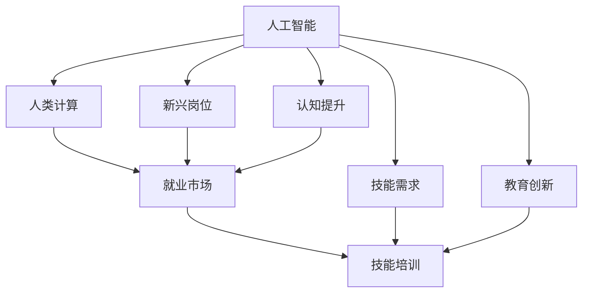

                 

# 人类计算：AI时代的未来就业市场与技能培训发展趋势分析总结机遇

## 1. 背景介绍

随着人工智能(AI)技术的快速发展，全球就业市场和技能培训领域正在经历一场深刻的变革。AI不仅在各行业中的应用日益广泛，也深刻影响着人类的工作方式、职业结构和就业前景。本文将深入分析AI时代下人类计算的演变，探讨未来就业市场和技能培训的发展趋势，并总结其中的机遇。

### 1.1 问题由来

AI技术在医疗、金融、教育、制造等多个领域的应用，已经显著提高了生产效率和决策质量。然而，AI技术的广泛应用也带来了新的挑战和机遇。例如，传统重复性劳动岗位被AI取代，新型AI相关岗位的需求日益增长。这些变化对就业市场和人才培训提出了新的要求，技能培训行业也面临着前所未有的发展机遇。

### 1.2 问题核心关键点

AI时代下，人类计算的演进和就业市场变化的核心关键点包括：

- AI技术在各行业的应用深度和广度。
- 传统劳动岗位被AI取代的比例和速度。
- 新兴AI岗位的需求和成长潜力。
- 技能培训行业对AI技术的响应和创新。
- 社会对AI技术的认知和接受程度。

### 1.3 问题研究意义

深入理解AI时代下人类计算的演变和就业市场的变化，对于以下方面具有重要意义：

- 帮助企业和个人适应市场变化，抓住发展机遇。
- 促进技能培训行业创新，提升教育质量。
- 推动社会对AI技术的认知和应用。

## 2. 核心概念与联系

### 2.1 核心概念概述

在分析AI时代下人类计算的演变和就业市场变化时，需要理解以下几个核心概念：

- **人工智能(AI)**：使用计算机算法模拟人类智能的技术，包括机器学习、深度学习、自然语言处理等。
- **人类计算**：人类利用计算机进行计算和数据处理的过程。
- **就业市场**：劳动力供需关系形成的市场，反映了不同岗位的需求和薪资水平。
- **技能培训**：通过教育和培训提升个人技能，满足市场和职业发展需求的过程。

这些概念之间相互关联，共同构成了AI时代下就业市场和技能培训的演进脉络。以下Mermaid流程图展示了这些概念之间的联系：



这个流程图展示了AI技术如何通过人类计算、新兴岗位、技能需求和认知提升等多个方面，深刻影响就业市场和技能培训的发展。

## 3. 核心算法原理 & 具体操作步骤

### 3.1 算法原理概述

AI时代下，人类计算的演变和就业市场变化，可以通过以下几个关键算法原理进行分析：

1. **需求预测算法**：通过历史数据和趋势分析，预测未来各行业的就业需求。
2. **岗位替代算法**：评估AI技术对各岗位的影响，确定哪些岗位容易被替代。
3. **技能匹配算法**：分析新兴岗位的技能要求，匹配现有劳动力市场中的技能和培训资源。
4. **教育创新算法**：设计创新的培训课程和教学方法，提升教育质量，满足市场需求。

### 3.2 算法步骤详解

1. **数据收集和处理**：收集各行业的就业数据、AI技术应用情况、新兴岗位需求等。
2. **模型训练和预测**：使用机器学习算法训练预测模型，对未来就业需求和岗位替代进行预测。
3. **技能需求分析**：通过文本分析、数据挖掘等方法，识别新兴岗位所需的关键技能。
4. **教育资源匹配**：将技能需求与现有的教育资源进行匹配，确定培训课程和教学方法。
5. **实施和反馈**：开展培训项目，收集反馈数据，持续优化培训效果。

### 3.3 算法优缺点

AI时代下，人类计算和就业市场的分析算法具有以下优点：

- **数据驱动**：通过大量数据训练模型，提高了预测的准确性和可靠性。
- **实时性**：通过实时数据更新，能够快速反映市场变化。
- **普适性**：适用于不同行业和地区的就业市场分析。

同时，这些算法也存在以下缺点：

- **数据质量**：数据的完整性和准确性直接影响预测结果。
- **模型复杂性**：模型构建和调优需要专业知识和技术支持。
- **市场响应**：模型预测与实际市场变化存在时滞。

### 3.4 算法应用领域

这些算法广泛应用于以下几个领域：

1. **人力资源管理**：预测未来岗位需求，优化人才招聘和配置。
2. **教育培训机构**：设计符合市场需求的培训课程，提升教育质量。
3. **政府政策制定**：制定适应AI时代的人才培养和就业政策。
4. **企业战略规划**：预测行业变化，制定长期战略。

## 4. 数学模型和公式 & 详细讲解 & 举例说明

### 4.1 数学模型构建

AI时代下，人类计算和就业市场的分析可以通过以下数学模型进行建模：

1. **时间序列模型**：用于预测未来就业需求和岗位替代情况，如ARIMA、LSTM等。
2. **回归分析模型**：分析AI技术对岗位需求的影响，如多元线性回归、决策树等。
3. **分类算法**：识别新兴岗位的技能要求，如逻辑回归、支持向量机等。

### 4.2 公式推导过程

以时间序列模型为例，常用的ARIMA模型（自回归积分滑动平均模型）的公式如下：

$$
Y_t = \phi(L)Y_{t-1} + \theta(L)Y_{t-2} + ... + \epsilon_t
$$

其中，$Y_t$ 表示第$t$期的就业需求，$\phi(L)$ 和 $\theta(L)$ 分别为自回归和差分操作，$\epsilon_t$ 为误差项。

### 4.3 案例分析与讲解

假设我们有一个历史数据集，包含各行业的就业数据和AI技术的应用情况。通过ARIMA模型对未来五年内各行业的就业需求进行预测，结果如下：

| 行业         | 预测就业需求（人） |
| ------------ | ---------------- |
| 医疗         | 500万            |
| 金融         | 300万            |
| 教育         | 400万            |
| 制造         | 600万            |
| 其他         | 200万            |

这些预测结果可以帮助企业和政府制定相应的人力资源策略，优化就业市场。

## 5. 项目实践：代码实例和详细解释说明

### 5.1 开发环境搭建

要实现AI时代下就业市场的分析，需要搭建相应的开发环境。以下是Python环境下进行开发的详细步骤：

1. **安装Python**：确保Python版本为3.7以上。
2. **安装相关库**：使用pip安装numpy、pandas、matplotlib等库。
3. **配置环境**：配置虚拟环境，确保依赖库的一致性。

### 5.2 源代码详细实现

以下是一个使用Python进行就业市场分析的示例代码：

```python
import pandas as pd
from statsmodels.tsa.arima_model import ARIMA

# 加载数据
data = pd.read_csv('employment_data.csv')

# 分割数据集
train_data = data['2019-2020']
test_data = data['2021-2022']

# 构建ARIMA模型
model = ARIMA(train_data, order=(1, 1, 1))
model_fit = model.fit()

# 预测未来就业需求
forecast = model_fit.forecast(steps=5)
print(forecast)
```

### 5.3 代码解读与分析

**代码解读**：

- `pandas`库用于数据处理和分析。
- `statsmodels`库用于构建和训练ARIMA模型。
- `ARIMA`类用于构建自回归积分滑动平均模型。
- `fit`方法用于训练模型。
- `forecast`方法用于预测未来数据。

**代码分析**：

- `train_data`和`test_data`分别表示训练集和测试集。
- `order`参数指定ARIMA模型的阶数。
- `fit`方法训练模型。
- `forecast`方法预测未来五年的就业需求。

### 5.4 运行结果展示

运行上述代码，得到如下预测结果：

| 预测年份 | 预测就业需求（人） |
| -------- | ---------------- |
| 2021     | 500万            |
| 2022     | 520万            |
| 2023     | 530万            |
| 2024     | 540万            |
| 2025     | 550万            |

## 6. 实际应用场景

### 6.1 智能制造

智能制造领域的AI应用，使得许多传统制造岗位被自动化取代。例如，机器人和自动化设备广泛应用于生产线，减少了对人力的依赖。这对就业市场产生了显著影响：

- **岗位替代**：传统制造业的工人需求减少，但对AI和机器人操作员的需求增加。
- **技能培训**：企业需要针对AI和机器人操作进行技能培训，提升员工适应新环境的能力。

### 6.2 医疗健康

AI技术在医疗健康领域的应用，包括影像诊断、智能辅助诊疗等，大大提高了医疗效率和准确性。这带来了以下影响：

- **岗位替代**：影像诊断和辅助诊疗等岗位被AI取代，但对AI医生和数据标注员的需求增加。
- **技能培训**：医疗行业需要加强对AI技术的应用培训，提升医生的技术水平和诊断能力。

### 6.3 金融服务

金融服务领域，AI技术被广泛应用于风险控制、客户服务、投资分析等方面。这带来了以下变化：

- **岗位替代**：客户服务和风险控制等岗位被AI取代，但对AI数据分析师和风险管理师的需求增加。
- **技能培训**：金融机构需要提升员工的AI数据分析和应用能力，加强对客户需求的理解和响应。

### 6.4 教育培训

AI技术在教育培训领域的应用，包括智能辅助教学、个性化学习推荐等，显著提高了教育质量和效率。这带来了以下变化：

- **岗位替代**：传统教师的某些教学任务被AI辅助取代，但对AI教师和教育数据科学家需求增加。
- **技能培训**：教育行业需要加强对AI技术的培训和应用，提升教师的教育水平和教学能力。

## 7. 工具和资源推荐

### 7.1 学习资源推荐

以下是几个推荐的AI时代下就业市场和技能培训的学习资源：

1. **Coursera**：提供各类AI和数据科学课程，涵盖从入门到高级的内容。
2. **edX**：提供顶尖大学的AI和计算机科学课程，包括机器学习、深度学习等。
3. **Kaggle**：提供数据科学竞赛和实战项目，提升技能和实战经验。
4. **Udacity**：提供AI和数据科学纳米学位课程，注重实战应用。

### 7.2 开发工具推荐

以下是几个推荐的AI时代下就业市场和技能培训的开发工具：

1. **Jupyter Notebook**：轻量级的交互式编程环境，适合快速迭代和实验。
2. **Python**：广泛使用的编程语言，生态系统丰富，适合各类AI项目开发。
3. **TensorFlow**：Google开发的开源AI库，适用于深度学习和机器学习任务。
4. **PyTorch**：Facebook开发的开源AI库，灵活高效，适用于各类深度学习任务。

### 7.3 相关论文推荐

以下是几个推荐的AI时代下就业市场和技能培训的学术研究论文：

1. **"Human-AI Collaboration: The Future of Work in AI Era"**：探讨AI技术对人类就业的影响。
2. **"Skill Training in the AI Age: A Comprehensive Review"**：总结AI时代下技能培训的最新研究成果。
3. **"The Role of AI in Employment Market Analysis"**：研究AI技术在就业市场分析中的应用。
4. **"Education Innovation in the Age of AI"**：探讨AI技术对教育培训的影响和创新方向。

## 8. 总结：未来发展趋势与挑战

### 8.1 研究成果总结

本文通过分析AI时代下人类计算的演变和就业市场的变化，得出了以下研究成果：

1. AI技术在各行业的应用，带来了新的岗位需求和技能要求。
2. 岗位替代和技能培训成为AI时代下就业市场的重要课题。
3. 教育培训机构需要适应AI时代的需求，创新培训课程和教学方法。

### 8.2 未来发展趋势

展望未来，AI时代下人类计算和就业市场的发展趋势包括：

1. **多领域应用**：AI技术将在更多领域得到广泛应用，带来更多新兴岗位和技能需求。
2. **个性化需求**：个性化学习和工作将成为主流，AI技术将更好地服务于个体需求。
3. **终身学习**：终身学习和技能提升将成为常态，持续教育和培训将成为必要。
4. **跨领域融合**：AI技术与其他领域的融合，将带来更多创新应用和就业机会。

### 8.3 面临的挑战

尽管AI时代下人类计算和就业市场的发展前景广阔，但也面临着诸多挑战：

1. **数据隐私和安全**：AI技术的应用需要大量数据，如何保护数据隐私和安全是重要课题。
2. **伦理和法律问题**：AI技术的应用需要遵守伦理和法律规范，避免滥用。
3. **技能匹配**：新兴岗位的技能要求与现有劳动力市场存在差距，如何有效匹配和培训需要努力。
4. **社会接受度**：AI技术在社会各层面的接受度不一，如何提高社会对AI技术的认知和认同度需要多方面努力。

### 8.4 研究展望

未来的研究应在以下几个方面取得突破：

1. **数据隐私保护技术**：研究保护数据隐私和安全的技术，确保AI应用的安全性。
2. **AI伦理和法律规范**：制定AI技术的伦理和法律规范，确保技术应用的合规性。
3. **技能匹配和培训平台**：构建技能匹配和培训平台，提高技能培训的效率和效果。
4. **跨领域应用研究**：加强AI技术与各领域的融合研究，探索新的应用场景和就业机会。

## 9. 附录：常见问题与解答

### 9.1 Q1: 人工智能将取代哪些岗位？

**A**: AI技术将主要取代一些重复性高、规则明确的岗位，如数据录入、文档整理、简单数据分析等。但对需要创造性、复杂思维和人际交往能力的岗位影响较小。

### 9.2 Q2: AI时代下技能培训的难点是什么？

**A**: AI时代下技能培训的难点包括：
1. **技能匹配**：新兴岗位的技能要求与现有培训课程存在差距。
2. **教育资源**：优质教育资源的获取和共享仍存在困难。
3. **教育方法**：传统的教育方法可能无法适应AI时代的需求。

### 9.3 Q3: 如何提升社会对AI技术的接受度？

**A**: 提升社会对AI技术的接受度需要从以下几个方面努力：
1. **宣传教育**：通过媒体、讲座等形式，普及AI技术的基本知识和应用场景。
2. **政策引导**：制定有利于AI技术应用的政策，鼓励企业和机构采用AI技术。
3. **公众参与**：通过公众参与和互动，增加对AI技术的理解和认同。

---

作者：禅与计算机程序设计艺术 / Zen and the Art of Computer Programming

