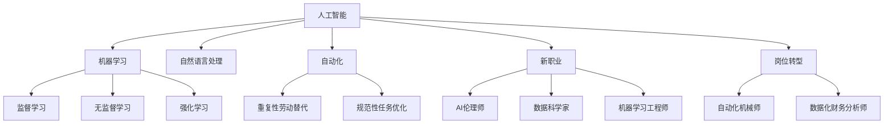

                 

# 人类计算：AI时代的未来就业机会

> 关键词：人工智能,机器学习,未来就业,自动化,岗位转型,技能提升,教育改革,政策支持

## 1. 背景介绍

### 1.1 问题由来
随着人工智能(AI)技术的飞速发展，机器学习、深度学习、自然语言处理等技术的应用越来越广泛，正在深刻改变各行各业的工作方式和就业结构。AI技术的进步不仅提高了生产效率，也推动了新产业、新职业的出现，但同时也带来了传统岗位的消失和技能需求的变化。面对这样的趋势，社会各界对未来就业市场充满了担忧。

### 1.2 问题核心关键点
当前AI时代就业问题主要集中在以下方面：
- **岗位消失与新职业涌现**：自动化和智能化技术替代了部分传统岗位，同时催生了大量新职业。
- **技能需求变化**：AI技术的应用使得某些岗位的技能要求发生变化，如数据科学、算法工程等岗位需求增加，而一些重复性劳动的岗位需求减少。
- **教育和培训体系滞后**：现有的教育和培训体系难以迅速适应AI技术带来的技能需求变化。
- **政策支持不足**：缺乏对AI时代就业市场的系统性研究和政策支持，导致就业市场的适应性不足。

这些关键点共同构成了AI时代就业市场面临的主要挑战，如何有效应对这些挑战，将直接影响社会的稳定和经济发展。

## 2. 核心概念与联系

### 2.1 核心概念概述

为了更好地理解AI时代的就业变化，本节将介绍几个关键概念：

- **人工智能**：一种通过模拟人类智能行为（如学习、推理、感知、语言理解、决策等）的机器系统。
- **机器学习**：一种让计算机通过数据学习并自动改进算法性能的技术，包括监督学习、无监督学习和强化学习等。
- **自然语言处理(NLP)**：使计算机能够理解、处理和生成自然语言的技术。
- **自动化**：指使用技术手段替代人力进行重复性或规范性工作的过程。
- **新职业**：由于AI技术的引入而产生的新兴岗位，如AI伦理师、数据科学家、机器学习工程师等。
- **岗位转型**：传统岗位通过技术升级，转变为对新技能需求较高的岗位，如自动化机械师、数据化财务分析师等。

这些核心概念之间的逻辑关系可以通过以下Mermaid流程图来展示：



这个流程图展示了大语言模型和微调过程的关键概念及其之间的联系：

1. 人工智能通过机器学习和自然语言处理等技术，模拟人类的智能行为。
2. 自动化和智能化技术的应用，替代了部分传统岗位，同时也催生了新的职业需求。
3. 岗位转型过程中，通过技术升级，传统岗位转变为对新技能需求较高的岗位。
4. 新职业的出现和岗位的转型，带来了技能需求的变化，推动了教育和培训体系的改革。

## 3. 核心算法原理 & 具体操作步骤
### 3.1 算法原理概述

AI时代的就业变化，本质上是技术进步对岗位需求的重构。这一过程涉及到从数据采集、模型训练到应用部署的多个环节，涉及到的算法原理包括：

- **监督学习**：通过标注数据训练模型，使其能够对新数据进行预测或分类。
- **无监督学习**：从未标注数据中学习数据的内在结构，发现数据中的模式或异常。
- **强化学习**：通过与环境的互动，学习如何最大化长期奖励，常用于智能控制和游戏。
- **自动化算法**：通过算法优化和过程自动化，减少对人力的依赖。
- **新职业算法**：通过算法和工具的开发，支持新职业的创建和岗位转型的需求。

这些算法共同构成了AI时代就业变化的基础，通过学习和理解这些算法原理，可以帮助我们更好地应对AI技术带来的就业挑战。

### 3.2 算法步骤详解

基于上述算法原理，AI时代就业变化的主要操作步骤包括：

**Step 1: 数据准备与处理**
- 收集并清洗数据集，确保数据的质量和可用性。
- 对数据进行特征提取和预处理，以便于模型训练。

**Step 2: 模型训练与优化**
- 选择合适的算法和模型架构，进行训练和验证。
- 使用交叉验证、网格搜索等方法，对模型进行调优。

**Step 3: 模型部署与应用**
- 将训练好的模型部署到生产环境中，进行持续监控和维护。
- 通过API或SDK等接口，使模型能够被其他系统或应用所调用。

**Step 4: 反馈与迭代**
- 收集模型在实际应用中的反馈数据，评估模型的效果。
- 根据反馈数据，对模型进行迭代优化，提升模型性能。

### 3.3 算法优缺点

AI时代就业变化的算法，具有以下优点：
1. 提高效率：通过自动化和智能化技术，显著提高生产效率，减少人力成本。
2. 提升决策质量：通过数据分析和机器学习，提高决策的准确性和客观性。
3. 推动创新：新职业和岗位转型催生新的技能需求，推动教育和培训体系的改革。

同时，这些算法也存在以下缺点：
1. 技术门槛高：AI技术的实施需要较高的技术水平和专业知识。
2. 数据依赖强：模型的训练和优化高度依赖数据的质量和数量。
3. 就业不稳定：AI技术的应用可能导致部分岗位消失，带来就业不稳定。
4. 伦理风险：AI算法可能存在偏见和不公平，带来伦理和社会风险。

尽管存在这些局限性，但就目前而言，基于AI技术的就业变化算法仍然是推动社会发展的重要手段。未来相关研究的重点在于如何进一步降低技术门槛，提高数据质量，同时兼顾伦理和社会影响。

### 3.4 算法应用领域

基于AI技术的就业变化算法，在多个领域得到了广泛应用，例如：

- **制造业**：自动化生产线、智能仓储、质量控制等。
- **服务业**：客户服务、金融交易、物流配送等。
- **医疗健康**：疾病诊断、健康监测、医疗咨询等。
- **教育培训**：个性化学习、在线教育、智能评估等。
- **农业**：智能灌溉、病虫害监测、农业机械自动化等。
- **政府管理**：数据分析、政策制定、公共服务优化等。

除了上述这些经典领域外，AI技术的应用还将不断拓展到更多场景中，如智慧城市、智能家居、环境保护等，为各行各业带来新的发展机遇。

## 4. 数学模型和公式 & 详细讲解 & 举例说明

### 4.1 数学模型构建

本节将使用数学语言对AI时代就业变化的算法过程进行更加严格的刻画。

假设有一个二分类问题，其中输入为$x$，标签为$y$，模型为$f_{\theta}(x)$。模型训练的目标是最小化损失函数$L(y, f_{\theta}(x))$，其中$\theta$为模型参数。假设训练数据集为$\{(x_i, y_i)\}_{i=1}^N$。

定义模型在数据样本$(x, y)$上的损失函数为$\ell(y, f_{\theta}(x))$，则在数据集$D$上的经验风险为：

$$
\mathcal{L}(\theta) = \frac{1}{N} \sum_{i=1}^N \ell(y_i, f_{\theta}(x_i))
$$

通过梯度下降等优化算法，模型不断更新参数$\theta$，最小化损失函数$\mathcal{L}(\theta)$，直至收敛。

### 4.2 公式推导过程

以下我们以监督学习为例，推导分类问题的损失函数及其梯度的计算公式。

假设模型$f_{\theta}(x)$为逻辑回归模型，输出为模型对正类的预测概率$p_{\theta}(x)$。则分类问题的交叉熵损失函数定义为：

$$
\ell(y, p_{\theta}(x)) = -[y\log p_{\theta}(x) + (1-y)\log(1-p_{\theta}(x))]
$$

将其代入经验风险公式，得：

$$
\mathcal{L}(\theta) = -\frac{1}{N}\sum_{i=1}^N [y_i\log p_{\theta}(x_i)+(1-y_i)\log(1-p_{\theta}(x_i))]
$$

根据链式法则，损失函数对参数$\theta$的梯度为：

$$
\frac{\partial \mathcal{L}(\theta)}{\partial \theta} = -\frac{1}{N}\sum_{i=1}^N [(y_i-p_{\theta}(x_i))x_i]
$$

其中$x_i$为输入特征向量。

在得到损失函数的梯度后，即可带入参数更新公式，完成模型的迭代优化。重复上述过程直至收敛，最终得到适应任务的最优模型参数$\theta^*$。

### 4.3 案例分析与讲解

在实际应用中，上述模型构建和推导公式只是基础。以下是基于监督学习的就业变化算法在不同场景中的案例分析：

**案例1：制造业自动化**
- **背景**：制造业中的许多重复性劳动可以通过机器人自动化完成。
- **算法应用**：监督学习可以用于自动化系统的训练和优化，如机器视觉检测、质量控制等。
- **具体步骤**：
  1. 收集历史生产数据，标注出正常和异常样本。
  2. 使用监督学习算法训练分类模型，判断生产线的运行状态。
  3. 部署模型到生产线中，实时监测并调整生产流程。

**案例2：服务业客户服务**
- **背景**：服务业中的许多客服工作可以通过AI技术自动化完成。
- **算法应用**：自然语言处理和机器学习可以用于智能客服系统的训练和优化，如聊天机器人、智能语音助手等。
- **具体步骤**：
  1. 收集历史客户服务数据，标注出问题和解决方案。
  2. 使用自然语言处理和机器学习算法训练对话模型，处理客户咨询。
  3. 部署模型到客服系统中，提升客户服务效率和质量。

## 5. 项目实践：代码实例和详细解释说明
### 5.1 开发环境搭建

在进行就业变化算法的实践前，我们需要准备好开发环境。以下是使用Python进行TensorFlow开发的环境配置流程：

1. 安装Anaconda：从官网下载并安装Anaconda，用于创建独立的Python环境。

2. 创建并激活虚拟环境：
```bash
conda create -n tf-env python=3.8 
conda activate tf-env
```

3. 安装TensorFlow：根据CUDA版本，从官网获取对应的安装命令。例如：
```bash
conda install tensorflow
```

4. 安装各类工具包：
```bash
pip install numpy pandas scikit-learn matplotlib tqdm jupyter notebook ipython
```

完成上述步骤后，即可在`tf-env`环境中开始就业变化算法的实践。

### 5.2 源代码详细实现

下面我们以制造业自动化为例，给出使用TensorFlow进行监督学习算法开发的PyTorch代码实现。

首先，定义数据处理函数：

```python
import tensorflow as tf
from tensorflow import keras

def data_preprocessing(data, labels):
    # 数据预处理
    # ...
    return processed_data, labels
```

然后，定义模型和优化器：

```python
model = keras.Sequential([
    keras.layers.Dense(64, activation='relu', input_shape=(features_count,)),
    keras.layers.Dense(1, activation='sigmoid')
])

optimizer = keras.optimizers.Adam(learning_rate=0.001)
```

接着，定义训练和评估函数：

```python
def train_model(model, data, labels, epochs=10, batch_size=32):
    model.compile(loss='binary_crossentropy', optimizer=optimizer, metrics=['accuracy'])
    model.fit(data, labels, epochs=epochs, batch_size=batch_size, validation_split=0.2)
    return model

def evaluate_model(model, test_data, test_labels):
    test_loss, test_acc = model.evaluate(test_data, test_labels)
    print('Test accuracy:', test_acc)
```

最后，启动训练流程并在测试集上评估：

```python
# 训练模型
model = train_model(model, train_data, train_labels)

# 在测试集上评估模型
evaluate_model(model, test_data, test_labels)
```

以上就是使用TensorFlow进行制造业自动化算法开发的完整代码实现。可以看到，得益于TensorFlow的强大封装，我们可以用相对简洁的代码完成模型的训练和评估。

### 5.3 代码解读与分析

让我们再详细解读一下关键代码的实现细节：

**data_preprocessing函数**：
- `data`和`labels`分别表示输入数据和标签。
- 在该函数中，对数据进行特征提取、归一化等预处理操作，以便于模型训练。

**Sequential模型**：
- 通过Sequential模型构建神经网络，依次添加输入层、隐藏层和输出层。
- 使用Dense层实现全连接网络，激活函数分别为ReLU和Sigmoid。
- 输入特征数量为`features_count`，输出为二分类问题，使用Sigmoid激活函数。

**Adam优化器**：
- 使用Adam优化器进行模型训练，学习率为0.001。

**train_model函数**：
- 编译模型，指定损失函数和优化器。
- 使用fit函数进行模型训练，指定迭代轮数和批次大小，并在验证集上进行性能评估。

**evaluate_model函数**：
- 使用evaluate函数评估模型在测试集上的性能。
- 输出测试集上的损失和准确率。

**训练流程**：
- 首先训练模型，并在训练集上评估性能。
- 在测试集上评估模型，给出最终评估结果。

可以看到，TensorFlow配合模型封装，使得就业变化算法的代码实现变得简洁高效。开发者可以将更多精力放在数据处理、模型改进等高层逻辑上，而不必过多关注底层的实现细节。

当然，工业级的系统实现还需考虑更多因素，如模型的保存和部署、超参数的自动搜索、更灵活的任务适配层等。但核心的就业变化算法基本与此类似。

## 6. 实际应用场景
### 6.1 制造业自动化

基于AI技术的就业变化算法，可以广泛应用于制造业的自动化生产线。传统制造业往往需要大量人力进行重复性劳动，如装配、检测、包装等。通过自动化算法，这些岗位可以大幅减少人力需求，提高生产效率和质量。

在技术实现上，可以收集历史生产数据，将正常和异常生产状态标注为不同的类别，构建监督学习模型进行训练。训练好的模型可以部署到自动化系统中，实时监测生产线的运行状态，预测并调整生产参数，从而优化生产流程，提高生产效率。

### 6.2 服务业客户服务

AI技术的引入可以显著提升服务业客户服务的效率和质量。传统客服工作往往需要大量人工进行解答和处理，客户满意度难以保证。而通过智能客服系统，AI算法可以自动理解客户咨询，并给出合适的解决方案。

在具体应用中，可以收集历史客服数据，标注出问题和解决方案，构建自然语言处理模型进行训练。训练好的模型可以部署到客服系统中，提升客户服务效率和客户满意度。

### 6.3 医疗健康诊断

AI技术在医疗健康领域的应用越来越广泛，可以通过图像识别、自然语言处理等技术，辅助医生进行疾病诊断和治疗。

在具体应用中，可以收集历史病历数据，标注出正常和异常样本，构建分类模型进行训练。训练好的模型可以部署到医疗系统中，实时监测患者的健康状态，预测并调整治疗方案，从而提升诊疗效果。

### 6.4 未来应用展望

随着AI技术的不断进步，未来就业变化算法将在更多领域得到应用，为各行各业带来变革性影响。

在智慧农业领域，基于AI技术的自动化算法可以用于智能灌溉、病虫害监测、农业机械自动化等，提高农业生产效率和质量。

在教育培训领域，AI算法可以用于个性化学习、在线教育、智能评估等，提升教育效果和教育资源利用率。

在智慧城市治理中，AI算法可以用于城市事件监测、舆情分析、应急指挥等环节，提高城市管理的自动化和智能化水平。

此外，在企业生产、社会治理、文娱传媒等众多领域，基于AI技术的就业变化算法也将不断涌现，为经济社会发展注入新的动力。

## 7. 工具和资源推荐
### 7.1 学习资源推荐

为了帮助开发者系统掌握AI技术及其应用，这里推荐一些优质的学习资源：

1. Coursera《机器学习》课程：由斯坦福大学Andrew Ng教授主讲，系统介绍机器学习的基本概念和算法，涵盖监督学习、无监督学习和强化学习等内容。

2. DeepLearning.AI深度学习专业硕士课程：由AI领域专家授课，涵盖深度学习、NLP、计算机视觉等前沿技术，并通过实战项目提高学习者的动手能力。

3. TensorFlow官方文档：TensorFlow的官方文档，提供详细的API参考和教程，帮助开发者快速上手TensorFlow。

4. Keras官方文档：Keras的官方文档，提供丰富的教程和示例，适合初学者快速上手深度学习模型开发。

5. Google AI博客：Google AI官方博客，提供最新的AI技术进展、研究论文和实践案例，帮助开发者跟踪行业前沿。

通过对这些资源的学习实践，相信你一定能够快速掌握AI技术及其应用，为未来就业市场的挑战做好准备。

### 7.2 开发工具推荐

高效的开发离不开优秀的工具支持。以下是几款用于AI算法开发的常用工具：

1. TensorFlow：由Google主导开发的开源深度学习框架，生产部署方便，适合大规模工程应用。

2. PyTorch：基于Python的开源深度学习框架，灵活动态的计算图，适合快速迭代研究。

3. Keras：高层次的神经网络API，基于TensorFlow或Theano实现，适合初学者快速上手模型开发。

4. Jupyter Notebook：交互式编程环境，支持多种语言和库的混合使用，方便开发者进行实验和分享代码。

5. Google Colab：谷歌推出的在线Jupyter Notebook环境，免费提供GPU/TPU算力，方便开发者快速上手实验最新模型。

合理利用这些工具，可以显著提升AI算法的开发效率，加快创新迭代的步伐。

### 7.3 相关论文推荐

AI算法的发展源于学界的持续研究。以下是几篇奠基性的相关论文，推荐阅读：

1. "Deep Learning"（Goodfellow, Bengio & Courville）：深度学习领域的经典教材，涵盖深度学习的基本概念和算法。

2. "Convolutional Neural Networks for Visual Recognition"（LeCun, SFix & Bottou）：深度学习在计算机视觉领域的经典论文，介绍了卷积神经网络的架构和训练方法。

3. "Attention is All You Need"（Vaswani et al.）：Transformer模型的经典论文，提出了自注意力机制，极大提高了序列建模的效率。

4. "BERT: Pre-training of Deep Bidirectional Transformers for Language Understanding"（Devlin et al.）：BERT模型的经典论文，提出了预训练-微调的训练方法，推动了NLP领域的进步。

5. "AlphaGo Zero: Mastering the Game of Go without Human Knowledge"（Silver et al.）：强化学习领域的经典论文，展示了AlphaGo Zero如何通过自我博弈实现游戏高水平。

这些论文代表了大语言模型微调技术的发展脉络。通过学习这些前沿成果，可以帮助研究者把握学科前进方向，激发更多的创新灵感。

## 8. 总结：未来发展趋势与挑战
### 8.1 总结

本文对AI时代就业变化算法进行了全面系统的介绍。首先阐述了AI技术进步对就业市场带来的影响，明确了就业变化算法在提高效率、优化决策等方面的独特价值。其次，从原理到实践，详细讲解了就业变化算法的数学原理和关键步骤，给出了就业变化算法的完整代码实例。同时，本文还广泛探讨了就业变化算法在制造业、服务业、医疗健康等多个领域的应用前景，展示了就业变化算法的巨大潜力。

通过本文的系统梳理，可以看到，AI技术的应用正在深刻改变各行各业的工作方式和就业结构，带来了许多新的机遇和挑战。AI技术的发展不仅提升了生产效率，还催生了大量新职业和岗位转型需求。这些变化虽然带来了新的挑战，但也为就业市场的灵活性和多样性提供了新的可能性。

### 8.2 未来发展趋势

展望未来，AI时代就业变化算法将呈现以下几个发展趋势：

1. 算法模型日趋复杂。随着深度学习技术的发展，未来的模型将包含更多层和参数，能够处理更加复杂的任务。

2. 应用场景持续拓展。AI技术将不断拓展到更多领域，带来更多新的就业机会和岗位转型需求。

3. 技能需求更加多样化。未来的岗位转型将要求从业者具备更加多样化的技能，如数据分析、编程、算法设计等。

4. 教育培训体系逐步改革。随着AI技术的应用，现有的教育和培训体系将逐步改革，培养出更多适应新职业的人才。

5. 政策支持逐步加强。未来政府和社会将更加重视AI技术对就业市场的影响，出台相关政策支持职业转型和技能提升。

这些趋势凸显了AI技术对就业市场的深远影响。这些方向的探索发展，必将进一步提升AI技术的生产力，推动社会经济的持续进步。

### 8.3 面临的挑战

尽管AI时代就业变化算法已经取得了瞩目成就，但在迈向更加智能化、普适化应用的过程中，它仍面临着诸多挑战：

1. 数据质量问题。AI算法高度依赖数据质量，数据标注成本高、质量差可能导致模型性能下降。

2. 技术门槛较高。AI技术的实施需要较高的技术水平和专业知识，普通从业者难以入门。

3. 就业市场波动。AI技术的应用可能导致部分岗位消失，带来就业市场的不稳定。

4. 伦理和社会风险。AI算法可能存在偏见和不公平，带来伦理和社会风险。

5. 教育培训滞后。现有的教育和培训体系难以适应AI技术带来的技能需求变化。

这些挑战需要各方共同努力，通过技术创新、政策支持、教育改革等多方面协同作用，才能有效应对AI时代就业市场的变化。

### 8.4 研究展望

面对AI时代就业市场面临的挑战，未来的研究需要在以下几个方面寻求新的突破：

1. 提升数据质量。通过自动化标注、半监督学习等技术，降低数据标注成本，提高数据质量。

2. 降低技术门槛。开发更加易用、高效的工具和平台，降低AI技术实施的门槛，提升普及度。

3. 优化岗位转型。通过职业培训和技能提升，帮助从业者适应新职业，提升就业市场的灵活性和多样性。

4. 加强伦理和社会研究。加强AI伦理和社会影响的研究，制定相关政策，确保AI技术的应用符合人类价值观和伦理道德。

这些研究方向的探索，必将引领AI技术迈向更高的台阶，为构建安全、可靠、可解释、可控的智能系统铺平道路。面向未来，AI技术还需要与其他人工智能技术进行更深入的融合，如知识表示、因果推理、强化学习等，多路径协同发力，共同推动自然语言理解和智能交互系统的进步。只有勇于创新、敢于突破，才能不断拓展语言模型的边界，让智能技术更好地造福人类社会。

## 9. 附录：常见问题与解答

**Q1：AI技术将如何影响就业市场？**

A: AI技术的应用将深刻改变就业市场。一方面，通过自动化和智能化技术，AI技术可以替代部分重复性、规范性工作，提升生产效率。另一方面，AI技术也将催生新的职业和岗位需求，如数据分析、算法工程、智能客服等。

**Q2：AI技术实施的门槛高吗？**

A: 确实，AI技术的实施需要较高的技术水平和专业知识。但随着AI工具和平台的不断完善，技术门槛正在逐步降低。如TensorFlow、Keras等框架的易用性、Google Colab等在线实验环境的便捷性，都使得AI技术的实施变得更加简单。

**Q3：AI技术应用带来的就业不稳定问题如何解决？**

A: 通过职业培训和技能提升，帮助从业者适应新职业，是应对AI技术应用带来的就业不稳定问题的重要措施。政府和企业应加强职业培训和再教育，提供更多职业转型支持，帮助劳动者顺利适应就业市场变化。

**Q4：AI技术的伦理和社会影响如何保障？**

A: 确保AI技术的伦理和社会影响，需要多方协同努力。包括制定相关政策、加强技术监管、推动伦理教育等，确保AI技术的应用符合人类价值观和伦理道德。同时，从业者应具备一定的伦理意识，避免AI技术的不良应用。

**Q5：AI技术对各行业的影响有何差异？**

A: AI技术对各行业的影响存在差异。例如，制造业、服务业、医疗健康等行业，AI技术的应用更为广泛和深入，带来的岗位转型和就业变化也更加显著。而一些传统行业，如农业、文化传媒等，AI技术的应用相对较少，影响相对较小。

这些问题的解答，可以帮助我们更全面地理解AI技术对就业市场的影响，为未来就业市场的变革做好准备。

---

作者：禅与计算机程序设计艺术 / Zen and the Art of Computer Programming

