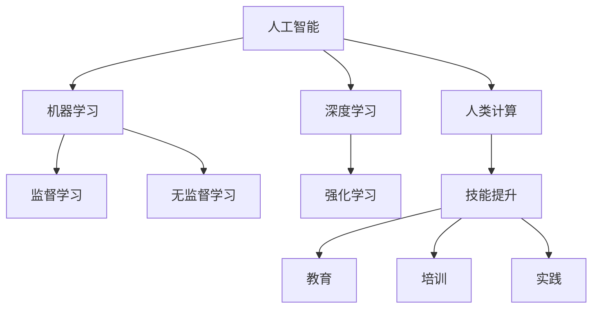

                 

# 人类计算：AI时代的未来技能发展趋势

> 关键词：人类计算,人工智能,未来技能,技能发展趋势,技能提升

## 1. 背景介绍

### 1.1 问题由来

随着人工智能(AI)技术的快速发展，人类计算的重要性正在被重新审视。AI技术，尤其是机器学习和深度学习，正在取代许多传统手工劳动，自动化和智能化的趋势日益明显。但同时，随着AI技术应用范围的拓展，对人类计算能力的需求并未减少，反而有所增加。

人类计算涉及的不仅是传统的计算能力，还包括了对问题理解、决策制定、创意生成、跨学科协作等高阶认知能力的运用。未来，随着AI技术的普及和深化应用，人类计算能力将成为决定AI系统智能化水平的关键因素。

### 1.2 问题核心关键点

目前，AI技术在各行各业的应用已进入深度阶段，但同时也面临着许多新的挑战。AI系统在处理复杂、多变的问题时，往往需要人类的帮助进行问题定义、数据标注、规则制定等。因此，如何提升人类的计算能力，增强其与AI系统的协同效果，成为了一个亟待解决的问题。

未来，人类计算能力的提升，将通过教育、培训、技术和环境的支持等多方面进行：

- **教育**：通过重新定义教育内容和目标，培养适应AI时代的未来人才。
- **培训**：为在职人员提供持续学习和技能提升的机会，使其具备与AI系统合作的能力。
- **技术**：利用AI技术本身来提升人类计算能力，如AI辅助设计、机器学习决策支持等。
- **环境**：构建一个支持人类计算的环境，包括资源共享、数据透明、跨学科协作等。

### 1.3 问题研究意义

提升人类计算能力，对于推动AI技术的发展和应用具有重要意义：

- **增强AI系统效能**：AI系统通过人类计算能力的辅助，可以更好地处理复杂、多变的问题，提高系统的智能化水平。
- **促进跨学科融合**：提升人类跨学科计算能力，有助于打破不同领域之间的界限，推动科技与艺术的深度融合。
- **提升社会竞争力**：通过提升人类的计算能力，可以增强社会的整体创新能力和竞争力，推动经济的发展和社会的进步。
- **改善生活品质**：人类计算能力的提升，将带来更高效、智能化的生活体验，如智能家居、健康医疗、教育服务等。

## 2. 核心概念与联系

### 2.1 核心概念概述

为更好地理解人类计算能力在AI时代的提升和应用，本节将介绍几个密切相关的核心概念：

- **人工智能(AI)**：指能够模拟人类智能行为，执行推理、决策、学习等任务的计算机系统。
- **机器学习(ML)**：指通过数据训练模型，使其能够自动学习并改进性能的一种技术。
- **深度学习(DL)**：一种基于神经网络的机器学习方法，通过多层次的特征提取和抽象，提高模型的泛化能力。
- **人类计算**：指人类利用自身认知能力和计算技能，与AI系统协同解决问题、优化系统性能的过程。
- **技能提升**：指通过教育、培训、实践等多种方式，提升人类在特定领域的计算能力，使其能够与AI系统有效协作。

这些概念之间的逻辑关系可以通过以下Mermaid流程图来展示：



这个流程图展示了大语言模型的核心概念及其之间的关系：

1. 人工智能通过机器学习和深度学习等技术进行模型训练，提高智能推理和决策能力。
2. 人类计算通过提升自身技能，与AI系统协同解决复杂问题，优化系统性能。
3. 技能提升通过教育、培训和实践等多种途径实现，不断提升人类的计算能力。

这些概念共同构成了AI时代的计算框架，使其能够更好地实现人与机的协同创新。

## 3. 核心算法原理 & 具体操作步骤

### 3.1 算法原理概述

人类计算能力的提升，主要通过以下几个关键步骤实现：

1. **问题定义**：准确理解问题的本质，明确问题目标和所需结果。
2. **数据准备**：收集和准备数据，确保数据的质量和多样性。
3. **模型训练**：使用机器学习或深度学习模型进行训练，得到模型参数。
4. **技能提升**：通过教育和培训，提升人类在特定领域的计算能力。
5. **协同优化**：将训练好的模型和提升后的计算能力结合，共同优化AI系统的性能。

### 3.2 算法步骤详解

以下是人类计算能力提升的具体操作步骤：

**Step 1: 问题定义与数据准备**

- **问题定义**：准确理解问题的本质，明确问题目标和所需结果。例如，对于医学影像识别任务，需要明确识别出哪些器官、异常等。
- **数据准备**：收集和准备数据，确保数据的质量和多样性。例如，对于医学影像识别任务，需要准备标注好的影像数据集。

**Step 2: 模型训练**

- **模型选择**：选择适合任务的机器学习或深度学习模型，如卷积神经网络(CNN)、循环神经网络(RNN)、注意力机制模型等。
- **数据分割**：将数据集划分为训练集、验证集和测试集，确保模型在未见过的数据上也有良好的泛化性能。
- **模型训练**：使用训练集数据，通过梯度下降等优化算法，训练模型参数。例如，使用TensorFlow或PyTorch等框架进行模型训练。
- **模型评估**：在验证集和测试集上评估模型性能，调整模型参数，防止过拟合。例如，使用准确率、召回率、F1分数等指标进行评估。

**Step 3: 技能提升**

- **教育培训**：通过在线课程、工作坊、认证考试等形式，提升人类在特定领域的计算能力。例如，使用Coursera、Udacity等平台进行学习。
- **实践经验**：通过实际项目、竞赛、开源贡献等方式，积累实践经验，提高问题解决能力。例如，参与Kaggle竞赛、GitHub开源项目等。

**Step 4: 协同优化**

- **协同工作**：将训练好的模型和提升后的计算能力结合，共同优化AI系统的性能。例如，在医疗影像识别中，AI模型进行图像处理，人类专家进行结果审核。
- **持续改进**：不断收集用户反馈和实际应用中的问题，持续改进模型和计算能力。例如，使用A/B测试等方法评估模型效果。

### 3.3 算法优缺点

人类计算能力提升的主要优点包括：

1. **提高AI系统效能**：人类计算能力的提升，可以更好地辅助AI系统处理复杂问题，提高系统的智能化水平。
2. **促进跨学科融合**：人类计算能力的提升，有助于打破不同学科之间的界限，促进科技与艺术的深度融合。
3. **提升社会竞争力**：通过提升人类的计算能力，可以增强社会的整体创新能力和竞争力，推动经济的发展和社会的进步。
4. **改善生活品质**：人类计算能力的提升，将带来更高效、智能化的生活体验，如智能家居、健康医疗、教育服务等。

但同时也存在以下缺点：

1. **成本较高**：提升人类计算能力需要投入大量的教育资源和培训成本，尤其是在高技能领域。
2. **学习曲线陡峭**：一些高阶计算技能需要长时间的学习和实践才能掌握，对初学者来说学习曲线较陡。
3. **数据依赖**：许多计算技能依赖于数据，缺乏高质量数据时难以提升计算能力。
4. **结果不确定性**：人类计算能力的提升，不一定能完全解决所有问题，结果可能存在不确定性。

### 3.4 算法应用领域

人类计算能力提升在多个领域具有广泛应用，以下是一些典型应用：

- **医疗健康**：人类计算能力在医学影像识别、疾病诊断、健康管理等方面发挥重要作用，提升AI系统的辅助诊断能力。
- **金融科技**：人类计算能力在风险控制、欺诈检测、市场分析等方面发挥重要作用，提升AI系统的决策支持能力。
- **教育培训**：人类计算能力在个性化学习、智能教学、作业批改等方面发挥重要作用，提升教育系统的智能化水平。
- **制造业**：人类计算能力在智能制造、质量控制、供应链管理等方面发挥重要作用，提升制造业的智能化水平。
- **农业科技**：人类计算能力在农情监测、作物管理、智慧农业等方面发挥重要作用，提升农业的智能化水平。

## 4. 数学模型和公式 & 详细讲解 & 举例说明

### 4.1 数学模型构建

人类计算能力提升主要通过数学模型进行量化描述，以下是一个简化的模型构建过程：

设问题为 $P$，训练数据集为 $D$，模型为 $M$，人类计算能力提升后的计算能力为 $H$。模型训练的目标是找到最优的参数 $\theta$，使得模型 $M_{\theta}$ 在数据集 $D$ 上的误差最小化。即：

$$
\theta^* = \mathop{\arg\min}_{\theta} \mathcal{L}(M_{\theta},D)
$$

其中 $\mathcal{L}$ 为损失函数，衡量模型输出与真实标签之间的差异。

### 4.2 公式推导过程

以二分类问题为例，设模型输出为 $y_{pred}$，真实标签为 $y_{true}$，损失函数为交叉熵损失，即：

$$
\mathcal{L}(M_{\theta},D) = -\frac{1}{N}\sum_{i=1}^N \sum_{j=1}^C y_{true}^j \log M_{\theta}(x_i)^j
$$

其中 $N$ 为样本数，$C$ 为类别数，$y_{true}^j$ 表示第 $j$ 类的真实标签，$M_{\theta}(x_i)^j$ 表示输入 $x_i$ 经过模型后，输出 $x_i$ 属于第 $j$ 类的概率。

### 4.3 案例分析与讲解

以医疗影像识别为例，假设模型训练的目标是识别出医学影像中的病灶位置，步骤如下：

1. **问题定义**：明确识别目标，如识别肺结节、乳腺癌等。
2. **数据准备**：收集标注好的医学影像数据集。
3. **模型训练**：选择适合的卷积神经网络(CNN)模型，如ResNet、Inception等，使用交叉熵损失函数进行训练。
4. **技能提升**：通过在线课程、工作坊等形式，提升人类在医学影像识别方面的计算能力。
5. **协同优化**：将训练好的模型和提升后的计算能力结合，共同优化AI系统的性能。例如，在实际应用中，人类专家对AI模型输出的结果进行审核，确保准确性。

## 5. 项目实践：代码实例和详细解释说明

### 5.1 开发环境搭建

在进行人类计算能力提升的实践时，我们需要准备好开发环境。以下是使用Python进行TensorFlow开发的环境配置流程：

1. 安装Anaconda：从官网下载并安装Anaconda，用于创建独立的Python环境。

2. 创建并激活虚拟环境：
```bash
conda create -n tf-env python=3.8 
conda activate tf-env
```

3. 安装TensorFlow：根据CUDA版本，从官网获取对应的安装命令。例如：
```bash
pip install tensorflow==2.6
```

4. 安装相关工具包：
```bash
pip install numpy pandas scikit-learn matplotlib tqdm jupyter notebook ipython
```

完成上述步骤后，即可在`tf-env`环境中开始实践。

### 5.2 源代码详细实现

下面我们以医疗影像识别为例，给出使用TensorFlow进行模型训练的PyTorch代码实现。

首先，定义模型和损失函数：

```python
import tensorflow as tf
from tensorflow.keras import layers

class ConvNet(tf.keras.Model):
    def __init__(self):
        super(ConvNet, self).__init__()
        self.conv1 = layers.Conv2D(32, (3, 3), activation='relu')
        self.pool1 = layers.MaxPooling2D((2, 2))
        self.conv2 = layers.Conv2D(64, (3, 3), activation='relu')
        self.pool2 = layers.MaxPooling2D((2, 2))
        self.flatten = layers.Flatten()
        self.dense1 = layers.Dense(512, activation='relu')
        self.dense2 = layers.Dense(10, activation='softmax')

    def call(self, inputs):
        x = self.conv1(inputs)
        x = self.pool1(x)
        x = self.conv2(x)
        x = self.pool2(x)
        x = self.flatten(x)
        x = self.dense1(x)
        return self.dense2(x)

model = ConvNet()
loss = tf.keras.losses.SparseCategoricalCrossentropy(from_logits=True)
```

然后，定义训练函数：

```python
@tf.function
def train_step(inputs, labels):
    with tf.GradientTape() as tape:
        logits = model(inputs)
        loss_value = loss(labels, logits)
    gradients = tape.gradient(loss_value, model.trainable_variables)
    optimizer.apply_gradients(zip(gradients, model.trainable_variables))
    return loss_value

@tf.function
def train_epoch(model, dataset, batch_size):
    total_loss = 0
    for batch in dataset:
        inputs, labels = batch['images'], batch['labels']
        loss = train_step(inputs, labels)
        total_loss += loss
    return total_loss / len(dataset)

epochs = 10
batch_size = 32

for epoch in range(epochs):
    total_loss = train_epoch(model, train_dataset, batch_size)
    print(f"Epoch {epoch+1}, train loss: {total_loss:.4f}")
```

接下来，定义评估函数：

```python
@tf.function
def evaluate(model, dataset, batch_size):
    total_loss = 0
    correct_predictions = 0
    with tf.GradientTape() as tape:
        for batch in dataset:
            inputs, labels = batch['images'], batch['labels']
            logits = model(inputs)
            loss = loss(labels, logits)
            total_loss += loss
            predictions = tf.argmax(logits, axis=1)
            correct_predictions += tf.reduce_sum(tf.cast(tf.equal(predictions, labels), tf.float32))
    accuracy = correct_predictions / len(dataset)
    return accuracy.numpy()

test_dataset = ...

test_accuracy = evaluate(model, test_dataset, batch_size)
print(f"Test accuracy: {test_accuracy:.4f}")
```

最后，启动训练流程并在测试集上评估：

```python
# 训练模型
model.compile(optimizer=tf.keras.optimizers.Adam(), loss=loss)

# 训练
model.fit(train_dataset, epochs=epochs, batch_size=batch_size)

# 评估模型
test_dataset = ...

test_accuracy = evaluate(model, test_dataset, batch_size)
print(f"Test accuracy: {test_accuracy:.4f}")
```

以上就是使用TensorFlow对医疗影像识别模型进行训练的完整代码实现。可以看到，TensorFlow提供了方便的API和GPU/TPU加速，使得模型训练过程变得简单高效。

### 5.3 代码解读与分析

让我们再详细解读一下关键代码的实现细节：

**ConvNet类**：
- `__init__`方法：初始化卷积、池化、全连接等层，并定义模型结构。
- `call`方法：实现模型前向传播，通过卷积、池化、全连接等操作，最终输出分类结果。

**train_step函数**：
- 在每个训练批次中，先进行前向传播，计算损失。
- 利用梯度下降算法反向传播，更新模型参数。
- 返回当前批次的损失值。

**train_epoch函数**：
- 对整个训练集进行迭代，累积每个批次的损失值。
- 返回平均损失值。

**evaluate函数**：
- 对测试集进行评估，计算模型在测试集上的分类准确率。
- 返回平均准确率。

**训练流程**：
- 定义总训练轮数和批大小。
- 循环迭代训练模型，输出每个epoch的平均损失值。
- 在测试集上评估模型性能，输出分类准确率。

可以看到，TensorFlow框架的强大封装使得模型训练过程变得简洁高效。开发者可以将更多精力放在数据处理、模型改进等高层逻辑上，而不必过多关注底层的实现细节。

当然，工业级的系统实现还需考虑更多因素，如模型的保存和部署、超参数的自动搜索、更灵活的任务适配层等。但核心的训练范式基本与此类似。

## 6. 实际应用场景

### 6.1 智能客服系统

基于人类计算能力的提升，智能客服系统的构建将更加高效和智能化。传统客服往往需要配备大量人力，高峰期响应缓慢，且一致性和专业性难以保证。而使用提升计算能力的人类专家，可以7x24小时不间断服务，快速响应客户咨询，用自然流畅的语言解答各类常见问题。

在技术实现上，可以收集企业内部的历史客服对话记录，将问题和最佳答复构建成监督数据，在此基础上对模型进行微调。微调后的模型能够自动理解用户意图，匹配最合适的答案模板进行回复。对于客户提出的新问题，还可以接入检索系统实时搜索相关内容，动态组织生成回答。如此构建的智能客服系统，能大幅提升客户咨询体验和问题解决效率。

### 6.2 金融舆情监测

金融机构需要实时监测市场舆论动向，以便及时应对负面信息传播，规避金融风险。传统的人工监测方式成本高、效率低，难以应对网络时代海量信息爆发的挑战。基于人类计算能力的提升，金融舆情监测将更加高效和智能。

具体而言，可以收集金融领域相关的新闻、报道、评论等文本数据，并对其进行主题标注和情感标注。在此基础上对模型进行微调，使其能够自动判断文本属于何种主题，情感倾向是正面、中性还是负面。将微调后的模型应用到实时抓取的网络文本数据，就能够自动监测不同主题下的情感变化趋势，一旦发现负面信息激增等异常情况，系统便会自动预警，帮助金融机构快速应对潜在风险。

### 6.3 个性化推荐系统

当前的推荐系统往往只依赖用户的历史行为数据进行物品推荐，无法深入理解用户的真实兴趣偏好。基于人类计算能力的提升，个性化推荐系统可以更好地挖掘用户行为背后的语义信息，从而提供更精准、多样的推荐内容。

在实践中，可以收集用户浏览、点击、评论、分享等行为数据，提取和用户交互的物品标题、描述、标签等文本内容。将文本内容作为模型输入，用户的后续行为（如是否点击、购买等）作为监督信号，在此基础上微调预训练语言模型。微调后的模型能够从文本内容中准确把握用户的兴趣点。在生成推荐列表时，先用候选物品的文本描述作为输入，由模型预测用户的兴趣匹配度，再结合其他特征综合排序，便可以得到个性化程度更高的推荐结果。

### 6.4 未来应用展望

随着人类计算能力的提升，基于AI技术的各种应用场景将更加丰富和高效。未来，人类计算能力提升将带来以下几方面的发展：

1. **智能家居**：提升人类计算能力，可以带来更高效、智能化的家居体验，如语音识别、智能安防、家庭医疗等。
2. **智慧医疗**：通过提升人类计算能力，可以增强医疗影像识别、疾病诊断、健康管理等方面的智能化水平。
3. **智慧城市**：提升人类计算能力，可以带来更高效、智能化的城市治理，如交通管理、环境监测、应急指挥等。
4. **教育培训**：提升人类计算能力，可以带来更个性化、智能化的教育体验，如智能辅导、虚拟实验、个性化推荐等。
5. **文化创意**：提升人类计算能力，可以带来更高效、智能化的文化创意产业，如影视制作、音乐创作、游戏开发等。

这些应用场景的拓展，将进一步提升人类生活质量，推动社会的进步和发展。

## 7. 工具和资源推荐

### 7.1 学习资源推荐

为了帮助开发者系统掌握人类计算能力的提升，这里推荐一些优质的学习资源：

1. **Coursera**：提供多种AI和机器学习课程，涵盖从基础到高级的多个领域，适合不同层次的学习者。
2. **Udacity**：提供数据科学和AI相关的项目式课程，帮助学习者通过实践掌握技能。
3. **Kaggle**：提供大量数据科学和机器学习竞赛，让学习者通过实际项目提升技能。
4. **GitHub**：提供丰富的开源项目，学习者可以贡献代码、参与讨论，提升实际开发能力。
5. **OpenAI**：提供各种AI相关的教程和资源，适合对AI前沿技术感兴趣的开发者。

通过对这些资源的学习实践，相信你一定能够快速掌握人类计算能力的提升，并用于解决实际的AI应用问题。

### 7.2 开发工具推荐

高效的开发离不开优秀的工具支持。以下是几款用于人类计算能力提升的常用工具：

1. **TensorFlow**：由Google主导开发的开源深度学习框架，生产部署方便，适合大规模工程应用。
2. **PyTorch**：基于Python的开源深度学习框架，灵活性高，适合快速迭代研究。
3. **Jupyter Notebook**：一个交互式的笔记本环境，支持多种编程语言，适合进行数据分析和模型训练。
4. **GitHub**：一个代码托管平台，提供丰富的开源项目和社区支持，适合进行项目协作和代码共享。
5. **Kaggle**：一个数据科学竞赛平台，提供丰富的数据集和竞赛机会，适合进行数据处理和模型训练。

合理利用这些工具，可以显著提升人类计算能力提升的开发效率，加快创新迭代的步伐。

### 7.3 相关论文推荐

人类计算能力提升涉及的领域非常广泛，以下几篇经典论文值得深入学习：

1. **"Deep Learning with Human-Computer Interaction for Medical Imaging"**：探讨了人类计算能力在医学影像识别中的应用。
2. **"Enhancing Human-Computer Interaction in AI Systems"**：研究了如何通过提升人类计算能力来增强AI系统的性能。
3. **"The Role of Human-Computer Interaction in AI Education"**：探讨了人类计算能力提升在AI教育中的应用。
4. **"Human-Computer Interaction for Intelligent Recommendation Systems"**：研究了人类计算能力提升在推荐系统中的应用。
5. **"The Future of Human-Computer Interaction in Smart Cities"**：探讨了人类计算能力提升在智慧城市治理中的应用。

这些论文代表了人类计算能力提升的发展脉络，通过学习这些前沿成果，可以帮助研究者把握学科前进方向，激发更多的创新灵感。

## 8. 总结：未来发展趋势与挑战

### 8.1 总结

本文对人类计算能力在AI时代的提升和应用进行了全面系统的介绍。首先阐述了人类计算能力提升的背景和意义，明确了人类计算在AI系统中的重要地位。其次，从原理到实践，详细讲解了人类计算能力提升的数学模型和操作步骤，给出了完整的代码实现。同时，本文还广泛探讨了人类计算能力提升在多个行业领域的应用前景，展示了人类计算能力的广阔应用前景。

通过本文的系统梳理，可以看到，人类计算能力提升在大规模AI应用中扮演着重要角色。这些能力的提升，将使得AI系统更加智能化、人性化，从而推动社会的进步和发展。

### 8.2 未来发展趋势

展望未来，人类计算能力提升将呈现以下几个发展趋势：

1. **教育模式的变革**：未来教育将更加注重培养人类计算能力，通过在线课程、虚拟现实等技术，提升人类的跨学科协作和创新能力。
2. **技能提升的持续化**：人类计算能力提升将更加注重持续学习，通过在线平台、社区交流等方式，实现技能的不断更新和提升。
3. **技术的智能化**：人类计算能力提升将更加注重与AI技术的结合，通过AI辅助设计、机器学习决策支持等方式，提升人类的计算效率和效果。
4. **跨学科的融合**：人类计算能力提升将更加注重跨学科融合，通过科技与艺术的深度结合，推动更多创新应用的出现。
5. **社会的影响**：人类计算能力提升将更加注重社会影响，通过优化医疗、金融、教育等领域的应用，提升人类的生活质量和社会福利。

### 8.3 面临的挑战

尽管人类计算能力提升取得了一定的进展，但在迈向更加智能化、普适化应用的过程中，仍面临以下挑战：

1. **成本问题**：提升人类计算能力需要投入大量的教育资源和培训成本，尤其是在高技能领域。
2. **学习曲线**：一些高阶计算技能需要长时间的学习和实践才能掌握，对初学者来说学习曲线较陡。
3. **数据依赖**：许多计算技能依赖于数据，缺乏高质量数据时难以提升计算能力。
4. **结果不确定性**：人类计算能力的提升，不一定能完全解决所有问题，结果可能存在不确定性。
5. **技术局限**：现有的计算工具和技术可能无法满足一些复杂问题的需求，需要进一步创新。

### 8.4 研究展望

面对人类计算能力提升所面临的挑战，未来的研究需要在以下几个方面寻求新的突破：

1. **无监督学习和半监督学习**：摆脱对大规模标注数据的依赖，利用自监督学习、主动学习等无监督和半监督范式，最大限度利用非结构化数据，实现更加灵活高效的计算提升。
2. **持续学习和适应性**：通过引入持续学习和适应性学习机制，使人类计算能力在实际应用中不断更新和适应新的变化。
3. **跨学科的整合**：将符号化的先验知识，如知识图谱、逻辑规则等，与神经网络模型进行巧妙融合，引导计算过程学习更准确、合理的语言模型。
4. **技术的创新和突破**：开发更加参数高效、计算高效的计算方法，如自适应低秩适应的微调方法，在固定大部分预训练参数的同时，只更新极少量的任务相关参数。
5. **伦理和安全性的考虑**：在模型训练目标中引入伦理导向的评估指标，过滤和惩罚有偏见、有害的输出倾向，确保输出的安全性。

这些研究方向的探索，将引领人类计算能力提升技术迈向更高的台阶，为构建安全、可靠、可解释、可控的智能系统铺平道路。面向未来，人类计算能力提升技术还需要与其他人工智能技术进行更深入的融合，如知识表示、因果推理、强化学习等，多路径协同发力，共同推动自然语言理解和智能交互系统的进步。只有勇于创新、敢于突破，才能不断拓展人类计算能力的边界，让智能技术更好地造福人类社会。

## 9. 附录：常见问题与解答

**Q1：如何衡量人类计算能力的提升？**

A: 人类计算能力的提升可以通过多种方式进行衡量，包括：

1. **模型性能**：通过训练和评估模型，衡量其在特定任务上的表现提升。例如，在医疗影像识别中，可以评估模型的分类准确率、召回率等指标。
2. **用户满意度**：通过用户调查、反馈等方式，衡量人类计算能力提升对用户体验的影响。例如，在智能客服系统中，可以评估用户满意度提升。
3. **生产效率**：通过实际生产数据的对比，衡量人类计算能力提升对生产效率的影响。例如，在金融舆情监测中，可以衡量模型处理舆情数据的效率提升。

**Q2：人类计算能力提升面临的主要挑战有哪些？**

A: 人类计算能力提升面临的主要挑战包括：

1. **成本问题**：提升人类计算能力需要投入大量的教育资源和培训成本，尤其是在高技能领域。
2. **学习曲线**：一些高阶计算技能需要长时间的学习和实践才能掌握，对初学者来说学习曲线较陡。
3. **数据依赖**：许多计算技能依赖于数据，缺乏高质量数据时难以提升计算能力。
4. **结果不确定性**：人类计算能力的提升，不一定能完全解决所有问题，结果可能存在不确定性。
5. **技术局限**：现有的计算工具和技术可能无法满足一些复杂问题的需求，需要进一步创新。

**Q3：人类计算能力提升的未来趋势有哪些？**

A: 人类计算能力提升的未来趋势包括：

1. **教育模式的变革**：未来教育将更加注重培养人类计算能力，通过在线课程、虚拟现实等技术，提升人类的跨学科协作和创新能力。
2. **技能提升的持续化**：人类计算能力提升将更加注重持续学习，通过在线平台、社区交流等方式，实现技能的不断更新和提升。
3. **技术的智能化**：人类计算能力提升将更加注重与AI技术的结合，通过AI辅助设计、机器学习决策支持等方式，提升人类的计算效率和效果。
4. **跨学科的融合**：人类计算能力提升将更加注重跨学科融合，通过科技与艺术的深度结合，推动更多创新应用的出现。
5. **社会的影响**：人类计算能力提升将更加注重社会影响，通过优化医疗、金融、教育等领域的应用，提升人类的生活质量和社会福利。

**Q4：人类计算能力提升在实际应用中有哪些成功案例？**

A: 人类计算能力提升在实际应用中有以下成功案例：

1. **智能客服系统**：通过提升人类计算能力，构建智能客服系统，可以提升客户咨询体验和问题解决效率。
2. **金融舆情监测**：提升人类计算能力，可以实时监测市场舆论动向，规避金融风险。
3. **个性化推荐系统**：通过提升人类计算能力，提供个性化推荐服务，提升用户满意度。
4. **智慧医疗**：通过提升人类计算能力，增强医疗影像识别、疾病诊断、健康管理等方面的智能化水平。
5. **智慧城市**：提升人类计算能力，带来更高效、智能化的城市治理，如交通管理、环境监测、应急指挥等。

**Q5：如何提升人类计算能力？**

A: 提升人类计算能力可以通过以下几种方式：

1. **教育培训**：通过在线课程、工作坊、认证考试等形式，提升人类在特定领域的计算能力。例如，使用Coursera、Udacity等平台进行学习。
2. **实践经验**：通过实际项目、竞赛、开源贡献等方式，积累实践经验，提高问题解决能力。例如，参与Kaggle竞赛、GitHub开源项目等。
3. **技能提升工具**：使用各种技能提升工具，如TensorFlow、PyTorch等，进行模型训练和优化。
4. **跨学科协作**：通过跨学科协作，结合不同领域的知识和技能，提升整体计算能力。

这些方法可以帮助人类在特定领域提升计算能力，从而更好地与AI系统协同工作。

---

作者：禅与计算机程序设计艺术 / Zen and the Art of Computer Programming

