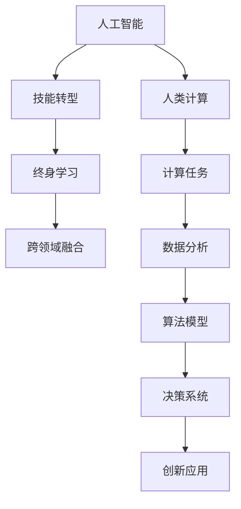

                 

## 1. 背景介绍

随着人工智能（AI）技术的迅猛发展，AI时代正向我们快速走来。这一历史性的变革不仅深刻改变了各行各业的工作方式，也对我们的技能需求产生了深远影响。传统的IT技术技能体系，包括编程语言、算法设计、系统架构等，都面临着巨大的挑战和转型。本文旨在探讨AI时代下，人类计算的发展趋势和未来技能需求，并提出相应的培训发展建议，以助行业和教育界更好地应对这一转变。

## 2. 核心概念与联系

### 2.1 核心概念概述

- **人工智能**：通过计算机模拟人类智能过程的科学与工程领域，主要涵盖机器学习、自然语言处理、计算机视觉、机器人学等多个子领域。
- **人类计算**：指在人工智能的辅助下，人类通过算法、数据和工具，以比传统计算方式更高效、精确的方式解决问题。
- **技能转型**：在AI时代，人类需从依赖重复性劳动，转变为依赖创造性、决策性思维，通过学习新技能以适应新环境。
- **终身学习**：在快速变化的AI技术中，持续学习和技能更新变得尤为重要，以确保技能的有效性和前沿性。
- **跨领域融合**：AI时代，技能需求已不局限于单一领域，而是需要跨学科的整合和应用，形成综合能力。

### 2.2 核心概念原理和架构的 Mermaid 流程图



这个流程图展示了核心概念之间的联系：人工智能的发展推动了人类计算的进步，技能转型是适应这一变化的必要途径，终身学习和跨领域融合则是实现这一转型的关键要素。同时，人类计算通过对计算任务、数据分析、算法模型、决策系统和创新应用的优化，进一步推动人工智能技术的演进。

## 3. 核心算法原理 & 具体操作步骤

### 3.1 算法原理概述

人类计算的核心在于利用AI技术提升计算效率和精度。在AI时代，算法和数据成为推动计算发展的重要驱动力。主要算法原理包括：

- **机器学习算法**：通过训练数据集，使机器能够学习并应用规律，预测未知数据。常用的算法包括决策树、支持向量机、神经网络等。
- **自然语言处理（NLP）算法**：通过语义理解和文本生成，使机器能够理解和生成自然语言。常用的算法包括BERT、GPT等。
- **计算机视觉（CV）算法**：通过图像和视频处理，使机器能够理解和生成视觉信息。常用的算法包括CNN、RNN等。

### 3.2 算法步骤详解

AI时代下的计算任务主要分为数据处理、模型训练、模型评估和应用部署等步骤：

1. **数据处理**：数据采集、清洗、特征提取等，是确保算法精度的基础。
2. **模型训练**：选择合适的算法和模型，通过训练数据集，优化模型参数，得到理想模型。
3. **模型评估**：通过测试数据集，评估模型性能，确保其在新数据上的泛化能力。
4. **应用部署**：将模型部署到生产环境，进行实际应用，收集反馈，不断优化。

### 3.3 算法优缺点

人类计算的优势在于能够利用AI技术快速处理大规模、复杂的数据，并通过迭代优化，不断提高算法精度。然而，这一过程也面临以下挑战：

- **数据质量**：数据采集和处理过程中可能存在噪音和偏差，影响结果准确性。
- **算法复杂性**：高级算法模型的设计、训练和调参复杂，需要专业知识。
- **资源消耗**：大规模数据处理和模型训练需要高性能计算资源。
- **模型解释性**：黑盒模型的预测结果难以解释，影响可信度。
- **模型鲁棒性**：面对新数据或扰动，模型泛化能力可能下降。

### 3.4 算法应用领域

人类计算已广泛应用于医疗、金融、交通、制造、教育等诸多领域，主要应用场景包括：

- **医疗诊断**：利用AI算法分析患者数据，辅助诊断和治疗。
- **金融风控**：通过机器学习预测金融风险，优化投资策略。
- **智能交通**：利用计算机视觉技术，优化交通管理，提升交通安全。
- **制造业自动化**：通过算法优化生产流程，提升生产效率和质量。
- **在线教育**：利用NLP算法分析学习行为，提供个性化教学。

## 4. 数学模型和公式 & 详细讲解 & 举例说明

### 4.1 数学模型构建

在AI时代，常见的数学模型包括回归模型、分类模型、聚类模型等。以线性回归模型为例，其数学表达式为：

$$
y = \beta_0 + \beta_1x_1 + \beta_2x_2 + \cdots + \beta_nx_n + \epsilon
$$

其中，$y$ 为预测值，$x_i$ 为输入特征，$\beta_i$ 为特征系数，$\epsilon$ 为误差项。

### 4.2 公式推导过程

线性回归模型的最小二乘估计公式为：

$$
\beta_j = \frac{\sum_{i=1}^n(x_{ij}\cdot y_i) - \frac{1}{n}\sum_{i=1}^n(x_{ij})\cdot \sum_{i=1}^n(y_i)}{\sum_{i=1}^n(x_{ij})^2 - \frac{1}{n}\left(\sum_{i=1}^n(x_{ij})\right)^2}
$$

其中，$x_{ij}$ 为输入特征与样本的交叉项。

### 4.3 案例分析与讲解

以房价预测为例，输入特征包括房屋面积、楼层、地理位置等，输出为房价。通过训练数据集，最小化误差项 $\epsilon$，得到模型参数 $\beta_j$，进而预测新房的房价。

## 5. 项目实践：代码实例和详细解释说明

### 5.1 开发环境搭建

开发环境搭建需考虑以下步骤：

1. 安装Python 3.7以上版本，安装必要的包如numpy、pandas、scikit-learn等。
2. 安装Jupyter Notebook或PyCharm等IDE，用于编写和运行代码。
3. 安装深度学习框架如TensorFlow、PyTorch等。
4. 安装数据处理工具如Pandas、NumPy等。

### 5.2 源代码详细实现

以下是一个简单的房价预测模型的Python代码实现：

```python
import pandas as pd
import numpy as np
from sklearn.linear_model import LinearRegression
from sklearn.model_selection import train_test_split
from sklearn.metrics import mean_squared_error

# 读取数据
data = pd.read_csv('house_price.csv')

# 处理数据
X = data[['area', 'floor', 'location']]
y = data['price']

# 分割数据集
X_train, X_test, y_train, y_test = train_test_split(X, y, test_size=0.2, random_state=42)

# 训练模型
model = LinearRegression()
model.fit(X_train, y_train)

# 评估模型
y_pred = model.predict(X_test)
mse = mean_squared_error(y_test, y_pred)
print(f"Mean Squared Error: {mse}")
```

### 5.3 代码解读与分析

- 数据处理：通过Pandas读取数据，并使用sklearn库分割数据集。
- 模型训练：使用LinearRegression模型训练数据集，得到预测模型。
- 模型评估：通过预测值和真实值计算均方误差，评估模型效果。

### 5.4 运行结果展示

运行上述代码，输出均方误差值，即可得到模型预测的性能评估。

## 6. 实际应用场景

### 6.1 医疗诊断

AI时代下，AI算法被广泛应用于医疗诊断，辅助医生进行疾病诊断和治疗决策。例如，利用深度学习算法分析医学影像，进行癌症筛查和诊断；利用自然语言处理算法，分析患者病历和医疗记录，提供个性化治疗方案。

### 6.2 金融风控

金融领域，AI算法被用于预测市场波动、评估信用风险、优化投资组合等。例如，通过机器学习算法分析历史交易数据，预测股票价格走势；利用聚类算法，分析客户信用评级，进行风险控制。

### 6.3 智能交通

智能交通系统通过计算机视觉算法，实时监控交通状态，优化交通管理。例如，利用摄像头和传感器采集交通数据，分析交通流量，进行交通信号灯控制；利用深度学习算法，分析交通事故，预测交通拥堵情况。

### 6.4 制造业自动化

AI算法在制造业中用于优化生产流程，提升生产效率和质量。例如，通过机器学习算法，预测设备故障，进行预防性维护；利用计算机视觉算法，检测产品质量，进行自动化质检。

### 6.5 在线教育

AI算法在在线教育中用于个性化教学和智能辅导。例如，利用自然语言处理算法，分析学生学习行为，提供个性化学习建议；利用推荐算法，推荐学习资源，提升学习效果。

## 7. 工具和资源推荐

### 7.1 学习资源推荐

1. Coursera、edX等在线课程平台：提供从入门到高级的AI相关课程，涵盖机器学习、深度学习、自然语言处理等多个方向。
2. GitHub：提供丰富的开源项目和代码库，可用于学习、实践和贡献。
3. Kaggle：提供各种数据集和竞赛平台，可用于数据科学和机器学习的实战练习。
4. Udacity、DataCamp等在线培训平台：提供实战导向的项目课程，帮助学习者掌握实战技能。
5. Stanford、MIT等顶级大学公开课：提供免费的高质量课程资源，深入理解AI原理和应用。

### 7.2 开发工具推荐

1. PyTorch、TensorFlow等深度学习框架：提供强大的计算图支持和丰富的模型库，适用于AI开发和研究。
2. Jupyter Notebook、PyCharm等IDE：提供代码编写和调试工具，支持数据处理和可视化。
3. Git、GitHub等版本控制工具：提供代码管理和版本控制，支持团队协作和代码共享。
4. Scikit-learn、Pandas等数据处理库：提供高效的数据处理和分析工具，支持数据清洗、特征提取等操作。
5. TensorBoard、Weights & Biases等模型训练监控工具：提供实时监控和可视化，帮助调优模型性能。

### 7.3 相关论文推荐

1. Deep Learning: A Textbook – Ian Goodfellow、Yoshua Bengio和Aaron Courville著：全面介绍深度学习原理和应用，是学习AI的必读书籍。
2. Human-Computer Interaction: Basic Interaction Processes – J.J. Garfinkel著：研究人机交互，理解AI时代的计算需求和设计原则。
3. Machine Learning: A Probabilistic Perspective – Kevin P. Murphy著：深入介绍机器学习原理，涵盖监督学习、无监督学习等多个方向。
4. AI Superpowers: China, Silicon Valley, and the New World Order – Kai-Fu Lee著：分析AI技术发展趋势，探讨中美AI竞争的未来。
5. GPT-3: Design, Motivation, and Capabilities – Tom B. Brown等著：介绍GPT-3模型的设计原理和应用能力，是理解AI技术的重要资料。

## 8. 总结：未来发展趋势与挑战

### 8.1 研究成果总结

AI时代下，人类计算已经成为了推动各行业发展的核心驱动力。AI技术在医疗、金融、交通、制造业等领域的广泛应用，展示了其强大的潜力和广泛的应用前景。与此同时，AI技术的发展也带来了新的挑战和机遇，需要全社会共同努力，提升技能，应对变化。

### 8.2 未来发展趋势

未来，AI技术将进一步融合多学科知识，推动智能决策和创新应用。主要发展趋势包括：

1. **跨学科融合**：AI技术将与心理学、社会学、哲学等学科深度融合，推动智能化决策和智能社会建设。
2. **人类计算**：通过AI技术提升人类计算能力，推动人类智慧与机器智慧的协同进化。
3. **智能系统**：智能系统将越来越多地应用于各个行业，提升生产效率和创新能力。
4. **AI伦理**：随着AI技术的广泛应用，AI伦理问题将日益突出，需要加强伦理监管和规范。

### 8.3 面临的挑战

在AI时代，人类计算也面临以下挑战：

1. **数据隐私和安全**：大量数据的采集和处理，可能带来隐私泄露和数据安全问题。
2. **模型偏见和公平性**：AI模型的偏见可能影响公平性，需要加强算法和数据管理。
3. **技能差距**：AI技术快速发展，可能造成技能差距，需要提升全社会的AI技能水平。
4. **伦理问题**：AI技术可能带来伦理和社会问题，需要加强规范和监管。

### 8.4 研究展望

未来的研究需要在以下几个方面寻求新的突破：

1. **跨学科整合**：加强AI技术与其他学科的整合，推动智能系统的全面发展。
2. **人机协同**：研究人机协同计算，提升人类智慧与机器智慧的协同进化。
3. **智能监管**：研究AI伦理和社会问题，推动AI技术的健康发展。
4. **持续学习**：研究终身学习机制，提升全社会的AI技能水平。

## 9. 附录：常见问题与解答

**Q1: 什么是人类计算？**

A: 人类计算是指在人工智能技术的辅助下，通过算法、数据和工具，以比传统计算方式更高效、精确的方式解决问题。

**Q2: AI时代对人类技能有哪些影响？**

A: AI时代对人类技能的影响包括：
- **技能转型**：从依赖重复性劳动，转变为依赖创造性、决策性思维。
- **终身学习**：技能需求不断变化，持续学习成为必要。
- **跨领域融合**：技能需求不再局限于单一领域，需要跨学科整合。

**Q3: 如何提升AI技能？**

A: 提升AI技能可以从以下几个方面入手：
- **在线课程和培训**：参加各类在线课程和培训，掌握AI技术和应用。
- **项目实践**：参与实际项目，提升实战技能。
- **学习和交流**：参加学术会议和行业论坛，交流学习心得和最新进展。
- **阅读文献**：阅读最新的AI论文和书籍，了解前沿技术。

**Q4: 如何应对AI带来的挑战？**

A: 应对AI带来的挑战可以采取以下措施：
- **加强数据管理**：保护数据隐私和安全，避免数据泄露。
- **提升模型公平性**：加强算法和数据管理，避免模型偏见。
- **提升技能水平**：加强教育和培训，提升全社会的AI技能水平。
- **加强规范和监管**：加强伦理监管，推动AI技术的健康发展。

**Q5: 未来AI的发展方向是什么？**

A: 未来AI的发展方向包括：
- **跨学科融合**：AI技术与其他学科的深度融合。
- **人机协同**：提升人类智慧与机器智慧的协同进化。
- **智能系统**：智能系统在各行业的广泛应用。
- **智能监管**：AI技术的健康发展和伦理规范。

作者：禅与计算机程序设计艺术 / Zen and the Art of Computer Programming

