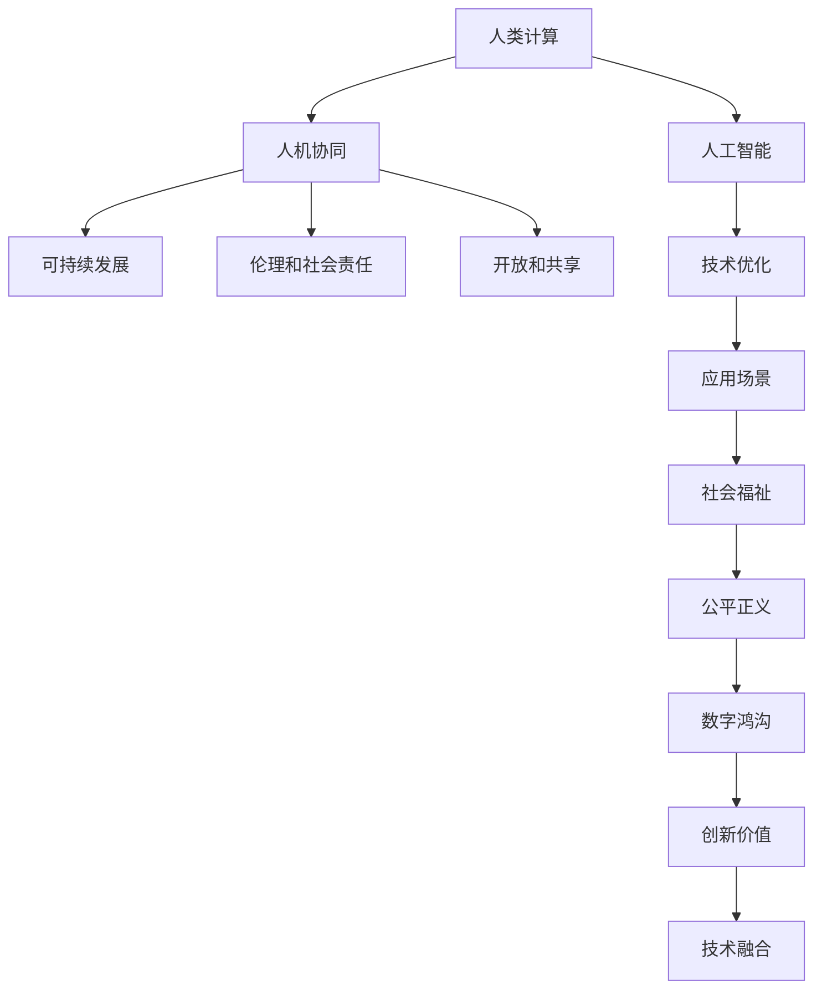

                 

# 人类计算：创造更美好未来的关键

> 关键词：人类计算,人工智能,未来,创新,可持续发展,社会福祉,伦理,技术融合,数据治理,数字公民

## 1. 背景介绍

### 1.1 问题由来

随着数字时代的到来，人类正面临一场前所未有的技术革命。人工智能(AI)作为这场革命的重要推动力量，已经渗透到各行各业，正在重塑人类的生产和生活方式。然而，AI的发展并非一帆风顺，它在带来巨大机遇的同时，也引发了一系列复杂的伦理、社会、经济问题。

在AI领域，人类计算（Human Computing）正成为解决这些问题的关键。人类计算不仅仅是一种技术手段，更是一种以人为本、可持续发展的理念。它强调通过人类与机器的协同合作，实现技术的优化和社会的进步。

### 1.2 问题核心关键点

人类计算的核心在于如何有效地结合人类智慧和机器智能，以创造出更高效、更公平、更和谐的未来。具体来说，包括以下几个关键点：

- **以人为本**：人类计算强调以人的需求和体验为中心，而不是单纯追求技术进步。
- **人机协作**：通过技术手段增强人类的能力和效率，而非取代人类。
- **可持续性**：在推动技术创新的同时，关注环境和社会的影响，实现可持续发展。
- **伦理和社会责任**：确保技术的公平使用，避免数据隐私、算法偏见等问题。
- **开放和共享**：鼓励技术的开放性，促进知识和资源的共享，推动共同创新。

### 1.3 问题研究意义

研究人类计算，对于推动人工智能技术的健康发展，构建更加和谐的社会，具有重要意义：

1. **提升社会福祉**：通过技术的优化，解决诸如医疗、教育、交通等社会问题，提高人类生活质量。
2. **促进公平正义**：确保技术公平使用，避免数字鸿沟，促进社会包容性。
3. **推动可持续发展**：利用技术手段优化资源配置，减少环境负担，实现绿色发展。
4. **强化伦理规范**：建立和完善AI伦理框架，确保技术的伦理性和合法性。
5. **促进跨界合作**：推动科技、经济、文化等多领域的深度融合，实现创新价值的最大化。

## 2. 核心概念与联系

### 2.1 核心概念概述

为更好地理解人类计算的原理和应用，本节将介绍几个核心概念：

- **人类计算**：一种以人为本的技术理念，强调通过技术与人类智慧的结合，实现技术优化和社会进步。
- **人工智能**：通过算法、模型、数据等技术手段，使机器具有类人智能，能够进行自主学习和推理。
- **人机协同**：通过技术手段增强人类的能力，而非替代人类。人机协同是实现人类计算的核心。
- **可持续发展**：在推动技术创新的同时，关注环境和社会影响，实现技术与社会的和谐共生。
- **伦理和社会责任**：确保技术的公平使用，避免数据隐私、算法偏见等问题。
- **开放和共享**：鼓励技术的开放性，促进知识和资源的共享，推动共同创新。

这些核心概念之间的逻辑关系可以通过以下Mermaid流程图来展示：



这个流程图展示了人类计算的核心概念及其之间的关系：

1. 人类计算通过结合人工智能技术，进行技术优化和创新。
2. 通过人机协同增强人类能力，避免技术替代。
3. 关注可持续性，确保技术与社会的和谐共生。
4. 强化伦理和社会责任，确保技术公平使用。
5. 鼓励开放和共享，推动共同创新。

这些概念共同构成了人类计算的理论基础，为实现技术优化和社会进步提供了指导。

## 3. 核心算法原理 & 具体操作步骤
### 3.1 算法原理概述

人类计算的核心在于如何有效地结合人类智慧和机器智能，以创造出更高效、更公平、更和谐的未来。其核心思想是：通过技术与人类智慧的结合，实现技术的优化和社会的进步。

形式化地，假设一个任务 $T$，具有输入 $X$ 和输出 $Y$，定义人类计算的优化目标为：

$$
\min_{\theta} \mathcal{L}(f_\theta(x), y)
$$

其中 $f_\theta(x)$ 表示人类计算模型在输入 $x$ 上的输出，$\mathcal{L}$ 为损失函数，用于衡量模型输出与真实标签 $y$ 之间的差异。

人类计算的优化目标是通过技术与人类智慧的结合，最小化损失函数 $\mathcal{L}$，使得模型输出尽可能接近真实标签。由于人类智慧的多样性和复杂性，优化过程中需要充分利用人类智慧的优点，如直觉、创造力、经验等，以提升模型的效果和适应性。

### 3.2 算法步骤详解

人类计算的优化过程通常包括以下几个关键步骤：

**Step 1: 问题定义与任务分解**
- 明确问题的具体需求和目标，将复杂问题分解为若干子问题。
- 确定需要技术手段解决的问题，如数据采集、模型训练、算法优化等。
- 制定任务的执行计划和时间表，确保项目顺利推进。

**Step 2: 数据收集与处理**
- 收集与问题相关的数据，确保数据的多样性和代表性。
- 对数据进行预处理，如清洗、归一化、特征工程等，确保数据的质量和可用性。
- 对数据进行标注和分类，确定训练集、验证集和测试集。

**Step 3: 技术与人类智慧的结合**
- 选择合适的技术手段，如机器学习、深度学习、自然语言处理等。
- 设计合适的算法和模型，进行模型训练和优化。
- 引入人类智慧，如专家知识、经验、直觉等，进行模型的指导和优化。

**Step 4: 模型评估与优化**
- 在验证集上评估模型的性能，识别模型的优势和不足。
- 根据评估结果，进行模型的调参和优化，如调整超参数、增加正则化等。
- 引入人类反馈，如用户调查、专家评审等，进行模型的进一步优化。

**Step 5: 模型应用与反馈**
- 将优化后的模型应用于实际任务，进行推理和预测。
- 收集用户反馈和实际应用中的数据，进一步优化模型。
- 确保模型在实际应用中具有高可靠性和鲁棒性。

### 3.3 算法优缺点

人类计算具有以下优点：
1. 提升效率：通过技术与人类智慧的结合，实现技术优化，提升工作效率。
2. 增强公平性：确保技术公平使用，避免数据隐私、算法偏见等问题。
3. 促进创新：鼓励技术的开放性，促进知识和资源的共享，推动共同创新。
4. 强化可持续性：在推动技术创新的同时，关注环境和社会影响，实现可持续发展。

同时，该方法也存在一定的局限性：
1. 依赖人类智慧：人类智慧的多样性和复杂性可能带来不确定性，影响模型效果。
2. 技术门槛高：需要技术手段和人类智慧的结合，需要具备较高的专业技能。
3. 数据质量要求高：数据的多样性和代表性对模型效果有重要影响。
4. 模型复杂度高：人类计算涉及多学科、多领域，模型复杂度高，需要系统设计和管理。

尽管存在这些局限性，但就目前而言，人类计算仍是推动人工智能技术健康发展的重要范式。未来相关研究的重点在于如何更好地结合技术与人类智慧，提高模型的效果和适应性，同时兼顾可持续性和伦理责任。

### 3.4 算法应用领域

人类计算的应用领域非常广泛，涵盖了各个行业和领域：

- **医疗健康**：通过技术与人类智慧的结合，实现精准医疗、疾病预测、医疗影像分析等。
- **教育培训**：开发个性化学习系统，提供个性化的教学内容和学习路径，提升教学效果。
- **金融服务**：开发智能投顾、风险管理、反欺诈系统等，提升金融服务的效率和安全性。
- **环境保护**：利用技术与人类智慧的结合，实现环境监测、污染预测、资源管理等。
- **城市管理**：开发智能交通、智能安防、智慧城市管理等，提升城市管理的智能化水平。
- **文化艺术**：开发虚拟现实、增强现实、智能创作等，推动文化艺术的创新和发展。
- **农业农村**：开发智能农机、智能灌溉、精准农业等，提升农业生产效率和可持续性。

这些领域的应用展示了人类计算的广泛前景和巨大潜力。未来，随着技术手段的进步和人类智慧的深入挖掘，人类计算将在更多领域得到应用，为社会的可持续发展注入新的动力。

## 4. 数学模型和公式 & 详细讲解  
### 4.1 数学模型构建

本节将使用数学语言对人类计算的优化过程进行更加严格的刻画。

假设一个任务 $T$，具有输入 $X$ 和输出 $Y$，定义人类计算模型为 $f_\theta(x)$，其中 $\theta$ 为模型的参数。

优化目标为最小化损失函数 $\mathcal{L}(f_\theta(x), y)$，表示模型输出与真实标签之间的差异。

$$
\min_{\theta} \mathcal{L}(f_\theta(x), y)
$$

在实践中，我们通常使用基于梯度的优化算法（如SGD、Adam等）来近似求解上述最优化问题。设 $\eta$ 为学习率，$\lambda$ 为正则化系数，则参数的更新公式为：

$$
\theta \leftarrow \theta - \eta \nabla_{\theta}\mathcal{L}(\theta) - \eta\lambda\theta
$$

其中 $\nabla_{\theta}\mathcal{L}(\theta)$ 为损失函数对参数 $\theta$ 的梯度，可通过反向传播算法高效计算。

### 4.2 公式推导过程

以下我们以医疗健康领域的诊断问题为例，推导人类计算模型的优化公式。

假设输入为患者的症状描述 $x$，输出为疾病的诊断结果 $y$，模型在输入 $x$ 上的输出为 $f_\theta(x)$。优化目标为最小化模型输出与真实标签之间的差异。

$$
\min_{\theta} \mathcal{L}(f_\theta(x), y)
$$

将问题定义和目标函数代入优化过程，得：

$$
\theta \leftarrow \theta - \eta \nabla_{\theta}\mathcal{L}(\theta) - \eta\lambda\theta
$$

在实际应用中，模型的优化需要结合医生的专业知识和经验，进行模型的指导和优化。例如，可以通过医生的反馈调整模型的超参数，进行模型的正则化，或者引入医生的直觉和经验，进行模型的指导和优化。

### 4.3 案例分析与讲解

**案例：智能诊断系统**

开发智能诊断系统是医疗健康领域的一个重要应用。系统通过技术与人类智慧的结合，实现精准诊断，提升医疗服务的质量和效率。

具体而言，可以收集医生的临床经验、病理知识、诊断记录等数据，构建医疗领域的知识图谱，并进行模型的预训练。在实际应用中，系统根据患者的症状描述，通过技术与人类智慧的结合，进行模型的推理和预测。

在模型训练和优化过程中，可以引入医生的反馈和指导，进行模型的进一步优化。例如，通过医生的案例分析，进行模型的调参和优化，提高模型的鲁棒性和准确性。

在模型应用和反馈过程中，可以通过医生的定期评估，进行模型的持续优化和更新，确保模型在实际应用中的高效性和可靠性。

## 5. 项目实践：代码实例和详细解释说明
### 5.1 开发环境搭建

在进行人类计算项目开发前，我们需要准备好开发环境。以下是使用Python进行PyTorch开发的环境配置流程：

1. 安装Anaconda：从官网下载并安装Anaconda，用于创建独立的Python环境。

2. 创建并激活虚拟环境：
```bash
conda create -n human_computing_env python=3.8 
conda activate human_computing_env
```

3. 安装PyTorch：根据CUDA版本，从官网获取对应的安装命令。例如：
```bash
conda install pytorch torchvision torchaudio cudatoolkit=11.1 -c pytorch -c conda-forge
```

4. 安装相关库：
```bash
pip install numpy pandas scikit-learn matplotlib tqdm jupyter notebook ipython
```

完成上述步骤后，即可在`human_computing_env`环境中开始项目实践。

### 5.2 源代码详细实现

下面我们以医疗健康领域的智能诊断系统为例，给出使用PyTorch进行人类计算的PyTorch代码实现。

首先，定义问题相关的数据处理函数：

```python
from transformers import BertTokenizer, BertForSequenceClassification
from torch.utils.data import Dataset
import torch

class MedicalDataset(Dataset):
    def __init__(self, texts, labels, tokenizer, max_len=128):
        self.texts = texts
        self.labels = labels
        self.tokenizer = tokenizer
        self.max_len = max_len
        
    def __len__(self):
        return len(self.texts)
    
    def __getitem__(self, item):
        text = self.texts[item]
        label = self.labels[item]
        
        encoding = self.tokenizer(text, return_tensors='pt', max_length=self.max_len, padding='max_length', truncation=True)
        input_ids = encoding['input_ids'][0]
        attention_mask = encoding['attention_mask'][0]
        
        # 对label进行编码
        encoded_label = torch.tensor(label, dtype=torch.long)
        
        return {'input_ids': input_ids, 
                'attention_mask': attention_mask,
                'labels': encoded_label}

# 加载预训练的BERT模型
model = BertForSequenceClassification.from_pretrained('bert-base-cased', num_labels=10)
```

然后，定义模型和优化器：

```python
from transformers import AdamW

optimizer = AdamW(model.parameters(), lr=2e-5)
```

接着，定义训练和评估函数：

```python
from torch.utils.data import DataLoader
from tqdm import tqdm
from sklearn.metrics import classification_report

device = torch.device('cuda') if torch.cuda.is_available() else torch.device('cpu')
model.to(device)

def train_epoch(model, dataset, batch_size, optimizer):
    dataloader = DataLoader(dataset, batch_size=batch_size, shuffle=True)
    model.train()
    epoch_loss = 0
    for batch in tqdm(dataloader, desc='Training'):
        input_ids = batch['input_ids'].to(device)
        attention_mask = batch['attention_mask'].to(device)
        labels = batch['labels'].to(device)
        model.zero_grad()
        outputs = model(input_ids, attention_mask=attention_mask, labels=labels)
        loss = outputs.loss
        epoch_loss += loss.item()
        loss.backward()
        optimizer.step()
    return epoch_loss / len(dataloader)

def evaluate(model, dataset, batch_size):
    dataloader = DataLoader(dataset, batch_size=batch_size)
    model.eval()
    preds, labels = [], []
    with torch.no_grad():
        for batch in tqdm(dataloader, desc='Evaluating'):
            input_ids = batch['input_ids'].to(device)
            attention_mask = batch['attention_mask'].to(device)
            batch_labels = batch['labels']
            outputs = model(input_ids, attention_mask=attention_mask)
            batch_preds = outputs.logits.argmax(dim=2).to('cpu').tolist()
            batch_labels = batch_labels.to('cpu').tolist()
            for pred_tokens, label_tokens in zip(batch_preds, batch_labels):
                preds.append(pred_tokens[:len(label_tokens)])
                labels.append(label_tokens)
                
    print(classification_report(labels, preds))
```

最后，启动训练流程并在测试集上评估：

```python
epochs = 5
batch_size = 16

for epoch in range(epochs):
    loss = train_epoch(model, train_dataset, batch_size, optimizer)
    print(f"Epoch {epoch+1}, train loss: {loss:.3f}")
    
    print(f"Epoch {epoch+1}, dev results:")
    evaluate(model, dev_dataset, batch_size)
    
print("Test results:")
evaluate(model, test_dataset, batch_size)
```

以上就是使用PyTorch进行人类计算项目的完整代码实现。可以看到，借助Python和PyTorch，人类计算的开发过程变得简洁高效。

### 5.3 代码解读与分析

让我们再详细解读一下关键代码的实现细节：

**MedicalDataset类**：
- `__init__`方法：初始化文本、标签、分词器等关键组件。
- `__len__`方法：返回数据集的样本数量。
- `__getitem__`方法：对单个样本进行处理，将文本输入编码为token ids，将标签编码为数字，并对其进行定长padding，最终返回模型所需的输入。

**BERT模型和AdamW优化器**：
- `BertForSequenceClassification`：用于序列分类任务，如医疗诊断。
- `AdamW`：优化器，支持学习率衰减等高级特性。

**训练和评估函数**：
- 使用PyTorch的DataLoader对数据集进行批次化加载，供模型训练和推理使用。
- 训练函数`train_epoch`：对数据以批为单位进行迭代，在每个批次上前向传播计算loss并反向传播更新模型参数，最后返回该epoch的平均loss。
- 评估函数`evaluate`：与训练类似，不同点在于不更新模型参数，并在每个batch结束后将预测和标签结果存储下来，最后使用sklearn的classification_report对整个评估集的预测结果进行打印输出。

**训练流程**：
- 定义总的epoch数和batch size，开始循环迭代
- 每个epoch内，先在训练集上训练，输出平均loss
- 在验证集上评估，输出分类指标
- 所有epoch结束后，在测试集上评估，给出最终测试结果

可以看到，PyTorch配合Transformer库使得人类计算项目的开发变得简洁高效。开发者可以将更多精力放在问题定义、数据处理等高层逻辑上，而不必过多关注底层的实现细节。

当然，工业级的系统实现还需考虑更多因素，如模型的保存和部署、超参数的自动搜索、更灵活的任务适配层等。但核心的人类计算流程基本与此类似。

## 6. 实际应用场景
### 6.1 智能医疗健康

人类计算在医疗健康领域具有广泛的应用前景。通过技术与人类智慧的结合，可以实现精准医疗、疾病预测、医疗影像分析等。

具体而言，可以收集医生的临床经验、病理知识、诊断记录等数据，构建医疗领域的知识图谱，并进行模型的预训练。在实际应用中，系统根据患者的症状描述，通过技术与人类智慧的结合，进行模型的推理和预测。

在模型训练和优化过程中，可以引入医生的反馈和指导，进行模型的进一步优化。例如，通过医生的案例分析，进行模型的调参和优化，提高模型的鲁棒性和准确性。

在模型应用和反馈过程中，可以通过医生的定期评估，进行模型的持续优化和更新，确保模型在实际应用中的高效性和可靠性。

### 6.2 教育培训

在教育培训领域，人类计算可以通过技术与人类智慧的结合，实现个性化学习、智能辅导、自动评估等。

具体而言，可以收集学生的学习行为、测试成绩、兴趣爱好等数据，构建学生模型和课程模型，并进行模型的预训练。在实际应用中，系统根据学生的学习情况，通过技术与人类智慧的结合，进行模型的推理和预测。

在模型训练和优化过程中，可以引入教师的反馈和指导，进行模型的进一步优化。例如，通过教师的案例分析，进行模型的调参和优化，提高模型的鲁棒性和准确性。

在模型应用和反馈过程中，可以通过教师的定期评估，进行模型的持续优化和更新，确保模型在实际应用中的高效性和可靠性。

### 6.3 金融服务

在金融服务领域，人类计算可以通过技术与人类智慧的结合，实现智能投顾、风险管理、反欺诈等。

具体而言，可以收集金融市场的历史数据、专家分析、用户行为等数据，构建金融领域的知识图谱，并进行模型的预训练。在实际应用中，系统根据用户的投资需求和行为，通过技术与人类智慧的结合，进行模型的推理和预测。

在模型训练和优化过程中，可以引入金融专家的反馈和指导，进行模型的进一步优化。例如，通过金融专家的案例分析，进行模型的调参和优化，提高模型的鲁棒性和准确性。

在模型应用和反馈过程中，可以通过金融专家的定期评估，进行模型的持续优化和更新，确保模型在实际应用中的高效性和可靠性。

### 6.4 环境保护

在环境保护领域，人类计算可以通过技术与人类智慧的结合，实现环境监测、污染预测、资源管理等。

具体而言，可以收集环境监测数据、专家分析、用户反馈等数据，构建环境领域的知识图谱，并进行模型的预训练。在实际应用中，系统根据环境监测数据，通过技术与人类智慧的结合，进行模型的推理和预测。

在模型训练和优化过程中，可以引入环境专家的反馈和指导，进行模型的进一步优化。例如，通过环境专家的案例分析，进行模型的调参和优化，提高模型的鲁棒性和准确性。

在模型应用和反馈过程中，可以通过环境专家的定期评估，进行模型的持续优化和更新，确保模型在实际应用中的高效性和可靠性。

### 6.5 未来应用展望

随着技术的不断发展，人类计算将在更多领域得到应用，为社会的可持续发展注入新的动力。

在智慧医疗领域，人类计算可以实现精准医疗、疾病预测、医疗影像分析等，提升医疗服务的质量和效率。

在教育培训领域，人类计算可以实现个性化学习、智能辅导、自动评估等，提升教学效果和学习体验。

在金融服务领域，人类计算可以实现智能投顾、风险管理、反欺诈等，提升金融服务的效率和安全性。

在环境保护领域，人类计算可以实现环境监测、污染预测、资源管理等，提升环境保护的智能化水平。

此外，在智慧城市治理、文化艺术、农业农村等众多领域，人类计算的应用也将不断涌现，为经济社会发展注入新的动力。未来，随着技术的日益成熟，人类计算必将在构建人机协同的智能时代中扮演越来越重要的角色。

## 7. 工具和资源推荐
### 7.1 学习资源推荐

为了帮助开发者系统掌握人类计算的理论基础和实践技巧，这里推荐一些优质的学习资源：

1. 《Human Computing in the Age of AI》书籍：系统介绍了人类计算的基本概念、理论基础和应用案例，适合入门学习。

2. 《Human-AI Collaboration》课程：斯坦福大学开设的AI与人类智慧协作课程，涵盖多领域的实践案例，适合进阶学习。

3. 《Human Computing: Theory and Practice》论文集：汇集了多领域的人类计算研究成果，提供丰富的学习资源。

4. Human-AI Interaction Society：致力于人类与AI的融合研究，提供丰富的学习资源和实践机会。

5. IEEE Transactions on Human-AI Interaction：学术期刊，发表人类计算领域的最新研究成果，提供前沿技术动态。

通过对这些资源的学习实践，相信你一定能够快速掌握人类计算的精髓，并用于解决实际的AI问题。
###  7.2 开发工具推荐

高效的开发离不开优秀的工具支持。以下是几款用于人类计算开发的常用工具：

1. Python：广泛使用的编程语言，具有强大的数据处理和科学计算能力，适合人类计算的开发。

2. PyTorch：基于Python的开源深度学习框架，灵活动态的计算图，适合快速迭代研究。

3. TensorFlow：由Google主导开发的开源深度学习框架，生产部署方便，适合大规模工程应用。

4. HuggingFace Transformers库：提供丰富的预训练语言模型和任务适配层，方便人类计算的开发。

5. Weights & Biases：模型训练的实验跟踪工具，可以记录和可视化模型训练过程中的各项指标，方便对比和调优。

6. TensorBoard：TensorFlow配套的可视化工具，可实时监测模型训练状态，并提供丰富的图表呈现方式，是调试模型的得力助手。

7. Scikit-learn：常用的机器学习库，提供丰富的数据预处理和模型训练功能，适合人类计算的开发。

合理利用这些工具，可以显著提升人类计算项目的开发效率，加快创新迭代的步伐。

### 7.3 相关论文推荐

人类计算的发展源于学界的持续研究。以下是几篇奠基性的相关论文，推荐阅读：

1. "Human-AI Collaboration: Towards a New Era of Computing"：探讨了人类与AI的协作模式，提出了人类计算的基本框架。

2. "Human Computing: Theory and Practice"：总结了人类计算的理论基础和应用案例，提供了系统的理论指导。

3. "Human-AI Interaction"：讨论了人类与AI的交互方式，提供了丰富的实践经验。

4. "Human-AI Collaboration in Healthcare"：研究了人类计算在医疗健康领域的应用，提供了实际案例和效果评估。

5. "Human-AI Collaboration in Education"：研究了人类计算在教育培训领域的应用，提供了实际案例和效果评估。

6. "Human-AI Collaboration in Financial Services"：研究了人类计算在金融服务领域的应用，提供了实际案例和效果评估。

这些论文代表了大语言模型微调技术的发展脉络。通过学习这些前沿成果，可以帮助研究者把握学科前进方向，激发更多的创新灵感。

## 8. 总结：未来发展趋势与挑战

### 8.1 总结

本文对人类计算的基本概念和应用场景进行了全面系统的介绍。首先阐述了人类计算的原理和应用背景，明确了人类计算在推动技术优化和社会进步中的重要价值。其次，从原理到实践，详细讲解了人类计算的数学模型和关键步骤，给出了人类计算项目开发的完整代码实例。同时，本文还探讨了人类计算在医疗健康、教育培训、金融服务、环境保护等领域的广泛应用，展示了人类计算的巨大潜力。

通过本文的系统梳理，可以看到，人类计算通过技术与人类智慧的结合，能够实现技术的优化和社会进步，具有广阔的应用前景。未来，随着技术的不断进步和人类智慧的深入挖掘，人类计算必将在更多领域得到应用，为社会的可持续发展注入新的动力。

### 8.2 未来发展趋势

展望未来，人类计算将呈现以下几个发展趋势：

1. **技术与人类智慧的深度融合**：通过更加紧密的技术与人类智慧的结合，实现更加高效、公平、可靠的技术系统。

2. **跨学科和跨领域的应用**：人类计算将在更多领域得到应用，推动技术创新和社会进步。

3. **可持续发展的理念**：在推动技术创新的同时，关注环境和社会影响，实现技术与社会的和谐共生。

4. **伦理和社会责任的强化**：确保技术的公平使用，避免数据隐私、算法偏见等问题，增强社会信任和接受度。

5. **开放和共享的文化**：鼓励技术的开放性，促进知识和资源的共享，推动共同创新。

6. **技术的普及和应用**：通过技术的普及和应用，提升社会福祉，实现人人享有技术的成果。

以上趋势凸显了人类计算的重要价值和发展方向。这些方向的探索发展，必将进一步推动技术的创新和社会进步，实现技术与社会的和谐共生。

### 8.3 面临的挑战

尽管人类计算具有广阔的应用前景，但在迈向更加智能化、普适化应用的过程中，仍面临诸多挑战：

1. **技术门槛高**：人类计算涉及多学科、多领域的知识，需要具备较高的专业技能。

2. **数据质量要求高**：数据的多样性和代表性对模型效果有重要影响，数据质量不高可能影响模型效果。

3. **伦理和社会责任**：确保技术的公平使用，避免数据隐私、算法偏见等问题，增强社会信任和接受度。

4. **资源和成本高**：大规模数据的收集、处理和存储需要大量的资源和成本。

5. **模型的复杂度高**：人类计算涉及多学科、多领域，模型复杂度高，需要系统设计和管理。

尽管存在这些挑战，但通过技术手段的不断进步和人类智慧的深入挖掘，人类计算的潜力将逐步释放，为社会的可持续发展注入新的动力。

### 8.4 研究展望

未来的研究需要在以下几个方面寻求新的突破：

1. **多学科和多领域的深度融合**：推动技术与人类智慧的深度结合，提升模型效果和社会效益。

2. **数据质量提升**：提升数据的多样性和代表性，确保模型的公平性和鲁棒性。

3. **伦理和社会责任的强化**：建立和完善AI伦理框架，确保技术的公平使用，增强社会信任和接受度。

4. **技术的普及和应用**：推动技术的普及和应用，提升社会福祉，实现人人享有技术的成果。

5. **跨学科和跨领域的研究**：加强跨学科和跨领域的研究，推动技术的创新和社会进步。

这些方向的研究将推动人类计算技术的发展，实现技术与社会的和谐共生，为构建更加美好的人类未来奠定基础。

## 9. 附录：常见问题与解答

**Q1：人类计算与人工智能的关系是什么？**

A: 人类计算是人工智能的一种形式，强调技术与人类智慧的结合，实现技术的优化和社会的进步。人类计算与人工智能的关系是相辅相成的，人工智能为人类计算提供了技术手段，而人类计算则为人机协同提供了指导和优化。

**Q2：人类计算在实际应用中需要注意哪些问题？**

A: 人类计算在实际应用中需要注意以下问题：
1. 数据质量：数据的多样性和代表性对模型效果有重要影响。
2. 技术与人类智慧的结合：确保技术手段的有效性和适用性。
3. 伦理和社会责任：确保技术的公平使用，避免数据隐私、算法偏见等问题。
4. 技术的普及和应用：推动技术的普及和应用，提升社会福祉。

**Q3：人类计算未来的发展方向是什么？**

A: 人类计算未来的发展方向主要包括以下几个方面：
1. 技术与人类智慧的深度融合。
2. 跨学科和多领域的应用。
3. 可持续发展的理念。
4. 伦理和社会责任的强化。
5. 开放和共享的文化。
6. 技术的普及和应用。

这些方向的研究将推动人类计算技术的发展，实现技术与社会的和谐共生。

**Q4：人类计算与传统人工智能的区别是什么？**

A: 人类计算与传统人工智能的区别在于：
1. 以人为本：人类计算强调以人的需求和体验为中心，而不是单纯追求技术进步。
2. 人机协作：人类计算通过技术与人类智慧的结合，实现技术的优化和社会的进步，而传统人工智能更多依赖算法和数据。
3. 伦理和社会责任：人类计算强调技术的公平使用，避免数据隐私、算法偏见等问题，而传统人工智能可能面临伦理和社会责任问题。

总之，人类计算与传统人工智能在理念和目标上有显著区别，更加强调技术与人类智慧的结合，实现技术与社会的和谐共生。

---

作者：禅与计算机程序设计艺术 / Zen and the Art of Computer Programming

