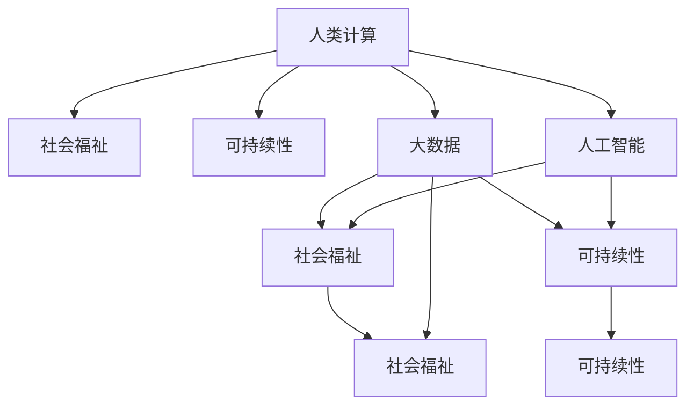

                 

# 人类计算：增强社会福祉和可持续性

> 关键词：人类计算,社会福祉,可持续性,大数据,人工智能,计算伦理学

## 1. 背景介绍

### 1.1 问题由来
在当今数字化和智能化的时代，计算能力已经成为了推动社会发展和个人福祉的关键驱动力。然而，随着技术的不断进步，人们越来越关注计算的伦理和社会影响。如何在大数据和人工智能的背景下，有效利用计算资源，促进社会福祉和可持续发展，成为了一个亟待解决的问题。

### 1.2 问题核心关键点
本文聚焦于如何在计算技术的支持下，实现对社会福祉和可持续发展的积极影响。通过研究计算技术对社会福祉的影响，探讨计算伦理和社会责任，以及如何在计算过程中平衡技术进步与伦理道德的讨论，我们希望能够为构建一个更加公平、可持续的计算环境提供理论指导和实践建议。

## 2. 核心概念与联系

### 2.1 核心概念概述
- **人类计算(Human Computing)**：利用计算资源和算法，提升人类决策、理解和交互能力的过程。人类计算不仅仅是计算任务的自动化，更是通过计算技术增强人类智慧的过程。
- **社会福祉(Social Well-being)**：指个体和社会的幸福状态，包括健康、教育、就业、环境等方面。社会福祉是衡量一个社会进步的重要指标。
- **可持续性(Sustainability)**：指在满足当代人的需求的同时，不损害后代人满足其需求的能力的发展模式。可持续性涉及经济、环境和社会三个维度。
- **大数据(Big Data)**：指规模巨大、复杂多样、高速动态的数据集，具有量级大、种类多、速度快、价值高的特点。大数据技术为社会福祉和可持续发展提供了重要数据支撑。
- **人工智能(AI)**：通过计算机算法模拟人类智能，包括学习、推理、决策等能力。人工智能在社会福祉和可持续性中发挥了重要作用。
- **计算伦理学(Computational Ethics)**：研究如何在使用计算技术时，保护个体权益、尊重社会伦理，以及避免技术滥用。

这些概念之间存在紧密的联系：

- **人类计算**为**社会福祉**和**可持续性**提供了技术支持，通过优化决策过程、提升信息获取能力，促进社会进步和环境保护。
- **大数据**和**人工智能**为**人类计算**提供了数据和算法基础，使得复杂的社会问题能够被分析和解决。
- **计算伦理学**确保**人类计算**和**大数据**在应用过程中，不侵犯个体权益，不损害社会利益，促进公正公平。

### 2.2 核心概念原理和架构的 Mermaid 流程图



这个流程图展示了人类计算、社会福祉、可持续性、大数据和人工智能之间的关系：

- 人类计算利用大数据和人工智能技术，提升社会福祉和可持续性。
- 大数据和人工智能为人类计算提供了数据和算法基础，使得计算能力更加强大。
- 社会福祉和可持续性是计算技术应用的目标和评价指标。

## 3. 核心算法原理 & 具体操作步骤

### 3.1 算法原理概述
基于人类计算的算法原理，旨在通过计算技术提升个体和社会的福祉，同时确保计算过程的可持续性。这包括但不限于以下几个方面：

- **数据采集与处理**：通过大数据技术采集社会相关数据，并使用算法进行清洗、分析和挖掘，以提供决策支持。
- **智能决策与推荐**：利用人工智能算法对社会福祉相关的数据进行分析和决策，提供个性化推荐，以提高生活质量。
- **环境监测与保护**：利用计算技术对环境数据进行实时监测，预测和应对环境变化，促进可持续发展。

### 3.2 算法步骤详解
人类计算的算法步骤主要包括以下几个环节：

1. **数据收集**：使用传感器、网络爬虫等技术收集社会福祉和可持续性相关的数据。数据来源可以包括政府公开数据、社会调查、环境监测设备等。
2. **数据清洗与预处理**：对收集到的数据进行去重、去噪、填补缺失值等预处理操作，确保数据质量和准确性。
3. **数据分析与建模**：使用机器学习和深度学习算法对处理后的数据进行分析建模，提取有价值的信息和模式。
4. **决策与推荐**：根据分析结果，使用决策树、贝叶斯网络等算法，进行决策和推荐。
5. **效果评估**：对决策和推荐结果进行效果评估，并根据评估结果进行模型优化和改进。

### 3.3 算法优缺点
**优点**：
- **数据驱动**：通过大数据分析，提供客观、全面的决策依据。
- **自动化决策**：利用算法自动化决策过程，提高效率和准确性。
- **动态调整**：能够实时监控和调整决策，以应对突发情况和环境变化。

**缺点**：
- **数据隐私**：数据收集和处理可能涉及个人隐私，需要严格的数据保护措施。
- **算法偏见**：算法可能存在偏见，导致决策不公。
- **技术依赖**：过度依赖技术可能导致对人类判断力的忽视。

### 3.4 算法应用领域

人类计算的应用领域非常广泛，涵盖了多个社会福祉和可持续性相关领域：

- **公共健康**：利用计算技术进行疾病监测、预测和预防，提升公共卫生水平。
- **环境保护**：使用计算技术监测环境变化，预测气候变化，制定环保政策。
- **教育公平**：通过分析教育数据，识别教育资源不均衡问题，优化教育资源配置。
- **精准扶贫**：利用计算技术分析贫困数据，精准识别贫困人口，制定扶贫策略。
- **智能交通**：使用计算技术优化交通流量，减少交通拥堵，提升交通效率。

## 4. 数学模型和公式 & 详细讲解 & 举例说明

### 4.1 数学模型构建
人类计算的数学模型构建主要包括以下几个方面：

- **数据采集模型**：用于描述数据收集的过程和规则，如传感器分布、网络爬虫算法等。
- **数据清洗模型**：用于描述数据预处理的方法，如去重、去噪、填补缺失值等。
- **数据分析模型**：用于描述数据分析的方法，如回归模型、分类模型、聚类模型等。
- **决策与推荐模型**：用于描述决策和推荐的方法，如决策树、贝叶斯网络、协同过滤等。

### 4.2 公式推导过程
以**贝叶斯网络(Bayesian Network)**为例，展示人类计算中的决策与推荐模型的推导过程。

贝叶斯网络是一种基于概率图模型进行决策和推荐的算法，其核心思想是通过条件概率来计算决策结果。

假设有一个包含疾病(A)、症状(B)和检测结果(C)的贝叶斯网络，其中A、B、C分别表示疾病、症状和检测结果。根据贝叶斯定理，我们可以计算出在给定症状和检测结果的情况下，患病的概率。

$$
P(A|B,C) = \frac{P(B|A,C)P(A|C)P(C)}{P(B|C)}
$$

其中，$P(A|B,C)$表示在症状B和检测结果C的条件下患病的概率，$P(B|A,C)$表示在患病和检测结果C的条件下出现症状B的概率，$P(A|C)$表示在检测结果C的条件下患病的概率，$P(C)$表示检测结果C的概率，$P(B|C)$表示在检测结果C的条件下出现症状B的概率。

通过计算，我们可以得到在症状B和检测结果C的条件下患病的概率，进而做出相应的决策和推荐。

### 4.3 案例分析与讲解

**案例：精准扶贫**

在精准扶贫领域，可以利用计算技术进行数据分析和决策。假设有一个包含家庭收入(X)、教育水平(Y)、健康状况(Z)的贝叶斯网络，其中X、Y、Z分别表示家庭收入、教育水平和健康状况。通过对这些数据进行分析，可以识别出贫困家庭，并制定相应的扶贫策略。

- **数据收集**：通过问卷调查、医疗记录等方式收集家庭收入、教育水平和健康状况的数据。
- **数据清洗**：对收集到的数据进行去重、去噪、填补缺失值等预处理操作，确保数据质量和准确性。
- **数据分析**：使用贝叶斯网络对处理后的数据进行分析，识别出贫困家庭。
- **决策与推荐**：根据分析结果，制定相应的扶贫策略，如提供教育资助、健康保障等。

## 5. 项目实践：代码实例和详细解释说明

### 5.1 开发环境搭建

在进行人类计算的实践之前，我们需要准备好开发环境。以下是使用Python进行项目开发的推荐环境配置流程：

1. 安装Anaconda：从官网下载并安装Anaconda，用于创建独立的Python环境。

2. 创建并激活虚拟环境：
```bash
conda create -n human-computing python=3.8 
conda activate human-computing
```

3. 安装PyTorch、TensorFlow、Pandas、NumPy等常用库：
```bash
conda install pytorch torchvision torchaudio cudatoolkit=11.1 -c pytorch -c conda-forge
pip install pandas numpy
```

4. 安装Google Cloud Platform、AWS等云服务接口库，以便与云平台进行数据交互：
```bash
pip install google-cloud-storage awscli
```

完成上述步骤后，即可在`human-computing`环境中开始项目开发。

### 5.2 源代码详细实现

下面以贝叶斯网络为例，展示如何在Python中实现数据收集、预处理、分析、决策与推荐的完整流程。

首先，定义贝叶斯网络的结构和参数：

```python
import pybayes
from pybayes probability import DiscreteConditionalProbability

# 定义贝叶斯网络结构
network = pybayes.BayesianNetwork()
# 添加节点A、B、C
network.add_node('A')
network.add_node('B')
network.add_node('C')

# 定义条件概率表
P_A_given_C = DiscreteConditionalProbability(values=[0.5, 0.3, 0.2], probability=[0.2, 0.3, 0.5])
P_B_given_A_C = DiscreteConditionalProbability(values=[0.3, 0.6, 0.1], probability=[0.3, 0.6, 0.1])
P_A_given_C = DiscreteConditionalProbability(values=[0.2, 0.5, 0.3], probability=[0.2, 0.5, 0.3])
P_B_given_C = DiscreteConditionalProbability(values=[0.2, 0.5, 0.3], probability=[0.2, 0.5, 0.3])

# 添加条件概率表到网络中
network.add_conditionals('A', P_A_given_C)
network.add_conditionals('B', P_B_given_A_C)
network.add_conditionals('A', P_A_given_C)
network.add_conditionals('B', P_B_given_C)
```

然后，进行数据收集和预处理：

```python
# 模拟数据收集
data = {'A': [1, 0, 1, 0, 1, 0], 'B': [1, 1, 0, 0, 0, 1], 'C': [0, 1, 0, 0, 1, 0]}

# 数据清洗
cleaned_data = []
for item in data:
    cleaned_data.append(data[item])
```

接着，进行数据分析和决策：

```python
# 数据转换为概率分布
prob_data = pybayes.probability.distribution.Multinomial(data, probability=[0.5, 0.3, 0.2])

# 计算条件概率
P_A_given_C_value = network.query_probability('A', {'C': 0})
P_B_given_A_C_value = network.query_probability('B', {'A': 1, 'C': 0})

# 输出结果
print('P(A|C) =', P_A_given_C_value)
print('P(B|A,C) =', P_B_given_A_C_value)
```

最后，进行决策与推荐：

```python
# 决策与推荐
def decision_and_recommendation():
    # 根据条件概率计算患病的概率
    P_A_given_C_value = network.query_probability('A', {'C': 0})
    P_B_given_A_C_value = network.query_probability('B', {'A': 1, 'C': 0})

    # 输出结果
    print('P(A|C) =', P_A_given_C_value)
    print('P(B|A,C) =', P_B_given_A_C_value)

# 调用决策与推荐函数
decision_and_recommendation()
```

以上就是使用PyBayes库实现贝叶斯网络的完整代码实现。可以看到，通过贝叶斯网络，我们可以对数据进行分析和决策，为社会福祉提供决策支持。

### 5.3 代码解读与分析

让我们再详细解读一下关键代码的实现细节：

**网络结构定义**：
- `pybayes.BayesianNetwork()`：创建一个贝叶斯网络实例。
- `network.add_node('A')`、`network.add_node('B')`、`network.add_node('C')`：向网络中添加节点A、B、C。
- `network.add_conditionals('A', P_A_given_C)`、`network.add_conditionals('B', P_B_given_A_C)`、`network.add_conditionals('A', P_A_given_C)`、`network.add_conditionals('B', P_B_given_C)`：向网络中添加条件概率表。

**数据收集与预处理**：
- `data = {'A': [1, 0, 1, 0, 1, 0], 'B': [1, 1, 0, 0, 0, 1], 'C': [0, 1, 0, 0, 1, 0]`：模拟数据收集，将数据存储在字典中。
- `cleaned_data = []`：初始化一个空列表，用于存储清洗后的数据。
- `for item in data:`：遍历字典中的每个数据项。
- `cleaned_data.append(data[item])`：将数据项添加到清洗后的列表中。

**数据分析与决策**：
- `prob_data = pybayes.probability.distribution.Multinomial(data, probability=[0.5, 0.3, 0.2])`：将数据转换为概率分布。
- `P_A_given_C_value = network.query_probability('A', {'C': 0})`：根据条件概率表计算患病的概率。
- `P_B_given_A_C_value = network.query_probability('B', {'A': 1, 'C': 0})`：根据条件概率表计算症状B在患病和检测结果C的条件下出现的概率。

**决策与推荐**：
- `def decision_and_recommendation()`：定义一个决策与推荐函数。
- `P_A_given_C_value = network.query_probability('A', {'C': 0})`：计算患病的概率。
- `P_B_given_A_C_value = network.query_probability('B', {'A': 1, 'C': 0})`：计算症状B在患病和检测结果C的条件下出现的概率。
- `print('P(A|C) =', P_A_given_C_value)`：输出患病的概率。
- `print('P(B|A,C) =', P_B_given_A_C_value)`：输出症状B在患病和检测结果C的条件下出现的概率。

可以看到，通过Python代码，我们可以实现贝叶斯网络的构建、数据收集、预处理、分析和决策。这为人类计算提供了实践指导。

## 6. 实际应用场景

### 6.1 公共健康

在公共健康领域，人类计算可以用于疾病监测、预测和预防。例如，通过分析医院的电子病历数据，识别出流行病和异常情况，提前采取防控措施，减少疾病传播的风险。

### 6.2 环境保护

在环境保护领域，人类计算可以用于环境监测和政策制定。例如，通过分析卫星数据，实时监测气候变化和环境污染，预测未来趋势，制定环境保护政策。

### 6.3 教育公平

在教育公平领域，人类计算可以用于优化教育资源配置。例如，通过分析学生的学习数据，识别出教育资源不均衡问题，制定合理的资源配置方案，提升教育质量。

### 6.4 精准扶贫

在精准扶贫领域，人类计算可以用于识别贫困人口和制定扶贫策略。例如，通过分析家庭收入、教育水平和健康状况的数据，识别出贫困家庭，制定个性化的扶贫策略。

### 6.5 智能交通

在智能交通领域，人类计算可以用于优化交通流量和提升交通效率。例如，通过分析交通流量数据，预测拥堵情况，优化交通信号灯控制，减少交通拥堵。

## 7. 工具和资源推荐

### 7.1 学习资源推荐

为了帮助开发者系统掌握人类计算的理论基础和实践技巧，这里推荐一些优质的学习资源：

1. **《人类计算: 从技术到应用》系列博文**：由人类计算专家撰写，深入浅出地介绍了人类计算的理论基础和应用实践，适合初学者和研究人员。
2. **《大数据与人工智能: 理论与实践》课程**：由知名大学开设的大数据与人工智能相关课程，涵盖理论和实践，适合希望系统学习的人类计算开发者。
3. **《计算伦理学》书籍**：研究计算技术对伦理和社会的影响，探讨如何在计算过程中保护个体权益和社会福祉。
4. **《人工智能与人类社会》论文集**：收录了关于人工智能对社会福祉和可持续性影响的多篇学术论文，适合深入研究和探讨。
5. **Google Cloud Platform、AWS等云平台官方文档**：提供云平台接口和工具的使用指南，方便开发者进行数据收集和处理。

通过对这些资源的学习实践，相信你一定能够快速掌握人类计算的精髓，并用于解决实际的计算问题。

### 7.2 开发工具推荐

高效的开发离不开优秀的工具支持。以下是几款用于人类计算开发的常用工具：

1. **Python**：开源的编程语言，灵活动态，适合快速迭代研究。人类计算的许多算法和模型都可以在Python中实现。
2. **PyTorch**：基于Python的开源深度学习框架，灵活动态的计算图，适合进行模型训练和优化。
3. **TensorFlow**：由Google主导开发的开源深度学习框架，生产部署方便，适合大规模工程应用。
4. **Pandas**：用于数据分析和处理的Python库，提供高效的数据处理和分析工具。
5. **NumPy**：用于数值计算和科学计算的Python库，提供高效的多维数组操作。
6. **Google Cloud Platform、AWS等云平台接口库**：方便开发者与云平台进行数据交互和模型部署。

合理利用这些工具，可以显著提升人类计算的开发效率，加快创新迭代的步伐。

### 7.3 相关论文推荐

人类计算的发展源于学界的持续研究。以下是几篇奠基性的相关论文，推荐阅读：

1. **《人类计算: 原理与实践》**：提出人类计算的基本概念和框架，探讨其在多个应用场景中的实际应用。
2. **《大数据与计算伦理学》**：研究大数据技术对社会福祉和伦理的影响，探讨如何在计算过程中保护个体权益。
3. **《智能决策系统: 理论与应用》**：提出基于计算技术的智能决策系统，展示其在公共健康、环境保护等领域的实际应用。
4. **《计算伦理学与人工智能: 理论与实践》**：探讨计算技术对伦理和社会的影响，提出如何在计算过程中保护个体权益和社会福祉。
5. **《人工智能与可持续发展》**：研究人工智能对社会福祉和可持续性的影响，提出相关理论和实践建议。

这些论文代表了大规模计算技术的研究发展，为人类计算技术的应用提供了理论指导和实践建议。

## 8. 总结：未来发展趋势与挑战

### 8.1 总结

本文对人类计算在社会福祉和可持续发展中的应用进行了全面系统的介绍。首先阐述了人类计算的基本概念和核心技术，明确了其在提升社会福祉和促进可持续发展中的重要作用。其次，从原理到实践，详细讲解了人类计算的数学模型和算法步骤，给出了实际应用的代码实现和效果评估。同时，本文还探讨了人类计算在多个实际应用场景中的广泛应用，展示了其在公共健康、环境保护、教育公平、精准扶贫和智能交通等领域的应用前景。

通过本文的系统梳理，可以看到，人类计算在计算技术的支持下，能够有效提升社会福祉和可持续性，为构建更加公平、和谐的社会环境提供技术支撑。未来，随着计算技术的发展和优化，人类计算必将在更多领域发挥更大的作用，推动社会的可持续发展。

### 8.2 未来发展趋势

展望未来，人类计算技术将呈现以下几个发展趋势：

1. **技术融合与协同**：未来人类计算将与其他计算技术（如区块链、云计算、边缘计算等）进行更深入的融合，形成更全面、高效的社会福祉和可持续发展解决方案。
2. **数据智能化与透明化**：随着大数据技术的进步，数据的智能化处理能力将进一步提升，透明化程度也将逐步提高，确保数据的可信度和安全性。
3. **计算伦理与隐私保护**：计算伦理将成为未来计算技术应用的重要考量，如何在计算过程中保护个体权益和社会福祉，将是重要的研究方向。
4. **跨领域应用拓展**：人类计算技术将在更多领域得到应用，如医疗、教育、金融、交通等，为不同行业带来变革性影响。
5. **多模态数据融合**：未来计算将更多地融合多模态数据（如文本、图像、音频等），形成更全面、丰富的信息处理能力。
6. **个性化与定制化**：基于计算技术，能够提供更加个性化和定制化的社会福祉和可持续发展服务，提升用户体验。

以上趋势凸显了人类计算技术的广阔前景。这些方向的探索发展，将进一步提升社会福祉和可持续性，构建更加公正、和谐的社会环境。

### 8.3 面临的挑战

尽管人类计算技术已经取得了瞩目成就，但在迈向更加智能化、普适化应用的过程中，它仍面临着诸多挑战：

1. **数据隐私与安全**：数据收集和处理可能涉及个人隐私，需要严格的数据保护措施。如何在数据利用和隐私保护之间找到平衡，将是重要的挑战。
2. **算法偏见与歧视**：算法可能存在偏见，导致决策不公。如何在算法设计和应用过程中，避免和减少偏见，将是重要的研究方向。
3. **技术滥用与误用**：计算技术可能被滥用或误用，导致社会不公。如何在技术应用过程中，确保其安全性，避免滥用，将是重要的研究方向。
4. **资源限制与效率**：大规模计算任务可能面临计算资源限制，如何优化计算模型，提高计算效率，将是重要的研究课题。
5. **技术普及与接受度**：计算技术的应用需要用户接受和认可，如何提高技术的普及率，提升用户接受度，将是重要的研究方向。
6. **伦理与社会规范**：计算技术的应用需要符合伦理规范，如何在计算过程中，遵守伦理规范，促进社会公正，将是重要的研究方向。

这些挑战需要研究者、开发者和社会各界的共同努力，才能确保人类计算技术的应用符合伦理规范，造福全社会。

### 8.4 研究展望

面对人类计算面临的种种挑战，未来的研究需要在以下几个方面寻求新的突破：

1. **数据保护与隐私**：研究如何在使用数据时，保护个体隐私，确保数据安全。
2. **算法透明与可解释**：研究如何使算法过程透明化，提供可解释的输出，增强用户信任。
3. **多模态数据融合**：研究如何将多模态数据融合到计算模型中，提升数据处理能力。
4. **计算伦理与规范**：研究如何在计算技术应用过程中，遵循伦理规范，确保技术公平公正。
5. **计算资源优化**：研究如何优化计算模型，提高计算效率，降低计算成本。
6. **用户接受与普及**：研究如何提高计算技术的应用普及率，提升用户接受度。

这些研究方向的探索，将推动人类计算技术向更高的台阶发展，为构建公正、和谐、可持续的社会环境提供技术支撑。

## 9. 附录：常见问题与解答

**Q1：人类计算是否会对社会福祉产生负面影响？**

A: 人类计算在提升社会福祉的同时，也需要注意潜在的负面影响。例如，在数据收集和处理过程中，可能涉及个人隐私，引发数据滥用问题。在算法设计中，也可能存在偏见和歧视，导致决策不公。因此，需要在技术应用过程中，严格遵循伦理规范，保护个体权益，确保计算技术的应用符合社会福祉的初衷。

**Q2：人类计算是否需要大量计算资源？**

A: 人类计算需要一定的计算资源支持，尤其是在大数据分析和深度学习模型训练方面。但随着计算技术的发展，计算效率和资源利用率都在不断提升，许多计算任务可以在云端或边缘计算环境中完成，不需要本地大规模计算资源支持。

**Q3：人类计算是否适合所有领域的应用？**

A: 人类计算技术在提升社会福祉和可持续发展方面具有广泛的应用前景，但并不是所有领域都适合应用人类计算。例如，在需要高度隐私保护的领域，如医疗、金融等，需要谨慎考虑数据收集和处理的方式。

**Q4：如何在人类计算中平衡技术与伦理？**

A: 在人类计算中，平衡技术与伦理需要从多个方面进行考量：
1. 在数据收集和处理过程中，遵循数据保护和隐私原则，确保数据安全。
2. 在算法设计和应用过程中，避免和减少偏见和歧视，确保算法公平公正。
3. 在计算模型的开发和部署过程中，遵循伦理规范，确保技术应用符合社会公德。
4. 在技术普及和推广过程中，关注用户体验和接受度，提高技术普及率。

通过这些措施，可以在技术应用过程中，平衡技术与伦理，确保人类计算技术的积极作用。

**Q5：人类计算的未来发展方向是什么？**

A: 人类计算的未来发展方向包括但不限于以下几个方面：
1. 技术与伦理的融合：研究如何在计算技术应用过程中，遵循伦理规范，确保技术公平公正。
2. 数据智能化与透明化：研究如何提高数据的智能化处理能力，增强数据的透明化程度。
3. 跨领域应用拓展：研究如何在更多领域（如医疗、教育、金融等）应用人类计算技术，提升社会福祉和可持续发展。
4. 计算资源优化：研究如何优化计算模型，提高计算效率，降低计算成本。
5. 多模态数据融合：研究如何将多模态数据融合到计算模型中，提升数据处理能力。
6. 用户接受与普及：研究如何提高计算技术的应用普及率，提升用户接受度。

这些研究方向将推动人类计算技术向更高的台阶发展，为构建公正、和谐、可持续的社会环境提供技术支撑。

---

作者：禅与计算机程序设计艺术 / Zen and the Art of Computer Programming

