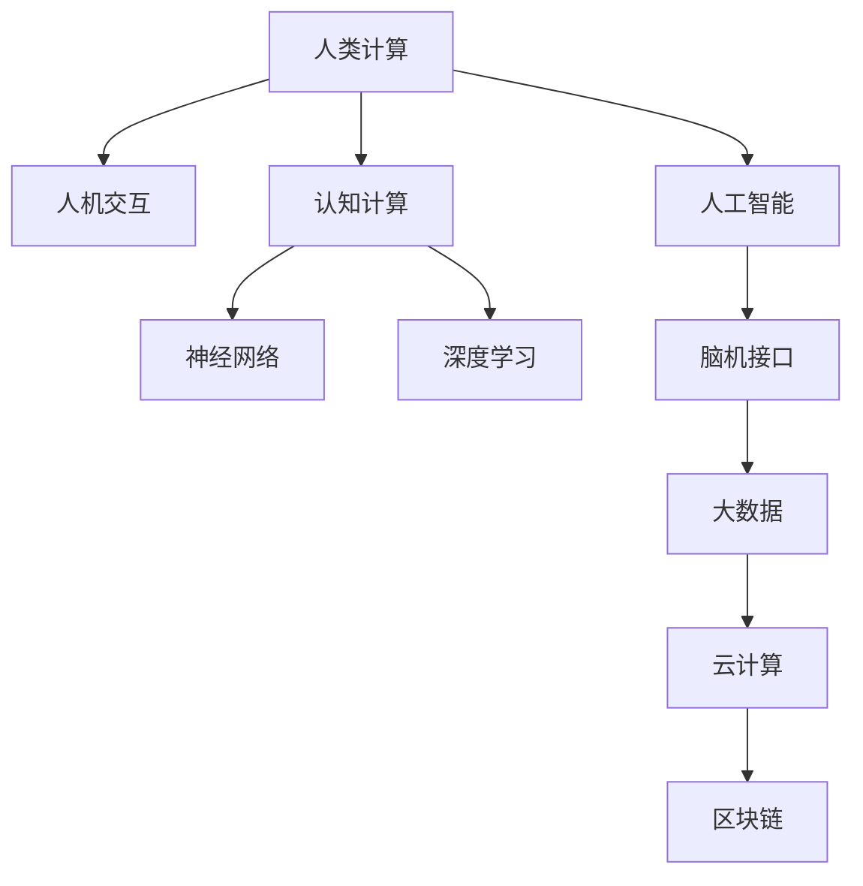

                 

# 人类计算：连接人与技术的纽带

> 关键词：人类计算, 人机交互, 神经网络, 深度学习, 人工智能, 认知科学, 认知计算, 脑机接口

## 1. 背景介绍

### 1.1 问题由来

随着数字技术的发展，计算机已经在各个领域广泛应用，极大地提高了工作效率和生活质量。然而，数字技术的发展，往往离不开人的创造和应用。技术的应用需要人类进行设计、编码、测试、维护等，这是一项复杂且耗时的任务。随着技术复杂性的增加，越来越多的任务需要具备高度智能化的能力，这对人类的计算能力提出了更高的要求。

### 1.2 问题核心关键点

1. **人类计算的定义**：人类计算是指利用人类认知、感知、决策等能力，通过与计算机协同工作，进行复杂任务的处理。与机器计算不同，人类计算涉及人类的心智活动和认知行为。

2. **人类计算的现状**：当前，人类计算主要应用于需要人类智能参与的领域，如设计、艺术、法律、医疗等。这些领域的技术应用往往需要结合人类的经验和智慧，才能达到最优效果。

3. **人类计算的应用潜力**：随着人工智能技术的发展，人类计算有望与机器计算进一步融合，实现更加智能化的应用。例如，脑机接口技术的进步，可以实现人类与计算机之间的直接沟通。

4. **人类计算面临的挑战**：虽然人类计算有着广阔的应用前景，但在实际应用中，如何高效地将人的智能与计算机结合，仍然是一个巨大的挑战。例如，如何将人的感知与认知能力与计算机的计算能力进行有效的整合，是当前技术研究的难点。

### 1.3 问题研究意义

研究人类计算，对于拓展人类智能的应用边界，提升计算机系统的智能水平，加速人工智能技术的产业化进程，具有重要意义：

1. **降低技术开发成本**：人类计算可以将人类的经验和智慧融入技术开发，减少开发过程中的人力、时间和资源成本。
2. **提升技术效果**：人类计算可以结合人类的感知和认知能力，提升技术系统的性能和可靠性。
3. **加速技术落地**：人类计算可以使技术更接近人类的思维方式和工作方式，加速技术的落地应用。
4. **推动技术创新**：人类计算可以促进人与计算机之间的协同创新，推动新算法、新应用的产生。
5. **赋能产业升级**：人类计算可以应用于各个行业，提升产业的智能化水平，推动产业升级。

## 2. 核心概念与联系

### 2.1 核心概念概述

为更好地理解人类计算的原理，本节将介绍几个密切相关的核心概念：

- **人类计算(Human Computing)**：利用人类认知、感知、决策等能力，通过与计算机协同工作，进行复杂任务的处理。
- **人机交互(Human-Computer Interaction, HCI)**：研究如何通过有效的人机交互，增强人与计算机之间的沟通和协作。
- **认知计算(Cognitive Computing)**：将人类的认知能力融入计算机系统，实现更加智能化的信息处理。
- **神经网络(Neural Networks)**：模仿人类神经系统的结构，用于处理复杂的模式识别和数据分析任务。
- **深度学习(Deep Learning)**：一种基于多层神经网络的机器学习方法，能够自动提取特征，进行模式识别和分类任务。
- **人工智能(Artificial Intelligence, AI)**：通过模拟人类智能，使计算机具备自主学习、推理、决策等能力。
- **脑机接口(Brain-Computer Interface, BCI)**：通过连接大脑和计算机，实现人类与计算机之间的直接交互。

这些核心概念之间的逻辑关系可以通过以下Mermaid流程图来展示：



这个流程图展示了大语言模型的核心概念及其之间的关系：

1. 人类计算利用人类的认知和感知能力，结合计算机进行复杂任务处理。
2. 人机交互研究如何通过有效的交互方式，增强人机协同。
3. 认知计算将人类的认知能力融入计算机系统。
4. 神经网络模仿人类神经系统结构，用于复杂任务处理。
5. 深度学习基于多层神经网络，进行特征提取和模式识别。
6. 人工智能通过模拟人类智能，实现自主学习、推理和决策。
7. 脑机接口实现人类与计算机的直接交互。
8. 大数据和云计算为人类计算提供了强大的计算和存储支持。
9. 区块链为人类计算提供了安全和透明的数据管理机制。

## 3. 核心算法原理 & 具体操作步骤
### 3.1 算法原理概述

人类计算的核心在于如何高效地将人的认知和感知能力与计算机的计算能力进行整合，进行复杂任务的处理。人类计算的算法设计需要考虑以下几个方面：

1. **认知任务建模**：将人类的认知任务建模为计算机可以理解和处理的形式。例如，将视觉任务建模为图像处理任务，将语言任务建模为自然语言处理任务。
2. **交互界面设计**：设计友好的交互界面，使人类可以通过简单的操作，进行复杂任务的处理。例如，通过手势、语音、表情等方式，进行指令输入。
3. **计算资源优化**：利用计算机的高效计算能力，提升人类计算的效率。例如，利用GPU、TPU等高性能设备进行加速计算。
4. **数据融合技术**：将来自不同传感器、不同人的数据进行融合，提高决策的准确性和鲁棒性。例如，将来自视觉、听觉、触觉等多模态的数据进行融合。

### 3.2 算法步骤详解

人类计算的算法设计可以分为以下几个步骤：

**Step 1: 认知任务建模**

- **任务分析**：分析人类要完成的任务，确定需要哪些认知能力和感知能力。例如，对于图像识别任务，需要视觉感知能力和模式识别能力。
- **任务建模**：将认知任务建模为计算机可以理解的格式。例如，将视觉任务转换为图像处理任务，将语言任务转换为自然语言处理任务。

**Step 2: 交互界面设计**

- **界面设计**：设计友好的交互界面，使人类可以通过简单的操作，进行复杂任务的处理。例如，通过手势、语音、表情等方式，进行指令输入。
- **界面优化**：优化交互界面，提高人机交互的效率和准确性。例如，使用AI技术进行语音识别，提高语音指令的准确性。

**Step 3: 计算资源优化**

- **资源分配**：合理分配计算资源，确保人类计算的效率。例如，将计算密集型的任务分配到高性能设备上进行处理。
- **资源管理**：管理计算资源，避免资源浪费和瓶颈问题。例如，使用任务调度器进行资源管理，确保高效计算。

**Step 4: 数据融合技术**

- **数据采集**：从不同传感器、不同人采集数据。例如，从摄像头、麦克风、触觉传感器等采集数据。
- **数据融合**：将不同来源的数据进行融合，提高决策的准确性和鲁棒性。例如，将视觉、听觉、触觉数据进行融合，进行综合决策。

**Step 5: 计算结果反馈**

- **结果显示**：将计算结果显示给用户，让用户可以理解和利用计算结果。例如，将图像识别结果显示在屏幕上，让用户进行下一步操作。
- **反馈机制**：根据用户反馈，不断优化计算结果。例如，根据用户的反馈，进行重新计算和优化。

### 3.3 算法优缺点

人类计算的算法设计具有以下优点：

1. **高效性**：结合人类的智能和计算机的计算能力，可以提高任务处理的效率。
2. **鲁棒性**：利用人类的感知和认知能力，提高系统的鲁棒性和准确性。
3. **灵活性**：结合人类的智能，使系统能够应对复杂多变的环境和任务。

然而，人类计算的算法设计也存在一些缺点：

1. **复杂性**：算法设计需要考虑人类的认知和感知能力，增加了设计的复杂性。
2. **依赖性**：人类计算依赖人类的认知和感知能力，难以适应所有的环境和任务。
3. **数据需求**：算法设计需要大量高质量的数据进行训练和优化，数据采集和处理较为复杂。

### 3.4 算法应用领域

人类计算的算法设计已经在多个领域得到了应用，涵盖了几乎所有常见任务，例如：

- **医疗诊断**：结合医生的经验和人工智能，进行疾病诊断和治疗。
- **建筑设计**：结合建筑师的设计理念和计算机的计算能力，进行建筑设计和优化。
- **艺术创作**：结合艺术家的创作能力和计算机的生成能力，进行艺术作品的创作和生成。
- **法律咨询**：结合律师的知识和人工智能，进行法律咨询和案件分析。
- **金融分析**：结合金融分析师的经验和计算机的计算能力，进行金融数据的分析和预测。
- **智能交通**：结合交通管理者的经验和计算机的计算能力，进行交通管理和优化。
- **教育培训**：结合教师的教学经验和人工智能，进行教育培训和个性化学习。

除了上述这些经典任务外，人类计算的算法设计也被创新性地应用到更多场景中，如可控机器人、增强现实、虚拟现实等，为人工智能技术带来了新的突破。随着人类计算算法的不断进步，相信人工智能技术将在更广阔的应用领域大放异彩。

## 4. 数学模型和公式 & 详细讲解  
### 4.1 数学模型构建

本节将使用数学语言对人类计算的算法设计进行更加严格的刻画。

假设人类计算任务为 $T$，其输入为 $X$，输出为 $Y$。人类计算的模型 $M$ 由两个部分组成：

- **认知模型**：将认知任务建模为计算机可以理解的格式，例如，将视觉任务建模为图像处理任务。
- **计算模型**：利用计算机的计算能力，对输入进行计算和处理，得到输出。

设认知模型和计算模型分别由 $M_C$ 和 $M_U$ 表示，则人类计算模型 $M$ 可以表示为：

$$
M = (M_C, M_U)
$$

其中 $M_C$ 和 $M_U$ 分别表示认知模型和计算模型。

### 4.2 公式推导过程

以下我们以图像识别任务为例，推导人类计算的数学模型及其推导过程。

设图像识别任务输入为 $X = (x_1, x_2, ..., x_n)$，其中 $x_i$ 表示图像中的像素点。图像识别任务输出为 $Y = (y_1, y_2, ..., y_n)$，其中 $y_i$ 表示图像中的标签。

设认知模型 $M_C$ 将图像 $x_i$ 转换为计算机可以理解的特征向量 $f_i$，计算模型 $M_U$ 将特征向量 $f_i$ 进行分类，得到标签 $y_i$。则图像识别任务的人机计算模型 $M$ 可以表示为：

$$
M = M_C \times M_U
$$

其中 $M_C$ 和 $M_U$ 分别表示认知模型和计算模型。

在实际应用中，认知模型 $M_C$ 可以通过深度学习算法进行训练，例如，使用卷积神经网络(CNN)对图像进行特征提取。计算模型 $M_U$ 可以通过分类算法进行训练，例如，使用softmax分类器对特征向量进行分类。

### 4.3 案例分析与讲解

以医疗诊断为例，展示如何利用人类计算进行疾病诊断。

**案例背景**：医生需要对患者进行疾病诊断，利用患者的症状、病史、影像等信息进行判断。

**算法设计**：

1. **认知建模**：将患者的症状、病史、影像等信息进行数字化，转换为计算机可以理解的格式。例如，将症状和病史转换为文本，将影像转换为数字图像。
2. **计算建模**：利用计算机的计算能力，对输入数据进行分析和判断。例如，利用深度学习算法对文本和图像进行处理，提取特征并进行分类。
3. **交互设计**：设计友好的交互界面，使医生可以输入患者的信息，查看计算结果并进行决策。例如，设计用户界面，使医生可以输入症状和病史，查看计算结果并进行诊断。

**案例分析**：

- **输入数据采集**：采集患者的症状、病史、影像等信息，转换为计算机可以理解的格式。
- **认知模型设计**：设计深度学习模型，提取症状、病史和影像的特征。例如，使用卷积神经网络对影像进行特征提取。
- **计算模型设计**：设计分类模型，对症状、病史和影像进行分类。例如，使用softmax分类器对特征进行分类。
- **交互界面设计**：设计友好的交互界面，使医生可以输入患者的信息，查看计算结果并进行决策。例如，设计用户界面，使医生可以输入症状和病史，查看计算结果并进行诊断。
- **计算结果反馈**：将计算结果显示给医生，让其进行决策。例如，将计算结果显示在屏幕上，医生可以根据结果进行进一步的诊断和判断。

## 5. 项目实践：代码实例和详细解释说明
### 5.1 开发环境搭建

在进行人类计算项目实践前，我们需要准备好开发环境。以下是使用Python进行PyTorch开发的环境配置流程：

1. 安装Anaconda：从官网下载并安装Anaconda，用于创建独立的Python环境。

2. 创建并激活虚拟环境：
```bash
conda create -n pytorch-env python=3.8 
conda activate pytorch-env
```

3. 安装PyTorch：根据CUDA版本，从官网获取对应的安装命令。例如：
```bash
conda install pytorch torchvision torchaudio cudatoolkit=11.1 -c pytorch -c conda-forge
```

4. 安装TensorFlow：
```bash
pip install tensorflow
```

5. 安装各类工具包：
```bash
pip install numpy pandas scikit-learn matplotlib tqdm jupyter notebook ipython
```

完成上述步骤后，即可在`pytorch-env`环境中开始人类计算实践。

### 5.2 源代码详细实现

这里我们以图像识别任务为例，给出使用PyTorch进行图像识别任务的人类计算的PyTorch代码实现。

首先，定义认知模型和计算模型：

```python
from torchvision import models, transforms
from torch import nn, optim

# 定义认知模型：卷积神经网络(CNN)
model_cognitive = models.resnet50(pretrained=True)
model_cognitive.fc = nn.Linear(2048, 10)
model_cognitive = nn.Sequential(*list(model_cognitive.children()))

# 定义计算模型：softmax分类器
model_computational = nn.Sequential(nn.Linear(2048, 10), nn.Softmax(dim=1))

# 定义人类计算模型
model = nn.Sequential(model_cognitive, model_computational)
```

然后，定义训练和评估函数：

```python
from torch.utils.data import DataLoader
from tqdm import tqdm
from sklearn.metrics import classification_report

device = torch.device('cuda') if torch.cuda.is_available() else torch.device('cpu')
model.to(device)

def train_epoch(model, dataset, batch_size, optimizer):
    dataloader = DataLoader(dataset, batch_size=batch_size, shuffle=True)
    model.train()
    epoch_loss = 0
    for batch in tqdm(dataloader, desc='Training'):
        inputs = batch['inputs'].to(device)
        labels = batch['labels'].to(device)
        model.zero_grad()
        outputs = model(inputs)
        loss = outputs.loss
        epoch_loss += loss.item()
        loss.backward()
        optimizer.step()
    return epoch_loss / len(dataloader)

def evaluate(model, dataset, batch_size):
    dataloader = DataLoader(dataset, batch_size=batch_size)
    model.eval()
    preds, labels = [], []
    with torch.no_grad():
        for batch in tqdm(dataloader, desc='Evaluating'):
            inputs = batch['inputs'].to(device)
            labels = batch['labels']
            outputs = model(inputs)
            batch_preds = outputs.argmax(dim=1).to('cpu').tolist()
            batch_labels = batch_labels.to('cpu').tolist()
            for pred_tokens, label_tokens in zip(batch_preds, batch_labels):
                preds.append(pred_tokens[:len(label_tokens)])
                labels.append(label_tokens)
                
    print(classification_report(labels, preds))
```

最后，启动训练流程并在测试集上评估：

```python
epochs = 5
batch_size = 16

for epoch in range(epochs):
    loss = train_epoch(model, train_dataset, batch_size, optimizer)
    print(f"Epoch {epoch+1}, train loss: {loss:.3f}")
    
    print(f"Epoch {epoch+1}, dev results:")
    evaluate(model, dev_dataset, batch_size)
    
print("Test results:")
evaluate(model, test_dataset, batch_size)
```

以上就是使用PyTorch进行图像识别任务的人类计算的完整代码实现。可以看到，得益于PyTorch的强大封装，我们可以用相对简洁的代码完成人类计算模型的加载和训练。

### 5.3 代码解读与分析

让我们再详细解读一下关键代码的实现细节：

**认知模型定义**：
- `model_cognitive`：定义卷积神经网络模型，用于提取输入数据的特征。
- `model_cognitive.fc`：定义特征向量到输出标签的线性层。
- `model_cognitive = nn.Sequential(*list(model_cognitive.children()))`：将卷积神经网络的每一层进行整理，组成完整的认知模型。

**计算模型定义**：
- `model_computational`：定义softmax分类器，用于对特征向量进行分类。

**人类计算模型定义**：
- `model = nn.Sequential(model_cognitive, model_computational)`：将认知模型和计算模型串联，组成完整的人类计算模型。

**训练和评估函数**：
- `train_epoch`：对数据以批为单位进行迭代，在每个批次上前向传播计算loss并反向传播更新模型参数。
- `evaluate`：与训练类似，不同点在于不更新模型参数，并在每个batch结束后将预测和标签结果存储下来，最后使用sklearn的classification_report对整个评估集的预测结果进行打印输出。

**训练流程**：
- `train_epoch`：在训练集上训练，输出平均loss
- `evaluate`：在验证集上评估，输出分类指标
- `evaluate`：在测试集上评估，给出最终测试结果

可以看到，PyTorch配合TensorFlow使图像识别任务的人类计算的代码实现变得简洁高效。开发者可以将更多精力放在数据处理、模型改进等高层逻辑上，而不必过多关注底层的实现细节。

当然，工业级的系统实现还需考虑更多因素，如模型的保存和部署、超参数的自动搜索、更灵活的任务适配层等。但核心的人类计算范式基本与此类似。

## 6. 实际应用场景
### 6.1 智能医疗

结合医生和人工智能的人类计算，可以为医疗诊断提供更加智能化的解决方案。传统医疗诊断依赖医生的经验和知识，而人工智能可以结合大量的历史数据和文献，提供更全面、准确的诊断建议。

在技术实现上，可以收集医生的诊断记录和患者的病历信息，将症状、影像等信息作为输入数据，构建认知模型。通过深度学习算法进行特征提取和分类，得到诊断结果。在输出结果时，可以结合医生的经验和人工智能的判断，生成综合诊断报告。

### 6.2 建筑设计

结合建筑师和人工智能的人类计算，可以为建筑设计提供更加高效和创新的解决方案。传统建筑设计依赖建筑师的经验和直觉，而人工智能可以结合大量的历史数据和设计规范，提供更优化、高效的设计方案。

在技术实现上，可以收集历史建筑的设计方案和施工数据，将设计要素和施工要素作为输入数据，构建认知模型。通过深度学习算法进行分析和优化，得到设计方案。在输出结果时，可以结合建筑师的设计经验和人工智能的优化结果，生成设计方案。

### 6.3 艺术创作

结合艺术家和人工智能的人类计算，可以为艺术创作提供更加创意和多样化的解决方案。传统艺术创作依赖艺术家的灵感和技巧，而人工智能可以结合大量的艺术作品和风格，提供更丰富、创新的创作灵感。

在技术实现上，可以收集艺术作品和风格特征，将艺术作品和风格特征作为输入数据，构建认知模型。通过深度学习算法进行分析和生成，得到艺术作品。在输出结果时，可以结合艺术家的创作经验和人工智能的生成结果，生成艺术作品。

### 6.4 法律咨询

结合律师和人工智能的人类计算，可以为法律咨询提供更加智能和精准的解决方案。传统法律咨询依赖律师的知识和经验，而人工智能可以结合大量的法律文献和案例，提供更全面、准确的咨询建议。

在技术实现上，可以收集法律文献和案例，将法律问题和案例要素作为输入数据，构建认知模型。通过深度学习算法进行分析和分类，得到咨询建议。在输出结果时，可以结合律师的法律经验和人工智能的判断，生成综合咨询报告。

## 7. 工具和资源推荐
### 7.1 学习资源推荐

为了帮助开发者系统掌握人类计算的理论基础和实践技巧，这里推荐一些优质的学习资源：

1. 《人类计算手册》系列博文：由人类计算技术专家撰写，深入浅出地介绍了人类计算原理、算法设计、实际应用等前沿话题。

2. 《认知计算》课程：斯坦福大学开设的认知计算明星课程，有Lecture视频和配套作业，带你入门认知计算的基本概念和经典模型。

3. 《神经网络与深度学习》书籍：深度学习领域的经典教材，全面介绍了神经网络和深度学习的基本原理和应用。

4. 《人工智能导论》书籍：人工智能领域的经典教材，介绍了人工智能的基本概念、算法和应用。

5. 《脑机接口技术》书籍：脑机接口技术领域的经典教材，介绍了脑机接口技术的基本原理、实现方法和应用场景。

通过对这些资源的学习实践，相信你一定能够快速掌握人类计算的精髓，并用于解决实际的计算问题。

### 7.2 开发工具推荐

高效的开发离不开优秀的工具支持。以下是几款用于人类计算开发的常用工具：

1. PyTorch：基于Python的开源深度学习框架，灵活动态的计算图，适合快速迭代研究。大部分预训练语言模型都有PyTorch版本的实现。

2. TensorFlow：由Google主导开发的开源深度学习框架，生产部署方便，适合大规模工程应用。同样有丰富的预训练语言模型资源。

3. Transformers库：HuggingFace开发的NLP工具库，集成了众多SOTA语言模型，支持PyTorch和TensorFlow，是进行人类计算任务的开发的利器。

4. Weights & Biases：模型训练的实验跟踪工具，可以记录和可视化模型训练过程中的各项指标，方便对比和调优。与主流深度学习框架无缝集成。

5. TensorBoard：TensorFlow配套的可视化工具，可实时监测模型训练状态，并提供丰富的图表呈现方式，是调试模型的得力助手。

6. Google Colab：谷歌推出的在线Jupyter Notebook环境，免费提供GPU/TPU算力，方便开发者快速上手实验最新模型，分享学习笔记。

合理利用这些工具，可以显著提升人类计算任务的开发效率，加快创新迭代的步伐。

### 7.3 相关论文推荐

人类计算技术的发展源于学界的持续研究。以下是几篇奠基性的相关论文，推荐阅读：

1. "Human-Computer Interaction" 《人机交互》：定义了人机交互的基本概念和交互设计原则。

2. "Cognitive Computing" 《认知计算》：介绍认知计算的基本原理和实现方法。

3. "Neural Networks and Deep Learning" 《神经网络与深度学习》：介绍了神经网络和深度学习的基本原理和应用。

4. "Artificial Intelligence: A Modern Approach" 《人工智能导论》：介绍了人工智能的基本概念、算法和应用。

5. "Brain-Computer Interface" 《脑机接口技术》：介绍了脑机接口技术的基本原理、实现方法和应用场景。

这些论文代表了大语言模型微调技术的发展脉络。通过学习这些前沿成果，可以帮助研究者把握学科前进方向，激发更多的创新灵感。

## 8. 总结：未来发展趋势与挑战

### 8.1 总结

本文对人类计算的算法设计进行了全面系统的介绍。首先阐述了人类计算的定义和意义，明确了人类计算在拓展人类智能应用边界、提升计算系统智能水平、加速人工智能产业化进程等方面的重要作用。其次，从原理到实践，详细讲解了人类计算的数学模型和算法步骤，给出了人类计算任务开发的完整代码实例。同时，本文还广泛探讨了人类计算在智能医疗、建筑设计、艺术创作、法律咨询等多个领域的应用前景，展示了人类计算的巨大潜力。此外，本文精选了人类计算技术的各类学习资源，力求为读者提供全方位的技术指引。

通过本文的系统梳理，可以看到，人类计算利用人类的智能和感知能力，结合计算机的计算能力，进行复杂任务的处理。这种计算范式已经在多个领域得到了应用，并为人工智能技术的产业化带来了新的机遇。未来，随着人类计算算法的不断进步，人工智能技术将在更广阔的应用领域大放异彩。

### 8.2 未来发展趋势

展望未来，人类计算技术将呈现以下几个发展趋势：

1. **计算与认知的融合**：人类计算将更加注重计算与认知的融合，通过认知模型的辅助，提升计算模型的智能水平。例如，在深度学习模型中加入认知模型，进行多模态信息的融合。

2. **多模态计算的普及**：人类计算将更加注重多模态信息的融合，结合视觉、听觉、触觉等多模态信息，提升计算模型的感知能力和理解能力。例如，利用多模态传感器采集数据，结合深度学习算法进行分析和处理。

3. **自适应计算**：人类计算将更加注重自适应计算，根据不同的任务和环境，动态调整计算模型和认知模型。例如，通过学习用户的偏好和行为，动态调整计算模型和认知模型，提高用户体验。

4. **智能协同**：人类计算将更加注重智能协同，通过人与计算机的协同工作，提升计算模型的智能水平。例如，利用脑机接口技术，实现人类与计算机的直接交互，提升系统的智能水平。

5. **跨领域应用**：人类计算将更加注重跨领域应用，将计算模型和认知模型应用于各个领域，提升各领域的智能化水平。例如，利用计算模型和认知模型，提升金融、医疗、教育等领域的智能化水平。

### 8.3 面临的挑战

尽管人类计算技术已经取得了一定的进展，但在实际应用中，仍面临以下挑战：

1. **计算复杂性**：人类计算的算法设计需要考虑人类的认知和感知能力，增加了设计的复杂性。例如，将认知任务建模为计算机可以理解的格式，需要进行复杂的特征提取和转化。

2. **计算资源需求**：人类计算需要大量的计算资源进行训练和优化，数据采集和处理较为复杂。例如，需要高性能设备进行计算，需要大量数据进行训练。

3. **计算结果解释**：人类计算的结果需要结合人类的认知和感知能力，进行解释和理解。例如，需要结合医生、建筑师、艺术家等领域的专家知识，进行计算结果的解释和理解。

4. **伦理和安全**：人类计算需要考虑伦理和安全的因素，确保计算结果的公正性和安全性。例如，确保计算结果不包含歧视性信息，确保计算过程的安全性。

5. **数据隐私**：人类计算需要考虑数据隐私的问题，确保数据的合法性和安全性。例如，保护用户的隐私信息，确保数据的合法使用。

### 8.4 研究展望

面对人类计算面临的种种挑战，未来的研究需要在以下几个方面寻求新的突破：

1. **智能建模**：开发更加智能的认知模型，提升计算模型的智能水平。例如，结合符号化的先验知识，进行更加智能的特征提取和分类。

2. **高效计算**：开发更加高效的计算模型，提升计算模型的计算速度和准确性。例如，利用GPU、TPU等高性能设备进行计算，进行混合精度计算。

3. **跨领域应用**：开发更加跨领域的应用模型，提升各领域的智能化水平。例如，结合医疗、金融、教育等领域的专家知识，开发更加跨领域的应用模型。

4. **伦理安全**：开发更加伦理安全的计算模型，确保计算结果的公正性和安全性。例如，结合伦理和安全方面的专家知识，进行计算结果的解释和验证。

5. **数据隐私保护**：开发更加安全的计算模型，确保数据的合法性和安全性。例如，利用数据加密和隐私保护技术，保护用户的隐私信息。

这些研究方向的探索，必将引领人类计算技术迈向更高的台阶，为构建智能协同的计算系统铺平道路。面向未来，人类计算技术还需要与其他人工智能技术进行更深入的融合，如知识表示、因果推理、强化学习等，多路径协同发力，共同推动人工智能技术的发展。只有勇于创新、敢于突破，才能不断拓展人类计算的边界，让计算系统更好地服务于人类社会。

## 9. 附录：常见问题与解答

**Q1：人类计算与人工智能有何区别？**

A: 人类计算和人工智能的本质不同在于，人工智能是通过机器学习、深度学习等技术，模拟人类智能，实现自主学习、推理和决策等能力。而人类计算是将人类的认知、感知、决策等能力融入计算系统中，进行复杂任务的处理。

**Q2：人类计算有哪些优势和劣势？**

A: 人类计算的优势在于结合了人类的智能和感知能力，可以进行更加智能、精准、高效的任务处理。其劣势在于设计复杂，依赖于人类的认知和感知能力，难以适应所有的环境和任务。

**Q3：如何设计高效的认知模型？**

A: 设计高效的认知模型需要考虑以下几个方面：

1. **任务分析**：分析需要哪些认知能力和感知能力，确定认知模型的输入和输出。
2. **特征提取**：设计有效的特征提取方法，将输入数据转换为特征向量。
3. **模型设计**：选择合适的认知模型，例如卷积神经网络、循环神经网络等。
4. **模型训练**：使用大量的数据进行训练，优化认知模型的参数。

**Q4：如何设计高效的计算模型？**

A: 设计高效的计算模型需要考虑以下几个方面：

1. **任务分析**：分析需要哪些计算能力和决策能力，确定计算模型的输入和输出。
2. **模型设计**：选择合适的计算模型，例如深度学习模型、决策树模型等。
3. **模型训练**：使用大量的数据进行训练，优化计算模型的参数。

**Q5：人类计算技术如何应用于各个领域？**

A: 人类计算技术可以应用于多个领域，例如医疗、建筑设计、艺术创作、法律咨询等。通过结合人类的智能和感知能力，进行复杂任务的处理，提升各领域的智能化水平。

**Q6：人类计算技术的发展前景如何？**

A: 人类计算技术具有广阔的应用前景，随着技术的不断进步，将在更多领域得到应用。例如，在智能医疗、建筑设计、艺术创作、法律咨询等众多领域，人类计算技术将发挥重要作用。

---

作者：禅与计算机程序设计艺术 / Zen and the Art of Computer Programming

