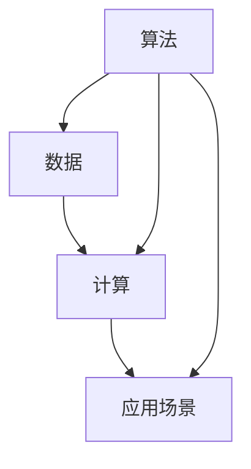

                 

# 人类计算：连接过去、现在和未来

人类计算是连接历史、现代与未来的一片桥梁，是理解人工智能（AI）、机器学习（ML）和计算科学的关键所在。本文将探讨人类计算的核心理念、原理和应用，展现其如何通过算法、数据和计算的紧密结合，推动人工智能技术的不断进步和创新。

## 1. 背景介绍

### 1.1 问题由来

自20世纪以来，计算技术的迅猛发展极大地推动了人类社会的信息化进程。从早期机械计算器到现代超级计算机，每一次计算能力的飞跃都带来了生产力的巨大提升。然而，计算技术的飞速发展也引发了一系列新的挑战，如算力消耗巨大、数据处理复杂、计算模型难以理解等问题。

### 1.2 问题核心关键点

人类计算的核心在于通过智能算法，合理地整合和利用数据，以最小的计算资源达到最优的计算效果。关键点包括：

- **算法设计**：开发高效、鲁棒的算法模型，能够处理大规模复杂的数据集。
- **数据质量**：保证数据的高质量，包括数据的全面性、准确性和真实性。
- **计算效率**：优化计算过程，减少资源消耗，提高计算效率。
- **应用场景**：选择合适的应用场景，发挥人类计算的最大潜力。
- **跨学科融合**：结合不同学科的知识，拓宽计算应用的范围。

## 2. 核心概念与联系

### 2.1 核心概念概述

人类计算涉及多个核心概念，包括算法、数据、计算和应用场景等。这些概念之间相互联系，共同构成了人类计算的完整体系：

- **算法**：高效、鲁棒的算法是计算的核心。算法的设计需要考虑问题的复杂度、数据的特点以及计算资源的限制。
- **数据**：数据的质量和数量直接影响计算结果的准确性和可靠性。数据的收集、清洗和标注是数据管理的关键环节。
- **计算**：计算资源包括硬件和软件两部分。如何高效利用计算资源是实现高计算效率的重要问题。
- **应用场景**：根据具体的应用场景选择适合的计算方法，是发挥计算潜能的关键。

### 2.2 核心概念原理和架构的 Mermaid 流程图



这个流程图展示了算法、数据和计算之间的联系。算法作为数据处理的工具，直接影响计算的效果和效率；计算资源支撑算法的执行；应用场景决定了算法和数据的选择。

## 3. 核心算法原理 & 具体操作步骤

### 3.1 算法原理概述

人类计算的核心理算包括但不限于：

- **机器学习**：通过数据训练模型，使其能够自动学习特征和规律。
- **深度学习**：使用多层神经网络模型，处理复杂数据和非线性关系。
- **强化学习**：通过试错机制，优化决策策略，实现目标最大化。
- **优化算法**：如梯度下降、遗传算法等，用于优化模型的参数。
- **知识图谱**：将知识组织成图结构，支持事实推理和知识发现。

### 3.2 算法步骤详解

人类计算的一般步骤如下：

1. **问题定义**：明确计算的目标和问题，包括数据的类型、范围和计算的目的。
2. **数据收集**：通过各种手段收集相关数据，并进行清洗和预处理。
3. **算法选择**：根据问题的特点和数据的性质，选择合适的算法模型。
4. **模型训练**：使用数据训练模型，优化模型参数，提升模型效果。
5. **模型评估**：通过测试集和验证集评估模型效果，调整参数和算法。
6. **结果分析**：对模型结果进行分析和解释，提供决策支持。
7. **应用部署**：将模型部署到实际应用中，持续监控和优化。

### 3.3 算法优缺点

人类计算的算法有如下优点：

- **高效性**：能够处理大规模复杂数据，提升计算效率。
- **鲁棒性**：自动学习和优化，减少人为干预。
- **可扩展性**：适用于各种应用场景，能够快速部署和扩展。

同时，也存在以下缺点：

- **高需求性**：对数据和计算资源的要求较高。
- **复杂性**：算法设计复杂，需要专业知识和经验。
- **可解释性**：模型的决策过程不够透明，难以理解。
- **伦理风险**：可能存在偏见和歧视，需要慎重对待。

### 3.4 算法应用领域

人类计算的应用领域极为广泛，包括但不限于：

- **医疗健康**：通过算法分析患者数据，支持疾病诊断和治疗。
- **金融保险**：利用算法进行风险评估和投资分析。
- **交通运输**：优化交通流量和路径规划，提高出行效率。
- **智能制造**：通过算法优化生产流程和供应链管理。
- **教育培训**：利用算法个性化教学，提高学习效果。
- **环境保护**：通过算法分析环境数据，支持环保决策。

## 4. 数学模型和公式 & 详细讲解 & 举例说明

### 4.1 数学模型构建

人类计算的数学模型通常基于数据集进行构建。以机器学习为例，模型的构建过程如下：

- **输入数据**：$X \in \mathbb{R}^{n \times m}$，表示$n$个$m$维的样本向量。
- **输出标签**：$Y \in \{0,1\}^{n}$，表示样本的标签。
- **模型参数**：$\theta \in \mathbb{R}^{p}$，表示模型中的可调参数。

常用的数学模型包括线性回归、逻辑回归、支持向量机等。以线性回归为例，模型公式如下：

$$
Y = \theta^T X + b
$$

其中，$\theta$ 为模型参数，$b$ 为截距。

### 4.2 公式推导过程

以线性回归为例，推导其损失函数和梯度公式：

- **均方误差损失函数**：
$$
L(\theta) = \frac{1}{2N} \sum_{i=1}^N ||Y_i - \theta^T X_i||^2
$$

- **梯度公式**：
$$
\frac{\partial L(\theta)}{\partial \theta_j} = \frac{1}{N} \sum_{i=1}^N (Y_i - \hat{Y_i})(X_{i,j})
$$

其中，$X_{i,j}$ 表示向量$X_i$的第$j$个元素。

### 4.3 案例分析与讲解

以股票市场预测为例，说明如何使用线性回归进行股票价格预测：

- **输入数据**：收集历史股票价格数据，作为模型的输入。
- **输出标签**：将未来一段时间内的股票价格作为输出标签。
- **模型参数**：通过历史数据训练模型，调整$\theta$和$b$。
- **结果评估**：使用测试集评估模型效果，判断预测精度。

## 5. 项目实践：代码实例和详细解释说明

### 5.1 开发环境搭建

1. **安装 Python**：选择 Python 3.7 及以上版本，作为开发环境的主语言。
2. **安装 Anaconda**：用于创建和管理虚拟环境。
3. **安装相关库**：如 NumPy、Pandas、Scikit-learn、TensorFlow 等，使用 pip 安装。
4. **设置 Jupyter Notebook**：安装 Jupyter Notebook，用于交互式编程和数据可视化。

### 5.2 源代码详细实现

以线性回归为例，展示如何使用 Python 进行模型训练和预测：

```python
import numpy as np
from sklearn.linear_model import LinearRegression

# 生成随机数据
np.random.seed(0)
X = np.random.rand(100, 2)
y = 2*X[:, 0] + 3*X[:, 1] + np.random.normal(size=100)

# 建立模型
model = LinearRegression()

# 训练模型
model.fit(X, y)

# 预测新数据
X_new = np.array([[0.1, 0.2], [0.3, 0.5]])
y_pred = model.predict(X_new)

print(y_pred)
```

### 5.3 代码解读与分析

- **数据生成**：使用 NumPy 生成100个样本数据，包含两个特征和一个标签。
- **模型建立**：使用 Scikit-learn 的 LinearRegression 类，建立线性回归模型。
- **模型训练**：使用 fit 方法，对模型进行训练。
- **模型预测**：使用 predict 方法，对新数据进行预测。
- **结果输出**：输出预测结果。

### 5.4 运行结果展示

执行上述代码后，输出的结果为两个新样本的预测值。通过调整数据和模型参数，可以实现更准确的预测效果。

## 6. 实际应用场景

### 6.1 医疗健康

在医疗健康领域，人类计算可以应用于疾病诊断、个性化治疗和健康管理。例如，通过分析患者的基因数据和病历记录，利用机器学习模型预测疾病的发生概率，提供个性化的治疗方案。

### 6.2 金融保险

在金融保险领域，人类计算可以应用于风险评估、投资分析和市场预测。例如，利用机器学习模型分析历史交易数据，预测股票价格走势，帮助投资者做出更明智的投资决策。

### 6.3 交通运输

在交通运输领域，人类计算可以应用于交通流量优化、路径规划和自动驾驶。例如，通过机器学习模型分析交通数据，优化交通信号灯控制，提高城市交通效率。

### 6.4 智能制造

在智能制造领域，人类计算可以应用于生产流程优化、供应链管理和质量控制。例如，利用机器学习模型分析生产数据，优化生产流程，提高产品质量和生产效率。

### 6.5 教育培训

在教育培训领域，人类计算可以应用于个性化教学、学生行为分析和智能辅导。例如，通过机器学习模型分析学生的学习数据，提供个性化的学习建议，提高学习效果。

### 6.6 环境保护

在环境保护领域，人类计算可以应用于污染监测、资源管理和环境预测。例如，利用机器学习模型分析环境数据，预测污染变化趋势，支持环保决策。

## 7. 工具和资源推荐

### 7.1 学习资源推荐

1. **《机器学习》课程**：斯坦福大学Andrew Ng教授开设的机器学习课程，涵盖机器学习基础、算法实现和应用。
2. **《深度学习》课程**：斯坦福大学陈学申教授开设的深度学习课程，讲解深度学习模型的构建和训练。
3. **《数据科学入门》书籍**：适合初学者入门，涵盖数据处理、数据可视化等基本技能。
4. **Kaggle竞赛平台**：提供大量数据集和竞赛任务，供学习者练习和展示。

### 7.2 开发工具推荐

1. **Jupyter Notebook**：用于交互式编程和数据可视化。
2. **TensorFlow**：开源深度学习框架，支持分布式计算和模型部署。
3. **PyTorch**：开源深度学习框架，易于使用和扩展。
4. **Scikit-learn**：开源机器学习库，提供多种算法和工具。
5. **NumPy**：科学计算库，提供高效的数值计算功能。

### 7.3 相关论文推荐

1. **《深度学习》（Goodfellow et al., 2016）**：介绍深度学习的基本概念、算法和应用。
2. **《机器学习实战》（Peter Harrington, 2016）**：适合初学者入门，涵盖机器学习基础和实战案例。
3. **《数据科学与人工智能》（Yaser Abu-Mostafa, 2019）**：介绍数据科学和人工智能的基本原理和技术。

## 8. 总结：未来发展趋势与挑战

### 8.1 研究成果总结

人类计算在过去几十年取得了显著的进展，从简单的数值计算到复杂的机器学习，不断拓展了计算的能力和应用范围。机器学习算法的不断优化，使得计算变得更加智能和高效。

### 8.2 未来发展趋势

未来，人类计算将继续发展，呈现以下几个趋势：

1. **算力提升**：随着硬件技术的不断进步，算力将进一步提升，支持更大规模和更复杂的数据计算。
2. **数据质量优化**：数据质量和数据隐私将成为越来越重要的关注点，数据处理和清洗技术将不断提升。
3. **算法创新**：新型算法将不断涌现，如量子计算、光计算等，进一步提升计算效率和精度。
4. **跨学科融合**：人类计算将与其他学科结合，如生物学、化学、物理学等，推动跨学科研究。
5. **应用场景多样化**：人类计算的应用将进一步拓展，涵盖更多领域和问题。

### 8.3 面临的挑战

尽管人类计算取得了巨大进展，但仍面临以下挑战：

1. **计算资源消耗**：大规模计算需要高性能的硬件支持，成本较高。
2. **数据隐私保护**：数据隐私问题日益突出，如何保护用户隐私成为重要课题。
3. **算法透明性**：算法的决策过程不够透明，难以理解其内部逻辑。
4. **伦理道德问题**：算法可能存在偏见和歧视，需要慎重对待。

### 8.4 研究展望

未来的研究需要在以下几个方面寻求突破：

1. **算法优化**：开发更高效、更鲁棒的算法模型，提高计算效率和精度。
2. **数据治理**：建立数据隐私保护机制，提高数据质量。
3. **跨学科研究**：推动跨学科融合，拓宽计算应用范围。
4. **社会影响评估**：研究人类计算对社会的影响，确保其积极作用。

## 9. 附录：常见问题与解答

**Q1：人类计算的算法选择有哪些？**

A: 人类计算的算法选择包括但不限于机器学习、深度学习、强化学习和优化算法等。不同算法适用于不同的问题，需要根据具体问题选择合适的算法。

**Q2：数据质量对计算结果的影响是什么？**

A: 数据质量直接影响计算结果的准确性和可靠性。数据的质量包括全面性、准确性、真实性和一致性，数据质量越高，计算结果越可靠。

**Q3：如何提高计算效率？**

A: 提高计算效率的方法包括使用高效的数据结构和算法，优化计算流程，利用分布式计算等。

**Q4：计算过程中的伦理道德问题如何处理？**

A: 在计算过程中需要考虑伦理道德问题，如数据隐私保护、算法偏见等。通过建立规范和制度，确保计算过程符合伦理道德标准。

**Q5：未来人类计算的主要发展方向是什么？**

A: 未来人类计算的主要发展方向包括算力提升、数据质量优化、算法创新、跨学科融合和应用场景多样化等。

---

作者：禅与计算机程序设计艺术 / Zen and the Art of Computer Programming

