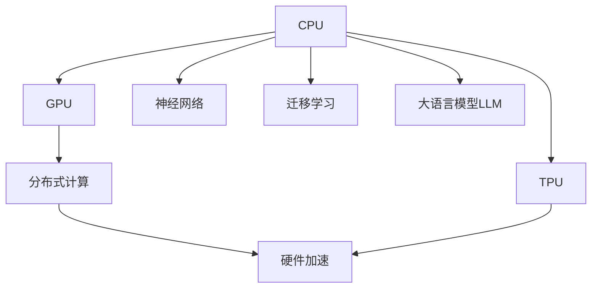

                 

# 从CPU到LLM：计算模式的巨大飞跃

> 关键词：大语言模型,计算模式,深度学习,分布式计算,硬件加速,神经网络,迁移学习

## 1. 背景介绍

### 1.1 问题由来
自从1940年代以来，计算模式经历了多次重大的变迁，从早期的真空管和晶体管到集成电路，再到现代的CPU和GPU，每次演进都极大推动了计算机科学的发展。但即便是在硬件逐渐成熟的今天，计算模式的瓶颈依然存在，限制了计算能力的发展。而近年来，随着深度学习和大语言模型的崛起，计算模式再次面临新的挑战和机遇。

大语言模型（Large Language Models, LLMs），如OpenAI的GPT系列、Google的BERT等，通过在海量数据上进行预训练，获得了前所未有的语言理解能力。但这些模型动辄百亿参数，高昂的计算资源要求限制了其大规模应用的可行性和效率。为提升模型的计算效率，研究人员需要重新审视当前的计算模式，并探索新的计算架构，以适应大语言模型的需求。

### 1.2 问题核心关键点
当前，计算模式向大语言模型应用的演进，主要面临以下几个关键问题：
1. **计算资源瓶颈**：大语言模型需要极高的计算资源，包括数据存储、网络带宽、计算能力等，现有计算模式难以满足其需求。
2. **数据传输效率**：由于大语言模型的参数规模庞大，数据的频繁传输成为计算瓶颈，数据传输效率亟待提升。
3. **计算模式并行性**：大语言模型对并行计算的需求极高，现有计算模式缺乏对并行计算的有效支持。
4. **硬件加速需求**：深度学习和大语言模型对特定硬件加速的需求，现有计算模式难以提供最优的硬件支持。

解决这些问题，需要全新的计算模式和架构。为此，本文将探讨从CPU到LLM的计算模式变迁，并提出可能的未来计算模式，以期为大语言模型应用提供新的思路。

## 2. 核心概念与联系

### 2.1 核心概念概述

为了深入理解从CPU到LLM的计算模式变迁，本节将介绍几个关键概念：

- **CPU (中央处理单元)**：计算机的核心计算单元，负责执行软件指令，进行数据处理和控制。传统CPU以单核为主，通过时钟频率和核心数量提升计算能力。
- **GPU (图形处理器)**：最初用于图形渲染，后来逐渐应用于并行计算。GPU具备多个流处理器，通过并行计算提升浮点运算能力。
- **TPU (Tensor Processing Unit)**：Google开发的专门用于加速深度学习的ASIC芯片，具备高度优化的硬件结构，专门用于张量运算。
- **分布式计算**：通过将计算任务分解为多个子任务，分别在多台计算节点上并行执行，实现高效计算。
- **硬件加速**：利用专用硬件加速深度学习模型，提升计算效率和精度。
- **神经网络**：大语言模型基于深度神经网络结构，通过大量参数和数据进行训练，具备强大的语言处理能力。
- **迁移学习**：通过在大规模数据上预训练模型，然后在小规模数据上微调，提高模型的泛化能力和适应性。

这些概念之间的逻辑关系可以通过以下Mermaid流程图来展示：



这个流程图展示了大语言模型计算模式的演变过程，从基础的CPU、GPU、TPU，到分布式计算和硬件加速，最终构建出大语言模型所需的高效计算环境。

## 3. 核心算法原理 & 具体操作步骤
### 3.1 算法原理概述

从CPU到LLM的计算模式演进，本质上是计算架构和算法的不断优化。大语言模型的计算模式主要包括：

- **数据并行**：将数据切分为多个子任务，并行处理，提高计算效率。
- **模型并行**：将模型的不同层分别部署在多个计算节点上，实现并行计算。
- **流水线并行**：在数据并行和模型并行的基础上，进一步优化计算过程，实现流水线计算。
- **硬件加速**：利用GPU、TPU等专用硬件加速深度学习和大语言模型的计算。

这些并行计算和硬件加速技术，极大地提升了计算效率和精度，使得大语言模型能够在大规模数据上快速训练和推理。

### 3.2 算法步骤详解

以下我们将详细介绍从CPU到LLM的计算模式演进过程中的关键步骤：

**Step 1: 选择计算架构**
- **单核CPU**：适合执行单线程任务，计算效率较低。
- **多核CPU**：通过多线程并行计算，提升计算效率。
- **GPU**：适合执行并行计算密集型任务，如图像处理、深度学习训练等。
- **TPU**：专为深度学习设计，具备高度优化的硬件结构，适合张量运算。
- **分布式计算**：通过将计算任务分解为多个子任务，分别在多台计算节点上并行执行。

**Step 2: 优化数据传输**
- **数据分割与合并**：将大批量数据切分为小块，并行传输和处理。
- **消息传递**：通过消息传递协议（如MPI、Hadoop），实现多台计算节点之间的数据交换。
- **内存共享**：通过共享内存技术，提高数据传输效率，减少数据复制。

**Step 3: 提升并行性能**
- **数据并行**：将数据切分为多个子任务，并行处理，提高计算效率。
- **模型并行**：将模型的不同层分别部署在多个计算节点上，实现并行计算。
- **流水线并行**：在数据并行和模型并行的基础上，进一步优化计算过程，实现流水线计算。

**Step 4: 硬件加速**
- **GPU加速**：利用GPU的多核并行计算能力，加速深度学习模型的训练和推理。
- **TPU加速**：利用TPU的硬件加速优势，进一步提升计算效率和精度。
- **FPGA和ASIC加速**：利用FPGA和ASIC等专用硬件，实现深度学习和大语言模型的特定功能加速。

### 3.3 算法优缺点

从CPU到LLM的计算模式演进，带来了以下优缺点：

**优点**：
1. **计算效率提升**：通过并行计算和硬件加速，大语言模型的计算效率大大提升，能够处理更复杂、更大规模的数据集。
2. **泛化能力增强**：多核CPU和分布式计算使得模型能够处理更大规模的数据，提升了模型的泛化能力和适应性。
3. **计算精度提高**：专用硬件如GPU和TPU，能够提供更高的计算精度，提升模型性能。

**缺点**：
1. **硬件成本高**：专用硬件如TPU和FPGA等成本较高，且硬件设备需要持续更新和维护。
2. **技术门槛高**：并行计算和分布式计算需要较高的技术门槛，开发复杂度较高。
3. **数据传输瓶颈**：大规模数据集传输仍然存在瓶颈，需要优化数据传输方式。

### 3.4 算法应用领域

大语言模型的计算模式，已经在诸多领域得到应用，例如：

- **自然语言处理**：深度学习模型在语言理解、生成、分类、匹配等任务上取得了显著进展。
- **计算机视觉**：深度学习模型在图像识别、分类、分割、生成等任务上表现优异。
- **语音处理**：深度学习模型在语音识别、生成、合成、转换等任务上取得了重要突破。
- **推荐系统**：利用深度学习模型实现个性化推荐，提升用户体验。
- **自动驾驶**：深度学习模型在自动驾驶中的感知、决策和控制任务上得到了广泛应用。
- **医疗诊断**：深度学习模型在医学影像分析、疾病预测、个性化治疗等方面表现出色。

这些应用领域的大规模数据处理和计算任务，极大地推动了大语言模型和计算模式的演进。未来，随着硬件技术的发展和算法优化，计算模式将进一步突破，推动更多前沿技术的发展。

## 4. 数学模型和公式 & 详细讲解  
### 4.1 数学模型构建

大语言模型的计算模式，可以通过以下数学模型进行描述：

设输入数据集为 $\mathcal{D}=\{(x_i,y_i)\}_{i=1}^N$，其中 $x_i$ 为输入特征，$y_i$ 为标签。设模型为 $M_{\theta}$，其中 $\theta$ 为模型参数。设训练集大小为 $N$，学习率为 $\eta$。

模型的计算过程如下：
1. 随机初始化模型参数 $\theta_0$。
2. 通过前向传播计算输出 $\hat{y} = M_{\theta}(x)$。
3. 计算损失函数 $\ell(\hat{y},y)$。
4. 反向传播计算梯度 $\nabla_{\theta}\ell(\hat{y},y)$。
5. 更新模型参数 $\theta \leftarrow \theta - \eta\nabla_{\theta}\ell(\hat{y},y)$。
6. 重复步骤2-5直至收敛。

其中，反向传播算法可以通过自动微分技术高效计算，从而实现高效率的模型训练。

### 4.2 公式推导过程

以下是深度学习模型的反向传播算法推导过程：

设模型 $M_{\theta}$ 在输入 $x$ 上的输出为 $\hat{y}=M_{\theta}(x) \in [0,1]$，表示样本属于正类的概率。真实标签 $y \in \{0,1\}$。则二分类交叉熵损失函数定义为：

$$
\ell(M_{\theta}(x),y) = -[y\log \hat{y} + (1-y)\log (1-\hat{y})]
$$

其梯度公式为：

$$
\frac{\partial \ell}{\partial \theta_k} = -\frac{\partial \log \hat{y}}{\partial \theta_k}y + \frac{\partial \log (1-\hat{y})}{\partial \theta_k}(1-y)
$$

其中，$\frac{\partial \log \hat{y}}{\partial \theta_k}$ 为模型对参数 $\theta_k$ 的梯度，可以通过反向传播算法递归计算。

### 4.3 案例分析与讲解

**案例1: 矩阵乘法加速**
- 矩阵乘法在大规模深度学习模型训练中占比极高。通过使用GPU或TPU等专用硬件，矩阵乘法加速可以达到数十倍甚至数百倍的速度提升。例如，NVIDIA的A100 GPU可以提供高达1 TFLOPS的计算能力，显著提升深度学习模型的训练速度。

**案例2: 数据并行和模型并行**
- 数据并行通过将数据切分为多个子任务，并行处理，可以大幅提升计算效率。例如，在深度学习模型训练中，可以使用数据并行加速多核CPU和分布式计算。模型并行将模型的不同层分别部署在多个计算节点上，实现并行计算。例如，Google的TPU架构，将模型的不同层分布在多个TPU芯片上，实现高效的并行计算。

## 5. 项目实践：代码实例和详细解释说明
### 5.1 开发环境搭建

在进行深度学习和大语言模型实践前，我们需要准备好开发环境。以下是使用Python进行PyTorch开发的环境配置流程：

1. 安装Anaconda：从官网下载并安装Anaconda，用于创建独立的Python环境。

2. 创建并激活虚拟环境：
```bash
conda create -n pytorch-env python=3.8 
conda activate pytorch-env
```

3. 安装PyTorch：根据CUDA版本，从官网获取对应的安装命令。例如：
```bash
conda install pytorch torchvision torchaudio cudatoolkit=11.1 -c pytorch -c conda-forge
```

4. 安装TensorFlow：
```bash
pip install tensorflow
```

5. 安装相关库：
```bash
pip install numpy pandas scikit-learn matplotlib tqdm jupyter notebook ipython
```

完成上述步骤后，即可在`pytorch-env`环境中开始深度学习和大语言模型实践。

### 5.2 源代码详细实现

下面我们以深度学习模型训练为例，给出使用PyTorch进行训练的PyTorch代码实现。

首先，定义模型和损失函数：

```python
import torch
import torch.nn as nn
import torch.nn.functional as F
from torch.utils.data import Dataset, DataLoader

class MLP(nn.Module):
    def __init__(self, input_dim, hidden_dim, output_dim):
        super(MLP, self).__init__()
        self.fc1 = nn.Linear(input_dim, hidden_dim)
        self.fc2 = nn.Linear(hidden_dim, hidden_dim)
        self.fc3 = nn.Linear(hidden_dim, output_dim)
    
    def forward(self, x):
        x = F.relu(self.fc1(x))
        x = F.relu(self.fc2(x))
        x = self.fc3(x)
        return x

class CrossEntropyLoss(nn.Module):
    def __init__(self):
        super(CrossEntropyLoss, self).__init__()
    
    def forward(self, outputs, labels):
        return F.cross_entropy(outputs, labels)
```

然后，定义数据集和训练函数：

```python
class MyDataset(Dataset):
    def __init__(self, data, labels):
        self.data = data
        self.labels = labels
        
    def __len__(self):
        return len(self.data)
    
    def __getitem__(self, idx):
        return self.data[idx], self.labels[idx]

def train(model, train_loader, optimizer, num_epochs):
    for epoch in range(num_epochs):
        model.train()
        for batch_idx, (data, target) in enumerate(train_loader):
            optimizer.zero_grad()
            output = model(data)
            loss = CrossEntropyLoss()(output, target)
            loss.backward()
            optimizer.step()
```

最后，启动训练流程：

```python
train_loader = DataLoader(MyDataset(train_data, train_labels), batch_size=32, shuffle=True)
num_epochs = 10
optimizer = torch.optim.Adam(model.parameters(), lr=0.001)
train(model, train_loader, optimizer, num_epochs)
```

以上就是使用PyTorch对深度学习模型进行训练的完整代码实现。可以看到，通过PyTorch提供的强大封装，我们可以用相对简洁的代码完成模型的训练和优化。

### 5.3 代码解读与分析

让我们再详细解读一下关键代码的实现细节：

**MLP类**：
- `__init__`方法：初始化全连接层。
- `forward`方法：前向传播计算模型输出。

**CrossEntropyLoss类**：
- `__init__`方法：初始化交叉熵损失函数。
- `forward`方法：计算交叉熵损失。

**train函数**：
- 将模型设置为训练模式。
- 对每个批次的数据进行前向传播和反向传播，计算损失并更新模型参数。

**训练流程**：
- 定义训练数据集和训练器。
- 定义优化器和模型训练轮数。
- 在每个epoch开始时，遍历整个训练数据集。
- 在每个批次上，进行模型前向传播和反向传播，更新模型参数。

可以看到，PyTorch提供了便捷的API和强大的GPU加速能力，使得深度学习模型的训练和优化变得异常简单高效。

当然，实际系统实现还需考虑更多因素，如模型的保存和部署、超参数的自动搜索、更灵活的任务适配层等。但核心的计算模式演进流程基本与此类似。

## 6. 实际应用场景
### 6.1 智能客服系统

基于大语言模型的智能客服系统，可以显著提升客户咨询体验和问题解决效率。传统客服往往需要配备大量人力，高峰期响应缓慢，且一致性和专业性难以保证。而使用深度学习和大语言模型的智能客服系统，可以7x24小时不间断服务，快速响应客户咨询，用自然流畅的语言解答各类常见问题。

在技术实现上，可以收集企业内部的历史客服对话记录，将问题和最佳答复构建成监督数据，在此基础上对深度学习模型进行微调。微调后的模型能够自动理解用户意图，匹配最合适的答案模板进行回复。对于客户提出的新问题，还可以接入检索系统实时搜索相关内容，动态组织生成回答。如此构建的智能客服系统，能大幅提升客户咨询体验和问题解决效率。

### 6.2 金融舆情监测

金融机构需要实时监测市场舆论动向，以便及时应对负面信息传播，规避金融风险。传统的人工监测方式成本高、效率低，难以应对网络时代海量信息爆发的挑战。基于深度学习和大语言模型的文本分类和情感分析技术，为金融舆情监测提供了新的解决方案。

具体而言，可以收集金融领域相关的新闻、报道、评论等文本数据，并对其进行主题标注和情感标注。在此基础上对深度学习模型进行微调，使其能够自动判断文本属于何种主题，情感倾向是正面、中性还是负面。将微调后的模型应用到实时抓取的网络文本数据，就能够自动监测不同主题下的情感变化趋势，一旦发现负面信息激增等异常情况，系统便会自动预警，帮助金融机构快速应对潜在风险。

### 6.3 个性化推荐系统

当前的推荐系统往往只依赖用户的历史行为数据进行物品推荐，无法深入理解用户的真实兴趣偏好。基于深度学习模型和大语言模型的个性化推荐系统，可以更好地挖掘用户行为背后的语义信息，从而提供更精准、多样的推荐内容。

在实践中，可以收集用户浏览、点击、评论、分享等行为数据，提取和用户交互的物品标题、描述、标签等文本内容。将文本内容作为模型输入，用户的后续行为（如是否点击、购买等）作为监督信号，在此基础上对深度学习模型进行微调。微调后的模型能够从文本内容中准确把握用户的兴趣点。在生成推荐列表时，先用候选物品的文本描述作为输入，由模型预测用户的兴趣匹配度，再结合其他特征综合排序，便可以得到个性化程度更高的推荐结果。

### 6.4 未来应用展望

随着深度学习和大语言模型的不断发展，基于深度学习的计算模式将呈现以下几个发展趋势：

1. **分布式训练和推理**：随着模型规模的不断增大，分布式训练和推理技术将成为主流，通过多台计算节点协同工作，提高计算效率和稳定性。
2. **硬件加速普及**：随着专用硬件（如TPU、FPGA等）的普及和性能提升，深度学习模型的训练和推理速度将进一步提升。
3. **计算模式创新**：如量子计算、光子计算等新兴计算模式，将进一步拓展深度学习的计算能力。
4. **跨模态计算**：将视觉、语音、文本等多种模态的数据融合，实现更为全面的信息理解和推理。
5. **自适应计算**：根据任务需求自动调整计算资源，实现动态资源配置，优化计算效率。
6. **边缘计算**：将计算任务分解为多个子任务，分布式在边缘设备上处理，减少数据传输和延迟。

这些趋势展示了深度学习和大语言模型计算模式的未来发展方向，将极大地提升计算效率和应用范围，为更多行业带来变革性影响。

## 7. 工具和资源推荐
### 7.1 学习资源推荐

为了帮助开发者系统掌握深度学习和大语言模型的计算模式和应用，这里推荐一些优质的学习资源：

1. **Deep Learning Specialization**：由Andrew Ng开设的深度学习课程，涵盖深度学习的基础理论和实践应用，包括卷积神经网络、循环神经网络、深度强化学习等内容。
2. **Natural Language Processing Specialization**：由Stanford University开设的NLP课程，涵盖NLP领域的经典模型和最新进展，包括深度学习、大语言模型、生成模型等。
3. **PyTorch官方文档**：PyTorch的官方文档，提供了详细的API和使用方法，是深度学习开发的基础指南。
4. **TensorFlow官方文档**：TensorFlow的官方文档，提供了丰富的工具和资源，包括深度学习模型和分布式计算框架。
5. **Google AI Blog**：Google AI的官方博客，涵盖深度学习和大语言模型的最新研究和应用，提供前沿的技术和实践指导。
6. **Arxiv.org**：深度学习和NLP领域的顶级论文发布平台，提供最新的研究和突破，为学习和研究提供重要参考。

通过对这些资源的学习实践，相信你一定能够快速掌握深度学习和大语言模型的计算模式，并用于解决实际的NLP问题。

### 7.2 开发工具推荐

高效的深度学习和大语言模型开发，离不开优秀的工具支持。以下是几款常用的开发工具：

1. **PyTorch**：基于Python的开源深度学习框架，灵活动态的计算图，适合快速迭代研究。大部分深度学习模型都有PyTorch版本的实现。
2. **TensorFlow**：由Google主导开发的开源深度学习框架，生产部署方便，适合大规模工程应用。同样有丰富的深度学习模型资源。
3. **Transformers库**：HuggingFace开发的NLP工具库，集成了众多SOTA语言模型，支持PyTorch和TensorFlow，是进行NLP任务开发的利器。
4. **Weights & Biases**：模型训练的实验跟踪工具，可以记录和可视化模型训练过程中的各项指标，方便对比和调优。与主流深度学习框架无缝集成。
5. **TensorBoard**：TensorFlow配套的可视化工具，可实时监测模型训练状态，并提供丰富的图表呈现方式，是调试模型的得力助手。
6. **Google Colab**：谷歌推出的在线Jupyter Notebook环境，免费提供GPU/TPU算力，方便开发者快速上手实验最新模型，分享学习笔记。

合理利用这些工具，可以显著提升深度学习和大语言模型开发的效率，加快创新迭代的步伐。

### 7.3 相关论文推荐

深度学习和大语言模型的发展源于学界的持续研究。以下是几篇奠基性的相关论文，推荐阅读：

1. **ImageNet Classification with Deep Convolutional Neural Networks**：AlexNet论文，首次提出了深度卷积神经网络架构，开创了计算机视觉领域的深度学习时代。
2. **A Tutorial on Energy-Based Learning**：AlexNet论文的后续工作，介绍了深度学习模型的能量模型和优化算法。
3. **Understanding LSTM Networks**：LSTM论文，首次提出了长短期记忆网络，解决了传统RNN的梯度消失问题。
4. **Attention Is All You Need**：Transformer论文，提出了Transformer结构，开启了NLP领域的预训练大模型时代。
5. **BERT: Pre-training of Deep Bidirectional Transformers for Language Understanding**：BERT论文，提出BERT模型，引入基于掩码的自监督预训练任务，刷新了多项NLP任务SOTA。
6. **The Illustrated Transformer**：一篇通俗易懂的Transformer论文解析，详细讲解了Transformer的结构和原理，适合初学者理解。
7. **Distributed Deep Learning with TensorFlow**：TensorFlow分布式训练的官方文档，详细介绍了分布式计算的最佳实践。
8. **Neural Network Acceleration: Redesigning the Model for Hardware**：一篇关于深度学习模型硬件加速的综述论文，提供了多种硬件加速技术。

这些论文代表了大语言模型计算模式的发展脉络。通过学习这些前沿成果，可以帮助研究者把握学科前进方向，激发更多的创新灵感。

## 8. 总结：未来发展趋势与挑战

### 8.1 总结

本文对从CPU到LLM的计算模式变迁进行了全面系统的介绍。首先阐述了深度学习和大语言模型的计算模式演进，明确了计算模式演进在推动大语言模型应用中的重要意义。其次，从原理到实践，详细讲解了深度学习模型的数学原理和关键步骤，给出了深度学习模型训练的完整代码实例。同时，本文还广泛探讨了深度学习模型在智能客服、金融舆情、个性化推荐等多个行业领域的应用前景，展示了深度学习计算模式的巨大潜力。

通过本文的系统梳理，可以看到，深度学习和大语言模型计算模式的演进，极大地推动了NLP系统的性能和应用范围，为传统行业带来变革性影响。未来，伴随深度学习模型的不断成熟和硬件技术的发展，计算模式将进一步突破，推动更多前沿技术的发展。

### 8.2 未来发展趋势

展望未来，深度学习和大语言模型计算模式将呈现以下几个发展趋势：

1. **计算能力增强**：随着计算硬件的不断发展和优化，深度学习模型的计算能力将进一步提升，能够处理更大规模、更复杂的数据集。
2. **分布式计算普及**：分布式计算将更广泛地应用于深度学习模型的训练和推理，通过多台计算节点协同工作，提高计算效率和稳定性。
3. **硬件加速技术提升**：专用硬件如TPU、FPGA等，将不断提升深度学习模型的计算精度和效率。
4. **计算模式创新**：如量子计算、光子计算等新兴计算模式，将进一步拓展深度学习的计算能力。
5. **跨模态计算**：将视觉、语音、文本等多种模态的数据融合，实现更为全面的信息理解和推理。
6. **自适应计算**：根据任务需求自动调整计算资源，实现动态资源配置，优化计算效率。
7. **边缘计算**：将计算任务分解为多个子任务，分布式在边缘设备上处理，减少数据传输和延迟。

这些趋势展示了深度学习和大语言模型计算模式的未来发展方向，将极大地提升计算效率和应用范围，为更多行业带来变革性影响。

### 8.3 面临的挑战

尽管深度学习和大语言模型计算模式已经取得了瞩目成就，但在迈向更加智能化、普适化应用的过程中，它们仍面临着诸多挑战：

1. **数据存储和传输瓶颈**：大规模数据集传输仍然存在瓶颈，需要优化数据传输方式，提高数据传输效率。
2. **计算资源需求高**：深度学习模型和高性能计算资源的需求，限制了其在大规模数据上的应用。
3. **计算模式并行性不足**：现有计算模式缺乏对并行计算的有效支持，需要优化计算模式的并行性能。
4. **计算精度和效果不稳定**：不同硬件平台和优化策略对计算效果的影响，导致计算精度和效果不稳定。
5. **模型训练成本高**：深度学习模型的训练成本较高，需要持续优化训练流程，降低成本。
6. **模型可解释性不足**：深度学习模型的黑盒性质，导致模型决策过程难以解释和调试。

解决这些问题，需要从数据、算法、工程、业务等多个维度协同发力，不断优化计算模式，提升深度学习模型的计算效率和性能。

### 8.4 研究展望

面对深度学习和大语言模型计算模式所面临的挑战，未来的研究需要在以下几个方面寻求新的突破：

1. **优化数据传输和存储**：采用分布式数据存储和传输技术，减少数据传输时间和成本，提高数据访问效率。
2. **提升计算模式的并行性能**：开发更多高效的并行计算算法和优化技术，提升计算模式的并行性能。
3. **硬件加速技术的创新**：研发新型的硬件加速技术，如量子计算、光子计算等，提升计算效率和精度。
4. **跨模态计算的融合**：探索将视觉、语音、文本等多种模态的数据融合，实现更为全面的信息理解和推理。
5. **自适应计算策略**：研究自适应计算策略，根据任务需求自动调整计算资源，实现动态资源配置，优化计算效率。
6. **边缘计算的应用**：研究边缘计算技术，将计算任务分解为多个子任务，分布式在边缘设备上处理，减少数据传输和延迟。
7. **计算模式的鲁棒性**：研究计算模式的鲁棒性，确保在不同硬件平台和优化策略下，计算精度和效果稳定。

这些研究方向的探索，必将引领深度学习和大语言模型计算模式的演进，推动其在更多领域的应用和发展。

## 9. 附录：常见问题与解答

**Q1：深度学习模型需要哪些硬件支持？**

A: 深度学习模型通常需要高性能的计算资源，包括CPU、GPU、TPU等。其中，GPU和TPU是主流硬件加速技术，具备高度优化的计算性能。

**Q2：分布式计算对深度学习模型有哪些好处？**

A: 分布式计算可以通过多台计算节点并行处理大规模数据，极大地提升计算效率和性能。分布式计算还可以实现计算资源的弹性配置，适应不同规模和复杂度的任务需求。

**Q3：如何优化深度学习模型的训练和推理？**

A: 优化深度学习模型的训练和推理，需要从数据、模型、算法、工程等多个维度进行综合考虑。例如，可以使用数据并行和模型并行技术提升计算效率，使用自适应计算策略动态配置资源，使用硬件加速技术提升计算速度，使用优化算法提高模型精度。

**Q4：深度学习模型的泛化能力和适应性如何提升？**

A: 深度学习模型的泛化能力和适应性可以通过迁移学习、微调和自监督学习等技术提升。迁移学习可以通过在大规模数据上预训练模型，然后在小规模数据上微调，提高模型的泛化能力。微调可以通过调整模型参数，适应特定任务的需求，提升模型的适应性。自监督学习可以通过无监督学习任务，提升模型的鲁棒性和泛化能力。

**Q5：深度学习模型的计算模式有哪些？**

A: 深度学习模型的计算模式包括单核CPU、多核CPU、GPU、TPU等。其中，GPU和TPU是主流硬件加速技术，适合深度学习模型的训练和推理。分布式计算、数据并行、模型并行等技术，可以进一步提升计算效率和性能。

这些问题的解答，展示了深度学习和大语言模型计算模式的复杂性和多样性。合理选择和优化计算模式，将极大地提升深度学习模型的计算效率和应用范围。

