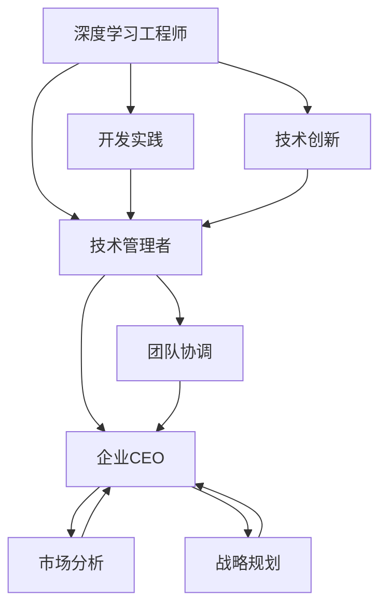

                 

# 从工程师到CEO：贾扬清的角色转变

> 关键词：大语言模型,微调(Fine-tuning),迁移学习,监督学习,Transformer,BERT,预训练,下游任务,参数高效微调,自然语言处理(NLP)

## 1. 背景介绍

### 1.1 问题由来
贾扬清，作为一位拥有丰富深度学习背景的工程师，在谷歌、微软、Facebook等知名科技公司任职期间，曾多次主导或参与大规模语言模型如BERT的开发和应用。他的工作经验不仅限于技术开发，还包括业务发展、团队管理等多个层面，为机器学习领域的企业发展提供了宝贵的视角。本文将从工程师的视角出发，探讨贾扬清在职业发展的过程中，如何从纯粹的深度学习工程师角色，逐步转变为公司CEO，并分享他关于技术、管理和市场的多维思考。

### 1.2 问题核心关键点
- **技术视角到商业视角的转变**：如何理解市场和技术的关系，如何将技术优势转化为商业价值？
- **团队管理与合作**：如何高效管理跨领域团队，实现技术团队的商业目标？
- **市场决策与产品定位**：如何平衡市场数据与技术创新，决定产品方向与定位？
- **企业战略与商业模式**：如何规划和实施企业战略，选择有效的商业模式？

### 1.3 问题研究意义
了解贾扬清的角色转变，不仅有助于理解深度学习技术如何实际应用在商业场景中，还能为从事技术管理的工程人员提供有益的参考和经验，推动技术的商业化进程。深入了解贾扬清的转型路径，还能帮助更多有志于管理与创业的工程师了解技术与管理融合的实践，为其未来职业生涯提供指导。

## 2. 核心概念与联系

### 2.1 核心概念概述

为更好地理解贾扬清的角色转变，本节将介绍几个密切相关的核心概念：

- **深度学习工程师**：从事深度学习技术研究与应用的专业人员，负责开发、训练和优化深度学习模型，解决具体技术问题。
- **技术管理者**：在技术团队中，不仅负责技术开发，还负责团队管理、项目规划、资源协调等工作，需具备跨学科能力。
- **企业CEO**：负责公司整体战略规划与执行、市场与产品管理、团队建设与文化塑造等，需具有全局视野和综合管理能力。

这些角色间的联系主要体现在：技术为商业提供支持，管理保障技术能够被高效执行，而CEO则需平衡技术与市场，实现公司的整体发展目标。

### 2.2 核心概念原理和架构的 Mermaid 流程图



这个流程图展示了深度学习工程师、技术管理者与企业CEO之间的逻辑联系：

1. 深度学习工程师专注于技术开发与创新。
2. 技术管理者在技术团队中负责项目管理和团队建设。
3. 企业CEO在全局层面上进行市场分析和战略规划。
4. 市场分析、战略规划是企业CEO决策的重要依据。
5. 技术团队的工作成果和创新为CEO的市场决策提供支持。
6. 技术团队的有效管理与执行，依赖于技术管理者的协调与推动。

## 3. 核心算法原理 & 具体操作步骤
### 3.1 算法原理概述

在深度学习领域，技术的迭代和发展为商业带来了诸多机遇。工程师必须深入理解技术的潜力和局限，并将其转化为商业价值。而技术管理者需要在这基础上，协调团队资源，制定技术应用的战略，并推动项目执行。CEO则需结合市场洞察，定义公司方向，并实现技术商业化的落地。

### 3.2 算法步骤详解

#### 3.2.1 技术视角：理解深度学习模型
- **模型选择**：根据任务特性选择适合的深度学习模型，如CNN用于图像处理、RNN用于时间序列预测、BERT用于自然语言处理。
- **参数调优**：通过网格搜索或优化算法，调整模型的超参数，如学习率、批量大小、激活函数等，以优化模型性能。
- **模型评估**：使用准确率、召回率、F1分数等指标评估模型效果，并进行交叉验证。

#### 3.2.2 管理视角：技术团队的构建与维护
- **招聘与筛选**：根据项目需求和团队建设策略，招聘技术背景优秀的人才。
- **团队协作**：建立良好的沟通机制，确保团队成员理解项目目标，协调工作进度。
- **技能培训**：定期组织技术培训，提升团队成员的技术能力和团队协作效率。

#### 3.2.3 商业视角：市场洞察与战略规划
- **市场分析**：收集市场数据，了解用户需求，识别机会与挑战。
- **产品定位**：结合市场分析结果，定义产品功能和特性，明确目标用户。
- **战略规划**：制定产品开发路线图，分配资源，确保项目按期推进。

### 3.3 算法优缺点

**优点**：
- **技术与市场结合**：技术开发符合市场需求，确保产品竞争力。
- **高效项目管理**：有效的团队管理，确保项目按时完成，提升资源利用效率。
- **全局战略规划**：CEO视角下的市场洞察与战略规划，确保公司整体发展方向明确。

**缺点**：
- **技术与市场协同难度大**：技术复杂性与市场变化快可能导致两者协调困难。
- **管理挑战**：团队资源分配与人员协调可能存在摩擦，影响项目推进。
- **战略执行风险**：市场和技术的不确定性可能带来项目失败的风险。

### 3.4 算法应用领域

深度学习工程师、技术管理者与企业CEO的角色转变与协同，广泛应用于多个领域，例如：

- **自然语言处理(NLP)**：通过深度学习模型，提升文本分类、信息检索、机器翻译等NLP任务的效果。
- **计算机视觉(CV)**：利用CNN等深度学习模型，实现图像识别、目标检测、人脸识别等功能。
- **智能推荐系统**：通过学习用户行为与偏好，推荐个性化内容，提升用户体验。
- **金融科技(Fintech)**：应用深度学习模型进行风险评估、信用评分、智能投顾等。
- **自动驾驶**：利用深度学习模型进行环境感知、路径规划、决策控制等。

这些领域中的企业，需要深度学习工程师的技术支持、技术管理者的项目协调与CEO的战略规划，共同推动技术商业化的落地。

## 4. 数学模型和公式 & 详细讲解  
### 4.1 数学模型构建

本节将使用数学语言对深度学习技术在商业场景中的应用进行严格刻画。

记深度学习模型为 $f_{\theta}(x)$，其中 $\theta$ 为模型参数，$x$ 为输入数据。假设模型在训练集 $D=\{(x_i, y_i)\}_{i=1}^N$ 上进行监督学习，则经验风险最小化问题可以表示为：

$$
\min_{\theta} \frac{1}{N} \sum_{i=1}^N \ell(f_{\theta}(x_i), y_i)
$$

其中 $\ell$ 为损失函数，常见的有均方误差、交叉熵等。

### 4.2 公式推导过程

以均方误差为例，假设模型输出 $y$，则均方误差损失函数为：

$$
\ell(y, \hat{y}) = \frac{1}{2}(y - \hat{y})^2
$$

对模型进行梯度下降优化，损失函数的梯度为：

$$
\nabla_{\theta}\ell = (y - f_{\theta}(x))\nabla_{\theta}f_{\theta}(x)
$$

根据梯度下降公式：

$$
\theta \leftarrow \theta - \eta \nabla_{\theta}\ell
$$

其中 $\eta$ 为学习率，具体选择依赖于实际问题和经验。

### 4.3 案例分析与讲解

假设我们需要开发一个NLP任务分类模型，选择BERT作为预训练模型，使用二分类交叉熵损失函数。具体步骤如下：

1. 准备训练数据集和标签。
2. 使用BERT模型，构建分类头，并设置相应的损失函数。
3. 定义优化器，如AdamW，并设置学习率。
4. 循环训练，每次更新模型参数，计算损失，更新模型。
5. 在验证集上进行性能评估，调整学习率或正则化参数。
6. 在测试集上进行最终性能评估。

这些步骤展示了大语言模型微调的基本流程，通过具体案例，加深对模型构建、参数更新等核心操作的理解。

## 5. 项目实践：代码实例和详细解释说明
### 5.1 开发环境搭建

在开始实践之前，需要搭建适合深度学习开发的开发环境：

1. 安装Python：推荐使用Anaconda，方便依赖管理和虚拟环境创建。
2. 安装深度学习框架：如TensorFlow、PyTorch等，根据项目需求进行选择。
3. 安装相关库：如TensorBoard、Weights & Biases等，用于监控训练过程和分析结果。
4. 准备数据集：准备训练集、验证集、测试集，并进行预处理和分批次加载。

### 5.2 源代码详细实现

下面以一个简单的NLP文本分类任务为例，展示大语言模型BERT的微调过程。

```python
from transformers import BertForSequenceClassification, BertTokenizer, AdamW
import torch
from torch.utils.data import DataLoader
from sklearn.metrics import accuracy_score

# 初始化模型和分词器
model = BertForSequenceClassification.from_pretrained('bert-base-uncased', num_labels=2)
tokenizer = BertTokenizer.from_pretrained('bert-base-uncased')

# 准备数据集
train_dataset = ...
train_dataloader = DataLoader(train_dataset, batch_size=32)
eval_dataset = ...
eval_dataloader = DataLoader(eval_dataset, batch_size=32)
test_dataset = ...
test_dataloader = DataLoader(test_dataset, batch_size=32)

# 定义优化器和损失函数
optimizer = AdamW(model.parameters(), lr=2e-5)
loss_fn = torch.nn.CrossEntropyLoss()

# 定义训练函数
def train_epoch(model, train_dataloader, optimizer, loss_fn):
    model.train()
    total_loss = 0
    for batch in train_dataloader:
        input_ids = batch['input_ids'].to(device)
        attention_mask = batch['attention_mask'].to(device)
        labels = batch['labels'].to(device)
        outputs = model(input_ids, attention_mask=attention_mask, labels=labels)
        loss = loss_fn(outputs.logits, labels)
        optimizer.zero_grad()
        loss.backward()
        optimizer.step()
        total_loss += loss.item()
    return total_loss / len(train_dataloader)

# 定义评估函数
def evaluate(model, eval_dataloader, loss_fn):
    model.eval()
    total_loss = 0
    total_preds = []
    for batch in eval_dataloader:
        input_ids = batch['input_ids'].to(device)
        attention_mask = batch['attention_mask'].to(device)
        labels = batch['labels'].to(device)
        with torch.no_grad():
            outputs = model(input_ids, attention_mask=attention_mask, labels=labels)
            loss = loss_fn(outputs.logits, labels)
            total_loss += loss.item()
            total_preds.append(outputs.logits.argmax(dim=1))
    return total_loss / len(eval_dataloader), accuracy_score(labels, total_preds)

# 训练和评估
epochs = 3
device = torch.device('cuda' if torch.cuda.is_available() else 'cpu')

for epoch in range(epochs):
    train_loss = train_epoch(model, train_dataloader, optimizer, loss_fn)
    eval_loss, eval_acc = evaluate(model, eval_dataloader, loss_fn)
    print(f'Epoch {epoch+1}, train loss: {train_loss:.3f}, eval loss: {eval_loss:.3f}, eval acc: {eval_acc:.3f}')

# 测试集评估
test_loss, test_acc = evaluate(model, test_dataloader, loss_fn)
print(f'Test loss: {test_loss:.3f}, test acc: {test_acc:.3f}')
```

### 5.3 代码解读与分析

以上代码展示了如何使用BERT模型进行文本分类任务的微调。

1. **模型初始化**：使用`BertForSequenceClassification`从预训练模型加载分类头，并定义损失函数。
2. **数据准备**：通过`BertTokenizer`对输入文本进行分词，并加载数据集。
3. **训练和评估函数**：定义训练和评估的具体流程，包括计算损失、更新模型参数、评估模型性能等。
4. **循环迭代**：在训练集上训练模型，并在验证集上评估性能，调整超参数，最终在测试集上给出最终的性能表现。

通过以上代码实例，可以帮助读者理解深度学习模型在微调过程中，从数据准备到模型训练、评估、优化的整体流程。

### 5.4 运行结果展示

通过运行上述代码，可以获得模型在训练集、验证集和测试集上的性能指标，如损失和准确率。

## 6. 实际应用场景

### 6.1 智能客服系统

在智能客服系统中，深度学习模型可以用于自动回答常见问题，提升客服响应速度和用户体验。具体实现如下：

1. 收集客户历史对话数据，构建训练集。
2. 选择适合的深度学习模型，如BERT或GPT，进行微调。
3. 设计合适的分类头，将问题分类为预定义的类别。
4. 在训练集上训练模型，并使用验证集进行调优。
5. 部署模型到生产环境，实时接收用户问题并生成响应。

### 6.2 金融舆情监测

金融领域需要实时监控舆情变化，以便及时应对市场波动。深度学习模型可以在此任务上发挥重要作用：

1. 收集金融新闻、评论等文本数据，构建训练集。
2. 使用BERT等大语言模型，进行舆情分类和情感分析。
3. 在训练集上训练模型，并使用验证集进行调优。
4. 部署模型到实时监控系统，持续监测舆情变化并自动预警。

### 6.3 个性化推荐系统

个性化推荐系统通过学习用户行为，推荐合适的商品或内容，提升用户体验。深度学习模型可以在此任务上发挥作用：

1. 收集用户浏览、购买等行为数据，构建训练集。
2. 使用BERT等大语言模型，学习用户兴趣表示。
3. 在训练集上训练模型，并使用验证集进行调优。
4. 部署模型到推荐系统，实时生成个性化推荐。

### 6.4 未来应用展望

随着深度学习技术的不断发展，深度学习模型将在更多领域得到应用，例如：

- **医疗领域**：用于疾病预测、患者分诊、药物发现等。
- **智能家居**：用于设备控制、场景识别、语音交互等。
- **智慧城市**：用于交通管理、环境监测、公共安全等。
- **智能制造**：用于质量检测、设备维护、工艺优化等。

未来，深度学习模型将与各行各业深度融合，推动智能技术的发展和应用。

## 7. 工具和资源推荐
### 7.1 学习资源推荐

为了帮助读者深入理解深度学习模型的应用，这里推荐一些优质的学习资源：

1. Coursera《深度学习》课程：由斯坦福大学教授Andrew Ng主讲的经典课程，系统介绍深度学习的基本概念和常用技术。
2. Deep Learning Specialization by Andrew Ng：Coursera上的深度学习专业课程，涵盖从基础到高级的多个模块。
3. Hands-On Machine Learning with Scikit-Learn, Keras, and TensorFlow：O'Reilly出版的书籍，详细讲解使用Scikit-Learn、Keras和TensorFlow进行机器学习开发的实践技巧。
4. PyTorch官方文档：PyTorch的详细文档，提供丰富的API接口和示例代码，是学习PyTorch的重要资源。
5. TensorFlow官方文档：TensorFlow的详细文档，提供完整的框架使用指南和示例代码，是学习TensorFlow的重要参考。

### 7.2 开发工具推荐

选择适当的开发工具，可以显著提升深度学习模型的开发效率。以下是几款推荐的开发工具：

1. PyTorch：基于Python的开源深度学习框架，支持动态计算图，灵活方便，适合快速迭代。
2. TensorFlow：由Google主导开发的深度学习框架，稳定可靠，生产部署方便，支持分布式计算。
3. Jupyter Notebook：支持编写、执行和分享Python代码的交互式开发环境，方便记录和共享研究过程。
4. VSCode：强大的开发IDE，支持多种语言和工具集成，提供丰富的扩展和插件支持。
5. Google Colab：谷歌提供的云端Jupyter Notebook环境，免费提供GPU/TPU算力，适合大规模实验。

### 7.3 相关论文推荐

深度学习模型的研究进展非常迅速，以下是几篇奠基性的相关论文，推荐阅读：

1. AlexNet：ImageNet大规模视觉识别挑战赛的冠军模型，展示了深度卷积神经网络在图像识别任务上的潜力。
2. RNN与LSTM：长期依赖性问题的经典模型，用于自然语言处理和语音识别等任务。
3. BERT：大规模预训练语言模型，通过掩码语言模型和下一句预测任务，显著提升语言理解和生成能力。
4. GPT系列：基于自回归模型的生成模型，能够生成流畅自然的文本。
5. Transformer：基于自注意力机制的模型，广泛应用于自然语言处理和计算机视觉等任务。

## 8. 总结：未来发展趋势与挑战
### 8.1 研究成果总结

深度学习模型在过去几年中取得了巨大的进步，广泛应用于各种行业领域。然而，随着模型规模的不断增大，资源消耗和训练成本也在不断增加，如何高效地开发和部署模型，成为了一个重要挑战。

### 8.2 未来发展趋势

未来的深度学习技术将呈现以下几个发展趋势：

1. **模型的可解释性**：深度学习模型的决策过程变得越来越复杂，如何提高模型的可解释性，使其更容易被理解和解释，是一个重要的研究方向。
2. **模型的压缩与优化**：随着模型规模的不断增大，资源消耗和训练成本也在不断增加，如何高效地开发和部署模型，成为了一个重要挑战。
3. **跨领域模型的迁移学习**：如何在不同领域之间进行模型迁移，提升模型的通用性和适应性，是一个重要方向。
4. **深度学习与其他AI技术的融合**：如何与其他AI技术，如强化学习、知识图谱等进行融合，提高深度学习模型的表现，是一个重要研究方向。

### 8.3 面临的挑战

尽管深度学习模型取得了巨大的成功，但仍面临诸多挑战：

1. **数据依赖**：深度学习模型依赖大量的标注数据进行训练，如何获取高质量的标注数据，是一个重要挑战。
2. **过拟合问题**：深度学习模型容易过拟合，如何设计合适的正则化方法，防止过拟合，是一个重要研究方向。
3. **模型泛化能力**：深度学习模型在训练数据上表现良好，但在测试数据上泛化能力较弱，如何提高模型的泛化能力，是一个重要挑战。
4. **模型公平性**：深度学习模型容易学习到数据中的偏见，如何消除模型的偏见，确保模型的公平性，是一个重要研究方向。

### 8.4 研究展望

面对深度学习模型的诸多挑战，未来的研究需要在以下几个方面寻求新的突破：

1. **自监督学习**：通过无监督学习方式，从数据中学习到更好的特征表示，减少对标注数据的依赖。
2. **迁移学习**：在已有模型的基础上，通过迁移学习方式，快速适应新领域和新任务。
3. **模型压缩与优化**：通过模型压缩和优化技术，减少模型参数和计算资源消耗，提高模型的效率。
4. **公平性与可解释性**：通过公平性约束和可解释性方法，确保模型的公平性和透明性，提高模型的可信度。

这些研究方向将推动深度学习模型的发展，提升其在各行业领域的应用价值。

## 9. 附录：常见问题与解答

**Q1：深度学习模型为什么需要大量的标注数据？**

A: 深度学习模型需要大量的标注数据，是因为其在训练过程中需要通过梯度下降算法优化参数，以最小化损失函数。标注数据提供了模型训练的目标和反馈，帮助模型学习到数据的真实分布。

**Q2：如何选择深度学习模型？**

A: 选择深度学习模型需要考虑任务特性和数据类型。例如，图像处理任务可以选择卷积神经网络(CNN)，自然语言处理任务可以选择循环神经网络(RNN)或变压器(Transformer)。

**Q3：如何进行模型评估？**

A: 模型评估通常使用准确率、召回率、F1分数等指标，可以通过交叉验证或保留一部分数据作为验证集进行评估。

**Q4：如何避免过拟合？**

A: 避免过拟合的方法包括增加数据量、使用正则化方法、早停法、Dropout等。

**Q5：深度学习模型如何部署？**

A: 深度学习模型的部署通常包括模型压缩、量化、优化图转换等步骤。同时需要考虑模型的可解释性、可扩展性和可维护性。

---

作者：禅与计算机程序设计艺术 / Zen and the Art of Computer Programming

