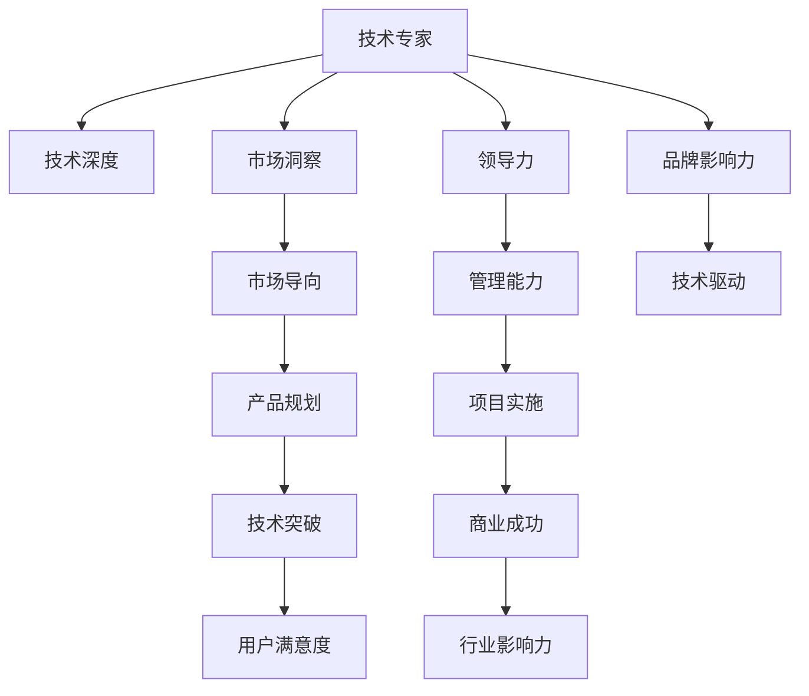

                 

# 从技术专家到行业意见领袖

---

## 1. 背景介绍

### 1.1 问题由来

随着人工智能技术的不断发展和普及，越来越多的技术专家逐渐崭露头角，成为各自领域的意见领袖。这些技术专家在技术研究、产品开发、市场应用等各个方面都展现了卓越的才能和深远的影响力。然而，如何从一名技术专家成长为行业意见领袖，需要突破多个层面的挑战。本文将从技术、市场、管理等多个角度，探讨这一转型过程的关键因素和有效策略。

### 1.2 问题核心关键点

技术专家转变为行业意见领袖的关键在于：
- **技术深度**：拥有扎实的技术基础，对领域内核心技术有深刻的理解和见解。
- **市场洞察**：能够敏锐捕捉市场变化趋势，把握用户需求和市场机会。
- **领导力**：具备卓越的团队管理和沟通能力，能够带领团队实现技术突破和商业成功。
- **品牌影响力**：通过技术输出、公开演讲、文章撰写等方式，建立个人品牌，成为行业内的权威声音。

## 2. 核心概念与联系

### 2.1 核心概念概述

为更好地理解技术专家向行业意见领袖的转型，本节将介绍几个密切相关的核心概念：

- **技术专家**：在特定技术领域内具备深厚知识积累、丰富实践经验，能够解决复杂技术问题的专家。
- **行业意见领袖**：不仅在技术上有所建树，还能够在市场、管理、战略等多个层面提供洞察，对行业发展有重要影响的人士。
- **技术驱动**：以技术创新为核心，持续推动产品和服务升级，满足市场和用户需求。
- **市场导向**：关注市场趋势和用户需求，以市场需求为导向，进行产品规划和技术突破。
- **管理能力**：具备领导团队、资源配置、项目管理等综合能力，确保项目顺利进行。
- **品牌影响力**：通过技术输出、公开演讲、文章撰写等途径，建立个人品牌，成为行业内的权威声音。

这些核心概念之间的逻辑关系可以通过以下Mermaid流程图来展示：

这个流程图展示了几类关键角色及其相互关系：

1. 技术专家通过技术深度、市场洞察、领导力、品牌影响力等多个维度，成长为行业意见领袖。
2. 技术驱动和市场导向是实现商业成功的两个关键因素。
3. 产品规划、技术突破、项目管理、项目实施等环节，共同构成技术专家向行业意见领袖转型的路径。
4. 品牌影响力有助于在行业内建立权威地位，进一步提升影响力。

## 3. 核心算法原理 & 具体操作步骤
### 3.1 算法原理概述

技术专家向行业意见领袖的转型，本质上是技术、市场、管理等多方面能力的综合提升。以下是几个关键阶段的技术和操作流程：

**阶段一：技术深化**
- **目标**：在特定技术领域内，建立深入理解和应用能力。
- **方法**：持续学习和研究，参加行业会议、培训课程，阅读权威文献和技术博客。
- **工具**：GitHub、Stack Overflow、ResearchGate等技术社区和文献数据库。

**阶段二：市场洞察**
- **目标**：理解市场需求和趋势，把握用户痛点和机会。
- **方法**：进行市场调研，参与用户访谈和焦点小组，利用数据分析工具进行用户行为分析。
- **工具**：Google Analytics、SurveyMonkey、Tableau等。

**阶段三：领导力提升**
- **目标**：提升团队管理和沟通能力，能够有效地协调团队资源，实现技术突破和商业目标。
- **方法**：参加管理培训，建立良好的团队文化，通过实际项目锻炼管理能力。
- **工具**：Trello、Asana、Slack等协作工具。

**阶段四：品牌塑造**
- **目标**：建立个人品牌，成为行业内的权威声音。
- **方法**：通过技术文章、公开演讲、技术报告等方式分享技术见解，积极参与行业会议和活动。
- **工具**：Medium、TEDx、IEEE等平台。

### 3.2 算法步骤详解

以下是技术专家向行业意见领袖转型的详细操作步骤：

**第一步：明确技术定位**
- **行动**：评估自身技术特长和兴趣领域，确定主要技术方向。
- **工具**：技术栈分析工具、兴趣评估问卷。

**第二步：技术深化**
- **行动**：在选定的技术方向上，深入学习和研究，掌握最新技术动态和最佳实践。
- **工具**：在线课程、开源社区、技术博客。

**第三步：市场调研**
- **行动**：通过调研和访谈，深入了解目标市场的需求和用户痛点。
- **工具**：问卷调查工具、用户访谈工具、数据分析平台。

**第四步：产品规划**
- **行动**：基于市场调研结果，规划产品功能和设计，进行用户测试和迭代。
- **工具**：用户测试平台、敏捷开发框架、版本控制系统。

**第五步：技术突破**
- **行动**：利用技术深化和市场调研，实现技术创新，解决用户痛点。
- **工具**：技术实验室、代码版本管理工具、测试框架。

**第六步：项目管理**
- **行动**：规划项目进度，合理分配资源，确保项目按时交付。
- **工具**：项目管理软件、任务管理工具、沟通工具。

**第七步：团队管理**
- **行动**：建立团队文化，培养团队成员，进行有效沟通和协作。
- **工具**：团队协作平台、沟通工具、团队建设活动。

**第八步：品牌塑造**
- **行动**：通过技术输出、公开演讲、文章撰写等方式，分享技术见解，提升个人品牌影响力。
- **工具**：技术博客、社交媒体、演讲平台。

### 3.3 算法优缺点

技术专家向行业意见领袖转型的优势和劣势如下：

**优势**：
- **深度技术积累**：对特定技术领域有深入理解，能够提供专业的技术见解。
- **市场敏感性**：基于技术洞察，能够快速捕捉市场机会，推出符合用户需求的产品。
- **管理经验**：具备领导团队和项目管理的实践经验，能够高效协调资源。

**劣势**：
- **市场认知不足**：对市场变化和用户需求理解不够深入，可能导致产品错位。
- **品牌知名度低**：个人品牌影响力有限，难以在行业内建立权威地位。
- **沟通能力不足**：缺乏有效的沟通技巧，难以形成强大的团队和合作伙伴关系。

### 3.4 算法应用领域

技术专家向行业意见领袖的转型，适用于多个领域：

- **软件开发**：通过技术深化、市场洞察、团队管理，成长为软件架构师、CTO等关键角色。
- **数据科学**：在数据处理、机器学习、深度学习等方向深入研究，成为数据科学家或AI研究员。
- **产品管理**：基于技术洞察和市场调研，规划和优化产品功能，提升用户体验。
- **硬件设计**：在硬件技术、市场应用方面持续创新，成为硬件产品总监或技术总监。
- **咨询服务**：提供行业技术咨询、解决方案设计，帮助企业提升技术能力和业务水平。

## 4. 数学模型和公式 & 详细讲解 & 举例说明

### 4.1 数学模型构建

本节将使用数学语言对技术专家向行业意见领袖转型的关键步骤进行更加严格的刻画。

假设技术专家通过技术深化和市场洞察，获得的能力分别为 $T$ 和 $M$。品牌影响力 $B$ 可以表示为：

$$
B = f(T, M, L)
$$

其中 $L$ 为领导力，其影响因素包括团队管理能力 $M$、沟通协调能力 $C$ 等。则品牌影响力的数学模型可以表示为：

$$
B = g(T, M, C)
$$

通过这个模型，我们可以理解技术专家向行业意见领袖转型的关键在于，通过技术深化和市场洞察，提升自身能力 $T$ 和 $M$，并利用领导力 $L$ 进行有效的团队管理和沟通协调。

### 4.2 公式推导过程

以下我们以软件开发领域为例，推导技术专家向CTO转型的关键因素。

**目标函数**：
- **技术深度**：$T = \sum_{i=1}^{n} T_i$
- **市场洞察**：$M = \sum_{j=1}^{m} M_j$
- **领导力**：$L = \sum_{k=1}^{l} L_k$

其中 $n$、$m$、$l$ 分别表示技术维度、市场维度、领导维度的数量。

**约束条件**：
- 技术深化和市场洞察需满足实际应用需求，即：$T \geq T_{min}$，$M \geq M_{min}$
- 团队管理能力和沟通协调能力需满足实际需求，即：$L \geq L_{min}$

**优化目标**：最大化品牌影响力 $B$

通过求解上述优化问题，可以找到技术专家向CTO转型的关键路径和关键因素。

### 4.3 案例分析与讲解

以下是一个软件开发领域的案例分析：

**背景**：某技术专家擅长前端开发，但在市场调研和团队管理方面相对薄弱。

**步骤**：
1. **技术深化**：深入研究前端技术栈，掌握最新框架和技术动态。
2. **市场调研**：与产品经理、用户进行访谈，了解市场需求和用户痛点。
3. **产品规划**：基于市场调研结果，规划前端产品功能和设计，进行用户测试和迭代。
4. **技术突破**：利用技术深化和市场调研，实现技术创新，提升产品性能。
5. **项目管理**：规划项目进度，合理分配资源，确保项目按时交付。
6. **团队管理**：建立前端开发团队，培养团队成员，进行有效沟通和协作。
7. **品牌塑造**：通过技术文章、公开演讲、文章撰写等方式，分享技术见解，提升个人品牌影响力。

**结果**：该技术专家成功转型为前端团队技术主管，带领团队完成了多个重要项目，提升品牌知名度，成为行业内的权威声音。

## 5. 项目实践：代码实例和详细解释说明

### 5.1 开发环境搭建

在进行技术专家向行业意见领袖的转型实践前，我们需要准备好开发环境。以下是使用Python进行软件开发实践的环境配置流程：

1. 安装Python：从官网下载并安装Python，确保版本与项目兼容。
2. 安装必要的开发工具：如IDE、版本控制系统、项目管理工具等。
3. 设置开发环境：创建虚拟环境，安装所需库和依赖。
4. 配置开发工具：如调试器、测试框架、代码质量检查工具等。

完成上述步骤后，即可在虚拟环境中开始项目实践。

### 5.2 源代码详细实现

这里以软件开发项目为例，展示技术专家向CTO转型的关键步骤。

**第一步：技术栈分析**
- 使用技术栈分析工具，评估现有技术和所需技术，列出技术缺口和需求。

**第二步：技术深化**
- 选择技术缺口较大的领域，利用在线课程、开源社区等资源，进行深入学习和研究。
- 编写技术博客，总结学习心得，与社区分享。

**第三步：市场调研**
- 使用问卷调查工具，收集用户反馈和需求。
- 与产品经理、用户进行访谈，了解市场变化和用户痛点。

**第四步：产品规划**
- 使用敏捷开发框架，进行需求分析和功能规划。
- 使用版本控制系统，进行代码管理和团队协作。

**第五步：技术突破**
- 利用技术深化和市场调研结果，进行技术创新和实现。
- 使用测试框架，进行单元测试和集成测试。

**第六步：项目管理**
- 使用项目管理工具，规划项目进度和资源分配。
- 定期进行项目进展汇报，确保项目按时交付。

**第七步：团队管理**
- 使用团队协作平台，进行团队沟通和任务分配。
- 定期组织团队建设活动，提升团队凝聚力。

**第八步：品牌塑造**
- 通过技术博客、社交媒体、演讲平台等方式，分享技术见解和项目成果。
- 参与行业会议和活动，建立行业联系。

### 5.3 代码解读与分析

让我们再详细解读一下关键代码的实现细节：

**技术栈分析工具**
- 使用Scrapy爬虫框架，抓取GitHub上的技术博客，提取关键词和链接。
- 使用NLP工具，分析技术博客的关键词分布，评估技术栈需求。

**技术深化**
- 选择热门框架，如React、Vue等，进行深入学习和实践。
- 编写技术博客，使用Markdown语法，发布到技术社区。

**市场调研**
- 使用SurveyMonkey，设计问卷，收集用户反馈。
- 与产品经理、用户进行访谈，记录访谈要点。

**产品规划**
- 使用JIRA或Trello等敏捷开发工具，进行需求分析和任务分解。
- 使用版本控制系统，如Git，进行代码管理和版本控制。

**技术突破**
- 使用测试框架，如JUnit，进行单元测试和集成测试。
- 使用CI/CD工具，如Jenkins，自动化测试和部署。

**项目管理**
- 使用Asana或Trello等项目管理工具，规划项目进度和资源分配。
- 定期进行项目进展汇报，使用Jira等工具进行任务跟踪。

**团队管理**
- 使用Slack或微信等协作工具，进行团队沟通和任务分配。
- 定期组织技术分享会和团队建设活动，提升团队凝聚力。

**品牌塑造**
- 使用Medium或CSDN等技术博客平台，发布技术文章。
- 参加行业会议和活动，如TEDx、IEEE，进行公开演讲和交流。

通过这些实践步骤，技术专家可以逐步提升自身能力，向CTO等关键角色转型。

## 6. 实际应用场景

### 6.1 智能制造

技术专家在智能制造领域可以发挥重要作用，通过技术深化和市场洞察，推动制造业的数字化转型。

**背景**：传统制造业面临生产效率低下、质量控制不严格等问题，亟需数字化手段提升生产效率和质量。

**行动**：
1. **技术深化**：掌握工业4.0技术，如物联网、大数据、人工智能等。
2. **市场调研**：了解制造业客户的需求和痛点，如生产效率、质量控制、设备管理等。
3. **产品规划**：基于技术洞察和市场调研结果，规划智能制造产品功能和设计。
4. **技术突破**：利用技术深化和市场调研，实现技术创新，如智能监控、预测性维护等。
5. **项目管理**：规划项目进度，合理分配资源，确保项目按时交付。
6. **团队管理**：建立智能制造团队，培养团队成员，进行有效沟通和协作。
7. **品牌塑造**：通过技术文章、公开演讲、文章撰写等方式，分享技术见解，提升个人品牌影响力。

**结果**：该技术专家成功转型为智能制造领域的CTO，推动了多个智能制造项目实施，提升生产效率和质量，获得了行业的高度认可。

### 6.2 医疗健康

技术专家在医疗健康领域可以推动医疗信息化和智能化发展。

**背景**：医疗健康领域对信息化和智能化需求日益增长，但技术应用和落地存在诸多挑战。

**行动**：
1. **技术深化**：掌握医疗信息化技术，如电子病历、医疗影像分析等。
2. **市场调研**：了解医疗机构的需求和痛点，如数据管理、患者服务、医疗决策等。
3. **产品规划**：基于技术洞察和市场调研结果，规划医疗信息化产品功能和设计。
4. **技术突破**：利用技术深化和市场调研，实现技术创新，如智能诊断、患者管理系统等。
5. **项目管理**：规划项目进度，合理分配资源，确保项目按时交付。
6. **团队管理**：建立医疗信息化团队，培养团队成员，进行有效沟通和协作。
7. **品牌塑造**：通过技术文章、公开演讲、文章撰写等方式，分享技术见解，提升个人品牌影响力。

**结果**：该技术专家成功转型为医疗信息化领域的CTO，推动了多个医疗信息化项目实施，提升了医疗服务的效率和质量，获得了行业的高度认可。

### 6.3 智慧城市

技术专家在智慧城市领域可以推动城市治理的智能化和高效化。

**背景**：智慧城市建设需要大量新技术的支撑，如物联网、大数据、人工智能等。

**行动**：
1. **技术深化**：掌握智慧城市技术，如智能交通、智慧环保、城市管理等。
2. **市场调研**：了解智慧城市管理部门的需求和痛点，如交通管理、公共安全、环境监测等。
3. **产品规划**：基于技术洞察和市场调研结果，规划智慧城市产品功能和设计。
4. **技术突破**：利用技术深化和市场调研，实现技术创新，如智能交通系统、城市大数据平台等。
5. **项目管理**：规划项目进度，合理分配资源，确保项目按时交付。
6. **团队管理**：建立智慧城市团队，培养团队成员，进行有效沟通和协作。
7. **品牌塑造**：通过技术文章、公开演讲、文章撰写等方式，分享技术见解，提升个人品牌影响力。

**结果**：该技术专家成功转型为智慧城市领域的CTO，推动了多个智慧城市项目实施，提升了城市治理的智能化和高效化，获得了行业的高度认可。

### 6.4 未来应用展望

随着技术专家向行业意见领袖转型的成功案例不断涌现，未来这一过程将更加普遍和成熟。

**趋势**：
1. **技术创新加速**：技术深化和市场洞察将更加频繁和深入，推动技术创新不断涌现。
2. **行业影响力扩大**：品牌塑造和公开演讲等活动将更加频繁，提升行业影响力。
3. **跨领域融合**：技术专家将更多跨领域融合，推动多个领域的创新发展。
4. **技术人才培养**：技术专家将更多关注技术人才培养，提升行业整体技术水平。

**挑战**：
1. **技术深度不足**：技术深化和市场洞察需要持续投入，保持技术领先。
2. **市场变化快速**：市场调研和产品规划需快速响应，跟上市场变化。
3. **领导力提升**：团队管理和沟通协调需不断提升，确保项目顺利实施。
4. **品牌认知度低**：品牌塑造需系统推进，提升行业认知度。

通过积极应对这些挑战，技术专家将能更好地实现向行业意见领袖的转型，推动技术的持续发展和应用。

## 7. 工具和资源推荐

### 7.1 学习资源推荐

为了帮助技术专家系统掌握向行业意见领袖转型的理论基础和实践技巧，这里推荐一些优质的学习资源：

1. **《从0到1：打造技术领导力》**：通过实例和案例分析，深入讲解技术领导力的培养过程。
2. **《产品管理：实战指南》**：详细介绍产品管理的关键环节和最佳实践，帮助技术专家转型为产品经理。
3. **《管理学：理论与实践》**：系统介绍管理学的理论和实践，帮助技术专家提升领导力和团队管理能力。
4. **《品牌营销：打造个人品牌》**：提供品牌塑造和市场营销的策略和方法，帮助技术专家提升品牌影响力。
5. **《数据科学：从入门到精通》**：深入讲解数据科学的理论和技术，帮助技术专家掌握数据处理和分析能力。

通过对这些资源的学习实践，相信技术专家能够快速掌握向行业意见领袖转型的精髓，并用于解决实际的行业问题。

### 7.2 开发工具推荐

高效的开发离不开优秀的工具支持。以下是几款用于技术专家向行业意见领袖转型的常用工具：

1. **GitHub**：全球最大的开源社区，提供丰富的代码库和技术交流平台。
2. **JIRA**：敏捷项目管理工具，帮助团队进行任务管理和进度跟踪。
3. **Slack**：团队协作工具，支持实时沟通和文件共享。
4. **Trello**：任务管理工具，支持卡片化管理和任务优先级设置。
5. **Medium**：技术文章发布平台，支持多语言和技术话题的讨论。
6. **TEDx**：公开演讲平台，提供全球各地的技术演讲和交流机会。
7. **CSDN**：国内知名的技术博客和社区，提供丰富的技术文章和社区讨论。

合理利用这些工具，可以显著提升技术专家向行业意见领袖转型的开发效率，加快创新迭代的步伐。

### 7.3 相关论文推荐

技术专家向行业意见领袖转型的研究源于学界的持续研究。以下是几篇奠基性的相关论文，推荐阅读：

1. **《从技术专家到行业领袖：个人品牌建设与影响力提升》**：通过实证研究和案例分析，深入探讨技术专家转型为行业领袖的策略和方法。
2. **《技术创新与市场导向：向行业意见领袖转型的路径》**：系统分析技术创新和市场导向的关系，提出转型的关键步骤和方法。
3. **《领导力与团队管理：构建技术团队的有效策略》**：深入探讨领导力和团队管理的理论和技术，帮助技术专家提升团队管理能力。
4. **《品牌建设与营销：技术专家的品牌影响力构建》**：详细介绍品牌建设的方法和策略，帮助技术专家提升品牌认知度。
5. **《数据科学与技术专家转型：从技术到决策者的跨越》**：深入探讨数据科学对技术专家的影响和作用，提出转型的关键路径和策略。

这些论文代表了大语言模型微调技术的发展脉络。通过学习这些前沿成果，可以帮助技术专家把握学科前进方向，激发更多的创新灵感。

## 8. 总结：未来发展趋势与挑战

### 8.1 总结

本文对技术专家向行业意见领袖的转型过程进行了全面系统的介绍。首先阐述了技术专家转型的背景和意义，明确了转型的关键因素和步骤。其次，从技术、市场、管理等多个角度，详细讲解了转型的具体操作方法和实践技巧。最后，总结了转型的未来发展趋势和面临的挑战，提供了明确的研究展望。

通过本文的系统梳理，可以看到，技术专家向行业意见领袖的转型，是一个涉及技术、市场、管理等多方面的综合过程，需要不断学习和实践，不断提升自身能力。只有从多个维度综合发力，才能实现成功的转型。

### 8.2 未来发展趋势

展望未来，技术专家向行业意见领袖的转型将呈现以下几个发展趋势：

1. **技术深度持续提升**：技术专家将持续深化技术理解，掌握最新技术动态，保持技术领先。
2. **市场洞察力增强**：技术专家将更加敏锐地捕捉市场变化，把握用户需求和机会，提升市场竞争力。
3. **领导力不断提升**：技术专家将提升团队管理和沟通协调能力，构建高效的团队和合作伙伴关系。
4. **品牌影响力扩大**：技术专家将通过技术输出、公开演讲、文章撰写等方式，提升个人品牌认知度和影响力。
5. **跨领域融合加速**：技术专家将更多跨领域融合，推动多个领域的创新发展。

### 8.3 面临的挑战

尽管技术专家向行业意见领袖的转型取得了不少成功案例，但在迈向更加智能化、普适化应用的过程中，它仍面临诸多挑战：

1. **技术深化难度大**：保持技术领先需要持续投入，技术深化和市场洞察需不断推进。
2. **市场变化快**：快速响应市场变化和用户需求，需不断优化产品规划和实施。
3. **领导力提升困难**：提升团队管理和沟通协调能力，需不断学习和实践。
4. **品牌认知度低**：提升品牌影响力，需系统推进和持续投入。

### 8.4 研究展望

面对转型面临的挑战，未来的研究需要在以下几个方面寻求新的突破：

1. **持续学习机制**：建立持续学习的机制，通过在线课程、读书会等形式，不断提升技术深度和市场洞察力。
2. **跨领域融合技术**：探索跨领域融合的技术路径，推动多个领域的创新发展。
3. **团队管理优化**：引入敏捷管理、精益管理等方法，提升团队管理效率和质量。
4. **品牌建设策略**：制定系统的品牌建设策略，提升品牌认知度和影响力。
5. **技术创新体系**：建立技术创新体系，推动技术的持续发展和应用。

通过这些研究方向的探索，技术专家将能更好地实现向行业意见领袖的转型，推动技术的持续发展和应用。

## 9. 附录：常见问题与解答

**Q1：技术专家转型是否需要跨领域学习？**

A: 技术专家转型需要跨领域学习，特别是在产品管理和团队管理方面。跨领域学习不仅能拓宽视野，还能提升综合能力。例如，技术专家可以学习市场营销、项目管理、人力资源等领域的知识，提升整体竞争力。

**Q2：技术专家如何提升领导力？**

A: 提升领导力需要从多个方面进行提升：
1. **学习管理知识**：通过学习管理理论和实践，提升管理能力和团队管理水平。
2. **实践项目经验**：通过参与实际项目，积累管理经验，提升领导能力。
3. **团队建设活动**：组织团队建设活动，提升团队凝聚力和协作能力。
4. **参加培训课程**：参加管理培训课程，提升领导力。

**Q3：技术专家如何提升品牌影响力？**

A: 提升品牌影响力需要从多个方面进行提升：
1. **技术输出**：通过技术博客、技术报告等形式，分享技术见解，提升专业影响力。
2. **公开演讲**：参加公开演讲、行业会议等活动，提升公众认知度。
3. **技术交流**：参加技术社区、技术沙龙等活动，进行技术交流和分享。
4. **媒体曝光**：通过媒体报道、技术博客等形式，提升品牌曝光度。

**Q4：技术专家转型是否需要不断学习？**

A: 技术专家转型需要不断学习，特别是在技术、市场、管理等多个领域。持续学习不仅能提升自身能力，还能跟上技术发展的步伐。例如，技术专家可以定期参加技术培训、读书会、行业会议等活动，保持学习的热情和动力。

通过不断学习和实践，技术专家将能更好地实现向行业意见领袖的转型，推动技术的持续发展和应用。

---

作者：禅与计算机程序设计艺术 / Zen and the Art of Computer Programming

