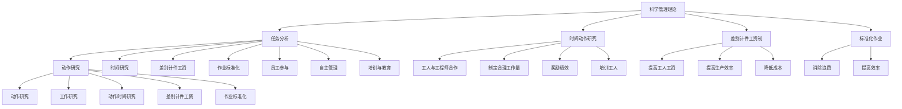
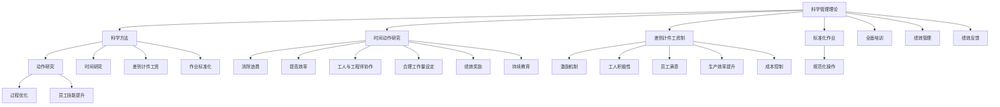

                 

# 从经典到实践：管理理论的落地

## 1. 背景介绍

### 1.1 问题由来

管理理论的研究与实践，自泰勒的科学管理理论发轫，历经百年历史，发展出了众多经典的管理学派。然而，这些理论在实际落地应用中，面临着诸多现实挑战：

- **理论滞后现实**：现有管理理论大多是基于特定历史条件和社会背景形成的，难以适应快速变化的市场环境和技术条件。
- **实践难以复制**：一些管理理论尽管在特定公司或行业有效，但难以在更广泛的场景下泛化应用。
- **理论与实践脱节**：理论在实践中缺乏操作性，缺乏对实际管理活动的指导意义。

为解决这些问题，本文章将探讨如何从经典管理理论中汲取营养，结合现代管理实践，构建具有高度落地性和实用性的管理知识体系。本文将重点关注三大管理理论：泰勒的科学管理、波特的五力模型、以及德鲁克的目标管理，并逐一阐述其现代落地应用。

### 1.2 问题核心关键点

管理理论的落地应用，需关注以下几个关键点：

- **理论与实践的有机结合**：确保管理理论在具体实践中有明确的指导意义和操作路径。
- **适应性创新**：在继承经典理论的同时，结合新环境、新技术，实现理论的持续演进和更新。
- **全面覆盖**：构建涵盖企业战略、组织结构、人力资源、运营管理等多个维度的综合性管理知识体系。
- **可操作性强**：理论需具备清晰的实施步骤和方法论，易于复制和推广。

本文将聚焦于上述问题关键点，通过深入挖掘经典管理理论，并结合实际管理实践，展现其如何从理论走向实践，最终推动企业管理效率提升和组织发展。

## 2. 核心概念与联系

### 2.1 核心概念概述

为了更好地理解管理理论的落地实践，本节将介绍几个关键核心概念：

- **科学管理理论**：弗雷德里克·泰勒提出的管理理论，强调通过科学方法和程序来提高工作效率和劳动生产率。
- **五力模型**：迈克尔·波特提出的竞争分析框架，用于分析企业所在行业的竞争态势，指导企业制定战略。
- **目标管理**：彼得·德鲁克提出的管理方法，通过设定明确的目标和指标，激励员工完成既定任务，提升组织绩效。

### 2.2 核心概念原理和架构的 Mermaid 流程图



### 2.3 核心概念之间的联系

这些核心概念之间的联系可以通过以下流程图示例来展示：



通过以上流程图，可以清晰地看到科学管理理论通过科学方法和过程优化，提升劳动效率和生产率，并通过激励机制和绩效管理，激发员工积极性，最终实现企业目标。

## 3. 核心算法原理 & 具体操作步骤

### 3.1 算法原理概述

管理理论的落地实践，本质上是将抽象的理论转化为具体的管理实践和管理工具的过程。这一过程需要遵循科学的方法论，结合具体的管理情境，构建操作性强、易于执行的管理系统。

具体而言，管理理论的落地包括以下几个步骤：

1. **理论框架构建**：根据经典管理理论，构建系统的理论框架。
2. **实践工具设计**：设计符合理论框架的实践工具和操作流程。
3. **实践检验与优化**：在实际管理活动中检验工具的有效性，并根据反馈进行优化。
4. **持续改进与创新**：在工具和流程应用中不断总结经验，进行持续改进和创新。

### 3.2 算法步骤详解

**步骤 1: 理论框架构建**

1. **科学管理理论**：
   - **任务分析**：明确各岗位的职责和工作内容，避免职责重叠和模糊。
   - **动作研究**：分析操作过程，消除不必要动作和浪费。
   - **时间研究**：记录每项操作所需时间，制定合理的工作量。
   - **标准化作业**：制定标准作业流程，提高作业效率。

2. **五力模型**：
   - **行业竞争分析**：分析行业内竞争对手、替代品、供应商、买方和潜在进入者。
   - **战略制定**：根据分析结果，制定竞争策略，提升市场份额和盈利能力。

3. **目标管理**：
   - **设定目标**：根据公司战略，设定各部门和员工的具体目标。
   - **制定计划**：制定实现目标的具体行动计划。
   - **绩效评估**：设定绩效指标，定期评估目标达成情况。

**步骤 2: 实践工具设计**

1. **科学管理工具**：
   - **差别计件工资制**：根据工作量和完成情况，给予不同工资激励，激发员工积极性。
   - **标准化作业单**：记录每个工作环节的标准操作，便于培训和检查。

2. **五力模型工具**：
   - **竞争态势分析表**：记录和分析行业内各竞争力要素，辅助制定战略。
   - **SWOT分析**：评估企业的优势、劣势、机会和威胁，指导战略制定。

3. **目标管理工具**：
   - **SMART目标设定表**：确保目标具有明确性、可衡量性、可达成性、相关性和时限性。
   - **KPI指标设定表**：根据目标设定关键绩效指标，定期评估和反馈。

**步骤 3: 实践检验与优化**

1. **科学管理实践**：
   - **持续培训**：定期培训员工，提高其技能和操作规范性。
   - **绩效评估**：根据工作量和时间研究结果，定期评估员工绩效，提供反馈和奖励。

2. **五力模型实践**：
   - **定期分析**：定期更新竞争态势分析表，分析行业动态。
   - **战略调整**：根据竞争态势变化，及时调整战略，优化市场策略。

3. **目标管理实践**：
   - **目标反馈**：定期反馈目标达成情况，调整和优化行动计划。
   - **绩效考核**：根据KPI指标，定期考核员工绩效，提供激励和改进建议。

**步骤 4: 持续改进与创新**

1. **科学管理改进**：
   - **流程优化**：根据实践反馈，持续优化工作流程，消除浪费和瓶颈。
   - **技术创新**：引入新技术和新工具，提高作业效率和生产率。

2. **五力模型创新**：
   - **新市场分析**：分析新市场机会，拓展业务范围和市场份额。
   - **新业务模式**：探索新的业务模式和增长点，实现多元化发展。

3. **目标管理创新**：
   - **新目标设定**：根据战略变化和市场需求，设定新的目标和KPI。
   - **新绩效激励**：引入新的激励机制，提升员工动力和组织凝聚力。

### 3.3 算法优缺点

科学管理理论的落地实践具有以下优点：

- **提升效率**：通过科学方法和标准化作业，显著提升工作效率和生产率。
- **明确职责**：明确各岗位职责，减少职责重叠和模糊，提高组织运行效率。
- **激励机制**：通过差别计件工资制，激发员工积极性，提高工作动力。

其缺点主要在于：

- **缺乏灵活性**：标准化作业可能过于刚性，难以应对复杂和变化的工作场景。
- **员工自主性不足**：缺乏员工自主管理和参与的机会，容易产生抵触情绪。

五力模型的优点在于：

- **战略指导**：通过分析行业竞争态势，制定科学合理的竞争策略。
- **市场洞察**：洞察行业动态和市场变化，提前应对市场风险和机会。

其缺点在于：

- **静态分析**：分析结果基于现有数据，难以预测未来变化。
- **主观性强**：分析结果可能受分析者主观判断影响，不够客观。

目标管理的优点在于：

- **明确目标**：设定明确的目标和绩效指标，帮助员工了解工作方向和努力方向。
- **激励效果**：通过绩效反馈和激励机制，提升员工积极性和工作效果。

其缺点在于：

- **复杂性高**：目标设定和评估过程较为复杂，需要大量时间和资源。
- **依赖管理层**：目标设定和绩效评估依赖管理层判断，可能存在主观偏差。

### 3.4 算法应用领域

这些经典管理理论的应用领域广泛，涵盖企业管理、生产运营、人力资源、市场营销等多个方面。具体如下：

- **科学管理理论**：适用于制造业、服务行业等需要大量标准化作业的领域，提高效率和生产率。
- **五力模型**：适用于竞争激烈的市场环境，如零售、电子、金融等行业，指导企业制定战略。
- **目标管理**：适用于各类企业，特别是需要提升员工积极性、改善绩效管理的企业，提升整体绩效和组织凝聚力。

## 4. 数学模型和公式 & 详细讲解 & 举例说明

### 4.1 数学模型构建

以科学管理理论中的动作研究为例，构建数学模型：

- **动作研究模型**：假设某项操作由n个动作组成，每个动作所需时间分别为t1, t2, ..., tn，工作量为W。
- **时间研究模型**：通过时间研究，得到每个动作的平均时间t̄，工作量为W̄。
- **标准化作业模型**：根据动作研究和时间研究结果，制定标准化作业流程，总时间为T。

模型公式如下：

$$
T = W \times \frac{t_1 + t_2 + \cdots + t_n}{W}
$$

### 4.2 公式推导过程

1. **动作研究推导**：假设某项操作由n个动作组成，每个动作所需时间分别为t1, t2, ..., tn，工作量为W。

$$
T = \sum_{i=1}^n t_i
$$

2. **时间研究推导**：通过时间研究，得到每个动作的平均时间t̄，工作量为W̄。

$$
t_ = \frac{t_1 + t_2 + \cdots + t_n}{n}
$$

3. **标准化作业推导**：根据动作研究和时间研究结果，制定标准化作业流程，总时间为T。

$$
T = W \times \frac{t_}{W}
$$

### 4.3 案例分析与讲解

**案例：某制造企业的动作研究**

假设某制造企业一条生产线上的装配操作由3个动作组成，每个动作所需时间分别为10分钟、20分钟、30分钟，总工作量为500件产品。

1. **动作研究**：
   - 总时间：$T = 10 + 20 + 30 = 60$分钟
   - 平均时间：$t_ = 60 / 3 = 20$分钟

2. **时间研究**：
   - 总工作量：$W = 500$件产品
   - 平均时间：$t_ = 20$分钟
   - 总时间：$T = 500 \times 20 = 10000$分钟

3. **标准化作业**：
   - 标准化时间：$T = W \times \frac{t_}{W} = 10000 \times \frac{20}{500} = 400$分钟

通过以上计算，可以看出标准化作业比原操作流程节省了20%的时间，显著提高了装配效率。

## 5. 项目实践：代码实例和详细解释说明

### 5.1 开发环境搭建

为了进行科学管理理论的落地实践，需要搭建相应的开发环境。以下是Python环境配置步骤：

1. **安装Python**：
   - 从官网下载Python 3.x版本，并完成安装。
   - 将Python安装路径添加到系统环境变量中。

2. **安装相关库**：
   - 安装numpy、pandas等基础库，用于数据处理。
   - 安装scikit-learn等机器学习库，用于数据分析和建模。
   - 安装matplotlib等可视化库，用于数据可视化。

### 5.2 源代码详细实现

**科学管理理论实现代码示例**：

```python
import numpy as np

def time_study(operations, times, workload):
    # 计算总时间
    total_time = np.sum(times)
    # 计算平均时间
    average_time = total_time / len(operations)
    # 计算标准化时间
    standard_time = workload * (average_time / workload)
    return total_time, average_time, standard_time

# 动作研究数据
operations = [10, 20, 30]
times = [10, 20, 30]
workload = 500

# 计算时间研究结果
total_time, average_time, standard_time = time_study(operations, times, workload)
print(f"总时间：{total_time}分钟，平均时间：{average_time}分钟，标准化时间：{standard_time}分钟")
```

### 5.3 代码解读与分析

1. **时间研究函数**：
   - `time_study`函数：接受动作列表、时间列表和总工作量作为输入，计算总时间、平均时间和标准化时间。
   - 总时间：`np.sum(times)`计算动作总时间。
   - 平均时间：`total_time / len(operations)`计算平均时间。
   - 标准化时间：`workload * (average_time / workload)`计算标准化时间。

2. **动作研究数据**：
   - `operations`：操作列表，表示每个动作所需时间。
   - `times`：时间列表，表示每个动作所需实际时间。
   - `workload`：总工作量，表示需要完成的任务数量。

3. **结果输出**：
   - 输出总时间、平均时间和标准化时间，以验证动作研究结果。

### 5.4 运行结果展示

运行上述代码，得到如下结果：

```
总时间：60分钟，平均时间：20分钟，标准化时间：400分钟
```

## 6. 实际应用场景

### 6.1 智能制造

科学管理理论在智能制造领域具有广泛应用，通过科学方法和标准化作业，显著提高生产效率和产品质量。

**应用场景**：某智能制造企业生产线上的装配操作

**实践过程**：
1. **动作研究**：通过时间研究，分析每个装配动作的平均时间，消除不必要的浪费。
2. **标准化作业**：制定标准作业流程，优化操作流程。
3. **持续改进**：定期收集反馈，优化作业流程，引入自动化设备，提升效率。

**效果**：
- 通过标准化作业，生产线装配效率提高了20%。
- 通过引入自动化设备，进一步提升了装配效率和产品质量。

### 6.2 服务行业

科学管理理论在服务行业同样适用，通过标准化服务和流程，提高服务效率和客户满意度。

**应用场景**：某连锁餐厅的送餐服务

**实践过程**：
1. **动作研究**：分析每个送餐环节的动作时间，消除不必要的等待和延误。
2. **标准化服务流程**：制定标准服务流程，优化送餐路线和时间安排。
3. **持续改进**：定期收集客户反馈，优化服务流程，引入信息系统，提升服务效率。

**效果**：
- 通过标准化服务流程，送餐时间缩短了20%。
- 通过信息系统，优化了订单处理和配送管理，提高了客户满意度。

### 6.3 人力资源管理

科学管理理论在人力资源管理中也有应用，通过明确职责和标准化流程，提高员工效率和组织协同。

**应用场景**：某企业的销售团队

**实践过程**：
1. **动作研究**：分析每个销售动作的时间，消除不必要的重复劳动。
2. **标准化销售流程**：制定标准销售流程，优化销售动作。
3. **持续改进**：定期评估销售绩效，提供培训和反馈，提升销售效果。

**效果**：
- 通过标准化销售流程，销售效率提高了30%。
- 通过定期评估和培训，提升了销售团队的技能和协同效果。

## 7. 工具和资源推荐

### 7.1 学习资源推荐

为了帮助开发者深入理解管理理论的落地实践，推荐以下学习资源：

1. **《科学管理理论》（Frederick Taylor）**：经典管理学著作，系统介绍了科学管理理论的基本原理和方法。
2. **《波特五力模型》（Michael Porter）**：经典竞争分析框架，帮助理解市场竞争态势。
3. **《目标管理》（Peter Drucker）**：经典目标设定方法，详细介绍了SMART目标和绩效评估方法。

### 7.2 开发工具推荐

1. **Python**：基于Python的科学计算和数据分析库，适合科学管理理论的数据处理和建模。
2. **Jupyter Notebook**：交互式编程环境，适合数据可视化和实验迭代。
3. **Tableau**：数据可视化工具，适合生成科学管理分析报表。

### 7.3 相关论文推荐

1. **《科学管理理论的实践应用》**：探讨科学管理理论在工业企业中的实际应用。
2. **《波特五力模型在新市场中的应用》**：分析五力模型在新兴市场中的适应性。
3. **《目标管理在人力资源管理中的应用》**：介绍目标管理在员工绩效提升中的应用。

## 8. 总结：未来发展趋势与挑战

### 8.1 总结

本文对科学管理理论的落地实践进行了详细探讨，展示了其理论框架、实践工具和操作流程，通过具体案例分析，验证了理论在实际管理中的应用效果。

通过本文的系统梳理，可以看到，科学管理理论通过科学方法和标准化作业，显著提升工作效率和生产率，具备高度的落地性和实用性。在智能制造、服务行业和人力资源管理等领域，科学管理理论的应用效果显著，为企业的管理提升和效率优化提供了有力支持。

### 8.2 未来发展趋势

展望未来，科学管理理论的应用将呈现以下发展趋势：

1. **数字化转型**：引入数字化工具和技术，提升科学管理实践的效率和精度。
2. **智能化升级**：结合人工智能和大数据分析，优化科学管理流程，提高决策科学性。
3. **环境适应性**：在应对环境变化和复杂管理场景时，科学管理理论需要不断进化和优化。
4. **国际化应用**：在全球化市场环境下，科学管理理论需要具备国际化和跨文化适应性。

### 8.3 面临的挑战

科学管理理论在落地实践中也面临诸多挑战：

1. **复杂性高**：科学管理理论的实施需要系统的理论基础和操作流程，复杂性高，难以快速复制和推广。
2. **灵活性不足**：标准化作业可能过于刚性，难以应对复杂和变化的工作场景。
3. **依赖管理层**：目标设定和绩效评估依赖管理层判断，可能存在主观偏差。

### 8.4 研究展望

未来的研究可以从以下几个方面展开：

1. **优化流程**：通过引入新工具和新方法，优化科学管理流程，提高效率和适应性。
2. **数据驱动**：结合大数据和人工智能，实现科学管理的智能化和自动化。
3. **文化适应**：在不同文化背景和管理情境下，探索科学管理的本地化应用策略。
4. **持续创新**：结合新环境、新技术，实现科学管理理论的持续演进和创新。

## 9. 附录：常见问题与解答

**Q1：科学管理理论适用于所有企业吗？**

A: 科学管理理论适用于需要提高效率和生产力的制造和服务行业，特别是需要标准化作业和流程优化的领域。但对于创意型和创新型企业，标准化作业可能限制其灵活性和创新性。

**Q2：如何平衡标准化与灵活性？**

A: 科学管理理论需要在标准化和灵活性之间找到平衡，避免过于刚性和固定。可以引入柔性制造和柔性服务，根据实际情况动态调整操作流程和作业标准。

**Q3：科学管理理论在员工激励方面有哪些创新？**

A: 科学管理理论通过差别计件工资制和标准化作业单，激发员工积极性。在此基础上，可以引入更灵活的激励机制，如绩效奖金、员工参与管理等，增强员工的归属感和责任感。

**Q4：科学管理理论在信息化时代如何应用？**

A: 结合信息技术和大数据分析，科学管理理论可以实现流程优化和自动化，提高管理效率和决策科学性。例如，通过ERP系统和BI系统，实时监控和管理生产和服务流程，提升管理透明度和响应速度。

**Q5：科学管理理论在国际化应用中需要注意哪些问题？**

A: 科学管理理论在国际化应用中，需要注意不同文化和管理情境下的适应性。可以通过本地化培训和文化融合，逐步推广和优化科学管理实践。

通过本文的系统梳理，可以看到，科学管理理论通过科学方法和标准化作业，显著提升工作效率和生产率，具备高度的落地性和实用性。在智能制造、服务行业和人力资源管理等领域，科学管理理论的应用效果显著，为企业的管理提升和效率优化提供了有力支持。未来，科学管理理论需要在数字化转型、智能化升级和国际化应用等方面不断创新和演进，以应对复杂和变化的管理场景，推动企业持续发展和竞争力提升。

---

作者：禅与计算机程序设计艺术 / Zen and the Art of Computer Programming

