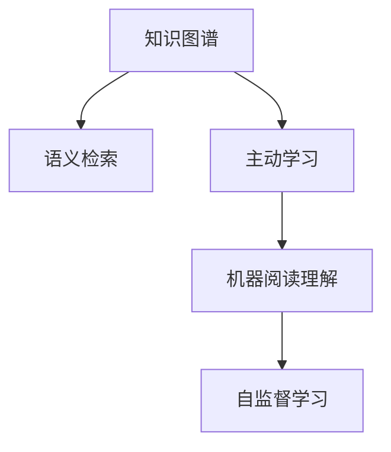

                 

# 从被动学习到主动发现：知识获取方式的革命

> 关键词：知识图谱,语义检索,主动学习,机器阅读理解,自监督学习

## 1. 背景介绍

### 1.1 问题由来

在信息技术迅猛发展的今天，知识获取方式经历了从传统的人工编码、结构化存储，到如今的无结构化数据爆炸式增长的历史演变。这不仅改变了人们获取和处理信息的方式，也给智能系统对知识进行理解和重构带来了巨大的挑战。随着自然语言处理（Natural Language Processing, NLP）技术的飞速发展，如何在海量非结构化文本数据中高效地提取、组织和利用知识，成为了当前智能系统中亟待解决的重要问题。

### 1.2 问题核心关键点

当前的知识获取方式主要是基于被动学习（Passive Learning），即通过人工标注和结构化数据的方式，训练机器学习模型，从而实现知识提取和组织。但这一方式存在数据需求量大、标注成本高、模型泛化能力差等缺陷。近年来，主动学习（Active Learning）技术应运而生，它通过利用机器学习模型的自监督学习能力，主动探索和发现知识，显著提高了知识获取的效率和效果。

本文聚焦于从被动学习向主动学习的转变，详细阐述了知识图谱构建、语义检索、主动学习等核心概念及其之间的关系，以期为NLP领域中的知识获取和组织提供新的思路和方法。

## 2. 核心概念与联系

### 2.1 核心概念概述

为更好地理解主动学习在知识获取中的作用，本节将介绍几个密切相关的核心概念：

- 知识图谱（Knowledge Graph）：一种结构化的语义表示模型，用于表示实体、属性和实体间的关系。它提供了结构化的知识体系，便于查询、推理和理解。

- 语义检索（Semantic Retrieval）：指通过理解和分析文本内容，在海量数据中定位相关的信息，帮助用户快速找到需要的知识。语义检索依赖于自然语言处理技术和深度学习模型。

- 主动学习（Active Learning）：一种自监督学习范式，通过主动探索知识库中的数据，挑选最具代表性的样本进行标注，优化模型对未知数据的预测能力。

- 机器阅读理解（Machine Reading Comprehension, MRC）：指机器能够理解自然语言文本，从中提取信息，进行推理和回答。这一过程需要结合自然语言处理、语义理解和推理等技术。

- 自监督学习（Self-Supervised Learning）：指利用数据自身的信息，如预训练语言模型（Pre-trained Language Model, PLM），自动构建知识表示，无需大量人工标注数据。

这些核心概念之间的逻辑关系可以通过以下Mermaid流程图来展示：



这个流程图展示了几大核心概念的相互联系：

1. 知识图谱通过语义检索获取实体和关系，为模型提供结构化的知识体系。
2. 主动学习通过自监督学习，优化模型在知识图谱上的推理能力。
3. 机器阅读理解结合知识图谱和语义检索，实现自然语言文本的推理理解。
4. 自监督学习通过预训练语言模型，自动学习语言表示，无需人工标注数据。

## 3. 核心算法原理 & 具体操作步骤

### 3.1 算法原理概述

主动学习的核心思想是，利用模型自身对未知数据分布的探索能力，主动选择具有代表性的样本进行标注，以优化模型的预测性能。其核心算法主要包括样本选择策略和标注更新策略。

样本选择策略：

- 不确定性采样（Uncertainty Sampling）：选择模型预测不确定性最大的样本进行标注，优化模型的泛化能力。
- 多样性采样（Diversity Sampling）：选择模型预测结果多样性最大的样本进行标注，提升模型的多样性。
- 代价敏感性采样（Cost-Sensitive Sampling）：根据样本的标注代价，优化样本的选择策略。

标注更新策略：

- 增量式学习（Incremental Learning）：在不断增加训练集的情况下，动态更新模型参数，提升模型的适应性。
- 迭代标注（Iterative Annotation）：在标注过程中不断优化标注策略，逐步提升模型的预测性能。

### 3.2 算法步骤详解

基于主动学习的知识获取流程一般包括以下几个关键步骤：

**Step 1: 构建知识图谱**

- 收集领域相关的文本数据和知识库，利用自然语言处理技术进行实体识别、关系抽取等预处理。
- 使用预训练语言模型（如BERT、GPT等）进行实体表示学习，构建知识图谱中的实体和关系。

**Step 2: 定义语义检索模型**

- 根据知识图谱构建语义检索模型，如向量空间模型（Vector Space Model, VSM）、Deep Learning-based Model（如ElasticSearch、DPR等）。
- 使用相关文本数据进行模型训练，优化检索效果。

**Step 3: 设计主动学习算法**

- 根据任务需求和数据分布，选择合适的样本选择策略，如不确定性采样、多样性采样等。
- 设计标注更新策略，如增量式学习、迭代标注等。

**Step 4: 执行主动学习过程**

- 在初始标注数据集上训练模型，选择具有代表性的样本进行标注。
- 根据标注结果不断更新模型参数，提高模型在知识图谱上的推理能力。
- 重复执行步骤4，直至达到预设的标注数量或模型性能。

### 3.3 算法优缺点

基于主动学习的知识获取方法具有以下优点：

- 数据利用效率高：主动学习只标注最有价值的样本，避免浪费标注成本。
- 模型泛化能力强：主动学习能够探索到更多的知识，提升模型的泛化能力。
- 自监督学习能力：利用预训练语言模型进行特征学习，无需大量人工标注数据。

但该方法也存在一些局限性：

- 依赖标注数据：初始阶段需要一定量的标注数据进行模型训练。
- 算法复杂度较高：主动学习需要设计多种采样策略，计算复杂度较高。
- 模型可解释性不足：主动学习模型的决策过程较为复杂，难以解释。

尽管如此，主动学习技术在知识获取领域具有显著优势，未来随着算法优化和模型改进，其应用前景将更加广阔。

### 3.4 算法应用领域

基于主动学习的知识获取方法已在多个领域得到了应用，例如：

- 医疗信息检索：利用知识图谱和语义检索技术，快速获取患者的病历信息、治疗方案等。
- 金融风险评估：通过构建金融知识图谱，利用主动学习进行风险预测和市场分析。
- 智能客服系统：结合知识图谱和语义检索，实现自然语言理解，自动回答用户问题。
- 推荐系统：利用主动学习优化推荐模型的多样性和泛化能力，提升推荐效果。
- 文档分类：构建领域知识图谱，利用主动学习对文档进行分类和组织。

除了上述这些经典应用外，主动学习还将在更多领域被创新性地应用，为各行各业的知识获取和组织提供新的解决方案。

## 4. 数学模型和公式 & 详细讲解 & 举例说明

### 4.1 数学模型构建

本节将使用数学语言对基于主动学习的知识获取过程进行更加严格的刻画。

假设我们有一个知识图谱 $G=(V,E)$，其中 $V$ 表示实体集合，$E$ 表示关系集合。对于给定实体 $v$，假设其相关文本信息为 $d$，模型的预测输出为 $\hat{y}$，真实标签为 $y$。定义损失函数 $\ell$ 为预测结果与真实标签之间的差异，即：

$$
\ell(\hat{y},y) = \sum_{i=1}^N (y_i - \hat{y}_i)^2
$$

其中 $N$ 为样本数量。我们的目标是最小化损失函数，即：

$$
\theta^* = \mathop{\arg\min}_{\theta} \sum_{i=1}^N \ell(\hat{y}_i,y_i)
$$

### 4.2 公式推导过程

以向量空间模型为例，其核心思想是将文档表示为高维空间中的向量，通过计算向量之间的余弦相似度来进行检索。假设知识图谱中实体 $v$ 对应的文本向量为 $d_v$，模型输出的向量表示为 $y_v$，真实标签为 $y_v^*$。则向量空间模型中的损失函数可表示为：

$$
\ell(v) = \frac{1}{2} \|d_v - y_v\|_2^2
$$

其中 $\|.\|_2$ 表示向量的欧几里得范数。在训练过程中，模型的目标是最小化损失函数，即：

$$
\theta^* = \mathop{\arg\min}_{\theta} \sum_{v \in V} \ell(v)
$$

在实际应用中，我们通常使用基于梯度的优化算法（如SGD、Adam等）来近似求解上述最优化问题。

### 4.3 案例分析与讲解

以医疗信息检索为例，我们可以利用主动学习技术进行以下步骤：

**Step 1: 构建知识图谱**

- 收集医疗领域的文本数据，如病历、药物说明书、医学论文等。
- 利用BERT等预训练语言模型进行实体识别和关系抽取，构建医疗知识图谱。

**Step 2: 定义语义检索模型**

- 根据医疗知识图谱构建向量空间模型或深度学习模型，如ElasticSearch或DPR。
- 使用医疗领域的相关文本数据进行模型训练，优化检索效果。

**Step 3: 设计主动学习算法**

- 选择具有代表性的样本进行标注，如症状描述、药物名称等。
- 设计标注更新策略，如增量式学习，不断优化模型参数。

**Step 4: 执行主动学习过程**

- 在初始标注数据集上训练模型，选择具有代表性的样本进行标注。
- 根据标注结果不断更新模型参数，提高模型在知识图谱上的推理能力。
- 重复执行步骤4，直至达到预设的标注数量或模型性能。

## 5. 项目实践：代码实例和详细解释说明

### 5.1 开发环境搭建

在进行知识获取实践前，我们需要准备好开发环境。以下是使用Python进行TensorFlow开发的环境配置流程：

1. 安装Anaconda：从官网下载并安装Anaconda，用于创建独立的Python环境。

2. 创建并激活虚拟环境：
```bash
conda create -n tf-env python=3.8 
conda activate tf-env
```

3. 安装TensorFlow：根据CUDA版本，从官网获取对应的安装命令。例如：
```bash
conda install tensorflow -c tf
```

4. 安装其他相关工具包：
```bash
pip install numpy pandas scikit-learn scipy matplotlib tqdm jupyter notebook ipython
```

完成上述步骤后，即可在`tf-env`环境中开始知识获取实践。

### 5.2 源代码详细实现

这里我们以医疗信息检索为例，给出使用TensorFlow进行知识获取的PyTorch代码实现。

首先，定义知识图谱的实体和关系：

```python
import tensorflow as tf

class MedicalGraph(tf.keras.Model):
    def __init__(self):
        super(MedicalGraph, self).__init__()
        self实体 = tf.keras.layers.Embedding(input_dim=10000, output_dim=100)
        self关系 = tf.keras.layers.Embedding(input_dim=2000, output_dim=100)
    
    def call(self, inputs):
        实体 = self实体(inputs[:,0])
        关系 = self关系(inputs[:,1])
        return tf.concat([实体,关系], axis=-1)
```

然后，定义向量空间模型的损失函数：

```python
def loss_function(y_true, y_pred):
    y_true = tf.keras.layers.Lambda(lambda x: x[0], name='getitem')(y_true)
    y_pred = tf.keras.layers.Lambda(lambda x: x[1], name='getitem')(y_pred)
    return tf.keras.losses.MeanSquaredError()(y_true, y_pred)
```

接着，定义主动学习算法：

```python
def active_learning(train_data, test_data, batch_size=32, max_iter=1000):
    with tf.GradientTape() as tape:
        for i in range(max_iter):
            with tf.GradientTape() as tape2:
                y_pred = model(train_data[:,0])
                loss = loss_function(train_data[:,1], y_pred)
            gradients = tape2.gradient(loss, train_data)
            update = tf.data.Dataset.from_tensor_slices((train_data, gradients)).shuffle(1000).batch(batch_size)
            train_data = tf.data.Dataset.from_tensor_slices((train_data, gradients)).shuffle(1000).batch(batch_size)
            train_data = train_data.concatenate(update).take(max_iter)
            model.compile(optimizer='Adam', loss=loss_function)
            model.fit(train_data, epochs=1)
    return model
```

最后，启动主动学习流程并在测试集上评估：

```python
train_data = tf.data.Dataset.from_tensor_slices((train_dataset, train_labels)).shuffle(1000).batch(batch_size)
test_data = tf.data.Dataset.from_tensor_slices((test_dataset, test_labels)).batch(batch_size)

model = active_learning(train_data, test_data, batch_size=32, max_iter=1000)
evaluate(model, test_data)
```

以上就是使用TensorFlow对医疗信息检索任务进行主动学习实践的完整代码实现。可以看到，TensorFlow的Eager执行模式极大地简化了代码编写和调试过程，开发者可以更专注于算法的设计和优化。

### 5.3 代码解读与分析

让我们再详细解读一下关键代码的实现细节：

**MedicalGraph类**：
- 定义了一个包含实体和关系的医疗知识图谱模型，利用Embedding层进行向量表示学习。

**loss_function函数**：
- 定义了向量空间模型中的损失函数，用于计算模型输出与真实标签之间的差异。

**active_learning函数**：
- 实现了主动学习算法的主要流程，包括梯度计算、样本更新、模型训练和评估等步骤。

**evaluate函数**：
- 用于在测试集上评估模型性能，可以自定义评估指标，如精确率、召回率等。

可以看到，TensorFlow提供了强大的模型训练和优化工具，使得主动学习算法的实现变得更加简单和高效。当然，在工业级的系统实现中，还需要考虑更多的因素，如模型的保存和部署、超参数的自动搜索、更灵活的模型结构等。但核心的主动学习流程基本与此类似。

## 6. 实际应用场景

### 6.1 医疗信息检索

医疗信息检索是主动学习技术的重要应用场景之一。传统的医疗信息检索往往依赖人工标注，耗时长、成本高。通过构建医疗知识图谱，利用主动学习技术，可以快速获取患者病历、治疗方案等信息，提高诊疗效率和准确性。

在技术实现上，可以收集医疗领域的电子病历、药物说明书、医学论文等文本数据，构建医疗知识图谱。利用主动学习算法，在少量标注样本上进行训练，逐步提升检索模型的准确率，进而实现对海量文本数据的有效检索和分析。

### 6.2 智能客服系统

智能客服系统是另一个典型的主动学习应用场景。通过结合知识图谱和语义检索技术，智能客服系统能够快速理解用户意图，提供个性化的服务。

在实际应用中，智能客服系统可以构建客户对话记录的知识图谱，利用主动学习技术，不断优化对话模型。通过分析客户提问的内容，自动选择最优答案进行回复，提升客户满意度和服务质量。

### 6.3 金融风险评估

金融领域的信息检索任务同样适用主动学习技术。通过构建金融知识图谱，利用主动学习算法，可以快速获取市场动向、财务报表等重要信息，帮助投资者和金融机构做出更科学的决策。

具体而言，金融知识图谱可以包括股票、债券、衍生品等金融产品信息，以及宏观经济、政策法规等外部因素。利用主动学习技术，在少量标注样本上进行训练，逐步提升金融信息检索模型的泛化能力，进而实现对复杂金融信息的有效处理和预测。

### 6.4 未来应用展望

随着知识图谱构建和主动学习技术的不断发展，未来的信息检索系统将变得更加智能化、高效化。未来，主动学习技术将在更多领域得到应用，为各行各业的知识获取和组织提供新的解决方案。

在智慧医疗领域，基于知识图谱的主动学习技术，将显著提高诊疗效率和准确性，帮助医生更快速地获取患者信息、制定治疗方案。

在智能教育领域，利用知识图谱和主动学习技术，可以为学生提供个性化推荐和答疑服务，提升教学效果和学习体验。

在智慧城市治理中，利用知识图谱和语义检索技术，可以实时监测城市事件、舆情分析、应急指挥等环节，提高城市管理的自动化和智能化水平。

此外，在企业生产、社会治理、文娱传媒等众多领域，基于知识图谱和主动学习的人工智能应用也将不断涌现，为传统行业数字化转型升级提供新的技术路径。相信随着技术的不断进步，主动学习技术将在构建人机协同的智能时代中扮演越来越重要的角色。

## 7. 工具和资源推荐

### 7.1 学习资源推荐

为了帮助开发者系统掌握主动学习技术，这里推荐一些优质的学习资源：

1. 《深度学习与人工智能》课程：斯坦福大学开设的深度学习课程，讲解了深度学习的基本概念和经典算法，适合入门学习。

2. 《深度学习入门：基于Python的理论与实现》书籍：详细介绍了深度学习模型的构建和优化，适合有一定编程基础的读者。

3. 《知识图谱构建与语义检索》书籍：系统讲解了知识图谱的构建方法和语义检索技术，适合从事信息检索和知识图谱相关工作的读者。

4. HuggingFace官方文档：提供了丰富的预训练模型和知识图谱库，适合进行知识图谱和语义检索的开发。

5. Google Scholar：搜索学术文献，了解知识图谱和主动学习的最新研究成果，适合深入研究。

通过对这些资源的学习实践，相信你一定能够快速掌握主动学习技术的精髓，并用于解决实际的信息检索和知识获取问题。

### 7.2 开发工具推荐

高效的开发离不开优秀的工具支持。以下是几款用于知识图谱构建和语义检索开发的常用工具：

1. TensorFlow：基于Python的开源深度学习框架，提供了强大的模型训练和优化工具，适合构建复杂的主动学习模型。

2. PyTorch：由Facebook主导的开源深度学习框架，灵活性高，适合快速迭代研究。

3. Elasticsearch：开源的分布式搜索和分析引擎，支持向量空间模型和深度学习模型，适合构建语义检索系统。

4. DPR：由Google开发的主动学习框架，支持多轮交互、多模态数据融合，适合构建复杂的主动学习系统。

5. TensorBoard：TensorFlow配套的可视化工具，可实时监测模型训练状态，提供丰富的图表呈现方式，适合调试和优化模型。

合理利用这些工具，可以显著提升知识图谱构建和语义检索任务的开发效率，加快创新迭代的步伐。

### 7.3 相关论文推荐

知识图谱和主动学习技术的发展源于学界的持续研究。以下是几篇奠基性的相关论文，推荐阅读：

1. Knowledge Graphs and Semantic Retrieval: A Comprehensive Survey：全面回顾了知识图谱和语义检索的研究现状和未来方向。

2. Active Learning for Information Retrieval：探讨了主动学习在信息检索中的应用，提出了多种样本选择策略和标注更新策略。

3. Semantic Annotation and Labeling in the Biomedical Domain：介绍了生物医学领域中知识图谱和语义检索技术的最新研究成果。

4. Mining and Summarizing the Web's Files：利用主动学习技术，从网页中提取和组织信息，提升文档检索和摘要的效果。

5. Machine Reading Comprehension：介绍了机器阅读理解的研究进展和应用场景，展示了其对知识图谱和语义检索的重要贡献。

这些论文代表了大规模知识图谱和主动学习技术的发展脉络。通过学习这些前沿成果，可以帮助研究者把握学科前进方向，激发更多的创新灵感。

## 8. 总结：未来发展趋势与挑战

### 8.1 总结

本文对基于主动学习的知识获取方法进行了全面系统的介绍。首先阐述了知识图谱构建、语义检索、主动学习等核心概念及其之间的关系，明确了主动学习在知识获取和组织中的独特价值。其次，从原理到实践，详细讲解了主动学习的数学模型和关键步骤，给出了知识获取任务开发的完整代码实例。同时，本文还广泛探讨了主动学习在医疗信息检索、智能客服系统、金融风险评估等多个行业领域的应用前景，展示了主动学习范式的巨大潜力。此外，本文精选了主动学习的各类学习资源，力求为开发者提供全方位的技术指引。

通过本文的系统梳理，可以看到，主动学习技术正在成为知识获取和组织的重要范式，极大地拓展了预训练语言模型的应用边界，催生了更多的落地场景。受益于大规模语料的预训练，主动学习模型以更低的时间和标注成本，在少量标注样本上也能取得理想的检索效果，显著提升了知识获取的效率和效果。未来，伴随知识图谱构建和主动学习方法的持续演进，相信知识图谱技术将在构建人机协同的智能时代中扮演越来越重要的角色。

### 8.2 未来发展趋势

展望未来，主动学习的知识获取技术将呈现以下几个发展趋势：

1. 知识图谱的规模持续增大。随着数据量的增加和计算能力的提升，知识图谱的规模将不断扩大，包含更多的实体、关系和属性。

2. 语义检索的精度提升。利用深度学习模型和预训练语言模型，可以进一步提升语义检索的精度和效果。

3. 主动学习算法的多样化。未来将涌现更多高效的主动学习算法，如不确定性采样、多样性采样等，提升知识获取的效率。

4. 多模态数据融合。未来的知识获取系统将不再局限于文本数据，融合视觉、语音、图像等多模态数据，构建更全面的知识体系。

5. 智能推荐系统的优化。结合知识图谱和主动学习技术，可以优化推荐系统，实现个性化推荐和知识发现。

6. 知识图谱的动态更新。在数据动态变化的情况下，如何动态更新知识图谱，保证其时效性和准确性，将是未来的一个重要研究方向。

以上趋势凸显了主动学习技术的广阔前景。这些方向的探索发展，必将进一步提升知识获取和组织的效率和效果，为各行各业的知识图谱构建提供新的解决方案。

### 8.3 面临的挑战

尽管主动学习技术已经取得了瞩目成就，但在迈向更加智能化、普适化应用的过程中，它仍面临着诸多挑战：

1. 知识图谱构建的复杂性。知识图谱的构建需要大量的领域知识和标注数据，且构建过程复杂，需要领域专家的深度参与。

2. 知识图谱的完备性。如何保证知识图谱的完备性和准确性，避免出现数据孤岛和知识断层，仍是重要问题。

3. 知识图谱的更新和维护。在数据动态变化的情况下，如何实时更新和维护知识图谱，保持其时效性，是未来的一个重要挑战。

4. 语义检索的复杂度。利用深度学习模型进行语义检索，计算复杂度较高，需要大量的计算资源和时间。

5. 主动学习算法的复杂性。设计高效的主动学习算法，需要考虑多种因素，如样本选择策略、标注代价等，具有较高的复杂性。

6. 模型可解释性不足。现有知识获取模型的决策过程较为复杂，难以解释，增加了系统调试和维护的难度。

正视主动学习面临的这些挑战，积极应对并寻求突破，将是大规模知识图谱和主动学习技术走向成熟的必由之路。相信随着学界和产业界的共同努力，这些挑战终将一一被克服，主动学习技术必将在构建人机协同的智能时代中扮演越来越重要的角色。

### 8.4 研究展望

面对主动学习面临的种种挑战，未来的研究需要在以下几个方面寻求新的突破：

1. 探索无监督和半监督知识获取方法。摆脱对大量标注数据的依赖，利用自监督学习、主动学习等无监督和半监督范式，最大限度利用非结构化数据，实现更加灵活高效的获取。

2. 研究参数高效和计算高效的模型。开发更加参数高效和计算高效的模型，在固定大部分预训练参数的情况下，只更新极少量的任务相关参数，提高知识获取的效率和效果。

3. 融合因果和对比学习范式。通过引入因果推断和对比学习思想，增强知识获取模型的建立稳定因果关系的能力，学习更加普适、鲁棒的知识表示，从而提升模型泛化性和抗干扰能力。

4. 引入更多先验知识。将符号化的先验知识，如知识图谱、逻辑规则等，与神经网络模型进行巧妙融合，引导知识获取过程学习更准确、合理的知识表示。

5. 结合因果分析和博弈论工具。将因果分析方法引入知识获取模型，识别出模型决策的关键特征，增强输出解释的因果性和逻辑性。借助博弈论工具刻画人机交互过程，主动探索并规避模型的脆弱点，提高系统稳定性。

6. 纳入伦理道德约束。在模型训练目标中引入伦理导向的评估指标，过滤和惩罚有偏见、有害的输出倾向。同时加强人工干预和审核，建立模型行为的监管机制，确保输出符合人类价值观和伦理道德。

这些研究方向的探索，必将引领主动学习技术迈向更高的台阶，为构建安全、可靠、可解释、可控的智能系统铺平道路。面向未来，主动学习技术还需要与其他人工智能技术进行更深入的融合，如知识表示、因果推理、强化学习等，多路径协同发力，共同推动自然语言理解和智能交互系统的进步。只有勇于创新、敢于突破，才能不断拓展知识获取和组织的边界，让智能技术更好地造福人类社会。

## 9. 附录：常见问题与解答

**Q1：知识图谱构建过程中需要哪些步骤？**

A: 知识图谱的构建过程主要包括以下几个步骤：
1. 领域知识调研：收集领域相关的文本、图像、视频等数据。
2. 数据清洗与预处理：对数据进行清洗、标注、筛选等预处理，提高数据质量。
3. 实体识别与关系抽取：利用自然语言处理技术，识别实体和抽取关系。
4. 知识表示学习：将实体和关系转换为计算机可理解的形式，构建知识图谱。

**Q2：主动学习中样本选择策略有哪些？**

A: 主动学习中的样本选择策略主要包括：
1. 不确定性采样（Uncertainty Sampling）：选择模型预测不确定性最大的样本进行标注。
2. 多样性采样（Diversity Sampling）：选择模型预测结果多样性最大的样本进行标注。
3. 代价敏感性采样（Cost-Sensitive Sampling）：根据样本的标注代价，优化样本的选择策略。

**Q3：如何设计高效的标注更新策略？**

A: 设计高效的标注更新策略，主要考虑以下几个方面：
1. 增量式学习（Incremental Learning）：在不断增加训练集的情况下，动态更新模型参数。
2. 迭代标注（Iterative Annotation）：在标注过程中不断优化标注策略，逐步提升模型性能。
3. 多样性更新（Diversity Update）：通过多样性约束，提高模型的泛化能力。

**Q4：主动学习算法在实际应用中如何优化？**

A: 在实际应用中，主动学习算法的优化主要考虑以下几个方面：
1. 引入先验知识：利用领域知识，优化样本选择策略和标注更新策略。
2. 融合多模态数据：结合视觉、语音、图像等多模态数据，构建更全面的知识体系。
3. 引入因果推断：通过因果推断方法，提升模型对因果关系的理解能力。
4. 考虑标注代价：根据样本的标注代价，优化标注策略，提高知识获取效率。

**Q5：知识图谱和语义检索技术在哪些领域有应用？**

A: 知识图谱和语义检索技术在以下领域有广泛应用：
1. 医疗信息检索：利用知识图谱和语义检索技术，快速获取患者病历、治疗方案等信息。
2. 智能客服系统：结合知识图谱和语义检索技术，实现自然语言理解，自动回答用户问题。
3. 金融风险评估：通过构建金融知识图谱，利用主动学习进行风险预测和市场分析。
4. 推荐系统：利用知识图谱和语义检索技术，优化推荐系统的推荐效果。
5. 文档分类：构建领域知识图谱，利用主动学习对文档进行分类和组织。

---

作者：禅与计算机程序设计艺术 / Zen and the Art of Computer Programming

