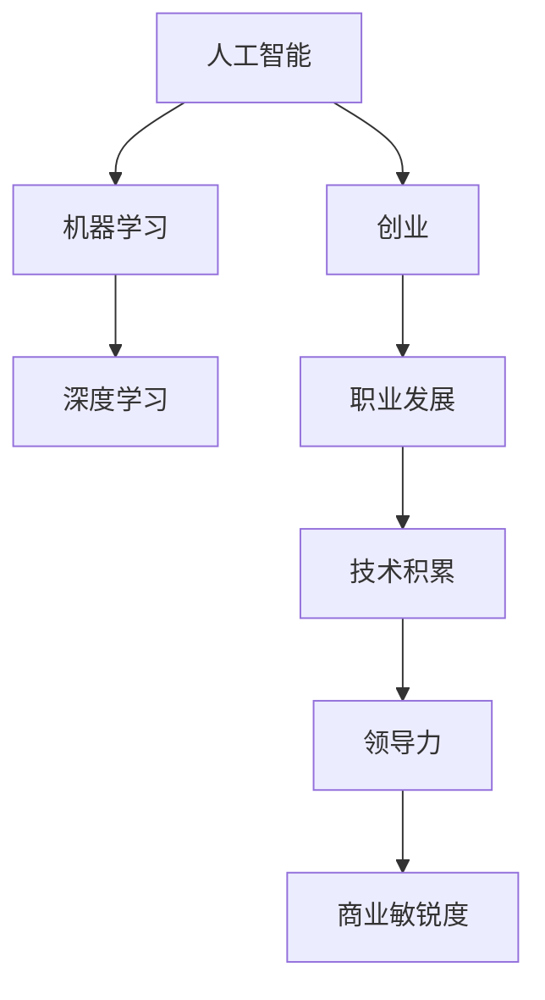

                 

# 从阿里到创业：贾扬清的职业转折

> 关键词：人工智能,机器学习,深度学习,创业,技术积累,职业发展,贾扬清

## 1. 背景介绍

### 1.1 问题由来
贾扬清，计算机科学领域的知名专家，曾在阿里巴巴担任机器学习专家，后创办人工智能公司墨镜AI。本文将深度剖析贾扬清从阿里离职到创立墨镜AI的背后动机、职业转折以及实现过程。

### 1.2 问题核心关键点
本文将围绕以下几个核心问题展开：

- 贾扬清在阿里为何选择离职？
- 他在阿里期间积累的技术经验和职业积累有哪些？
- 创业与在阿里工作的不同之处在哪里？
- 贾扬清是如何实现职业转折的？

通过了解这些核心问题，可以更好地理解贾扬清的职业发展和创业经历，以及他所面临的挑战和机遇。

## 2. 核心概念与联系

### 2.1 核心概念概述

贾扬清的职业转折涉及以下几个核心概念：

- **人工智能（AI）**：涉及深度学习、机器学习等技术，是推动贾扬清创业的关键驱动力。
- **机器学习（ML）**：在阿里工作期间，贾扬清主要研究基于数据驱动的模型训练和优化，这对创业过程中的算法设计和数据处理能力有着重要影响。
- **深度学习（DL）**：这是贾扬清技术积累的重要方向，特别是在图像识别、自然语言处理等领域的应用。
- **创业（Entrepreneurship）**：从技术专家到创业者，这一角色转变涉及团队管理、市场策略、资源调配等全方位的技能提升。
- **职业发展（Career Development）**：如何在原有基础上拓展新的职业路径，实现个人和团队价值最大化。

这些概念之间存在着密切的联系：

1. 在阿里工作期间的技术积累，为贾扬清的创业提供了坚实的技术基础。
2. 创业过程中，贾扬清需要将这些技术知识转化为实际的商业解决方案。
3. 职业发展不仅需要技术技能，还需要领导力和商业敏锐度。

这些概念通过以下Mermaid流程图展示：



通过这个流程图，可以看出，人工智能和机器学习技术是创业和职业发展的重要支撑，而领导力和商业敏锐度则是在这些技术基础上，创业成功所不可或缺的。

## 3. 核心算法原理 & 具体操作步骤
### 3.1 算法原理概述

在阿里期间，贾扬清主要研究深度学习算法，特别是在计算机视觉和自然语言处理领域。他的工作涉及以下几个方面：

1. **深度神经网络（DNN）**：通过堆叠多个神经网络层，实现复杂的非线性映射，提升模型性能。
2. **卷积神经网络（CNN）**：在图像识别任务中，使用卷积层捕捉图像局部特征，池化层提取特征，最后通过全连接层进行分类。
3. **循环神经网络（RNN）**：用于处理序列数据，如自然语言处理中的文本生成和机器翻译。
4. **注意力机制（Attention Mechanism）**：通过动态分配注意力，在文本生成和机器翻译中提升模型效果。

这些算法构成了贾扬清在阿里期间的技术积累，也为他的创业提供了坚实的基础。

### 3.2 算法步骤详解

创业过程中，贾扬清的技术工作主要集中在以下几个步骤：

1. **市场调研**：分析市场需求，确定潜在客户群体，选择合适的业务切入点。
2. **产品设计**：结合深度学习技术，设计符合市场需求的产品原型。
3. **模型训练**：使用机器学习算法，对产品原型进行优化和调整。
4. **部署和测试**：将优化后的模型部署到实际应用中，并进行性能测试和优化。
5. **市场推广**：通过市场策略，推广产品，获取用户反馈，持续优化产品。

这些步骤展示了贾扬清如何将技术积累转化为商业价值的过程。

### 3.3 算法优缺点

贾扬清的创业过程，从技术积累到商业应用，具有以下优缺点：

**优点**：

1. **技术背景扎实**：在阿里期间的技术积累为创业提供了坚实的技术基础。
2. **算法能力强**：深度学习算法的应用经验，使得贾扬清在产品设计和优化方面具有明显优势。
3. **市场敏锐度**：在阿里期间积累了丰富的市场经验，能够准确把握市场需求。

**缺点**：

1. **创业压力大**：从技术专家到创业者，角色的转变需要面对更大的压力和挑战。
2. **资源有限**：初创企业资源有限，需要灵活调配资源，平衡技术研发和市场推广。
3. **客户沟通难度**：从技术细节到商业解决方案的转换，需要花费时间和精力与客户沟通。

### 3.4 算法应用领域

贾扬清的技术积累和创业实践，涉及多个应用领域：

- **计算机视觉**：利用CNN等算法，在图像识别、视频分析等方向取得突破。
- **自然语言处理（NLP）**：通过RNN和注意力机制，在文本生成、机器翻译等方向提升性能。
- **智能推荐系统**：结合深度学习算法，为电商、社交媒体等平台提供个性化推荐服务。
- **智能客服**：利用自然语言处理技术，构建智能客服系统，提升客户服务效率。

## 4. 数学模型和公式 & 详细讲解 & 举例说明

### 4.1 数学模型构建

在机器学习和深度学习中，常用的数学模型包括：

- **线性回归模型**：用于处理回归问题，公式如下：

$$
y = \theta^T x + b
$$

其中，$y$ 为输出，$x$ 为输入，$\theta$ 为模型参数，$b$ 为偏置项。

- **多层感知器（MLP）**：用于处理分类和回归问题，公式如下：

$$
y = \sigma(\theta^T [\sigma(\theta_1^T x + b_1), \sigma(\theta_2^T x + b_2)])
$$

其中，$x$ 为输入，$\theta_i$ 为不同层的权重，$b_i$ 为不同层的偏置项，$\sigma$ 为激活函数。

### 4.2 公式推导过程

以线性回归为例，其推导过程如下：

假设输入数据为 $(x_i, y_i)$，其中 $x_i$ 为输入特征，$y_i$ 为对应的输出标签。

1. 首先，构建线性回归模型 $y = \theta^T x + b$。
2. 然后，通过最小二乘法求解 $\theta$ 和 $b$，使得损失函数 $J(\theta) = \frac{1}{N}\sum_{i=1}^N (y_i - (\theta^T x_i + b))^2$ 最小化。
3. 最终，得到参数 $\theta$ 和 $b$ 的解：

$$
\theta = (\frac{1}{N}X^TX)^{-1}X^Ty
$$

其中，$X$ 为输入特征矩阵，$y$ 为输出标签向量。

### 4.3 案例分析与讲解

以计算机视觉中的图像分类为例，使用卷积神经网络（CNN）进行训练和优化。

假设输入数据为 $(x_i, y_i)$，其中 $x_i$ 为图像数据，$y_i$ 为对应的分类标签。

1. 首先，构建卷积神经网络模型，包括卷积层、池化层和全连接层。
2. 通过反向传播算法，计算损失函数 $J(\theta) = \frac{1}{N}\sum_{i=1}^N (y_i - y_{pred})^2$，其中 $y_{pred}$ 为模型预测的分类结果。
3. 通过优化算法，如随机梯度下降（SGD），更新模型参数 $\theta$，使得损失函数最小化。
4. 最终，得到训练好的模型，可以用于图像分类任务。

## 5. 项目实践：代码实例和详细解释说明

### 5.1 开发环境搭建

在创业初期，贾扬清主要使用以下开发环境：

1. **Python**：作为主要编程语言，Python在数据处理和机器学习领域有着广泛应用。
2. **Jupyter Notebook**：用于数据探索、模型训练和结果展示，支持多种语言和库的集成。
3. **Git**：版本控制工具，用于代码管理和协同开发。
4. **Docker**：容器化技术，方便跨平台部署和管理。

### 5.2 源代码详细实现

以下是一个简单的线性回归代码实现示例：

```python
import numpy as np

# 定义数据
x = np.array([[1, 2, 3], [4, 5, 6]])
y = np.array([3, 6])

# 定义模型参数
theta = np.zeros((3, 1))

# 定义学习率和迭代次数
learning_rate = 0.01
num_iterations = 1000

# 梯度下降算法
for i in range(num_iterations):
    hypothesis = np.dot(x, theta)
    loss = (hypothesis - y) ** 2
    gradient = 2 * np.dot(x.T, (hypothesis - y)) / x.shape[0]
    theta = theta - learning_rate * gradient

# 输出结果
print(theta)
```

### 5.3 代码解读与分析

1. **数据定义**：使用NumPy库定义输入特征 $x$ 和输出标签 $y$。
2. **模型初始化**：定义模型参数 $\theta$，初始化为0。
3. **算法实现**：使用梯度下降算法更新模型参数，最小化损失函数。
4. **结果输出**：输出训练好的模型参数 $\theta$。

## 6. 实际应用场景

### 6.1 计算机视觉

在创业初期，贾扬清利用深度学习算法，为电商和社交媒体平台提供智能推荐和图像识别服务。例如，通过卷积神经网络（CNN）模型，实现了对商品图片的分类和标注，提升了推荐的准确性和用户体验。

### 6.2 自然语言处理（NLP）

在NLP领域，贾扬清团队开发了智能客服系统，通过自然语言处理技术，实现与用户的自然对话和问题解答。例如，使用循环神经网络（RNN）和注意力机制，构建对话生成模型，提高了客服系统的响应速度和准确性。

### 6.3 智能推荐系统

贾扬清团队为电商平台设计了个性化推荐系统，通过深度学习算法，根据用户行为数据和商品信息，生成推荐列表。例如，使用多层感知器（MLP）模型，预测用户对商品的兴趣，提供精准推荐。

### 6.4 未来应用展望

贾扬清的未来发展方向包括：

1. **多模态学习**：结合图像、视频、文本等多种模态数据，构建更全面、智能的信息处理系统。
2. **知识图谱**：利用知识图谱，提升模型对复杂知识点的理解和推理能力。
3. **联邦学习**：通过分布式训练和联邦学习技术，实现数据隐私保护和模型协同优化。
4. **可解释性**：开发可解释性模型，提升模型的透明性和可信度。

## 7. 工具和资源推荐

### 7.1 学习资源推荐

为了帮助创业者深入理解机器学习和深度学习技术，以下是几本推荐书籍：

1. **《机器学习实战》**：以Python语言为例，讲解了常用的机器学习算法和应用。
2. **《深度学习》**：由深度学习领域专家Yoshua Bengio等人合著，全面介绍了深度学习的基本原理和应用。
3. **《Python深度学习》**：讲解了使用Python进行深度学习开发的最佳实践。
4. **《动手学深度学习》**：由李沐等人编写，详细介绍了深度学习的理论和实践。
5. **Coursera深度学习课程**：由斯坦福大学教授Andrew Ng主讲，涵盖深度学习的基础和应用。

### 7.2 开发工具推荐

以下是几款常用的开发工具：

1. **PyTorch**：深度学习框架，支持动态图和静态图，适用于研究型和生产型应用。
2. **TensorFlow**：由Google开发的深度学习框架，支持分布式训练和模型部署。
3. **Keras**：高层次的深度学习框架，易于使用，支持多种后端引擎。
4. **Scikit-learn**：数据处理和机器学习算法库，适用于快速原型开发和实验。
5. **Jupyter Notebook**：支持多种编程语言和库的集成，适合数据探索和模型开发。

### 7.3 相关论文推荐

以下是几篇关于深度学习算法和应用的重要论文：

1. **《ImageNet Classification with Deep Convolutional Neural Networks》**：提出卷积神经网络（CNN），在图像分类任务中取得突破性成绩。
2. **《A Tutorial on Deep Learning》**：由Geoffrey Hinton等人合著，系统介绍了深度学习的理论和技术。
3. **《Attention Is All You Need》**：提出Transformer模型，改变了自然语言处理领域的范式。
4. **《Natural Language Processing (almost) from Scratch》**：由Yann LeCun等人合著，介绍了NLP的基本技术和算法。

## 8. 总结：未来发展趋势与挑战

### 8.1 总结

贾扬清的创业之路，从在阿里积累的技术经验到创办墨镜AI，展现了从技术专家到创业者角色的转变。这一过程中，他不仅将深度学习技术应用于多个领域，还经历了从技术研发到商业推广的全方位挑战。

通过本文的系统梳理，可以更好地理解贾扬清的职业转折和创业经历，以及他所面临的挑战和机遇。

### 8.2 未来发展趋势

未来，人工智能和深度学习技术将继续蓬勃发展，带来更多创新和应用。贾扬清的创业方向包括：

1. **多模态学习**：结合多种模态数据，构建更全面、智能的信息处理系统。
2. **知识图谱**：利用知识图谱，提升模型的理解和推理能力。
3. **联邦学习**：通过分布式训练和联邦学习技术，实现数据隐私保护和模型协同优化。
4. **可解释性**：开发可解释性模型，提升模型的透明性和可信度。

这些方向展示了人工智能技术在多个领域的应用前景，也将为贾扬清的创业之路带来新的机遇和挑战。

### 8.3 面临的挑战

在创业过程中，贾扬清面临以下挑战：

1. **技术积累不足**：创业初期，团队需要快速掌握新技术和算法，提升研发效率。
2. **市场竞争激烈**：人工智能领域竞争激烈，如何在众多厂商中脱颖而出，需要精准的市场定位和差异化策略。
3. **资源有限**：初创企业资源有限，需要合理调配资源，平衡技术研发和市场推广。
4. **客户沟通难度**：从技术细节到商业解决方案的转换，需要花费时间和精力与客户沟通。

### 8.4 研究展望

未来的研究需要围绕以下几个方向展开：

1. **多模态学习**：结合多种模态数据，提升模型的综合理解和推理能力。
2. **知识图谱**：利用知识图谱，构建更全面、准确的知识表示和推理系统。
3. **联邦学习**：通过分布式训练和联邦学习技术，实现数据隐私保护和模型协同优化。
4. **可解释性**：开发可解释性模型，提升模型的透明性和可信度。

通过这些研究方向的探索，贾扬清和墨镜AI团队有望在人工智能领域取得更大的突破和应用。

## 9. 附录：常见问题与解答

**Q1：贾扬清在阿里工作期间积累了哪些技术经验？**

A: 在阿里工作期间，贾扬清积累了以下技术经验：

1. **深度学习算法**：特别是在计算机视觉和自然语言处理领域的应用。
2. **数据处理**：通过机器学习算法，优化和调整数据模型，提升模型性能。
3. **产品设计**：结合深度学习技术，设计符合市场需求的产品原型。
4. **模型训练**：使用机器学习算法，对产品原型进行优化和调整。
5. **市场推广**：通过市场策略，推广产品，获取用户反馈，持续优化产品。

这些技术经验为贾扬清的创业提供了坚实的技术基础。

**Q2：贾扬清如何实现从阿里到创业的职业转折？**

A: 贾扬清实现从阿里到创业的职业转折，主要经历了以下几个步骤：

1. **技术积累**：在阿里期间，积累了丰富的技术经验和行业知识。
2. **创业想法**：结合市场需求，确定潜在客户群体，选择合适的业务切入点。
3. **团队组建**：组建核心团队，包括技术专家、市场推广人员、项目经理等。
4. **产品开发**：结合深度学习技术，设计符合市场需求的产品原型。
5. **市场推广**：通过市场策略，推广产品，获取用户反馈，持续优化产品。

通过这些步骤，贾扬清成功实现了从技术专家到创业者的角色转变。

**Q3：贾扬清在创业过程中遇到了哪些困难？**

A: 在创业过程中，贾扬清遇到了以下困难：

1. **技术积累不足**：创业初期，团队需要快速掌握新技术和算法，提升研发效率。
2. **市场竞争激烈**：人工智能领域竞争激烈，需要在众多厂商中脱颖而出。
3. **资源有限**：初创企业资源有限，需要合理调配资源，平衡技术研发和市场推广。
4. **客户沟通难度**：从技术细节到商业解决方案的转换，需要花费时间和精力与客户沟通。

这些困难需要通过技术积累、市场策略、资源调配和客户沟通等多种手段来解决。

**Q4：贾扬清的未来发展方向有哪些？**

A: 贾扬清的未来发展方向包括：

1. **多模态学习**：结合多种模态数据，构建更全面、智能的信息处理系统。
2. **知识图谱**：利用知识图谱，提升模型的理解和推理能力。
3. **联邦学习**：通过分布式训练和联邦学习技术，实现数据隐私保护和模型协同优化。
4. **可解释性**：开发可解释性模型，提升模型的透明性和可信度。

通过这些方向的研究和实践，贾扬清有望在人工智能领域取得更大的突破和应用。

---

作者：禅与计算机程序设计艺术 / Zen and the Art of Computer Programming

