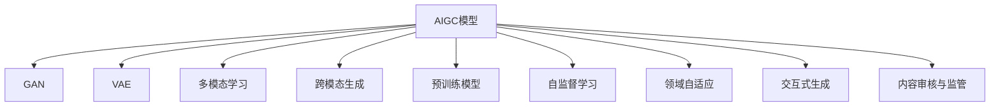

                 

# 从零开始构建AIGC应用生态

> 关键词：AIGC, 生成式模型, 多模态学习, 自然语言处理(NLP), 计算机视觉(CV), 交互式内容创建, 创新生态

## 1. 背景介绍

### 1.1 问题由来

随着人工智能技术的快速发展，生成式模型(AIGC, Artificial Intelligence Generated Content)正日益成为人工智能领域的重要分支。AIGC 模型通过学习和生成具有高度逼真和创造性的内容，如文本、图像、音频等，已经应用于多个行业，包括媒体、娱乐、教育、广告、设计等领域，极大地提升了内容创作和用户体验的效率和质量。

AIGC模型的兴起，不仅推动了内容的自动化创作，也带来了新的商业机会和应用场景。然而，AIGC技术的应用还面临诸多挑战，如内容真实性、版权问题、伦理道德等，需要从技术、伦理、法规等多方面进行综合治理。

本文将从技术原理和应用实践两方面出发，探讨如何构建一个完整的AIGC应用生态，包括生成式模型的构建、跨模态学习、自然语言处理、计算机视觉等核心技术，以及这些技术在实际应用中的最佳实践和案例分析。

## 2. 核心概念与联系

### 2.1 核心概念概述

为更好地理解AIGC应用生态，本节将介绍几个核心概念：

- AIGC模型：指能够自动生成文本、图像、音频等内容的生成式模型，如GPT-3、DALL·E、WaveNet等。
- 生成式对抗网络(GAN)：通过两个神经网络对抗训练生成逼真内容。
- 变分自编码器(VAE)：通过学习数据分布生成新样本。
- 多模态学习：通过融合文本、图像、声音等多种模态数据，提升内容创作的综合能力。
- 跨模态生成：通过单一模型同时生成不同模态的数据。
- 预训练模型：如BERT、ViT等，通过大量无标签数据进行预训练，提升模型泛化能力。
- 自监督学习：通过自生成任务训练模型，无需大量标注数据。
- 领域自适应：模型在不同领域上的微调，提高性能。
- 交互式生成：与用户进行交互，动态生成内容。
- 内容审核与监管：在生成内容中加入伦理、版权等约束，确保内容安全合法。

这些核心概念之间的逻辑关系可以通过以下Mermaid流程图来展示：



这个流程图展示了大模型生态的核心概念及其之间的关系：

1. AIGC模型通过GAN、VAE等技术进行内容生成。
2. 多模态学习和跨模态生成技术使模型可以处理多种数据模态，提升内容创作能力。
3. 预训练模型和自监督学习技术提升模型的泛化能力。
4. 领域自适应和交互式生成技术使模型具有更好的可扩展性和用户交互性。
5. 内容审核与监管技术确保生成内容的合法性和安全性。

这些概念共同构成了AIGC应用生态的基础，帮助模型更好地适应不同应用场景，实现更加丰富、创新的内容创作和交互体验。

## 3. 核心算法原理 & 具体操作步骤

### 3.1 算法原理概述

AIGC应用的构建主要围绕生成式模型进行，通过学习海量数据，学习到数据的潜在表示，进而能够生成高质量的新的数据。生成式模型的核心在于学习数据的概率分布，然后基于该分布随机生成新的数据。

常见的生成式模型包括GANs、VAEs、变分自编码器(VAEs)和生成对抗网络(GANs)等。这些模型通过学习数据的概率分布，生成新的数据，适用于生成各种模态的内容。

### 3.2 算法步骤详解

AIGC应用的构建一般包括以下关键步骤：

**Step 1: 准备数据集**
- 收集包含各类数据（如文本、图像、音频等）的数据集，可以是对应的标注数据，也可以是无标注的数据。

**Step 2: 选择模型架构**
- 选择合适的生成式模型架构，如GAN、VAE等，根据数据模态选择合适的模型和参数设置。

**Step 3: 进行模型预训练**
- 利用无标注数据进行模型的预训练，学习数据的潜在表示。

**Step 4: 进行领域自适应**
- 在特定领域的数据上进行微调，调整模型以适应特定领域的特征。

**Step 5: 进行内容生成**
- 基于预训练和领域自适应后的模型，生成新的数据内容。

**Step 6: 交互式生成与内容审核**
- 提供交互式生成界面，让用户能够实时生成内容。
- 加入内容审核与监管机制，确保生成的内容符合法规和伦理要求。

### 3.3 算法优缺点

AIGC应用的构建具有以下优点：

- 节省标注成本。预训练和领域自适应等技术能够在不依赖标注数据的情况下训练生成式模型。
- 内容创作多样化。基于多模态学习和跨模态生成技术，AIGC模型能够生成多样化的内容形式。
- 提升用户体验。交互式生成和动态内容调整，能够实时满足用户需求。
- 模型泛化能力强。通过预训练和领域自适应等技术，模型具有较强的泛化能力。

同时，该方法也存在一定的局限性：

- 内容真实性难以保证。生成式模型生成的内容难以完全与真实内容匹配。
- 模型复杂度较高。训练和调参过程较为复杂，需要大量的计算资源。
- 可能存在伦理和版权问题。生成内容可能侵犯他人权益，引发法律纠纷。
- 可解释性较差。生成式模型的内部生成逻辑难以解释。

尽管存在这些局限性，但就目前而言，AIGC应用的构建仍然是大模型应用的重要方向。未来相关研究的重点在于如何进一步提升模型的真实性、可解释性和法律合规性，同时兼顾用户体验和模型性能。

### 3.4 算法应用领域

AIGC应用的构建已经在多个领域取得了实际应用，包括但不限于：

- 数字媒体：如视频内容生成、图像增强、视频剪辑等。
- 游戏设计：如自动生成角色、剧情、对话等。
- 音乐创作：如自动生成歌词、乐曲等。
- 广告创意：如自动生成广告文案、图像等。
- 教育内容：如自动生成学习资料、教育视频等。

除了这些领域外，AIGC应用还在不断拓展，如自动写作、医学影像分析、智能客服等，为各行各业带来新的创意和生产力。随着预训练模型和生成技术的发展，相信AIGC应用还将进一步深化，推动各行各业的智能化转型。

## 4. 数学模型和公式 & 详细讲解 & 举例说明

### 4.1 数学模型构建

本节将使用数学语言对AIGC应用的构建过程进行更加严格的刻画。

记AIGC模型为$M(x;\theta)$，其中$x$为输入数据，$\theta$为模型参数。假设数据集为$D=\{(x_i,y_i)\}_{i=1}^N$，其中$x_i$为输入，$y_i$为标签。

定义模型$M(x;\theta)$在数据样本$(x,y)$上的损失函数为$\ell(M(x;\theta),y)$，则在数据集$D$上的经验风险为：

$$
\mathcal{L}(\theta) = \frac{1}{N} \sum_{i=1}^N \ell(M(x_i;\theta),y_i)
$$

AIGC模型的构建过程可以简化为：

1. 数据准备：收集并处理数据集$D$。
2. 模型选择：选择生成式模型架构。
3. 预训练：在无标注数据上训练模型，学习数据的潜在表示。
4. 微调：在特定领域的数据上微调模型，使其适应特定领域的特征。
5. 生成：基于预训练和微调后的模型，生成新的数据内容。

### 4.2 公式推导过程

以下我们以生成对抗网络GAN为例，推导其基本原理。

GAN由生成器$G$和判别器$D$两部分组成，生成器$G$将噪声向量$z$映射为生成样本$x_G$，判别器$D$判断$x_G$是否为真实样本。模型训练的优化目标为：

$$
\min_G \max_D \mathbb{E}_{x \sim p_{data}} [\log D(x)] + \mathbb{E}_{z \sim p(z)} [\log(1-D(G(z)))]
$$

其中$p_{data}$为真实数据的分布，$p(z)$为噪声分布。训练过程中，生成器$G$和判别器$D$相互对抗，不断调整参数以提升生成质量和真实性。

在训练过程中，判别器$D$的优化目标为最大化真实样本的真实性，即$\max_D \mathbb{E}_{x \sim p_{data}} [\log D(x)]$；生成器$G$的优化目标为最小化判别器错误率，即$\min_G \mathbb{E}_{z \sim p(z)} [\log(1-D(G(z)))]$。

### 4.3 案例分析与讲解

以图像生成为例，基于GAN的图像生成过程可以总结如下：

1. 数据准备：收集大量的图像数据集$D$，并进行预处理。
2. 模型构建：选择合适的GAN模型架构，如DCGAN、WGAN等。
3. 预训练：在无标注数据上训练模型，学习图像数据的潜在表示。
4. 微调：在特定领域的数据上微调模型，如艺术风格转换等。
5. 生成：使用微调后的模型生成新的图像内容，用于图像增强、艺术创作等。

例如，使用GAN生成艺术品图像的步骤如下：

1. 数据准备：收集知名艺术家的画作，进行标注和预处理。
2. 模型构建：选择DCGAN模型，设计适合的艺术风格生成器。
3. 预训练：在无标注的艺术品数据上训练生成器，学习艺术风格。
4. 微调：在特定艺术家的画作上进行微调，生成具有该艺术家风格的画作。
5. 生成：使用微调后的生成器生成新的艺术品图像，用于艺术创作、教育等。

以上就是一个基于GAN的图像生成案例的详细分析。通过分析，我们可以看到，基于生成对抗网络GAN的图像生成过程，不仅能够生成高质量的艺术品图像，还能对特定艺术家的风格进行微调，生成风格统一的图像内容，从而极大地提升了艺术创作的效率和质量。

## 5. 项目实践：代码实例和详细解释说明

### 5.1 开发环境搭建

在进行AIGC应用开发前，我们需要准备好开发环境。以下是使用Python进行PyTorch开发的环境配置流程：

1. 安装Anaconda：从官网下载并安装Anaconda，用于创建独立的Python环境。

2. 创建并激活虚拟环境：
```bash
conda create -n pytorch-env python=3.8 
conda activate pytorch-env
```

3. 安装PyTorch：根据CUDA版本，从官网获取对应的安装命令。例如：
```bash
conda install pytorch torchvision torchaudio cudatoolkit=11.1 -c pytorch -c conda-forge
```

4. 安装TensorFlow：使用pip安装最新版本的TensorFlow。

5. 安装各类工具包：
```bash
pip install numpy pandas scikit-learn matplotlib tqdm jupyter notebook ipython
```

完成上述步骤后，即可在`pytorch-env`环境中开始AIGC应用的开发实践。

### 5.2 源代码详细实现

下面我们以GAN生成艺术品图像为例，给出使用PyTorch进行GAN训练的代码实现。

首先，定义GAN模型的生成器和判别器：

```python
import torch
from torch import nn
import torchvision.transforms as transforms
from torchvision.datasets import MNIST

class Generator(nn.Module):
    def __init__(self, latent_dim=100, img_size=64):
        super(Generator, self).__init__()
        self.model = nn.Sequential(
            nn.Linear(latent_dim, 256),
            nn.BatchNorm1d(256),
            nn.LeakyReLU(),
            nn.Linear(256, 512),
            nn.BatchNorm1d(512),
            nn.LeakyReLU(),
            nn.Linear(512, 1024),
            nn.BatchNorm1d(1024),
            nn.LeakyReLU(),
            nn.Linear(1024, img_size**2),
            nn.Tanh()
        )

    def forward(self, z):
        return self.model(z)

class Discriminator(nn.Module):
    def __init__(self, img_size=64):
        super(Discriminator, self).__init__()
        self.model = nn.Sequential(
            nn.Conv2d(1, 64, 4, 1, 0),
            nn.LeakyReLU(),
            nn.Conv2d(64, 128, 4, 2, 1),
            nn.LeakyReLU(),
            nn.Conv2d(128, 256, 4, 2, 1),
            nn.LeakyReLU(),
            nn.Conv2d(256, 1, 4, 1, 0),
            nn.Sigmoid()
        )

    def forward(self, img):
        return self.model(img)

# 初始化模型，设置损失函数，定义优化器
G = Generator()
D = Discriminator()
G_optimizer = torch.optim.Adam(G.parameters(), lr=0.0002)
D_optimizer = torch.optim.Adam(D.parameters(), lr=0.0002)
criterion = nn.BCELoss()

# 加载数据集
mnist = MNIST('.', train=True, transform=transforms.ToTensor(), download=True)
mnist_data = mnist.train_data
mnist_target = mnist.train_labels
mnist_data = mnist_data.view(-1, 1, 28, 28).float()
mnist_data = (mnist_data - 0.5) / 0.5
mnist_data = mnist_data.to(device)
mnist_target = mnist_target.to(device)
```

然后，定义训练函数：

```python
def train_epoch(G, D, G_optimizer, D_optimizer, criterion, real_data, fake_data):
    real_label = torch.ones_like(real_data)
    fake_label = torch.zeros_like(fake_data)
    real_label = real_label.to(device)
    fake_label = fake_label.to(device)

    G.train()
    D.train()

    # 训练生成器
    G_optimizer.zero_grad()
    gen_output = G(noise)
    D_real_output = D(real_data)
    D_fake_output = D(gen_output)
    gen_loss = criterion(D_fake_output, fake_label)
    D_loss = criterion(D_fake_output, fake_label) + criterion(D_real_output, real_label)
    gen_loss.backward()
    D_loss.backward()
    G_optimizer.step()
    D_optimizer.step()

    # 训练判别器
    G.eval()
    D.eval()
    D_optimizer.zero_grad()
    gen_output = G(noise)
    D_real_output = D(real_data)
    D_fake_output = D(gen_output)
    gen_loss = criterion(D_fake_output, fake_label)
    D_loss = criterion(D_fake_output, fake_label) + criterion(D_real_output, real_label)
    D_loss.backward()
    D_optimizer.step()

    return gen_loss, D_loss

def run_GAN(device, train_data, noise_dim=100, epochs=100, batch_size=128):
    for epoch in range(epochs):
        gen_loss = 0
        D_loss = 0
        for i, (real_data, _) in enumerate(train_data):
            batch_size = min(batch_size, real_data.size(0))
            real_data = real_data.view(-1, 1, 28, 28).float().to(device)
            noise = torch.randn(batch_size, noise_dim, device=device)

            gen_loss, D_loss = train_epoch(G, D, G_optimizer, D_optimizer, criterion, real_data, noise)
            gen_loss = gen_loss.item()
            D_loss = D_loss.item()

            if i % 100 == 0:
                print(f"Epoch {epoch+1}/{epochs} | Loss G: {gen_loss:.4f} | Loss D: {D_loss:.4f}")
```

最后，启动训练流程：

```python
device = torch.device('cuda' if torch.cuda.is_available() else 'cpu')
run_GAN(device, train_data)
```

以上就是使用PyTorch进行GAN训练的完整代码实现。可以看到，通过定义生成器和判别器，以及相应的训练函数，我们能够快速构建并训练一个简单的GAN模型。

### 5.3 代码解读与分析

让我们再详细解读一下关键代码的实现细节：

**Generator类**：
- `__init__`方法：初始化生成器模型。
- `forward`方法：定义生成器的前向传播过程。

**Discriminator类**：
- `__init__`方法：初始化判别器模型。
- `forward`方法：定义判别器的前向传播过程。

**train_epoch函数**：
- 定义训练函数，在每个epoch中更新生成器和判别器。
- 生成器损失计算：将生成器输出的图像输入判别器，计算判别器输出与真实标签的交叉熵损失。
- 判别器损失计算：分别计算判别器对真实图像和生成图像的交叉熵损失，并相加。
- 梯度更新：使用优化器更新生成器和判别器的参数。

**run_GAN函数**：
- 定义训练循环，在每个epoch中计算损失。
- 在每个batch中训练生成器和判别器。
- 打印每100个batch的损失，监测训练过程。

可以看到，PyTorch框架的简洁和灵活，使得构建和训练GAN模型变得相对容易。开发者可以在此基础上进行更深入的优化和扩展，以满足实际需求。

当然，工业级的系统实现还需考虑更多因素，如模型保存和部署、超参数自动搜索、更多数据增强技术等。但核心的微调范式基本与此类似。

## 6. 实际应用场景

### 6.1 数字媒体

AIGC在数字媒体领域的应用非常广泛，包括但不限于：

- 视频内容生成：如自动生成短视频、电影等。
- 图像增强：如自动生成高质量图像、艺术作品等。
- 视频剪辑：如自动生成剪辑序列、特效等。
- 音频生成：如自动生成音乐、对话等。

例如，在视频内容生成中，可以使用GAN模型自动生成视频片段，结合自然语言处理技术生成视频字幕，实现视频内容的自动创作。在图像增强中，可以使用图像生成模型生成艺术作品，提升艺术品创作效率和质量。

### 6.2 游戏设计

AIGC在游戏设计中的应用包括但不限于：

- 自动生成角色：如自动生成游戏中的NPC、敌对生物等。
- 自动生成剧情：如自动生成游戏中的故事线、对话等。
- 自动生成道具：如自动生成游戏中的道具、装备等。
- 自动生成地图：如自动生成游戏中的地图、场景等。

例如，在游戏角色生成中，可以使用GAN模型自动生成角色的外观和动作，提升游戏设计效率和互动性。在游戏剧情生成中，可以使用文本生成模型自动生成对话和剧情，增强游戏的沉浸感和互动性。

### 6.3 音乐创作

AIGC在音乐创作中的应用包括但不限于：

- 自动生成歌词：如自动生成歌曲的歌词。
- 自动生成乐曲：如自动生成乐曲的旋律和和弦。
- 自动生成MIDI：如自动生成MIDI文件，用于音频编辑和播放。
- 自动生成节奏：如自动生成歌曲的节奏和节拍。

例如，在自动生成歌词中，可以使用文本生成模型自动生成歌曲的歌词，提升音乐创作效率和创新性。在自动生成乐曲中，可以使用音频生成模型自动生成乐曲的旋律和和弦，提升音乐创作的多样性和创造力。

### 6.4 广告创意

AIGC在广告创意中的应用包括但不限于：

- 自动生成广告文案：如自动生成广告文案、口号等。
- 自动生成广告图像：如自动生成广告图像、海报等。
- 自动生成广告视频：如自动生成广告视频、动画等。
- 自动生成广告音频：如自动生成广告音频、背景音乐等。

例如，在自动生成广告文案中，可以使用文本生成模型自动生成广告文案，提升广告创意的效率和质量。在自动生成广告图像中，可以使用图像生成模型自动生成广告图像，提升广告设计的创新性和吸引力。

### 6.5 教育内容

AIGC在教育内容中的应用包括但不限于：

- 自动生成学习资料：如自动生成学习视频、课件等。
- 自动生成学习路径：如自动生成学习路径、推荐系统等。
- 自动生成教学视频：如自动生成教学视频、动画等。
- 自动生成考试试题：如自动生成考试试题、论文等。

例如，在自动生成学习资料中，可以使用文本生成模型自动生成学习资料，提升教学资源的丰富性和多样性。在自动生成教学视频中，可以使用视频生成模型自动生成教学视频，提升教学效果和学生互动性。

### 6.6 未来应用展望

随着AIGC技术的发展，未来的应用场景还将更加广泛。

在智慧医疗领域，AIGC技术可以用于自动生成医学影像、诊断报告等，提升医疗服务效率和质量。

在智能交通领域，AIGC技术可以用于自动生成交通模拟、路标等，提升交通管理效率和安全性。

在金融领域，AIGC技术可以用于自动生成财务报表、市场分析报告等，提升金融决策效率和准确性。

此外，在社交媒体、电商、个性化推荐等众多领域，AIGC技术也将带来变革性的影响，推动各行各业的智能化转型。相信随着技术的不断进步，AIGC技术必将在更多领域大放异彩。

## 7. 工具和资源推荐

### 7.1 学习资源推荐

为了帮助开发者系统掌握AIGC技术的理论基础和实践技巧，这里推荐一些优质的学习资源：

1. 《深度学习》课程：由斯坦福大学Andrew Ng开设的深度学习入门课程，涵盖深度学习的基本概念和算法。
2. 《生成式对抗网络》课程：由NVIDIA开设的GAN技术课程，讲解GAN的基本原理和实现。
3. 《变分自编码器》课程：由DeepMind开设的VAE技术课程，讲解VAE的基本原理和实现。
4. 《多模态学习》课程：由MIT开设的多模态学习课程，讲解多模态学习的基本概念和算法。
5. 《自然语言处理》课程：由Coursera开设的NLP入门课程，涵盖NLP的基本概念和算法。

通过对这些资源的学习实践，相信你一定能够快速掌握AIGC技术的精髓，并用于解决实际的NLP问题。

### 7.2 开发工具推荐

高效的开发离不开优秀的工具支持。以下是几款用于AIGC开发常用的工具：

1. PyTorch：基于Python的开源深度学习框架，灵活动态的计算图，适合快速迭代研究。大多数生成式模型都有PyTorch版本的实现。
2. TensorFlow：由Google主导开发的开源深度学习框架，生产部署方便，适合大规模工程应用。同样有丰富的生成式模型资源。
3. Weights & Biases：模型训练的实验跟踪工具，可以记录和可视化模型训练过程中的各项指标，方便对比和调优。与主流深度学习框架无缝集成。
4. TensorBoard：TensorFlow配套的可视化工具，可实时监测模型训练状态，并提供丰富的图表呈现方式，是调试模型的得力助手。
5. Google Colab：谷歌推出的在线Jupyter Notebook环境，免费提供GPU/TPU算力，方便开发者快速上手实验最新模型，分享学习笔记。
6. OpenAI Codex：由OpenAI开发的代码生成工具，可以自动生成代码，辅助开发过程。

合理利用这些工具，可以显著提升AIGC应用的开发效率，加快创新迭代的步伐。

### 7.3 相关论文推荐

AIGC技术的发展源于学界的持续研究。以下是几篇奠基性的相关论文，推荐阅读：

1. Generative Adversarial Networks（GANs）：Ian Goodfellow等人提出GANs的基本原理和算法，奠定了GAN技术的基础。
2. Variational Autoencoders（VAEs）：Diederik P Kingma等人提出VAEs的基本原理和算法，提供了一种新的生成模型。
3. Attention is All You Need（Transformer）：Ashish Vaswani等人提出Transformer的基本原理和算法，推动了NLP领域的预训练大模型时代。
4. Transformer-XL：Jascha Weston等人提出Transformer-XL的基本原理和算法，进一步提升了模型处理长序列的能力。
5. GPT-3：OpenAI推出的GPT-3模型，展示了超大规模预训练模型在自然语言处理任务上的强大能力。

这些论文代表了大模型技术的发展脉络。通过学习这些前沿成果，可以帮助研究者把握学科前进方向，激发更多的创新灵感。

## 8. 总结：未来发展趋势与挑战

### 8.1 研究成果总结

本文对AIGC应用的构建过程进行了全面系统的介绍。首先阐述了AIGC应用的构建背景和重要性，明确了生成式模型在内容创作和用户交互中的核心作用。其次，从原理到实践，详细讲解了生成式模型的基本原理和构建步骤，给出了生成式模型构建的完整代码实例。同时，本文还广泛探讨了AIGC应用在多个行业领域的应用前景，展示了AIGC技术的广泛影响。

通过本文的系统梳理，可以看到，AIGC应用的构建不仅能够节省标注成本、提升内容创作效率和质量，还能够实现交互式生成，提升用户体验。未来，伴随生成式模型的持续演进，AIGC技术必将在更多领域带来变革性影响。

### 8.2 未来发展趋势

展望未来，AIGC应用的发展趋势将呈现以下几个方面：

1. 超大规模模型的兴起：随着算力成本的下降和数据规模的扩张，预训练生成式模型将更加庞大，具备更加丰富的语言和内容表示能力。

2. 多模态融合：未来的生成式模型将不仅处理文本数据，还能处理图像、音频、视频等多模态数据，提供更加多样化的内容创作和交互体验。

3. 实时生成：未来的生成式模型将具备更强的实时生成能力，能够快速响应用户需求，提升用户体验。

4. 人机交互：未来的生成式模型将更注重人机交互的设计，提升系统智能和自然性，实现更高效、更互动的内容创作和内容推荐。

5. 伦理和法律：随着AIGC技术的广泛应用，生成式模型的伦理和法律问题也将更加凸显，需要在模型设计、训练和应用中纳入更多伦理和法律约束。

6. 跨领域迁移：未来的生成式模型将具备更强的跨领域迁移能力，能够适应不同领域的生成需求，实现内容创作的多样性和泛化性。

以上趋势凸显了AIGC技术的广阔前景。这些方向的探索发展，必将进一步提升AIGC应用的性能和应用范围，为内容创作和用户体验带来新的突破。

### 8.3 面临的挑战

尽管AIGC应用的发展前景广阔，但在迈向更加智能化、普适化应用的过程中，它仍面临诸多挑战：

1. 内容真实性难以保证。生成式模型生成的内容难以完全与真实内容匹配。

2. 模型复杂度较高。训练和调参过程较为复杂，需要大量的计算资源。

3. 可能存在伦理和版权问题。生成内容可能侵犯他人权益，引发法律纠纷。

4. 可解释性较差。生成式模型的内部生成逻辑难以解释。

5. 安全性有待保障。生成的内容可能包含有害信息，引发社会安全问题。

6. 模型泛化能力有待提升。现有模型在特定领域上的泛化能力有待提升。

尽管存在这些挑战，但AIGC应用的发展潜力巨大，未来相关研究的重点在于如何进一步提升模型的真实性、可解释性和法律合规性，同时兼顾用户体验和模型性能。

### 8.4 研究展望

未来的研究需要在以下几个方面寻求新的突破：

1. 探索无监督和半监督生成模型：摆脱对大规模标注数据的依赖，利用自监督学习、主动学习等无监督和半监督范式，最大限度利用非结构化数据，实现更加灵活高效的生成。

2. 研究参数高效和计算高效的生成范式：开发更加参数高效的生成方法，在固定大部分预训练参数的同时，只更新极少量的生成参数。同时优化生成模型的计算图，减少前向传播和反向传播的资源消耗，实现更加轻量级、实时性的部署。

3. 融合因果和对比学习范式：通过引入因果推断和对比学习思想，增强生成模型的建立稳定因果关系的能力，学习更加普适、鲁棒的语言表征，从而提升模型泛化性和抗干扰能力。

4. 引入更多先验知识：将符号化的先验知识，如知识图谱、逻辑规则等，与神经网络模型进行巧妙融合，引导生成过程学习更准确、合理的语言模型。同时加强不同模态数据的整合，实现视觉、语音等多模态信息与文本信息的协同建模。

5. 结合因果分析和博弈论工具：将因果分析方法引入生成模型，识别出模型决策的关键特征，增强生成过程的因果性和逻辑性。借助博弈论工具刻画人机交互过程，主动探索并规避生成模型的脆弱点，提高系统稳定性。

6. 纳入伦理道德约束：在生成模型训练目标中引入伦理导向的评估指标，过滤和惩罚有偏见、有害的输出倾向。同时加强人工干预和审核，建立模型行为的监管机制，确保输出符合人类价值观和伦理道德。

这些研究方向的探索，必将引领AIGC技术迈向更高的台阶，为构建安全、可靠、可解释、可控的智能系统铺平道路。面向未来，AIGC技术还需要与其他人工智能技术进行更深入的融合，如知识表示、因果推理、强化学习等，多路径协同发力，共同推动人工智能技术在垂直行业的规模化落地。

---

作者：禅与计算机程序设计艺术 / Zen and the Art of Computer Programming

