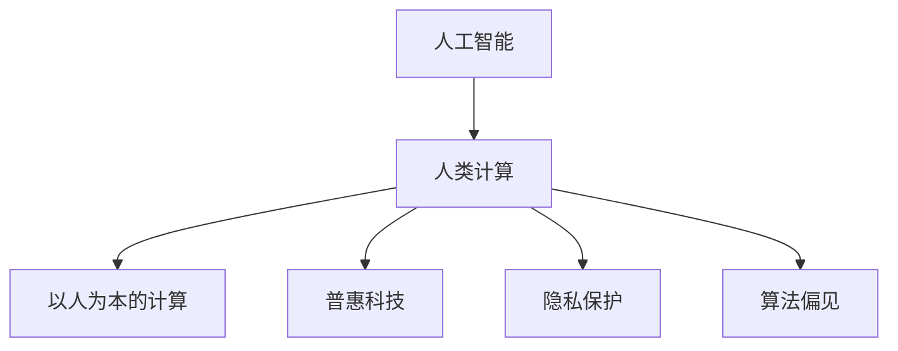

                 

# 以人为本的科技未来：人类计算的价值观

## 1. 背景介绍

### 1.1 问题由来

随着人工智能技术的飞速发展，人类计算正在迎来前所未有的变革。从最初的电子计算机到智能芯片，再到深度学习和大规模语言模型，科技的演进极大地提升了计算能力。然而，技术发展的过程中，我们也不断反思：这种强大的计算力，究竟为谁而用？

这个问题的提出，源于对技术进步可能带来的伦理、社会、心理等诸多层面的深刻思考。技术的发展和应用，如果偏离了以人为本的价值观，可能会导致一些不可逆转的负面影响，甚至引发伦理危机。

### 1.2 问题核心关键点

在人工智能时代，技术的价值取向应该以人的利益为中心。以人为本的计算，意味着技术的发展与应用必须服务于人类的福祉，尊重个体权利，保障信息安全，提升生活质量。以下是从技术、伦理和社会三个方面，探讨以人为本的科技未来的关键点：

- **技术**：以人为本的计算要求技术设计具备用户友好性，减少误操作，提供易用性。
- **伦理**：技术的实施应遵循公平、透明、可解释性原则，尊重用户隐私，防止算法偏见。
- **社会**：技术应用应促进社会公平，消除数字鸿沟，提升整体生活质量。

## 2. 核心概念与联系

### 2.1 核心概念概述

为更好地理解以人为本的科技未来，本节将介绍几个密切相关的核心概念：

- **人工智能**：以机器学习、深度学习为代表的技术，通过模拟人的智能行为，实现对数据的分析和决策。
- **人类计算**：结合人类与机器的计算能力，通过合理分配计算任务，共同完成复杂问题。
- **以人为本的计算**：指技术发展的最终目的，是提升人类生活质量，保障个体权益，造福社会。
- **普惠科技**：通过技术手段，缩小数字鸿沟，使更多人能够享受到科技进步带来的红利。
- **隐私保护**：保护个人隐私信息，防止信息泄露和滥用，确保用户数据安全。
- **算法偏见**：指算法在训练或应用过程中，由于数据偏差或模型设计不当，导致的不公平结果。

这些核心概念之间的逻辑关系可以通过以下Mermaid流程图来展示：



这个流程图展示了几大核心概念之间的联系：

1. 人工智能是人类计算的基础，通过技术手段实现问题解决。
2. 人类计算强调以人为本，确保技术应用符合人类需求。
3. 以人为本的计算是最终目标，要求技术服务于人类福祉。
4. 普惠科技通过技术手段，使更多人受益。
5. 隐私保护和算法偏见是技术应用中需要重点关注的问题，确保技术使用安全、公平。

## 3. 核心算法原理 & 具体操作步骤

### 3.1 算法原理概述

以人为本的计算，强调在技术设计和应用过程中，将人的福祉放在首位。这包括但不限于以下几个关键算法原理：

1. **可解释性(Explainability)**：确保技术的决策过程能够被解释和理解，避免“黑盒”操作。
2. **公平性(Fairness)**：保障技术应用中的公平性，避免算法偏见和歧视。
3. **透明度(Transparency)**：技术实施应透明，用户应知悉其数据如何被使用。
4. **安全性(Security)**：保护用户隐私和数据安全，防止信息泄露和滥用。
5. **用户友好性(User-Friendly)**：技术设计应简单、易用，减少用户操作负担。

### 3.2 算法步骤详解

基于上述核心算法原理，以人为本的计算可以细化为以下步骤：

**Step 1: 定义以人为本的计算目标**

明确技术应用的具体目标，考虑用户需求、社会效益等因素。例如，开发一个智能健康管理系统，除了提升个人健康状况外，还应关注数据隐私和安全性。

**Step 2: 设计以人为本的算法**

1. **可解释性**：选择易于理解的算法模型，或引入可解释的算法解释器。例如，使用决策树或线性回归等可解释性强的模型。
2. **公平性**：设计数据采样策略，避免数据集偏差；应用公平性优化算法，例如通过优化样本权重、调整阈值等方式提高公平性。
3. **透明度**：在用户界面或文档上，详细说明数据使用、模型决策依据等信息。
4. **安全性**：采用数据加密、访问控制等技术手段，保护用户数据安全。
5. **用户友好性**：简化操作流程，降低用户使用门槛。例如，使用自然语言界面，提供直观的交互界面。

**Step 3: 进行实验验证**

通过实验验证算法的公平性、准确性和可解释性，收集用户反馈，进行迭代优化。同时，进行隐私和安全测试，确保技术应用符合相关法律法规。

**Step 4: 部署和持续优化**

在实际应用场景中，进行模型部署，并根据反馈持续优化。定期更新算法模型，提升系统性能和用户满意度。

### 3.3 算法优缺点

以人为本的计算在以下方面具有优势：

- **可解释性**：提升技术决策的透明性和可信度，减少用户对技术的不信任。
- **公平性**：减少算法偏见，保障不同群体获得平等的服务。
- **用户友好性**：降低技术门槛，提升用户体验和满意度。

同时，以人为本的计算也存在一些缺点：

- **复杂性**：在设计以人为本的算法时，需要综合考虑多种因素，如隐私、公平、可解释性等，增加了算法设计的复杂性。
- **资源消耗**：一些以人为本的算法（如可解释性算法）可能需要额外的计算资源，增加系统的资源消耗。

## 4. 数学模型和公式 & 详细讲解 & 举例说明

### 4.1 数学模型构建

为了更好地探讨以人为本的计算，本文将从数学模型和公式的角度，进一步阐述这一主题。

**模型定义**：
设 $\mathcal{D}$ 为训练数据集，$X$ 为输入特征，$Y$ 为输出标签。假设模型的预测函数为 $f: \mathcal{X} \rightarrow \mathcal{Y}$。以人为本的计算模型需要满足以下条件：

1. **公平性**：$E[\mathcal{L}(f(X))] = E[\mathcal{L}(g(X))]$，其中 $g$ 是公平性优化后的模型。
2. **透明度**：模型决策过程需可解释，例如，决策树、线性回归等可解释性强的模型。
3. **安全性**：$P(X \in \mathcal{S} | Y = y) = P(X \in \mathcal{S} | Y = y')$，其中 $\mathcal{S}$ 为敏感特征集。

### 4.2 公式推导过程

以下是几个关键算法的数学推导过程：

**可解释性算法**：
1. **线性回归**：
$$
y = \beta_0 + \beta_1 x_1 + \ldots + \beta_n x_n
$$
其中 $\beta_i$ 为模型参数，$x_i$ 为输入特征，$y$ 为输出标签。
2. **决策树**：
$$
\begin{aligned}
&\text{if} \quad x_1 > t_1, \quad \text{then} \quad y \leftarrow \text{decisionTree}(x_2, \ldots, x_n) \\
&\text{else} \quad y \leftarrow \text{decisionTree}(x_2, \ldots, x_n)
\end{aligned}
$$
其中 $t_1$ 为决策树的第一层阈值。

**公平性算法**：
1. **公平性优化**：
$$
\begin{aligned}
&\minimize_{\beta} \sum_{i=1}^N (y_i - \beta_0 - \beta_1 x_{i,1} - \ldots - \beta_n x_{i,n})^2 \\
&\text{subject to} \quad E[\mathcal{L}(f(X))] = E[\mathcal{L}(g(X))]
\end{aligned}
$$
其中 $\mathcal{L}$ 为损失函数，$f$ 为原始模型，$g$ 为公平性优化后的模型。

**透明度算法**：
1. **模型解释器**：使用 SHAP（SHapley Additive exPlanations）等算法，解释模型决策。
$$
\text{SHAP values} = \sum_{j=1}^k (y_j - \hat{y}_j) \cdot \text{SHAP}(\text{feature}_j)
$$

### 4.3 案例分析与讲解

**案例1：智能健康管理系统**

开发一个智能健康管理系统，需要考虑隐私保护和公平性。假设系统收集用户的年龄、性别、体重等数据，并预测用户的健康状况。

1. **公平性**：使用公平性优化算法，避免因年龄、性别等因素导致的健康预测偏见。
2. **隐私保护**：对用户数据进行匿名化处理，保护用户隐私。
3. **透明度**：在系统界面上，详细说明数据使用方式，并提供模型解释器，解释健康预测的依据。

**案例2：智能招聘系统**

开发一个智能招聘系统，需要考虑公平性和用户友好性。假设系统根据简历信息和面试数据，预测候选人的工作表现。

1. **公平性**：确保模型公平性，避免因种族、性别等因素导致的歧视。
2. **用户友好性**：提供自然语言界面，简化简历填写流程，提升用户体验。

## 5. 项目实践：代码实例和详细解释说明

### 5.1 开发环境搭建

在进行以人为本的计算实践前，我们需要准备好开发环境。以下是使用Python进行机器学习开发的环境配置流程：

1. 安装Anaconda：从官网下载并安装Anaconda，用于创建独立的Python环境。

2. 创建并激活虚拟环境：
```bash
conda create -n myenv python=3.8 
conda activate myenv
```

3. 安装必要的库：
```bash
pip install numpy pandas scikit-learn matplotlib
```

### 5.2 源代码详细实现

以下是基于线性回归模型进行以人为本的计算实践的代码实现。

```python
import numpy as np
from sklearn.datasets import make_classification
from sklearn.linear_model import LogisticRegression
from sklearn.model_selection import train_test_split
from sklearn.metrics import accuracy_score

# 生成数据集
X, y = make_classification(n_samples=1000, n_features=5, n_informative=3, n_redundant=0, random_state=42)

# 划分训练集和测试集
X_train, X_test, y_train, y_test = train_test_split(X, y, test_size=0.2, random_state=42)

# 训练模型
model = LogisticRegression()
model.fit(X_train, y_train)

# 预测测试集
y_pred = model.predict(X_test)

# 评估模型
accuracy = accuracy_score(y_test, y_pred)
print(f"Accuracy: {accuracy:.2f}")
```

### 5.3 代码解读与分析

让我们再详细解读一下关键代码的实现细节：

**make_classification**：生成一个二分类数据集，其中包含5个特征和1个标签。

**LogisticRegression**：使用逻辑回归模型，该模型具有可解释性，可以解释其决策过程。

**train_test_split**：将数据集划分为训练集和测试集。

**accuracy_score**：计算模型在测试集上的准确率。

**代码解读**：
1. 首先生成一个二分类数据集，包含5个特征和1个标签。
2. 将数据集划分为训练集和测试集，比例为8:2。
3. 使用逻辑回归模型进行训练。
4. 对测试集进行预测，并计算模型的准确率。

## 6. 实际应用场景

### 6.1 智能健康管理系统

在智能健康管理系统中，以人为本的计算可以显著提升用户体验，保护用户隐私，提高系统的公平性和安全性。

**应用场景**：
- **隐私保护**：对用户健康数据进行匿名化处理，保护用户隐私。
- **公平性**：确保不同性别、年龄的用户获得公平的预测服务。
- **透明度**：详细说明数据使用方式，并提供模型解释器，解释健康预测的依据。

**具体实现**：
1. **隐私保护**：使用数据匿名化技术，如数据脱敏、加密等，保护用户隐私。
2. **公平性**：设计公平性优化算法，消除模型中的偏见。
3. **透明度**：在用户界面上，提供模型解释器，解释健康预测的依据。

### 6.2 智能招聘系统

在智能招聘系统中，以人为本的计算可以提升系统的公平性和用户体验。

**应用场景**：
- **公平性**：确保不同性别、种族的候选人获得公平的招聘机会。
- **用户友好性**：简化简历填写流程，提升用户体验。

**具体实现**：
1. **公平性**：使用公平性优化算法，消除模型中的偏见。
2. **用户友好性**：提供自然语言界面，简化简历填写流程。

## 7. 工具和资源推荐

### 7.1 学习资源推荐

为了帮助开发者系统掌握以人为本的计算的理论基础和实践技巧，这里推荐一些优质的学习资源：

1. **《机器学习实战》**：讲解机器学习的基本原理和实现方法，适合入门学习。
2. **《深度学习》**：讲解深度学习的基本原理和实现方法，适合深入学习。
3. **Coursera《机器学习》课程**：斯坦福大学开设的机器学习课程，提供丰富的学习资源和实践案例。
4. **Kaggle数据竞赛平台**：参与数据竞赛，提升实战能力。
5. **Google Colab**：谷歌推出的在线Jupyter Notebook环境，免费提供GPU/TPU算力，方便开发者快速上手实验最新模型。

通过对这些资源的学习实践，相信你一定能够快速掌握以人为本的计算的精髓，并用于解决实际的NLP问题。

### 7.2 开发工具推荐

高效的开发离不开优秀的工具支持。以下是几款用于机器学习开发的常用工具：

1. **PyTorch**：基于Python的开源深度学习框架，灵活动态的计算图，适合快速迭代研究。
2. **TensorFlow**：由Google主导开发的开源深度学习框架，生产部署方便，适合大规模工程应用。
3. **TensorBoard**：TensorFlow配套的可视化工具，可实时监测模型训练状态，并提供丰富的图表呈现方式。
4. **Weights & Biases**：模型训练的实验跟踪工具，可以记录和可视化模型训练过程中的各项指标。
5. **Jupyter Notebook**：数据科学和机器学习的轻量级开发环境，支持Python和其他编程语言。

合理利用这些工具，可以显著提升机器学习任务的开发效率，加快创新迭代的步伐。

### 7.3 相关论文推荐

以人为本的计算的研究源于学界的持续研究。以下是几篇奠基性的相关论文，推荐阅读：

1. **《机器学习：模型、算法与数据》**：讲解机器学习的基本原理和实现方法，适合入门学习。
2. **《深度学习》**：讲解深度学习的基本原理和实现方法，适合深入学习。
3. **《公平性、可解释性与透明性在机器学习中的重要性》**：探讨如何在机器学习中实现公平性、可解释性和透明度。
4. **《数据隐私保护与公平性算法》**：介绍如何在数据应用中实现隐私保护和公平性。

这些论文代表了大语言模型微调技术的发展脉络。通过学习这些前沿成果，可以帮助研究者把握学科前进方向，激发更多的创新灵感。

## 8. 总结：未来发展趋势与挑战

### 8.1 研究成果总结

本文对以人为本的科技未来的探索，涵盖技术、伦理和社会多个维度。通过深入分析，可以得出以下结论：

- **技术发展**：以人为本的计算要求技术具备可解释性、公平性和透明度。
- **伦理规范**：在技术应用中，应尊重用户隐私，避免算法偏见。
- **社会公平**：技术应用应促进社会公平，缩小数字鸿沟。

### 8.2 未来发展趋势

展望未来，以人为本的计算技术将呈现以下几个发展趋势：

1. **可解释性**：随着模型复杂性的增加，可解释性将成为技术应用的重要考量。
2. **公平性**：公平性算法将进一步完善，减少算法偏见，保障社会公平。
3. **隐私保护**：隐私保护技术将不断进步，保障用户数据安全。
4. **用户友好性**：技术设计将更加注重用户体验，简化操作流程。
5. **人工智能伦理**：人工智能伦理规范将逐步建立，保障技术应用的安全性和公平性。

### 8.3 面临的挑战

尽管以人为本的计算技术已经取得了一定进展，但在实现过程中仍面临诸多挑战：

1. **技术复杂性**：以人为本的计算需要综合考虑多种因素，增加了算法设计和实现复杂性。
2. **资源消耗**：一些以人为本的算法可能需要额外的计算资源，增加系统的资源消耗。
3. **隐私保护**：如何在技术应用中保护用户隐私，是一个长期的技术难题。
4. **公平性**：如何消除算法偏见，保障技术应用的公平性，还需要更多的实践验证。

### 8.4 研究展望

面向未来，以人为本的计算技术需要在以下几个方面进行深入探索：

1. **可解释性算法**：开发更多可解释性强的算法，提升技术的可信度和透明性。
2. **公平性算法**：研究和应用更多的公平性优化算法，消除算法偏见。
3. **隐私保护技术**：不断提升数据隐私保护技术，保障用户数据安全。
4. **用户友好性设计**：在技术设计中注重用户体验，简化操作流程。
5. **人工智能伦理**：建立人工智能伦理规范，确保技术应用的安全性和公平性。

这些方向的研究和发展，必将推动以人为本的计算技术迈向更高的台阶，为构建安全、可靠、可解释、可控的智能系统铺平道路。面向未来，以人为本的计算技术还需要与其他人工智能技术进行更深入的融合，多路径协同发力，共同推动自然语言理解和智能交互系统的进步。

## 9. 附录：常见问题与解答

**Q1：如何确保技术应用中的公平性？**

A: 确保技术应用中的公平性，主要通过以下方法：

1. **数据采样**：在数据采样过程中，避免数据集偏差，确保数据集的代表性。
2. **公平性优化**：使用公平性优化算法，如重加权、调整阈值等方式，消除模型中的偏见。
3. **公平性指标**：在模型评估中，使用公平性指标（如F1-score、AUC等）进行公平性验证。

**Q2：如何提升技术的可解释性？**

A: 提升技术的可解释性，主要通过以下方法：

1. **可解释性算法**：使用可解释性强的算法，如决策树、线性回归等。
2. **模型解释器**：使用SHAP（SHapley Additive exPlanations）等模型解释器，解释模型的决策过程。
3. **可视化工具**：使用可视化工具，如TensorBoard、SHAP，展示模型特征重要性等。

**Q3：如何保障用户隐私？**

A: 保障用户隐私，主要通过以下方法：

1. **数据匿名化**：对用户数据进行匿名化处理，如数据脱敏、加密等。
2. **访问控制**：使用访问控制技术，限制对用户数据的访问权限。
3. **隐私政策**：制定详细的隐私政策，明确数据使用范围和方式。

**Q4：如何设计用户友好的界面？**

A: 设计用户友好的界面，主要通过以下方法：

1. **自然语言界面**：使用自然语言界面，简化用户输入操作。
2. **交互设计**：设计直观的交互界面，减少用户操作步骤。
3. **用户反馈**：收集用户反馈，进行持续优化。

**Q5：如何处理数据中的算法偏见？**

A: 处理数据中的算法偏见，主要通过以下方法：

1. **数据采样**：在数据采样过程中，避免数据集偏差，确保数据集的代表性。
2. **公平性优化**：使用公平性优化算法，如重加权、调整阈值等方式，消除模型中的偏见。
3. **公平性指标**：在模型评估中，使用公平性指标（如F1-score、AUC等）进行公平性验证。

这些方法可以帮助开发者在技术设计和应用过程中，更好地实现以人为本的计算目标。

---

作者：禅与计算机程序设计艺术 / Zen and the Art of Computer Programming

