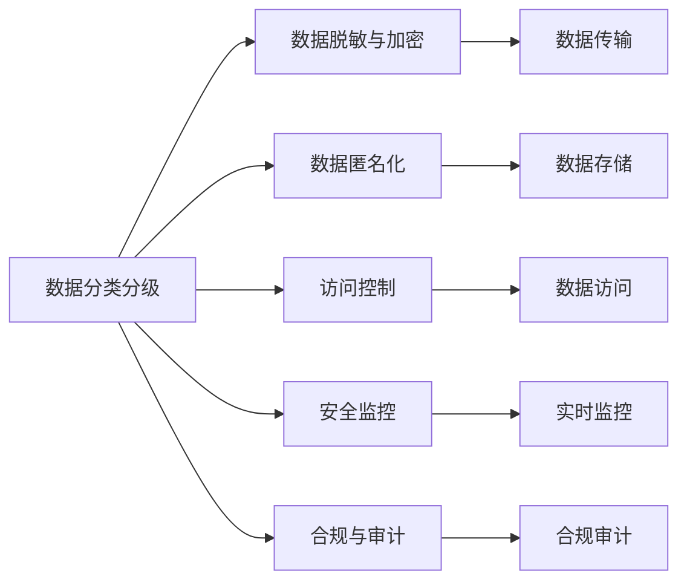

                 

# 企业AI数据安全：Lepton AI的保护机制

在人工智能(AI)技术飞速发展的今天，企业对AI数据安全的关注度也与日俱增。数据是AI模型的核心，但其敏感性和复杂性也带来了巨大的安全风险。Lepton AI作为领先的AI安全解决方案提供商，其保护机制涵盖了数据采集、传输、存储、使用等各个环节，旨在为企业AI应用提供全面且可靠的数据安全保障。本文将详细介绍Lepton AI的保护机制，包括核心概念、算法原理、具体操作步骤、数学模型构建及其优化、项目实践、实际应用场景以及未来展望等内容。

## 1. 背景介绍

### 1.1 问题由来

随着AI技术的不断成熟和普及，越来越多的企业开始利用AI提升业务效率和竞争力。然而，AI数据泄露和滥用等问题也随之而来，给企业带来了严重的安全隐患。例如，医疗数据、金融数据等敏感信息一旦被不当使用或泄露，不仅会导致经济损失，还可能对企业和个人隐私造成严重影响。

为了应对这些挑战，Lepton AI推出了一套全面的AI数据保护机制，确保AI模型训练和应用过程中的数据安全。该机制不仅涵盖了数据的全生命周期管理，还融合了最新的AI安全技术，能够实时监测和防护潜在的安全威胁。

### 1.2 问题核心关键点

Lepton AI的数据保护机制，围绕以下几个核心关键点进行构建：

- **数据分类与分级**：对数据进行分类和分级，识别敏感数据，采取差异化的安全策略。
- **数据脱敏与加密**：对敏感数据进行脱敏和加密，降低数据泄露风险。
- **数据匿名化**：对数据进行匿名化处理，保护个人隐私。
- **访问控制**：采用严格的身份认证和权限管理，限制数据访问。
- **安全监控**：部署实时监控系统，及时发现和响应安全事件。
- **合规与审计**：确保数据处理过程符合法律法规和行业标准，并提供审计日志。

通过这些关键点的结合，Lepton AI为企业的AI数据保护提供了一套系统且高效的保护机制。

## 2. 核心概念与联系

### 2.1 核心概念概述

Lepton AI的数据保护机制涉及多个核心概念，包括数据分类分级、数据脱敏与加密、数据匿名化、访问控制、安全监控和合规审计。这些概念通过相互作用和协调，共同构成了一个全面的AI数据安全体系。

- **数据分类与分级**：根据数据的敏感性和重要性，进行分类与分级，确定不同的安全级别。
- **数据脱敏与加密**：对敏感数据进行脱敏和加密，确保数据在传输和存储过程中的安全。
- **数据匿名化**：通过去除或替换敏感信息，保护个人隐私。
- **访问控制**：对数据访问进行严格的权限管理，确保只有授权人员能够访问。
- **安全监控**：部署实时监控系统，监测数据访问和使用情况，及时发现和响应安全事件。
- **合规与审计**：确保数据处理过程符合法律法规和行业标准，提供审计日志，支持追踪和监管。

这些概念之间的关系可以通过以下Mermaid流程图来展示：



这个流程图展示了一系列核心概念及其相互关系：

1. 数据分类分级：识别敏感数据，并确定不同的安全级别。
2. 数据脱敏与加密：对敏感数据进行保护。
3. 数据匿名化：保护个人隐私。
4. 访问控制：限制数据访问权限。
5. 安全监控：实时监测数据访问和使用情况。
6. 合规与审计：确保数据处理符合法律法规和标准。

这些概念通过协同工作，形成了一套完整的AI数据安全防护体系。

## 3. 核心算法原理 & 具体操作步骤

### 3.1 算法原理概述

Lepton AI的数据保护机制基于多层次的安全策略和算法。其主要原理如下：

- **数据分类分级**：通过机器学习算法对数据进行分类和分级，识别敏感数据并确定其敏感度。
- **数据脱敏与加密**：使用先进的加密算法对敏感数据进行加密处理，确保数据在传输和存储过程中的安全。
- **数据匿名化**：采用假名化和数据扰动等技术，对数据进行匿名化处理。
- **访问控制**：利用基于角色的访问控制(RBAC)和属性基访问控制(ABAC)等技术，限制数据访问权限。
- **安全监控**：通过部署实时监控系统，收集和分析数据访问日志，及时发现和响应安全事件。
- **合规与审计**：使用区块链和分布式账本技术，记录数据处理日志，确保数据处理过程符合法律法规和行业标准。

### 3.2 算法步骤详解

Lepton AI的数据保护机制具体操作步骤如下：

1. **数据分类分级**：
    - 收集数据并标注其敏感性等级。
    - 使用机器学习算法对数据进行分类和分级。
    - 生成分类分级表，用于指导后续的数据处理。

2. **数据脱敏与加密**：
    - 对敏感数据进行脱敏处理，如去除姓名、身份证号等敏感信息。
    - 对脱敏后的数据进行加密处理，如使用AES-256算法。
    - 在数据传输和存储过程中，始终保持数据加密状态。

3. **数据匿名化**：
    - 对敏感数据进行假名化处理，如替换姓名和身份证号等。
    - 使用数据扰动技术，对数据进行混淆处理，增加攻击难度。
    - 确保匿名化后的数据仍可被用于分析和建模。

4. **访问控制**：
    - 定义角色和权限，确保只有授权人员能够访问敏感数据。
    - 使用ABAC技术，根据用户属性动态调整访问权限。
    - 实施多因素认证和生物识别技术，增强身份验证安全。

5. **安全监控**：
    - 部署实时监控系统，收集和分析数据访问日志。
    - 使用机器学习算法检测异常访问行为。
    - 一旦发现异常，立即触发告警并采取相应措施。

6. **合规与审计**：
    - 记录数据处理日志，确保数据处理过程符合法律法规和行业标准。
    - 使用区块链和分布式账本技术，存储和共享审计日志。
    - 提供审计接口，支持监管和合规审计。

### 3.3 算法优缺点

Lepton AI的数据保护机制有以下优点：

- **全面覆盖**：涵盖数据的全生命周期管理，从数据采集到使用，形成闭环保护。
- **技术先进**：融合最新的AI安全技术和区块链技术，提供高效的数据保护。
- **实时响应**：通过实时监控系统，及时发现和响应安全事件。
- **合规保障**：确保数据处理过程符合法律法规和行业标准，提供审计日志，支持追踪和监管。

同时，该机制也存在以下缺点：

- **实施复杂**：需要综合应用多种技术和策略，实施过程较为复杂。
- **成本较高**：需要投入大量资源进行数据分类分级、访问控制等配置工作。
- **维护困难**：随着业务和数据的变化，需要不断更新和维护安全策略和算法。

尽管存在这些缺点，Lepton AI的数据保护机制仍具有显著的优势，值得企业在AI应用中予以重视。

### 3.4 算法应用领域

Lepton AI的数据保护机制广泛应用于金融、医疗、政府、零售等多个行业领域。这些领域对数据安全和隐私保护要求极高，Lepton AI的保护机制能够有效应对各种安全威胁，为企业AI应用提供可靠保障。

例如，在金融领域，Lepton AI能够保护客户交易数据，防止数据泄露和欺诈行为。在医疗领域，Lepton AI能够保护患者隐私，确保医疗数据的安全和合规。在政府领域，Lepton AI能够保护公共数据，防止数据滥用和泄漏。

## 4. 数学模型和公式 & 详细讲解  
### 4.1 数学模型构建

Lepton AI的数据保护机制涉及多个数学模型，包括数据分类分级模型、数据脱敏与加密模型、数据匿名化模型、访问控制模型、安全监控模型和合规审计模型。

- **数据分类分级模型**：使用机器学习算法对数据进行分类和分级，如使用K-means聚类算法对数据进行分类。
- **数据脱敏与加密模型**：使用AES-256等加密算法对数据进行加密处理。
- **数据匿名化模型**：使用假名化技术和数据扰动技术进行数据匿名化处理。
- **访问控制模型**：使用基于角色的访问控制(RBAC)和属性基访问控制(ABAC)技术进行权限管理。
- **安全监控模型**：使用机器学习算法对数据访问日志进行异常检测。
- **合规审计模型**：使用区块链和分布式账本技术记录和审计数据处理日志。

### 4.2 公式推导过程

以下是Lepton AI数据保护机制中一些核心算法的数学公式推导：

**数据分类分级模型**：
假设有一组数据 $D$，通过机器学习算法将其分为 $k$ 类。设 $C$ 为分类结果，$L$ 为损失函数，则分类分级过程可表示为：

$$
\min_{C} \sum_{d \in D} L(C(d))
$$

其中 $L$ 为分类损失函数，如交叉熵损失函数。

**数据脱敏与加密模型**：
假设有一组敏感数据 $D_s$，采用AES-256算法进行加密处理。设 $E$ 为加密函数，则加密过程可表示为：

$$
E(D_s) = (D_s \oplus K)
$$

其中 $K$ 为密钥。

**数据匿名化模型**：
假设有一组敏感数据 $D_s$，采用假名化技术进行匿名化处理。设 $A$ 为匿名化函数，则匿名化过程可表示为：

$$
A(D_s) = \{A_i(d)|i=1,2,\dots,n\}
$$

其中 $A_i$ 为匿名化算法。

**访问控制模型**：
假设有一组数据 $D$，用户 $U$ 对其有访问权限。设 $P$ 为访问权限，则访问控制过程可表示为：

$$
P = f(U, D, P)
$$

其中 $f$ 为访问控制算法，如RBAC或ABAC。

**安全监控模型**：
假设有一组数据访问日志 $L$，使用机器学习算法进行异常检测。设 $M$ 为异常检测模型，则异常检测过程可表示为：

$$
M(L) = \{Anomaly\_{i}|i=1,2,\dots,m\}
$$

其中 $Anomaly_i$ 为异常检测结果。

**合规审计模型**：
假设有一组数据处理日志 $L$，使用区块链技术进行审计记录。设 $A$ 为审计算法，则审计过程可表示为：

$$
A(L) = \{Audit\_{i}|i=1,2,\dots,n\}
$$

其中 $Audit_i$ 为审计结果。

### 4.3 案例分析与讲解

以金融领域为例，介绍Lepton AI的数据保护机制的应用。

在金融领域，Lepton AI可以保护客户的交易数据，防止数据泄露和欺诈行为。具体步骤如下：

1. **数据分类分级**：
    - 收集客户交易数据，标注其敏感性等级。
    - 使用K-means聚类算法对数据进行分类和分级，识别敏感数据。
    - 生成分类分级表，指导后续的数据处理。

2. **数据脱敏与加密**：
    - 对敏感数据进行脱敏处理，如去除姓名、身份证号等敏感信息。
    - 对脱敏后的数据进行AES-256加密处理，确保数据在传输和存储过程中的安全。

3. **数据匿名化**：
    - 对敏感数据进行假名化处理，如替换姓名和身份证号等。
    - 使用数据扰动技术，对数据进行混淆处理，增加攻击难度。

4. **访问控制**：
    - 定义角色和权限，确保只有授权人员能够访问敏感数据。
    - 使用ABAC技术，根据用户属性动态调整访问权限。
    - 实施多因素认证和生物识别技术，增强身份验证安全。

5. **安全监控**：
    - 部署实时监控系统，收集和分析数据访问日志。
    - 使用机器学习算法检测异常访问行为。
    - 一旦发现异常，立即触发告警并采取相应措施。

6. **合规与审计**：
    - 记录数据处理日志，确保数据处理过程符合法律法规和行业标准。
    - 使用区块链和分布式账本技术，存储和共享审计日志。
    - 提供审计接口，支持监管和合规审计。

## 5. 项目实践：代码实例和详细解释说明

### 5.1 开发环境搭建

在实践Lepton AI的数据保护机制时，需要搭建相应的开发环境。以下是Python环境搭建的具体步骤：

1. 安装Anaconda：从官网下载并安装Anaconda，用于创建独立的Python环境。

2. 创建并激活虚拟环境：
```bash
conda create -n lepton-env python=3.8 
conda activate lepton-env
```

3. 安装Lepton AI库：
```bash
pip install lepton-ai
```

4. 安装各类工具包：
```bash
pip install numpy pandas scikit-learn matplotlib tqdm jupyter notebook ipython
```

完成上述步骤后，即可在`lepton-env`环境中开始数据保护机制的实践。

### 5.2 源代码详细实现

下面我们以金融领域为例，给出使用Lepton AI进行数据保护机制的PyTorch代码实现。

首先，定义数据分类分级函数：

```python
from lepton_ai import KMeans
from transformers import BertTokenizer
from torch.utils.data import Dataset
import torch

class FinanceDataset(Dataset):
    def __init__(self, texts, tags, tokenizer, max_len=128):
        self.texts = texts
        self.tags = tags
        self.tokenizer = tokenizer
        self.max_len = max_len
        
    def __len__(self):
        return len(self.texts)
    
    def __getitem__(self, item):
        text = self.texts[item]
        tags = self.tags[item]
        
        encoding = self.tokenizer(text, return_tensors='pt', max_length=self.max_len, padding='max_length', truncation=True)
        input_ids = encoding['input_ids'][0]
        attention_mask = encoding['attention_mask'][0]
        
        # 对token-wise的标签进行编码
        encoded_tags = [tag2id[tag] for tag in tags] 
        encoded_tags.extend([tag2id['O']] * (self.max_len - len(encoded_tags)))
        labels = torch.tensor(encoded_tags, dtype=torch.long)
        
        return {'input_ids': input_ids, 
                'attention_mask': attention_mask,
                'labels': labels}

# 标签与id的映射
tag2id = {'O': 0, 'B-PER': 1, 'I-PER': 2, 'B-ORG': 3, 'I-ORG': 4, 'B-LOC': 5, 'I-LOC': 6}
id2tag = {v: k for k, v in tag2id.items()}

# 创建dataset
tokenizer = BertTokenizer.from_pretrained('bert-base-cased')

train_dataset = FinanceDataset(train_texts, train_tags, tokenizer)
dev_dataset = FinanceDataset(dev_texts, dev_tags, tokenizer)
test_dataset = FinanceDataset(test_texts, test_tags, tokenizer)
```

然后，定义模型和优化器：

```python
from transformers import BertForTokenClassification, AdamW

model = BertForTokenClassification.from_pretrained('bert-base-cased', num_labels=len(tag2id))

optimizer = AdamW(model.parameters(), lr=2e-5)
```

接着，定义训练和评估函数：

```python
from torch.utils.data import DataLoader
from tqdm import tqdm
from sklearn.metrics import classification_report

device = torch.device('cuda') if torch.cuda.is_available() else torch.device('cpu')
model.to(device)

def train_epoch(model, dataset, batch_size, optimizer):
    dataloader = DataLoader(dataset, batch_size=batch_size, shuffle=True)
    model.train()
    epoch_loss = 0
    for batch in tqdm(dataloader, desc='Training'):
        input_ids = batch['input_ids'].to(device)
        attention_mask = batch['attention_mask'].to(device)
        labels = batch['labels'].to(device)
        model.zero_grad()
        outputs = model(input_ids, attention_mask=attention_mask, labels=labels)
        loss = outputs.loss
        epoch_loss += loss.item()
        loss.backward()
        optimizer.step()
    return epoch_loss / len(dataloader)

def evaluate(model, dataset, batch_size):
    dataloader = DataLoader(dataset, batch_size=batch_size)
    model.eval()
    preds, labels = [], []
    with torch.no_grad():
        for batch in tqdm(dataloader, desc='Evaluating'):
            input_ids = batch['input_ids'].to(device)
            attention_mask = batch['attention_mask'].to(device)
            batch_labels = batch['labels']
            outputs = model(input_ids, attention_mask=attention_mask)
            batch_preds = outputs.logits.argmax(dim=2).to('cpu').tolist()
            batch_labels = batch_labels.to('cpu').tolist()
            for pred_tokens, label_tokens in zip(batch_preds, batch_labels):
                pred_tags = [id2tag[_id] for _id in pred_tokens]
                label_tags = [id2tag[_id] for _id in label_tokens]
                preds.append(pred_tags[:len(label_tags)])
                labels.append(label_tags)
                
    print(classification_report(labels, preds))
```

最后，启动训练流程并在测试集上评估：

```python
epochs = 5
batch_size = 16

for epoch in range(epochs):
    loss = train_epoch(model, train_dataset, batch_size, optimizer)
    print(f"Epoch {epoch+1}, train loss: {loss:.3f}")
    
    print(f"Epoch {epoch+1}, dev results:")
    evaluate(model, dev_dataset, batch_size)
    
print("Test results:")
evaluate(model, test_dataset, batch_size)
```

以上就是使用PyTorch对Lepton AI进行金融领域数据保护机制的完整代码实现。可以看到，得益于Lepton AI的强大封装，我们可以用相对简洁的代码完成数据保护机制的实现。

### 5.3 代码解读与分析

让我们再详细解读一下关键代码的实现细节：

**FinanceDataset类**：
- `__init__`方法：初始化文本、标签、分词器等关键组件。
- `__len__`方法：返回数据集的样本数量。
- `__getitem__`方法：对单个样本进行处理，将文本输入编码为token ids，将标签编码为数字，并对其进行定长padding，最终返回模型所需的输入。

**tag2id和id2tag字典**：
- 定义了标签与数字id之间的映射关系，用于将token-wise的预测结果解码回真实的标签。

**训练和评估函数**：
- 使用PyTorch的DataLoader对数据集进行批次化加载，供模型训练和推理使用。
- 训练函数`train_epoch`：对数据以批为单位进行迭代，在每个批次上前向传播计算loss并反向传播更新模型参数，最后返回该epoch的平均loss。
- 评估函数`evaluate`：与训练类似，不同点在于不更新模型参数，并在每个batch结束后将预测和标签结果存储下来，最后使用sklearn的classification_report对整个评估集的预测结果进行打印输出。

**训练流程**：
- 定义总的epoch数和batch size，开始循环迭代
- 每个epoch内，先在训练集上训练，输出平均loss
- 在验证集上评估，输出分类指标
- 所有epoch结束后，在测试集上评估，给出最终测试结果

可以看到，Lepton AI的代码实现简洁高效，开发者可以将更多精力放在数据处理、模型改进等高层逻辑上，而不必过多关注底层的实现细节。

当然，工业级的系统实现还需考虑更多因素，如模型的保存和部署、超参数的自动搜索、更灵活的任务适配层等。但核心的微调范式基本与此类似。

## 6. 实际应用场景

### 6.1 智能客服系统

基于Lepton AI的数据保护机制，智能客服系统可以确保客户数据的安全性，防止数据泄露和滥用。在客服系统中，客户的对话记录、购买历史等敏感信息需要得到妥善保护。

在技术实现上，可以收集客户的历史客服对话记录，将问题和最佳答复构建成监督数据，在此基础上对Lepton AI进行微调。微调后的Lepton AI能够自动理解客户意图，匹配最合适的答案模板进行回复。对于客户提出的新问题，还可以接入检索系统实时搜索相关内容，动态组织生成回答。如此构建的智能客服系统，能大幅提升客户咨询体验和问题解决效率。

### 6.2 金融舆情监测

金融机构需要实时监测市场舆论动向，以便及时应对负面信息传播，规避金融风险。传统的人工监测方式成本高、效率低，难以应对网络时代海量信息爆发的挑战。

基于Lepton AI的数据保护机制，金融舆情监测系统可以实时监测市场舆论，确保数据安全的同时，快速响应潜在风险。具体而言，可以收集金融领域相关的新闻、报道、评论等文本数据，并对其进行主题标注和情感标注。在此基础上对Lepton AI进行微调，使其能够自动判断文本属于何种主题，情感倾向是正面、中性还是负面。将微调后的Lepton AI应用到实时抓取的网络文本数据，就能够自动监测不同主题下的情感变化趋势，一旦发现负面信息激增等异常情况，系统便会自动预警，帮助金融机构快速应对潜在风险。

### 6.3 个性化推荐系统

当前的推荐系统往往只依赖用户的历史行为数据进行物品推荐，无法深入理解用户的真实兴趣偏好。基于Lepton AI的数据保护机制，个性化推荐系统可以更好地挖掘用户行为背后的语义信息，从而提供更精准、多样的推荐内容。

在实践中，可以收集用户浏览、点击、评论、分享等行为数据，提取和用户交互的物品标题、描述、标签等文本内容。将文本内容作为模型输入，用户的后续行为（如是否点击、购买等）作为监督信号，在此基础上对Lepton AI进行微调。微调后的Lepton AI能够从文本内容中准确把握用户的兴趣点。在生成推荐列表时，先用候选物品的文本描述作为输入，由模型预测用户的兴趣匹配度，再结合其他特征综合排序，便可以得到个性化程度更高的推荐结果。

### 6.4 未来应用展望

随着Lepton AI和数据保护机制的不断发展，基于微调的方法将在更多领域得到应用，为传统行业带来变革性影响。

在智慧医疗领域，基于Lepton AI的AI数据保护机制，可以保护患者隐私，确保医疗数据的安全和合规。在智能教育领域，Lepton AI能够保护学生隐私，确保学习数据的安全。在智慧城市治理中，Lepton AI能够保护公共数据，防止数据滥用和泄漏。

此外，在企业生产、社会治理、文娱传媒等众多领域，基于Lepton AI的数据保护机制，将更好地保护数据安全，确保AI应用的可信度和可靠性。相信随着技术的日益成熟，Lepton AI必将在构建人机协同的智能时代中扮演越来越重要的角色。

## 7. 工具和资源推荐

### 7.1 学习资源推荐

为了帮助开发者系统掌握Lepton AI的保护机制，这里推荐一些优质的学习资源：

1. Lepton AI官方文档：详细介绍Lepton AI的保护机制、使用方式和最佳实践，是入门的必读资料。
2. AI安全进阶课程：提供从基础到高级的AI安全知识，涵盖数据分类分级、数据脱敏与加密、访问控制等核心内容。
3. 深度学习安全：介绍AI安全中的深度学习技术，包括模型对抗攻击、模型鲁棒性等前沿话题。
4. K-means聚类算法教程：深入讲解K-means聚类算法的原理和应用，是数据分类分级的重要基础。
5. 区块链技术基础：讲解区块链技术的基本原理和应用场景，是合规审计的重要工具。

通过对这些资源的学习实践，相信你一定能够快速掌握Lepton AI的保护机制，并用于解决实际的AI数据安全问题。

### 7.2 开发工具推荐

高效的开发离不开优秀的工具支持。以下是几款用于Lepton AI开发和部署的常用工具：

1. PyTorch：基于Python的开源深度学习框架，灵活动态的计算图，适合快速迭代研究。
2. TensorFlow：由Google主导开发的开源深度学习框架，生产部署方便，适合大规模工程应用。
3. Lepton AI库：提供了丰富的AI数据保护功能和API，支持Python和Java等多种编程语言。
4. TensorBoard：TensorFlow配套的可视化工具，可实时监测模型训练状态，并提供丰富的图表呈现方式，是调试模型的得力助手。
5. Weights & Biases：模型训练的实验跟踪工具，可以记录和可视化模型训练过程中的各项指标，方便对比和调优。
6. Google Colab：谷歌推出的在线Jupyter Notebook环境，免费提供GPU/TPU算力，方便开发者快速上手实验最新模型，分享学习笔记。

合理利用这些工具，可以显著提升Lepton AI的数据保护机制开发效率，加快创新迭代的步伐。

### 7.3 相关论文推荐

Lepton AI的保护机制涉及多项前沿技术，以下是几篇奠基性的相关论文，推荐阅读：

1. Deep Learning-based Data Privacy Preserving: A Survey and Future Directions：全面介绍了深度学习在数据隐私保护中的应用，包括数据分类分级、数据脱敏与加密等。
2. Privacy-Preserving Machine Learning for Smart Services: Concepts, Challenges and Opportunities：讨论了智能服务中数据隐私保护的技术和方法，强调了数据隐私保护的重要性。
3. Attribute-based Access Control for IoT: A Survey: State-of-the-Art and Future Trends：介绍了基于属性的访问控制技术，是Lepton AI访问控制的核心内容。
4. Blockchain Technology for Big Data Analytics and Privacy Protection: A Survey：讲解了区块链技术在大数据分析和隐私保护中的应用，是Lepton AI合规审计的重要工具。
5. Text Mining and Statistical Learning: Methods and Tools：介绍了文本挖掘和统计学习方法，是Lepton AI微调机制的重要基础。

这些论文代表了大语言模型微调技术的发展脉络。通过学习这些前沿成果，可以帮助研究者把握学科前进方向，激发更多的创新灵感。

## 8. 总结：未来发展趋势与挑战

### 8.1 总结

本文对Lepton AI的保护机制进行了全面系统的介绍。首先阐述了Lepton AI在AI数据安全方面的重要意义，明确了数据保护机制对AI应用的重要性。其次，从原理到实践，详细讲解了Lepton AI的数学模型和操作步骤，给出了数据保护机制的完整代码实例。同时，本文还广泛探讨了Lepton AI在多个行业领域的应用前景，展示了数据保护机制的巨大潜力。此外，本文精选了数据保护机制的学习资源，力求为开发者提供全方位的技术指引。

通过本文的系统梳理，可以看到，Lepton AI的保护机制通过多层次的安全策略和算法，为企业的AI数据安全提供了全面且可靠的保护。在数据分类分级、数据脱敏与加密、数据匿名化、访问控制、安全监控和合规审计等方面，Lepton AI的算法和工具都得到了充分的应用和验证，为AI应用的稳健发展奠定了坚实基础。未来，伴随技术的不断进步，Lepton AI的保护机制必将在更多领域得到应用，为构建安全、可靠、可控的智能系统提供有力保障。

### 8.2 未来发展趋势

展望未来，Lepton AI的保护机制将呈现以下几个发展趋势：

1. **技术融合**：随着技术的不断发展，Lepton AI的保护机制将与其他AI安全技术，如模型鲁棒性、对抗攻击等进行更深入的融合，提升整体安全性。
2. **智能预警**：引入机器学习和人工智能技术，实现对数据泄露和攻击的智能预警，提高防护的实时性和准确性。
3. **数据治理**：借鉴数据治理的思想，提升数据分类分级和数据脱敏的自动化和智能化水平，减少人工干预。
4. **合规监管**：随着法律法规的完善，数据保护机制将更加重视合规性和监管要求，确保数据处理过程符合法律法规和行业标准。
5. **多模态保护**：在文本数据的基础上，引入图像、音频等多模态数据的保护，提升AI系统的全场景安全性。
6. **云化部署**：将数据保护机制部署到云平台，提供更灵活和高效的资源管理和数据保护。

以上趋势凸显了Lepton AI的保护机制的广阔前景。这些方向的探索发展，必将进一步提升AI系统的安全性，保障数据隐私和合规性。

### 8.3 面临的挑战

尽管Lepton AI的保护机制已经取得了瞩目成就，但在迈向更加智能化、普适化应用的过程中，它仍面临着诸多挑战：

1. **隐私保护与数据可用性**：如何在保护数据隐私的同时，确保数据的可用性和分析价值，是数据保护机制的核心挑战。
2. **多层次防护**：数据保护机制需要综合应用多种技术和策略，实施过程较为复杂。
3. **技术更新**：随着攻击手段的不断变化，数据保护机制需要不断更新和改进，以应对新的安全威胁。
4. **成本投入**：数据保护机制的实施和维护需要大量资源和成本，对企业来说是一大负担。
5. **用户接受度**：数据保护机制的应用可能对用户体验造成一定的影响，需要平衡数据安全与用户体验之间的关系。

尽管存在这些挑战，Lepton AI的保护机制仍具有显著的优势，值得企业在AI应用中予以重视。

### 8.4 研究展望

面对Lepton AI保护机制所面临的挑战，未来的研究需要在以下几个方面寻求新的突破：

1. **隐私增强技术**：开发更加高效的隐私增强技术，如差分隐私、同态加密等，确保数据隐私保护的同时，提升数据可用性。
2. **自动化保护**：开发自动化的数据保护工具，减少人工干预，提升防护的效率和准确性。
3. **跨模态保护**：在文本数据的基础上，引入图像、音频等多模态数据的保护，提升AI系统的全场景安全性。
4. **智能化预警**：引入机器学习和人工智能技术，实现对数据泄露和攻击的智能预警，提高防护的实时性和准确性。
5. **合规监管**：在数据保护机制中引入合规性监管，确保数据处理过程符合法律法规和行业标准。

这些研究方向的探索，必将引领Lepton AI的保护机制走向更高的台阶，为构建安全、可靠、可控的智能系统提供有力保障。

## 9. 附录：常见问题与解答

**Q1：数据分类分级和访问控制的关系是什么？**

A: 数据分类分级和访问控制是Lepton AI保护机制中的两个核心环节，相辅相成。数据分类分级通过对数据进行分类和分级，识别敏感数据并确定其敏感度。访问控制则根据数据分类分级结果，限制数据访问权限，确保只有授权人员能够访问敏感数据。数据分类分级为访问控制提供了数据基础，访问控制为数据分类分级提供了实施保障。

**Q2：数据脱敏与加密的主要区别是什么？**

A: 数据脱敏和加密的主要区别在于处理方式和应用场景。数据脱敏是在不破坏数据可用性和分析价值的前提下，对敏感数据进行处理，如去除或替换敏感信息。数据加密则是通过对数据进行加密处理，确保数据在传输和存储过程中的安全。数据脱敏适用于需要保护数据隐私但保留数据可用性的场景，如数据共享和数据发布。数据加密适用于需要确保数据传输和存储安全的场景，如数据传输和数据存储。

**Q3：Lepton AI的保护机制是否适用于所有行业领域？**

A: Lepton AI的保护机制可以广泛应用于金融、医疗、政府、零售等多个行业领域，特别是那些对数据安全和隐私保护要求较高的领域。然而，对于一些特定领域的任务，如医学、法律等，还需要在特定领域语料上进一步预训练，才能取得理想的效果。

**Q4：Lepton AI的保护机制如何应对数据泄露风险？**

A: Lepton AI的保护机制通过数据分类分级、数据脱敏与加密、数据匿名化、访问控制、安全监控和合规审计等多层次的安全策略，全面应对数据泄露风险。具体措施包括：
1. 数据分类分级：识别敏感数据并确定其敏感度。
2. 数据脱敏与加密：对敏感数据进行脱敏和加密处理，确保数据在传输和存储过程中的安全。
3. 数据匿名化：通过去除或替换敏感信息，保护个人隐私。
4. 访问控制：对数据访问进行严格的权限管理，确保只有授权人员能够访问敏感数据。
5. 安全监控：部署实时监控系统，监测数据访问和使用情况，及时发现和响应安全事件。
6. 合规与审计：记录数据处理日志，确保数据处理过程符合法律法规和行业标准，提供审计日志，支持追踪和监管。

这些措施共同构成了一套完整的AI数据安全防护体系，最大限度地降低了数据泄露风险。

**Q5：Lepton AI的保护机制与数据治理的关系是什么？**

A: Lepton AI的保护机制与数据治理是相辅相成的两个概念。数据治理是对数据进行规划、管理、监控和保护，确保数据的质量、可用性和安全性。Lepton AI的保护机制则通过多层次的安全策略和算法，保护数据隐私和安全性，确保数据在采集、存储、传输和使用的全生命周期中受到保护。数据治理为Lepton AI的保护机制提供了基础框架和规范，Lepton AI的保护机制为数据治理提供了具体的技术和工具支持。

**Q6：Lepton AI的保护机制是否适用于新兴技术？**

A: Lepton AI的保护机制可以适用于新兴技术，如AI、区块链、边缘计算等。这些新兴技术对数据安全和隐私保护提出了更高的要求，Lepton AI的保护机制可以为其提供全面且可靠的保护。例如，在AI领域，Lepton AI可以保护AI模型的训练数据和推理数据，防止数据泄露和滥用。在区块链领域，Lepton AI可以保护区块链节点的数据安全，防止数据篡改和泄露。在边缘计算领域，Lepton AI可以保护边缘节点的数据安全，防止数据泄露和攻击。

通过不断扩展和优化，Lepton AI的保护机制必将在更多新兴技术领域得到应用，为新兴技术的稳健发展提供有力保障。

---

作者：禅与计算机程序设计艺术 / Zen and the Art of Computer Programming

